# Table of Content

- [Chapter 1. Introducing Continuous Delivery](#chapter-1-introducing-continuous-delivery)
- [Understanding CD](#understanding-cd)
- [The automated deployment pipeline](#the-automated-deployment-pipeline)
  * [Continuous Integration (CI)](#continuous-integration-ci)
    + [The testing matrix](#the-testing-matrix)
- [Chapter 3. Configuring Jenkins](#chapter-3-configuring-jenkins)
- [What is Jenkins?](#what-is-jenkins)
- [Installing Jenkins](#installing-jenkins)
  * [Initial configuration](#initial-configuration)
  * [Jenkins Hello World](#jenkins-hello-world)
- [Jenkins architecture](#jenkins-architecture)
  * [Master and slaves](#master-and-slaves)
  * [Scalability](#scalability)
  * [Test and production instances](#test-and-production-instances)
- [Configuring agents](#configuring-agents)
  * [Communication protocols](#communication-protocols)
  * [Setting agents](#setting-agents)
    + [Configuring permanent agents](#configuring-permanent-agents)
    + [Permanent Docker agents](#permanent-docker-agents)
      - [Configuring permanent Docker agents](#configuring-permanent-docker-agents)
    + [Jenkins Swarm agents](#jenkins-swarm-agents)
      - [Configuring Jenkins Swarm agents](#configuring-jenkins-swarm-agents)
      - [Understanding Jenkins Swarm agents](#understanding-jenkins-swarm-agents)
    + [Dynamically provisioned Docker agents](#dynamically-provisioned-docker-agents)
      - [Configuring dynamically provisioned Docker agents](#configuring-dynamically-provisioned-docker-agents)
      - [Understanding dynamically provisioned Docker agents](#understanding-dynamically-provisioned-docker-agents)
    + [Testing agents](#testing-agents)
- [Custom Jenkins images](#custom-jenkins-images)
  * [Building the Jenkins slave](#building-the-jenkins-slave)
  * [Building the Jenkins master](#building-the-jenkins-master)
- [Configuration and management](#configuration-and-management)
  * [Plugins](#plugins)
  * [Security](#security)
  * [Backup](#backup)
- [Chapter 4. Continuous Integration Pipeline](#chapter-4-continuous-integration-pipeline)
  * [The pipeline structure](#the-pipeline-structure)
  * [Multi-stage Hello World](#multistage-hello-world)
  * [The pipeline syntax](#the-pipeline-syntax)
    + [Sections](#sections)
    + [Directives](#directives)
    + [Steps](#steps)
- [The commit pipeline](#the-commit-pipeline)
  * [Checkout](#checkout)
    + [Creating a checkout stage](#creating-a-checkout-stage)
  * [Compile](#compile)
    + [Creating a compile stage](#creating-a-compile-stage)
    + [Creating a unit test stage](#creating-a-unit-test-stage)
    + [Jenkinsfile](#jenkinsfile)
      - [Creating the Jenkinsfile](#creating-the-jenkinsfile)
    + [Running the pipeline from Jenkinsfile](#running-the-pipeline-from-jenkinsfile)
- [Code-quality stages](#codequality-stages)
  * [Code coverage](#code-coverage)
    + [Adding JaCoCo to Gradle](#adding-jacoco-to-gradle)
      - [Adding a code coverage stage](#adding-a-code-coverage-stage)
      - [Publishing the code coverage report](#publishing-the-code-coverage-report)
    + [Adding JaCoCo to Maven (My section)](#adding-jacoco-to-maven-my-section)
  * [SonarQube](#sonarqube)
- [Triggers and notifications](#triggers-and-notifications)
  * [Triggers](#triggers)
    + [External](#external)
    + [Polling SCM](#polling-scm)
    + [Scheduled builds](#scheduled-builds)
  * [Notifications](#notifications)
    + [Email](#email)
    + [Group chats](#group-chats)
- [Team development strategies](#team-development-strategies)
  * [Adopting Continuous Integration](#adopting-continuous-integration)
    + [Branching strategies](#branching-strategies)
  * [Feature toggles](#feature-toggles)
  * [Jenkins multi-branch](#jenkins-multibranch)
- [Chapter 5. Automated Acceptance Testing](#chapter-5-automated-acceptance-testing)
  * [Introducing acceptance testing](#introducing-acceptance-testing)
  * [Docker registry](#docker-registry)
  * [The Docker build stage](#the-docker-build-stage)
    + [Adding Dockerfile](#adding-dockerfile)
    + [Adding the Docker build to the pipeline](#adding-the-docker-build-to-the-pipeline)
    + [The Docker push stage](#the-docker-push-stage)
- [Chapter 6. Clustering with Kubernetes](#chapter-6-clustering-with-kubernetes)
- [Scaling Jenkins](#scaling-jenkins)
  * [Dynamic slave provisioning](#dynamic-slave-provisioning)
  * [Jenkins Swarm](#jenkins-swarm)
  * [Comparing dynamic slave provisioning and Jenkins Swarm](#comparing-dynamic-slave-provisioning-and-jenkins-swarm)
- [Chapter 7. Configuration Management with Ansible](#chapter-7-configuration-management-with-ansible)
- [Chapter 8. Continuous Delivery Pipeline](#chapter-8-continuous-delivery-pipeline)
- [Environments and infrastructure](#environments-and-infrastructure)

Process finished with exit code 0


# Chapter 1. Introducing Continuous Delivery

# Understanding CD

Continuous Delivery is the ability to get changes of all types — including new features, configuration changes, bug fixes, and experiments — into production, or into the hands of users, safely and quickly, in a sustainable way.

**How long would it take your organization to deploy a change that involves just a single line of code? Do you do this on a repeatable, reliable basis?**

# The automated deployment pipeline

## Continuous Integration (CI)

The CI phase provides the first feedback to developers. **It checks out the code from the repository, compiles it, runs unit tests, and verifies the code quality.** If any step fails, the pipeline execution is stopped and the first thing the developers should do is fix the CI build. The essential aspect of this phase is time.

### The testing matrix

* **Acceptance Testing (automated):** These are tests that represent functional requirements seen from the business perspective. They are written in the form of stories or examples by clients and developers to agree on how the software should work.
* **Unit Testing (automated):** These are tests that help developers to provide high-quality software and minimize the number of bugs.
* **Exploratory Testing (manual):** This is the manual black-box testing, which tries to break or improve the system.
* **Non-functional Testing (automated):** These are tests that represent system properties related to performance, scalability, security, and so on.

**DevOps culture means, in a sense, coming back to the roots. A single person or a team is responsible for all three areas: Development, Quality Assurance, Operations.**

**Continuous Delivery** is not the same as **Continuous Deployment**. The latter means that **each commit to the repository is automatically released to production.** **Continuous Delivery** is less strict and means that each **commit ends up with a release candidate, so it allows the last step (release to production) to be manual.**

# Chapter 3. Configuring Jenkins

# What is Jenkins?

It is the most popular tool for implementing Continuous Integration and Continuous Delivery processes.

Jenkins has a built-in mechanism for the master/slave mode, which distributes its execution across multiple nodes, located on multiple machines.

# Installing Jenkins

```
docker run -p <host_port>:8080 -v <host_volume>:/var/jenkins_home jenkins/jenkins:2.150.3
```

## Initial configuration

* Open Jenkins in the browser, at ``http://localhost:<host_port>`` (for binary installations, the default port is 8080).
* Jenkins should ask for the administrator password. It can be found in the Jenkins logs:

```
docker logs jenkins

...
Jenkins initial setup is required. An admin user has been 
created 
and a password generated.
Please use the following password to proceed to installation:

c50508effc6843a1a7b06f6491ed0ca6
...
```

## Jenkins Hello World

Click on New Item (top left corner) -> Pipeline.

```
pipeline {
     agent any
     stages {
          stage("Hello") {
               steps {
                    echo 'Hello World'
               }
          }
     }
}
```

# Jenkins architecture

## Master and slaves

Jenkins becomes overloaded sooner than it seems. Even in the case of a small (micro) service, the build can take a few minutes. That means that one team committing frequently can easily kill the Jenkins instance.

For that reason, unless the project is really small, Jenkins should not execute builds at all, but delegate them to the slave (agent) instances. To be precise, the Jenkins we're currently running is called the **Jenkins master**, and it can delegate execution tasks to the **Jenkins agents**.

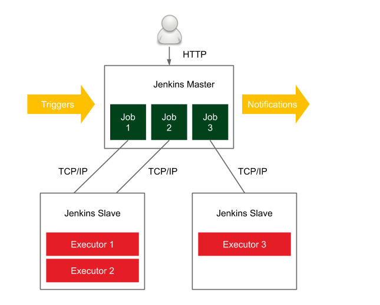

In a distributed builds environment, the Jenkins master is responsible for the following:

* Receiving build triggers (for example, after a commit to GitHub)
* Sending notifications (for example, email or HipChat messages sent after a build failure)
* Handling HTTP requests (interaction with clients)
* Managing the build environment (orchestrating the job executions on slaves)

Agents should also be as generic as possible.

## Scalability

**Vertical scaling** means that when the master's load grows, more resources are applied to the master's machine. So, when new projects appear in our organization, we buy more RAM, add CPU cores, and extend the HDD drives.

**Horizontal scaling** means that when an organization grows, more master instances are launched. This requires a smart allocation of instances to teams, and, in extreme cases, each team can have its own Jenkins master. In that case, it might even happen that no slaves are needed.

## Test and production instances

It means there should always be two instances of the same Jenkins infrastructure: test and production. The test environment should always be as similar as possible to the production, so it requires a similar number of agents attached.

# Configuring agents

How do we set up an agent and let it communicate with the master?

## Communication protocols

In order for the master and the agent to communicate, the bi-directional connection has to be established. There are different options for how it can be initiated:
* **SSH**. The master connects to the slave using the standard SSH protocol. This is the most convenient and stable method because it uses standard Unix mechanisms.
* **Java web start**. A Java application is started on each agent machine and the TCP connection is established between the Jenkins slave application and the master Java application. This method is often used if the agents are inside the fire-walled network and the master cannot initiate the connection.

## Setting agents

At the low level, agents always communicate with the Jenkins master using one of the protocols described previously. However, at the higher level, we can attach slaves to the master in various ways. The differences concern two aspects:
* **Static versus dynamic**. The simplest option is to add slaves permanently in the Jenkins master. The drawback of such a solution is that we always need to manually change something if we need more (or fewer) slave nodes. A better option is to dynamically provision slaves as they are needed.
* **Specific versus general-purpose**. Agents can be specific (for example, different agents for the projects based on Java 7 and Java 8) or general-purpose (an agent acts as a Docker host and a pipeline is built inside a Docker container).

These differences resulted in four common strategies for how agents are configured:
* **Permanent agents**
* **Permanent Docker agents**
* **Jenkins Swarm agents**
* **Dynamically provisioned Docker agents**

### Configuring permanent agents

``Manage Jenkins`` -> ``Manage Nodes`` -> ``New Node``.

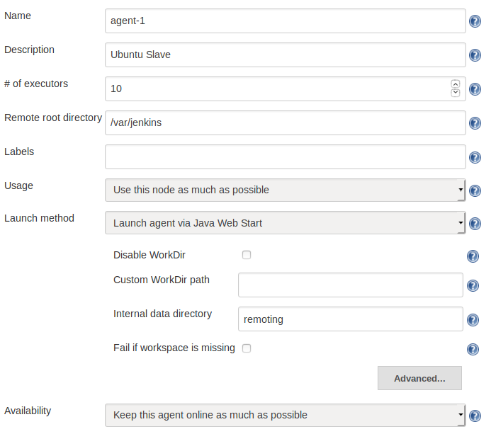

* ``Name``: This is the unique name of the agent
* ``Description``: This is an human-readable description of the agent
* ``# of executors``: This is the number of concurrent builds that can be run on the slave
* ``Remote root directory``: This is the dedicated directory on the slave machine that the agent can use to run build jobs (for example, /var/jenkins); the most important data is transferred back to the master, so the directory is not critical
* ``Labels``: This includes the tags to match the specific builds (tagged the same); for example, only projects based on Java 8
* ``Usage``: This is the option to decide whether the agent should only be used for matched labels (for example, only for Acceptance Testing builds), or for any builds
* ``Launch method``: This includes the following:
  * ``Launch agent via Java Web Start``: Here, the connection will be established by the agent; it is possible to download the JAR file and the instructions on how to run it on the slave machine
  * ``Launch agent via execution of command on the master``: This is the custom command run on the master to start the slave; in most cases, it will send the Java Web Start JAR application and start it on the slave (for example, ssh <slave_hostname> java -jar ~/bin/slave.jar)
  * ``Launch slave agents via SSH``: Here, the master will connect to the slave using the SSH protocol
* ``Availability``: This is the option to decide whether the agent should be up all the time or the master should turn it offline under certain conditions

**!NOTE**. The Java Web Start agent uses port 50000 for communication with Jenkins Master; therefore, if you use the Docker-based Jenkins master, you need to publish that port (-p 50000:50000).

When the agents are set up correctly, **it's possible to update the master node configuration with ``# of executors`` set to 0**, so that no builds will be executed on it and it will only serve as the Jenkins UI and the builds' coordinator.

As we've already mentioned, the drawback of such a solution is that we need to maintain multiple slave types (labels) for different project types. In our example, if we have three types of projects (java7, java8, and ruby), then we need to maintain three separately labeled (sets of) slaves.

### Permanent Docker agents

The idea behind this solution is to permanently add general-purpose slaves. Each slave is identically configured (with Docker Engine installed), and each build is defined along with the Docker image inside which the build is run.

#### Configuring permanent Docker agents

The configuration is static, so it's done exactly the same way as we did for the permanent agents. The only difference is that we need to install Docker on each machine that will be used as a slave. After the slaves are configured, we define the Docker image in each pipeline script:
```
pipeline {
     agent {
          docker {
               image 'openjdk:8-jdk-alpine'
          }
     }
     ...
}
```

When the build is started, the Jenkins slave starts a container from the Docker image, ``openjdk:8-jdk-alpine``, and then executes all the pipeline steps inside that container.

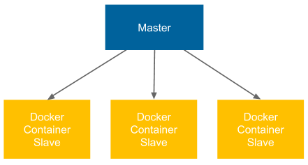

### Jenkins Swarm agents

#### Configuring Jenkins Swarm agents

The first step to using Jenkins Swarm is to install the Self-Organizing Swarm Plug-in Modules plugin in Jenkins. We can do it through the Jenkins web UI, under ``Manage Jenkins`` and ``Manage Plugins``.

The second step is to run the Jenkins Swarm slave application on every machine that would act as a Jenkins slave. We can do it using the ``swarm-client.jar`` application.

**!NOTE**. The ``swarm-client.jar`` application can be downloaded from the Jenkins Swarm plugin page, at https://wiki.jenkins.io/display/JENKINS/Swarm+Plugin. On that page, you can also find all the possible options of its execution.

In order to attach the Jenkins Swarm slave node, it's enough to run the following command:
```
$ java -jar swarm-client.jar -master <jenkins_master_url> -username <jenkins_master_user> -password <jenkins_master_password> -name jenkins-swarm-slave-1
```

After successful execution, we should notice that a new slave has appeared on the Jenkins master, as presented in the following screenshot:

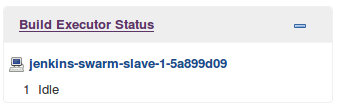

**!NOTE**. The other possibility to add the Jenkins Swarm agent is to use the Docker image built from the ``swarm-client.jar`` tool.

#### Understanding Jenkins Swarm agents

At first glance, Jenkins Swarm may not seem very useful. After all, we have moved setting agents from the master to the slave, but we still have to do it manually. However, apparently, with the use of a clustering system such as Kubernetes or Docker Swarm, Jenkins Swarm enables the dynamic scaling of slaves on a cluster of servers.

### Dynamically provisioned Docker agents

Another option is to set up Jenkins to dynamically create a new agent each time a build is started. Such a solution is obviously the most flexible one, since the number of slaves dynamically adjusts to the number of builds.

#### Configuring dynamically provisioned Docker agents

First, we need to install the ``Docker plugin``. Configuration steps:
* Open the ``Manage Jenkins`` page.
* Click on the ``Configure System`` link.
* At the bottom of the page, there is the ``Cloud`` section.
* Click on ``Add a new cloud`` and choose ``Docker``.
* Fill in the Docker agent details, as shown in the following screenshot.
* Most parameters do not need to be changed; however (apart from selecting Enabled), we need to at least set the Docker host URL (the address of the Docker host machine where agents will be run).
* Click on Docker Agent templates... and select Add Docker Template.
* Fill in the details about the Docker slave image.

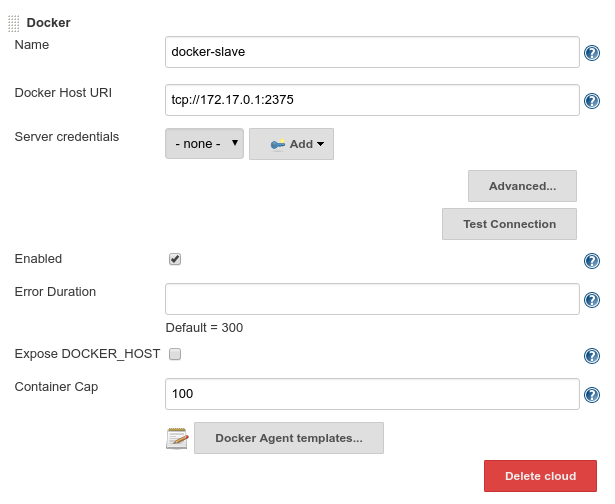

**!NOTE**. If you plan to use the same Docker host where the master is running, then the Docker daemon needs to listen on the ``docker0`` network interface. You can do it in a similar way as to what's described in the Installing on a server section ofChapter 2, Introducing Docker, by changing one line in the ``/lib/systemd/system/docker.service`` file to ``ExecStart=/usr/bin/dockerd -H 0.0.0.0:2375 -H fd://``.

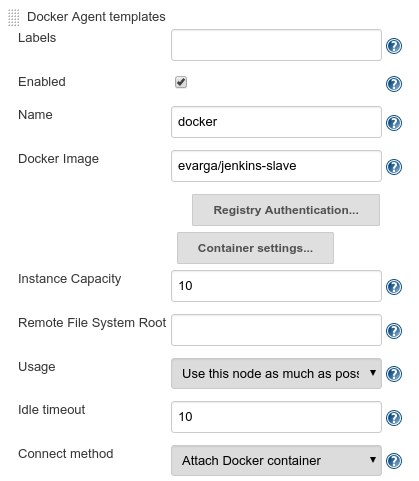


* ``Docker Image``: The most popular slave image from the Jenkins community is evarga/jenkins-slave
* ``Instance Capacity``: This defines the maximum number of agents running at the same time; for the beginning, it can be set to 10

#### Understanding dynamically provisioned Docker agents

Dynamically provisioned Docker agents can be treated as a layer over the standard agent mechanism. It changes neither the communication protocol nor how the agent is created. So, what does Jenkins do with the Docker agent configuration we provided?

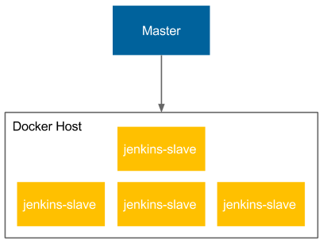

Let's describe how the Docker agent mechanism is used, step by step:
* When the Jenkins job is started, the master runs a new container from the jenkins-slave image on the slave Docker host.
* The jenkins-slave container is actually the Ubuntu image with the sshd server installed.
* The Jenkins master automatically adds the created agent to the agent list (the same as what we did manually in the Setting agents section).
* The agent is accessed, using the SSH communication protocol, to perform the build.
* After the build, the master stops and removes the slave container.

**!NOTE.** The Jenkins build usually needs to download a lot of project dependencies (for example, Gradle/Maven dependencies), which may take a lot of time. If Docker slaves are automatically provisioned for each build, then it may be worth it to set up a Docker volume for them to enable caching between the builds.

### Testing agents

No matter which agent configuration you have chosen, you can now check whether everything works correctly. Let's go back to the Hello World pipeline.

```
pipeline {
     agent any
     stages {
          stage("Hello") {
               steps {
                    sleep 300 // 5 minutes
                    echo 'Hello World'
               }
          }
     }
}
```

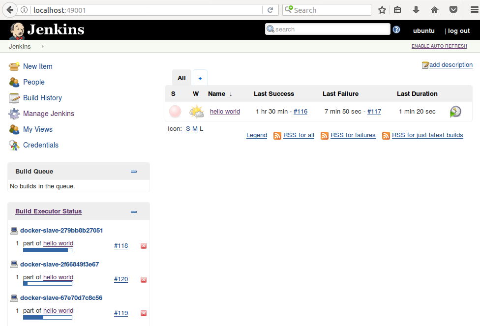

# Custom Jenkins images

So far, we have used the Jenkins images pulled from the internet. We used ``jenkins/jenkins`` for the master container and ``evarga/jenkins-slave`` for the slave container.

**!NOTE**. The base Docker image, ``evarga/jenkins-slave``, is suitable for the **dynamically provisioned Docker agents solution.** In the case of **permanent Docker agents**, it's enough to use ``alpine``, ``ubuntu``, or any other image, since it's not the slave that is dockerized, but only the build execution environment.

## Building the Jenkins slave

Let's start from the slave image, because it's more frequently customized. The build execution is performed on the agent, so it's the agent that needs to have the environment adjusted to the project we would like to build. There are four steps to building and using the custom image:
* Create a Dockerfile
* Build the image
* Push the image into a registry
* Change the agent configuration on the master


As an example, let's create a slave that serves the Python project. We can build it on top of the evarga/jenkins-slave image, for the sake of simplicity. Steps accordingly:
```
FROM evarga/jenkins-slave
RUN apt-get update && apt-get install -y python
```

```
$ docker build -t leszko/jenkins-slave-python .
```

```
$ docker push leszko/jenkins-slave-python
```

Change the agent configuration on master: The last step, of course, is to set ``leszko/enkins-slave-python`` instead of ``evarga/jenkins-slave`` in the Jenkins master's configuration (as described in the Dynamically provisioned Docker agents section).


What if we need Jenkins to build two different kinds of projects, for example, one based on Python and another based on Ruby? In that case, we could prepare an agent that's generic enough to support both: Python and Ruby. However, in the case of Docker, it's recommended to create the second slave image (leszko/jenkins-slave-ruby by analogy). Then, in the Jenkins configuration, we need to create two Docker templates and label them accordingly.

## Building the Jenkins master

Why would we also want to build our own master image? One of the reasons might be that we don't want to use slaves at all, and since the execution would be done on the master, its environment has to be adjusted to the project's needs. 

Imagine the following scenario: your organization scales Jenkins horizontally, and each team has its own instance. There is, however, some common configuration, for example, a set of base plugins, backup strategies, or the company logo. Then, repeating the same configuration for each of the teams is a waste of time. So, **we can prepare the shared master image and let the teams use it.**

Jenkins is configured using XML files, and it provides the Groovy-based DSL language to manipulate over them. That is why we can add the Groovy script to the Dockerfile in order to manipulate the Jenkins configuration.

As an example, let's create a master image with the docker-plugin already installed and a number of executors set to 5. In order to do it, we need to perform the following:
* Create the Groovy script to manipulate on config.xml, and set the number of executors to 5.
* Create the Dockerfile to install docker-plugin, and execute the Groovy script.
* Build the image.

Steps.
Groovy script: Let's create a new directory and the ``executors.groovy`` file with the following content:
```
import jenkins.model.*
Jenkins.instance.setNumExecutors(5)
```

**!NOTE.** The complete Jenkins API can be found on the official page, at http://javadoc.jenkins.io/.

Dockerfile: In the same directory, let's create a ``Dockerfile``:
```
FROM jenkins/jenkins:2.150.3
COPY executors.groovy /usr/share/jenkins/ref/init.groovy.d/executors.groovy
RUN /usr/local/bin/install-plugins.sh docker-plugin
```

Build the image: We can finally build the image:
```
$ docker build -t jenkins-master .
```

# Configuration and management

Everything can be changed under the ``Manage Jenkins`` subpage. In this section, we will focus on only a few aspects that are most likely to be changed: plugins, security, and backup.

## Plugins

With Jenkins' openness comes risk, and it's better to download only plugins from a reliable source, or check their source code. 
    
There are literally tons of plugins to choose from. Some of them were already installed automatically, during the initial configuration. Another one (Docker plugin) was installed while setting the Docker agents. There are plugins for cloud integration, source control tools, code coverage, and much more. 

## Security

The way you should approach Jenkins security depends on the Jenkins architecture you have chosen within your organization. If you have a Jenkins master for every small team, then you may not need it at all (under the assumption that the corporate network is firewalled). **However, if you have a single Jenkins master instance for the whole organization, then you'd better be sure you've secured it well.**

## Backup

What files should be backed up, and from which machines? Luckily, agents automatically send all the relevant data back to the master, so we don't need to bother with them. If you run Jenkins in the container, then the container itself is also not interesting, since it does not hold persistent state. **The only place we are interested in is the Jenkins home directory.**

**!Note.** There are quite a few plugins that can help with the backup process; the most common one is called ``Backup Plugin``.

# Chapter 4. Continuous Integration Pipeline

A **pipeline** is a sequence of automated operations that usually represents a part of the software delivery and quality assurance process. It can be seen as a chain of scripts that provide the following additional benefits:

* **Operation grouping**: Operations are grouped together into stages (also known as gates or quality gates) that introduce a structure into the process and clearly define the rule—if one stage fails, no further stages are executed
* **Visibility**: All aspects of the process are visualized, which helps in quick failure analysis and promotes team collaboration
* **Feedback**: Team members learn about problems as soon as they occur, so that they can react quickly

## The pipeline structure

A Jenkins pipeline consists of two kinds of elements—Stage and Step. The following diagram shows how they are used:

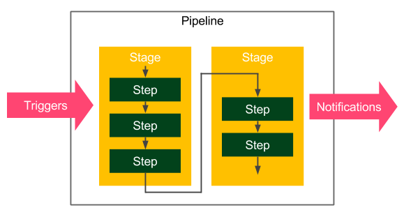

The following are the basic pipeline elements:
* Stage: A logical separation of steps that groups conceptually distinct sequences of steps, for example, Build, Test, and Deploy, used to visualize the Jenkins pipeline progress.
* Step: A single operation that tells Jenkins what to do; for example, check out code from the repository, execute a script.

## Multi-stage Hello World

```
pipeline {
     agent any
     stages {
          stage('First Stage') {
               steps {
                    echo 'Step 1. Hello World'
               }
          }
          stage('Second Stage') {
               steps {
                    echo 'Step 2. Second time Hello'
                    echo 'Step 3. Third time Hello'
               }
          }
     }
}
```

When we click on Build Now, we should see the visual representation:

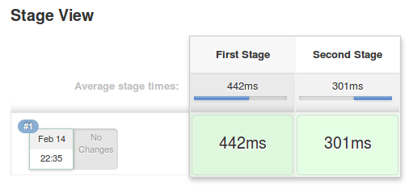

## The pipeline syntax

```
pipeline {
     agent any
     triggers { cron('* * * * *') }
     options { timeout(time: 5) }
     parameters { 
          booleanParam(name: 'DEBUG_BUILD', defaultValue: true, 
          description: 'Is it the debug build?') 
     }
     stages {
          stage('Example') {
               environment { NAME = 'Rafal' }
               when { expression { return params.DEBUG_BUILD } } 
               steps {
                    echo "Hello from $NAME"
                    script {
                         def browsers = ['chrome', 'firefox']
                         for (int i = 0; i < browsers.size(); ++i) {
                              echo "Testing the ${browsers[i]} browser."
                         }
                    }
               }
          }
     }
     post { always { echo 'I will always say Hello again!' } }
}
```

Hopefully, the pipeline didn't scare you. It is quite complex. Actually, it is so complex that it contains all possible Jenkins instructions. To answer the experiment puzzle, let's see what the pipeline does instruction by instruction:
* Use any available agent
* Execute automatically every minute
* Stop if the execution takes more than five minutes
* Ask for the Boolean input parameter before starting
* Set Rafal as the NAME environment variable
* Only in the case of the true input parameter:
  *  Print Hello from Rafal
  *  Print Testing the chrome browser
  *  Print Testing the firefox browser
* Print I will always say Hello again! regardless of whether there are any errors during the execution

**!NOTE.** The complete pipeline syntax description can be found on the official Jenkins page at https://jenkins.io/doc/book/pipeline/syntax/.

### Sections

Sections define the pipeline structure and usually contain one or more directives or steps. They are defined with the following keywords:
* Stages: This defines a series of one or more stage directives
* Steps: This defines a series of one or more step instructions
* Post: This defines a series of one or more step instructions that are run at the end of the pipeline build; they are marked with a condition (for example, always, success, or failure), and usually used to send notifications after the pipeline build

### Directives

Directives express the configuration of a pipeline or its parts:

* Agent: This specifies where the execution takes place and can define the label to match the equally-labeled agents, or docker to specify a container that is dynamically provisioned to provide an environment for the pipeline execution
* Triggers: This defines automated ways to trigger the pipeline and can use cron to set the time-based scheduling, or pollSCM to check the repository for changes
* Options: This specifies pipeline-specific options, for example, timeout (maximum time of pipeline run) or retry (number of times the pipeline should be re-run after failure)
* Environment: This defines a set of key values used as environment variables during the build
* Parameters: This defines a list of user-input parameters
* Stage: This allows for the logical grouping of steps
* When: This determines whether the stage should be executed depending on the given condition

### Steps

Steps are the most fundamental part of the pipeline. They define the operations that are executed, so they actually tell Jenkins what to do:

* sh: This executes the shell command; actually, it's possible to define almost any operation using sh
* custom: Jenkins offers a lot of operations that can be used as steps (for example, echo); many of them are simply wrappers over the sh command used for convenience; plugins can also define their own operations
* script: This executes a block of the Groovy-based code that can be used for some non-trivial scenarios where flow control is needed

**!NOTE.** The complete specification of the available steps can be found at https://jenkins.io/doc/pipeline/steps/.

# The commit pipeline

The most basic Continuous Integration process is called a **commit pipeline**. This classic phase, as its name indicates, starts with a commit (or push in Git) to the main repository and results in a report about the build success or failure. Since it runs after each change in the code, the build should take no more than five minutes and should consume a reasonable amount of resources. The commit phase is always the starting point of the Continuous Delivery process.

The most fundamental commit pipeline contains three stages:

* Checkout: This stage downloads the source code from the repository
* Compile: This stage compiles the source code
* Unit test: This stage runs a suite of unit tests

Let's create a sample project and see how to implement the commit pipeline.

## Checkout

### Creating a checkout stage

We can create a new pipeline called calculator and, as Pipeline script, put the code with a stage called Checkout:
```
pipeline {
     agent any
     stages {
          stage("Checkout") {
               steps {
                    git url: 'https://github.com/leszko/calculator.git'
               }
          }
     }
}
```

The pipeline can be executed on any of the agents, and its only step does nothing more than download code from the repository.

**!NOTE.** The Git toolkit needs to be installed on the node where the build is executed.

## Compile

### Creating a compile stage

```
stage("Compile") {
     steps {
          sh "./gradlew compileJava"
     }
}
```

```
stage("Compile") {
     steps {
          sh "./mvnw clean compile"
     }
}
```

### Creating a unit test stage

```
stage("Unit test") {
     steps {
          sh "./gradlew test"
     }
}
```

```
stage("Unit test") {
     steps {
          sh "./mvnw test"
     }
}
```

### Jenkinsfile

So far, we've created all the pipeline code directly in Jenkins. This is, however, not the only option. We can also put the pipeline definition inside a file called ``Jenkinsfile`` and commit it to the repository together with the source code. **This leads to the idea that the pipelines should be created by the same people who write the code—the developers.**

This approach brings immediate benefits, as follows:
* In case of Jenkins failure, the pipeline definition is not lost (because it's stored in the code repository, not in Jenkins)
* The history of the pipeline changes is stored
* Pipeline changes go through the standard code development process (for example, they are subjected to code reviews)
* Access to the pipeline changes is restricted in exactly the same way as access to the source code

#### Creating the Jenkinsfile

We can create the ``Jenkinsfile`` and push it into our GitHub repository. Its content is almost the same as the commit pipeline we wrote. The only difference is that the checkout stage becomes redundant because Jenkins has to first check out the code (together with ``Jenkinsfile``) and then read the pipeline structure (from ``Jenkinsfile``). This is why Jenkins needs to know the repository address before it reads ``Jenkinsfile``.

Let's create a file called ``Jenkinsfile`` in the root directory of our project:
```
pipeline {
     agent any
     stages {
          stage("Compile") {
               steps {
                    sh "./gradlew compileJava"
               }
          }
          stage("Unit test") {
               steps {
                    sh "./gradlew test"
               }
          }
     }
}
```

### Running the pipeline from Jenkinsfile

When ``Jenkinsfile`` is in the repository, all we have to do is to open the pipeline configuration and do the following in the ``Pipeline`` section:
* Change Definition from ``Pipeline script`` to ``Pipeline script from SCM``
* Select ``Git`` in ``SCM``
* Put ``https://github.com/leszko/calculator.git`` in ``Repository URL``.

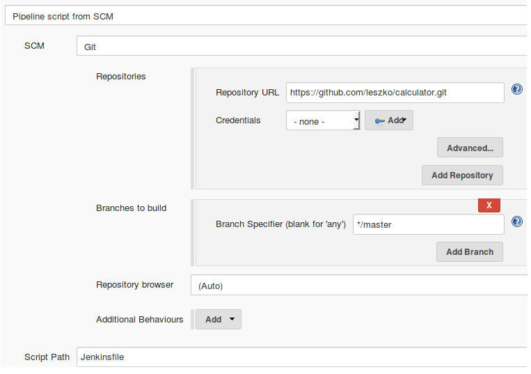

# Code-quality stages

## Code coverage

Java test coverage analysis tools:
* JaCoCo
* Clover
* Cobertura

### Adding JaCoCo to Gradle

In order to run JaCoCo from Gradle, we need to add the jacoco plugin to the build.gradle file by inserting the following line:
```
apply plugin: "jacoco"
```

Next, if we would like to make Gradle fail in case of low code coverage, we can add the following configuration to the build.gradle file:
```
jacocoTestCoverageVerification {
     violationRules {
          rule {
               limit {
                    minimum = 0.2
               }
          }
     }
}
```

This configuration sets the minimum code coverage to 20%. We can run it with the following command:
```
$ ./gradlew test jacocoTestCoverageVerification
```

We can also generate a test-coverage report using the following command:
```
$ ./gradlew test jacocoTestReport
```

#### Adding a code coverage stage

```
stage("Code coverage") {
     steps {
          sh "./gradlew jacocoTestReport"
          sh "./gradlew jacocoTestCoverageVerification"
     }
}
```

#### Publishing the code coverage report

When coverage is low and the pipeline fails, it would be useful to look at the code coverage report and find what parts are not yet covered with tests. We could run Gradle locally and generate the coverage report; however, it is more convenient if Jenkins shows the report for us.

In order to publish the code coverage report in Jenkins, we require the following stage definition:
```
stage("Code coverage") {
     steps {
          sh "./gradlew jacocoTestReport"
          publishHTML (target: [
               reportDir: 'build/reports/jacoco/test/html',
               reportFiles: 'index.html',
               reportName: "JaCoCo Report"
          ])
          sh "./gradlew jacocoTestCoverageVerification"
     }
}
```

This stage copies the generated JaCoCo report to the Jenkins output. When we run the build again, we should see a link to the code coverage reports (in the menu on the left-hand side, below ``Build Now``).

To perform the ``publishHTML`` step, you need to have the ``HTML Publisher`` plugin installed in Jenkins.

### Adding JaCoCo to Maven (My section)

In order to run JaCoCo from Maven, add plugin:
```
<plugin>
 <groupId>org.jacoco</groupId>
 <artifactId>jacoco-maven-plugin</artifactId>
 <version>0.8.6</version>
 <executions>
     <execution>
         <goals>
             <goal>prepare-agent</goal>
         </goals>
     </execution>
     <execution>
         <id>report</id>
         <phase>prepare-package</phase>
         <goals>
             <goal>report</goal>
         </goals>
     </execution>
 </executions>
</plugin>
```

Next, if we would like to make Maven fail in case of low code coverage, we can add the following configuration to the ``pom.xml`` file:
```
<execution>
<id>jacoco-check</id>
<goals>
   <goal>check</goal>
</goals>
<configuration>
   <rules>
       <rule>
           <element>BUNDLE</element>
           <limits>
               <limit>
                   <counter>LINE</counter>
                   <value>COVEREDRATIO</value>
                   <minimum>100%</minimum>
               </limit>
           </limits>
       </rule>
   </rules>
</configuration>
</execution>
```

This configuration sets the minimum code coverage to 100%. It will fail always fail, unless you're crazy with useless unit tests. Coverage check binds by default to Maven's lifecycle ``phase:verify``. To run:
```
/mvnw clean verify
```

```
./mvnw clean jacoco:report
```


## SonarQube

SonarQube is the most widespread source code quality management tool. It supports multiple programming languages and can be treated as an alternative to the code-coverage and static code analysis steps we looked at. Actually, it is a separate server that aggregates different code analysis frameworks, such as Checkstyle, FindBugs, and JaCoCo. It has its own dashboards and integrates well with Jenkins.

# Triggers and notifications

So far, we have always built the pipeline manually by clicking on the Build Now button. It works completely fine, but may not be very convenient in practice. All team members would have to remember that after committing to the repository, they need to open Jenkins and start the build. The same applies to pipeline monitoring; so far, we manually opened Jenkins and checked the build status. In this section, we will see how to improve the process so that the pipeline would start automatically and, when completed, notify team members regarding its status.

## Triggers

There are three types of triggers:
* External
* Polling Source Control Management (SCM)
* Scheduled build

### External

External trigger mean that Jenkins starts the build after it's called by the notifier, which can be the other pipeline build, the SCM system (for example, GitHub), or any remote script.

GitHub triggers Jenkins after a push to the repository and the build is started. To configure the system this way, we need the following setup steps:
* Install the GitHub plugin in Jenkins
* Generate a secret key for Jenkins
* Set the GitHub web hook and specify the Jenkins address and key

**!NOTE.** Jenkins must be accessible from the SCM server. In other words, if we use the public GitHub to trigger Jenkins, our Jenkins server must be public as well. 

### Polling SCM

Jenkins periodically calls GitHub and checks whether there was any push to the repository. Then, it starts the build. It may sound counter-intuitive, but there are at least two good cases for using this method:

* Jenkins is inside the firewalled network (which GitHub does not have access to)
* Commits are frequent and the build takes a long time, so executing a build after every commit would cause an overload

The configuration of ``pollSCM`` is also somehow simpler because the way to connect from Jenkins to GitHub is already set up (Jenkins checks out the code from GitHub, so it knows how to access it). In the case of our calculator project, we can set up an automatic trigger by adding the triggers declaration (just after agent) to the pipeline:
```
triggers {
     pollSCM('* * * * *')
}
```

After running the pipeline manually for the first time, the automatic trigger is set. Then, it checks GitHub every minute, and, for new commits, it starts a build. To test that it works as expected, you can commit and push anything to the GitHub repository and see that the build starts.

### Scheduled builds

The scheduled trigger means that Jenkins runs the build periodically, regardless of whether there was any commit to the repository. The implementation of ``Scheduled build`` is exactly the same as polling SCM. The only difference is that the ``cron`` keyword is used instead of ``pollSCM``.

## Notifications

### Email

The most classic way to notify users about the Jenkins build status is to send emails. The configuration of the email notification is very simple:
* Have the SMTP server configured
* Set its details in Jenkins (in Manage Jenkins | Configure System)
* Use the mail to instruction in the pipeline

The pipeline configuration can be as follows:
```
post {
     always {
          mail to: 'team@company.com',
          subject: "Completed Pipeline: ${currentBuild.fullDisplayName}",
          body: "Your build completed, please check: ${env.BUILD_URL}"
     }
}
```

Note that all notifications are usually called in the ``post`` section of the pipeline, which is executed after all steps, no matter whether the build succeeded or failed. We used the ``always`` keyword; however, there are different options:
* ``always``: Execute regardless of the completion status
* ``changed``: Execute only if the pipeline changed its status
* ``failure``: Execute only if the pipeline has the failed status
* ``success``: Execute only if the pipeline has the success status
* ``unstable``: Execute only if the pipeline has the unstable status (usually caused by test failures or code violations)

### Group chats

No matter which tool you use, the procedure to configure it is always the same:
* Find and install the plugin for your group chat tool (for example, the Slack Notification plugin)
* Configure the plugin (server URL, channel, authorization token, and so on)
* Add the sending instruction to the pipeline

Let's see a sample pipeline configuration for Slack to send notifications after the build fails:
```
post {
     failure {
          slackSend channel: '#dragons-team',
          color: 'danger',
          message: "The pipeline ${currentBuild.fullDisplayName} failed."
     }
}
```

# Team development strategies

We have covered everything regarding how the Continuous Integration pipeline should look. However, when exactly should it be run? Of course, it is triggered after the commit to the repository, but after the commit to which branch?Only to the trunk or to every branch? Or maybe it should run before, not after, committing so that the repository would always be healthy?

## Adopting Continuous Integration

### Branching strategies

Each development workflow implies a different Continuous Integration approach:

* **Trunk-based workflow**: This implies constantly struggling against the broken pipeline. If everyone commits to the main code base, the pipeline often fails. In this case, the old Continuous Integration rule says, If the build is broken, the development team stops whatever they are doing and fixes the problem immediately.
* **Branching workflow**: This solves the broken trunk issue, but introduces another one: if everyone develops in their own branches, where is the integration? A feature usually takes weeks or months to develop, and for all this time, the branch is not integrated into the main code. Therefore, it cannot be really called Continuous Integration; not to mention that there is a constant need for merging and resolving conflicts.
* **Forking workflow**: This implies managing the Continuous Integration process by every repository owner, which isn't usually a problem. It does share, however, the same issues as the branching workflow.

There is no silver bullet, and different organizations choose different strategies. **The solution that is the closest to perfection is using the technique of the branching workflow and the philosophy of the trunk-based workflow. In other words, we can create very small branches and integrate them frequently into the master. This seems to take the best aspects of both.** However, it requires either having tiny features or using **feature toggles**. Since the concept of feature toggles fits very well into Continuous Integration and Continuous Delivery, let's take a moment to explore it.

## Feature toggles

Feature toggles is a technique that is an alternative to maintaining multiple source code branches, such that the feature can be tested before it is completed and ready for release. It is used to disable the feature for users, but enable it for developers while testing.

The simplest implementation of feature toggles are flags and the if statements. A development using feature toggles, as opposed to feature branching development, appears as follows:

* A new feature has to be implemented
* Create a new flag or a configuration property, feature_toggle (instead of the feature branch)
* Every feature-related code is added inside the if statement (instead of committing to the feature branch), for example:
```
if (feature_toggle) {
     // do something
}
```

* During the feature development, the following takes place: 
  *  Coding is done in the master with feature_toggle = true (instead of coding in the feature branch)
  *  The release is done from the master with feature_toggle = false

* When the feature development is completed, all if statements are removed and feature_toggle is removed from the configuration (instead of merging feature to the master and removing the feature branch)

The benefit of feature toggle is that all development is done in the trunk, which facilitates real Continuous Integration and mitigates problems with merging the code.

## Jenkins multi-branch

If you decide to use branches in any form, either the long-feature branches or the recommended short-lived branches, it is convenient to know that the code is healthy before merging it into the master. 

In order to use multi-branch in our calculator project, let's proceed with the following steps:

* Open the main Jenkins page
* Click on New Item
* Enter calculator-branches as the item name, select Multibranch Pipeline, and click on OK
* In the Branch Sources section, click on Add source, and select Git
* Enter the repository address into Project Repository
* Tick Periodically if not otherwise run and set 1 minute as the Interval
* Click on Save

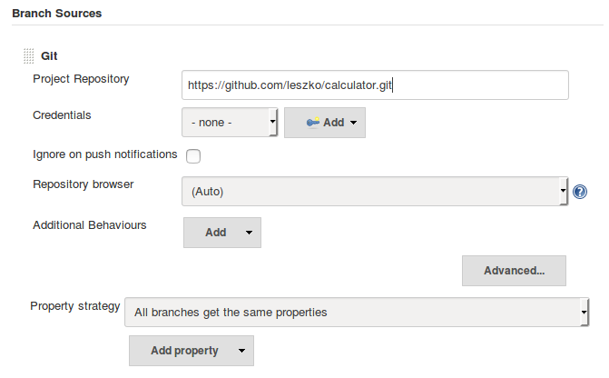

Every minute, this configuration checks whether there were any branches added (or removed) and creates (or deletes) the dedicated pipeline defined by Jenkinsfile.

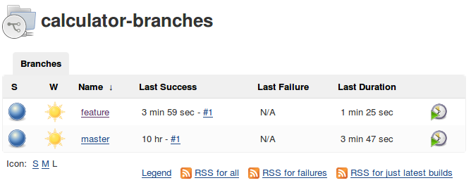

A very similar approach is to build a **pipeline per pull request instead of a pipeline per branch**, which gives the same result; the main code base is always healthy.

# Chapter 5. Automated Acceptance Testing

## Introducing acceptance testing

Automated acceptance tests, however, can be considered difficult due to their specifics:

* User-facing: They need to be written together with a user, which requires an understanding between two worlds—technical and non-technical.
* Dependencies integration: The tested application should be run together with its dependencies in order to check that the system as a whole works properly.
* Staging environment: The staging (testing) environment needs to be identical to the production one so as to ensure the same functional and non-functional behavior.
* Application identity: Applications should be built only once and the same binary should be transferred to production. This eliminates the risk of different building environments.
* Relevance and consequences: If the acceptance test passes, it should be clear that the application is ready for release from the user perspective.

## Docker registry

Artifact repository or software repository - server to store, load, and search software.

The artifact repository plays a special role in the continuous delivery process because it guarantees that the same binary is used throughout all pipeline steps.

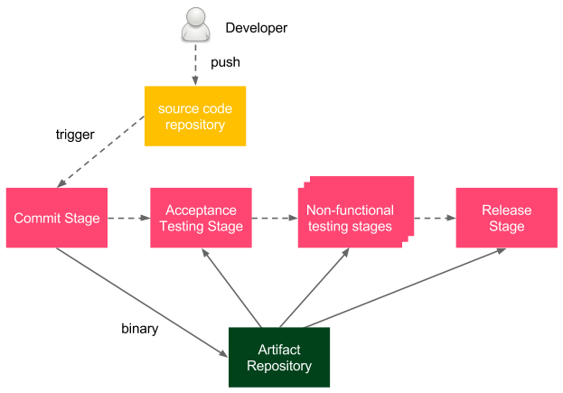

## The Docker build stage

We would like to run the calculator project as a Docker container, so we need to create Dockerfile and add the ``Docker build`` stage to Jenkinsfile.

### Adding Dockerfile

Let's create Dockerfile in the root directory of the calculator project:
```
FROM openjdk:8-jre
COPY build/libs/calculator-0.0.1-SNAPSHOT.jar app.jar
ENTRYPOINT ["java", "-jar", "app.jar"]
```

### Adding the Docker build to the pipeline

The final step we need to perform is to add the Docker build stage to Jenkinsfile. Usually, the JAR packaging is also declared as a separate Package stage:
```
stage("Package") {
     steps {
          sh "./gradlew build"
     }
}

stage("Docker build") {
     steps {
          sh "docker build -t leszko/calculator ."
     }
}
```

When we commit and push Jenkinsfile, the pipeline build should start automatically and we should see all boxes green. This means that the Docker image has been built successfully.

### The Docker push stage

When the image is ready, we can store it in the registry. The Docker push stage is very simple. It's enough to add the following code to Jenkinsfile:
```
stage("Docker push") {
     steps {
          sh "docker push leszko/calculator"
     }
}
```

**!NOTE.** If Docker registry has access restricted, first, we need to log in using the docker login command. Needless to say, the credentials must be well secured, for example, using a dedicated credential store as described on the official Docker page: https://docs.docker.com/engine/reference/commandline/login/#credentials-store.

# Chapter 6. Clustering with Kubernetes

# Scaling Jenkins

Jenkins infrastructure can be improved by running Jenkins agent nodes on a cluster. There are two different methods to achieve this goal:
* Dynamic slave provisioning
* Jenkins Swarm

## Dynamic slave provisioning

We looked at dynamic slave provisioning in Chapter 3, Configuring Jenkins. With Kubernetes, the idea is exactly the same. When the build is started, the Jenkins master runs a container from the Jenkins slave Docker image, and the ``Jenkinsfile`` script is executed inside the container. Kubernetes, however, makes the solution more powerful since we are not limited to a single Docker host machine and we can provide real horizontal scaling.

To use dynamic Jenkins agent provisioning on Kubernetes, you need to install the **Kubernetes plugin**. Then, you can add an entry to the ``Cloud`` section in ``Manage Jenkins`` | ``Configure System``.

## Jenkins Swarm

If we don't want to use dynamic slave provisioning, then another solution for clustering Jenkins slaves is to use Jenkins Swarm. We described how to use it in Chapter 3, Configuring Jenkins. Here, we add the description for Kubernetes.

In Kubernetes, as always, you need to create a deployment YAML configuration that uses the Jenkins Swarm Docker image. The most popular image is provided as ``csanchez/jenkins-swarm-slave``. Then, you can horizontally scale Jenkins using the standard kubectl scale command.

The effect of running Kubernetes Pods with Jenkins Swarm should be exactly the same as running Jenkins Swarm from the command line (as presented in Chapter 3, Configuring Jenkins); it dynamically adds a slave to the Jenkins master.

## Comparing dynamic slave provisioning and Jenkins Swarm

Jenkins slaves are run on the cluster and are, therefore, easily scaled up and down. If we need more Jenkins resources, we scale up Jenkins slaves. If we need more cluster resources, we add more physical machines to the cluster.

The difference between these two solutions is that dynamic slave provisioning automatically adds a Jenkins slave to the cluster before each build. The benefit of such an approach is that we don't even have to think about how many Jenkins slaves should be running at the moment since the number automatically adapts to the number of pipeline builds. This is why, in most cases, dynamic slave provisioning is the first choice. Nevertheless, Jenkins Swarm also carries a few significant benefits:
* **Control over the number of slaves**. 
* **Stateful slaves**. Many builds share the same Jenkins slave, which may sound like a drawback; however, it becomes an advantage when a build requires that you download a lot of dependent libraries from the internet. In the case of dynamic slave provisioning, to cache the dependencies, we would need to set up a shared volume.
* **Control over where the slaves are running**. Using Jenkins Swarm, we can decide not to run slaves on the cluster and choose the host machine dynamically; for example, for many startups, when the cluster infrastructure is costly, slaves can be dynamically run on the laptop of a developer who is starting the build.

# Chapter 7. Configuration Management with Ansible

# Chapter 8. Continuous Delivery Pipeline

# Environments and infrastructure
