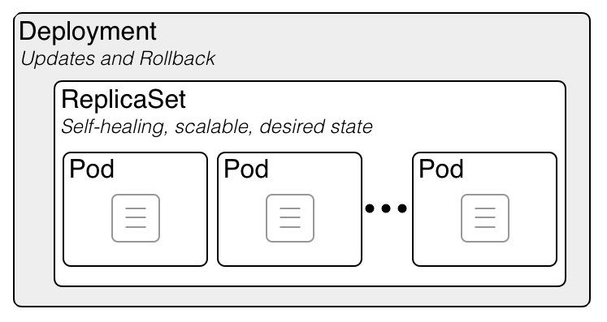

# Table of Content

- [What are containers?](#what-are-containers)
- [Why are containers important?](#why-are-containers-important)
- [The container ecosystem](#the-container-ecosystem)
- [Container architecture](#container-architecture)
- [Chapter 2. Setting up a Working Environment](#chapter-2-setting-up-a-working-environment)
- [Chapter 3. Working with Containers](#chapter-3-working-with-containers)
- [Starting, stopping, and removing containers](#starting-stopping-and-removing-containers)
    + [Listing containers](#listing-containers)
    + [Stopping and starting containers](#stopping-and-starting-containers)
    + [Removing containers](#removing-containers)
- [Inspecting containers](#inspecting-containers)
- [Exec into a running container](#exec-into-a-running-container)
- [Attaching to a running container](#attaching-to-a-running-container)
- [Retrieving container logs](#retrieving-container-logs)
- [Anatomy of containers](#anatomy-of-containers)
    + [Architecture](#architecture)
    + [Namespaces](#namespaces)
    + [Control groups (cgroups)](#control-groups-cgroups)
    + [Union filesystem (UnionFS)](#union-filesystem-unionfs)
    + [Container plumbing](#container-plumbing)
      - [Runc](#runc)
      - [Containerd](#containerd)
- [Chapter 4. Creating and Managing Container Images](#chapter-4-creating-and-managing-container-images)
  * [What are images?](#what-are-images)
    + [The layered filesystem](#the-layered-filesystem)
    + [The writable container layer](#the-writable-container-layer)
- [Creating images](#creating-images)
  * [Interactive image creation](#interactive-image-creation)
  * [Using Dockerfiles](#using-dockerfiles)
    + [The FROM keyword](#the-from-keyword)
    + [RUN](#run)
    + [The COPY and ADD keywords](#the-copy-and-add-keywords)
    + [The WORKDIR keyword](#the-workdir-keyword)
    + [The CMD and ENTRYPOINT keywords](#the-cmd-and-entrypoint-keywords)
      - [CMD](#cmd)
      - [ENTRYPOINT](#entrypoint)
      - [CMD vs ENTRYPOINT](#cmd-vs-entrypoint)
  * [Building an image](#building-an-image)
  * [Multistep builds](#multistep-builds)
  * [Dockerfile best practices](#dockerfile-best-practices)
- [Chapter 5. Data Volumes and System Management](#chapter-5-data-volumes-and-system-management)
  * [Creating and mounting data volumes](#creating-and-mounting-data-volumes)
    + [Mounting a volume](#mounting-a-volume)
    + [Removing volumes](#removing-volumes)
  * [Sharing data between containers](#sharing-data-between-containers)
  * [Using host volumes](#using-host-volumes)
  * [Defining volumes in images](#defining-volumes-in-images)
  * [Listing resource consumption](#listing-resource-consumption)
  * [Pruning unused resources](#pruning-unused-resources)
    + [Pruning containers](#pruning-containers)
    + [Pruning images](#pruning-images)
    + [Pruning volumes](#pruning-volumes)
    + [Pruning networks](#pruning-networks)
    + [Pruning everything](#pruning-everything)
- [Chapter 6. Distributed Application Architecture](#chapter-6-distributed-application-architecture)
  * [Defining the terminology](#defining-the-terminology)
  * [Patterns and best practices](#patterns-and-best-practices)
    + [Loosely coupled components](#loosely-coupled-components)
    + [Stateful versus stateless](#stateful-versus-stateless)
    + [Service discovery](#service-discovery)
    + [Load balancing](#load-balancing)
  * [Running in production](#running-in-production)
    + [Application updates](#application-updates)
      - [Blue-green deployments](#bluegreen-deployments)
      - [Canary releases](#canary-releases)
- [Chapter 7. Single-Host Networking](#chapter-7-singlehost-networking)
  * [The container network model](#the-container-network-model)
  * [Network firewalling](#network-firewalling)
  * [The bridge network](#the-bridge-network)
    + [Use the default bridge network](#use-the-default-bridge-network)
    + [Use user-defined bridge networks](#use-userdefined-bridge-networks)
  * [The host network](#the-host-network)
  * [The null network](#the-null-network)
  * [Running in an existing network namespace](#running-in-an-existing-network-namespace)
  * [Port management](#port-management)
- [Chapter 8. Docker Compose](#chapter-8-docker-compose)
  * [Demystifying declarative versus imperative](#demystifying-declarative-versus-imperative)
  * [Running a multi-service app](#running-a-multiservice-app)
  * [Scaling a service](#scaling-a-service)
- [Chapter 9. Orchestrators](#chapter-9-orchestrators)
  * [The tasks of an orchestrator](#the-tasks-of-an-orchestrator)
    + [Reconciling the desired state](#reconciling-the-desired-state)
    + [Replicated and global services](#replicated-and-global-services)
    + [Service discovery](#service-discovery)
    + [Routing](#routing)
    + [Load balancing](#load-balancing)
    + [Scaling](#scaling)
    + [Self-healing](#selfhealing)
    + [Zero downtime deployments](#zero-downtime-deployments)
    + [Affinity and location awareness](#affinity-and-location-awareness)
    + [Security](#security)
  * [Overview of popular orchestrators](#overview-of-popular-orchestrators)
- [Chapter 10. Introduction to Docker Swarm](#chapter-10-introduction-to-docker-swarm)
  * [Architecture](#architecture)
  * [Swarm nodes](#swarm-nodes)
    + [Swarm managers](#swarm-managers)
    + [Swarm workers](#swarm-workers)
  * [Stacks, services, and tasks](#stacks-services-and-tasks)
    + [Services](#services)
    + [Task](#task)
    + [Stack](#stack)
  * [Multi-host networking](#multihost-networking)
- [Chapter 11. Zero Downtime Deployments and Secrets](#chapter-11-zero-downtime-deployments-and-secrets)
  * [Zero downtime deployment](#zero-downtime-deployment)
    + [Popular deployment strategies](#popular-deployment-strategies)
    + [Rolling updates](#rolling-updates)
    + [Health checks](#health-checks)
  * [Secrets](#secrets)
    + [Creating secrets](#creating-secrets)
    + [Using a secret](#using-a-secret)
  * [Simulating secrets in a development environment](#simulating-secrets-in-a-development-environment)
- [Chapter 12. Introduction to Kubernetes](#chapter-12-introduction-to-kubernetes)
  * [Architecture](#architecture)
  * [Kubernetes master nodes](#kubernetes-master-nodes)
  * [Cluster nodes](#cluster-nodes)
  * [Introduction to Minikube](#introduction-to-minikube)
  * [Kubernetes support in Docker for Desktop](#kubernetes-support-in-docker-for-desktop)
  * [Pods](#pods)
    + [Pod life cycle](#pod-life-cycle)
    + [Pod specification](#pod-specification)
    + [Pods and volumes](#pods-and-volumes)
  * [Kubernetes ReplicaSet](#kubernetes-replicaset)
    + [ReplicaSet specification](#replicaset-specification)
    + [Self-healing](#selfhealing)
  * [Kubernetes deployment](#kubernetes-deployment)
  * [Kubernetes service](#kubernetes-service)
  * [Context-based routing](#contextbased-routing)
- [Chapter 13. Deploying, Updating, and Securing an Application with Kubernetes](#chapter-13-deploying-updating-and-securing-an-application-with-kubernetes)
  * [Deploying a first application](#deploying-a-first-application)
    + [Deploying the web component](#deploying-the-web-component)
    + [Deploying the database](#deploying-the-database)
    + [Streamlining the deployment](#streamlining-the-deployment)
  * [Zero downtime deployments](#zero-downtime-deployments)
    + [Rolling updates](#rolling-updates)
    + [Blue–green deployment](#bluegreen-deployment)
  * [Kubernetes secrets](#kubernetes-secrets)
    + [Manually defining secrets](#manually-defining-secrets)
    + [Creating secrets with kubectl](#creating-secrets-with-kubectl)
    + [Using secrets in a pod](#using-secrets-in-a-pod)
    + [Secret values in environment variables](#secret-values-in-environment-variables)

Process finished with exit code 0


# What are containers?

A first approach was to use virtual machines (VMs). Instead of running multiple applications all on the same server, companies would package and run a single application per VM. With it, the compatibility problems were gone and life seemed good again. Unfortunately, the happiness didn't last for long. VMs are pretty heavy beasts on their own since they all contain a full-blown OS such as Linux or Windows Server and all that for just a single application. This is as if in the  transportation industry you would use a gigantic ship just to transport a truck load of bananas.

The ultimate solution to the problem was to provide something much more lightweight than VMs but also able to perfectly encapsulate the goods it needed to transport.

# Why are containers important?

First of all, Gartner has found in a recent report that **applications running in a container are more secure than their counterparts not running in a container.** Containers use Linux security primitives such as Linux kernel namespaces to sandbox different applications running on the same computers and **control groups (cgroups)**, to avoid the noisy neighbor problem where one bad application is using all available resources of a server and starving all other applications.

Containers make it easy to simulate a production-like environment, even on a developer's laptop.

A third reason is that operators can finally concentrate on what they are really good at, provisioning infrastructure, and running and monitoring applications in production. No special libraries of frameworks need to be installed on those servers, just an OS and a container runtime such as Docker.

# The container ecosystem

Initially, Docker didn't have a solution for **container orchestration** thus other companies or projects, open source or not, tried to close this gap. The most prominent one is **Kubernetes** which was initiated by Google and then later donated to the CNCF. Other container orchestration products are **Apache Mesos, Rancher, Red Hat's Open Shift, Docker's own Swarm**, and more.

More recently, the trend goes towards a **service mesh.** As we containerize more and more applications, and as we refactor those applications into more microservice-oriented applications, we run into problems that simple orchestration software cannot solve anymore in a reliable and scalable way. **Topics in this area are service discovery, monitoring, tracing, and log aggregation.** Many new projects have emerged in this area, the most popular one at this time being **Istio**, which is also part of the CNCF.

# Container architecture

**Docker Engine**
Rest Interface -> libcontainerd; libnetwork; graph; plugins

**containerd + runc**

**Linux Operating System**
Namespaces (pid, net, ipc, mnt, ufs); Control Groups (cgroups); Layer Capabilities (Union Filesystem: Overlay, AUFS, Device Mapper); Other OS Functionality.

In the preceding diagram, we see three essential parts:
* On the bottom, we have the Linux operating system
* In the middle dark gray, we have the container runtime
* On the top, we have the Docker engine

Containers are only possible due to the fact that the Linux OS provides some primitives, such as **namespaces, control groups, layer capabilities**, and more which are leveraged in a very specific way by the container runtime and the Docker engine. Linux kernel namespaces such as **process ID (pid) namespaces or network(net) namespaces** allow Docker to encapsulate or sandbox processes that run inside the container. Control groups make sure that containers cannot suffer from the noisy neighbor syndrome, where a single application running in a container can consume most or all of the available resources of the whole Docker host.

The container runtime on a Docker host consists of:
* runc - low-level functionality of the container runtime
* containerd - based on runc, provides the higher-level functionality

# Chapter 2. Setting up a Working Environment

Containers must run on a Linux host. Neither Windows or Mac can run containers natively. Thus, we need to run a Linux VM on our laptop, where we can then run our containers. This is essentially what is ```docker-machine```. It enables to set up environment in which Docker (the Engine) can actually work.

More information: https://docs.docker.com/v17.09/machine/overview/

# Chapter 3. Working with Containers

Test docker ```docker -v```. Then try to run:
```
docker container run alpine echo "Hello World"
```
Result similar to this:
```
Unable to find image 'alpine:latest' locally
latest: Pulling from library/alpine
2fdfe1cd78c2: Pull complete
Digest: sha256:ccba511b...
Status: Downloaded newer image for alpine:latest
Hello World
```
# Starting, stopping, and removing containers

```
docker container run alpine echo "Hello World"
```
This command contains multiple parts. First and foremost, we have the word **docker**. This is the name of the Docker command-line interface (CLI), which we are using to interact with the Docker engine that is responsible to run containers. Next, we have the word **container**, which indicates the context we are working with. As we want to run a container, our context is the word container. Next is the actual **command we want to execute in the given context, which is run**.

Now we also need to tell Docker which container to run. In this case, this is the so-called **alpine** container. Finally, we need to define what kind of process or task shall be executed inside the container when it is running. In our case, this is the last part of the command, echo "Hello World".

Now, let's run this in an alpine container as a daemon in the background.

```
$ docker container run -d --name quotes alpine /bin/sh -c "while :; do wget -qO- https://talaikis.com/api/quotes/random; printf '\n'; sleep 5; done"
```
In the preceding expression, we have used two new command-line parameters, **-d** and **--name**. 
The -d tells Docker to run the process running in the container as a Linux daemon. 
The --name parameter in turn can be used to give the container an explicit name. In the preceding sample, the name we chose is quotes.

**One important takeaway is that the container name has to be unique on the system.**

### Listing containers

**docker container ls** - List of all containers running on the system
**docker container ls -a** - List not only the currently running containers but all containers that are defined on our system
**docker container ls -q** - List the IDs of all containers
**docker container rm -f $(docker container ls -a -q)** - Remove all containers
**docker container ls -h** - Invoke help for the list command

### Stopping and starting containers

**docker container stop quotes**. When you try to stop the quotes container, you will probably note that it takes a while until this command is executed. To be precise, it takes about 10 seconds. Why is this the case?

Docker sends a Linux SIGTERM signal to the main process running inside the container. If the process doesn't react to this signal and terminate itself, Docker waits for 10 seconds and then sends SIGKILL, which will kill the process forcefully and terminate the container.

**How do we get the ID of a container?**
```
export CONTAINER_ID = $(docker container ls | grep quotes | awk '{print $1}')
docker container stop $CONTAINER_ID
```

### Removing containers

```
docker container rm <container ID>
#Or
docker container rm <container name>
```
Sometimes, removing a container will not work as it is still running. If we want to force a removal, no matter what the condition of the container currently is, we can use the command-line parameter -f or --force.

# Inspecting containers

We have to provide either the container ID or name to identify the container of which we want to obtain the data:
```
docker container inspect quotes 
```
Sometimes, we need just a tiny bit of the overall information, and to achieve this, we can either use the grep tool or a filter. **The former method does not always result in the expected answer**, so let's look into the latter approach:
```
docker container inspect -f "{{json .State}}" quotes
```
The -f or --filter parameter is used to define the filter. The filter expression itself uses the Go template syntax.

# Exec into a running container

Sometimes, we want to run another process inside an already-running container. A typical reason could be to try to debug a misbehaving container. 
```
docker container exec -i -t quotes /bin/sh
```

The flag **-i** signifies that we want to run the additional process interactively, and **-t** tells Docker that we want it to provide us with a TTY (a terminal emulator) for the command. Finally, the process we run is **/bin/sh**.

We can also execute processes non-interactive:
```
docker container exec quotes ps
```

# Attaching to a running container

We can use the attachcommand to attach our Terminal's standard input, output, and error (or any combination of the three) to a running container using the ID or name of the container. Let's do this for our quotes container:
```
docker container attach quotes
```

To quit the container without stopping or killing it, we can press the key combination **Ctrl+P Ctrl+Q**. This **detaches us from the container while leaving it running** in the background. On the other hand, if we want to **detach and stop the container** at the same time, we can just press **Ctrl+C**.

# Retrieving container logs
If the logging output is directed to STDOUT and STDERR, then Docker can collect this information and keep it ready for consumption by a user or any other external system.
```
docker container logs quotes
```

If we want to only get a few of the latest entries, we can use the -t or --tail parameter, as follows:
```
docker container logs --tail 5 quotes
```
Sometimes, we want to follow the log that is produced by a container. This is possible when using the parameter -f or --follow.
```
docker container logs --tail 5 --follow quotes
```

# Anatomy of containers

Many individuals wrongly compare containers to VMs. However, this is a questionable comparison. **Containers are not just lightweight VMs.**

Containers are specially encapsulated and secured processes running on the host system.

Containers leverage a lot of features and primitives available in the Linux OS. The most important ones are **namespaces and cgroups**. All processes running in containers **share the same Linux kernel** of the underlying host operating system. This is fundamentally different compared with VMs, as **each VM contains its own full-blown operating system.**

### Architecture

---

**Docker Engine**
Rest Interface -> libcontainerd; libnetwork; graph; plugins

**containerd + runc**

**Linux Operating System**
Namespaces (pid, net, ipc, mnt, ufs); Control Groups (cgroups); Layer Capabilities (Union Filesystem: Overlay, AUFS, Device Mapper); Other OS Functionality.

---

We have the Linux operating system with its cgroups, namespaces, and layer capabilities as well as other functionality that we do not need to explicitly mention here. Then, there is an intermediary layer composed of containerd and runc. On top of all that now sits the Docker engine. The Docker engine offers a RESTful interface to the outside world that can be accessed by any tool, such as the Docker CLI, Docker for Mac, and Docker for Windows or Kubernetes to just name a few.

### Namespaces

A namespace is an abstraction of global resources such as filesystems, network access, process tree (also named PID namespace) or the system group IDs, and user IDs.

If we wrap a running process, say, in a filesystem namespace, then this process has the illusion that it owns its own complete filesystem. This of course is not true; it is only a virtual FS. From the perspective of the host, the contained process gets a shielded subsection of the overall FS. It is like a filesystem in a filesystem.

The same applies for all the other global resources for which namespaces exist. The user ID namespace is another example. Having a user namespace, we can now define a user jdoe many times on the system as long at it is living in its own namespace.

**The PID namespace is what keeps processes in one container from seeing or interacting with processes in another container.** A process might have the apparent PID 1 inside a container, but if we examine it from the host system, it would have an ordinary PID, say 334.

### Control groups (cgroups)

Linux cgroups are used to limit, manage, and isolate resource usage of collections of processes running on a system. Resources are CPU time, system memory, network bandwidth, or combinations of these resources, and so on.

### Union filesystem (UnionFS)

The UnionFS forms the backbone of what is known as container images. **UnionFS is mainly used on Linux and allows files and directories of distinct filesystems to be overlaid and with it form a single coherent file system.** In this context, the individual filesystems are called branches. Contents of directories that have the same path within the merged branches will be seen together in a single merged directory, within the new, virtual filesystem. When merging branches, the priority between the branches is specified. In that way, when two branches contain the same file, the one with the higher priority is seen in the final FS.

### Container plumbing

The basement on top of which the Docker engine is built; we can also call it the container plumbing and is formed by the two component **runc and containerd.**

#### Runc
Runc is a lightweight, portable container runtime. It provides full support for Linux namespaces as well as native support for all security features available on Linux, such as SELinux, AppArmor, seccomp, and cgroups.

Runc is a tool for spawning and running containers according to the Open Container Initiative (OCI) specification.

#### Containerd
Runc is a low-level implementation of a container runtime; containerd builds on top of it, and adds higher-level features, such as image transfer and storage, container execution, and supervision, as well as network and storage attachments. With this, it manages the complete life cycle of containers.

# Chapter 4. Creating and Managing Container Images

## What are images?

In Linux, **everything is a file.** The whole operating system is basically a filesystem with files and folders stored on the local disk. This is an important fact to remember when looking at what container images are. As we will see, an **image** is basically a big tarball containing a filesystem. More specifically, it **contains a layered filesystem.**

### The layered filesystem

Container images are templates from which containers are created. These images are not just one monolithic block, but are composed of many layers. The first layer in the image is also called the base layer.

Each individual layer contains files and folders. Each layer only contains the changes to the filesystem with respect to the underlying layers. Docker uses a union filesystem to create a virtual filesystem out of the set of layers. 

As has been said previously, **each image starts with a base image.** **Typically**, this **base image is one of the official images found on Docker Hub, such as a Linux distro, Alpine, Ubuntu, or CentOS.**

### The writable container layer

As we have discussed, a container image is made of a stack of immutable or read-only layers. When the Docker engine creates a container from such an image, it adds a writable container layer on top of this stack of immutable layers. Example:

***ContainerLayer***
**3. Add static files**
**2. Add Nginx**
**1. Apline Linux**

**The container layer is marked as read/write.** Another advantage of the immutability of image layers is that they can be shared among many containers created from this image. **All that is needed is a thin, writable container layer for each container.**

# Creating images

There are three ways to create a new container image on your system:
* Interactively building a container that contains all the additions and changes one desires and then committing those changes into a new image
* Most important way is to use a Dockerfile to describe what's in the new image and then build this image using that Dockerfile as a manifest
* Creating an image by importing it into the system from a tarball

## Interactive image creation

The first way we can create a custom image is by interactively building a container. That is, we start with a base image that we want to use as a template and run a container of it interactively.
```
docker container run -it --name sample alpine /bin/sh
```

By default, the alpine container does not have the ping tool installed. Let's assume we want to create a new custom image that has ping installed. Inside the container, we can then run the following command:
```
/apk update && apk add iputils
```
This uses the Alpine package manager apk to install the iputils library, of which ping is a part. Once we have finished our customization, we can quit the container by typing exit at the prompt.

If we want to see what has changed in our container in relation to the base image, we can use the docker container diff command as follows:
```
docker container diff sample
```
The output should present a list of all modifications done on the filesystem of the container:
```
C /bin
C /bin/ping
C /bin/ping6
A /bin/traceroute
A /root/.ash_history
C /usr/lib
...
C /var/cache/apk
A /var/cache/apk/APKINDEX.5022a8a2.tar.gz
A /var/cache/apk/APKINDEX.70c88391.tar.gz
C /var/cache/misc
```

* **A - added**
* **C - changed**. 
* **D - deleted**

We can now use the ``docker container commit`` command to persist our modifications and create a new image from them:
```
docker container commit sample my-alpine sha256:44bca4141130ee8702e8e8efd1beb3cf4fe5aadb62a0c69a6995afd49c2e7419
```
With the preceding command, we have specified that the new image shall be called my-alpine. To verify that image has been created:
```
docker image ls
```
```
REPOSITORY TAG      IMAGE ID        CREATED               SIZE
my-alpine  latest   44bca4141130    About a minute ago    5.64MB
...
```
If we want to see how our custom image has been built, we can use the history command as follows:
```
docker image history my-alpine
```

## Using Dockerfiles

**Manually creating custom images** as shown in the previous section of this chapter is very **helpful when doing exploration, creating prototypes, or making feasibility studies.** But it has a serious **drawback: it is a manual process and thus is not repeatable or scalable.** It is also as **error-prone** as any task executed manually by humans.

Let's look at a sample Dockerfile:
```
FROM python:2.7
RUN mkdir -p /app
WORKDIR /app
COPY ./requirements.txt /app/
RUN pip install -r requirements.txt
CMD ["python", "main.py"]
```
Each line of the Dockerfile results in a layer in the resulting image.

### The FROM keyword

**Every Dockerfile starts with the ```FROM``` keyword.**

The syntax for the FROM instruction is straightforward. It's just:
```
FROM <image>
```
or
```
FROM <image>:<tag>
```
or 

```
FROM <image>@<digest>
```
The FROM instruction takes a tag or digest as a parameter. **If you decide to skip them, Docker will assume you want to build your image from the *latest* tag**. Be aware that latest will not always be the latest version of the image you want to build upon.

### RUN

The argument for ```RUN``` is any valid Linux command, such as the following:
```
RUN yum install -y wget
```
The preceding command is using the CentOS package manager yum to install the wget package into the running container. Ubuntu:
```
RUN apt-get update && apt-get install -y wget
```
More complex RUN:
```
RUN apt-get update \
  && apt-get install -y --no-install-recommends \
    ca-certificates \
    libexpat1 \
    libffi6 \
    libgdbm3 \
    libreadline7 \
    libsqlite3-0 \
    libssl1.1 \
  && rm -rf /var/lib/apt/lists/*
```

### The COPY and ADD keywords

These two keywords are used to copy files and folders from the host into the image that we're building. The two keywords are very similar, with the exception that the ```ADD``` keyword also lets us copy and unpack TAR files, as well as provide a URL as a source for the files and folders to copy.

Example:
```
COPY . /app
COPY ./web /app/web
COPY sample.txt /data/my-sample.txt
ADD sample.tar /app/bin/
ADD http://example.com/sample.txt /data/
```

* The first line copies all files and folders from the current directory recursively to the /app folder inside the container image
* The second line copies everything in the web subfolder to the target folder, /app/web
* The third line copies a single file, sample.txt, into the target folder, /data, and at the same time, renames it to my-sample.txt
* The fourth statement unpacks the sample.tar file into the target folder, /app/bin
* Finally, the last statement copies the remote file, sample.txt, into the target file, /data

Wildcards and single character symbols ```?``` are allowed in the source path. For example, the following statement copies all files starting with sample to the mydir folder inside the image:
```
COPY ./sample* /mydir/
```

What ADD basically does is copy the files from the source into the container's own filesystem at the desired destination.
```
ADD <source path or URL> <destination path>
```

If you need, **you can specify multiple source paths, and separate them with a comma.** All of them must be relative to the build context.

**If the source path doesn't end with a trailing slash, it will be considered a single file and just copied into the destination. If the source path ends with a trailing slash, it will be considered a directory: its whole contents will then be copied into the destination path, but the directory itself will not be created at the destination path.**

**Note that file archives that were downloaded from the network will not be decompressed.**

The <destination directory> is either an absolute path or a path which is relative to the directory specific by the ```WORKDIR``` instruction:

* ```ADD config.json projectRoot/``` will add the config.json file to <WORKDIR>/projectRoot/

* ```ADD config.json /absoluteDirectory/``` will add the config.json file to the /absoluteDirectory/

**Note that ADD shouldn't be used if you don't need its special features, such as unpacking archives, you should use COPY instead.**

COPY is almost the same as the ADD instruction, with one difference. COPY supports only the basic copying of local files into the container.

### The WORKDIR keyword

The WORKDIR keyword defines the working directory or context that is used when a container is run from our custom image. The WORKDIR instruction adds a working directory for any CMD, RUN, ENTRYPOINT, COPY, and ADD instructions that comes after it in the Dockerfile.

So, if I want to set the context to the /app/bin folder inside the image, my expression in the Dockerfile would have to look as follows:
```
WORKDIR /app/bin
```
All activity that happens inside the image after the preceding line will use this directory as the working directory. It is very important to note that the following two snippets from a Dockerfile are not the same:
```
RUN cd /app/bin
RUN touch sample.txt
```
Compare the preceding code with the following code:
```
WORKDIR /app/bin
RUN touch sample.txt
```
The former will create the file in the root of the image filesystem, while the latter will create the file at the expected location in the /app/bin folder. Only the WORKDIR keyword sets the context across the layers of the image. **The cd command alone is not persisted across layers.**

### The CMD and ENTRYPOINT keywords

The CMD and ENTRYPOINT keywords are special. **While all other keywords defined for a Dockerfile are executed at the time the image is built by the Docker builder, these two are actually definitions of what will happen when a container is started from the image we define.**

To better understand how to use the two keywords, let's analyze what a typical Linux command or expression looks like—for example, let's take the ping utility as an example, as follows:
```
ping 8.8.8.8 -c 3
```
In the preceding expression, ping is the command and 8.8.8.8 -c 3 are the parameters to this command. Let's look at another expression:
```
wget -O - http://example.com/downloads/script.sh
```
Again, in the preceding expression, wget is the command and -O - http://example.com/downloads/script.sh are the parameters.

Now that we have dealt with this, we can get back to CMD and ENTRYPOINT. **ENTRYPOINT is used to define the command of the expression while CMD is used to define the parameters for the command.**
```
FROM alpine:latest
ENTRYPOINT ["ping"]
CMD ["8.8.8.8", "-c", "3"]
```

The beauty of this is that I can now override the CMD part that I have defined in the Dockerfile (remember, it was ["8.8.8.8", "-c", "3"]) when I create a new container by adding the new values at the end of the docker container run expression:
```
docker container run --rm -it pinger -w 5 127.0.0.1
```
If we want to override what's defined in the ENTRYPOINT in the Dockerfile, we need to use the --entrypoint parameter in the docker container run expression.

Alternatively, one can also use what's called the **shell form**, for example:
```
CMD command param1 param2
```
Example:
```
FROM alpine:latest
CMD wget -O - http://www.google.com
```

#### CMD

```CMD ["executable","parameter1","parameter2"]``` - This is a so called exec form. It's also the preferred and recommended form. The parameters are JSON array, and they need to be enclosed in square brackets.

**Because CMD is the same as a starting point for the Docker engine when running a container, there can only be one single CMD instruction in a Dockerfile.**

CMD vs RUN. CMD is executed at runtime while RUN is executed at build time.

#### ENTRYPOINT

The syntax for the ENTRYPOINT instruction can have two forms, similar to CMD.

`ENTRYPOINT ["executable", "parameter1", "parameter2"]` - is the exec form, preferred and recommended.

`ENTRYPOINT command parameter1 parameter2` is a a shell form. Normal shell processing will occur. This form will also ignore any CMD or docker run command line arguments.

ENTRYPOINT can be also overridden when starting the container using the --entrypoint parameter for the docker run command. Note that you can override the ENTRYPOINT setting using --entrypoint, but this can only set the binary to execute (no sh -c will be used). 

#### CMD vs ENTRYPOINT

-- No ENTRYPOINT

```
╔════════════════════════════╦═════════════════════════════╗
║ No CMD                     ║ error, not allowed          ║
╟────────────────────────────╫─────────────────────────────╢
║ CMD [“exec_cmd”, “p1_cmd”] ║ exec_cmd p1_cmd             ║
╟────────────────────────────╫─────────────────────────────╢
║ CMD [“p1_cmd”, “p2_cmd”]   ║ p1_cmd p2_cmd               ║
╟────────────────────────────╫─────────────────────────────╢
║ CMD exec_cmd p1_cmd        ║ /bin/sh -c exec_cmd p1_cmd  ║
╚════════════════════════════╩═════════════════════════════╝
```

-- ENTRYPOINT exec_entry p1_entry

```
╔════════════════════════════╦══════════════════════════════════╗
║ No CMD                     ║ /bin/sh -c exec_entry p1_entry   ║
╟────────────────────────────╫──────────────────────────────────╢
║ CMD [“exec_cmd”, “p1_cmd”] ║ /bin/sh -c exec_entry p1_entry   ║
╟────────────────────────────╫──────────────────────────────────╢
║ CMD [“p1_cmd”, “p2_cmd”]   ║ /bin/sh -c exec_entry p1_entry   ║
╟────────────────────────────╫──────────────────────────────────╢
║ CMD exec_cmd p1_cmd        ║ /bin/sh -c exec_entry p1_entry   ║
╚════════════════════════════╩══════════════════════════════════╝
```

-- ENTRYPOINT [“exec_entry”, “p1_entry”]

```
╔════════════════════════════╦═════════════════════════════════════════════════╗
║ No CMD                     ║ exec_entry p1_entry                             ║
╟────────────────────────────╫─────────────────────────────────────────────────╢
║ CMD [“exec_cmd”, “p1_cmd”] ║ exec_entry p1_entry exec_cmd p1_cmd             ║
╟────────────────────────────╫─────────────────────────────────────────────────╢
║ CMD [“p1_cmd”, “p2_cmd”]   ║ exec_entry p1_entry p1_cmd p2_cmd               ║
╟────────────────────────────╫─────────────────────────────────────────────────╢
║ CMD exec_cmd p1_cmd        ║ exec_entry p1_entry /bin/sh -c exec_cmd p1_cmd  ║
╚════════════════════════════╩═════════════════════════════════════════════════╝
```

For example, if your Dockerfile is:

```
FROM debian:wheezy
ENTRYPOINT ["/bin/ping"]
CMD ["localhost"]
```
Running the image without any argument will ping the localhost:
```
docker run -it test
PING localhost (127.0.0.1): 48 data bytes
56 bytes from 127.0.0.1: icmp_seq=0 ttl=64 time=0.096 ms
56 bytes from 127.0.0.1: icmp_seq=1 ttl=64 time=0.088 ms
56 bytes from 127.0.0.1: icmp_seq=2 ttl=64 time=0.088 ms
^C--- localhost ping statistics ---
3 packets transmitted, 3 packets received, 0% packet loss
round-trip min/avg/max/stddev = 0.088/0.091/0.096/0.000 ms
```
Now, running the image with an argument will ping the argument:
```
docker run -it test google.com
PING google.com (173.194.45.70): 48 data bytes
56 bytes from 173.194.45.70: icmp_seq=0 ttl=55 time=32.583 ms
56 bytes from 173.194.45.70: icmp_seq=2 ttl=55 time=30.327 ms
56 bytes from 173.194.45.70: icmp_seq=4 ttl=55 time=46.379 ms
^C--- google.com ping statistics ---
5 packets transmitted, 3 packets received, 40% packet loss
round-trip min/avg/max/stddev = 30.327/36.430/46.379/7.095 ms
```
For comparison, if your Dockerfile is:
```
FROM debian:wheezy
CMD ["/bin/ping", "localhost"]
```
Running the image without any argument will ping the localhost:
```
docker run -it test
PING localhost (127.0.0.1): 48 data bytes
56 bytes from 127.0.0.1: icmp_seq=0 ttl=64 time=0.076 ms
56 bytes from 127.0.0.1: icmp_seq=1 ttl=64 time=0.087 ms
56 bytes from 127.0.0.1: icmp_seq=2 ttl=64 time=0.090 ms
^C--- localhost ping statistics ---
3 packets transmitted, 3 packets received, 0% packet loss
round-trip min/avg/max/stddev = 0.076/0.084/0.090/0.000 ms
```
But running the image with an argument will run the argument:
```
docker run -it test bash
root@e8bb7249b843:/#
```

## Building an image

Dockerfile content:
```
FROM centos:7
RUN yum install -y wget
```

To build a new container image using the preceding Dockerfile as a manifest or construction plan:
```
docker image build -t my-centos .
```
Please note that there is a period at the end of the preceding command. This command means that the Docker builder is creating a new image called my-centos using the Dockerfile that is present in the current directory.

## Multistep builds

Let's take a Hello World application written in C. Here is the code found inside the hello.c file:
```
#include <stdio.h>
int main (void)
{
  printf ("Hello, world!\n");
  return 0;
}
```

Now, we want to containerize this application and write this Dockerfile:
```
FROM alpine:3.7
RUN apk update &&
apk add --update alpine-sdk
RUN mkdir /app
WORKDIR /app
COPY . /app
RUN mkdir bin
RUN gcc -Wall hello.c -o bin/hello
CMD /app/bin/hello
```
Now, let's build this image:
```
docker image build -t hello-world .
```

Once the build is done we can list the image and see its size shown as follows:
```
$ docker image ls | grep hello-world
hello-world      latest      e9b...     2 minutes ago     176MB
```
The reason for it being so big is that the image not only contains the Hello World binary, but also all the tools to compile and link the application from the source code.
It is precisely for this reason that we should define Dockerfiles as multistage. We have some stages that are used to build the final artifacts and then a final stage where we use the minimal necessary base image and copy the artifacts into it. This results in very small images. Have a look at this revised Dockerfile:
```
FROM alpine:3.7 AS build
RUN apk update && \
    apk add --update alpine-sdk
RUN mkdir /app
WORKDIR /app
COPY . /app
RUN mkdir bin
RUN gcc hello.c -o bin/hello

FROM alpine:3.7
COPY --from=build /app/bin/hello /app/hello
CMD /app/hello
```
Here, we have a first stage with an alias build that is used to compile the application, and then the second stage uses the same base image alpine:3.7, but does not install the SDK, and only copies the binary from the build stage, using the --from parameter, into this final image.

Let's build the image again as follows:
```
$ docker image ls | grep hello-world
hello-world-small   latest    f98...    20 seconds ago     4.16MB
hello-world         latest    469...    10 minutes ago     176MB
```

## Dockerfile best practices

Keep the number of layers that make up your image relatively small.
Reduce the image size is to use a .dockerignore file. We want to avoid copying unnecessary files and folders into an image to keep it as lean as possible.

# Chapter 5. Data Volumes and System Management

## Creating and mounting data volumes

Volumes have a life cycle that goes beyond the life cycle of containers. When a container that uses a volume dies, the volume continues to exist.

To create a new data volume, we can use:
```
docker volume create my-data
```
The easiest way to find out where the data is stored on the host is by using the inspect command on the volume we just created:
```
docker volume inspect my-data
```

### Mounting a volume

Once we have created a named volume, we can mount it into a container. For this, we can use the ```-v``` parameter in the docker container run command:
```
$ docker container run --name test -it -v my-data:/data alpine /bin/sh
```
The preceding command mounts the  my-data volume to the /data folder inside the container.

### Removing volumes

Volumes can be removed using the ```docker volume rm``` command. It is important to remember that removing a volume destroys the containing data irreversibly and thus is to be considered a dangerous command. 
The following command deletes our my-data volume that we created earlier:
```
$ docker volume rm my-data
```

## Sharing data between containers

Say an application running in container A produces some data that will be consumed by another application running in container B. How can we achieve this? Well I'm sure you've already guessed it—we can use Docker volumes for this purpose. We can create a volume and mount it to container A as well as to container B. In this way, both applications A and B have access to the same data.

Now, as always when multiple applications or processes concurrently access data, we have to be very careful to avoid inconsistencies. To avoid concurrency problems, such as race conditions, we ideally have only one application or process that is creating or modifying data, while all other processes concurrently accessing this data only read it. We can enforce a process running in a container to only be able to read the data in a volume by mounting this volume as read only. Have a look at the following command:
```
$ docker container run -it --name writer \
    -v shared-data:/data \
    alpine /bin/sh
```
Here we create a container called writer which has a volume, shared-data, mounted in default read/write mode. It should succeed. Exit this container and then execute the following command:
```
$ docker container run -it --name reader \
    -v shared-data:/app/data:ro \
    ubuntu:17.04 /bin/bash
```
And we have a container called reader that has the same volume mounted as **read-only (ro)**.

## Using host volumes

In certain scenarios, such as when developing new containerized applications or when a containerized application needs to consume data from a certain folder. To use volumes that mount a specific host folder. Let's look at the following example:
```
$ docker container run --rm -it \
    -v $(pwd)/src:/app/src \
    alpine:latest /bin/sh
```
The preceding expression interactively starts an alpine container with a shell and mounts the subfolder src of the current directory into the container at /app/src. We need to use $(pwd) (or 'pwd' for that matter) which is the current directory, as when working with volumes we always need to use absolute paths.

## Defining volumes in images

To defining volumes in the Dockerfil use **VOLUME** keyword.

```
VOLUME /app/data 
VOLUME /app/data, /app/profiles, /app/config 
VOLUME ["/app/data", "/app/profiles", "/app/config"] 
```
The first line defines a single volume to be mounted at /app/data. The second line defines three volumes as a comma-separated list and the last one defines the same as the second line, but this time the value is formatted as a JSON array.

When a container is started, Docker automatically creates a volume and mounts it to the corresponding target folder of the container for each path defined in the Dockerfile.

We can use the docker image inspect command to get information about the volumes defined in the Dockerfile. Let's see what MongoDB gives us. First, we pull the image with the following command:
```
$ docker image pull mongo:3.7
```
Then we inspect this image and use the --format parameter to only extract the essential part from the massive amount of data:
```
 $ docker image inspect \
   --format='{{json .ContainerConfig.Volumes}}' \
    mongo:3.7 | jq
```
Which will return the following result:
```
{
"/data/configdb": {},
"/data/db": {}
}
```
Evidently, the Dockerfile for MongoDB defines two volumes at /data/configdb and /data/db.
Now, let's run an instance of MongoDB as follows:
```
$ docker run --name my-mongo -d mongo:3.7
```
We can now use the docker container inspect command to get information about the volumes that have been created, among other things. Use this command to just get the volume information:
```
$ docker inspect --format '{{json .Mounts}}' my-mongo | jq
```
The expression should output something like this:
```
[
  {
    "Type": "volume",
    "Name": "b9ea0158b5...",
    "Source": "/var/lib/docker/volumes/b9ea0158b.../_data",
    "Destination": "/data/configdb",
    "Driver": "local",
    "Mode": "",
    "RW": true,
    "Propagation": ""
  },
  {
    "Type": "volume",
    "Name": "5becf84b1e...",
    "Source": "/var/lib/docker/volumes/5becf84b1.../_data",
    "Destination": "/data/db",
    "Driver": "local",
    "Mode": "",
    "RW": true,
    "Propagation": ""
  }
]
```
The **Source** field gives us the path to the host directory where the data produced by the MongoDB inside the container will be stored.

## Listing resource consumption

Over time, a Docker host can accumulate quite a bit of resources such as images, containers, and volumes in memory and on disk. As in every good household, we should keep our environment clean and free unused resources to reclaim space.

The Docker CLI provides a handy little system command that lists how much resources currently are used on our system and how much of this space can possibly be reclaimed. The command is:
```
$ docker system df
```
If you execute this command on your system, you should see an output similar to this:
```
TYPE          TOTAL   ACTIVE   SIZE      RECLAIMABLE
Images        21      9        1.103GB   845.3MB (76%)
Containers    14      11       9.144kB   4.4kB (48%)
Local Volumes 14      14       340.3MB   0B (0%)
Build Cache                    0B        0B
```
In my case, the output tells me that on my system I am currently having 21 images locally cached of which 9 are in active use. An image is considered to be in active use if currently at least one running or stopped container is based on it. These images occupy 1.1 GB disk space. Close to 845 MB can technically be reclaimed since the corresponding images are not currently used.

If I want even more detailed information about the resource consumption on my system, I can run the same command in verbose mode using the -v flag:
```
$ docker system df -v
```

## Pruning unused resources

### Pruning containers

In this section we want to regain unused system resources by pruning containers:
```
$ docker container prune
```
The preceding command will remove all containers from the system that are not in running status. Docker will ask for confirmation before deleting the containers that are currently in  exited or created status. If you want to skip this confirmation step you can use the -f (or --force) flag:
```
$ docker container prune -f
```

Under certain circumstances, we might want to remove all containers from our system, even the running ones. We cannot use the prune command for this. Instead we should use a command, such as the following combined expression:
```
$ docker container rm -f $(docker container ls -aq) 
```
### Pruning images

Next in line are images. If we want to free all space occupied by unused image layers we can use the following command:
```
$ docker image prune
```

On a system where we often build images, the number of orphaned image layers can increase substantially over time. All these orphaned layers are removed with the preceding prune command.

Similar to the prune command for containers, we can avoid Docker asking us for a confirmation by using the force flag:
```
$ docker image prune -f
```
There is an even more radical version of the image prune command. Sometimes we do not just want to remove orphaned image layers but all images that are not currently in use on our system. For this, we can use the -a (or --all) flag:
```
$ docker image prune --force --all
```
### Pruning volumes
If you know that you want to reclaim space occupied by volumes and with it irreversibly destroy the underlying data, you can use the following command:
```
$ docker volume prune
```
To avoid system corruption or malfunctioning applications, Docker does not allow you to remove volumes that are currently in use by at least one container. This applies even to the situation where a volume is used by a stopped container.

### Pruning networks

To remove all unused networks, we use the following command:
```
$ docker network prune
```
This will remove the networks on which currently no container or service is attached. 

### Pruning everything

If we just want to prune everything at once without having to enter multiple commands, we can use the following command:
```
$ docker system prune
```

# Chapter 6. Distributed Application Architecture

## Defining the terminology

* **VM** - Acronym for virtual machine. This is a virtual computer.
* **Node** - Individual server used to run applications. This can be a physical server, often called bare metal, or a VM. A node can be a mainframe, supercomputer, standard business server, or even a Raspberry Pi. Nodes can be computers in a company's own data center or in the cloud. Normally, a node is part of a cluster.
* **Cluster** - Group of nodes connected by a network used to run distributed applications.
* **Network** - Physical and software-defined communication paths between individual nodes of a cluster and programs running on those nodes.

## Patterns and best practices

### Loosely coupled components

### Stateful versus stateless

In a distributed application architecture, stateless components are much simpler to handle than stateful components. Stateless components can be easily scaled up and scaled down.

### Service discovery

In the preceding figure, we see how Service A wants to communicate with Service B. But it can't do this directly; it has to first query the external authority, a registry service, here called a DNS Service, about the whereabouts of Service B. The registry service will answer with the requested information and hand out the IP address and port number with which Service A can reach Service B.

### Load balancing

If we have multiple instances of a service such as Service B running in our system, we want to make sure that every, of those instances gets an equal amount of workload assigned to it. 

## Running in production

### Application updates

#### Blue-green deployments

Once green is installed, one can execute smoke tests against this new service and, if those succeed, the router can be configured to funnel all traffic that previously went to blue to the new service, green. The behavior of green is then observed closely and, if all success criteria are met, blue can be decommissioned.

#### Canary releases

Route 1% of traffic to new version. Monitor. Increase traffic. Monitor. Up until 100%.

# Chapter 7. Single-Host Networking

## The container network model

Docker has defined a very simple networking model, the so-called **container network model (CNM)**. 
The CNM has three elements—sandbox, endpoint, and network:

* **Sandbox**: The sandbox perfectly isolates a container from the outside world. No inbound network connection is allowed into the sandboxed container.
* **Endpoint**: An endpoint is a controlled gateway from the outside world into the network's sandbox that shields the container. The endpoint connects the network sandbox (but not the container) to the third element of the model, which is the network.
* **Network**: The network is the pathway that transports the data packets of an instance of communication from endpoint to endpoint, or ultimately from container to container.

## Network firewalling

**Software-defined networks (SDN)** are easy and cheap to create.

Example: Application consisting of three services: webAPI, productCatalog, and database. We want webAPI to be able to communicate with productCatalog, but not with the database, and we want productCatalog to be able to communicate with the database service. We can solve this situation by placing webAPI and the database on different networks and attach productCatalog to both of these networks.

Since creating SDNs is cheap, and each network provides added security by isolating resources from unauthorized access, it is highly recommended that you design and run applications so that they use multiple networks and run only services on the same network that absolutely need to communicate with each other.

## The bridge network

List all networks on the host:
```
docker network ls
```

The **scope** being **local** just means that this type of network is **restricted to a single host and cannot span across multiple hosts.** 

IP address management (IPAM) - software that is used to track IP addresses that are used on a computer. The important part in the IPAM block is the **Config node with its values for Subnet and Gateway.** The subnet for the bridge network is defined by default as 172.17.0.0/16. This means that all containers attached to this network will get an IP address assigned by Docker that is taken from the given range, which is 172.17.0.2 to 172.17.255.255. **The 172.17.0.1 address is reserved for the router of this network whose role in this type of network is taken by the Linux bridge.**

```
"IPAM": {
    "Driver": "default",
    "Options": null,
    "Config": [
        {
            "Subnet": "172.17.0.0/16",
            "Gateway": "172.17.0.1"
        }
    ]
}
```

**By default, only traffic from the egress is allowed, and all ingress is blocked. What this means is that while containerized applications can reach the internet, they cannot be reached by any outside traffic.**

* **ingress:** traffic entering or uploaded into container
* **egress:** traffic exiting or downloaded from container

We are not limited to just the bridge network, as Docker allows us to define our own custom bridge networks. **This is not just a feature that is nice to have, but it is a recommended best practice to not run all containers on the same network, but to use additional bridge networks to further isolate containers that have no need to communicate with each other.** To create a custom bridge network calledsample-net, use the following command:
```
docker network create --driver bridge sample-net
```
**On user-defined networks like alpine-net, containers can not only communicate by IP address, but can also resolve a container name to an IP address.**

### Use the default bridge network

https://docs.docker.com/network/network-tutorial-standalone/

Start two alpine containers running ash, which is Alpine’s default shell rather than bash. The -dit flags mean to start the container detached (in the background), interactive (with the ability to type into it), and with a TTY (so you can see the input and output). Since you are starting it detached, you won’t be connected to the container right away. Instead, the container’s ID will be printed. Because you have not specified any --network flags, the containers connect to the default bridge network.

```
docker run -dit --name alpine1 alpine ash
docker run -dit --name alpine2 alpine ash
```

Inspect the bridge network to see what containers are connected to it.
```
"Containers": {
    "602dbf1edc81813304b6cf0a647e65333dc6fe6ee6ed572dc0f686a3307c6a2c": {
        "Name": "alpine2",
        "EndpointID": "03b6aafb7ca4d7e531e292901b43719c0e34cc7eef565b38a6bf84acf50f38cd",
        "MacAddress": "02:42:ac:11:00:03",
        "IPv4Address": "172.17.0.3/16",
        "IPv6Address": ""
    },
    "da33b7aa74b0bf3bda3ebd502d404320ca112a268aafe05b4851d1e3312ed168": {
        "Name": "alpine1",
        "EndpointID": "46c044a645d6afc42ddd7857d19e9dcfb89ad790afb5c239a35ac0af5e8a5bc5",
        "MacAddress": "02:42:ac:11:00:02",
        "IPv4Address": "172.17.0.2/16",
        "IPv6Address": ""
    }
}
```

From within alpine1, make sure you can connect to the internet by pinging google.com. The -c 2 flag limits the command to two ping attempts.
```
ping -c 2 google.com

PING google.com (172.217.3.174): 56 data bytes
64 bytes from 172.217.3.174: seq=0 ttl=41 time=9.841 ms
64 bytes from 172.217.3.174: seq=1 ttl=41 time=9.897 ms
```
Now try to ping the second container. First, ping it by its IP address, 172.17.0.3:
```
# ping -c 2 172.17.0.3

PING 172.17.0.3 (172.17.0.3): 56 data bytes
64 bytes from 172.17.0.3: seq=0 ttl=64 time=0.086 ms
64 bytes from 172.17.0.3: seq=1 ttl=64 time=0.094 ms
```
This succeeds. Next, try pinging the alpine2 container by container name. This will fail.
```
# ping -c 2 alpine2

ping: bad address 'alpine2'
```

### Use user-defined bridge networks
Create the alpine-net network. You do not need the --driver bridge flag since it’s the default, but this example shows how to specify it.
```
docker network create --driver bridge alpine-net
```
Inspect the alpine-net network. Notice that this network’s gateway is 172.18.0.1, as opposed to the default bridge network, whose gateway is 172.17.0.1.

Create your four containers. Notice the --network flags. You can only connect to one network during the docker run command, so you need to use docker network connect afterward to connect alpine4 to the bridge network as well.
```
docker run -dit --name alpine1 --network alpine-net alpine ash
docker run -dit --name alpine2 --network alpine-net alpine ash
docker run -dit --name alpine3 alpine ash
docker run -dit --name alpine4 --network alpine-net alpine ash
docker network connect bridge alpine4
```
Check if you can call from one to another.

Remove all containers.
```
docker container rm -f $(docker container ls -aq)
```
## The host network

There exist occasions where we want to run a container in the network namespace of the host. This can be necessary when we need to run some software in a container that is used to analyze or debug the host network's traffic. **But keep in mind that these are very specific scenarios. When running business software in containers, there is no good reason to ever run the respective containers attached to the host's network.**

## The null network

Sometimes, we need to run a few application services or jobs that do not need any network connection at all to execute the task. It is strongly advised that you run those applications in a container that is attached to the none network. This container will be completely isolated, and thus safe from any outside access. Let's run such a container:
```
docker container run --rm -it --network none alpine:latest /bin/sh
```
## Running in an existing network namespace

Normally, Docker creates a new network namespace for each container we run.

Alternatively, we can define several containers in same network namespace.

```
                           Network Namespace
                           /               \
╔════════════════════════════════╗     ╔══════════════╗
  ╔════════════╗  ╔════════════╗        ╔════════════╗
  ║Container #1║  ║Container #2║        ║Container #3║
  ╚════════════╝  ╚════════════╝        ╚════════════╝
╚════════════════════════════════╝     ╚══════════════╝
```

In the preceding image, we can see that in the leftmost network namespace, we have two containers. The two containers, since they share the same namespace, can communicate on localhost with each other.

This is useful when we want to debug the network of an existing container without running additional processes inside that container. We can just attach a special utility container to the network namespace of the container to inspect. This feature is also used by Kubernetes when it creates a pod.

Example:
```
docker network create --driver bridge test-net
docker container run --name web -d --network test-net nginx:alpine
docker container run -it --rm --network container:web alpine:latest /bin/sh
```

Specifically, note how we define the network: ``--network container:web``. This tells Docker that our new container shall use the same network namespace as the container called web.

## Port management

Container ports and host ports exist completely independently, and by default have nothing in common at all.
Map a container port to a host port. Different ways:
* Let Docker decide which host port our container port shall be mapped to. Docker will then select one of the free host ports in the range of 32xxx. This automatic mapping is done by using the -P parameter.
```
docker container run --name web -P -d nginx:alpine
```
The preceding command runs an Nginx server in a container. Nginx is listening at port 80 inside the container. With the -P parameter, we're telling Docker to map all the exposed container ports to a free port in the 32xxx range. Find out which host port Docker is using by using the docker container port command:
```
docker container port web
```
*  Map a container port to a very specific host port. To do this, use parameter -p (or--publish):
```
docker container run --name web2 -p 8080:80 -d nginx:alpine
```
The value of the ```-p``` parameter is in the form of **```<host port>:<container port>```**.

# Chapter 8. Docker Compose

## Demystifying declarative versus imperative

Docker Compose uses files formatted in YAML as input. By default, Docker Compose expects these files to be called docker-compose.yml, but other names are possible. The content of a **```docker-compose.yml```** is said to be a declarative way of describing and running a containerized application potentially consisting of more than a single container.

**Imperative:** It's a way in which we can solve problems by specifying the exact procedure which has to be followed by the system.
**Declarative:** It's a way in which we can solve problems without requiring the programmer to specify an exact procedure to be followed.

## Running a multi-service app

When using Docker containers, each application service runs in its own container. When we want to run such a multi-service application, we can of course start all the participating containers with the well-known ```docker container run``` command. But this is inefficient at best. With the Docker Compose tool, we are given a way to define the application in a declarative way in a file that uses the YAML format.

Let's have a look at the content of a simple docker-compose.yml file:
```
version: "3.5"
services:
  web:
    image: fundamentalsofdocker/ch08-web:1.0
    ports:
      - 3000:3000
  db:
    image: fundamentalsofdocker/ch08-db:1.0
    volumes:
      - pets-data:/var/lib/postgresql/data

volumes:
  pets-data:
```

The lines in the file are explained as follows:
* **version**: In this line, we specify the version of the Docker Compose format we want to use. At the time of writing, this is version 3.5.
* **services**: In this section, we specify the services that make up our application in the services block. In our sample, we have two application services and we call them web and db:
* **web**: The web service is using the image fundamentalsofdocker/ch08-web:1.0 from the Docker Hub and is publishing container port 3000 to the host port, also 3000.
* **db**: The db service, on the other hand, is using the image  fundamentalsofdocker/ch08-db:1.0, which is a customized PostgreSQL database. We are mounting a volume called pets-data into the container of the db service.
* **volumes**: The volumes used by any of the services have to be declared in this section. In our sample, this is the last section of the file. The first time the application is run, a volume called pets-data will be created by Docker and then, in subsequent runs, if the volume is still there, it will be reused. This could be important when the application, for some reason, crashes and has to be restarted. Then, the previous data is still around and ready to be used by the restarted database service.

Start Docker Compose:
```
$ docker-compose up
```
If we enter the preceding command, then the tool will assume that there must be a file in the current directory called docker-compose.yml and it will use that one to run.

As the application is running in interactive mode and thus the Terminal where we ran Docker Compose is blocked, we can cancel the application by pressing Ctrl+C.

We can also run the application in the background. All containers will run as daemons. For this, we just need to use the -d parameter, as shown in the following code:
```
$ docker-compose up -d
```
Docker Compose offers us many more commands than just up. We can use it to list all services that are part of the application:
```
$ docker-compose ps
```
To stop and clean up the application, we use the docker-compose down command:
```
docker-compose down
```
If we also want to remove the volume for the database, then we can use the following command:
```
$ docker volume rm ch08_pets-data
```

## Scaling a service

Running more instances is also called scaling up. We can use this tool to scale our web service up to, say, three instances:
```
$ docker-compose up --scale web=3
```
If we do this, we are in for a surprise. This fails, because the second and third instances of the web service fail to start. The error message tells us why: we cannot use the same host port more than once.

If, in the ports section of the compose file, we only specify the container port and leave out the host port, then Docker automatically selects an ephemeral port. Let's do exactly this:
```
version: "3.5"
services:
  web:
    image: fundamentalsofdocker/ch08-web:1.0
    ports:
      - 3000
  db:
    image: fundamentalsofdocker/ch08-db:1.0
    volumes:
      - pets-data:/var/lib/postgresql/data

volumes:
  pets-data:
```

# Chapter 9. Orchestrators

## The tasks of an orchestrator

### Reconciling the desired state

When using an orchestrator, one tells it in a declarative way how one wants it to run a given application or application service. This declaration of the properties of our application service is what we call the **desired state**. 

Each time the orchestrator discovers a discrepancy between the actual state of the service and its desired state, it again tries its best to reconcile the desired state.

### Replicated and global services

There are two quite different types of services that we might want to run in a cluster managed by an orchestrator:
* **replicated services** - A replicated service is a service which is required to run in a specific number of instances, say 10
* **global services** - A global service, in turn, is a service that is required to have an instance running on every single worker node of the cluster

In a cluster managed by an orchestrator, we typically have two types of nodes:
* **manager** - usually exclusively used by the orchestrator to manage the cluster and does not run any other workload
* **worker** - used to run the actual applications

So, the orchestrator makes sure that, for a global service, an instance of it is running on every single worker node, no matter how many there are. We do not need to care about the number of instances, but only that on each node it is guaranteed to run a single instance of the service.

### Service discovery

When we describe an application service in a declarative way, we are never supposed to tell the orchestrator on which cluster nodes the different instances of the service have to run.

**It is, of course, technically possible to instruct the orchestrator to use very deterministic placement rules, but this would be an anti-pattern and is not recommended at all.**

OK, you might say, but what about if I have two services, **A and B, and Service A relies on Service B; shouldn't any given instance of Service A know where it can find an instance of Service B?**

There I have to say loudly and clearly - **no, it shouldn't.** This kind of knowledge is not desirable in a highly distributed and scalable application. Rather, we should rely on the orchestrator to provide us the information we need to reach other service instances we depend on.

### Routing

Routing - process of funneling the data packets from a source to a destination.

The source and target containers can be located on the same cluster node, which corresponds to the situation where both employees work in the same building. The target container can be running on a different cluster node, which corresponds to the situation where the two employees work in different buildings of the same block. Finally, the third situation is when a data packet comes from outside of the cluster and has to be routed to the target container running inside the cluster. 

### Load balancing

Load balancing - process of distributing workload among service instances. Various algorithms exist for how the workload can be distributed. **Usually, a load balancer works using the so-called round robin algorithm**, which makes sure that the workload is distributed equally to the instances using a cyclic algorithm.

### Scaling

To handle an increased workload, we usually just schedule additional instances of a service that is experiencing this increased load. Load balancers will then automatically be configured to distribute the workload over more available target instances.

### Self-healing

Orchestrators monitor all containers running in the cluster and they automatically replace crashed or unresponsive ones with new instances. Orchestrators monitor the health of cluster nodes and take them out of the scheduler loop if a node becomes unhealthy or is down. A workload that was located on those nodes is automatically rescheduled to different available nodes.

All these activities where the orchestrator monitors the current state and automatically repairs the damage or reconciles the desired state lead to a so-called self-healing system.

But there are a few situations that the orchestrator cannot handle without our help. Imagine a situation where we have a service instance running in a container. The container is up and running and, from the outside, looks perfectly healthy. But the application inside is in an unhealthy state. The application did not crash, it just is not able to work as designed anymore.

Now, orchestrators define seams or probes, over which an application service can communicate to the orchestrator in what state it is. Two fundamental types of probe exist:

* The service can tell the orchestrator that it is healthy or not
* The service can tell the orchestrator that it is ready or temporarily unavailable

**How the service determines either of the preceding answers is totally up to the service.** The orchestrator only defines how it is going to ask, for example, through an HTTP GET request, or what type of answers it is expecting, for example, OK or NOT OK.

If our services implement logic to answer the preceding health or availability questions, then we have a truly self-healing system, since the orchestrator can kill unhealthy service instances and replace them with new healthy ones, and it can take service instances that are temporarily unavailable out of the load balancer's round robin.

### Zero downtime deployments

The orchestrator needs to be able to update individual application services batch-wise. This is also called **rolling updates. At any given time, only one or a few of the total number of instances of a given service are taken down and replaced by the new version of the service. Only if the new instances are operational and do not produce any unexpected errors or show any misbehavior will the next batch of instances be updated.**

Other possible zero downtime deployments are:
* **blue-green deployments**. The router is switched from the current blue to the new green version. For some time, the new green version of the service is closely monitored and, if everything is fine, the old blue version can be decommissioned. If, on the other hand, the new green version does not work as expected, then it is only a matter of setting the router back to the old blue version to achieve a complete rollback.
* **canary releases**. In the case of a canary release, the router is configured in such a way that it funnels a tiny percentage, say 1%, of the overall traffic through the new version of the service, while 99% of the traffic is still routed through the old version. The behavior of the new version is closely monitored and compared to the behavior of the old version. If everything looks good, then the percentage of the traffic funneled through the new service is slightly increased. This process is repeated until 100% of the traffic is routed through the new service. If the new service has run for a while and everything looks good, then the old service can be decommissioned.

### Affinity and location awareness

Sometimes, certain application services require the availability of dedicated hardware on the nodes they run on. For example I/O-bound services require cluster nodes with an attached high-performance solid-state drive (SSD), or some services require an Accelerated Processing Unit (APU). Orchestrators allow us to define node affinities per application service. The orchestrator will then make sure that its scheduler only schedules containers on cluster nodes that fulfill the required criteria.

Defining an affinity to a particular node should be avoided; this would introduce a single point of failure and thus compromise high availability. **Always define a set of multiple cluster nodes as the target for an application service.**

Some orchestration engines also support what is called **location awareness** or **geo-awareness**. What this means is that one can request the orchestrator to equally distribute instances of a service over a set of different locations.

### Security

## Overview of popular orchestrators

List:
* Kubernetes
* Docker's SwarmKit
* Apache Mesos
* AWS Elastic Container Service (ECS)
* Microsoft Azure Container Service (ACS)

# Chapter 10. Introduction to Docker Swarm
## Architecture

Docker Swarm from a 30,000-foot view consists of two main parts:
* **Raft consensus group of an odd number of manager nodes**
* **Group of worker nodes** that communicate with each other over a gossip network, also called the **control plane**.


Managers communicate with each other in a synchronous way and the raft stores are always in sync.

The workers, on the other hand, communicate with each other asynchronously for scalability reasons.

## Swarm nodes

A swarm is a collection of nodes. We can classify a **node** as a physical computer or virtual machine (VM). People say we're running on **bare metal** to distinguish from running on a VM.

When we install Docker on such a node, we call this node a **Docker host.**

To become a member of a Docker Swarm, a **node must also be a Docker host.** A node in a Docker Swarm can have one of two roles:
* Manager - they manage the swarm;
* Worker. - the worker nodes in turn execute application workload.

**Technically, a manager node can also be a worker node and thus run application workload, although that is not recommended**.

### Swarm managers

Each Docker Swarm needs to have at least one manager node. For high availability reasons we should have more than one manager node in a swarm. If we have more than one manager node then these nodes work together using the **Raft consensus protocol.** The Raft consensus protocol is a standard protocol that is often used when multiple entities need to work together and always need to agree with each other as to which activity to execute next.

To work well, the **Raft consensus protocol asks for an odd number of members** in what is called the consensus group. Thus we should always have 1, 3, 5, 7, and so on manager nodes. In such a consensus group there is always a **leader.** In the case of Docker Swarm, the first node that starts the swarm initially becomes the leader. If the leader goes away then the remaining manager nodes elect a new leader. The other nodes in the consensus group are called **followers.**

Now let's assume that we shut down the current leader node for maintenance reasons. The remaining manager nodes will elect a new leader. **When the previous leader node comes back online he will now become a follower. The new leader remains the leader.**

All the members of the consensus group **communicate in a synchronous way with each other.** Whenever the consensus group needs to make a decision, the leader asks all followers for agreement. If a majority of the manager nodes give a positive answer then the leader executes the task.

Since all manager follower nodes have to communicate synchronously with the leader node to make a decision in the cluster, **the decision-making process gets slower and slower the more manager nodes we have forming the consensus group.**

**Use three manager nodes in small to medium size swarms, and use five managers in large to extra large swarms. To use more than five managers in a swarm is hardly ever justified.**

Manager nodes are not only responsible for managing the swarm but also for **maintaining the state of the swarm.** When we talk about the state of the swarm we mean all the information about it - for example, **how many nodes are in the swarm, what are the properties of each node, such as name or IP address. We also mean what containers are running on which node in the swarm and more.** What, on the other hand, is not included in the state of the swarm is data produced by the application services running in containers on the swarm.

**All the swarm state is stored in a high performance key-value store (kv-store) on each manager node.** That's right, each manager node stores a complete replica of the whole swarm state.

### Swarm workers 

As we mentioned earlier, a swarm worker node is meant to host and run containers that contain the actual application services we're interested in running on our cluster. They are the workhorses of the swarm.

Worker nodes communicate with each other over the so-called **control plane.** They use the **gossip protocol** for their communication. This communication is asynchronous, which means that at any given time not all worker nodes must be in perfect sync.

What information do worker nodes exchange? **It is mostly information that is needed for service discovery and routing**, that is, information about which containers are running on with nodes and more.

To make sure the gossiping scales well in a large swarm, each worker node only synchronizes its own state with three random neighbors.

## Stacks, services, and tasks

When using a Docker Swarm versus a single Docker host, there is a paradigm change. Instead of talking of individual containers that run processes, we are abstracting away to services that represent a set of replicas of each process. We also do not speak anymore of individual Docker hosts with well known names and IP addresses to which we deploy containers; we'll now be referring to clusters of hosts to which we deploy services. We don't care about an individual host or node anymore. We don't give it a meaningful name; each node rather becomes a number to us. We also don't care about individual containers and where they are deployed anymore—we just care about having a **desired state defined through a service.**

A service **web** and a service **inventory** are both deployed to a swarm that consists of many nodes. Each of the services has a certain number of replicas; six for web and five for inventory. **We don't really care on which node the replicas will run, we only care that the requested number of replicas is always running on whatever nodes the swarm scheduler decides to put them on.**

### Services

A swarm service is an abstract thing. It is a description of the desired state of an application or application service that we want to run in a swarm. The swarm service is like a manifest describing such things as the:
* Name of the service
* Image from which to create the containers
* Number of replicas to run
* Network(s) that the containers of the service are attached to
* Ports that should be mapped

### Task

We have learned that a service corresponds to a description of the desired state in which an application service should be at all times. Part of that description was the number of replicas the service should be running. Each replica is represented by a task. In this regard, a swarm service contains a collection of tasks. On Docker Swarm, a task is the atomic unit of deployment. Each task of a service is deployed by the swarm scheduler to a worker node.

### Stack

Now that we have a good idea about what a swarm service is and what tasks are, we can introduce the stack. A stack is used to describe a collection of swarm services that are related, most probably because they are part of the same application.

Typically, we describe a stack declaratively in a text file that is formatted using YAML and that uses the same syntax as the already-known Docker compose file. This leads to the situation where people sometimes say that a stack is described by a docker-compose file.


## Multi-host networking

Containers that are located on different nodes need to be able to communicate with each other. There are many techniques that can help one achieve this goal. Docker has chosen to implement an overlay network driver for Docker Swarm. This overlay network allows containers attached to the same overlay network to discover each other and freely communicate with each other.


We have two nodes or Docker hosts with the IP addresses 172.10.0.15 and 172.10.0.16. The values we have chosen for the IP addresses are not important; what is important is that both hosts have a distinct IP address and are connected by a physical network (a network cable), which is called the underlay network.

On the node on the left-hand side we have a container running with the IP address 10.3.0.2 and on the node on the right-hand side another container with the IP address 10.3.0.5. Now, the former container wants to communicate with the latter. How can this happen? In Chapter 7, Single-Host Networking, we saw how this works when both containers are located on the same node; by using a Linux bridge. But Linux bridges only operate locally and cannot span across nodes. So, we need another mechanism. **Linux VXLAN** comes to the rescue. **VXLAN has been available on Linux since way before containers were a thing.**

When the left-hand container sends a data packet, the bridge realises that the target of the packet is not on this host. Now, each node participating in an overlay network gets a so-called **VXLAN Tunnel Endpoint (VTEP)** object, which intercepts the packet (the packet at that moment is an OSI layer 2 data packet), wraps it with a header containing the target IP address of the host that runs the target container (this makes it now an OSI layer 3 data packet), and sends it over the VXLAN tunnel. The VTEP on the other side of the tunnel unpacks the data packet and forwards it to the local bridge, which in turn forwards it to the target container.

# Chapter 11. Zero Downtime Deployments and Secrets

## Zero downtime deployment

### Popular deployment strategies

There are three popular deployment strategies:
* Rolling updates
* Blue-green deployments
* Canary releases

### Rolling updates

In a mission-critical application, each application service has to run in multiple replicas. Depending on the load, that can be as few as two to three instances and as many as dozens, hundreds, or thousands of instances. At any given time, we want to have a clear majority of all service instances running. So, if we have three replicas, we want to have at least two of them up and running all the time. If we have 100 replicas, we can content ourselves with a minimum of, say 90 replicas, that need to be available. We can then define a batch size of replicas that we may take down to upgrade. In the first case, the batch size would be 1 and in the second case, it would be 10.

When we take replicas down, Docker Swarm will automatically take those instances out of the load balancing pool and all traffic will be load balanced across the remaining active instances. **Those remaining instances will thus experience a slight increase in traffic.** 

The stopped instances are then replaced by an equivalent number of new instances of the new version of the application service. Once the new instances are up and running, we can have the swarm observe them for a given period of time and make sure they’re healthy. If all is good, then we can continue by taking down the next batch of instances and replacing them with instances of the new version. This process is repeated until all instances of the application service are replaced.

### Health checks

To make informed decisions, for example, during a rolling update of a swarm service whether or not the just-installed batch of new service instances is running OK or if a rollback is needed, the SwarmKit needs a way to know about the overall health of the system. On its own, SwarmKit (and Docker) can collect quite a bit of information. **But there is a limit.** Imagine a container containing an application. The container, as seen from outside, can look absolutely healthy and chuckle away just fine. But that doesn't necessarily mean that the application running inside the container is also doing well. The application could, for example, be in an infinite loop or be in a corrupt state, yet still running. But, as long as the application runs, the container runs and from outside, everything looks perfect.

Thus, SwarmKit provides a seam where we can provide it with some help. **We, the authors of the application services running inside the containers in the swarm, know best whether or not our service is in a healthy state.**

## Secrets

### Creating secrets

First let's see how we can actually create a secret:
```
$ echo "sample secret value" | docker secret create sample-secret -
```

This command creates a secret called ``sample-secret`` with the value sample secret value. Please note the hyphen at the end of the ``docker secret create`` command. This means that Docker expects the value of the secret from standard input. This is exactly what we're doing by piping the value, ``sample secret value`` into the ``create`` command.

Alternatively, we can use a file as the source for the secret value:
```
$ docker secret create other-secret ~/my-secrets/secret-value.txt
```

Here, the value of the secret with the name other-secret is read from a file, ~/my-secrets/secret-value.txt. Once a secret has been created, there is no way to access the value of it.

### Using a secret

Secrets are used by services that run in the swarm. Usually, secrets are assigned to a service at creation time. Thus, if we want to run a service called web and assign it a secret, api-secret-key, the syntax would look like the following command:
```
$ docker service create --name web \
    --secret api-secret-key \
    --publish 8000:8000 \
    fundamentalsofdocker/whoami:latest
```

## Simulating secrets in a development environment

When working in development, we usually don't have a local swarm on our machine. But secrets only work in a swarm. So, what can we do? Well, luckily it is really simple. Due to the fact that secrets are treated as files, we can easily mount a volume that contains the secrets into the container to the expected location, which by default is at /run/secrets.

Assume that we have a folder ./dev-secrets on our local workstation. For each secret, we have a file called the same way as the secret name and with the un-encrypted value of the secret as content of the file. For example, we can simulate a secret called demo-secret with a secret value demo secret value by executing the following command on our workstation:

```
$ echo "demo secret value" > ./dev-secrets/sample-secret
```

We can then create a container that mounts this folder like this:

```
$ docker container run -d --name whoami \
    -p 8000:8000 \
    -v $(pwd)/dev-secrets:/run/secrets \
    fundamentalsofdocker/whoami:latest
And the process running inside the container will not be able to distinguish these mounted files from ones originating from a secret. So, for example, the demo-secret is available as file /run/secrets/demo-secret inside the container and has the expected value demo secret value.
```

To test this, we can exec a shell inside the preceding container:

```
$ docker container exec -it whoami /bin/bash
```

And then navigate to the folder, /run/secrets and display the content of the file demo-secret:

```
/# cd /run/secrets
/# cat demo-secret
demo secret value
```

# Chapter 12. Introduction to Kubernetes

## Architecture

A Kubernetes cluster consists of a set of **servers.** These **servers** can be **VMs** or **physical servers**. The latter are also called **bare metal**. Each member of the cluster can have one of two roles:
* master;
* (worker) node.

In a cluster, you have a **small and odd number of masters** and as many worker nodes as needed. Small clusters might only have a few worker nodes while more realistic clusters might have dozens or even hundreds of worker nodes. Technically, there is no limit on how many worker nodes a cluster can have; **in reality, you might experience a significant slowdown in some management operations when dealing with thousands of nodes**, though. All **members of the cluster need to be connected by a physical network, the so-called *underlay network.***

Kubernetes defines **one flat network for the whole cluster.** Kubernetes does not provide any networking implementation out of the box, but relies on plugins from third parties. Kubernetes only defines the **Container Network Interface (CNI)** and leaves the implementation to others. The **CNI** basically states that **each pod running in the cluster must be able to reach any other pod also running in the cluster without any Network Address Translation (NAT) happening in-between.**


On the top, in the middle we have a cluster of **etcd nodes**. **etcd is a distributed key-value store that, in a Kubernetes cluster, is used to store all the state of the cluster.** The number of etcd nodes has to be odd as mandated by the Raft consensus protocol which they use to coordinate among themselves. Cluster state - information on the topology of the cluster, what services are running, network settings, secrets used, and more.

We then have a cluster of Kubernetes **master nodes** that also form a **consensus group** among themselves, similar to the **etcd nodes**. The **number of master nodes also has to be an odd number.** We can run the cluster with a single master but we should never do that in a production or mission-critical system. There, we always should have at least three master nodes. Since the master nodes are used to manage the whole cluster, we are also talking about the **management plane.** The master nodes use the **etcd cluster as their backing store.** It is a good practice to put a **Load Balancer(LB)** in front of the master nodes with a well-known **Fully Qualified Domain Name(FQDN)**, such as https://admin.example.com. All tools that are used to manage the Kubernetes cluster should access it through this LB rather than using the public IP address of one of the master nodes.

Kubernetes master and worker nodes communicate with each other. It is a bidirectional form of communication which is different to the one we know from Docker Swarm. All ingress traffic accessing the applications running in the cluster should be going through another load balancer. 

## Kubernetes master nodes

Kubernetes master nodes are used to manage a Kubernetes cluster. The following is a high-level diagram of such a master:


At the bottom of the preceding diagram, we have the Infrastructure, which can be a VM on-premise or in the cloud or a server (often called bare metal). On this Linux machine, we then have at least the following four Kubernetes services running:
* **API server:** This is the gateway to Kubernetes. All requests to list, create, modify, or delete any resources in the cluster must go through this service. It exposes a REST interface that tools such as ``kubectl`` use to manage the cluster and applications in the cluster.
* **Controller:** The controller, or more precisely the controller manager, is a **control loop that observes the state of the cluster through the API server and makes changes, attempting to move the current or effective state towards the desired state.** 
* **Scheduler:** The scheduler is a service that tries its best to schedule pods on worker nodes considering various boundary conditions, such as resource requirements, policies, quality of service requirements, and more.
* **Cluster store:** This is an **instance of etcd** which is used to store all information about the state of the cluster.

To be more precise, etcd, which is used as a cluster store, **does not necessarily have to be installed on the same node as the other Kubernetes services.** Sometimes, Kubernetes clusters are configured that use standalone clusters of etcd servers, as shown in the architecture diagram in the previous section.

Kubernetes masters build a **Raft consensus group.** The **Raft protocol** is a standard protocol used in situations where a group of members need to make decisions.

## Cluster nodes

Cluster nodes are the nodes onto which Kubernetes schedules application workload. 


On each node, we have three services that need to run, which are described as follows:
* **Kubelet:** This is the first and foremost service. Kubelet is what's called the **primary node agent.** The kubelet service uses pod specifications to make sure all of the containers of the corresponding pods are running and healthy. Pod specifications are files written in YAML or JSON format and they declaratively describe a pod.
* **Container runtime:** The second service that needs to be present on each worker node is a container runtime. The container runtime is responsible for managing and running the individual containers of a pod.
* **kube-proxy:** Finally, there is the kube-proxy. It runs as a daemon and is a simple network proxy and load balancer for all application services running on that particular node.

## Introduction to Minikube

Minikube is a tool that creates a single node Kubernetes cluster in VirtualBox or Hyper-V. Minikube is a single node Kubernetes cluster and thus the node is, at the same time, a Kubernetes master as well as a worker node.

## Kubernetes support in Docker for Desktop

## Pods

Contrary to what is possible in a Docker Swarm, you cannot run containers directly in a Kubernetes cluster. In a Kubernetes cluster, you can only run pods. **Pods are the atomic unit of deployment in Kubernetes.** **A pod is an abstraction of one or many co-located containers that share the same Kernel namespaces, such as the network namespace.**


In the preceding diagram, we have two pods, **Pod 1** and **Pod 2**. The first pod contains two containers, while the second one only contains a single container. Each pod gets an IP address assigned by Kubernetes that is unique in the whole Kubernetes cluster. In our case, these are the IP addresses 10.0.12.3 and 10.0.12.5. Both are part of a private subnet managed by the Kubernetes network driver.

A pod can contain one to many containers. **All those containers share the same kernel namespaces, and in particular they share the network namespace.** This is marked by the dashed rectangle surrounding the containers. Since all containers running in the same pod share the network namespace, each container needs to make sure to use their own port since duplicate ports are not allowed in a single network namespace.

**Requests from other pods or nodes can use the pod's IP address combined with the corresponding port number to access the individual containers.**

**When two containers use the same Linux kernel network namespace, they can communicate with each other through localhost**, similar to when two processes are running on the same host they can communicate with each other through localhost too.

### Pod life cycle

Due to the fact that a pod can contain more than one container, this life cycle is slightly more complicated than the one of a single container. When a pod is created on a cluster node, it first enters into **pending** status. Once all containers of the pod are up and running, the pod enters into **running** status. The pod only enters into this state if all its containers run successfully. If the pod is asked to terminate, it will request all its containers to terminate. If all containers terminate with exit code zero, then the pod enters into **succeeded** status. This is the happy path.

Now, let's look at some scenarios that lead to the pod being in failed state. There are three possible scenarios:
* If, during the startup of the pod, at least one container is not able to run and fails (that is it exits with a nonzero exit code), the pod enters from the **pending** state into the **failed** state
* If the pod is in running status and one of the containers suddenly crashes or exits with a nonzero exit code then the pod transitions from the **running** state into the **failed** state
* If the pod is asked to terminate and during the shutdown at least one of the containers exits with a nonzero exit code, then the pod also enters into the **failed** state

### Pod specification

When creating a pod in a Kubernetes cluster, we can use either an **imperative or a declarative approach.** Manifests or specifications for a pod can be written using either YAML or JSON format. In this chapter, we will concentrate on YAML since it is easier to read for us humans. Let's look at a sample specification. Here is the content of the ``pod.yaml`` file:
```
apiVersion: v1
kind: Pod
metadata:
  name: web-pod
spec:
  containers:
  - name: web
    image: nginx:alpine
    ports:
    - containerPort: 80
```

**Each specification in Kubernetes starts with the version information.** Pods have been around for quite some time and thus the API version is v1. 
The second line specifies the type of Kubernetes object or resource we want to define. Obviously, in this case, we want to specify a pod. 
Next follows a block with **metadata**. **At a bare minimum, we need to give the pod a name.** Here, we call it ``web-pod``. 
The next block that follows is the **spec** block, which contains the specification of the pod. The most important part (and the only one in this simple sample) is the list of all containers that are part of this pod. **We only have one container here, but multiple containers are possible.** The name we choose for our container is ``web`` and the container image is ``nginx:alpine``. Finally, we define the list of ports the container is exposing.

Once we have authored such a specification, we can apply it to the cluster using the Kubernetes CLI ``kubectl``:
```
$ kubectl create -f pod.yaml
```

Which will respond with pod "web-pod" created. We can then list all pods in the cluster with kubectl get pods:
```
$ kubectl get pods
NAME      READY   STATUS    RESTARTS   AGE
web-pod   1/1     Running   0          2m
```

### Pods and volumes

In the chapter about containers, we have learned about volumes and their purpose to access and store persistent data. As containers can mount volumes, pods can do so as well. In reality, it is really the **containers inside the pod that mount the volumes**, but that is just a semantic detail.

Kubernetes supports a plethora of volume types and we're not diving into too much detail about this. Let's just create a local volume implicitly by defining a ``PersistentVolumeClaim`` called ``my-data-claim``:
```
apiVersion: v1
kind: PersistentVolumeClaim
metadata:
  name: my-data-claim
spec:
  accessModes:
    - ReadWriteOnce
  resources:
    requests:
      storage: 2Gi
```

We have defined a claim that requests 2 GB of data. Let's create this claim:
```
$ kubectl create -f volume-claim.yaml
```

We can list the claim using ``kubectl`` (``pvc`` is the shortcut for ``PersistentVolumeClaim``):
```
$ kubectl get pvc
```

In the output, we can see that the claim has implicitly created a volume called ``pvc-<ID>``. We are now ready to use the volume created by the claim in a pod:
```
apiVersion: v1
kind: Pod
metadata:
  name: web-pod
spec:
  containers:
  - name: web
    image: nginx:alpine
    ports:
    - containerPort: 80
    volumeMounts:
    - name: my-data
      mountPath: /data
  volumes:
  - name: my-data
    persistentVolumeClaim:
      claimName: my-data-claim
```

In the last four lines, in the block volumes, we define the list of volumes we want to use for this pod. The volumes that we list here can be **used by any of the containers of the pod.** In our particular case, we only have one volume. We define that we have a volume ``my-data`` that is a persistent volume claim whose claim name is the one we just created before. 
Then in the container specification, we have the ``volumeMounts`` block where we define the volume we want to use and the (absolute) path inside the container where the volume will be mounted. In our case, we mount the volume to the ``/data`` folder of the container filesystem.

Then, we can exec into the container to double-check that the volume has mounted by navigating to the /data folder, create a file there, and exit the container:
```
$ kubectl exec -it web-pod -- /bin/sh
/ # cd /data
/data # echo "Hello world!" > sample.txt
/data # exit
```

If we are right, then the data in this container must persist beyond the life cycle of the pod. Thus, let's delete the pod and then recreate it and exec into it to make sure the data is still there.
```
$ kubectl delete po/web-pod
pod "web-pod" deleted
$ kubectl create -f pod-with-vol.yml
pod "web-pod" created
$ kubectl exec -it web-pod -- /bin/sh
/ # cat /data/sample.txt
Hello World!
```

## Kubernetes ReplicaSet

In Kubernetes, the **ReplicaSet** is used to define and manage a **collection of identical pods that are running on different cluster nodes.** The ReplicaSet is responsible for making sure that at any given time there are always the desired number of pods running. If one of the pods crashes for whatever reason, the ReplicaSet schedules a new pod on a node with free resources instead.

### ReplicaSet specification

Similar to what we have learned about pods, Kubernetes also allows us to either imperatively or declaratively define and create a ``ReplicaSet``:

```
apiVersion: apps/v1
kind: ReplicaSet
metadata:
  name: rs-web
spec:
  selector:
    matchLabels:
      app: web
  replicas: 3
  template: 
    metadata:
      labels:
        app: web
    spec:
      containers:
      - name: nginx
        image: nginx:alpine
        ports:
        - containerPort: 80
```

This looks an awful lot like the pod specification we introduced earlier. Let's concentrate on the differences, then. First, on line 2, we have the kind which was ``Pod`` and is now ``ReplicaSet``. Then, on lines 6–8, we have a ``selector`` which determines the pods that will be part of the ReplicaSet. In this case, it is all pods that have a **label app with the value web**. Then, on line 9, we define how many replicas of the pod we want to run; three, in this case. Finally, we have the ``template`` section which first defines the ``metadata`` and then the ``spec`` which defines the containers that run inside the pod. In our case, we have a single container using the nginx:alpine image and exporting port 80.

If we list all the ReplicaSets in the cluster, we get this (rs is a shortcut for replicaset):
```
$ kubectl get rs
NAME     DESIRED   CURRENT   READY   AGE
rs-web   3         3         3       51s
```

In the preceding output, we can see that we have a single ReplicaSet called rs-web whose desired state is three (pods). The current state also shows three pods and all three pods are ready. We can also list all pods in the system and we get this:
```
$ kubectl get pods
NAME           READY   STATUS    RESTARTS   AGE
rs-web-6qzld   1/1     Running   0          4m
rs-web-frj2m   1/1     Running   0          4m
rs-web-zd2kt   1/1     Running   0          4m
```

Here, we see our three expected pods. The names of the pods are using the name of the ReplicaSet with a unique ID appended for each pod.

### Self-healing

Now let's test the magic powers of the self-healing of the ReplicaSet by randomly killing one of its pods and observing what's going to happen. Let's delete the first pod from the previous list:
```
$ kubectl delete po/rs-web-6qzld
pod "rs-web-6qzld" deleted
```

And then, let's list all pods again. We expect to see only two pods, right. Wrong.

## Kubernetes deployment

The **ReplicaSet**, as we have learned, is responsible for achieving and reconciling the desired state of an application service. This means that the **ReplicaSet** manages a set of pods.

The **Deployment** augments a **ReplicaSet** by providing rolling update and rollback functionality on top of it.



In the preceding diagram, the ReplicaSet is defining and governing a set of identical pods. The main characteristics of the ReplicaSet are that it is self-healing, scalable, and always does its best to reconcile the desired state. **The Kubernetes deployment in turn adds rolling update and rollback functionality to the plate.** In this regard, a deployment is really a wrapper object to a ReplicaSet.

## Kubernetes service

The moment we start to work with applications consisting of more than one application service, we have a need for service discovery. In the following diagram, we illustrate this problem:


In this diagram, we have a Web API service that needs access to three other services—payments, shipping, and ordering. The Web API should at no time have to care how and where to find those three services. In the API code, we just want to use the name of the service we want to reach and its port number. A sample would be the URL http://payments:3000 that is used to access an instance of the payments service. 

In Kubernetes, the payments application service is represented by a **ReplicaSet** of pods. **Due to the nature of highly distributed systems, we cannot assume that pods have stable endpoints.** A pod can come and go in a wimp. But that's a problem if we need to access the corresponding application service from an internal or external client. If we cannot rely on pod endpoints being stable, what else can we do?

**This is where Kubernetes services come into play. They are meant to provide stable endpoints to ReplicaSets or Deployments, as shown here:**


In the preceding diagram, in the center, we see such a Kubernetes service. **It provides a reliable cluster-wide IP address also called a virtual IP (VIP), as well as a reliable port that's unique in the whole cluster.** The pods that the Kubernetes **service is proxying are determined by the selector defined in the service specification.** Selectors are always **based on labels**. Every Kubernetes object can have zero to many labels assigned. In our case, the selector is app=web, that is, all pods that have a label called app with a value of web are proxied.

## Context-based routing

Often, we want to configure **context-based routing for our Kubernetes cluster.** Kubernetes offers us various ways to do so. The **preferred and most scalable way** at this time is to use an **IngressController** for this job. The following diagram tries to illustrate how this ingress controller works:


In this diagram, we can see how context-based (or layer 7) routing works when using an **ingress controller**, such as Nginx. Here, we have a deployment of an application service called **web**. All the pods of this application service have a label **app=web**. We then have a Kubernetes service called web that provides a stable endpoint to those pods. The service has a **(virtual) IP** of 52.14.0.13 and exposes port 30044. That is, if a request comes to any node of the Kubernetes cluster for the name web and port 30044, then it is forwarded to this service. The service then load balances the request to one of the pods. 

# Chapter 13. Deploying, Updating, and Securing an Application with Kubernetes

## Deploying a first application

### Deploying the web component

Just as a reminder, our application consists of two application services, the Node.js-based web component and the backing PostgreSQL database. Let's do this first for the web component:


On line 4: We define the name for our Deployment object as web
On line 6: We declare that we want to have one instance of the web component running
From line 8 to 10: We define which pods will be part of our deployment, namely those which have the labels app and service with values, pets and web respectively
On line 11: In the template for the pods starting at line 11, we define that each pod will have the two labels app and service applied
From line 17: We define the single container that will be running in the pod. The image for the container is our well-known fundamentalsofdocker/ch08-web:1.0 image and the name of the container will be web
Ports: Finally, we declare that the container exposes port 3000 for TCP-type traffic

We can deploy this Deployment object using kubectl:
```
$ kubectl create -f web-deployment.yaml
```

In the preceding output, we see that Kubernetes created three objects—the deployment, a pertaining ReplicaSet, and a single pod (remember we specified that we want one replica only). The current state corresponds to the desired state for all three objects, thus we are fine so far.

Now, the web service needs to be exposed to the public. For this, we need to define a Kubernetes Service object of type NodePort:


On line 4: We set the name of this Service object to web.
On line 6: We define the type of Service object we're using. Since the web component has to be accessible from outside of the cluster, this cannot be a Service object of type ClusterIP but must be either of type NodePort or LoadBalancer. We have discussed the various types of Kubernetes services in the previous chapter and so will not go into further detail about this. In our sample, we're using a NodePort type of service.
On lines 8 and 9: We specify that we want to expose port 3000 for access through the TCP protocol. Kubernetes will map container port 3000 automatically to a free host port in the range of 30,000 to 32,768. Which port Kubernetes effectively chooses can be determined using the kubectl get service or kubectl describe command for the service after it has been created. 
From line 10 to 12: We define the filter criteria for the pods for which this service will be a stable endpoint. In this case, it is all pods that have the labels app and service with values pets and web respectively.

Having this specification for a Service object, we can create it using kubectl:
```
$ kubectl create -f web-service.yaml
```

### Deploying the database

A database is a stateful component and has to be treated differently to stateless components, such as our web component. Kubernetes has defined a special type of ``ReplicaSet`` object for stateful components. The object is called a ``StatefulSet``:


The volume claim definition is on lines 25 to 33. We want to create a volume with the name pets-data and of a maximum size equal to 100 MB. On lines 22 to 24, we use this volume and mount it into the container at /var/lib/postgresql/data where PostgreSQL expects it. On line 21, we also declare that PostgreSQL is listening at port 5432.

As always, we use kubectl to deploy the StatefulSet:
```
$ kubectl create -f db-stateful-set.yaml
```

**But that doesn't mean that the web component can access the database at this time.** Service discovery would not work so far. Remember that the web component wants to access the db service under the name ``db``.

To make service discovery work inside the cluster, we have to **define a Kubernetes Service object for the database component too.** **Since the database should only ever be accessible from within the cluster, the type of Service object we need is ClusterIP.** Here is the specification, which can be found in the labs/ch13/db-service.yaml file:


The database component will be represented by this Service object and it will be reachable by the name ``db``, which is the name of the service, as defined on line 4.

### Streamlining the deployment

If we have an application consisting of many Kubernetes objects such as Deployment and Service objects, then **we can keep them all in one single file and separate the individual object definitions by three dashes.** For example, if we wanted to have the deployment and the service definition for the web component in a single file, this would look as follows:
```
apiVersion: extensions/v1beta1
kind: Deployment
metadata:
  name: web
spec:
  replicas: 1
  selector:
    matchLabels:
      app: pets
      service: web
  template:
    metadata:
      labels:
        app: pets
        service: web
    spec:
      containers:
      - image: fundamentalsofdocker/ch08-web:1.0
        name: web
        ports:
        - containerPort: 3000
          protocol: TCP
---
apiVersion: v1
kind: Service
metadata:
  name: web
spec:
  type: NodePort
  ports:
  - port: 3000
    protocol: TCP
  selector:
    app: pets
    service: web
```

## Zero downtime deployments

### Rolling updates

``web`` component:
```
apiVersion: extensions/v1beta1
kind: Deployment
metadata:
  name: web
spec:
  replicas: 5
  selector:
    matchLabels:
      app: pets
      service: web
  template:
    metadata:
      labels:
        app: pets
        service: web
    spec:
      containers:
      - image: fundamentalsofdocker/ch08-web:1.0
        name: web
        ports:
        - containerPort: 3000
          protocol: TCP
```

We can now create this deployment as usual and also, at the same time, the service that makes our component accessible:
```
$ kubectl create -f web-deploy-rolling-v1.yaml
$ kubectl create -f web-service.yaml
```

Once we have deployed the pods and the service, we can test our web component with the following command:
```
$ PORT=$(kubectl get svc/web -o yaml | grep nodePort | cut -d' ' -f5)
$ IP=$(minikube ip)
$ curl -4 ${IP}:${PORT}/
Pets Demo Application
```

As we can see, the application is up and running and returns us the expected message, Pets Demo Application.

New version was released. The developers have built the new image as follows:
```
$ docker image build -t fundamentalsofdocker/ch13-web:2.0 web
```
And, subsequently, they pushed the image to Docker Hub:
```
$ docker image push fundamentalsofdocker/ch13-web:2.0
```
We now want to update the image used by our pods that are part of the webDeployment object. We can do this by using the set image command of kubectl:
```
$ kubectl set image deployment/web \
    web=fundamentalsofdocker/ch13-web:2.0
```
If we then test the application again, we get the confirmation that the update has indeed happened:
```
curl -4 ${IP}:${PORT}/
Pets Demo Application v2
```

First, we can get a confirmation from Kubernetes that the deployment has indeed happened and was successful by using the rollout status command:
```
$ kubectl rollout status deploy/web
deployment "web" successfully rolled out
```

If we describe the deployment web with kubectl describe deploy/web, we get the following list of events at the end of the output:


The first event tells us that when we created the deployment, a ``ReplicaSet`` ``web-769b88f67`` with five replicas was created. Then we executed the update command and the second event in the list tells us that this meant creating a new ``ReplicaSet`` called ``web-55cdf67cd`` with, initially, one replica only. Thus, at that particular moment there existed six pods on the system, the five initial pods, and one pod with the new version. But since the desired state of the Deployment object states that we want five replicas only, Kubernetes now scales down the old ``ReplicaSet`` to four instances, which we see in the third event. Then, again, the new ``ReplicaSet`` is scaled up to two instances and, subsequently, the old ``ReplicaSet`` scaled down to three instances, and so on, until we have five new instances and all the old instances have been decommissioned.

We can also list the Recordset objects in the cluster and will get the confirmation of what I said in the preceding section:


We see that the new recordset has five instances running and the old one has been scaled down to zero instances. **The reason why the old ``Recordset`` object is still lingering around is that Kubernetes provides us with the possibility of rolling back the update and, in that case, will reuse the ``Recordset``.**

To roll back the update of the image in case some undetected bug sneaked in to the new code, we can use the rollout undo command:
```
$ kubectl rollout undo deploy/web
deployment "web"
$ curl -4 ${IP}:${PORT}/
Pets Demo Application
```

**Sometimes though we cannot, or do not want to, tolerate the mixed state of an old version coexisting with new version. We want an all-or-nothing strategy. This is where blue-green deployments come into play, which we will discuss next.**

### Blue–green deployment

If we want to do a blue–green style deployment for our component web of the pets application, then we can do so by using labels creatively.  Let's first remind ourselves how blue–green deployments work. Here is a rough step-by-step instruction:

* Deploy a first version of the component web as blue. We will label the pods with a label color: blue to do so.
* Deploy the Kubernetes service for these pods with the label, color: blue in the selector section.
* Now we can deploy version 2 of the web component, but this time the pods have a label, color: green.
* We can test the green version of the service that it works as expected.
* Now we flip traffic from blue to green by updating the Kubernetes service for the web component. We modify the selector to use the label color: green.
```
apiVersion: extensions/v1beta1
kind: Deployment
metadata:
  name: web-blue
spec:
  replicas: 1
  selector: 
    matchLabels:
      app: pets
      service: web
      color: blue
    template:
      metadata:
        labels:
          app: pets
          service: web
          color: blue
      spec:
        containers:
        - image: image:1.0
          name: web
          ports:
          - containerPort: 3000
            protocol: TCP
```

Please note line 4 where we define the name of the deployment as web-blue to distinguish it from the upcoming deployment web-green. Also note that we have added the label color: blue on lines 11 and 17. Everything else remains the same as before. ``Service``:
```
apiVersion: v1
kind: Service
metadata:
  name: web
spec:
  type: NodePort
  ports:
  - port: 3000
    protocol: TCP
  selector:
    app: pets
    service: web
    color: blue
```

The only difference to the definition of the service we used earlier in this chapter is line 13, which adds the label color: blue to the selector.

We can then deploy the blue version of the web component with the following command:
```
$ kubectl create -f web-deploy-blue.yaml
$ kubectl create -f web-svc-blue-green.yaml
```

Now we can deploy the green version of the web component:
```
apiVersion: extensions/v1beta1
kind: Deployment
metadata:
  name: web-green
spec:
  replicas: 1
  selector: 
    matchLabels:
      app: pets
      service: web
      color: green
    template:
      metadata:
        labels:
          app: pets
          service: web
          color: green
      spec:
        containers:
        - image: image:2.0
          name: web
          ports:
          - containerPort: 3000
            protocol: TCP

```

Line 4: With the name web-green to distinguish from web-blue and allow for parallel install
Lines 11 and 17: Having the color green
Line 20: Now using version 2.0 of the image

Now we're ready to deploy this green version of the service, and it should run separate from the blue service:
```
$ kubectl create -f web-deploy-green.yaml
```

Now comes the interesting part. We can flip traffic from blue to green by editing the existing service for the web component. So, execute the following command:
```
$ kubectl edit svc/web
```
Change the value of the label color from blue to green. Then save and quit the editor. The Kubernetes CLI will automatically update the service. When we now query the web service again, we get this:
```
$ curl -4 ${IP}:${PORT}/
Pets Demo Application v2
```

This confirms that the traffic has indeed switched to the green version of the web component (note the v2 at the end of the response to the curl command).

If we realize that something went wrong with our green deployment and the new version has a defect, we can easily switch back to the blue version by editing the service web again and replacing the value of the label color from green back to blue. 

## Kubernetes secrets

A secret is a key-value pair where the key is the unique name of the secret and the value is the actual sensitive data. **Secrets are stored in etcd.**

### Manually defining secrets

We can create a secret declaratively the same way we created any other object in Kubernetes. Here is the YAML for such a secret:
```
apiVersion: v1
kind: Secret
metadata:
  name: pets-secret
type: Opaque
data:
  username: am9obi5kb2UK
  password: c0VjcmV0LXBhc1N3MHJECg==
```

And they are also not really encrypted values but just base64 encoded values.


### Creating secrets with kubectl

A much safer way to define secrets is to use ``kubectl``. First, we create files containing the base64-encoded secret values similar to what we did in the preceding section, but this time we store the values in temporary files:
```
$ echo "sue-hunter" | base64 > username.txt
$ echo "123abc456def" | base64 > password.txt
```

Now we can use ``kubectl`` to create a secret from those files as follows:
```
$ kubectl create secret generic pets-secret-prod \
    --from-file=./username.txt \
    --from-file=./password.txt
secret "pets-secret-prod" created
```

The secret can then be used the same way as the manually-created secret.

### Using secrets in a pod

Let's say we want to create a Deployment object where the web component uses our secret called pets-secret  that we introduced in the preceding section. We use the following command to create the secret in the cluster:
```
$ kubectl create -f pets-secret.yaml
```


On lines 27 through 30 we define a volume called secrets from our secret pets-secret. We then use this volume in the container, as described on lines 23 through 26. We mount the secrets in the container filesystem at /etc/secrets and we mount the volume in read-only mode. Thus, the secret values will be available to the container as files in said folder.

### Secret values in environment variables

Let's say our web component expects the username in the environment variable, PETS_USERNAME and the password in PETS_PASSWORD, then we can modify our deployment YAML to look as follows:


On lines 23 through 33, we define the two environment variables, PETS_USERNAME and PETS_PASSWORD, and map the corresponding key-value pair of the pets-secret to them. On lines 23 through 33, we define the two environment variables, PETS_USERNAME and PETS_PASSWORD, and map the corresponding key-value pair of the pets-secret to them.
