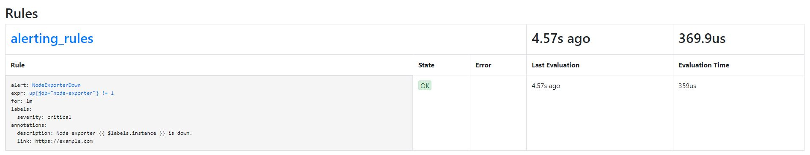

```
docker volume create prom-config
docker volume create prom-data
docker volume create node-ex-data
```

We need to create a custom network, so other containers can talk to each other:
```
docker network create my-net
```

I needed a dummy container to copy information from my work computer to volume, because it was blocked by firewalls:
```
docker container create --name dummy -v prom-config:/etc/prometheus/ hello-world
docker cp <full-path>/prometheus.yml dummy:/etc/prometheus/prometheus.yml
docker rm dummy
```

Start infrastructure containers:
```
docker run -d -p 9090:9090 --name prom --user root -v prom-config:/etc/prometheus -v prom-data:/data/prometheus --network my-net prom/prometheus --config.file="/etc/prometheus/prometheus.yml" --storage.tsdb.path="/data/prometheus"

docker run -d -p 9100:9100 --name nex --user 995:995 -v node-ex-data:/hostfs --network my-net prom/node-exporter --path.rootfs=/hostfs

docker run -d --name=grafana -p 3000:3000 --network my-net grafana/grafana
```

Compile and build your own application:
```

mvn clean
mvn install -DskipTests
docker image build  -t citizen .

docker run -d -p 8080:8080 --name citizen --network my-net citizen
```

prometheus.yml:
```
global:
  scrape_interval:     15s
  evaluation_interval: 15s

rule_files:
  # - "first.rules"
  # - "second.rules"

scrape_configs:
  - job_name: prometheus
    static_configs:
      - targets: ['localhost:9090']

  - job_name: node-exporter
    static_configs:
      - targets: ['nex:9100']

  - job_name: citizen-app
    metrics_path: /actuator/prometheus
    static_configs:
      - targets: ['citizen:8080']
```


# Testing Alertmanager

prometheus.yml:
```
global:
  scrape_interval:     15s
  evaluation_interval: 15s

rule_files:
  - "alerting_rules.yml"
  # - "second.rules"

scrape_configs:
  - job_name: prometheus
    static_configs:
      - targets: ['localhost:9090']

  - job_name: node-exporter
    static_configs:
      - targets: ['nex:9100']

  - job_name: citizen-app
    metrics_path: /actuator/prometheus
    static_configs:
      - targets: ['citizen:8080']
```

alerting_rules.yml:
```
groups:
- name: alerting_rules
  rules:
  - alert: NodeExporterDown
    expr: up{job="node-exporter"} != 1
    for: 1m
    labels:
      severity: "critical"
    annotations:
      description: "Node exporter {{ $labels.instance }} is down."
      link: "https://example.com"
```

Copy ``alerting_rules.yml`` to volume:
```
docker container create --name dummy -v prom-config:/etc/prometheus/ hello-world
docker cp <full-path>/alerting_rules.yml dummy:/etc/prometheus/alerting_rules.yml
docker rm dummy
docker container restart prom
```

Go to ``http://localhost:9090/rules``. You should see something like this:


Stop ``nex`` container. Go to ``http://localhost:9090/alerts``. There are three stages for alerting:
* ``Inactive`` - Not yet pending or firing. In other words, no alert has been triggered;
- ``Pending`` - Not yet active long enough to become firing. While the alert condition has been triggered, Prometheus will continue to check whether that condition keeps being triggered for each evaluation cycle until the ``for`` duration has passed;
- ``Firing`` - This means that the alert is active ``for`` more than the duration defined by the for clause – in this case, 1 minute.

When an alert becomes firing, Prometheus sends a JSON payload to the configured alerting service endpoint. Example of sent message:
```
[
   {
       "labels": {
           "alertname": "NodeExporterDown",
           "dc": "dc1",
           "instance": "nex:9100",
           "job": "node",
           "prom": "prom1",
           "severity": "critical"
       },
       "annotations": {
           "description": "Node exporter nex:9100 is down.",
           "link": "https://example.com"
       },
       "startsAt": "2020-07-22T21:51:15.04754979Z",
       "endsAt": "2020-07-22T21:58:15.04754979Z",
       "generatorURL": "http://prometheus:9090/graph?g0.expr=up%7Bjob%3D%22node%22%7D+%21%3D+1&g0.tab=1"
   }
]
```

### Labels and annotations

In the alert rule definition, there were two optional sections: 
* ``labels`` define the identity of an alert and they can change according to the evaluation cycle they're in; if they do this, it will alter the alert identity.
* ``annotations`` are useful to enrich the alert with more context and information. 

**Something to keep in mind is the issue of using a sample value in a label. Although it is technically possible, it's also a very bad idea. Doing so will change the alert identity every time the value changes, and, as such, will always be restarting the defined for countdown, resulting in an alert that will never enter the firing state.**

``ALERTS`` metric:


### Delays on alerting


