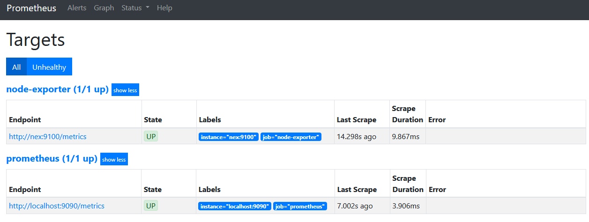

# Java, Spring, Prometheus and Grafana

#### Prerequisite

* Have docker installed

## Too long. Didn't not read

### Volumes and network

Create necessary volumes:

```
docker volume create prom-data
docker volume create node-ex-data
```

Create a custom network, so other containers can talk to each other:
```
docker network create my-net
```

### For corporate users

If your corporation firewalled docker direct access to filesystem, you can use dummy container, to copy ``prometheus.yml`` like so:

Create volume:
```
docker volume create prom-config
```

Copy to volume via dummy container:
```
docker container create --name dummy -v prom-config:/etc/prometheus/ hello-world
docker cp <full-path>/prometheus.yml dummy:/etc/prometheus/prometheus.yml
docker rm dummy
```

### Prometheus config

Create ``prometheus.yml``:
```
global:
  scrape_interval:     15s
  evaluation_interval: 15s

rule_files:
  # - "alerting_rules.yml"
  # - "second.rules"

scrape_configs:
  - job_name: prometheus
    static_configs:
      - targets: ['localhost:9090']

  - job_name: node-exporter
    static_configs:
      - targets: ['nex:9100']
```

When launching prometheus, launch with volume:
```
docker run -d -p 9090:9090 --name prom --user root -v prom-config:/etc/prometheus -v prom-data:/data/prometheus --network my-net prom/prometheus --config.file="/etc/prometheus/prometheus.yml" --storage.tsdb.path="/data/prometheus"
```

Or if you didn't use ``prom-config``, just use direct path.
```
docker run -d -p 9090:9090 --name prom --user root -v <path>:/etc/prometheus -v prom-data:/data/prometheus --network my-net prom/prometheus --config.file="/etc/prometheus/prometheus.yml" --storage.tsdb.path="/data/prometheus"
```

Start other containers:
```
docker run -d -p 9100:9100 --name nex --user 995:995 -v node-ex-data:/hostfs --network my-net prom/node-exporter --path.rootfs=/hostfs

docker run -d --name=grafana -p 3000:3000 --network my-net grafana/grafana
```

Go to ``localhost:9090``. This is Prometheus UI. Top bar → Status → Targets. Should look like below. That means that data is being scrapped.



Go to localhost:3000. You'll be prompted with Grafana login. Login: admin; Password: admin.

Left Panel → Configuration Icon → Data Sources → Prometheus. Configure Prometheus connection. Either by entering direct IP address + port, or using localhost and ``Access`` → ``Browser``.

Go to https://grafana.com/grafana/dashboards/1860 → Download JSON → Open → Grafana Left Panel → Plus Sign → Import → Paste JSON into "Import via panel json" → Load → Import.


## Add Java Application into the mix

Create simple Spring Application. pom.xml:
```
<?xml version="1.0" encoding="UTF-8"?>
<project xmlns="http://maven.apache.org/POM/4.0.0" xmlns:xsi="http://www.w3.org/2001/XMLSchema-instance"
         xsi:schemaLocation="http://maven.apache.org/POM/4.0.0 https://maven.apache.org/xsd/maven-4.0.0.xsd">
    <modelVersion>4.0.0</modelVersion>
    <parent>
        <groupId>org.springframework.boot</groupId>
        <artifactId>spring-boot-starter-parent</artifactId>
        <version>2.3.3.RELEASE</version>
        <relativePath/> <!-- lookup parent from repository -->
    </parent>
    <groupId>com.example</groupId>
    <artifactId>demo</artifactId>
    <version>0.0.1-SNAPSHOT</version>
    <name>demo</name>
    <description>Demo project for Spring Boot</description>
 
    <properties>
        <java.version>11</java.version>
    </properties>
 
    <dependencies>
        <dependency>
            <groupId>org.springframework.boot</groupId>
            <artifactId>spring-boot-starter-web</artifactId>
        </dependency>
 
        <dependency>
            <groupId>org.springframework.boot</groupId>
            <artifactId>spring-boot-starter-actuator</artifactId>
        </dependency>
 
        <dependency>
            <groupId>io.micrometer</groupId>
            <artifactId>micrometer-registry-prometheus</artifactId>
        </dependency>
 
        <dependency>
            <groupId>org.springframework.boot</groupId>
            <artifactId>spring-boot-starter-test</artifactId>
            <scope>test</scope>
            <exclusions>
                <exclusion>
                    <groupId>org.junit.vintage</groupId>
                    <artifactId>junit-vintage-engine</artifactId>
                </exclusion>
            </exclusions>
        </dependency>
    </dependencies>
 
    <build>
        <plugins>
            <plugin>
                <groupId>org.springframework.boot</groupId>
                <artifactId>spring-boot-maven-plugin</artifactId>
            </plugin>
        </plugins>
    </build>
</project>
```

Add additional Configuration class to identify your application by name:
```
@Configuration
public class MeterRegistryCustomizerConfiguration {
 
    @Bean
    public MeterRegistryCustomizer<MeterRegistry> metricsCommonTags(@Value("${spring.application.name}") String applicationName){
        return registry -> registry.config().commonTags("application", applicationName);
    }
}
```

Add ``application.yaml``:
```
spring:
  application:
    name: demo

server:
  port: 8080
  servlet:
    context-path: /

management:
  endpoints:
    enabled-by-default: false # endpoint enablement to be opt-in rather than opt-out
    web:
      exposure:
        include: health, info, prometheus, metrics #exclude everything except health, info, prometheus endpoints
  endpoint:
    health:
      enabled: true
      show-details: always
    prometheus:
      enabled: true
    metrics:
      enabled: true
```

Add ``Dockerfile``:
```
FROM openjdk:11
WORKDIR /app
COPY target/*.jar /app/application.jar
EXPOSE 8080
ENTRYPOINT ["java"]
CMD ["-jar", "application.jar"]
```

Compile and build your own application:
```
mvn clean install -DskipTests
docker image build -t demo-app .
```

Modify prometheus.yml:
```
global:
  scrape_interval:     15s
  evaluation_interval: 15s

rule_files:
  # - "first.rules"
  # - "second.rules"

scrape_configs:
  - job_name: prometheus
    static_configs:
      - targets: ['localhost:9090']

  - job_name: node-exporter
    static_configs:
      - targets: ['nex:9100']

  - job_name: demo-app
    metrics_path: /actuator/prometheus
    static_configs:
      - targets: ['demo-app:8080']
```

Start all applications in docker:
```
docker run -d -p 8080:8080 --name demo-app --network my-net demo-app
docker container start nex prom grafana
```

Check http://localhost:9090/targets. You should see demo-app too.

Download Grafana Java Micrometer already ready dashboard - https://grafana.com/grafana/dashboards/4701. Same steps as before.

### Docker-compose

docker-compose.yml: 
```
version: "3.3"
services:
  demo-app:
    image: demo-app
    ports:
      - 8080:8080
  prom:
    image: prom/prometheus
    ports:
      - 9090:9090
    volumes:
      - prom-config:/etc/prometheus
      - prom-data:/data/prometheus
    command:
      - '--config.file=/etc/prometheus/prometheus.yml'
      - '--storage.tsdb.path="/data/prometheus"'
  nex:
    image: prom/node-exporter
    ports:
      - 995:995
    volumes:
      - node-ex-data:/hostfs
    command:
      - '--path.rootfs=/hostfs'
  grafana:
    image: grafana/grafana
    ports:
      - 3000:3000
 
volumes:
  prom-data:
    external: true
  prom-config:
    external: true
  node-ex-data:
    external: true
```

Scale up:
```
docker-compose -f docker-compose.yml up -d
```

Scale down:
```
docker-compose -f docker-compose.yml down
```


# TODO Testing Alertmanager

prometheus.yml:
```
global:
  scrape_interval:     15s
  evaluation_interval: 15s

rule_files:
  - "alerting_rules.yml"
  # - "second.rules"

scrape_configs:
  - job_name: prometheus
    static_configs:
      - targets: ['localhost:9090']

  - job_name: node-exporter
    static_configs:
      - targets: ['nex:9100']

  - job_name: citizen-app
    metrics_path: /actuator/prometheus
    static_configs:
      - targets: ['citizen:8080']
```

alerting_rules.yml:
```
groups:
- name: alerting_rules
  rules:
  - alert: NodeExporterDown
    expr: up{job="node-exporter"} != 1
    for: 1m
    labels:
      severity: "critical"
    annotations:
      description: "Node exporter {{ $labels.instance }} is down."
      link: "https://example.com"
```

Copy ``alerting_rules.yml`` to volume:
```
docker container create --name dummy -v prom-config:/etc/prometheus/ hello-world
docker cp <full-path>/alerting_rules.yml dummy:/etc/prometheus/alerting_rules.yml
docker rm dummy
docker container restart prom
```

Go to ``http://localhost:9090/rules``. You should see something like this:


Stop ``nex`` container. Go to ``http://localhost:9090/alerts``.


# Kubernetes
```
- kind: DeploymentConfig
    apiVersion: v1
    metadata: 
      name: "prometheus-deployment"
      labels:
        app: "prometheus-deployment"
    spec:
      replicas: 1
      selector:
        matchLabels:
          name: prometheus-deployment
      template:
        metadata:
          labels:
            name: "prometheus-deployment"
        spec:
          containers:
          - name: "prometheus-deployment"
            image: "prom/prometheus"
            imagePullPolicy: IfNotPresent
            ports:
            - containerPort: 9090
            resources:
              requests:
                cpu: 20m
                memory: 128Mi
              limits:
                cpu: 200m
                memory: 1Gi
            args:
            - --storage.tsdb.path=/data/prometheus
            - --storage.tsdb.retention=15d
            - --config.file=/etc/prometheus/prometheus.yml
            volumeMounts:
            - mountPath: /etc/prometheus
              name: prometheus-config
            - mountPath: /data/prometheus
              name: prometheus-data
          volumes:
          - name: prometheus-config
            configMap:
              name: "prometheus-server-conf"
          - name: prometheus-data
            emptyDir: {}
```


```
apiVersion: apps/v1
kind: Deployment
metadata:
  name: grafana
  labels:
    app: grafana
spec:
  selector:
    matchLabels:
      app: grafana
  template:
    metadata:
      labels:
        app: grafana
    spec:
      containers:
      - image: grafana/grafana
        ports:
        - containerPort: 3000
          name: "http"
        imagePullPolicy: IfNotPresent
        name: grafana
        resources:
          requests:
            cpu: 20m
            memory: 128Mi
          limits:
            cpu: 200m
            memory: 1024Mi
        volumeMounts:
        - name: grafana-storage
          mountPath: /var/lib/grafana
      volumes:
      - name: grafana-storage
        emptyDir: {}
```

```
apiVersion: v1
kind: Service
metadata:
  name: grafana
  labels:
    app: grafana
spec:
  type: NodePort
  selector:
    app: grafana
  ports:
  - port: 3000
    protocol: TCP
    targetPort: 3000
```

```
apiVersion: apps/v1
kind: Deployment
metadata:
  name: prometheus
spec:
  replicas: 1
  selector:
    matchLabels:
      app: prometheus
  template:
    metadata:
      labels:
        app: prometheus
    spec:
      containers:
      - image: prom/prometheus
        imagePullPolicy: IfNotPresent
        name: prometheus
        args:
        - --config.file=/etc/prometheus/prometheus.yml
        - --storage.tsdb.path=/data/prometheus
        - --storage.tsdb.retention=15d
        ports:
        - containerPort: 9090
          name: "http"
          protocol: TCP
        resources:
          requests:
            cpu: 20m
            memory: 128Mi
          limits:
            cpu: 200m
            memory: 1Gi
        volumeMounts:
        - mountPath: /etc/prometheus
          name: config-volume
        - mountPath: /data/prometheus
          name: prometheus-data
      volumes:
      - name: config-volume
        configMap:
          name: prom-config
      - name: prometheus-data
        emptyDir: {}
```

```
apiVersion: v1
kind: Service
metadata:
  name: prometheus
spec:
  type: NodePort
  selector:
    app: prometheus
  ports:
  - port: 9090
    targetPort: 9090
```


