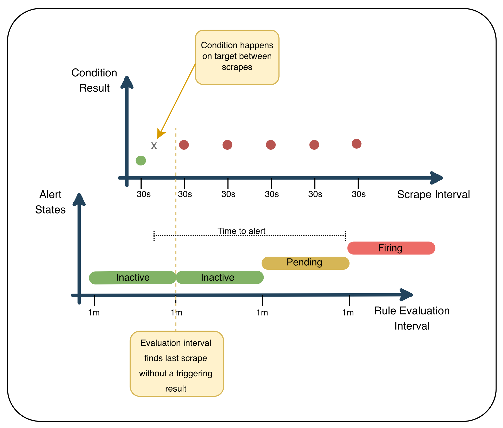
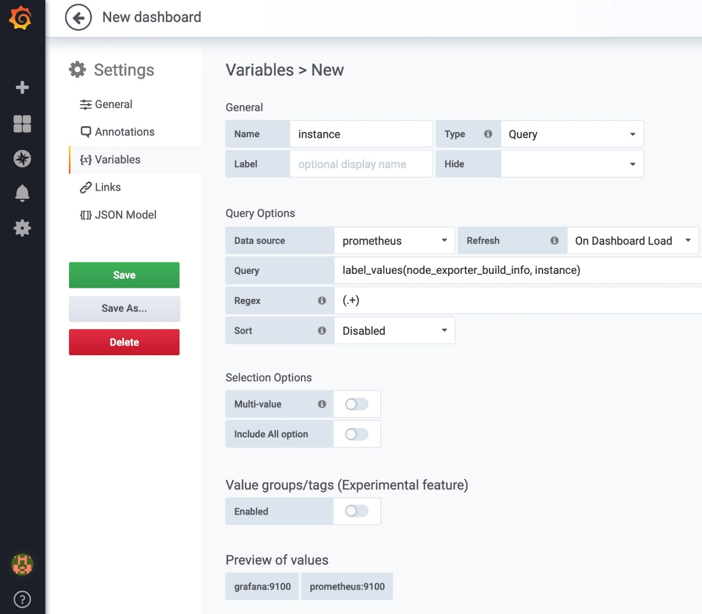

# Content
* [Deep dive into the Prometheus configuration](#deep-dive-into-the-prometheus-configuration)
  * [The storage section](#the-storage-section)
  * [The web section](#the-web-section)
  * [The query section](#the-query-section)
  * [Prometheus configuration file walkthrough](#prometheus-configuration-file-walkthrough)
  * [Global configuration](#global-configuration)

# Definition of monitoring

## Monitoring components

* **Metrics**: This exposes a certain system resource, application action, or business characteristic as a specific point in time value. This information is obtained in an aggregated form; for example, you can find out how many requests per second were served but not the exact time for a specific request, and without context, you won't know the ID of the requests.
* **Logging**: Containing much more data than a metric, this manifests itself as an event from a system or application, containing all the information that's produced by such an event. This information is not aggregated and has the full context.
* **Tracing**: This is a special case of logging where a request is given a unique identifier so that it can be tracked during its entire life cycle across every system. Due to the increase of the dataset with the number of requests, it is a good idea to use samples instead of tracking all requests.
* **Alerting**: This is the continuous threshold validation of metrics or logs, and fires an action or notification in the case of a transgression of the said threshold.
* **Visualization**: This is a graphical representation of metrics, logs, or traces.

# Whitebox versus blackbox monitoring

In **blackbox monitoring**, the application or host is observed from the outside and, consequently, this approach can be fairly limited. Checks are made to assess whether the system under observation responds to probes in a known way:
* Is a given TCP port open?
* Does the application respond with the correct data and status code when it receives a specific HTTP request?

On the other hand, in **whitebox monitoring**, the system under observation surfaces data about its internal state and the performance of critical sections:
* Exported through logging: This is by far the most common case and how applications exposed their inner workings before instrumentation libraries were widespread. For instance, an HTTP server's access log can be processed to monitor request rates, latencies, and error percentages.
* Emitted as structured events: This approach is similar to logging but instead of being written to disk, the data is sent directly to processing systems for analysis and aggregation.
* Maintained in memory as aggregates: Data in this format can be hosted in an endpoint or read directly from command-line tools. Examples of this approach are /metrics with Prometheus metrics, HAProxy's stats page, or the varnishstats command-line tool.

# Understanding metrics collection

The process by which metrics are by monitoring systems can generally be divided into two approaches — **push** and **pull**.

## An overview of the two collection approaches

In push-based monitoring systems, emitted metrics or events are sent either directly from the producing application or from a local agent to the collecting service. Some examples that use this approach include Riemann, StatsD, and the Elasticsearch, Logstash, and the Kibana (ELK) stack.

In contrast, pull-based monitoring systems collect metrics directly from applications or from proxy processes that make those metrics available to the system. Prometheus is also one of those that embraces the pull approach and is very opinionated about this.

## Push versus pull

The main point of contention is usually about target discovery.

In push-based systems, the monitored hosts and services make themselves known by reporting to the monitoring system. The advantage here is that no prior knowledge of new systems is required for them to be picked up. However, this means that the monitoring service's location needs to be propagated to all targets, usually with some form of configuration management. **Staleness is a big drawback of this approach**: if a system hasn't reported in for some time, does that mean it's having problems or was it purposely decommissioned?

**In pull-based monitoring, the system needs a definitive list of hosts and services to monitor so that their metrics are ingested.** Having a central source of truth provides some level of assurance that everything is where it's supposed to be, with the drawback of having to maintain said source of truth and keeping it updated with any changes. With the rapid rate of change in today's infrastructures, some form of automated discovery is needed to keep up with the full picture. Having a centralized point of configuration enables a much faster response in the case of issues or misconfigurations.

## What to measure

### Google's four golden signals

Google's rationale regarding monitoring is quite simple. It states, pretty straightforwardly, that the four most important metrics to keep track of are the following:

* Latency: The time required to serve a request
* Traffic: The number of requests being made
* Errors: The rate of failing requests
* Saturation: The amount of work not being processed, which is usually queued

### Brendan Gregg's USE method


* Utilization: Measured as the percentage of the resource that was busy
* Saturation: The amount of work the resource was not able to process, which is usually queued
* Errors: Amount of errors that occurred

### Tom Wilkie's RED method

* Rate: Translated as requests per second
* Errors: The amount of failing requests per second
* Duration: The time taken by those requests

# Metrics collection with Prometheus

## High-level overview of the Prometheus architecture

Prometheus itself is essential as it sits squarely in the middle of most interactions, but many components are in fact optional, depending on your monitoring needs.

As we can see in the following diagram, the main components in the Prometheus ecosystem are as follows:
* The Prometheus server collects time series data, stores it, makes it available for querying, and sends alerts based on it.
* The Alertmanager receives alert triggers from Prometheus and handles routing and dispatching of alerts.
* The Pushgateway handles the exposition of metrics that have been pushed from short-lived jobs such as cron or batch jobs.
* Applications that support the Prometheus exposition format make internal state available through an HTTP endpoint.
* Community-driven exporters expose metrics from applications that do not support Prometheus natively.
* First-party and third-party dashboarding solutions provide a visualization of collected data.


**A singular attribute of Prometheus is that it unabashedly does not try to do any type of clustering**. By not relying on the network for coordination and storage it makes a great argument for reliability and ease of use. Prometheus and run it locally on your computer, and yet the same binary might be able to handle thousands of scrape targets and the ingestion of millions of samples per second on server hardware.

# Exposing internal state with exporters

An exporter is nothing more than a piece of software that collects data from a service or application and exposes it via HTTP in the Prometheus format. Each exporter usually targets a specific service or application and as such, their deployment reflects this one-to-one synergy.

## Exporter fundamentals

When the exporter starts, it binds to a configured port and exposes the internal state of whatever is being collected in an HTTP endpoint of your choosing (the default being /metrics).

# Alert routing and management with Alertmanager

Alertmanager is the component from the Prometheus ecosystem that's responsible for the notifications that are triggered by the alerts that are generated from the Prometheus server.


At a very high level, Alertmanager is a service that receives HTTP POST requests from Prometheus servers via its API, which it then deduplicates and acts on by following a predefined set of routes.

Alertmanager also exposes a web interface to allow, for instance, the visualization and silencing of firing alerts or applying inhibition rules for them.

## Alerting routes

A route, in its essence, can be seen as a tree-like structure. If an incoming alert has a specific payload that triggers a particular route (branch), a pre-defined integration will be invoked.

There are multiple out-of-the-box integrations available for the most common use cases, such as the following:
* Email
* Hipchat
* PagerDuty
* Slack
* Opsgenie
* VictorOps
* WeChat

# Visualizing your data

The Prometheus server ships with two internal visualizations components:
* Expression browser: Here, you can run PromQL directly to quickly query data and visualize it instantly.

* Consoles: These are web pages that are built using the Golang templating language and are served by the Prometheus server itself. **This approach allows you to have pre-defined data visualization interfaces without you having to constantly type PromQL**.


# Understanding the Prometheus data model

## Time series data

Time series data can usually be defined as a sequence of numerical data points that are indexed chronologically from the same source. In the scope of Prometheus, these data points are collected at a fixed time interval.

## Time series databases

It all starts with the need to collect, store, and query measurements over time. When dealing with massive amounts of data from collectors and sensors (such as those that make up the Internet of Things), querying the resulting datasets is extremely slow if the database isn't designed with that use case in mind. **Prometheus chose to implement a time series database that was tailored to its unique problem space.**

Besides the write-heavy aspect of these types of databases, it is also important to understand that a simple query can span over several hours, days, or even months, returning a tremendous amount of data points, but is still expected to return data reasonably fast.

As such, modern time series databases store the following components:
* A timestamp
* A value
* Some context about the value, encoded in a metric name or in associated key/value pairs

Example:
```
timestamp=1544978108, company=ACME, location=headquarters, beverage=coffee, value=40172
```

## Prometheus local storage

### Data flow

The way Prometheus stores collected data locally can be seen as a three-part process:
* The freshest batch of data is kept in memory for up to two hours. This includes one or more chunks of data that are gathered during the two-hour time window. This approach dramatically reduces disk I/O;
* While in memory, data is not persisted and could be lost if the process terminates abnormally. To prevent this scenario, a **write-ahead log (WAL)** in disk keeps the state of the in-memory data so that it can be replayed if Prometheus, for any reason, crashes or restarts.
* After the two-hour time window, the chunks get written to disk. These chunks are immutable and, even though data can be deleted, it's not an atomic operation. Instead, **tombstone files are created with the information of the data that's no longer required**.

### Layout

The way data gets stored in Prometheus, as we can see in the following example, is organized into a series of directories (blocks) containing the data chunks, the LevelDB index for that data, a meta.json file with human-readable information about the block, and tombstones for data that's no longer required.

```
...
├── 01CZMVW4CB6DCKK8Q33XY5ESQH
│   ├── chunks
│   │ └── 000001
│   ├── index
│   ├── meta.json
│   └── tombstones
├── 01CZNGF9G10R2P56R9G39NTSJE
│   ├── chunks
│   │ └── 000001
│   ├── index
│   ├── meta.json
│   └── tombstones
├── 01CZNGF9ST4ZNKNSZ4VTDVW8DH
│   ├── chunks
│   │ └── 000001
│   ├── index
│   ├── meta.json
│   └── tombstones
├── lock
└── wal
    ├── 00000114
    ├── 00000115
    ├── 00000116
    ├── 00000117
    └── checkpoint.000113
        └── 00000000
```

## Prometheus data model

As we have seen so far, Prometheus stores data as time series, which includes:
* key/value pairs known as labels;
* a timestamp; 
* a value.

A time series in Prometheus is represented as follows:
```
<metric_name>[{<label_1="value_1">,<label_N="value_N">}] <datapoint_numerical_value>
```

## Cardinality

Depending on the computing resources being assigned to a Prometheus instance (that is, CPU, memory, disk space, and IOPS), it will gracefully handle a number of time series. This number can be thought of as the primary indicator of capacity for that instance, and it will inform your scraping decisions: will you have thousands of targets with relatively few metrics, fewer targets with a thousand metrics each, or something in between? In the end, Prometheus will only be able to handle that amount of time series without performance degradation.

It is in this context that the concept of cardinality appears. This term is often used to mean the number of unique time series that are produced by a combination of metric names and their associated label names/values. As an example, a single metric with no additional dimensions (such as labels) from an application that has one hundred instances will naturally mean that Prometheus will store 100 time series, one for each instance (the instance, here, is a dimension that's added outside of the application); another metric from that application that had a label with ten possible values will translate into 1,000 time series (10 time series per instance, times 100 instances). **This shows that cardinality is multiplicative** — each additional dimension will increase the number of produced time series by repeating the existing dimensions for each value of the new one. 

**The following are some examples of data with high or unbound cardinality that should not be used as label values (or in metric names, for that matter):**
* Email addresses
* Usernames
* Request/process/order/transaction ID

# A tour of the four core metric types

Prometheus metrics are divided into four main types: counters, gauges, histograms, and summaries.

## Counter

This is a strictly cumulative metric whose value can only increase. The only exception for this rule is when the metric is reset, which brings it back to zero.


## Gauge

A gauge is a metric that snapshots a given measurement at the time of collection, which can increase or decrease (such as temperature, disk space, and memory usage).


The number of established TCP connections on the Alertmanager instance:


## Histogram

**Histograms allow you to retain some granularity by counting events into buckets that are configurable on the client side, and also by providing a sum of all observed values.** Prometheus histograms produce one time series per configured bucket, plus an additional two that track the sum and the count of observed events. Furthermore, histograms in Prometheus are cumulative, which means each bucket will have the value of the previous bucket, plus the number of its own events.

This type of metric is especially useful to track bucketed latencies and sizes (for example, request durations or response sizes) as it can be freely aggregated across different dimensions. Another great use is to generate heatmaps (the evolution of histograms over time).

A Prometheus HTTP request duration in seconds, divided into buckets. This is shown in a Grafana heatmap to better illustrate the concept of buckets:


## Summaries

Summaries are similar to histograms in some ways, but present different trade-offs and are generally less useful. They are also used to track sizes and latencies, and also provide both a sum and a count of observed events. Additionally (and if the client library used supports it), summaries can also provide pre-calculated quantiles over a predetermined sliding time window. The main reason to use summary quantiles is when accurate quantile estimation is needed, irrespective of the distribution and range of the observed events.

The maximum duration of the Prometheus rule group in seconds by quantile:


# Longitudinal and cross-sectional aggregations

There are two kinds of aggregations, which are often used together: **longitudinal** and **cross-sectional aggregations**.

In the context of time series, an aggregation is a process that reduces or summarizes the raw data, which is to say that it receives a set of data points as input and produces a smaller set (often a single element) as output. **Some of the most common aggregation functions in time series databases are minimum, maximum, average, count, and sum.**

Let's pretend we've selected {company=ACME, beverage=coffee} and we're now looking at the raw counters over time per location. The data would look something like this:


For argument's sake, let's say that the samples were collected every minute. The metric type is probably a counter, as it's monotonically increasing, with the exception of the counter that's reset at ``t=1`` for ``location=factory``.

## Cross-sectional data

For example, if we want to measure current obesity levels in a population, we could draw a sample of 1,000 people randomly from that population (also known as a cross section of that population), measure their weight and height, and calculate what percentage of that sample is categorized as obese. This cross-sectional sample provides us with a snapshot of that population, at that one point in time. Note that we do not know based on one cross-sectional sample if obesity is increasing or decreasing; we can only describe the current proportion. 

## Longitudinal data

Combines both cross-sectional and time series data ideas and looks at how the subjects (firms, individuals, etc.) change over a time series.

Longitudinal aggregations are trickier to use because you need to select a time window over which to apply the aggregation.


Since the current selectors we're using return three rows of data, this means we'll have three results when applying longitudinal aggregations. In this example, we've selected the last three minutes of data for aggregation (as we mentioned previously, we're considering a 1-minute sample interval). If we apply the max() aggregation over time, since these are counters and there wasn't a reset in the selected window, we will get the latest values in the selected set: 6 for location=factory, 224 for location=warehouse, and 40,172 for location=headquarters. count() will return the number of points that were selected in the specified time range—in this case, since the collection occurs every minute and we requested it for three minutes, it will return 3 for each location.

A more interesting aggregation of this kind that wasn't mentioned before is rate(). It is a particularly useful aggregation to use with counters, as you can calculate the rate of change per unit of time—we will explore this in detail later in this book. In this example, rate() would return 1, 0, and 2 for each location, respectively.

# Deep dive into the Prometheus configuration

One of the key features of Prometheus is, owing to incredibly sane default configurations, that it can scale from a quick test running on a local computer to a production-grade instance, handling millions of samples per second without having to touch almost any of its many knobs and dials.

There are two main types of configuration on a Prometheus server: 
* command-line flags. Command-line flags control the parameters that cannot be changed at runtime, such as the storage path or which TCP port to bind to, and need a full server restart to apply any change done at this level;  
* configuration files. The configuration files control runtime configuration, such as scrape job definitions, rules files locations, or remote storage setup.

## Prometheus startup configuration

While running a Prometheus server with no startup configuration can be good enough for local instances, it is advisable to configure a couple of basic command-line flags for any serious deployment.

At the time of writing, Prometheus has almost 30 command-line flags for tweaking several aspects of its operational configuration, grouped by the following namespaces: ``config``, ``web``, ``storage``, ``rules``, ``alertmanager``, ``query``, and ``log``.

### The config section

The first thing that is usually important to set is the Prometheus configuration file path, through the ``--config.file`` flag. By default, Prometheus will look for a file named ``prometheus.yml`` in the current working directory.

## The storage section

Following the same logic from the previous section, the ``--storage.tsdb.path`` flag should be set to configure the base path to the data storage location. This defaults to ``data/`` on the current working directory, and so it is advisable to point this to a more appropriate path — possibly to a different drive/volume, where data can be safely persisted and I/O contention can be mitigated. **To note that NFS (AWS EFS included)**.

**Placing the Prometheus data storage directory in a network share is also ill-advised as transient network failures would impact the monitoring system's ability to keep functioning.**

The Prometheus local storage can only be written to by a single Prometheus instance at a time. To make sure this is the case, it uses a lock file in the data directory.

There can be an edge case to this behavior; when using persistent volumes to store the data directory, there is a chance that, when relaunching Prometheus as another container instance using the same volume, the previous instance might not have unlocked the database. This problem would make a setup of this kind susceptible to race conditions. Luckily, there is the ``--storage.tsdb.no-lockfile`` flag, which can be used in exactly this type of situation. Be warned though that, in general (and namely, in most Prometheus deployments), **it is a bad idea to disable the lock file, as doing so makes unintended data corruption easier.**

## The web section

The next step is to configure what address users are going to utilize to get to the Prometheus server. The ``--web.external-url`` flag sets this base URL so that weblinks generated both in the web user interface and in outgoing alerts link back to the Prometheus server or servers correctly. This might be the DNS name for a load balancer/reverse proxy, a Kubernetes service, or, in the simplest deployments, the publicly accessible, fully qualified domain name of the host running the server.

The ``--web.enable-lifecycle`` flag can be used to enable the ``/-/reload`` and ``/-/quit`` HTTP endpoints, which can be used to control, reload, and shut down, respectively. To prevent accidental triggering of these endpoints, and because a GET wouldn't be semantically correct, a POST request is needed.

Similarly, the ``--web.enable-admin-api`` flag is also turned off by default for the same reason. This flag enables HTTP endpoints that provide some advanced administration actions, such as creating snapshots of data, deleting time series, and cleaning tombstones.

## The query section

Some are fairly straightforward to understand, such as how long a given query can run before being aborted (``--query.timeout``), or how many queries can run simultaneously (``--query.max-concurrency``).

However, two of them set limits that can have non-obvious consequences. The first is ``--query.max-samples``, which was introduced in Prometheus 2.5.0, that sets the maximum number of samples that can be loaded onto memory. This was done as a way of capping the maximum memory the query subsystem can use to try and prevent the dreaded **query-of-death** — a query that loaded so much data to memory that it made Prometheus hit a memory limit and then killing the process. Defaults to 50,000,000 samples.

The second one is --query.lookback-delta. Without going into too much detail regarding how PromQL works internally, this flag sets the limit of how far back Prometheus will look for time series data points before considering them stale. **This implicitly means that if you collect data at a greater interval than what's set here (the default being five minutes), you will get inconsistent results in alerts and graphs, and as such, two minutes is the maximum sane value to allow for failures.**

## Prometheus configuration file walkthrough

Everything related to scrape jobs, rule evaluation, and remote read/write configuration is all defined here. As mentioned previously, these configurations can be reloaded without shutting down the Prometheus server by either sending a ``SIGHUP`` to the process, or by sending an HTTP POST request to the ``/-/reload`` endpoint (when ``--web.enable-lifecycle`` is used at startup).

At a high level, we can split the configuration file into the following sections:
* global
* scrape_configs
* alerting
* rule_files
* remote_read
* remote_write

Example configuration:
```
global:
  scrape_interval: 1m
...
scrape_configs:
  - job_name: 'prometheus'
    scrape_interval: 15s
    scrape_timeout: 5s
    sample_limit: 1000
    static_configs:
      - targets: ['localhost:9090']
    metric_relabel_configs:
      - source_labels: [ __name__ ]
        regex: expensive_metric_.+
        action: drop
```

### Global configuration

The **global configuration defines the default parameters for every other configuration section**, as well as outlining what labels should be added to metrics going to external systems, as shown in the following code block:

```
global:
  scrape_interval: 1m
  scrape_timeout: 10s
  evaluation_interval: 1m
  external_labels:
    dc: dc1
    prom: prom1
```

* ``scrape_interval`` sets the default frequency targets that should be scraped. This is **usually between 10 seconds and one minute**, and the **default 1m** is a good conservative value to start. **Longer intervals are not advisable;**
* ``scrape_timeout`` defines how long Prometheus should wait by default for a response from a target before closing the connection and marking the scrape as failed (10 seconds if not declared);
* ``evaluation_interval`` sets the default frequency recording and alerting rules are evaluated. **For sanity, both ``scrape_timeout`` and ``evaluation_interval`` have to be the same;**
* ``external_labels`` sets labels to add to any time series or alerts when communicating with external systems (federation, remote storage, Alertmanager).

## Scrape configuration

Even though Prometheus accepts an empty file as a valid configuration file, the absolute minimum useful configuration needs a ``scrape_configs`` section. This is where we define the targets for metrics collection, and if some post-scrape processing is needed before actual ingestion.

```
scrape_configs:
 - job_name: 'prometheus'
    static_configs:
      - targets: ['localhost:9090']
...

  - job_name: 'blackbox'
    static_configs:
      - targets:
        - http://example.com
        - https://example.com:443
...
```

In Prometheus terms, a scrape is the action of collecting metrics through an HTTP request from a targeted instance, parsing the response, and ingesting the collected samples to storage. The default HTTP endpoint used in the Prometheus ecosystem for metrics collection is aptly named ``/metrics``.

A collection of such instances is called a **job**.

A scrape job definition needs at least a job_name and a set of targets. In this example, static_configs was used to declare the list of targets for both scrape jobs. While Prometheus supports a lot of ways to dynamically define this list, static_configs is the simplest and most straightforward method:

```
scrape_configs:
 - job_name: 'prometheus'
    scrape_interval: 15s
    scrape_timeout: 5s
    sample_limit: 1000
    static_configs:
      - targets: ['localhost:9090']
    metric_relabel_configs:
      - source_labels: [ __name__ ]
        regex: expensive_metric_.+
        action: drop
```

Analyzing the prometheus scrape job in detail, we can see that both ``scrape_interval`` and ``scrape_timeout`` can be redeclared at the job level, thus overriding the global values.

``sample_limit`` is a scrape config field that will cause a scrape to fail if more than the given number of time series is returned. **``sample_limit`` can save you from exploding in cardinality. ``sample_limit`` is a scrape config field that will cause a scrape to fail if more than the given number of time series is returned.**

The last relevant configuration here is ``metric_relabel_configs``. This is a powerful rewrite engine that allows a collected metrics' identity to be transformed, or even dropped, before being saved to storage. The most common use cases for this feature is to blacklist a set of misbehaving metrics, dropping labels. The preceding example is using ``metric_relabel_configs`` to drop every metric that starts with ``expensive_metric_``.

```
  - job_name: 'blackbox'
    metrics_path: /probe
    scheme: http
    params:
      module: [http_2xx]
    static_configs:
      - targets:
        - http://example.com
    relabel_configs:
      - source_labels: [__address__]
        target_label: __param_target
      - source_labels: [__param_target]
        target_label: instance
      - target_label: __address__
        replacement: 127.0.0.1:9115
```

* ``metrics_path`` is used to change which endpoint Prometheus should scrape
* ``scheme`` defines whether HTTP or HTTPS is going to be used when connecting to targets
* ``params`` allows you to define a set of optional HTTP parameters

**``relabel_configs`` is used to manipulate the scrape job's list of targets.** By default, a target will have a couple of labels that have been generated automatically and that will be available for relabeling:
* ``job`` label will be set to the ``job_name`` configuration;
* ``__address__`` label will be created with the target's host and port;
* ``__scheme__`` and ``__metrics_path__`` labels will be set to their respective configurations (``scheme`` and ``metrics_path``);
* ``__param_<name>`` label will be created for each of the parameters defined in the params configuration.

Example:
* Copies the target's address into a ``__param_target`` label, which will be used to set the ``target`` ``GET`` parameter in the scrape;
* Copies the content of this newly created label into the ``instance`` label so that it is explicitly set, bypassing the automatic generation based on the ``__address__``;
* Replaces the ``__address__`` label with the address of the blackbox exporter so that scrapes are done to the exporter and not directly to the target we specified in ``static_configs``.

# Managing Prometheus in a standalone server

Not interested. Good to know where to look if going to setup it.

# Managing Prometheus in Kubernetes

## Prometheus server deployment

ConfigMap:
```
apiVersion: v1
kind: ConfigMap
metadata:
  name: prometheus-config
  namespace: monitoring 
data:
  prometheus.yml: |
    scrape_configs:
    - job_name: prometheus
      static_configs:
      - targets:
        - localhost:9090
```

Deployment:
```
apiVersion: apps/v1
kind: Deployment
metadata:
  name: prometheus-deployment
  namespace: monitoring
  labels:
    app: prometheus
spec:
  replicas: 1
  selector:
    matchLabels:
      app: prometheus
  template:
    metadata:
      labels:
        app: prometheus
      annotations:
        version: "1"
    spec:
      containers:
      - name: prometheus-server
        image: prom/prometheus:v2.9.2
        imagePullPolicy: "IfNotPresent"
        args:
          - --config.file=/etc/config/prometheus.yml
          - --storage.tsdb.path=/data
          - --web.console.libraries=/etc/prometheus/console_libraries
          - --web.console.templates=/etc/prometheus/consoles
          - --web.enable-lifecycle
        volumeMounts:
          - name: config-volume
            mountPath: /etc/config/prometheus.yml
            subPath: prometheus.yml
          - name: prometheus-data
            mountPath: /data
            subPath: ""
        resources:
          limits:
            cpu: 200m
            memory: 512Mi
          requests:
            cpu: 100m
            memory: 256Mi
        ports:
        - containerPort: 9090
        readinessProbe:
          httpGet:
            path: /-/ready
            port: 9090
          initialDelaySeconds: 30
          timeoutSeconds: 30
        livenessProbe:
          httpGet:
            path: /-/healthy
            port: 9090
          initialDelaySeconds: 30
          timeoutSeconds: 30
      securityContext:
        runAsNonRoot: true
        runAsUser: 65534
      volumes:
        - name: config-volume
          configMap:
            name: prometheus-config
        - name: prometheus-data
          emptyDir: {}
```

```
kind: Service
apiVersion: v1
metadata:
  name: prometheus-service
  namespace: monitoring
spec:
  selector:
    app: prometheus
  type: NodePort
  ports:
  - name: prometheus-port
    protocol: TCP
    port: 9090
    targetPort: 9090
```

Check which nodePort was assign to this service, then you can try to access it.

## Adding targets to Prometheus

For the sake of this example, we'll deploy yet another service and add it to our Prometheus server, going step by step on how to do it. We'll use a small Hello World type of application called ``Hey`` for our setup.

```
apiVersion: apps/v1
kind: Deployment
metadata:
  name: hey-deployment
  namespace: monitoring
  labels:
    app: hey
...
      - name: hey
        image: kintoandar/hey:v1.0.1
...
        - name: http
          containerPort: 8000
...
```

```
kind: Service
apiVersion: v1
metadata:
  name: hey-service
  namespace: monitoring
spec:
  selector:
    app: hey
  type: NodePort
  ports:
  - name: hey-port
    protocol: TCP
    port: 8000
    targetPort: 8000
```

We need to change the Prometheus ConfigMap to reflect the newly added service:
```
kind: ConfigMap
metadata:
  name: prometheus-config
  namespace: monitoring 
data:
  prometheus.yml: |
    scrape_configs:
    - job_name: prometheus
      static_configs:
      - targets:
        - localhost:9090
    - job_name: hey
      static_configs:
      - targets:
        - hey-service.monitoring.svc:8000
```

After a moment, a new deployment will take place, changing the Prometheus configuration and a new target will present itself, which you can validate in the Prometheus web user interface:


## Dynamic configuration – the Prometheus Operator

The combination of both a Kubernetes custom resource and custom controller into a pattern is what brings the Operator definition to life.

In our case, **besides managing the deployment, including the number of pods and persistent volumes of the Prometheus server, the Prometheus Operator will also update the configuration dynamically using the concept of ServiceMonitor, which targets services with matching rules against the labels of running containers**:


## Prometheus Operator deployment

Like the previous example, we'll be creating a new namespace called ``monitoring``.

### Prometheus Operator deployment

```
apiVersion: rbac.authorization.k8s.io/v1
kind: ClusterRole
metadata:
  name: prometheus-operator
rules:
- apiGroups: [apiextensions.k8s.io]
  resources: [customresourcedefinitions]
  verbs: ['*']
- apiGroups: [monitoring.coreos.com]
  resources: 
  - alertmanagers
  - prometheuses
  - prometheuses/finalizers
  - alertmanagers/finalizers
  - servicemonitors
  - prometheusrules
  verbs: ['*']
- apiGroups: [apps]
  resources: [statefulsets]
  verbs: ['*']
- apiGroups: [""]
  resources: [configmaps, secrets]
  verbs: ['*']
- apiGroups: [""]
  resources: [pods]
  verbs: [list, delete]
- apiGroups: [""]
  resources: [services, endpoints]
  verbs: [get, create, update]
- apiGroups: [""]
  resources: [nodes]
  verbs: [list, watch]
- apiGroups: [""]
  resources: [namespaces]
  verbs: [get, list, watch]
---
apiVersion: rbac.authorization.k8s.io/v1
kind: ClusterRoleBinding
metadata:
  name: prometheus-operator
roleRef:
  apiGroup: rbac.authorization.k8s.io
  kind: ClusterRole
  name: prometheus-operator
subjects:
- kind: ServiceAccount
  name: prometheus-operator
  namespace: monitoring
---
apiVersion: v1
kind: ServiceAccount
metadata:
  name: prometheus-operator
  namespace: monitoring
```

Having the new service account configured, we're ready to deploy the Operator itself, like so:

```
apiVersion: apps/v1beta2
kind: Deployment
metadata:
  labels:
    k8s-app: prometheus-operator
  name: prometheus-operator
  namespace: monitoring
spec:
  replicas: 1
  selector:
    matchLabels:
      k8s-app: prometheus-operator
  template:
    metadata:
      labels:
        k8s-app: prometheus-operator
    spec:
      containers:
      - args:
        - --kubelet-service=kube-system/kubelet
        - --logtostderr=true
        - --config-reloader-image=quay.io/coreos/configmap-reload:v0.0.1
        - --prometheus-config-reloader=quay.io/coreos/prometheus-config-reloader:v0.29.0
        image: quay.io/coreos/prometheus-operator:v0.29.0
        name: prometheus-operator
        ports:
        - containerPort: 8080
          name: http
        resources:
          limits:
            cpu: 200m
            memory: 200Mi
          requests:
            cpu: 100m
            memory: 100Mi
        securityContext:
          allowPrivilegeEscalation: false
          readOnlyRootFilesystem: true
      nodeSelector:
        beta.kubernetes.io/os: linux
      securityContext:
        runAsNonRoot: true
        runAsUser: 65534
      serviceAccountName: prometheus-operator
```

### Prometheus server deployment

Before proceeding with the setup of Prometheus, we'll need to grant its instances with the right access control permissions. The following snippets from the Prometheus RBAC manifest do just that. Next, we create a ``ClusterRoleBinding`` to grant the permissions from the aforementioned ``ClusterRole`` to a user, which in our case will be a ``ServiceAccount``.

```
apiVersion: rbac.authorization.k8s.io/v1
kind: ClusterRole
metadata:
  name: prometheus-k8s
rules:
- apiGroups:
  - ""
  resources:
  - nodes
  - services
  - endpoints
  - pods
  verbs:
  - get
  - list
  - watch
- apiGroups:
  - ""
  resources:
  - configmaps
  verbs:
  - get
- nonResourceURLs:
  - /metrics
  verbs:
  - get
---
apiVersion: rbac.authorization.k8s.io/v1
kind: ClusterRoleBinding
metadata:
  name: prometheus-k8s
roleRef:
  apiGroup: rbac.authorization.k8s.io
  kind: ClusterRole
  name: prometheus-k8s
subjects:
- kind: ServiceAccount
  name: prometheus-k8s
  namespace: monitoring
---
apiVersion: v1
kind: ServiceAccount
metadata:
  name: prometheus-k8s
  namespace: monitoring
```

Having the service account ready, we can now use the Prometheus Operator to deploy our Prometheus servers using the following manifest:

```
apiVersion: monitoring.coreos.com/v1
kind: Prometheus
metadata:
  labels:
    prometheus: k8s
  name: k8s
  namespace: monitoring
spec:
  baseImage: quay.io/prometheus/prometheus
  version: v2.9.2
  replicas: 2
  resources:
    requests:
      memory: 200Mi
  securityContext:
    fsGroup: 2000
    runAsNonRoot: true
    runAsUser: 1000
  serviceAccountName: prometheus-k8s
  serviceMonitorNamespaceSelector: {}
  serviceMonitorSelector: {}
```

### Adding targets to Prometheus

So far, we've deployed the Operator and used it to deploy Prometheus itself. Now, we're ready to add targets and go over the logic of how to generate them.

Before proceeding, we'll also deploy an application to increase the number of available targets. For this, we'll be using the Hey application once again.

```
apiVersion: apps/v1
kind: Deployment
metadata:
  name: hey-deployment
  namespace: default
spec:
  replicas: 3
  selector:
    matchLabels:
      app: hey
  template:
    metadata:
      labels:
        app: hey
    spec:
      containers:
      - name: hey
        image: kintoandar/hey:v1.0.1
        imagePullPolicy: "IfNotPresent"
        resources:
          limits:
            cpu: 50m
            memory: 48Mi
          requests:
            cpu: 25m
            memory: 24Mi
        ports:
        - name: hey-port
          containerPort: 8000
        readinessProbe:
          httpGet:
            path: /health
            port: hey-port
      securityContext:
        runAsNonRoot: true
        runAsUser: 65534
```

```
apiVersion: v1
kind: Service
metadata:
  labels:
    squad: frontend
  name: hey-service
  namespace: default
spec:
  selector:
    app: hey
  type: NodePort
  ports:
  - name: hey-port
    protocol: TCP
    port: 8000
    targetPort: hey-port
```

Finally, we are going to create service monitors for both the Prometheus instances and the Hey application, which will instruct the Operator to configure Prometheus, adding the required targets. Pay close attention to the selector configuration – it will be used to match the services we created previously.

```
apiVersion: monitoring.coreos.com/v1
kind: ServiceMonitor
metadata:
  labels:
    k8s-app: prometheus
  name: prometheus
  namespace: monitoring
spec:
  endpoints:
  - interval: 30s
    port: web
  selector:
    matchLabels:
      prometheus: k8s
```

```
apiVersion: monitoring.coreos.com/v1
kind: ServiceMonitor
metadata:
  labels:
    app: hey
  name: hey-metrics
  namespace: default
spec:
  endpoints:
  - interval: 30s
    port: hey-port
  selector:
    matchLabels:
      squad: frontend
```

ServiceMonitors are the main building block when using the Prometheus Operator. You can configure anything that goes into a scrape job, such as scrape and timeout intervals, metrics endpoint to scrape, HTTP query parameters, and so on.

# Exporters and Integrations

Even though first-party exporters cover the basics pretty well, the Prometheus ecosystem provides a wide variety of third-party exporters that cover everything else. In this chapter, we will be introduced to some of the most useful exporters available — from **operating system (OS)** metrics and **Internet Control Message Protocol (ICMP)** probing to generating metrics from logs, or how to collect information from short-lived processes, such as batch jobs.

# Test environments for this chapter

In this chapter, we'll be using two test environments: 
* one based on virtual machines (VMs) that mimic traditional static infrastructure;
* one based on Kubernetes for modern workflows.

## Static infrastructure test environment

Not interested for now.

## Kubernetes test environment

```
kubectl apply -f ./provision/kubernetes/operator/bootstrap/
kubectl apply -f ./provision/kubernetes/operator/deploy/
kubectl apply -f ./provision/kubernetes/operator/monitor/
```

Content can be found in: ``./operator/``.

# Operating system exporter

Metrics for resources such as CPU, memory, and storage devices, as well as kernel operating counters and statistics provide valuable insight to assess a system's performance characteristics. For a Prometheus server to collect these types of metrics, an OS-level exporter is needed on the target hosts to expose them in an HTTP endpoint. 

## The Node Exporter

The Node Exporter is the most well-known Prometheus exporter, for good reason. It provides over 40 collectors for different areas of the OS, as well as a way of exposing local metrics for cron jobs and static information about the host. **Like the rest of the Prometheus ecosystem, the Node Exporter comes with a sane default configuration and some smarts to identify what can be collected, so it's perfectly reasonable to run it without much tweaking.**

Although this exporter was designed to be run as a non-privileged user, it does need to access kernel and process statistics, which aren't normally available when running inside a container. This is not to say that it doesn't work in containers—every Prometheus component can be run in containers—but that additional configuration is required for it to work. It is, therefore, **recommended that the Node Exporter be run as a system daemon directly on the host whenever possible.**

## Container exporter

**Container Advisor (cAdvisor)** is a project developed by Google that collects, aggregates, analyzes, and exposes data from running containers. The data available covers pretty much anything you might require, from memory limits to GPU metrics, all available and segregated by container and/or host.

Besides exposing metrics in the Prometheus format, cAdvisor also ships with a useful web interface, allowing the instant visualization of the status of hosts and their containers.

### Configuration

There are quite a few runtime flags, so we'll feature some of the most relevant for our test case in the following table:


### Deployment

Although historically the cAdvisor code was embedded in the Kubelet binary, it is currently scheduled to be deprecated there. Therefore, we'll be launching cAdvisor as a **DaemonSet** to future proof this example and to expose its configurations, while also enabling its web interface, as a Kubernetes service, to be explored.

Config files can be found in: ``./cadvisor/``.

It's time to add cAdvisor exporters as new targets for Prometheus. For that, we'll be using the next ``ServiceMonitor`` manifest as shown here:
```
apiVersion: monitoring.coreos.com/v1
kind: ServiceMonitor
metadata:
  labels:
    p8s-app: cadvisor
  name: cadvisor-metrics
  namespace: monitoring
spec:
  endpoints:
  - interval: 30s
    port: http
  selector:
    matchLabels:
      p8s-app: cadvisor
```

**With this, we now have container-level metrics. Do note that cAdvisor exports a large amount of samples per container, which can easily balloon exported metrics to multiple thousands of samples per scrape, possibly causing cardinality-related issues on the scraping Prometheus.**

From the thousands of metrics exported by cAdvisor, these are generally useful for keeping an eye out for problems:

* ``container_last_seen``, which keeps track of the timestamp the container was last seen as running;
* ``container_cpu_usage_seconds_total``, which gives you a counter of the number of CPU seconds per core each container has used;
* ``container_memory_usage_bytes`` and ``container_memory_working_set_bytes``, which keep track of container memory usage (including cache and buffers) and just container active memory, respectively;
* ``container_network_receive_bytes_total`` and ``container_network_transmit_bytes_total``, which let you know how much traffic in the container receiving and transmitting, respectively.

### kube-state-metrics

``kube-state-metrics`` does not export container-level data, as that's not its function. It operates at a higher level, exposing the Kubernetes state, providing metrics regarding the API internal objects such as pods, services, or deployments.

Some interesting metrics from kube-state-metrics that can be used to keep an eye on your Kubernetes clusters are:

* ``kube_pod_container_status_restarts_total``, which can tell you if a given pod is restarting on a loop;
* ``kube_pod_status_phase``, which can be used to alert on pods that are in a non-ready state for a long time;
* Comparing ``kube_<object>_status_observed_generation`` with ``kube_<object>_metadata_generation`` can give you a sense when a given object has failed but hasn't been rolled back.

# From logs to metrics

## mtail

Developed by Google, mtail is a very light log processor that is capable of running programs with pattern matching logic, allowing the extraction of metrics from said logs.

# Blackbox monitoring

## Blackbox exporter

The blackbox_exporter service exposes two main endpoints:

* /metrics: Where its own metrics are exposed;
* /probe: It is the query endpoint that enables blackbox probes, returning their results in Prometheus exposition format.

The /probe endpoint, when hit with an HTTP GET request with the parameters module and target, it executes the specified prober module against the defined target, and the result is then exposed as Prometheus metrics:


For example, a request such as http://192.168.42.11:9115/probe?module=http_2xx&target=example.com will return something like the following snippet (a couple of metrics were discarded for briefness):

```
# HELP probe_duration_seconds Returns how long the probe took to complete in seconds
# TYPE probe_duration_seconds gauge
probe_duration_seconds 0.454460181
# HELP probe_http_ssl Indicates if SSL was used for the final redirect
# TYPE probe_http_ssl gauge
probe_http_ssl 0
# HELP probe_http_status_code Response HTTP status code
# TYPE probe_http_status_code gauge
probe_http_status_code 200
# HELP probe_ip_protocol Specifies whether probe ip protocol is IP4 or IP6
# TYPE probe_ip_protocol gauge
probe_ip_protocol 4
# HELP probe_success Displays whether or not the probe was a success
# TYPE probe_success gauge
probe_success 1
```

# Pushing metrics

Not interested for a moment.

# More exporters

## JMX exporter

The Java Virtual Machine (JVM) is a popular choice for core infrastructure services, such as Kafka, ZooKeeper, and Cassandra, among others. These services, like many others, do not natively offer metrics in the Prometheus exposition format and instrumenting such applications is far from being a trivial task. In these scenarios, we can rely on the Java Management Extensions (JMX) to expose the application's internal state through the Managed Beans (MBeans). The JMX exporter extracts numeric data from the exposed MBeans and converts it into Prometheus metrics, exposing them on an HTTP endpoint for ingestion.

The exporter is available in the following two forms:

* **Java agent**: In this mode, the exporter is loaded inside the local JVM where the target application is running and exposes a new HTTP endpoint.
* **Standalone HTTP server**: In this mode, a separate JVM instance is used to run the exporter that connects via JMX to the target JVM and exposes collected metrics on its own HTTP server.

**The documentation strongly advises deploying the exporter using the Java agent**, for good reason; the agent produces richer sets of metrics as compared with the standalone exporter, as it has access to the full JVM being instrumented. However, both have trade-offs that are important to be aware of so that the right tool for the job is chosen.

# Prometheus Query Language - PromQL

## Getting to know the basics of PromQL

### Selectors

**A selector** refers to a set of label matchers. The metric name is also included in this definition as, technically, its internal representation is also a label, albeit a special one: ``__name__``.  Each label name/value pair in a selector is called a label matcher, and multiple matchers can be used to further filter down the time series matched by the selector. Label matchers are enclosed in curly brackets. If no matcher is needed, the curly brackets can be omitted. Example:
```
prometheus_build_info{version="2.9.2"}
```

This selector is equivalent to the following:
```
{__name__="prometheus_build_info", version="2.9.2"}
```

### Label matchers

Matchers are employed to restrict a query search to a specific set of label values. We'll be using the ``node_cpu_seconds_total`` metric to exemplify the four available label matcher operators: 
* ``=``. Using ``=``, we can perform an exact match on the label value. For instance, if we only match CPU core 0;
* ``!=``. We can also negate a match to obtain all the remaining time series using the ``!=`` matcher;
* ``=~``. This matcher includes results that match the expression. Example: ``node_cpu_seconds_total{cpu=~"(1|0)"}`` matches all where cpu = 1 and cpu = 0;
* ``!~``. This matcher excludes results that match the expression and allows all the remaining time series. Example: ``node_cpu_seconds_total{cpu!~"(1|0)"}`` matches all where cpu != 1 or cpu != 0.

Without any matching specification, this metric alone returns an instant vector with all the available time series containing the metric name, as well as all combinations of the CPU core numbers (``cpu=”0”``, ``cpu=”1”``) and CPU modes (``mode="idle"``, ``mode="iowait"``, ``mode="irq"``, ``mode="nice"``, ``mode="softirq"``, ``mode="steal"``, ``mode="user"``, ``mode="system"``), which makes a grand total of 16 time series, as shown in the following screenshot:


### Range vectors

A range vector selector is similar to an instant vector selector, but it returns a set of samples for a given time range, for each time series that matches it. To define a range vector selector query, you have to set an instant vector selector and append a range using square brackets ``[ ]``. Possible time units:
* s - seconds
* m - minutes
* h - hours
* d - days
* w - weeks
* y - years

```
http_requests_total{code="200"}[2m]
```

### The offset modifier

The offset modifier allows you to query data in the past. This means that we can offset the query time of an instant or range vector selector relative to the current time. It is applied on a per-selector basis, which means that offsetting one selector but not another effectively unlocks the ability to compare current behavior with past behavior for each of the matched time series.

```
http_requests_total{code="200"}[2m] offset 1h
```

### Subqueries

Subquery selector allows evaluation of functions that return instant vectors over time and return the result as a range vector. We'll be using the following query example to explain its syntax:
```
max_over_time(rate(http_requests_total{handler="/health", instance="172.17.0.9:8000"}[5m])[1h:1m])
```

Splitting the query into its components, we can see the following:
* ``rate(http_requests_total{handler="/health", instance="172.17.0.9:8000"}[5m])`` - The inner query to be run, which in this case is aggregating five minutes' worth of data into an instant vector;
* ``[1h`` - Just like a range vector selector, this defines the size of the range relative to the query evaluation time;
* ``:1m]`` - The resolution step to use. If not defined, it defaults to the global evaluation interval;
* ``max_over_time`` - The subquery returns a range vector, which is now able to become the argument of this aggregation operation over time.


**Subqueries are fairly expensive to evaluate, so it is strongly discouraged to use them for dashboarding, as recording rules would produce the same result given enough time.** Similarly, they should not be used in recording rules for the same reason. **Subqueries are best suited for exploratory querying, where it is not known in advance which aggregations are needed to be looked at over time.**

## Operators

### Binary operators

Binary operators: 
* arithmetic;
* comparison.

#### Arithmetic

The arithmetic operators provide basic math between two operands. Available arithmetic operators:
* ``+``
* ``-``
* ``*``
* ``/``
* ``%``
* ``^``

#### Comparison

* ``==``
* ``!=``
* ``>``
* ``<``
* ``>=``
* ``<=``

Say, for example, we have the following instant vector:
```
process_open_fds{instance="172.17.0.10:8000", job="hey-service"} 8
process_open_fds{instance="172.17.0.11:8000", job="hey-service"} 23
```

Comparison operator:
```
process_open_fds{job="hey-service"} > 10
```

The result will be as follows:
```
process_open_fds{instance="172.17.0.11:8000", job="hey-service"} 23
```

Moreover, **we can use the bool modifier to not only return all matched time series but also modify each returned sample to become 1 or 0**, depending on whether the sample would be kept or dropped by the comparison operator.

Example:
```
process_open_fds{job="hey-service"} > bool 10
```

Result:
```
process_open_fds{instance="172.17.0.10:8000", job="hey-service"} 0
process_open_fds{instance="172.17.0.11:8000", job="hey-service"} 1
```

### Vector matching

Vector matching, as the name implies, is an operation only available between vectors. So far, we have learned that when we have a scalar and an instant vector, the scalar gets applied to each sample of the instant vector. However, when we have two instant vectors, how can we match their samples?

#### One-to-one

Example:
```
node_filesystem_avail_bytes{instance="172.17.0.13:9100", job="node-exporter-service", mountpoint="/Users"} 100397019136
node_filesystem_avail_bytes{instance="172.17.0.13:9100", job="node-exporter-service", mountpoint="/data"} 14120038400
node_filesystem_size_bytes{instance="172.17.0.13:9100", job="node-exporter-service", mountpoint="/Users"} 250685575168
node_filesystem_size_bytes{instance="172.17.0.13:9100", job="node-exporter-service", mountpoint="/data"} 17293533184
```

Apply the following operation:
```
node_filesystem_avail_bytes{} / node_filesystem_size_bytes{} * 100
```

Returns:
```
{instance="172.17.0.13:9100", job="node-exporter-service", mountpoint="/Users"} 40.0489813060515
{instance="172.17.0.13:9100", job="node-exporter-service", mountpoint="/data"} 81.64923991971679
```

It might be useful to aggregate vectors with mismatching labels. In those situations, you can apply the ``ignoring`` keyword right after the binary operator to ignore the specified labels. Additionally, it is also possible to restrict which labels from both sides should be used in matching by using the ``on`` keyword after the binary operator.

#### Many-to-one and one-to-many

Occasionally, you are required to perform operations where the element of one side is matched with several elements on the other side of the operation. When this happens, you are required to provide Prometheus with the means to interpret such operations. If the higher cardinality is on the left-hand side of the operation, you can use the ``group_left`` modifier after either ``on`` or ``ignoring``; if it's on the right-hand side, then ``group_right`` should be applied. The ``group_left`` operation is commonly used for its ability to copy labels over from the right side of the expression.

### Logical operators

These operators are the only ones in PromQL that work many-to-many:
* and - intersection. The and logical operator works by only **returning the matches from the left-hand side if the expression on the right-hand side has results with matching label key/value pairs.** All other time series from the left-hand side that do not have a match on the right-hand side are dropped;
* or - union. The union logical operator, ``or``, works by returning the elements from the left-hand side, except if there are no matches, it will return the elements from the right-hand side. Again, both sides need to have matching label names/values.
* unless - complement. The ``unless`` logical operator will return the elements from the first expression that do not match the label name/value pairs from the second.

Example:
```
node_filesystem_avail_bytes{instance="172.17.0.13:9100", job="node-exporter-service", mountpoint="/Users"} 1003970
node_filesystem_avail_bytes{instance="172.17.0.13:9100", job="node-exporter-service", mountpoint="/data"} 141200
node_filesystem_size_bytes{instance="172.17.0.13:9100", job="node-exporter-service", mountpoint="/Users"} 2506855
node_filesystem_size_bytes{instance="172.17.0.13:9100", job="node-exporter-service", mountpoint="/data"} 172935
```

Expression:
```
node_filesystem_size_bytes > 100000 and node_filesystem_size_bytes < 200000
```

Results:
```
node_filesystem_avail_bytes{instance="172.17.0.13:9100", job="node-exporter-service", mountpoint="/data"} 141200
node_filesystem_size_bytes{instance="172.17.0.13:9100", job="node-exporter-service", mountpoint="/data"} 172935
```

Expresion:
```
node_filesystem_avail_bytes > 200000 or node_filesystem_avail_bytes < 2500000
```

Results:
```
node_filesystem_avail_bytes{instance="172.17.0.13:9100", job="node-exporter-service", mountpoint="/Users"} 1003970
```

Expresion:
```
node_filesystem_avail_bytes unless node_filesystem_avail_bytes < 200000
```

Results:
```
node_filesystem_avail_bytes{instance="172.17.0.13:9100", job="node-exporter-service", mountpoint="/Users"} 1003970
node_filesystem_size_bytes{instance="172.17.0.13:9100", job="node-exporter-service", mountpoint="/Users"} 2506855
```

## Aggregation operators

By employing aggregation operators, we can take an instant vector and aggregate its elements, resulting in a new instant vector, usually with fewer elements.

Available aggregation:
* ``sum`` - Sums the elements
* ``min`` - Selects the minimum element
* ``max`` - Selects the maximum element
* ``avg`` - Calculates the average of the elements
* ``stddev`` - Calculates the standard deviation of the elements
* ``stdvar`` - Calculates the standard variance of the elements
* ``count`` - Counts the number of elements
* ``count_value`` - Counts the number of elements with the same value
* ``bottomk`` - The lower k elements by sample
* ``topk`` - The higher k elements by sample value
* ``quantile`` - Calculates the quantile of the elements

**There are two available modifiers to use in conjunction with aggregation operators that take a list of label names: ``without`` allows you to define which labels to aggregate away, effectively dropping those labels from the resulting vector, while ``by`` does exactly the opposite; that is, it allows you to specify which labels to keep from being aggregated.**

Example:
```
rate(http_requests_total[5m])
```

Would generate:
```
{code="200",endpoint="hey-port",handler="/",instance="172.17.0.10:8000",job="hey-service",method="get"} 5.891716069444445
{code="200",endpoint="hey-port",handler="/",instance="172.17.0.11:8000",job="hey-service",method="get"} 5.9669884444444445
{code="200",endpoint="hey-port",handler="/",instance="172.17.0.9:8000",job="hey-service",method="get"} 11.1336484826487
{code="200",endpoint="hey-port",handler="/health",instance="172.17.0.10:8000",job="hey-service",method="get"} 0.1
{code="200",endpoint="hey-port",handler="/health",instance="172.17.0.11:8000",job="hey-service",method="get"} 0.1
{code="200",endpoint="hey-port",handler="/health",instance="172.17.0.9:8000",job="hey-service",method="get"} 0.1000003703717421 
```

Aggregating:
```
sum(rate(http_requests_total[5m]))
```

Result:
```
{} 23.292353366909335
```

Example:
```
sum by (handler) (rate(http_requests_total[5m]))
```

Result:
```
{handler="/"} 22.99235299653759
{handler="/health"} 0.3000003703717421
```

## Functions

### absent()

This function is quite useful for alerting on, as the name suggests, absent time series.


For example, say that the instant vector exists and we execute the following expression:
```
absent(http_requests_total{method="get"})
```
This will return the following:
```
no data
```
Let's say we use an expression with a label matcher using a nonexistent label value, like in the following example:
```
absent(http_requests_total{method="nonexistent_dummy_label"})
```
This will produce an instant vector with the nonexistent label value:
```
{method="nonexistent_dummy_label"} 1
```
Let's apply absent to a nonexistent metric, as shown in this snippet:
```
absent(nonexistent_dummy_name)
```
This will translate into the following output:
```
{} 1
```

Finally, let's say we use absent on a nonexistent metric and a nonexistent label/value pair, as shown in the following snippet:
```
absent(nonexistent_dummy_name{method="nonexistent_dummy_label"})
```
The result can be seen in the following snippet:
```
{method="nonexistent_dummy_label"} 1
```

### label_join() and label_replace()

These functions are used to manipulate labels—they allow you to join labels to other ones, extract parts of label values, and even drop labels.

```
label_join(<vector>, <resulting_label>, <separator>, source_label1, source_labelN)
```

For example, say that we use the following sample data:
```
http_requests_total{code="200",endpoint="hey-port", handler="/",instance="172.17.0.10:8000",job="hey-service",method="get"} 1366
http_requests_total{code="200",endpoint="hey-port", handler="/health",instance="172.17.0.10:8000",job="hey-service",method="get"} 942
```
We then apply the following expression:
```
label_join(http_requests_total{instance="172.17.0.10:8000"}, "url", "", "instance", "handler")
```
We end up with the following instant vector:
```
http_requests_total{code="200",endpoint="hey-port", handler="/",instance="172.17.0.10:8000",job="hey-service", method="get",**url="172.17.0.10:8000/"**} 1366
http_requests_total{code="200",endpoint="hey-port", handler="/health",instance="172.17.0.10:8000",job="hey-service", method="get",**url="172.17.0.10:8000/health"**} 942
```

When you need to arbitrarily manipulate labels, ``label_replace`` is the function to use. The way it works is by applying a regular expression to the value of a chosen source label and storing the matched capture groups on the destination label.

Say that we take the preceding sample data and apply the following expression:
```
label_replace(http_requests_total{instance="172.17.0.10:8000"}, "port", "$1", "instance", ".*:(.*)")
```
The result will then be the matching elements with the new label, called port:
```
http_requests_total{code="200",endpoint="hey-port",handler="/", instance="172.17.0.10:8000", job="hey-service",method="get",port="8000"} 1366
http_requests_total{code="200",endpoint="hey-port",handler="/health", instance="172.17.0.10:8000", job="hey-service",method="get",port="8000"} 942
```
When using ``label_replace``, if the regular expression doesn't match the label value, the originating time series will be returned unchanged.

### predict_linear()

This function receives a range vector and a scalar time value as arguments. It extrapolates the value of each matched time series from the query evaluation time to the specified number of seconds in the future, given the trend in the data from the range vector. 

We'll apply the following expression, which employs ``predict_linear`` using a range of one hour of data, and extrapolate the sample value four hours in the future (60 (seconds) * 60 (minutes) * 4):
```
predict_linear(node_filesystem_free_bytes{mountpoint="/data"}[1h], 60 * 60 * 4)
{device="/dev/sda1", endpoint="node-exporter",fstype="ext4",instance="10.0.2.15:9100", job="node-exporter-service",mountpoint="/data", namespace="monitoring", pod="node-exporter-r88r6", service="node-exporter-service"} 15578514805.533087
```

### rate() and irate()

These two functions allow you to calculate the rate of increase of the given counters. Both automatically adjust for counter resets and take a range vector as an argument.

While the ``rate()`` function provides the **per second average rate of change over the specified interval** by using the first and last values in the range scaled to fit the range window, the ``irate()`` function uses the **last two values in the range for the calculation, which produces the instant rate of change.**

### histogram_quantile()

This function takes a float, which defines the required quantile (0 ≤ φ ≤ 1), and an instant vector of the gauge type as arguments. Each time series must have a ``le`` label (which means less than or equal to) to represent the upper bound of a bucket. This function also expects one of the selected time series to have a bucket named such as ``+Inf``, which works as the catch-all, the last bucket of the cumulative histogram. Since histograms that are generated by Prometheus client libraries use counters for each bucket, ``rate()`` needs to be applied to convert them into gauges for this function to do its work.

```
histogram_quantile(0.75, sum(rate(prometheus_http_request_duration_seconds_bucket[5m])) by (handler, le)) > 0
```

Result:
```
{handler="/"} 0.07500000000000001
{handler="/api/v1/label/:name/values"} 0.07500000000000001
{handler="/static/*filepath"} 0.07500000000000001
{handler="/-/healthy"} 0.07500000000000001
{handler="/api/v1/query"} 0.07500000000000001
{handler="/graph"} 0.07500000000000001
{handler="/-/ready"} 0.07500000000000001
{handler="/targets"} 0.7028607713983935
{handler="/metrics"} 0.07500000000000001
```

### sort() and sort_desc()

As their names suggest, sort receives a vector and sorts it in ascending order by the sample values, while sort_desc does the same function but in descending order.

### vector()

This is normally used as a way of ensuring an expression always has at least one result, by combining a vector expression with it, like in the following code:
```
http_requests_total{handler="/"} or vector(0)
```

## Aggregation operations over time

The aggregation operations we discussed earlier are always applied to instant vectors. When we need to perform those aggregations on range vectors, PromQL provides the ``*_over_time family`` of functions.

| Operation | Description |
| --------- | ----------- | 
| avg_over_time() | Average value of all samples in the range. |
| count_over_time() | Count of all samples in the range. |
| max_over_time() | Maximum value of all samples in the range. |
| min_over_time() | Minimum value of all samples in the range. |
| quantile_over_time() | The quantile of all samples in the range. It requires two arguments, the definition of the desired quantile, φ, as a scalar, where 0 ≤ φ ≤ 1, as a first argument and then a range-vector. |
| stddev_over_time() | The standard deviation of the sample's value in the range. |
| stdvar_over_time() | The standard variance of the sample's value in the range. |
| sum_over_time() | The sum of all sample values in the range.|

# Common patterns and pitfalls

Not interested for a moment.

# Moving on to more complex queries

Not interested for a moment.

# Troubleshooting and Validation

Not interested for a moment.

# Exploring promtool

Not interested for a moment.

# Logs and endpoint validation

Not interested for a moment.

# Analyzing the time series database

Not interested for a moment.

# Section 3: Dashboards and Alerts

# Understanding how rule evaluation works

Prometheus allows the periodic evaluation of PromQL expressions and the storage of the time series generated by them; these are called **rules**. There are two types of rules:
* Recording. The recording rules' evaluation results are saved into the Prometheus database as samples for the time series specified in the configuration. This type of rule can help take the load off of heavy dashboards by pre-computing expensive queries, aggregating raw data into a time series that can then be exported to external systems;
* Alerting. Alerting rules trigger when an evaluated PromQL expression in a rule produces a non-empty result. They are the mechanism by which alerting over time series is done in Prometheus.

## Using recording rules

Rules are **defined separately from the main Prometheus configuration file**, and are included by the latter through the ``rule_files`` top-level configuration key. They are evaluated periodically, and that interval can be defined globally with ``evaluation_interval`` inside global (defaults to one minute):
```
vagrant@prometheus:~$ cat /etc/prometheus/prometheus.yml
global:
...
  evaluation_interval: 1m
...

rule_files:
  - "recording_rules.yml"
...
```

``rule_files`` takes a list of paths, which can be relative to the main Prometheus configuration or absolute paths. Changes in rule files are not automatically picked up by Prometheus, so a reload is needed.

Just like the ``prometheus.yml`` configuration file, the ``rules`` files are also defined in are YAML format. The actual format is very easy to understand:
```
groups:
- name:  <group_name_1> 
  interval:  <evaluation_interval> 
  rules:
  - record:  <rule_name_1> 
    expr:  <promql_expression_1> 
    labels:
  <label_name> :  <label_value> 
  ...
  - record:  <rule_name_N> 
    expr:  <promql_expression_N> 
...
- name:  <group_name_N> 
  ...
```

Example:
```
...
- name: recording_rules
  rules:
  - record: instance:node_cpu:count
    expr: count without (cpu) (count without (mode) (node_cpu_seconds_total))
...
```

The first rule group is composed of a single recording rule, which is using the global evaluation interval, taking the node_cpu_seconds_total metric from the Node Exporter to count the number of CPU cores available in the virtual machine (VM), and recording that result into a new time series named ``instance:node_cpu:count``.


**Setting different intervals is usually discouraged**, for the same reasons as in scrape jobs: queries might produce erroneous results when using a series with different sampling rates, and having to periodically keep track of what series have what becomes unmanageable.

### Naming convention for recording rules

The recommended convention for recording rule naming is composed of three sections ``level:metric:operations``:
- ``level`` - represents the aggregation level of the rule, which means that it will list the labels/dimensions that are present and relevant (usually separated by underscores);
- ``metric`` - metric name that was the basis for the rule;
- ``operations`` - lists the aggregation operations that were applied to the metric.

Example:
```
- record: handler_instance:prometheus_http_request_duration_seconds_sum:rate5m
  expr: >
    rate(prometheus_http_request_duration_seconds_sum[5m])

- record: handler_instance:prometheus_http_request_duration_seconds_count:rate5m
  expr: > 
    rate(prometheus_http_request_duration_seconds_count[5m])

- record: handler:prometheus_http_request_duration_seconds:mean5m
  expr: > 
    sum without (instance) (
      handler_instance:prometheus_http_request_duration_seconds_sum:rate5m
    )
    /
    sum without (instance) (
      handler_instance:prometheus_http_request_duration_seconds_count:rate5m
    )
```

Looking at the naming of the first rule, we can easily understand that the rule is based on the ``prometheus_http_request_duration_seconds_sum`` metric; ``rate5m`` indicates that ``rate()`` is being applied to a range vector of five minutes, and the interesting labels present are ``handler`` and ``instance``.

The same logic is applied to the second rule, but this time using the ``prometheus_http_request_duration_seconds_count`` metric. The third rule, however, is a bit more nuanced; as it is dividing ``_sum`` by the ``_count`` of latency events, it effectively represents the five-minute latency average of, in this case, HTTP requests served by Prometheus. As we aggregated the instance label away, the level section reflects this by only having handler as the relevant dimension. The last thing to note is that the metric name for this rule is now ``prometheus_http_request_duration_seconds``, as it neither represents the sum nor the count, but it still makes it possible to clearly understand which metrics this rule is based on.

# Setting up alerting in Prometheus

To be clear, Prometheus is not responsible for issuing email, Slack, or any other forms of notification; that is the responsibility of another service. This service is typically **Alertmanager**.

## What is an alerting rule?

An alerting rule is much like a recording rule with some additional definitions; they can even share the same rule group without any issues. The biggest difference is that, when firing, they are sent to an external endpoint via an HTTP POST with a JSON payload for further processing. **Alert is triggered when an expression returns one or more samples.**

Alerting rules, such as recording rules, rely on PromQL expressions that are evaluated on a defined interval. For every sample returned by our expression, it will trigger an alert.

## Configuring alerting rules

### Prometheus server configuration file

```
global:
...
 evaluation_interval: 1m
...
rule_files:
 - "recording_rules.yml"
 - "alerting_rules.yml"
alerting:
 alertmanagers:
 - static_configs:
 - targets:
 - “prometheus:5001”
...
```

In this configuration, there are three components to be aware of:
* ``evaluation_interval``: This is responsible for defining the global evaluation interval for recording and alerting rules, which can be overridden at the rule group level using the ``interval`` keyword.
* ``rule_files``: This is the file location where Prometheus can read the configured recording and/or alerting rules.
* ``alerting``: This is the endpoint(s) where Prometheus sends alerts for further processing.

### Rule file configuration

```
cat /etc/prometheus/alerting_rules.yml
```

```
groups:
- name: alerting_rules
  rules:
  - alert: NodeExporterDown
    expr: up{job="node"} != 1
    for: 1m
    labels:
      severity: "critical"
    annotations:
      description: "Node exporter {{ $labels.instance }} is down."
      link: "https://example.com"
```

Components:
* ``alert`` - The alert name to use. Mandatory;
* ``expr`` - The PromQL expression to evaluate. Mandatory;
* ``for`` - The time to ensure that the alert is being triggered before sending the alert, defaults to 0. Optional;
* ``labels`` - User-defined key-value pairs. Optional;
* ``annotations`` - User-defined key-value pairs. Optional.

The ``NodeExporterDown`` rule will only trigger when the ``up`` metric with the ``job=”node”`` selector is not ``1`` for more than one minute.

There are three stages for alerting:
* ``Inactive`` - Not yet pending or firing. In other words, no alert has been triggered;
* ``Pending`` - Not yet active long enough to become firing. While the alert condition has been triggered, Prometheus will continue to check whether that condition keeps being triggered for each evaluation cycle until the ``for`` duration has passed;
* ``Firing`` - This means that the alert is active ``for`` more than the duration defined by the for clause – in this case, 1 minute.

When an alert becomes firing, Prometheus sends a JSON payload to the configured alerting service endpoint. Example of sent message:
```
[
   {
       "labels": {
           "alertname": "NodeExporterDown",
           "dc": "dc1",
           "instance": "nex:9100",
           "job": "node",
           "prom": "prom1",
           "severity": "critical"
       },
       "annotations": {
           "description": "Node exporter nex:9100 is down.",
           "link": "https://example.com"
       },
       "startsAt": "2020-07-22T21:51:15.04754979Z",
       "endsAt": "2020-07-22T21:58:15.04754979Z",
       "generatorURL": "http://prometheus:9090/graph?g0.expr=up%7Bjob%3D%22node%22%7D+%21%3D+1&g0.tab=1"
   }
]
```

### Labels and annotations

In the alert rule definition, there were two optional sections: 
* ``labels`` define the identity of an alert and they can change according to the evaluation cycle they're in; if they do this, it will alter the alert identity.
* ``annotations`` are useful to enrich the alert with more context and information. 

**Something to keep in mind is the issue of using a sample value in a label. Although it is technically possible, it's also a very bad idea. Doing so will change the alert identity every time the value changes, and, as such, will always be restarting the defined for countdown, resulting in an alert that will never enter the firing state.**

``ALERTS`` metric:


### Delays on alerting

Given:
* ``scrape_interval: 30s``
* ``evaluation_interval: 1m``
* ``for: 1m``

Then it can take up to 2 minutes for alert to becoming ``firing``.



# Testing your rules

``promtool`` offers ``test rules`` subcommand can simulate the periodic ingestion of samples for several time series, use those series to evaluate recording and alerting rules, and then test whether the recorded series match what was configured as the expected results. 

## Recording rules tests

The ``promtool`` tool included in the Prometheus binary distribution allows us to define test cases to validate that the rules we write behave as expected.

``recording_rules.yml``:
```
groups:
- name: recording_rules
  rules:
  - record: instance:node_cpu:count
    expr: count without (cpu) (count without (mode) (node_cpu_seconds_total))

- name: different_eval_interval
  interval: 5s
  rules:
  - record: handler_instance:prometheus_http_request_duration_seconds_sum:rate5m
    expr: >
      rate(prometheus_http_request_duration_seconds_sum[5m])
  - record: handler_instance:prometheus_http_request_duration_seconds_count:rate5m
    expr: >
      rate(prometheus_http_request_duration_seconds_count[5m])
  - record: handler:prometheus_http_request_duration_seconds:mean5m
    expr: >
      sum without (instance) (
        handler_instance:prometheus_http_request_duration_seconds_sum:rate5m
      )
      /
      sum without (instance) (
        handler_instance:prometheus_http_request_duration_seconds_count:rate5m
      )

```

``tests.yml``:
```
rule_files:
  - /etc/prometheus/recording_rules.yml
  - /etc/prometheus/alerting_rules.yml
evaluation_interval: 1m
tests:
  - interval: 15s
    input_series:
      - series: 'node_cpu_seconds_total{cpu="0",instance="prometheus:9100",job="node",mode="user"}'
        values: '1 1 1 1 1 1 1 1 1 1'
      - series: 'node_cpu_seconds_total{cpu="1",instance="prometheus:9100",job="node",mode="user"}'
        values: '1 1 1 1 1 1 1 1 1 1'
      - series: 'node_cpu_seconds_total{cpu="0",instance="example:9100",job="node",mode="idle"}'
        values: '1 1 1 1 1 1 1 1 1 1'
      - series: 'node_cpu_seconds_total{cpu="0",instance="example:9100",job="node",mode="system"}'
        values: '1 1 1 1 1 1 1 1 1 1'

    promql_expr_test:
      - expr: instance:node_cpu:count
        eval_time: 1m
        exp_samples:
          - labels: 'instance:node_cpu:count{instance="prometheus:9100", job="node"}'
            value: 2
          - labels: 'instance:node_cpu:count{instance="example:9100", job="node"}'
            value: 1

  - interval: 1m
    input_series:
      - series: 'up{job="node",instance="prometheus:9100"}'
        values: '1 1 1 0 0 0 0 0 0 0'
      - series: 'up{job="prometheus",instance="prometheus:9090"}'
        values: '1 0 1 1 1 0 1 1 1 1'

    alert_rule_test:
      - alertname: NodeExporterDown
        eval_time: 3m
      - alertname: NodeExporterDown
        eval_time: 4m
        exp_alerts:
          - exp_labels:
              instance: "prometheus:9100"
              job: "node"
              severity: "critical"
            exp_annotations:
              description: "Node exporter prometheus:9100 is down."
              link: "https://example.com"

  - interval: 5s
    input_series:
      - series: 'prometheus_http_request_duration_seconds_count{handler="/",instance="localhost:9090",job="prometheus"}'
        values: '0+5x60'
      - series: 'prometheus_http_request_duration_seconds_sum{handler="/",instance="localhost:9090",job="prometheus"}'
        values: '0+1x60'

    promql_expr_test:
      - expr: handler_instance:prometheus_http_request_duration_seconds_count:rate5m
        eval_time: 5m
        exp_samples:
          - labels: 'handler_instance:prometheus_http_request_duration_seconds_count:rate5m{handler="/",instance="localhost:9090",job="prometheus"}'
            value: 1

      - expr: handler_instance:prometheus_http_request_duration_seconds_sum:rate5m
        eval_time: 5m
        exp_samples:
          - labels: 'handler_instance:prometheus_http_request_duration_seconds_sum:rate5m{handler="/",instance="localhost:9090",job="prometheus"}'
            value: 0.2

      - expr: handler:prometheus_http_request_duration_seconds:mean5m
        eval_time: 5m
        exp_samples:
          - labels: 'handler:prometheus_http_request_duration_seconds:mean5m{handler="/",job="prometheus"}'
            value: 0.2
```

Definition of the test cases, under the ``tests`` key. Let's analyze first test.
``interval`` sets the time that interval samples are generated in our simulated time series:
```
- interval: 15s
```
The list of input_series define what time series to generate and what values to produce in each iteration of the simulated collection interval:
```
input_series:
  - series: 'node_cpu_seconds_total{cpu="0",instance="prometheus:9100",job="node",mode="user"}'
    values: '1 1 1 1 1 1 1 1 1 1'
  - series: 'node_cpu_seconds_total{cpu="1",instance="prometheus:9100",job="node",mode="user"}'
    values: '1 1 1 1 1 1 1 1 1 1'
  - series: 'node_cpu_seconds_total{cpu="0",instance="example:9100",job="node",mode="idle"}'
    values: '1 1 1 1 1 1 1 1 1 1'
  - series: 'node_cpu_seconds_total{cpu="0",instance="example:9100",job="node",mode="system"}'
    values: '1 1 1 1 1 1 1 1 1 1'
```

The list of PromQL expressions to test is defined as ``promql_expr_test``. Each ``expr`` defines a particular expression:
```
- expr: instance:node_cpu:count
```

The point in time at which this expression will be run is set by setting eval_time, and the expected samples should be returned by running that expression as exp_samples:
```
eval_time: 1m
  exp_samples:
    - labels: 'instance:node_cpu:count{instance="prometheus:9100", job="node"}'
      value: 2
    - labels: 'instance:node_cpu:count{instance="example:9100", job="node"}'
      value: 1
```

In this test pack, we can see four time series being generated every 15 seconds for the same metric, ``node_cpu_seconds_total``. As the actual value of these series isn't relevant for this recording rule (it only counts the number of CPUs per instance), a value of ``1`` was set for every sample. Do note the variation of labels present, namely that the ``prometheus:9100`` instance is reporting metrics for two CPUs and ``example:9100`` for one. The actual test is just validating that, when the ``instance:node_cpu:count`` expression is evaluated at ``t=1m`` (**as if 1 minute had passed after the generated collection started**), the returned samples should show the correct count of CPUs for each instance.

We are now ready to execute the tests using the following instruction:
```
vagrant@prometheus:/etc/prometheus$ promtool test rules tests.yml 
Unit Testing: tests.yml
  SUCCESS
```

The tests for the second recording rule group are mostly the same, but they showcase a powerful notation for generating a richer input series:
```
- interval: 5s
    input_series:
      - series: 'prometheus_http_request_duration_seconds_count{handler="/",instance="localhost:9090",job="prometheus"}'
        values: '0+5x60'
      - series: 'prometheus_http_request_duration_seconds_sum{handler="/",instance="localhost:9090",job="prometheus"}'
        values: '0+1x60'
```

This is called an **expanding notation**. This is a compact way of declaring a formula for the generation of time series values over time. 
It takes the form of either ``A+BxC`` or ``A-BxC``, where:
* ``A`` is the starting value, 
* ``B`` is the amount of increase (when preceded by +) or decrease (when preceded by -) 
* ``C`` is how many iterations this increase or decrease should be applied for.

Coming back to our example, ``0+5x60`` will expand to the following series:
```
0 5 10 15 20 … 290 295 300
```

You can mix and match literal values with expanding notation when declaring the values for an input time series:
```
0 1 1 0 1+0x3 0 1 1 0 1 1 0 0 0 1 1 0+0x3 1
```

Will become this:
```
0 1 1 0 1 1 1 1 0 1 1 0 1 1 0 0 0 1 1 0 0 0 0 1
```

## Alerting rules tests

Alerting rules are located:
```
rule_files:
  - /etc/prometheus/alerting_rules.yml
```

Evaluation time:
```
evaluation_interval: 1m
```

The alerting test is conveniently in its own test group, so let's have a look at its full definition:
```
- interval: 1m
  input_series:
    - series: 'up{job="node",instance="prometheus:9100"}'
      values: '1 1 1 0 0 0 0 0 0 0'
    - series: 'up{job="prometheus",instance="prometheus:9090"}'
      values: '1 0 1 1 1 0 1 1 1 1'
```

A thing to note in this example is that the second input series should never be picked up by our testing rule, as the defined alert is specifically matching ``job="node"``:
```
alert_rule_test:
  - alertname: NodeExporterDown
    eval_time: 3m
  - alertname: NodeExporterDown
    eval_time: 4m
    exp_alerts:
      - exp_labels:
          instance: "prometheus:9100"
          job: "node"
          severity: "critical"
        exp_annotations:
          description: "Node exporter prometheus:9100 is down."
          link: "https://example.com"
```

The ``alert_rule_test`` section lists what alerts should be evaluated (``alertname``) at what time relative to the simulated start of the test run (``eval_time``). If the alert is expected to be firing at that time, an additional ``exp_alerts`` section should be defined listing what set of expected labels (``exp_labels``) and annotations (``exp_annotations``) should be present for each instance of the alert. **Leaving the ``exp_alerts`` section empty means that the alert is not expected to be firing at the given time.**

The first alerting test will be executed at the third minute, and, as the matching series we provided previously returns the value ``1`` at that moment, the alert expression defined at ``alerting_rules.yml`` will not trigger – this means that no data is returned by the expression defined in the alert.

The second alerting rule will be executed at the fourth minute and will return data, as the matching series we provided has the sample value ``0`` at that specific moment.

# Discovering and Creating Grafana Dashboards

## How to use Grafana with Prometheus

Configuration -> Preferences -> Grafana theme: Light

## Data source

There are two ways to configure a data source:
* One way is by adding a YAML file with the required configuration in the Grafana provisioning path, which is picked up by the service when starting up and is configured automatically;
* The other option is using the web interface by going into Configuration -> Data Sources. 

data-source.yaml:
```
cat /etc/grafana/provisioning/datasources/prometheus.yaml 

apiVersion: 1
datasources:
- name: prometheus
  type: prometheus
  access: proxy
  orgId: 1
  url: http://prometheus:9090
  isDefault: True
  version: 1
  editable: True
```

 Grafana provides two options for accessing data sources:
 * with proxying requests;
 * without proxying requests.
 
When proxying requests, every single query that's made from a dashboard panel or through the Explore expression browser will be proxied through the Grafana backend to the data source.
 
When ``Access`` option is set as ``Server (Default)``. This means that all the requests for the data source will be proxied through the Grafana instance.

## Explore

This feature was introduced in Grafana 6 and its developers continue to improve its tight integration with Prometheus. Before Explore, every single time you wanted to perform an exploratory query, you were required to jump to the Prometheus expression browser.

## Dashboards

There are several ways that you can add dashboards:
* By manually building your own;
* By importing grafana.com community-driven dashboards;
* By automatically provisioning previously stored dashboards.

# Building your own dashboards

## Panels


A panel, besides having the ability to query the chosen data source, also provides multiple visualization options to choose from. Four of the most used ones are:
* **Graph**: This the main Grafana panel. It provides the tools to create rich two-dimensional graphs backed by one or more PromQL expressions.
* **Singlestat**: This is a multipurpose single-value display. As such, the PromQL query must return an instant vector with one sample only.
* **Gauge**: Using thresholds, this represents the position the current value is at in relation to the defined higher and lower bounds. Like the Singlestat visualization, this option requires a single instant vector with only one sample.
* **Table**: This displays the result of a PromQL expression in a table format, with each label in its own column, along with the value and the timestamp.

### Variables

The variables feature is extremely powerful. It allows a dashboard to configure placeholders that can be used in expressions, and those placeholders can be filled with values from either a static or dynamic list, which are usually presented to the dashboard user in the form of a drop-down menu. In our example dashboard, we're using this feature to allow the user to choose which node instance to present.

Dashboard settings -> Variables


### Creating a basic dashboard

**``Shift + ?`` displays shortcuts.**

Dashboard settings -> Variables



In this example, we're creating a variable named instance using the Query type, which means it will populate its values from the results of the query to the data source.

Now comes the interesting part: since we are interested in collecting Node Exporter instances, we use a metric in the **Query** field that is guaranteed to return the instances we require, ``node_exporter_build_info``. The ``label_values()`` function isn't actually valid PromQL, but is provided by the Prometheus data source plugin in Grafana to use in this field to facilitate these kind of expressions.

The **Regex** field is used to match the parts of the query result we want to use to populate the variable. In our example, we want the full content of the instance label, so we match everything inside a regular expression capture group, ``(.+)``. We can see that the matching is working in the **Preview of values** section at the bottom of the screen.

We can now see the following dropdown menu with the values of the instance variable:


It's time to create our first panel. Click on the top-right graph logo, and in the new panel, click Add Query. The following screenshot illustrates the query interface:


Here, we can specify the PromQL queries (one or more, depending on the visualization type) to perform on the desired data source. In our example, we'll be creating a graph of CPU usage per mode, and we want to template the query so that it uses the ``instance`` variable we created earlier. Note the ``$instance``, which will be replaced at query time with the selected value in the ``instance`` combo box. The full expression is as follows:
```
label_replace(avg by (mode, instance) (irate(node_cpu_seconds_total{instance="$instance", mode!="idle"}[5m])), "instance", "$1", "instance", "([^:]+):.+")
```

The ``label_replace()`` function allows us to remove the port from the instance value, which we'll use in the **Legend** field. This field allows the substitution of ``{{ }}`` template markers with the values of the metric labels set within it.


**If there are panels that are not related to each other inside a dashboard, perhaps it would be a good idea to split them into their own dashboard.**

# Discovering ready-made dashboards

Both community-driven and official dashboards are available at https://grafana.com/dashboards. For example by entering:
Data Source: Prometheus;
Panel Type: Singlestat;
Category: Host Metrics;
Collector: nodeExporter.

# Default Prometheus visualizations

Historically, Prometheus maintained its own tool to create dashboards, called PromDash. Over time, since Grafana improved its native support for Prometheus as a data source, the community began gravitating toward using Grafana as its primary visualization solution—so much so that PromDash was deprecated by the people who maintained Prometheus in favor of Grafana.

Even though Grafana is the recommended visualization solution for most people, Prometheus also ships with an internal dashboarding feature called **console templates**.

# Understanding and Extending Alertmanager

## Setting up the test environment

To work with Alertmanager, we'll be three new instances to simulate a highly available setup.


# Alertmanager fundamentals

Prometheus delegates notification handling and routing to external systems through a Webhook-style HTTP interface. This is where Alertmanager comes in.

**Alertmanager is responsible for accepting the alerts generated from Prometheus alerting rules and converting them into notifications.**

Alertmanager is also the only component in the official stack that distributes its state across instances so that it can keep track of things such as which alerts were already sent and which ones are silenced.

## The notification pipeline


### Dispatching alert groups to the notification pipeline

Whenever an alerting rule is triggered, Prometheus will send an alert in the form of a JSON payload to the Alertmanager API, and it will keep sending updates at each evaluation interval of that rule or every minute (configurable through the ``--rules.alert.resend-delay`` flag), whichever is longer. When alerts are received by Alertmanager, they go through the dispatching step, where they will be grouped using one or more of the alert labels, such as ``alertname``.

**This allows you to sort alerts into categories, which can reduce the number of notifications that are sent as multiple alerts in the same category and are grouped together in a single notification.**

**When running multiple Prometheus instances with the same configuration (a common setup when pursuing high availability/redundancy), alerting rules for the same condition won't necessarily trigger at the exact same time. Alertmanager accounts for this situation by having a configurable time interval.** It will wait before doing anything else so that similar alerts can be grouped together and thus avoid sending multiple notifications for a single type of problem.

### Inhibition

A good example to help us understand what alert inhibition is imagining a server rack and what happens if the top-of-rack switch fails. In this scenario, all the servers and services in that rack will start triggering alerts because they suddenly became unreachable. To avoid this problem, we can use the alert for the top-of-rack switch which, if triggered, will prevent the notifications for all the other alerts in that rack from going out. This helps the operator become more focused on the real problem and avoid a flood of unactionable alerts.

**So, in a nutshell, inhibition allows you to map dependencies between alerts, and therefore prevents notifications for dependent alerts from going any further in the notification pipeline.**

### Silencing

Silencing is a common concept in monitoring/alerting systems; it is how you can avoid alert notifications from going out in a time-capped way. It is often used to disable notifications during maintenance windows, or to temporarily suppress alerts of lower importance during incidents. Alertmanager takes this concept and supercharges it by taking advantage of the fact that alerts coming in usually have one or more differentiating labels: ones from the originating alerting rule expression, the ``alertname``, the alert's label fields, from ``alert_relabel_configs``, as well as the ones from the Prometheus ``external_labels``. **This means that any one of these labels (or a combination of them) can be used to temporarily disable notifications through either direct matching or through regular expression matching.**

**!NOTE. You should be careful with regex matching as you can accidentally silence more than you expect.**

**Silences are defined at runtime. They can be set using the Alertmanager web interface, amtool (the Alertmanager command-line interface, which is going to be presented shortly), or directly through the API.**

 Creating a silence requires that you set an expiration date for it, and why the web UI only recognizes durations up to days.
 
 ### Routing
 
When an alert batch reaches this phase, Alertmanager needs to decide where to send it. Since the most common use cases are to have different people interested in different alerts, different notification methods for different alert severities, or even a combination of both, this step enables just that by way of a routing tree. It is composed of routes (if any), each of which specifies a match criteria for one or more labels and a receiver, and a root node, which defines a catch-all receiver in case none of the sub-routes have a match for the alert groups passing through.

### Alertmanager clustering

The overview of the notification pipeline does not touch on the high availability component of Alertmanager. The way high availability is achieved is by relying on gossip instead of using a consensus-based protocol; this means there's no real reason for choosing an odd number of instances in a cluster. Using gossip, the cluster shares the notification log (nflog) between all Alertmanager instances, which in turn will be aware of the collective state of the cluster regarding notifications. 

The Alertmanager ``/#/status`` page shows the status of the gossip cluster, along with the known peers. You can check out this endpoint in our test environment by opening up, for example, ``http://192.168.42.11:9093/#/status``:


As we now know, inhibition is set at the configuration file level, so it should be the same across all Alertmanager instances. **However, silences also need to be gossiped across the cluster as they are set at runtime on a single Alertmanager instance. This is a good way to validate if the clustering is working as expected – confirming whether the configured silences show up in all instances.**

The way clustering works in Alertmanager is like so: every Prometheus instance sends alerts to all the Alertmanager instances they know about.

# Alertmanager configuration

## Prometheus configuration

There are a couple of configurations that need to be done in Prometheus so that we can start using Alertmanager.

**The first thing to do is configure the external labels**, which are labels that are added to time series data (if it doesn't already have them) when communicating with external systems, including but not limited to Alertmanager. These are labels that uniquely identify the origin of the metrics, such as ``region``, ``datacenter``, or ``environment``.
External labels are configured inside the top-level ``global`` key in the Prometheus main configuration file.

**The second thing to do is configure Prometheus so that it can send alerts to Alertmanager.** This configuration is set on the Prometheus configuration file in a top-level section called ``alerting``.

Example:
```
cat /etc/prometheus/prometheus.yml

global:
  external_labels:
    dc: dc1
alerting:
  alertmanagers:
  - static_configs:
    - targets:
      - alertmanager01:9093
      - alertmanager02:9093
      - alertmanager03:9093
...
```

In this alerting section, we can also use ``alert_relabel_configs``, which has the same configuration syntax as ``relabel_configs`` and ``metric_relabel_configs`` as explained in Running a Prometheus Server. Since ``alert_relabel_configs`` is run right before we send out alerts, external labels are present in those alerts and as such are available for manipulation. Here's an example of preventing alerts with a label called ``environment`` and matching value of ``development`` from being pushed to Alertmanager:
```
alert_relabel_configs:
- source_labels: [environment]
  regex: development
  action: drop
```

## Configuration file overview

Alertmanager is configured through a single configuration file, and can reload it at runtime without restarting the same way Prometheus does: either sending a SIGHUP to the process or sending an HTTP POST request to the /-/reload endpoint.

The configuration file is divided into five top-level sections: ``global``, ``route``, ``inhibit_rules``, ``receivers``, and ``templates``.

### global

The global section gathers all the configuration options that are valid in other sections of the file, and act as default settings for those options. Example:
```
global:
  smtp_smarthost: 'mail.example.com:25'
  smtp_from: 'example@example.com'
...
```

This example configuration sets the default email ``smarthost`` and the ``from`` address for every receiver that uses the email (SMTP) notifier.

### route

This is ostensibly the most important configuration section of Alertmanager. In this section you can define:
* ``group_by`` - group alerts based on their labels
* ``group_interval`` - how long to wait for new alerts before sending additional notifications
* ``repeat_interval`` - and how long to repeat them
* ``receiver`` - which receivers should be triggered for each alert batch

Example:
```
route:
  receiver: operations
  group_by: ['alertname', 'job']
  group_wait: 30s
  group_interval: 5m
  repeat_interval: 4h

  routes:
  - match_re:
      job: (checkoutService|paymentService)
    receiver: yellow-squad-email
    routes:
    - match:
        severity: pager
      receiver: yellow-squad-pager
...
```

Explained:
* Defines the ``operations`` receiver as the default route when no other sub-routes match
* Groups incoming alerts by ``alertname`` and ``job``
* Waits 30 seconds for more alerts to arrive before sending the first notification to reduce the number of notifications for the same problem
* Waits five minutes before sending additional notifications when new alerts are added to a batch
* Resends a notification every four hours for each alert batch with the currently firing alerts
* Sets a sub-route for alerts whose ``job`` label matches either ``checkoutService`` or ``paymentService`` with its own receiver, ``yellow-squad-email``
* That sub-route, in turn, define its own child route that, if the severity label matches ``pager``, should use the ``yellow-squad-pager receiver`` instead

### inhibit_rules

```
inhibit_rules:
  - source_match:
      job: 'icmp'
    target_match_re:
      alertname: (AlertmanagerDown|NodeExporterDown)
    equal: ['base_instance']
```

In this example, we can read the following: if there's an alert with the ``job`` label set to ``icmp``, mute all other alerts with an ``alertname`` that matches ``AlertmanagerDown`` or ``NodeExporterDown`` when ``base_instance`` is the same across all matched alerts.

### receiver

A receiver contains notifiers. Example:
```
route:
  receiver: operations
...
receivers:
- name: 'operations'
  webhook_configs:
  - url: 'http://127.0.0.1:5001'
...
```

The top-level route, also known as the catch-all or fallback route, will trigger the receiver named ``operations`` when incoming alerts aren't matched in other sub-routes. The ``operations`` receiver is configured using a single notifier, which is the Webhook notifier. This means that alerts that go to this receiver are sent to the URL specified in the ``url`` configuration key.

## The amtool command-line tool

Similar to ``promtool``, ``amtool`` is an easy-to-use command-line tool backed by the Alertmanager HTTP API. The amtool sub-commands are split into four groups:
* ``alert``
* ``silence``
* ``check-config``
* ``config``

### alert

This sub-command allows you to query the Alertmanager cluster for currently firing alerts, which can be achieved as follows:
```
amtool alert --alertmanager.url http://alertmanager02:9093
Alertname Starts At Summary 
deadmanswitch 2019-03-31 14:49:45 UTC 
InstanceDown 2019-03-31 15:48:30 UTC
```

Another feature this sub-command has is the ability to create alerts on demand. This can come in useful for testing purposes. For example, let's create a new alert named ``ExampleAlert`` with the label ``example="amtool"``:
```
amtool alert add alertname="ExampleAlert" example="amtool" --alertmanager.url http://alertmanager02:9093
```

The ``add`` action expects one label name/value pair per command argument, as we can see in the preceding code. This action will also consider the first argument since the ``alertname`` has no label name. **An alert can be created without a name if we omit the alertname label, which can cause some weirdness in both amtool and the Alertmanager web UI, so some caution regarding this is advised.**

We can check that it was added correctly by waiting a bit (the defined ``group_wait`` in the test environment is 30 seconds) and then querying the current alerts again:
```
amtool alert --alertmanager.url http://alertmanager02:9093
Alertname Starts At Summary 
deadmanswitch 2019-03-31 14:49:45 UTC 
InstanceDown 2019-03-31 15:48:30 UTC 
ExampleAlert 2019-03-31 15:55:00 UTC 
```

Keep in mind that this newly created alert will be considered resolved after five minutes of inactivity (the default value for ``resolve_timeout``).

### silence

With this sub-command, we can manage silences. First, we can try to query the available silences in the cluster by using the following instruction:

```
amtool silence --alertmanager.url http://alertmanager02:9093
ID Matchers Ends At Created By Comment
```

As we can see, no silence is currently being enforced. Let's create a new one for the previous generated alert by matching its label, example="amtool", and checking the silences again:
```
amtool silence add 'example="amtool"' --comment "ups" --alertmanager.url http://alertmanager02:9093
1afa55af-306a-408e-b85c-95b1af0d7169
```

```
amtool silence --alertmanager.url http://alertmanager02:9093
ID Matchers Ends At Created By Comment 
1afa55af-306a-408e-b85c-95b1af0d7169 example=amtool 2019-03-31 16:58:08 UTC vagrant ups
```

We can now see that the new silence has been added. To verify that it's already in effect, we can use the alert sub-command and check that the ExampleAlert has disappeared from the list of current alerts:
```
amtool alert --alertmanager.url http://alertmanager02:9093
Alertname Starts At Summary 
deadmanswitch 2019-03-31 14:49:45 UTC 
InstanceDown 2019-03-31 15:48:30 UTC
```

We can now see that the new silence has been added. To verify that it's already in effect, we can use the alert sub-command and check that the ExampleAlert has disappeared from the list of current alerts:
```
amtool alert --alertmanager.url http://alertmanager02:9093
Alertname Starts At Summary 
deadmanswitch 2019-03-31 14:49:45 UTC 
InstanceDown 2019-03-31 15:48:30 UTC
```

Let's remove the silence we just created by using the expire action. For this, we need the silence identifier, which can be seen in the ID column when we listed the current silences:
```
amtool silence expire 1afa55af-306a-408e-b85c-95b1af0d7169 --alertmanager.url http://alertmanager02:9093
amtool silence --alertmanager.url http://alertmanager02:9093
ID Matchers Ends At Created By Comment
```

If we query the list of current alerts again, we will see our ``ExampleAlert`` there again.

### check-config

This is probably the most useful feature of ``amtool``: the ability to validate the syntax and schema of our Alertmanager configuration file and referenced template files. You can test the ``check-config`` sub-command by following this example:
```
amtool check-config /etc/alertmanager/alertmanager.yml 
Checking '/etc/alertmanager/alertmanager.yml' SUCCESS
Found:
 - global config
 - route
 - 1 inhibit rules
 - 8 receivers
 - 1 templates
  SUCCESS
```

### config

With the ``config`` sub-command, we can consult the internal configuration of a running Alertmanager instance, which includes all configurable fields, even ones not explicitly listed in the configuration file. You can check this by issuing the following command:

```
amtool config --alertmanager.url http://alertmanager02:9093
global:
  resolve_timeout: 5m
  http_config: {}
  smtp_from: example@example.com
  smtp_hello: localhost
  smtp_smarthost: example.com:25
  smtp_require_tls: true
  slack_api_url: <secret>
...
```

The next sub-command action, ``routes``, generates a text visualization of the configured routing tree.
```
amtool config routes --alertmanager.url http://alertmanager02:9093
Routing tree:
.
└── default-route receiver: operations
    ├── {job=~"^(?:^(?:(checkoutService|paymentService))$)$"} receiver: yellow-squad-email
    │ └── {severity="pager"} receiver: yellow-squad-pager
    ├── {job="firewall"} receiver: purple-squad-email
    │ ├── {severity="slack"} receiver: purple-squad-slack
    │ └── {severity="pager"} receiver: purple-squad-pager
    └── {alertname=~"^(?:^(?:(AlertmanagerDown|NodeExporterDown))$)$"} receiver: violet-squad-slack
        └── {severity="pager"} receiver: violet-squad-pager
```

# Common Alertmanager notification integrations

Users and/or organizations have different requirements regarding notification methods; some might be using HipChat as a means of communication, while others rely on email, on-call usually demands a pager system such as PagerDuty or VictorOps, and so on. 
Alertmanager provides several integration options out of the box and covers most of the notification needs you might have. If not, there's always the Webhook notifier, which allows integration with custom notification methods.

If you happen to be using JIRA for task tracking, there's a custom integration that relies on the Webhook notifier called JIRAlert, available at https://github.com/free/jiralert.

There is a configuration key that is common to all notifiers, and is called ``send_resolved``. It takes a Boolean (true or false) and declares whether a notification should be sent when an alert is resolved.

### Email

Alertmanager doesn't send emails directly, it needs to use an actual email relay. Example:
```
global:
  smtp_smarthost: 'smtp.gmail.com:587'
  smtp_from: 'alertmanager@example.com'
  smtp_auth_username: 'alertmanager@example.com'
  smtp_auth_identity: 'alertmanager@example.com'
  smtp_auth_password: '<generated_token>'

route: 
  receiver: 'default'

receivers:
- name: 'default'
  email_configs:
  - to: 'squad@example.com'
```

### Chat

The following example represents the configuration for the Slack integration:
```
global:
  slack_api_url: 'https://hooks.slack.com/services/TOKEN'

route:
  receiver: 'default'

receivers:
- name: 'default'
  slack_configs:
  - channel: '#alerting'
```

### Webhook

The Webhook integration opens up a world of possibilities for custom integrations. This feature allows Alertmanager to issue an HTTP POST request with the JSON payload of the notification to an endpoint of your choosing. Keep in mind that the URL is not templateable and the destination endpoint must be designed to handle the JSON payload. 

A simple configuration can be seen in the following code:
```
global:

route:
  receiver: 'default'

receivers:
- name: 'default'
  webhook_configs:
  - url: 'http://127.0.0.1:5001'
```

This configuration will send every alert that's received by Alertmanager as-is to alertdump, which in turn will then append the payload to a log file named after the host that alertdump is running on.

### null

This is not a notifier per se, but a pattern commonly used to drop notifications. Example:
```
global:

route:
  receiver: 'null'

receivers:
- name: 'null'
```

# Customizing your alert notifications

Let's use the Slack integration as an example and understand how the messages are constructed so that they are tailored to your needs.

## Default message format

To have an idea of what a notification without any customization looks like, we're going to use a very simple example:
```
- alert: deadmanswitch
  expr: vector(42)
```

As soon as this alert starts firing, an alert payload will be sent to Alertmanager. The following snippet demonstrates the payload being sent:
```
{
    "labels": {
        "alertname": "deadmanswitch",
        "dc": "dc1"
    },
    "annotations": {},
    "startsAt": "2019-04-02T19:11:30.04754979Z",
    "endsAt": "2019-04-02T19:14:30.04754979Z",
    "generatorURL": "http://prometheus:9090/graph?g0.expr=vector%2842%29&g0.tab=1"
}
```

On the Alertmanager side, we will have this minimal configuration, just so that we can send a Slack notification (substituting TOKEN with an actual Slack token):
```
global:
  slack_api_url: 'https://hooks.slack.com/services/TOKEN'

route:
  receiver: 'default'

receivers:
- name: 'default'
  slack_configs:
  - channel: '#alerting'
```

The end result would be a Slack message like the following:


As we can see, the default notification format has a lot of information in it. But the question remains, how was this generated? To answer this question, we can have a look into the runtime configuration of the default receiver that was generated from our basic Alertmanager configuration, which the following snippet illustrates:
```
...
receivers:
- name: default
  slack_configs:
  - send_resolved: false
    http_config: {}
    api_url: <secret>
    channel: '#alerting'
    username: '{{ template "slack.default.username" . }}'
    color: '{{ if eq .Status "firing" }}danger{{ else }}good{{ end }}'
    title: '{{ template "slack.default.title" . }}'
    title_link: '{{ template "slack.default.titlelink" . }}'
    pretext: '{{ template "slack.default.pretext" . }}'
    text: '{{ template "slack.default.text" . }}'
...
```

## Creating a new template

| Variable  | Description |
| ------------- | ------------- |
| ``Alerts``  | A list of Alert structures, each one with its own Status, Labels, Annotations, StartsAt, EndsAt, and GeneratorURL |
| ``CommonAnnotations``  | The annotations that are common to all alerts |
| ``CommonLabels``  | The labels that are common to all alerts |
| ``ExternalURL``  | The URL for the Alertmanager that sent the alert |
| ``GroupLabels``  | The labels that are used in the grouping of alerts |
| ``receiver``  | The receiver that will handle the notification |
| ``status``  | This will be firing as long as there's an alert in that state, or it will become resolved |


