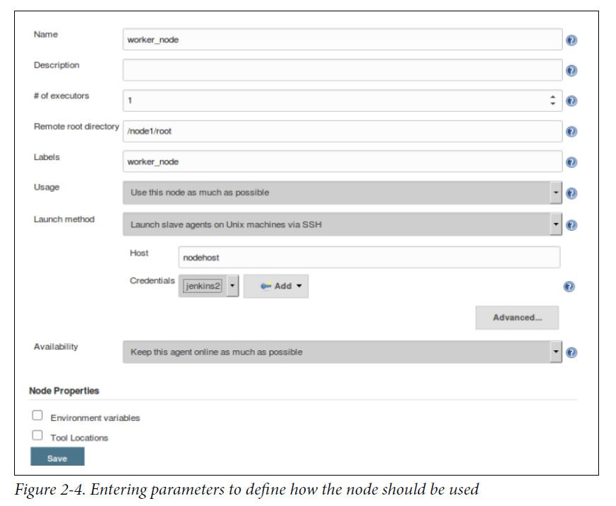
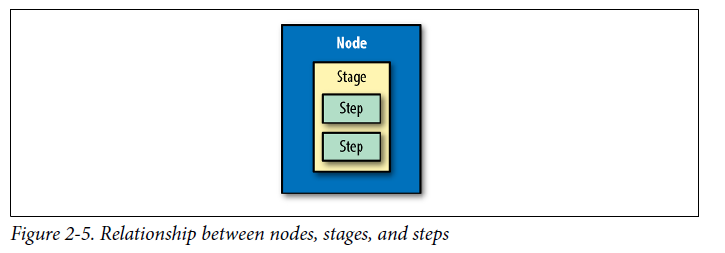
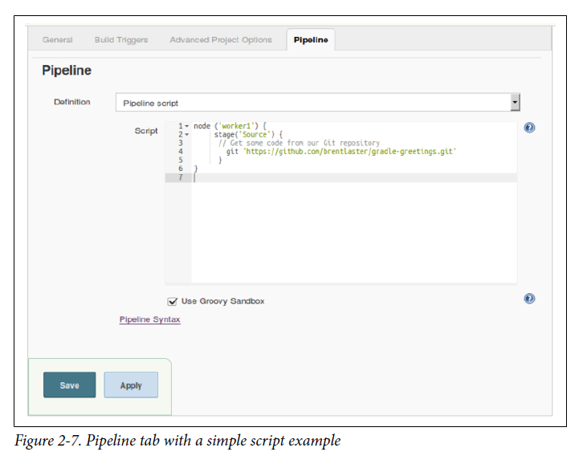
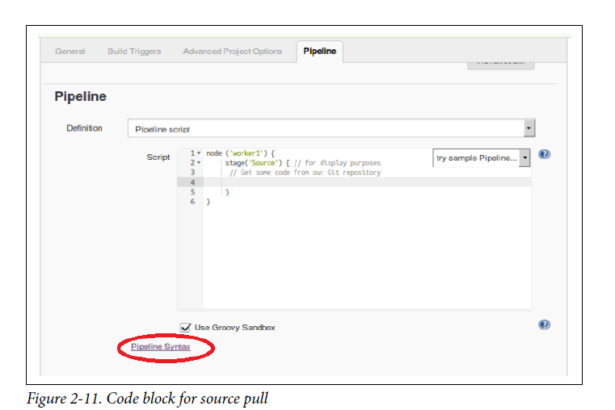
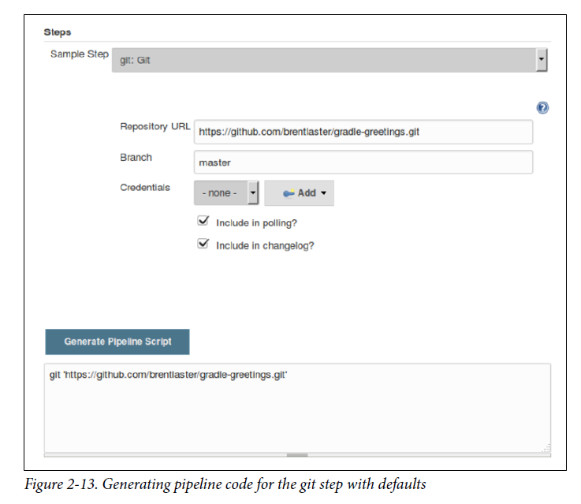
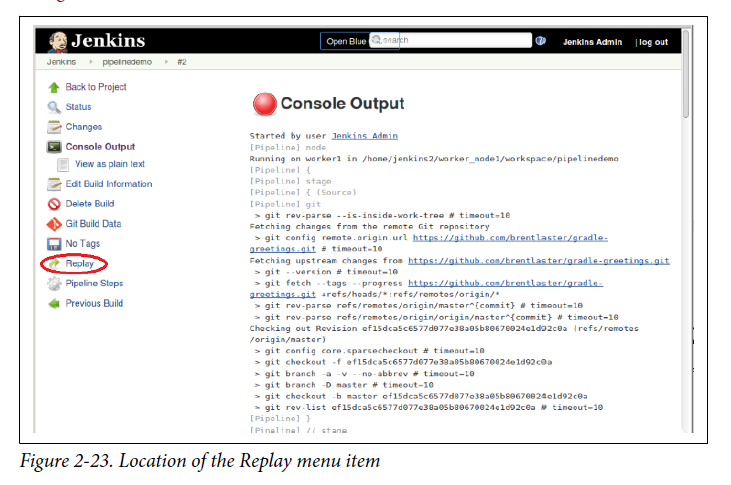
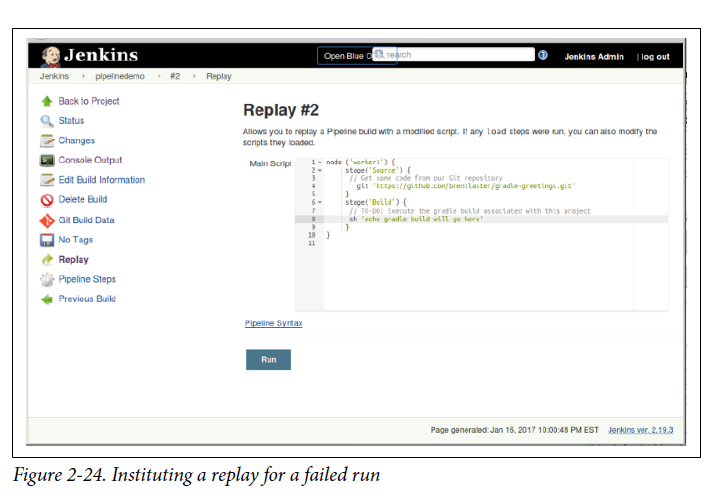

# Table of content

- [Chapter 1: Introducing Jenkins 2](#chapter-1-introducing-jenkins-2)
    + [Pipeline](#pipeline)
    + [Organization](#organization)
    + [Summary](#summary)
- [Chapter 2: The Foundations](#chapter-2-the-foundations)
  * [Syntax: Scripted Pipelines Versus Declarative Pipelines](#syntax-scripted-pipelines-versus-declarative-pipelines)
    + [Choosing Between Scripted and Declarative Syntax](#choosing-between-scripted-and-declarative-syntax)
  * [Systems: Masters, Nodes, Agents, and Executors](#systems-masters-nodes-agents-and-executors)
    + [Master](#master)
    + [Node](#node)
    + [Agent](#agent)
      - [Directives Versus Steps](#directives-versus-steps)
    + [Executor](#executor)
  * [Creating Nodes](#creating-nodes)
    + [A quick note about node labels](#a-quick-note-about-node-labels)
  * [Structure: Working with the Jenkins DSL](#structure-working-with-the-jenkins-dsl)
    + [node](#node)
      - [Leveraging Multiple Labels on a Node](#leveraging-multiple-labels-on-a-node)
    + [stage](#stage)
    + [steps](#steps)
    + [Understanding step syntax](#understanding-step-syntax)
  * [Supporting Environment: Developing a Pipeline Script](#supporting-environment-developing-a-pipeline-script)
    + [Starting a Pipeline Project](#starting-a-pipeline-project)
    + [Working with the Snippet Generator](#working-with-the-snippet-generator)
  * [Running a Pipeline](#running-a-pipeline)
  * [Replay](#replay)
- [Chapter 3. Pipeline Execution Flow](#chapter-3-pipeline-execution-flow)
  * [Triggering Jobs](#triggering-jobs)

# Chapter 1: Introducing Jenkins 2

### Pipeline

As the name implies, the Pipeline type of project is intended for creating pipelines. This is done by writing the code in the Jenkins DSL. This is the main type of project we’ll be talking about throughout the book.
As already noted, pipelines can either be written in a **“scripted” syntax style or a “declarative” syntax style**. Pipelines created in this type of project can also be made easily into Jenkinsfiles.

### Organization

Certain source control platforms provide a mechanism for grouping repositories into “organizations.” Jenkins integrations allow you to store Jenkins pipeline scripts as Jenkinsfiles in the repositories within an organization and execute based on those. Currently GitHub and Bitbucket organizations are supported, with others planned for the future. For simplicity in this book, we’ll talk mainly about GitHub Organization projects as our example.

### Summary

Jenkins 2 also provides several new project types. The Folder type allows for grouping projects together under a shared namespace and shared environment. The Multibranch Pipeline type provides easy automated job creation per branch and continuous integration, all triggered by Jenkinsfiles residing in the branches. And the organization project type extends the multibranch functionality across all projects in an organization structure on GitHub or Bitbucket.

# Chapter 2: The Foundations

Four basic areas:
* The two styles of syntax that can be used for creating pipelines
* The systems used to run the pipeline processes
* The basic structure of a pipeline
* The support environment (and tooling) that Jenkins provides for pipeline development and execution

## Syntax: Scripted Pipelines Versus Declarative Pipelines

**Scripted syntax** refers to the initial way that pipelines-as-code have been done in Jenkins. It is an imperative style, meaning it is based on defining the logic and the program flow in the pipeline script itself. It is also more dependent on the Groovy language and Groovy constructs - especially for things like error checking and dealing with exceptions.

**Declarative syntax** is a newer option in Jenkins. Pipelines coded in the declarative style are arranged in clear sections that describe (or “declare”) the states and outcomes we want in the major areas of the pipeline, rather than focusing on the logic to accomplish it.

```
// Scripted Pipeline
node('worker_node1') {
  stage('Source') { // Get code
    // get code from our Git repository
    git 'git@diyvb2:/home/git/repositories/workshop.git'
  }
  stage('Compile') { // Compile and do unit testing
    // run Gradle to execute compile and unit testing
    sh "gradle clean compileJava test"
  }
}


// Declarative Pipeline
pipeline {
  agent {label 'worker_node1'}
  stages {
    stage('Source') { // Get code
      steps {
        // get code from our Git repository
        git 'git@diyvb2:/home/git/repositories/workshop.git'
      }
    }
    stage('Compile') { // Compile and do unit testing
      steps {
        // run Gradle to execute compile and unit testing
        sh "gradle clean compileJava test"
      }
    }
  }
}
```

### Choosing Between Scripted and Declarative Syntax

In short, the declarative model should be easier to learn and maintain for new pipeline users or those wanting more ready-made functionality like the traditional Jenkins model. This comes at the price of less flexibility to do anything not supported by the structure.
The scripted model offers more flexibility. It provides the “power-user” option, allowing users to do more things with less imposed structure.

## Systems: Masters, Nodes, Agents, and Executors

In traditional Jenkins, there were only two categories: **masters** and **slaves**.

### Master

A Jenkins **master** is the primary controlling system for a Jenkins instance. It has complete access to all Jenkins configuration and options and the full list of jobs. It is the default location for executing jobs if another system is not specified.
However, it is not intended for running any heavyweight tasks. **Jobs requiring any substantial processing should be run on a system other than the master.**

### Node

**Node** is the generic term that is used in Jenkins 2 to mean any system that can run Jenkins jobs. This covers both masters and agents, and is sometimes used in place of those terms. Furthermore, a node might be a container, such as one for Docker.

### Agent

An **agent** is the same as what earlier versions of Jenkins referred to as a **slave**. Traditionally in Jenkins, this refers to any nonmaster system. The idea is that these systems are managed by the master system and allocated as needed, or as specified, to handle processing the individual jobs.

#### Directives Versus Steps

**node** is associated with a Scripted Pipeline.

```
// Scripted Pipeline
node('worker') {
  stage('Source') { // Get code
    // Get code from our Git repository
```

**agent**, on the other hand, is a directive in a Declarative Pipeline.
```
// Declarative Pipeline
pipeline {
  agent {label:'worker'}
  stages {
    stage('Source') { // Get code
```

Just use **node** for Scripted Pipelines and **agent** for Declarative Pipelines.

### Executor

**executor** is just a slot in which to run a job on a node/agent. A node can have zero or more executors. **The number of executors defines how many concurrent jobs can be run on that node.** When the master funnels jobs to a particular node, there must be an available executor slot in order for the job to be processed immediately. Otherwise, it will wait until an executor becomes available.

## Creating Nodes

In traditional versions of Jenkins, jobs would run either on the master instance or on slave instances. As noted previously, in Jenkins 2 terminology these kinds of instances are both referred to by the generic term **node**.

Manage Jenkins -> Manage Nodes -> Select New Node and fill in the forms (choose Permanent Agent) -> Enter parameters like showed in picture.



### A quick note about node labels
Labels can be used for both system and user purposes. For example, labels can be used to:
* Identify a specific node (via a unique label).
* Group classes of nodes together (by giving them the same label).
* Identify some characteristic of a node that is useful to know for processing (via a meaningful label, such as “Windows” or “West Coast”).

The last bullet is a recommended practice.

## Structure: Working with the Jenkins DSL

In this section, we’ll cover some basic terms and the structure and functionality of a Jenkins DSL pipeline. We’ll be talking about this in terms of a Scripted Pipeline (meaning without the enhancements that the declarative functionality adds). In Chapter 7, we’ll explain the differences and look at the changes that creating a Declarative Pipeline entails.

Here’s a very simple pipeline expressed in the Jenkins DSL:
```
node ('worker1') {
  stage('Source') { // for display purposes
    // Get some code from our Git repository
    git 'https://github.com/brentlaster/gradle-greetings.git'
  }
}
```
Let’s break this down and explain what each part is doing.

### node

As mentioned in “Node”, we can think of this as the new term for a master or agent. Nodes are defined through the Manage Jenkins → Manage Nodes interface and can be set up just like slaves. Each node then has a Jenkins agent installed on it to execute jobs. (Note that in this case we are assuming we have a node already set up on the Jenkins instance labeled ``worker1``).

This line tells Jenkins on which node it should run this part of the pipeline. It binds the code to the particular Jenkins agent program running on that node. A particular one is specified by passing a defined name as a parameter (label). This must be a node or system that has already been defined and that your Jenkins system is aware of. You can omit supplying a label here, but if you omit a label, then you need to be aware of how this will be handled:
* If master has been configured as the default node for execution, Jenkins will run the job on master (master can be configured to not run any jobs).
* Otherwise, an empty node label (or ``agent any`` in declarative syntax) will tell Jenkins to run on the first executor that becomes available on any node.

When this part of the pipeline is executed, it connects to the node, creates a workspace (working directory) for the code to execute in, and schedules the code to run when an executor is available. 

#### Leveraging Multiple Labels on a Node

In the configuration for a node, you can assign multiple labels in the Labels entry box. You can specify multiple labels using standard logic operands such as
``||`` for “or” and ``&&`` for “and.” So, in this case, you could add the label Linux to all of the nodes and an additional label to indicate where each is located—i.e., east or west:
```
node("linux && east")
```

### stage

Within a node definition, a stage closure allows us to group together individual settings, DSL commands, and logic. A stage is required to have a name, which provides a mechanism for describing what the stage does.

### steps

Inside the stage, we have the actual Jenkins DSL commands. These are referred to as steps in Jenkins terminology. **A step is the lowest level of functionality defined by the DSL.** These are not Groovy commands, but can be used with Groovy commands. In the case of our example, we have this initial step to get our source: 
```
git 'https://github.com/brentlaster/gradle-greetings.git'
```

### Understanding step syntax

Steps in the Jenkins DSL always expect mapped (named) parameters. To illustrate this, here’s another version of the git step definition:
```
git branch: 'test',
    url: 'https://github.com/brentlaster/gradle-greetings.git'
```

Groovy also allows skipping the parentheses for parameters. Without these shortcuts, the longer version of our step would be:
```
git([branch: 'test', url: 'http://github.com/brentlaster/gradle-greetings.git'])
```

Another trick is this: if there is a single required parameter, and only one value is passed, the parameter name can be omitted. This is how we arrive at our short version of the step as:
```
git 'https://github.com/brentlaster/gradle-greetings.git'
```

If a named parameter is not required, then the default parameter is the script object. An example here is with the bat step, which is used to run batch or shell processing on Windows system. Writing this with the full syntax would look like this:
```
bat([script: 'echo hi'])
```
Taking into account the shortcuts that are offered, this can simply be written as:
```
bat 'echo hi'
```



## Supporting Environment: Developing a Pipeline Script

A pipeline script in Jenkins can either be created within a **Jenkins job of type Pipeline** or as an **external file named Jenkinsfile**. If created as a Jenkinsfile, then it can be stored with the source.

### Starting a Pipeline Project

When you select Pipeline as the type of project to create, you’re presented with a familiar web-based form for a new Jenkins project. The main tab we are interested in for our new Pipeline project is the Pipeline tab. Switching to that presents a text entry screen where we can enter the code for our pipeline script.



### Working with the Snippet Generator

To simplify finding the correct semantics and syntax for steps, Jenkins 2 includes a pipeline syntax help wizard, also known as the Snippet Generator.

The Snippet Generator provides a way to search through the available DSL steps and find out the syntax and semantics of ones you are interested in. Additionally, it provides online help to explain what the step is intended to do. But perhaps the most useful option it provides is a web form with areas to enter values for the parameters you want to use.

Let’s work through a simple example to see how this works. Suppose we want to create the earlier step to retrieve our Git code. Figure 2-11 shows our starting point.



We know we want to use Git, but we’re not sure of the syntax, so we click the Pipeline Syntax link at the bottom of the Pipeline tab. This takes us to the opening screen for the Snippet Generator.




## Running a Pipeline

Nothing of interest.

## Replay

Coding pipelines is more involved than web form interaction with Jenkins. There may be times where something fails and you want to retry it in a temporary way without modifying your code. Replay allows you to modify your code after a run, and then run it again with the modifications. A new build record of that run is kept, but the original code remains unchanged.



Now Jenkins presents us with an edit window just like the one for the Pipeline tab of a Pipeline project. In this window, we can make any changes to our program that we want and then select Run to try out the changes. (Here, we’re changing bat back to sh).



Jenkins will attempt to run the edited code in the Replay window. In this case it will succeed, creating run #3. However, if we click Configure in the menu on the left and go back and look at our code in the Pipeline tab, we’ll see that it still shows bat. The Replay functionality allowed us to try out a change, but we still need to go back and update our code in the pipeline job to make the change.

# Chapter 3. Pipeline Execution Flow

## Triggering Jobs

To specify triggering events for pipeline code, there are three different approaches:
* If working in the Jenkins application itself in a pipeline job, the trigger(s) can be specified in the traditional way within the project’s General configuration section in the web interface.
* If creating a Scripted Pipeline, a ``properties`` block can be specified (usually before the start of the pipeline) that defines the triggers in code. (Note that this properties section will be merged with any properties defined in the web interface, with the web properties taking precedence).
* If creating a Declarative Pipeline, there is a special ``triggers`` directive that can be used to define the types of things that should trigger the pipeline.

## Build After Other Projects Are Built

As the name implies, selecting this option allows you to start your project building after one or more other projects. You can choose the ending status you want the builds of the other projects to have (stable, unstable, or failed). For a Scripted Pipeline, the syntax for building your pipeline after another job, Job1, is successful would be like the following:
```
properties([
  pipelineTriggers([
    upstream(
      threshold: hudson.model.Result.SUCCESS,
      upstreamProjects: 'Job1'
    )
  ])
])
```

If you need to specify a branch for a job (as for a multibranch job), add a slash after the job name and then the branch name (as in ``'Job1/master'``).

## Build Periodically

This option provides a cron type of functionality to start jobs at certain time intervals. While this is an option for builds, **this is not optimal for continuous integration**, where the builds are based on detecting updates in source management.

Here’s an example of the syntax in a Scripted Pipeline. In this case, the job runs at 9 a.m., Monday–Friday:
```
properties([pipelineTriggers([cron('0 9 * * 1-5')])])
```

And here’s an example of the syntax in a Declarative Pipeline:
```
triggers { cron(0 9 * * 1-5)
```

## GitHub Hook Trigger for GitSCM Polling

A GitHub project configured as the source location in a Jenkins project can have a push hook (on the GitHub side) to trigger a build for the Jenkins project. When this is in place, a push to the repository causes the hook to fire and trigger Jenkins, which then invokes the Jenkins SCM polling functionality.

```
properties([pipelineTriggers([githubPush()])])
```

## Poll SCM


