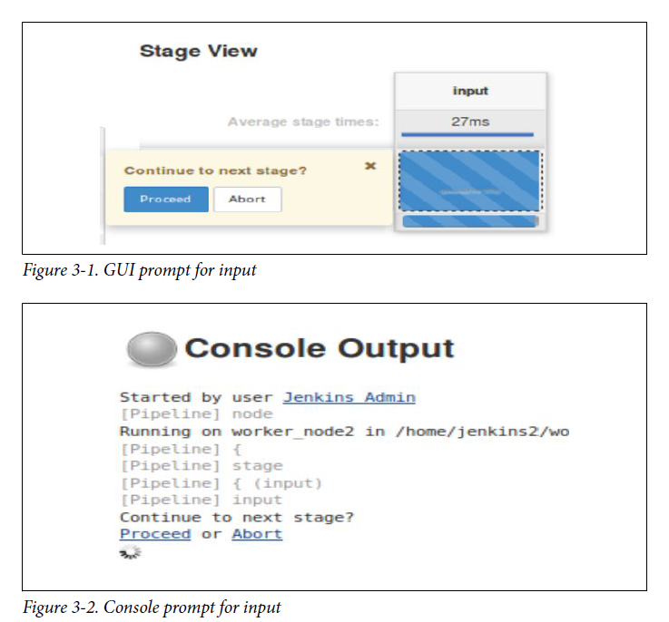
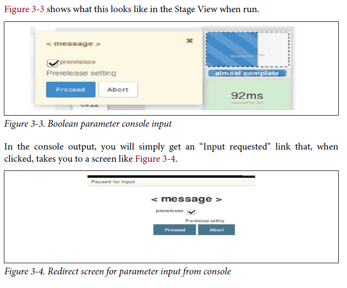
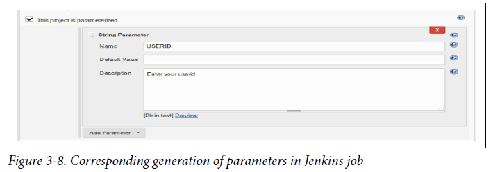

# Table of content

- [Chapter 1: Introducing Jenkins 2](#chapter-1-introducing-jenkins-2)
    + [Pipeline](#pipeline)
    + [Organization](#organization)
    + [Summary](#summary)
- [Chapter 2: The Foundations](#chapter-2-the-foundations)
  * [Syntax: Scripted Pipelines Versus Declarative Pipelines](#syntax-scripted-pipelines-versus-declarative-pipelines)
    + [Choosing Between Scripted and Declarative Syntax](#choosing-between-scripted-and-declarative-syntax)
  * [Systems: Masters, Nodes, Agents, and Executors](#systems-masters-nodes-agents-and-executors)
    + [Master](#master)
    + [Node](#node)
    + [Agent](#agent)
      - [Directives Versus Steps](#directives-versus-steps)
    + [Executor](#executor)
  * [Creating Nodes](#creating-nodes)
    + [A quick note about node labels](#a-quick-note-about-node-labels)
  * [Structure: Working with the Jenkins DSL](#structure-working-with-the-jenkins-dsl)
    + [node](#node)
      - [Leveraging Multiple Labels on a Node](#leveraging-multiple-labels-on-a-node)
    + [stage](#stage)
    + [steps](#steps)
    + [Understanding step syntax](#understanding-step-syntax)
  * [Supporting Environment: Developing a Pipeline Script](#supporting-environment-developing-a-pipeline-script)
    + [Starting a Pipeline Project](#starting-a-pipeline-project)
    + [Working with the Snippet Generator](#working-with-the-snippet-generator)
  * [Running a Pipeline](#running-a-pipeline)
  * [Replay](#replay)
- [Chapter 3. Pipeline Execution Flow](#chapter-3-pipeline-execution-flow)
  * [Triggering Jobs](#triggering-jobs)

# Chapter 1: Introducing Jenkins 2

### Pipeline

As the name implies, the Pipeline type of project is intended for creating pipelines. This is done by writing the code in the Jenkins DSL. This is the main type of project we’ll be talking about throughout the book.
As already noted, pipelines can either be written in a **“scripted” syntax style or a “declarative” syntax style**. Pipelines created in this type of project can also be made easily into Jenkinsfiles.

### Organization

Certain source control platforms provide a mechanism for grouping repositories into “organizations.” Jenkins integrations allow you to store Jenkins pipeline scripts as Jenkinsfiles in the repositories within an organization and execute based on those. Currently GitHub and Bitbucket organizations are supported, with others planned for the future. For simplicity in this book, we’ll talk mainly about GitHub Organization projects as our example.

### Summary

Jenkins 2 also provides several new project types. The Folder type allows for grouping projects together under a shared namespace and shared environment. The Multibranch Pipeline type provides easy automated job creation per branch and continuous integration, all triggered by Jenkinsfiles residing in the branches. And the organization project type extends the multibranch functionality across all projects in an organization structure on GitHub or Bitbucket.

# Chapter 2: The Foundations

Four basic areas:
* The two styles of syntax that can be used for creating pipelines
* The systems used to run the pipeline processes
* The basic structure of a pipeline
* The support environment (and tooling) that Jenkins provides for pipeline development and execution

## Syntax: Scripted Pipelines Versus Declarative Pipelines

**Scripted syntax** refers to the initial way that pipelines-as-code have been done in Jenkins. It is an imperative style, meaning it is based on defining the logic and the program flow in the pipeline script itself. It is also more dependent on the Groovy language and Groovy constructs - especially for things like error checking and dealing with exceptions.

**Declarative syntax** is a newer option in Jenkins. Pipelines coded in the declarative style are arranged in clear sections that describe (or “declare”) the states and outcomes we want in the major areas of the pipeline, rather than focusing on the logic to accomplish it.

```
// Scripted Pipeline
node('worker_node1') {
  stage('Source') { // Get code
    // get code from our Git repository
    git 'git@diyvb2:/home/git/repositories/workshop.git'
  }
  stage('Compile') { // Compile and do unit testing
    // run Gradle to execute compile and unit testing
    sh "gradle clean compileJava test"
  }
}


// Declarative Pipeline
pipeline {
  agent {label 'worker_node1'}
  stages {
    stage('Source') { // Get code
      steps {
        // get code from our Git repository
        git 'git@diyvb2:/home/git/repositories/workshop.git'
      }
    }
    stage('Compile') { // Compile and do unit testing
      steps {
        // run Gradle to execute compile and unit testing
        sh "gradle clean compileJava test"
      }
    }
  }
}
```

### Choosing Between Scripted and Declarative Syntax

In short, the declarative model should be easier to learn and maintain for new pipeline users or those wanting more ready-made functionality like the traditional Jenkins model. This comes at the price of less flexibility to do anything not supported by the structure.
The scripted model offers more flexibility. It provides the “power-user” option, allowing users to do more things with less imposed structure.

## Systems: Masters, Nodes, Agents, and Executors

In traditional Jenkins, there were only two categories: **masters** and **slaves**.

### Master

A Jenkins **master** is the primary controlling system for a Jenkins instance. It has complete access to all Jenkins configuration and options and the full list of jobs. It is the default location for executing jobs if another system is not specified.
However, it is not intended for running any heavyweight tasks. **Jobs requiring any substantial processing should be run on a system other than the master.**

### Node

**Node** is the generic term that is used in Jenkins 2 to mean any system that can run Jenkins jobs. This covers both masters and agents, and is sometimes used in place of those terms. Furthermore, a node might be a container, such as one for Docker.

### Agent

An **agent** is the same as what earlier versions of Jenkins referred to as a **slave**. Traditionally in Jenkins, this refers to any nonmaster system. The idea is that these systems are managed by the master system and allocated as needed, or as specified, to handle processing the individual jobs.

#### Directives Versus Steps

**node** is associated with a Scripted Pipeline.

```
// Scripted Pipeline
node('worker') {
  stage('Source') { // Get code
    // Get code from our Git repository
```

**agent**, on the other hand, is a directive in a Declarative Pipeline.
```
// Declarative Pipeline
pipeline {
  agent {label:'worker'}
  stages {
    stage('Source') { // Get code
```

Just use **node** for Scripted Pipelines and **agent** for Declarative Pipelines.

### Executor

**executor** is just a slot in which to run a job on a node/agent. A node can have zero or more executors. **The number of executors defines how many concurrent jobs can be run on that node.** When the master funnels jobs to a particular node, there must be an available executor slot in order for the job to be processed immediately. Otherwise, it will wait until an executor becomes available.

## Creating Nodes

In traditional versions of Jenkins, jobs would run either on the master instance or on slave instances. As noted previously, in Jenkins 2 terminology these kinds of instances are both referred to by the generic term **node**.

Manage Jenkins -> Manage Nodes -> Select New Node and fill in the forms (choose Permanent Agent) -> Enter parameters like showed in picture.


### A quick note about node labels
Labels can be used for both system and user purposes. For example, labels can be used to:
* Identify a specific node (via a unique label).
* Group classes of nodes together (by giving them the same label).
* Identify some characteristic of a node that is useful to know for processing (via a meaningful label, such as “Windows” or “West Coast”).

The last bullet is a recommended practice.

## Structure: Working with the Jenkins DSL

In this section, we’ll cover some basic terms and the structure and functionality of a Jenkins DSL pipeline. We’ll be talking about this in terms of a Scripted Pipeline (meaning without the enhancements that the declarative functionality adds). In Chapter 7, we’ll explain the differences and look at the changes that creating a Declarative Pipeline entails.

Here’s a very simple pipeline expressed in the Jenkins DSL:
```
node ('worker1') {
  stage('Source') { // for display purposes
    // Get some code from our Git repository
    git 'https://github.com/brentlaster/gradle-greetings.git'
  }
}
```
Let’s break this down and explain what each part is doing.

### node

As mentioned in “Node”, we can think of this as the new term for a master or agent. Nodes are defined through the Manage Jenkins → Manage Nodes interface and can be set up just like slaves. Each node then has a Jenkins agent installed on it to execute jobs. (Note that in this case we are assuming we have a node already set up on the Jenkins instance labeled ``worker1``).

This line tells Jenkins on which node it should run this part of the pipeline. It binds the code to the particular Jenkins agent program running on that node. A particular one is specified by passing a defined name as a parameter (label). This must be a node or system that has already been defined and that your Jenkins system is aware of. You can omit supplying a label here, but if you omit a label, then you need to be aware of how this will be handled:
* If master has been configured as the default node for execution, Jenkins will run the job on master (master can be configured to not run any jobs).
* Otherwise, an empty node label (or ``agent any`` in declarative syntax) will tell Jenkins to run on the first executor that becomes available on any node.

When this part of the pipeline is executed, it connects to the node, creates a workspace (working directory) for the code to execute in, and schedules the code to run when an executor is available. 

#### Leveraging Multiple Labels on a Node

In the configuration for a node, you can assign multiple labels in the Labels entry box. You can specify multiple labels using standard logic operands such as
``||`` for “or” and ``&&`` for “and.” So, in this case, you could add the label Linux to all of the nodes and an additional label to indicate where each is located—i.e., east or west:
```
node("linux && east")
```

### stage

Within a node definition, a stage closure allows us to group together individual settings, DSL commands, and logic. A stage is required to have a name, which provides a mechanism for describing what the stage does.

### steps

Inside the stage, we have the actual Jenkins DSL commands. These are referred to as steps in Jenkins terminology. **A step is the lowest level of functionality defined by the DSL.** These are not Groovy commands, but can be used with Groovy commands. In the case of our example, we have this initial step to get our source: 
```
git 'https://github.com/brentlaster/gradle-greetings.git'
```

### Understanding step syntax

Steps in the Jenkins DSL always expect mapped (named) parameters. To illustrate this, here’s another version of the git step definition:
```
git branch: 'test',
    url: 'https://github.com/brentlaster/gradle-greetings.git'
```

Groovy also allows skipping the parentheses for parameters. Without these shortcuts, the longer version of our step would be:
```
git([branch: 'test', url: 'http://github.com/brentlaster/gradle-greetings.git'])
```

Another trick is this: if there is a single required parameter, and only one value is passed, the parameter name can be omitted. This is how we arrive at our short version of the step as:
```
git 'https://github.com/brentlaster/gradle-greetings.git'
```

If a named parameter is not required, then the default parameter is the script object. An example here is with the bat step, which is used to run batch or shell processing on Windows system. Writing this with the full syntax would look like this:
```
bat([script: 'echo hi'])
```
Taking into account the shortcuts that are offered, this can simply be written as:
```
bat 'echo hi'
```


## Supporting Environment: Developing a Pipeline Script

A pipeline script in Jenkins can either be created within a **Jenkins job of type Pipeline** or as an **external file named Jenkinsfile**. If created as a Jenkinsfile, then it can be stored with the source.

### Starting a Pipeline Project

When you select Pipeline as the type of project to create, you’re presented with a familiar web-based form for a new Jenkins project. The main tab we are interested in for our new Pipeline project is the Pipeline tab. Switching to that presents a text entry screen where we can enter the code for our pipeline script.


### Working with the Snippet Generator

To simplify finding the correct semantics and syntax for steps, Jenkins 2 includes a pipeline syntax help wizard, also known as the Snippet Generator.

The Snippet Generator provides a way to search through the available DSL steps and find out the syntax and semantics of ones you are interested in. Additionally, it provides online help to explain what the step is intended to do. But perhaps the most useful option it provides is a web form with areas to enter values for the parameters you want to use.

Let’s work through a simple example to see how this works. Suppose we want to create the earlier step to retrieve our Git code. Figure 2-11 shows our starting point.


We know we want to use Git, but we’re not sure of the syntax, so we click the Pipeline Syntax link at the bottom of the Pipeline tab. This takes us to the opening screen for the Snippet Generator.


## Running a Pipeline

Nothing of interest.

## Replay

Coding pipelines is more involved than web form interaction with Jenkins. There may be times where something fails and you want to retry it in a temporary way without modifying your code. Replay allows you to modify your code after a run, and then run it again with the modifications. A new build record of that run is kept, but the original code remains unchanged.


Now Jenkins presents us with an edit window just like the one for the Pipeline tab of a Pipeline project. In this window, we can make any changes to our program that we want and then select Run to try out the changes. (Here, we’re changing bat back to sh).


Jenkins will attempt to run the edited code in the Replay window. In this case it will succeed, creating run #3. However, if we click Configure in the menu on the left and go back and look at our code in the Pipeline tab, we’ll see that it still shows bat. The Replay functionality allowed us to try out a change, but we still need to go back and update our code in the pipeline job to make the change.

# Chapter 3. Pipeline Execution Flow

## Triggering Jobs

To specify triggering events for pipeline code, there are three different approaches:
* If working in the Jenkins application itself in a pipeline job, the trigger(s) can be specified in the traditional way within the project’s General configuration section in the web interface.
* If creating a Scripted Pipeline, a ``properties`` block can be specified (usually before the start of the pipeline) that defines the triggers in code. (Note that this properties section will be merged with any properties defined in the web interface, with the web properties taking precedence).
* If creating a Declarative Pipeline, there is a special ``triggers`` directive that can be used to define the types of things that should trigger the pipeline.

## Build After Other Projects Are Built

As the name implies, selecting this option allows you to start your project building after one or more other projects. You can choose the ending status you want the builds of the other projects to have (stable, unstable, or failed). For a Scripted Pipeline, the syntax for building your pipeline after another job, Job1, is successful would be like the following:
```
properties([
  pipelineTriggers([
    upstream(
      threshold: hudson.model.Result.SUCCESS,
      upstreamProjects: 'Job1'
    )
  ])
])
```

If you need to specify a branch for a job (as for a multibranch job), add a slash after the job name and then the branch name (as in ``'Job1/master'``).

## Build Periodically

This option provides a cron type of functionality to start jobs at certain time intervals. While this is an option for builds, **this is not optimal for continuous integration**, where the builds are based on detecting updates in source management.

Here’s an example of the syntax in a Scripted Pipeline. In this case, the job runs at 9 a.m., Monday–Friday:
```
properties([pipelineTriggers([cron('0 9 * * 1-5')])])
```

And here’s an example of the syntax in a Declarative Pipeline:
```
triggers { cron(0 9 * * 1-5)
```

## GitHub Hook Trigger for GitSCM Polling

A GitHub project configured as the source location in a Jenkins project can have a push hook (on the GitHub side) to trigger a build for the Jenkins project. When this is in place, a push to the repository causes the hook to fire and trigger Jenkins, which then invokes the Jenkins SCM polling functionality.

```
properties([pipelineTriggers([githubPush()])])
```

## Poll SCM

This is the standard polling functionality that periodically scans the source control system for updates. If any updates are found, then the job processes the changes. **This can be a very expensive operation.** The syntax for Scripted Pipelines is as follows (polling every 30 minutes):
```
properties([pipelineTriggers([pollSCM('*/30 * * * *')])])
```
The corresponding syntax for Declarative Pipelines would be this:
```
triggers { pollSCM(*/30 * * * *) }
```

## Quiet Period

The value specified here serves as a “wait time” or offset between when the build is triggered (an update is detected) and when Jenkins acts on it. This can be useful for staggering jobs that frequently have changes at the same time.

## Trigger Builds Remotely

This allows for triggering builds by accessing a specific URL for the given job on the Jenkins system. This is useful for triggering builds via a hook or a script. An authorization token is required. 

## User Input

A key aspect of some Jenkins jobs is the ability to change their behavior based on user input. Jenkins offers a wide variety of parameters for gathering specific kinds of input. Jenkins pipelines provide constructs for this as well.

The DSL step ``input`` is the way we get user input through a pipeline. The step accepts the same kinds of parameters as a regular Jenkins job for a Scripted Pipeline. For a Declarative Pipeline, there is a special ``parameters`` directive that supports a subset of those parameters.

### input

As the name suggests, the input step allows your pipeline to stop and wait for a user response. Here’s a simple example:
```
input 'Continue to next stage?'
```

This step can also optionally take parameters to gather additional information. Within the Jenkins application, the default form is to print a message and offer the user a choice of "Proceed" or "Abort".



**!NOTE.** As defined earlier in the book, an executor is a slot on a node for processing code. Using the input step in a node block ties up the executor for the node until the input step is done.

The input step can have several parameters. These include:
* *Message* (message) - The message to be displayed to the user, as demonstrated in the previous example. Can also be empty, as indicated by input ''.
* *Custom ID* (id) - An ID that can be used to identify your input step to automated or external processing, such as when you want to respond via a REST API call. A unique identifier will be generated if you don’t supply one. As an example, you could add the custom ID, ctns-prompt (for "Continue to next stage" prompt) to our input step definition. The input step would then look as follows:
```
input id: 'ctns-prompt', message: 'Continue to the next stage?'
```
Given this step, when you run the job, a POST to this URL could be used to respond. The URL format would be: ``http://[jenkins-base-url]/job/[job_name]/[build_id]/input/Ctns-prompt/proceedEmpty``  to tell Jenkins to proceed without any input, or: ``http://[jenkins-base-url]/job/[job_name]/[build_id]/input/Ctns-prompt/abort`` to tell Jenkins to abort. (Notice that the parameter name is capitalized in the URL.)

* *OK button caption* (ok) - A different label you can use instead of “Proceed.” For example: 
```
input message: '<message text>', ok: 'Yes'
```

### Parameters

With the ``input`` statement, you have the option to add any of the standard Jenkins parameter types. For each parameter type, the different “subparameters” (arguments) that it can take are also listed. If the purpose of the subparameter is self-evident from its name (e.g., name, default value, description), the argument name will be listed without additional explanation.

#### Boolean

This is the basic true/false parameter. The subparameters for a Boolean are Name, Default Value, and Description.
An example of the syntax would be:
```
def answer = input message: '<message>',
parameters: [booleanParam(defaultValue: true,
description: 'Prerelease setting', name: 'prerelease')]
```




#### Choice

This parameter allows the user to select from a list of choices. The subparameters for a Choice are Name, Choices, and Description. Here, Choices refers to a list of choices you enter to present to the user. An example of the syntax would be:

```
def choice = input message: '<message>',
parameters: [choice(choices: "choice1\nchoice2\nchoice3\nchoice4\n",
description: 'Choose an option', name: 'Options')]
```

Notice the syntax here for the list of choices—a single string with each choice separated by a newline character. There are other ways to instantiate a set of choices, but this is the simplest.

#### Credentials

This parameter allows the user to select a type and set of credentials to use. The available subparameters include Name, Credential Type, Required, Default Value, and Description.

The options for Credential Type include Any, Username with password, Docker Host Certificate Authentication, SSH Username with private key, Secret file, Secret text, and Certificate.

#### File

This parameter allows for choosing a file to use with the pipeline. The subparameters include File Location and Description. The syntax is:
```
def selectedFile = input message: '<message>',
parameters: [file(description: 'Choose file to upload', name: 'local')]
```

#### List Subversion tags

More in the book.

#### Multiline String

More in the book.

#### Password

This parameter allows the user to enter a password. For passwords, the text the user enters is hidden while they type it. The available subparameters are Name, Default Value, and Description. Here’s an example:
```
def pw = input message: '<message>',
parameters: [password(defaultValue: '',
description: 'Enter your password.', name: 'passwd')]
```
When run, the user is presented with a field to enter the password, with the text being hidden as they type.

#### Run

More in the book.

#### String

More in the book

## Return Values from Multiple Input Parameters

If there were instead no parameters, such as having only a Proceed or Abort option, then the return value would be null. And when you have multiple parameters, a map
is returned where you can extract each parameter’s return value via the parameter’s name. An example follows.

Suppose we wanted to add a traditional login screen to our pipeline. We would use two parameters—one String parameter for the login name and one Password parameter for the password. We can do that in the same input statement and then extract the return values for each from the returned map.

The following example code shows how to define the input statement along with some print statements that show different ways to access the individual return values (don’t forget that you can use the Snippet Generator for generating the input statement as well):

```
def loginInfo = input message: 'Login', parameters: [string(defaultValue: '', description: 'Enter Userid:', name: 'userid'), password(defaultValue: '', description: 'Enter Password:', name: 'passwd')]
echo "Username = " + loginInfo['userid']
echo "Password = ${loginInfo['passwd']}"
echo loginInfo.userid + " " + loginInfo.passwd
```

## Parameters and Declarative Pipelines

### Using the parameters section

Within the Declarative Pipeline structure, there is a section/directive for declaring parameters. This is within the agent block of the main pipeline closure. Use of the parameters directive is covered in detail with Declarative Pipelines in Chapter 7, but here’s a simple example of the syntax (see “parameters” on page 234 for more details):

```
pipeline {
    agent any
    parameters {
        string(name: 'USERID', defaultValue: '',
        description: 'Enter your userid')
    }
    stages {
        stage('Login') {
            steps {
                echo "Active user is now ${params.USERID}"
            }
        }
    }
}
```

If you are working in the Jenkins application itself, creating parameters like this in the code will also instantiate the “This build is parameterized” part of the job. **This approach is the recommended approach for Declarative Pipelines.**

### Using the Jenkins application to parameterize the build

If you have created a job in the Jenkins application (rather than using a Jenkinsfile automatically), a second approach for adding parameters is to simply use the traditional method for parameterizing a job. That is, in the General configuration section, select the checkbox for “This project is parameterized” and then define your parameters as normal in the job’s web interface (Figure 3-8).



You can then simply reference the job parameters via params.<name of parameter> without having the input line in the code, as shown here:

```
pipeline {
    agent any
    stages {
        stage('Login') {
            steps {
                echo "Active user is now ${params.USERID}"
            }
        }
    }
}   
```

### Using a script block

While Declarative Pipelines are continuing to evolve and add more functionality, there may still be instances where you need to do something in one that the declarative style doesn’t support or renders very difficult to implement. For those cases, the declarative syntax supports a ``script`` block. 

A script block allows you to use nondeclarative syntax within the bounds of the block. This includes defining variables, which is not something you can do in a Declarative Pipeline outside of a script block. This also means that you cannot reference variables that are defined inside a script block outside of that block. Jenkins flags those with a "no such property" error.

```
stage ('Input') {
    steps {
        script {
            def resp = input message: '<message>',
            parameters: [string(defaultValue: '',
            description: 'Enter response 1',
            name: 'RESPONSE1'), string(defaultValue: '',
            description: 'Enter response 2', name: 'RESPONSE2')]
            echo "${resp.RESPONSE1}"
        }
        echo "${resp.RESPONSE2}"
    }
}
```

Here we have two parameters defined as part of an input step inside of a stage in a Declarative Pipeline. Since the first echo is in the script block where the variable resp is also defined, it will print out the response that is entered for that parameter as expected.

Notice, though, that the second echo is outside of the scope where the resp variable is defined. Groovy/Jenkins will throw an error when it gets to this one.

Because of this, it is advisable to try to limit accessing input to a small section of your code if you have to use a script block. However, there is one other workaround if you need to use the value outside the scope of the script block. **You can put the return value into an environment variable and then access the environment variable wherever you need the value.**

```
stage ('Input') {
    steps {
        script {
            env.RESP1 = input message: '<message>', parameters: [
                string(defaultValue: '', description: 'Enter response 1',
                name: 'RESPONSE1')]
            env.RESP2 = input message: '<message>', parameters: [
                string(defaultValue: '', description: 'Enter response 2',
                name: 'RESPONSE2')]
            echo "${env.RESP1}"
        }
        echo "${env.RESP2}"
    }
}
```

We are putting the results of the input steps into the environment variable namespace (env). **Because these are environment variables, the values are set in the environment and therefore available for the pipeline to use wherever it needs.** 

### Using external code

One other option available to you is putting scripted statements (like the calls to input) in an external shared library or an external Groovy file that you load and execute. For example, we could code our input processing in a file named ``vars/getUser.groovy`` in a shared library structure, like this:

```
#!/usr/bin/env groovy
def call(String prompt1 = 'Please enter your data', String prompt2 = 'Please enter your data') {
    def resp = input message: '<message>', parameters: [string(defaultValue: '', description: prompt1, name: 'RESPONSE1'), string(defaultValue: '', description: prompt2, name: 'RESPONSE2')]
    echo "${resp.RESPONSE1}"
    echo "${resp.RESPONSE2}"
    // do something with the input
}
```

If our library were named ``Utilities``, then we could import it and call the ``getUser`` function as shown here:

```
@Library('Utilities')_
pipeline {
    agent any
    stages {
        stage ('Input') {
            steps {
                getUser 'Enter response 1','Enter response 2'
            }
        }
    }
}
```

One of the challenges with using an input statement is what happens if you don’t get input in an expected amount of time. While waiting for input, the node is effectively stopped, waiting on a response. To prevent this from going on too long, **you should consider wrapping the input call with another type of flow control construct: the ``time out`` statement.**

## Flow Control Options

One of the benefits of writing your pipeline-as-code in Jenkins is that you have more options for controlling the flow through the pipeline. 

### timeout

The timeout step allows you to limit the amount of time your script spends waiting for an action to happen. The syntax is fairly simple. Here’s an example:
```
timeout(time:60, unit: 'SECONDS') {
    // processing to be timed out inside this block
}
```

A best practice is to wrap any step that can pause the pipeline (such as an input step) with a timeout. This is so that your pipeline continues to execute (if desired) even if something goes wrong and the expected input doesn’t occur within the time limit. Here’s an example:
```
node {
    def response
    stage('input') {
        timeout(time:10, unit:'SECONDS') {
            response = input message: 'User', parameters: [string(defaultValue: 'user1', description: 'Enter Userid:', name: 'userid')]
        }
        echo "Username = " + response
    }
}
```

### retry

The retry closure wraps code in a step that retries the process n times if an exception occurs in the code. n here refers to a value you pass in to the retry step. The syntax is just:

```
retry(<n>) { // processing }
```

If the retry limit is reached and an exception occurs, then the processing is aborted (unless that exception is handled, such as with a try-catch block).

### sleep

This is the basic delay step. It accepts a value and delays that amount of time before continuing processing. The default time unit is seconds, so sleep 5 waits for 5 seconds before continuing processing. If you want to specify a different unit, you just add the unit name parameter, as in:
```
sleep time: 5, unit: 'MINUTES'
```

### waitUntil

More in the book.

## Dealing with Concurrency

For the most part, having concurrency in your pipeline builds is a good thing. Typically, concurrency refers to parallelism—being able to run similar parts of your jobs concurrently on different nodes. This can be especially useful in cases such as running tests, as long as you limit duplicate access to resources appropriately.

### Locking Resources with the lock Step

If you have the **Lockable Resources plugin** installed, there is a DSL ``lock`` step available to restrict multiple builds from trying to use the same resource at the same time.

"Resource" here is a loose word. It could mean a node, an agent, a set of them, or just a name to use for the locking.

The DSL lock step is a blocking step. It locks the specified resource until the steps within its closure are completed. In its simplest case, you just supply the resource name as the default argument. For example:
```
lock('worker_node1') {
    // steps to do on worker_node1
}
```

Alternatively, you can supply a label name to select a set of resources that have a certain label and a quantity to specify the number of resources that match that label to lock (reserve):
```
lock(label: 'docker-node', quantity: 3) {
// steps
}
```

You can think of this as, "How many of this resource do I have to have available to proceed?" If you specify a label but no quantity, then all resources with that label are locked.
Finally, there is an ``inversePrecedence`` optional parameter. If this parameter is set to true, then the most recent build will get the resource when it becomes available. Otherwise, builds are awarded the resource in the same order that they requested it.

As a quick example, consider a Declarative Pipeline where we want to use a certain agent to do the build on, no matter how many instances of the pipeline we are running. (Perhaps it is the only agent with the specific tools or setup we want at the moment.) Our code might look like this with the lock step:

```
stage('Build') {
    // Run the gradle build
    steps {
        lock('worker_node1') {
            sh 'gradle clean build -x test'
        }
    }
}
```

If we start multiple builds running of the same project or if we have multiple projects with this same lock code for the resource, then one build/project will get the resource first and other builds/projects will have to wait. For the first build or project that gets the resource, the console log might show something like this:

```
[Pipeline] stage
[Pipeline] { (Build)
[Pipeline] lock
00:00:02.858 Trying to acquire lock on [worker_node1]
00:00:02.864 Resource [worker_node1] did not exist. Created.
00:00:02.864 Lock acquired on [worker_node1]
[Pipeline] {
[Pipeline] tool
[Pipeline] sh
00:00:02.925 [gradle-demo-simple-pipe] Running shell script
00:00:03.213 + /usr/share/gradle/bin/gradle clean build -x test
00:00:06.671 Starting a Gradle Daemon
...
00:00:16.887
00:00:16.887 BUILD SUCCESSFUL
00:00:16.887
00:00:16.887 Total time: 13.16 secs
[Pipeline] }
00:00:17.187 Lock released on resource [worker_node1]
[Pipeline] // lock
```

And for the other builds/jobs trying to acquire the same lock, console output might look like this:

```
[Pipeline] // stage
[Pipeline] stage
[Pipeline] { (Build)
[Pipeline] lock
00:00:03.262 Trying to acquire lock on [worker_node1]
00:00:03.262 Found 0 available resource(s). Waiting for correct
amount: 1.
00:00:03.262 [worker_node1] is locked, waiting...
```

### Controlling Concurrent Builds with Milestones


