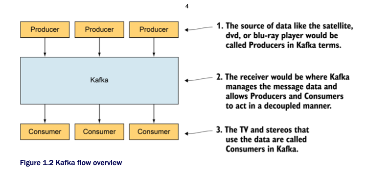
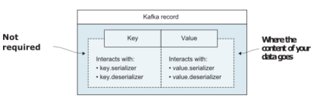
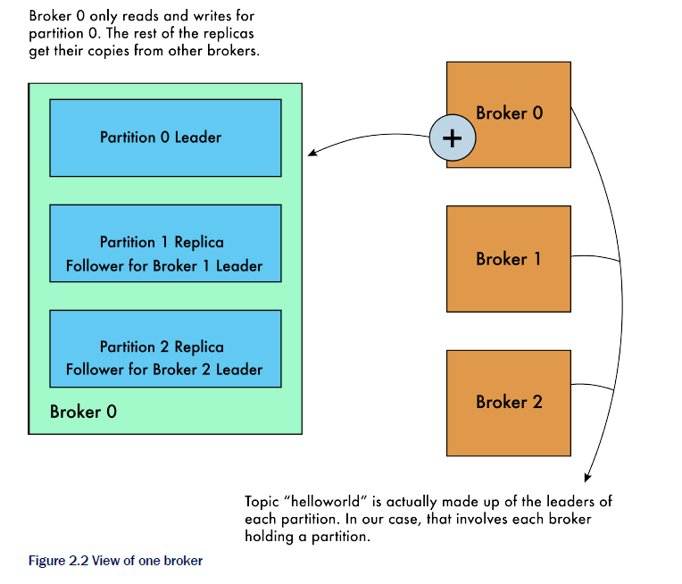
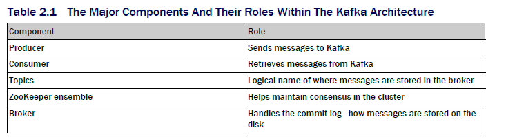
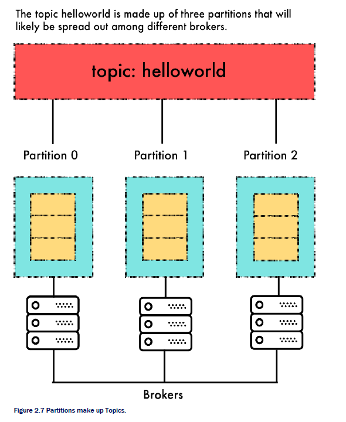
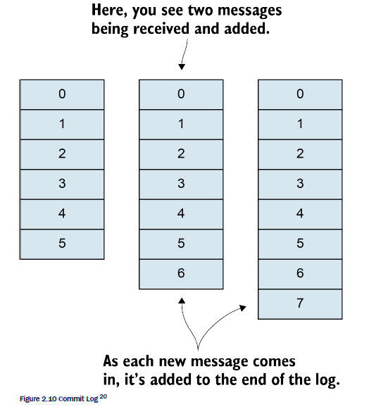
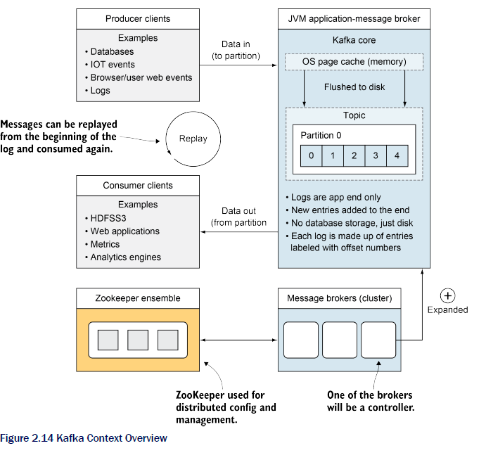
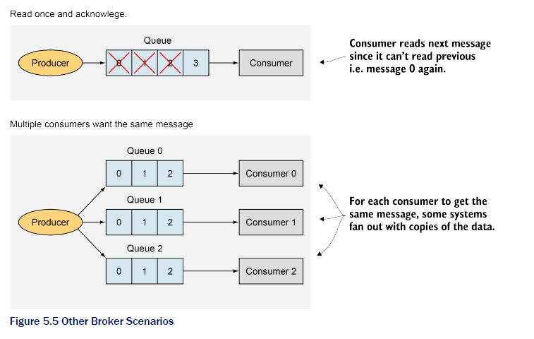
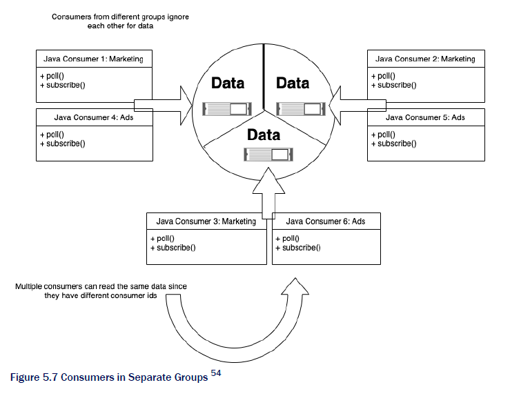
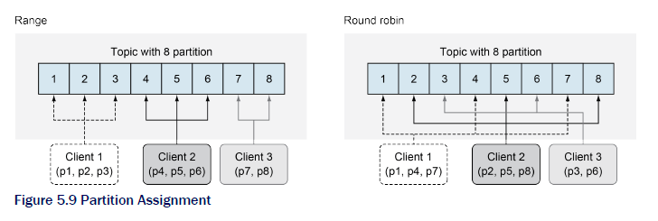

# Chapter 1. Introduction to Kafka

Kafka is changing the standards for data platforms. It is leading the way to move from extract, transform, load (ETL) and batch workflows, in which work was often held and processed in bulk at one various pre-defined time of day, to near real-time data feed. Batch processing, which was once the standard workhorse of enterprise data processing, might not be something to turn back to after seeing the powerful feature set that Kafka provides.

## 1.1 What is Kafka?

The Apache Kafka® site (kafka.apache.org/intro) defines it as a distributed streaming platform that has three main capabilities: 
* Reading and writing records like a message queue. 
* Store records with fault-tolerance. 
* Process streams as they occur.



So what does this have to do with Kafka exactly? Kafka includes clients to interface with the other systems. One such client type is called a Producer that can send multiple data streams to the Kafka brokers. On other side sits Consumers - clients that can read data from the brokers and process it.

Data does not only have to be limited to a single destination. The Producers and Consumers are completely decoupled, allowing each client to work independently.

As do other messaging platforms, Kafka acts, in reductionist terms, like a middle man to data coming into the system (from producers) and out of the system (consumers). The loose coupling can be achieved by allowing this separation between the producer and end-user of the message. The producer can send whatever messages it wants and have no clue about if anyone is subscribed.

Further, Kafka also has various ways that it can deliver messages to fit your business case. **Kafka message delivery can take at least the following three delivery methods**: 
* At least once semantics - A message will be resent if needed until it is acknowledged. 
* At most once semantics - A message will only be sent once and not resent on failure.
* Exactly once semantics - A message will only be seen once by the consumer of the message.

### At least Once semantics

Kafka’s default guarantee is "at least once" semantics. In this case, Kafka can be configured to allow a producer of messages to send the same message more than once and have it written to the brokers. When a message has not received a guarantee that it was written to the broker, the producer can send the message again to try again. **For those cases where you can’t miss a message, say that someone has paid an invoice. This guarantee might take some filtering on the consumer end but is one of the safest delivery methods.**

### At most Once semantics

"At most once" semantics is when a producer of messages might send a message once and never retries. In the event of a failure, the producer moves on and never attempts to send again. Why would someone ever be okay with losing a message? If a popular website is tracking page views for visitors, it might be okay with missing a few page view events out of the millions they do process per day. Keeping the system performing and not waiting on acknowledgments might outweigh any cost of lost data.

### Exactly Once semantics

"Exactly once" semantics (EOS), added to the Kafka feature set in version 0.11.0, generated a lot of mixed discussion with its release. On the one hand, exactly-once semantics are ideal for a lot of use-cases. This guarantee makes logic to remove duplicate messages a thing of the past. Most developers appreciate sending one message in and receiving that same message on the consuming side as well. Another discussion that followed the release was a debate on if exactly once was even possible. While this goes into deeper computer science - it is helpful to be aware of how Kafka defines their EOS feature 4. In the context of a Kafka system, **if a producer sends a message more than once, it would still be delivered only once to the end consumer.** EOS has touchpoints at all Kafka layers, from producers, topics, brokers, and consumers, and will be tackled as we move along our discussion later in this book.

## 1.2 Kafka Usage

With many traditional companies facing challenges of becoming more and more technical and software-driven, one of the questions is how they will be prepared for the future. Kafka is noted for being a high-performance message-delivery workhorse that features replication and fault-tolerance as a default.

### 1.2.1 Kafka for the Developer

*Note*. I'm making a summary of what is written.

* Growing demand of Kafka knowledge.
* Decoupling applications.
* Learn Kafka before learning applications that use Kafka under the covers (Kafka Streams, ksqlDB, Apache Spark).

### 1.2.2 Explaining Kafka to your manager

One of Kafka’s most important features is the ability to take volumes of data and make it available for use by various business units. A data backbone that would make information coming into the enterprise available to all the multiple areas would allow flexibility and openness on a company-wide scale. Nothing is prescribed, but it is a potential outcome. Most executives will also know that more data than ever is flooding in, and they want insights as fast as possible. Rather than pay for data to molder on disk, the value can be derived from most of it as it arrives. Kafka is one way to move away from a daily batch job that limited how quickly that data could be turned into value. Fast Data seems to be a newer term that hints that real value focuses on something different from the promises of Big Data alone.

## 1.3 Kafka Myths

### 1.3.1 Kafka only works with Hadoop

As mentioned, Kafka is a powerful tool that is often used in various situations. However, it seemed to appear on radars when used in the Hadoop ecosystem and might have first appeared as a tool as part of a Cloudera or Hortonworks suite. It isn’t uncommon to hear the myth that Kafka only works on Hadoop.

One other fundamental myth that often appears is that Kafka requires the Hadoop Filesystem - HDFS. That is not the case.

### 1.3.2 Kafka is the same as other message brokers

Another big myth is that Kafka is just another message broker. Direct comparisons of the features of various tools such as RabbitMQ by Pivotal or IBM MQSeries to Kafka often have asterisks (or fine print) attached and are not always fair to the best use cases of each.

In general, some of the most exciting and different features are the following that we will dig into below: 
* The ability to replay messages by default 
* Parallel processing of data

Kafka was designed to have multiple consumers. **What that means is one application reading a message off of the message brokers doesn’t remove it from other applications that might want to consume it as well.** One effect of this is that a consumer who has already seen that message can again choose to read that (and other messages).

Kafka provides a way for Consumers to seek specific points and read messages (with a few constraints) again by just seeking an earlier position on the topic.

## 1.4 Kafka in the Real World

### 1.4.1 Early Examples

Some users' first experience with Kafka (as was mine) was using it as a messaging tool. Personally, after years of using other tools like IBM WebSphere MQ (formerly MQ Series), Kafka (which was around version 0.8.3 at the time) seemed simple to use to get messages from point A to point B. It forgoes using popular protocols and standards like the Extensible Messaging and Presence Protocol (XMPP), Java Message Service (JMS) API (now part of Jakarta EE), or the **OASIS® Advanced Message Queuing Protocol (AMQP) in favor of a custom TCP binary protocol.**

As an end-user developing with a Kafka client, most of the details are in the configuration, and the logic becomes relatively straightforward, ie. I want to place a message on this topic.

Having a durable channel for sending messages is also why Kafka is used. Oftentimes, memory storage of data in RAM only will not be enough to protect your data; if that server dies, the messages are not persisted across a reboot. **High availability and persistent storage are built into Kafka from the start.**

Kafka enables robust applications to be built and helps handle the expected failures that distributed applications are bound to run into at some point.

The throughput of small messages can sometimes overwhelm a system since the processing of each method takes time and overhead. Kafka uses batching of messages for sending data as well as writing data. Writing to the end of a log helps as well rather than random access to the filesystem.

### 1.4.2 Later Examples

Microservices used to talk to each other with APIs like REST, but can now leverage Kafka to communicate between asynchronous services with events.

Kafka has placed itself as a fundamental piece for allowing developers to get data quickly. While Kafka Streams is now a likely default for many when starting work, Kafka had already established itself as a successful solution by the time the Streams API was released in 2016. **The Streams API can be thought of as a layer that sits on top of producers and consumers.** This abstraction layer is a client library that is providing a higher-level view of working with your data as an unbounded stream.

In the Kafka 0.11 release, exactly-once semantics was introduced. We will cover what that means in practice later on once we get a more solid foundation. However, users running end-to-end workloads on top of Kafka with the Streams API may benefit from hardened delivery guarantees. Imagine banks using Kafka to debit or credit your account. With the "at least once" semantics, you would have to ensure that debit was not completed twice.

The number of devices for the Internet of Things will only increase with time. With all of those devices sending messages, sometimes in bursts whenever they get wifi or cellular connection, something needs to be able to handle that data effectively. As you may have gathered, massive quantities of data are one of the critical areas where Kafka shines.

### 1.4.3 When Kafka might not be the right fit

What if you only need a once-monthly or even once yearly summary of aggregate data? Suppose you don’t need an on-demand view, quick answer, or even the ability to reprocess data. In that case, you might not need Kafka running throughout the entire year for that task alone (notably if that amount of data is manageable to process at once as a batch). As always, your mileage may vary: different users have different thresholds on what is a large batch.

If your main access pattern for data is a mostly random lookup of data, Kafka might not be your best option. Linear read and writes is where Kafka shines and will keep your data moving as quickly as possible. Even if you have heard of Kafka having index files, they are not really what you would compare to a relational database having fields and primary keys that indexes are built.

Similarly, if you need the exact ordering of messages in Kafka for the entire topic, you will have to look at how practical your workload is in that situation. To avoid any unordered messages, care should have to be taken to ensure that only one producer request thread is the max simultaneously and that there is only one partition in the topic. **There are various workarounds, but if you have vast amounts of data that depend on strict ordering, there are potential gotchas that might come into play once you notice that your consumption would be limited to one consumer per group at a time.**

One of the other practical items that come to mind is that large messages are an exciting challenge. **The default message size limit is about 1 MB.** With larger messages, you start to see memory pressure increase. In other words, the lower number of messages you can store in page cache could become a concern. So if you are planning on sending huge archives around, you might want to look at if there is a better way to manage those messages.

## 1.5 Online resources to get started

The community around Kafka has been one of the best (in my opinion) in making documentation available. Kafka has been a part of Apache (graduating from the Incubator in 2012) and keeps the current documentation at the project website at kafka.apache.org.

Another great resource for more information is Confluent® (www.confluent.io/resources). Confluent was founded by original Kafka’s creators and is actively influencing the future direction of the work.

# Chapter 2. Getting to know Kafka

Apache Kafka is a distributed system at heart but it is also possible to install and run it on a single host. That gives us a starting point to dive into our sample use cases. As is often the case, the real questions start flowing once the hands hit the keyboard.

## 2.1 Producing and consuming a message

A message, also called a record, is the basic piece of data flowing through Kafka. Messages are how your data is represented in Kafka. **Each message has an optional key, a value, a timestamp, and optional metadata headers.** Here is a simple example of a message: 
* Message key: 1234567 
* Message value: "Alert: machine Failed" 
* Message timestamp: "2020-10-02T10:34:11.654Z"



## 2.2 What are brokers?

Brokers can be thought of as the server-side of Kafka. Before virtual machines and Kubernetes, you would likely have seen one physical server hosting one broker. Since almost all clusters will have more than one server (or node) we are going to have three Kafka servers running for most of our examples.

For our first example, we will be creating a topic and sending our first message to Kafka from the command-line. One thing to note is that Kafka was built with the command-line in mind. There is no GUI that we will be using, so we need to have a way to interact with the operating system’s command-line interface.

To send our first message, we will need a place to send it. To create a topic, we will run the ``kafka-topics.sh`` command in a shell window with the option. We will find this ``--create`` script in the installation directory of Kafka. For example, the path might look like this: ``~/kafka_2.13-2.7.1/bin``.

```shell
bin/kafka-topics.sh --bootstrap-server localhost:9092 --create \ 
--topic kinaction_helloworld --partitions 3 --replication-factor 3

Created topic kinaction_helloworld.
```

**We could have used any name, of course but a popular option is to follow general Unix/Linux naming conventions: including not using spaces.**

The ``partitions`` option determines how many parts we want the topic to be split into. For example, since we have three brokers, using three partitions will give us one partition per broker. For our test workloads, we might not need this many based on data needs alone. However, doing more than one at this stage will let us see how the system works in spreading data across partitions. The ``replication-factor`` also is set to three in this example. In essence, this says that for each partition, we are attempting to have three replicas. These copies will be a crucial part of our design to improve reliability and fault-tolerance.

The ``bootstrap-server`` option points to our local Kafka broker. This is why the broker should be running before invoking this script. For our work right now, the most important goal is to get a picture of the layout. We will dig into how to best estimate the numbers we would need in other use cases when we get into the broker details later.

We can also look at all existing topics that have been created and make sure that our new one is on the list. The ``--list`` option is what we can reach for to achieve this output.

```shell
bin/kafka-topics.sh --bootstrap-server localhost:9092 --list
```

To get a feel for how our new topic looks, let’s run another command that will give us a little more insight into our cluster.

Note that it is not like a traditional single topic in other messaging systems: we have replicas and partitions! The number we see next to the labels for the Leader, Replicas, and Isr fields is the ``broker.id`` that corresponds to the value for the broker we set in our configuration files on our three brokers. Briefly looking at the output, we can see that our topic consists of three partitions: ``Partition 0``, ``Partition 1``, and ``Partition 2``. Each partition was replicated three times as we intended on topic creation.

```shell
bin/kafka-topics.sh --bootstrap-server localhost:9092 --describe --topic kinaction_helloworld

Topic:kinaction_helloworld  PartitionCount:3 ReplicationFactor:3         Configs:
Topic: kinaction_helloworld Partition: 0     Leader: 0 Replicas: 0,1,2   Isr: 0,1,2
Topic: kinaction_helloworld Partition: 1     Leader: 1 Replicas: 1,2,0   Isr: 1,2,0
Topic: kinaction_helloworld Partition: 2     Leader: 2 Replicas: 2,0,1   Isr: 2,0,1
```

Now, let’s zoom-in on ``Partition 0``. Partition 0 has its replica copy leader on broker 0. This partition also has replicas that exist on brokers 1 and 2. The last column, ``isr`` stands for in-sync replicas. In-sync replicas (ISR) show which brokers are current and not lagging behind the leader. Having a partition replica copy that is out of date or behind the leader is an issue that we will cover later. Still, it is critical to remember that replica health in a distributed system is something that we will want to keep an eye out for. Figure 2.2 shows a view if we look at the one broker with id 0.



*Note*. I'm running commands against a specific broker, which is 9092. There are two more. Hence, the book talks about interacting with one broker now.

For our topic, note how broker 0 holds the leader replica ``kinaction_helloworld`` for partition 0. It also holds replica copies for partitions 1 and 2 for which it is not the leader replica. In the case of its copy of partition 1, the data for this replica will be copied from broker 1.

**When we reference a partition leader in the image, we are referring to a replica leader. It is important to remember that a partition can consist of one or more replicas, but only one replica will be a leader. A leader’s role involves being updated by external clients, whereas non-leaders will take updates only from their leader.**

Now once we have created our topic, and verified that it exists, we can start sending real messages! Those who have worked with Kafka before might ask why we took the above step to create the topic before sending a message. **There is a configuration to enable or disable the auto-creation of topics. However, it is usually best to control the creation of topics as a specific action** as we do not want new topics to randomly show up if one mistypes a topic name once or twice or be recreated due to producer retries.

To send a message, we will start-up a terminal tab to run a producer that will run as a console application and take user-input. The below command will start an interactive program that will take over that shell (to exit CTRL-C).

```shell
bin/kafka-console-producer.sh --bootstrap-server localhost:9092 \
--topic kinaction_helloworld
```

Notice that we reference the topic that we want to interact with and a bootstrap-server parameter. This parameter can be just one (or a list) of our current brokers in our cluster. By supplying this information, the cluster can obtain the metadata it needs to work with the topic.

**Note to make sure that we are using the same topic parameter for both commands, otherwise we won’t see anything.**

```shell
bin/kafka-console-consumer.sh --bootstrap-server localhost:9092 --topic kinaction_helloworld --from-beginning
```

You should see your message.

As we send more messages and confirm the delivery to the consumer application, we can terminate the process and leave off the ``--from-beginning`` option when we restart it. Notice that we didn’t see all of the previously sent messages. Only those messages produced since the consumer console was started show up.

## 2.3 Tour of Kafka



A Producer is a tool for sending messages to Kafka topics. A producer is also used to send messages inside Kafka itself. For example, if we are reading data from a specific topic and wanted to send it to a different topic, we would also use a producer.

In contrast, a Consumer is a tool for retrieving messages from Kafka. In the same vein as producers, if we are talking about getting data out of Kafka, we are looking at consumers being involved directly or indirectly.

### 2.3.2 Topics Overview

Topics are where most users will start to think about the logic of what messages should go where. **Topics consist of units called partitions. In other words, one or many partitions can make up a single topic.** As far as what is actually implemented on the computer’s disk, partitions are what Kafka will be working with for the most part. **A single partition replica only exists on one broker and will not be split between brokers.**



Think back to our first example of the kinaction_helloworld topic. If you are looking at reliability and want three copies of the data, the topic itself is not one entity (or single file) that is copied; instead, it is the various partitions that are replicated three times each.

One of the most important concepts to understand at this point is the idea that one of the partition copies (replicas) will be what is referred to as a 'leader'. For example, if you have a topic made up of three partitions and a replication factor of three, every partition will have a leader replica elected.

Producers and consumers will only read or write from the leader replica of each partition it is assigned during scenarios where there are no exceptions or failures.

But how does your producer or consumer know which partition replica is the leader?

### 2.3.3 The What And Why Of Zookeeper

One of the oldest sources of added complexity in the Kafka ecosystem might be that it uses ZooKeeper. Apache ZooKeeper is a distributed store zookeeper.apache.org/ that is used to provide discovery, configuration, and synchronization services in a highly available way.

While Kafka provides fault-tolerance and resilience, someone has to provide coordination, and ZooKeeper enables that piece of the overall system.

As you have seen already, our cluster for Kafka includes more than one broker (server). To act as one correct application, these brokers need to not only communicate with each other; they also need to reach an agreement. Agreeing on whom the replica leader of a partition is, is one example of the practical application of ZooKeeper within the Kafka ecosystem.

### 2.3.4 Kafka’s High-level Architecture

One of Kafka’s keys is its usage of the ``pagecache`` of the operating system. 

By avoiding caching in the JVM heap, the brokers can help prevent some of the issues that large heaps can have: i.e. long or frequent garbage collection pauses. Another design consideration was the access pattern of data. While new messages flood in, it is likely that the latest messages would be of most interest to many consumers which could then be served from this cache.

As mentioned before, Kafka uses its own protocol. Using an existing protocol like AMQP was noted by the creators as having too large a part in the impacts on the actual implementation.

### 2.3.5 The Commit Log

One of the core concepts to help you master Kafka’s foundation is to understand the **commit log**. The concept is simple but powerful. This becomes clearer as you understand the significance of this design choice. To clarify, the log we are talking about is not the same as the log use case that involved aggregating the output from loggers from an application process, such as LOGGER.error messages in Java.



The log used in Kafka is not just a detail that is hidden in other systems that might use something similar (like a write-ahead-log for a database). It is front-and-center, and its users will use offsets to know where they are in that log.

What makes the commit log special is its append-only nature in which events are always added to the end. In most traditional systems, linear read and writes usually perform better than random operations that would require spinning hard-drive disks. The persistence as a log itself for storage is a major part of what separates Kafka from other message brokers. **Reading a message does not remove it from the system or exclude it from other consumers.**

One common question then becomes, how long can I retain data in Kafka? In various companies today, it is not rare to see that after the Kafka commit logs' data hits a configurable size or time retention period, the data is often moved into a permanent store like S3 or HDFS. However, it is a matter of how much disk space you need and your processing workflow. The New York Times has a single partition that holds less than 100GB.

## 2.4 Various Source Code Packages And What They Do?

Kafka is often mentioned in the titles of various APIs. There are also certain components that are described as stand-alone products. We are going to look at some of these to see what options we have.

### 2.4.1 Kafka Stream

Kafka Streams has grabbed a lot of attention compared to core Kafka itself. This API is found in the Kafka source code project’s directory ``streams`` and is mostly written in Java. One of the sweet spots for Kafka Streams is that no separate processing cluster is needed. It is meant to be a lightweight library to use in your application.

The more you move throughout this book, you will understand the foundations of how the Kafka Streams API uses the existing core of Kafka to do some exciting and powerful work.

### 2.4.2 Kafka Connect

Kafka Connect is found in the core Kafka folder and is also mostly connect written in Java. **This framework was created to make integrations with other systems easier.** In many ways, it can be thought to help replace other tools such as an Apache incubator project Gobblin and Apache Flume. If one is familiar with Flume, some of the terms used will likely seem familiar. **Source connectors are used to import data from a source into Kafka.** For example, if we want to move data from MySQL tables to Kafka’s topics, we would use a Connect source to produce those messages into Kafka. On the other hand, **sink connectors** are used to export data from Kafka into a different system. For example, if we wanted messages in some topic to be maintained longer-term, we would use a sink connector to consume those messages from the topic and place them somewhere like HDFS or S3.

**Kafka Connect is an excellent choice for making quick and simple data pipelines that tie together common systems.**

### 2.4.3 AdminClient Package

With version 0.11.0, Kafka introduced the AdminClient API. Before this API, scripts and other programs that wanted to perform specific administrative actions would either have to run shell scripts (which Kafka provides) or invoke internal classes often used by those shell scripts.

### 2.4.4 ksqlDB

In late 2017, a developer preview was released by Confluent of a new SQL engine for Kafka that was called KSQL before being renamed to ksqlDB. This allowed developers and data analysts who have used mostly SQL for data analysis to leverage streams by using the interface they have known for years.

While the interface for data engineers will be a familiar SQL-like grammar, the idea that queries will be continuously running and updating is where use cases like dashboards on service outages would likely replace applications that once used point-in-time SELECT statements.

## 2.5 What clients can I use for my language of choice?

Since using a client is the most likely way you will interact with Kafka in your applications, let’s look at using the Java client.

```java
public class HelloWorldProducer {

  public static void main(String[] args) {

    Properties producerProperties = new Properties();   //<1>
    producerProperties.put("bootstrap.servers", "localhost:9092,localhost:9093,localhost:9094");   //<2>

    producerProperties.put("key.serializer", "org.apache.kafka.common.serialization.StringSerializer");    //<3>
    producerProperties.put("value.serializer", "org.apache.kafka.common.serialization.StringSerializer");

    try (Producer<String, String> producer = new KafkaProducer<>(producerProperties)) { //<4>

      ProducerRecord<String, String> producerRecord = new ProducerRecord<>("kinaction_helloworld", null, "hello world again!");   //<5>

      producer.send(producerRecord);    //<6>
    }
  }
}
```

1) The producer takes a map of name/value items to configure its various options.
2) This property can take a list of Kafka brokers.
3) The message’s key and value have to be told what format they will be serializing.
4) This creates a producer instance. Producers are thread-safe! Producers implement Closable interface, and will be closed automatically by Java runtume.
5) This is what represents our message.
6) Sending the record to the Kafka broker!

The above code is a simple producer. The first step to create a producer involved setting up configuration properties. The properties are set in a way that anyone who has used a map will be comfortable using. The ``bootstrap.servers`` parameter is one essential config item, and its purpose may not be apparent at first glance. This list is a list of your Kafka brokers. **A best practice is to include more than one server to ensure that if one server in the list had crashed or was in maintenance, your producer would still have something alive to talk to on start-up. This list does not have to be every server you have, though, as after it connects, it will be able to find out information about the rest of the cluster’s brokers and not depend on that list.** The ``key.serializer`` and ``value.serializer`` are also something to take note of when developing. We need to provide a class that will serialize the data as it moves into Kafka. **Keys and values do not have to use the same serializer.**

The created producer is thread-safe and takes in the configuration properties as an argument in the constructor we used. With this producer, we can now send messages. The ProducerRecord will contain the actual input that we wish to send. In our examples, "kinaction_helloworld" is the name of the topic we wish to send. The next fields are the message key, followed by the message value. We will discuss keys more in Chapter 4, but it is enough to know that it can indeed be a null value and this makes our current example less complicated.

```xml
<dependency>
    <groupId>org.apache.kafka</groupId>
    <artifactId>kafka-clients</artifactId>
    <version>2.7.1</version>
</dependency>
```

Now that we have created a new message, let’s use our Java client to create a consumer that can see the message.

```java
public class HelloWorldConsumer {

  final static Logger log = LoggerFactory.getLogger(HelloWorldConsumer.class);

  private volatile boolean keepConsuming = true;

  public static void main(String[] args) {
  	
    Properties props = new Properties();  //<1>
    props.put("bootstrap.servers", "localhost:9092,localhost:9093,localhost:9094");
    props.put("group.id", "helloconsumer");
    props.put("enable.auto.commit", "true");
    props.put("auto.commit.interval.ms", "1000");
    props.put("key.deserializer", "org.apache.kafka.common.serialization.StringDeserializer");
    props.put("value.deserializer", "org.apache.kafka.common.serialization.StringDeserializer");

    HelloWorldConsumer helloWorldConsumer = new HelloWorldConsumer();
    helloWorldConsumer.consume(props);
    Runtime.getRuntime().addShutdownHook(new Thread(helloWorldConsumer::shutdown));
  }

  private void consume(Properties props) {
    try (KafkaConsumer<String, String> consumer = new KafkaConsumer<>(props)) {
      consumer.subscribe(Collections.singletonList("kinaction_helloworld"));  //<2>

      while (keepConsuming) {
        ConsumerRecords<String, String> records = consumer.poll(Duration.ofMillis(100));  //<3>
        for (ConsumerRecord<String, String> record : records) {   //<4>
          log.info("[Consumer Record] offset = {}, key = {}, value = {}", record.offset(), record.key(), record.value());
        }
      }
    }
  }

  private void shutdown() {
    keepConsuming = false;
  }
}
```

1) Properties are set the same way as producers.
2) The consumer needs to tell Kafka what topics it is interested in.
3) We want to keep polling for new messages as they come in.
4) We are printing out each record that we consume to the console to see the result.

**However, unlike the producer, the Java consumer client is not thread-safe.**

Our code is responsible for ensuring that any access is synchronized: one simple option is having only one consumer per Java thread. Also, whereas we told the producer where to send the message, we now have the consumer subscribe to the topics it wants. **A subscribe command can subscribe to more than one topic at a time.**

One of the most important sections to note is the ``poll`` call on the consumer. This is what is actively trying to bring messages to our application. **No messages, one message, or many messages could all come back with a single poll, so it is important to note that our logic should account for more than one result with each poll call.**

## 2.6 Stream Processing and Terminology



Kafka has many moving parts that depend on data coming into and out of its core to provide value to its users. Producers send data into Kafka, which works as a distributed system for reliability and scale with logs as the basis for storage. Once data is inside the Kafka ecosystem, consumers will help users utilize that data in their other applications and use cases.

Our brokers make up the cluster and coordinate with a ZooKeeper cluster to maintain metadata. Since Kafka stores data on disk, the ability to replay data in case of an application failure is also part of our context and feature set.

### 2.6.1 Streaming process

Stream processing seems to have various definitions throughout various projects. The core principle of streaming data is that data will keep arriving and will not end.

### 2.6.2 What exactly once means in our context

The easiest way to maintain exactly-once is to stay within Kafka’s walls (and topics). Having a closed system that can be completed as a transaction is why using the Streams API is one of the easiest paths to exactly once. Various Kafka Connect connectors also support ``exactly-once`` and are great examples of bringing data out of Kafka since it won’t always be the final endpoint for all data in every scenario.

## 2.7 Summary

* Messages represent your data in Kafka. Kafka’s cluster of brokers handle this data and interact with outside systems and clients.
* Kafka’s use of a commit log is an implementation detail. However, this detail helps in understanding the system overall. Messages appended to the end of a log frame the context of how data is stored and can be used again. By being able to start at the beginning of the log, applications can reprocess data in a specific order to fulfill different use-cases. 
* Producers are clients that help move data into the Kafka ecosystem. Populating existing information from other data sources, like a database, into Kafka can help expose data that was once siloed into a system that can provide a data interface for other applications. 
* Consumer clients retrieve messages from Kafka. Many consumers can read the same data at the same time. The ability for separate consumers to start reading at various positions also shows the flexibility of consumption possible from Kafka topics. 
* Continuously flowing data between destinations with Kafka can help us redesign systems that used to be limited to batch or time-delayed workflows.

# Chapter 3. Design a Kafka project

In our previous chapter, we started to see how we can work with Kafka from the command line and using a Java client. Now, we will expand on those first concepts and look at designing various solutions with Kafka.

## 3.1 Designing a Kafka project

While Kafka is being used in new companies and projects as they get started, that is not the case for all adopters. For those of us who have been in enterprise environments or worked with legacy systems (and anything over five years old is probably considered legacy these days), that is not a luxury we always have in reality.

We will work on the project for a company that is ready to shift from their current way of doing data and apply this new hammer named Kafka.

### 3.1.1 Taking over an existing data architecture

Using the topic of sensors as a uses-case, we will dig into a made-up example project. Our new fictional consulting company has just won a contract to help re-architect a plant that works on e-bikes and manages them remotely. Sensors were placed throughout the bike which continuously provide events about the condition and status of the internal equipment they are monitoring.

Besides this, our current data context includes traditional relational database systems that are large and clustered.

### 3.1.2 Kafka Connect

One of the best ways to start our journey is probably not a big-bang approach: all our data does not have to move into Kafka at once. If we use a database today and want to kick the tires on streaming data, one of the easiest on-ramps is to start with Kafka Connect. It can handle production loads, but it does not have to out of the gate. We will take one database table and start our new architecture while letting the existing applications run for the time being.

### 3.1.3 Connect Features

The purpose of Connect is to help move data into or out of Kafka without writing our own producers and consumers. Connect is a framework that is already part of Kafka that really can make it simple to use pieces that have previously been built to start your streaming journey. These pieces are called connectors, and they have been developed to work reliably with other data sources.

The easiest option to run and test Connect on your local machine is to run it in standalone mode.

In the folder where you installed Kafka, you should locate the following files: ``connect-standalone.properties`` and ``connect-file-source.properties`` under the config directory. Peeking inside the ``connect-standalone.properties`` file, you should see some configuration keys and values that should look familiar from some of the properties you used to make your own Java clients.

We are taking data from one data source and into Kafka, and we will treat data as being sourced from that file. Using the file, ``connect-file-source.properties``, included with your Kafka installation as an example template, let’s create our file called ``alert-source.properties``:

```properties
name=alert-source
connector.class=FileStreamSource #1
tasks.max=1                      #2
file=alert.txt                   #3
topic=alert-connect              #4
```

1) The class that we are delegating the work of interacting with our source file.
2) For standalone mode, 1 is a valid value to test our setup.
3) This is the file that will be monitored for changes.
4) The topic property is the name of the topic where this data will be sent.

This file defines the configuration that is needed to define the file name of interest, ``alert.txt``, and that we want the data to be sent to the specific topic named ``alert-connect``. With configuration and not code, we can get data into Kafka from any file! Since reading from a file is a common task, we can leverage the pre-built classes provided. In this case, the class is ``FileStreamSource``.

The file name of ``alert.txt`` will be monitored for changes for new messages. We have chosen 1 for the value of ``tasks.max`` since we only really need one task for our connector and are not worried about parallelism.

Now that we have done the needed configuration, we’ll need to start Connect and send in our configuration.

```shell
bin/connect-standalone.sh config/connect-standalone.properties alert-source.properties
```

Moving over to another terminal window, we will create a text file named ``alert.txt`` in the directory in which we started the Connect service. We can add a couple of lines of text to this file using a text editor.

Now we can use the console consumer command to verify that Connect is doing its job. Let’s open another terminal, and consume from the ``alert-connect`` topic.

```shell
bin/kafka-console-consumer.sh \
--bootstrap-server localhost:9092 \
--topic alert-connect --from-beginning
```

Before moving to another connector type, let’s quickly talk about the sink connector and how it can carry Kafka’s messages back out to another file. Since the destination (or sink) for this data will be another file, we are interested in looking at the file ``connect-file-sink.properties``.

Notice the small difference in the configuration as the new outcome is writing to a file rather than reading from a file as we did before. ``FileStreamSink`` is declared to define this new role as a sink. The topic ``alert-connect`` will be the source of our data in this scenario.

```properties
name=alert-sink                 
connector.class=FileStreamSink  #1
tasks.max=1                     #2
file=alert-sink.txt             #3
topics=alert-connect            #4
```

1) This is an available out of the box class to which we are delegating the work of  interacting with our file.
2) For standalone mode, 1 is a valid value to test our setup.
3) This is the destination file for any messages that make it to our Kafka topic
4) The topic property is the name of the topic that the data will come from.

```shell
bin/connect-standalone.sh config/connect-standalone.properties \
alert-source.properties alert-sink.properties
```

The end result should be data flowing from a file into Kafka and back out to a separate destination file.

### 3.1.4 Connect for our Invoices

Connect allows those with in-depth knowledge of creating custom connectors and share them with others to help those of us that may not be the experts in those systems.

To discover connectors that the community and vendors have developed, check out Confluent Hub confluent.io/hub - an app store for connectors.

To start using Connect in our manufacturing example, we will look at using an existing source connector that will stream table updates to a Kafka topic from a local database.

Again, our goal is not to change the entire data processing architecture at once. We are going to show how we would start bringing in updates from a database table-based application and develop our new application in parallel while letting the other system exist as-is. Our first step is to set up a database for our local examples. For ease of use and to get started quickly, we’ll be using SQLite.

For ease of development, we are going to be using connectors from Confluent for the SQLite example.

To create a database, we just run the following from the command line: ``sqlite3 kafkatest.db``. In this database, we will run the following to create the ``invoices`` table and insert some test data. As we design our table, it is helpful to think of how we will capture changes into Kafka. Most use-cases will not require us to capture the entire database but just changes after the initial load. A timestamp, sequence number, or ID could help us determine what data has changed and needs to be sent to Kafka.

```sql
CREATE TABLE invoices(
    id INT PRIMARY KEY NOT NULL,
    title TEXT NOT NULL,
    details CHAR(50),
    billedamt REAL,
    modified TIMESTAMP DEFAULT (STRFTIME('%s', 'now')) NOT NULL
);
INSERT INTO invoices (id,title,details,billedamt) VALUES (1, 'book', 'Franz Kafka', 500.00 );
```

By copying the pre-built ``etc/kafka-connect-jdbc/source-quickstart-sqlite.properties`` file to ``kafkatest-sqlite.properties`` and then after making slight changes to our database table name, we can see how additional inserts and updates to the rows will cause messages to be sent into Kafka.

```shell
bin/confluent local start
# OR
bin/connect-standalone etc/schema-registry/connect-avro-standalone.properties \
etc/kafka-connect-jdbc/kafkatest-sqlite.properties
```

## 3.2 Sensor Event Design

Since there are no existing connectors for our start-of-the-art sensors, we can directly interact with their event system through custom producers. This ability to hook into and write our producers to send data into Kafka is the context in which we will look at the following requirements.

### 3.2.1 Existing issues

#### DEALING WITH DATA SILOS

The shift from most traditional data thinking is to make the data available to everyone in its raw source. If you have access to the data as it comes in, you do not have to worry about the application API exposing it in their specific formats or after custom transformations have been done.

#### RECOVERABILITY

One of the excellent perks of a distributed system like Kafka is that failure is an expected condition, planned for and handled.

*Note*. Talks about same stuff. Nothing of practical use.

#### WHEN SHOULD DATA BE TRANSFORMED

One of the most common tasks for engineers that have worked with data for any amount of time is one in which data is taken from one location, transformed, and then loaded into a different system. Extract, transform, and load (ETL) is a common term for this work.

Just keep in mind that hardware, software, and logic can and will fail in distributed computing, so it’s always great to get data into Kafka first, which gives you the ability to replay data if any of those failures occur.

### 3.2.2 Why Kafka is a right fit

*Note*.
This has been talked about already.

### 3.2.3 Thought starters on our design

#### Past Kafka Version History Milestones

* 2.0.0 - ACLS with prefix support, host-name verification default for SSL
* 1.0.0 - Java 9 Support, JBOD disk failure improvements
* 0.11.0 - Admin API
* 0.10.2 - Improved client compatibility

The following questions are intended to make us think about how we want to process our data. These preferences will impact various parts of our design, but our main focus is just on figuring out the structure.

* **Is it okay to lose any messages in the system?** For example, is one missed event about a mortgage payment going to ruin your customer’s day and their trust in your business?
* **Does your data need to be grouped in any way?** Are the events correlated with other events that are coming in? For example, are we going to be taking in address changes? In that case, we might want to associate the various address changes with the customer whose address is changing.
* **Do you need data delivered in exact order?** What if a message gets delivered in an order other than when it occurred? For example, if you get an order canceled notice before the actual order.
* **Do you only want the last value of a specific item?** Or is the history of that item important? Do you care about the history of how your data has evolved?
* **How many consumers are we going to have?** Will they all be independent of each other, or will they need to maintain some sort of order when reading the messages?

### 3.2.4 User data requirements

### 3.2.5 High-Level Plan for applying our questions

Our new architecture will need to provide a couple of specific key features.

* We want to make sure that only users with access were able to perform actions against the sensors. 
* We should not lose messages as our audit would not be complete without all the events. 
* In this case, we do not need any grouping key. 
* Each event can be treated as independent. 
* The order does not matter inside our audit topic, as each message will have a timestamp in the data itself. Our primary concern is that all the data is there to process.

**As a side note, Kafka itself does allow messages to be sorted by time, and your message payload can include time as well.**

#### Audit Checklist

| Kafka Feature | Concern? |
| ------------- | ------------- |
| Message Loss  | X  |
| Grouping  |   |
| Ordering  |   |
| Last value only |   |
| Independent Consumer  | X  |

The alert trend of statuses requirement deals with the the alert of each process in the bike’s system, with a goal of spotting trends. So, it might be helpful to group this data using a key. We have not addressed the term **'key'** in-depth, **but it can be thought of as a way to group related events.**

#### Alert Trending Checklist

| Kafka Feature | Concern? |
| ------------- | ------------- |
| Message Loss  |   |
| Grouping  | X  |
| Ordering  |   |
| Last value only |   |
| Independent Consumer  | X  |

#### Alert Checklist

| Kafka Feature | Concern? |
| ------------- | ------------- |
| Message Loss  |   |
| Grouping  | X  |
| Ordering  |   |
| Last value only | X  |
| Independent Consumer  |  |

### 3.2.6 Reviewing our blueprint

One of the last things to think about is how we want to keep these groups of data organized. Logically, the groups of data can be thought of in the following manner:

* audit data 
* alert trend data 
* alert data

## 3.3 Data Format

If you look at the Kafka documentation, you may have noticed references to another serialization system called Apache Avro™. Avro provides schema definition support as well as storage of schemas in Avro files. Let’s take a closer look at why this format is commonly used in Kafka.

### 3.3.1 Schemas for Context

One of the significant gains of using Kafka is that the producers and consumers are not tied directly to each other. Further, Kafka does not care about the content of the data or do any validation by default. Kafka understands how to quickly move bytes and lets us have the freedom to put whatever data you need into the system.

One of the significant gains of using Kafka is that the producers and consumers are not tied directly to each other. Further, Kafka does not care about the content of the data or do any validation by default. Kafka understands how to quickly move bytes and lets us have the freedom to put whatever data you need into the system. However, there is likely a need for each process or application to understand the context of what that data means and what format is in use. By using a schema, we provide a way for our applications to understand the structure and intent of the data.

```json
{
  "type": "record",                     //1
  "name": "libraryCheckout",
  "namespace": "org.kafkainaction",
  "fields": [
    {
      "name": "materialName",
      "type": "string",
      "default": ""
    },
    {
      "name": "daysOverDue",            //2
      "type": "int",                    //3
      "default": 0                      //4
    },
    {
      "name": "checkoutDate",
      "type": "int",
      "logicalType": "date",
      "default": "-1"
    },
    {
      "name": "borrower",
      "type": {
        "type": "record",
        "name": "borrowerDetails",
        "fields": [
          {
            "name": "cardNumber",
            "type": "string",
            "default": "NONE"
          },
          {
            "name": "residentZipCode",
            "type": "string",
            "default": "NONE"
          }
        ]
      },
      "default": {}
    }
  ]
}
```

1) JSON-defined Avro schema
2) Direct mapping to a field name
3) Field with name, type, and default define
4) Default value provided

### 3.3.2 Usage of Avro

Now that we have discussed some of the advantages of using a schema, why would we look at Avro? First of all, Avro always is serialized with its schema. While not a schema itself, Avro supports schemas when reading and writing data and can apply rules to handle schemas that can change over time. Also, if you have ever seen JSON, it is pretty easy to understand Avro. Besides the data itself, the schema language itself is defined in JSON as well. The ease of readability does not have the same storage impacts of JSON, however. A binary representation is used for efficient storage. The interesting point is that Avro data is serialized with its schema. If the schema changes, you can still process data.

Clients are the ones who gain the benefit of dealing with Avro.

Let’s get started with how we will use Avro by adding it to our as ``pom.xml``.

```xml
<dependency>
    <groupId>org.apache.avro</groupId>
    <artifactId>avro</artifactId>
    <version>${avro.version}</version>
</dependency>
```

Since we are already modifying the pom file, let’s go ahead and include a plugin that will generate the Java source code for our schema definitions. As a side note, you can also generate the sources from a standalone java jar titled ``avro-tools`` if you do not want to use a Maven plugin.

```xml
<plugin>
    <groupId>org.apache.avro</groupId>
    <artifactId>avro-maven-plugin</artifactId>
    <version>${avro.version}</version>
    <executions>
        <execution>
            <phase>generate-sources</phase>
            <goals>
                <goal>schema</goal>
            </goals>
            <configuration>
                <sourceDirectory>${project.basedir}/src/main/resources/</sourceDirectory>
                <outputDirectory>${project.basedir}/src/main/java/</outputDirectory>
            </configuration>
        </execution>
    </executions>
</plugin>
```

Let’s start defining our schema by thinking about the data types we will be using, beginning with our alert status scenario. To start, we’ll create a new file named alert.avsc with a text editor.

Alert will be the name of the Java class we will interact with after the generation of source code from this file.

```json
{
  "namespace": "org.kafkainaction",   //1
  "type": "record",
  "name": "Alert",                    //2
  "fields": [                         //3
    {
      "name": "sensor_id",
      "type": "long",
      "doc": "The unique id that identifies the sensor"
    },
    {
      "name": "time",
      "type": "long",
      "doc": "Time the alert was generated as UTC milliseconds from the epoch"
    },
    {
      "name": "status",
      "type": {
        "type": "enum",
        "name": "AlertStatus",
        "symbols": [
          "Critical",
          "Major",
          "Minor",
          "Warning"
        ]
      },
      "doc": "The allowed values that our sensors will use to emit current status"
    }
  ]
}
```

1) Namespace determines the generated package
2) Alert will be the name of the created Java class
3) The fields defining data types and documentation notes

**One thing to note is that "doc" is not a required part of the definition.**

Now that we have the schema defined let’s run the Maven build to see what we are working with - ``mvn generate-sources`` or ``mvn install`` can generate the sources in our project. This should give us a couple of generated classes: ``org.kafkainaction.Alert.java`` and ``org.kafkainaction.AlertStatus.java`` we can now use in our examples.

While we could always create our own serializer for Avro, we already have an excellent example provided by Confluent. Access to those existing classes is accomplished by adding the kafka-avro-serializer dependency to our build.

```xml
<dependency>
    <groupId>io.confluent</groupId>
    <artifactId>kafka-avro-serializer</artifactId>
    <version>${confluent.version}</version>
</dependency>
```

This is needed to avoid having to create our own Avro serializer and deserializer for the keys and values of our events.

With the build setup and our Avro object ready to use, let’s take our example producer from the last chapter HelloWorldProducer, and slightly modify the class to use Avro.

Notice the use of ``io.confluent.kafka.serializers.KafkaAvroSerializer`` as the value of the property ``value.serializer``. This will handle the Alert object that we create and send to our new avrotest topic. Before, we could use a string serializer, but with Avro, we need to define a specific value serializer to tell the client how to deal with our data. The use of ``Alert``, rather than a string, shows how we can utilize types in our applications as long as we can serialize them. This example also makes use of the Schema Registry. We will cover more details of the Schema Registry in chapter 11, but at this point, it is helpful to know that the property ``schema.registry.url`` points to the URL of our registry. **This registry can have a versioned history of schemas and helps us manage schema evolution.**

```java
public class HelloWorldProducer {
    private static final Logger log = LoggerFactory.getLogger(HelloWorldProducer.class);
    
    public static void main(String[] args) {
        var producerProperties = new Properties();
        producerProperties.put("bootstrap.servers", "localhost:9092,localhost:9093,localhost:9094");
        producerProperties.put("key.serializer", "org.apache.kafka.common.serialization.LongSerializer");
        producerProperties.put("value.serializer", "io.confluent.kafka.serializers.KafkaAvroSerializer");
        producerProperties.put("schema.registry.url", "http://localhost:8081");
        try (Producer<Long, Alert> producer = new KafkaProducer<>(producerProperties)) {
            var alert = new Alert(12345L, Instant.now().toEpochMilli(), Critical);
            log.info("Alert -> {}", alert);
            var producerRecord = new ProducerRecord<Long, Alert>("avrotest", alert.getSensorId(), alert);
            producer.send(producerRecord);
        }
    }
}
```

Now that we have produced messages using Alert, the other changes would be on the consumption side of the messages. For a consumer to get the values produced to our new topic, it will have to use a value deserializer, in this case, ``KafkaAvroDeserializer``.

```java
public class HelloWorldConsumer {
    final static Logger log = LoggerFactory.getLogger(HelloWorldConsumer.class);
    private volatile boolean keepConsuming = true;
    
    public static void main(String[] args) {
        var props = new Properties();
        props.put("bootstrap.servers", "localhost:9092");
        props.put("group.id", "helloconsumer");
        props.put("enable.auto.commit", "true");
        props.put("auto.commit.interval.ms", "1000");
        props.put("key.deserializer", "org.apache.kafka.common.serialization.LongDeserializer");
        props.put("value.deserializer", "io.confluent.kafka.serializers.KafkaAvroDeserializer");
        props.put("schema.registry.url", "http://localhost:8081");
        var helloWorldConsumer = new HelloWorldConsumer();
        helloWorldConsumer.consume(props);
        Runtime.getRuntime().addShutdownHook(new Thread(helloWorldConsumer::shutdown));
    }
    private void consume(Properties props) {
        try (var consumer = new KafkaConsumer<Long, Alert>(props)) {
            consumer.subscribe(Collections.singletonList("avrotest"));
            while (keepConsuming) {
                ConsumerRecords<Long, Alert> records = consumer.poll(Duration.ofMillis(100));
                for (var record : records) {
                    log.info("[Consumer Record] offset = {}, key = {}, value = {}", record.offset(), record.key(), record.value());
                }
            }
        }
    }
    private void shutdown() {
        keepConsuming = false;
    }
}
```

## 3.4 Summary

* Designing a Kafka solution first involves understanding our data. These details include how we need to handle data loss, ordering of messages, and latency in our use-cases.
* The need to group data will determine whether we will key the messages in Kafka.
* Leveraging Avro schemas definitions can not only help us generate code but can also help us handle data changes in the future. These schemas can be used with our own custom Kafka clients.
* Kafka Connect provides existing connectors to write to and from various data sources. To implement a solution moving data into or out of Kafka, searching the existing source and sink connectors available can help us quickly get started with the Kafka ecosystem.

# Chapter 4. Producers: sourcing data

## 4.1 Introducing the Producer

*Note*. Nothing of interesting.

### 4.1.1 Key Producer Write Path

While it took relatively few lines of code to send a message as seen in Chapter 2, the Java client producer write process is doing various tasks behind the scenes.

Calling ``send()`` in our code puts some impressive machinery into motion. The Sender class provides the plumbing to work with the RecordAccumulator to send requests to the Kafka brokers from a producer. The sender’s job includes fetching metadata about the cluster itself. Since producers only write to the replica leader of the partition they are assigned, the metadata helps the producer find out which actual broker to write to since the producer record might only have been given a topic name without any other details. This is nice because the end-user of the producer does not have to make a separate call to get that information. **The end-user needs to have at least one running broker to connect to, and the Java client library can figure out the rest.**

Continuing with the write path flow, we can see that the record accumulator’s job is to accumulate the messages into batches. These batches are grouped by broker and partition. Why did I just mention the word batch? Isn’t that a bad word when discussing stream processing?

Collecting messages is really about improving throughput. If each message was sent one at a time, we would see significantly slower throughput. Another option for improving throughput is to compress messages. If compression for the messages is used, along with batching, the full batch is compressed. This likely would allow for a higher compression ratio than one message at a time.

**If one message in the batch fails during delivery, then the entire batch fails for that partition.**

Since this distributed system is designed to account for transient errors, like a network blip, the logic for retries is built-in already. However, **if the ordering of the messages is essential**, then besides setting the retries to a non-zero number, we will also need to set the ``max.in.flight.requests.per.connection`` value to 1 and set acks (the number of brokers that send acknowledgments back) to **all** to provide the best situation for making sure your producer’s messages arrive in the order you intend.

Another option to be aware of is using an idempotent producer. In effect, the desire is for a producer to only write a message once. The term idempotent is referring to how sending the same message multiple times will only result in the message being written once. These settings can also be set with the configuration property ``enable.idempotence=true``.

Despite being able to have more than one in-flight request, the safest method to keep the order of your messages (in addition to the exactly-once delivery) is to set it at 1.

**Another item to note is that the idempotent delivery is for the lifetime of a producer. If we have another producer sourcing the same data or even a restart of that producer code, we might see duplicate messages on your topic.**

## 4.2 Important Options

Recent versions of the producer have over 50 properties that we could choose to set. **One way to deal with all of the producer configuration key names is to use the constants provided in the java class ``ProducerConfig`` when developing producer code.**

### 4.2.1 Producer Options

**Important Producer Configuration**

| Key  | Purpose |
| ------------- | ------------- |
| acks  | Number of replica acknowledgments producer requires before success is considered  |
| bootstrap.servers  | One or many Kafka brokers to connect for startup  |
| value.serializer | The class that is being used for serialization of the value  |
| key.serializer  | The class that is being used for serialization of the key  |
| compression.type  | The compression type (if any) used to compress messages  |


The Kafka documentation has a helpful way of letting us know which options might have the most impact. Look for the IMPORTANCE label of High in the documentation listed at kafka.apache.org/documentation/\#producerconfigs.

### 4.2.2 Configuring the Broker list

By connecting to this one broker, the client is able to discover the metadata it needs, which includes data about other brokers in the cluster as well. It is a good idea to send a list rather than one in case one of the servers is down or under maintenance and unavailable.

### 4.2.3 How to go Fast (or Safer)

We can wait in our code for the result of a producer send request, but we also have the option of handling success or failure asynchronously with callbacks or ``Futures``. If we want to go faster and not wait for a reply, we can still handle the results at a later time with our own custom logic.

Another configuration property that will apply to our scenarios is the ``acks`` key, which stands for acknowledgments. **This controls how many acknowledgments the producer needs to receive from the partition leader’s followers before it returns a complete request.** The valid values for this property are **'all,' -1, 1, and 0**.

**Setting this value to 0 will probably get us the lowest latency, but at the cost of durability.** Guarantees are not made if any broker received the message, and retries are not attempted. As a sample use-case, say that we have a web tracking platform that collects the clicks on a page and sends these events to Kafka. In this situation, it might not be a big deal to lose a single link press event or hover event. If it is lost, there is no real business impact.

**Setting this value to 1 will involve the receiver of the message, the leader replica of the specific partition, sending confirmation back to the producer.** The producer client would wait for that acknowledgment. Setting the value to 1 will mean that, at least, the leader replica has received the message. **However, the followers might not have copied the message before a failure brings down the leader.** If that situation occurs before a copy was made, then the message would never appear on the replica followers for that partition.

**Values all or -1 are the strongest available option.** T**his value means that a partition leader replica waits on the entire list of its in-sync replicas (ISRs) to acknowledge it has received the message.** While this is better for durability, it is easy to see that it won’t the quickest due to the dependencies it has on other brokers. In many cases, it is worth paying the performance price in order to prevent data loss. **With many brokers in a cluster, it is important to be aware of the number of brokers the leader will have to wait on.** The broker that takes the longest to reply will be the determining factor for how long it takes for the producer to receive a success message.

### 4.2.4 Timestamps

Recent versions of the producer record will have a timestamp on the events you send. A user can either pass the time into the constructor as a Java type long when sending a ProducerRecord Java object or the current system time will be used. The actual time that is used in the message can stay this value or can be a broker timestamp that occurs when the message is logged. Setting the topic configuration ``message.timestamp.type`` to ``CreateTime`` will use the time set by the client, whereas setting it to ``LogAppendTime`` will use the broker time.

As always, timestamps can be tricky. **For example we might get a record with an earlier timestamp than that of a record before it. This can happen in cases where a failure occurred and a different message with a later timestamp was committed before the retry of the first record completed.** The data will be ordered in the log by offsets and not by timestamp. While reading timestamped data is often thought of as a consumer client concern, it is also a producer concern since the producer takes the first steps to ensure message ordering. As discussed earlier, this is also why ``max.in.flight.requests.per.connection`` is important to consider whether you want to allow retries or many inflight requests at a time. If a retry happens and other requests succeeded on their first attempt, earlier messages might be added after those later ones.

### 4.2.5 Adding compression to our messages

One of the topics that we discussed briefly above, when talking about message batches, was compression. Google Snappy, GNU gzip, lz4, zstd (developed at FacebookTM), and none are all options that can be used and are set with the configuration key ``compression.type``.

Compression is done at the batch level. Size and rate of the data should be considered when deciding whether or not to use compression. **Small messages being compressed do not necessarily make sense in all cases. In addition, if you have low traffic, compression might not provide significant benefits.**

### 4.2.6 Custom Serializer

```java
public class Alert implements Serializable {
	private final int alertId;
	private String stageId;
	private final String alertLevel;
	private final String alertMessage;
	
	public Alert(int alertId, String stageId, String alertLevel, String alertMessage) {
		this.alertId = alertId;
		this.stageId = stageId;
		this.alertLevel = alertLevel;
		this.alertMessage = alertMessage;
	}
	public int getAlertId() {
		return alertId;
	}
	public String getStageId() {
		return stageId;
	}
	public void setStageId(String stageId) {
		this.stageId = stageId;
	}
	public String getAlertLevel() {
		return alertLevel;
	}
	public String getAlertMessage() {
		return alertMessage;
	} 
}
```

```java
public class AlertKeySerde implements Serializer<Alert>, Deserializer<Alert> {
  public byte[] serialize(String topic, Alert key) {
    if (key == null) {
      return null;
    }
    return key.getStageId().getBytes(StandardCharsets.UTF_8);
  }
  public Alert deserialize(String topic, byte[] value) {
    //We will leave this part for later
    return null;
  }
  //... 
}
```

This example is straightforward since the focus is on the technique of using a Serde. Other options of Serdes that are often used are JSON and Avro implementations.

Serde - it means that the serializer and deserializer are both handled by the same implementation of that interface.

### 4.2.7 Producer Interceptor

One of the other options when using the producer is creating producer interceptors. They were introduced in KIP-42 whose main goal was to help support measurement and monitoring. 

Kafka also reports various internal metrics using Oracle JMXTM that can be used if monitoring is the main concern.

**If you do create an interceptor, remember to set the producer config interceptor.classes.**

### 4.2.8 Our own partition code

So far, in our examples of writing to Kafka, the data has been directed to a topic, and no additional metadata has been provided from the client. Since the topics are made up of partitions that sit on the brokers, Kafka has provided a default way to decide where to send a message to a specific partition. **The default for a message with no key (which has been used in the examples so far) was a round-robin assignment strategy prior to Apache Kafka version 2.4. Versions after 2.4 changed no key assignments to use a sticky partition strategy in which messages were batched to the same partition until the batch was full, and a new partition was randomly assigned.** If a key is present, then the key is used to create a hashed value. That hash is then used to determine a specific partition. **However, sometimes we have some specific ways we want our data to be partitioned. One way to take control of this is to write our own custom partitioner class.**

The client has the ability to control what partition it writes, too, by configuring a custom partitioner. This can be one way to load balance the data over the partitions. This might come into the picture if we have specific keys that we want to be treated in a special way. Let’s look at an example for our sensor use-case.

Some sensors' information might be more important than others, i.e., they might be on the critical path of our e-bike that could cause downtime if not addressed. Let’s say we have four levels of alerts: Critical, Major, Minor, and Warning. We could create a partitioner that would place the different levels in different partitions. Our consumer clients could always make sure to read the critical alerts before processing the others and have their own service-level agreements (SLA) based on the alert level.

```java
public class AlertLevelPartitioner implements Partitioner {
  
	public int partition(final String topic, final Object objectKey, final byte[] keyBytes,
                             final Object value, final byte[] valueBytes, final Cluster cluster) {
    
          final List<PartitionInfo> partitionMetaList = cluster.availablePartitionsForTopic(topic);
          final int criticalPartition = 0;
          final String key = ((Alert) objectKey).getAlertLevel(); //1
          return key.contains("CRITICAL") ? criticalPartition : Math.abs(key.hashCode()) % partitionMetaList.size(); //2
    }
//... 
}
```

1) We are casting the value to a String to check the value.
2) Critical alerts should end up on partition 0. Other alerts locations will be based on the key’s hashcode.

By implementing the Partitioner interface, we can use the partition method to send back the specific partition we would have our producer write to.

```java
Properties props = new Properties();
//...
props.put("partitioner.class", "org.kafkainaction.partitioner.AlertLevelPartitioner");
```

## 4.3 Generating data for our requirements

Let’s start with the audit checklist that we designed in Chapter 3 for use with Kafka in an e-bike factory. One requirement was that there was no need to correlate (or group together) any events. Another requirement was to make sure we don’t lose any messages.

```java
Properties producerProperties = new Properties();
producerProperties.put("bootstrap.servers", "localhost:9092,localhost:9093,localhost:9094");
producerProperties.put("acks", "all");          //1
producerProperties.put("retries", "3");         //2
producerProperties.put("max.in.flight.requests.per.connection", "1");
```

1) We are using ``acks=all`` to get the strongest guarantee we can.
2) We are letting the client do retries for us in cases of failure, so we don’t have to implement our own failure logic.

Since we do not have to correlate (group) any events together, we are not using a key for these messages. However, there is an essential piece of code that we do want to change in order to wait for the result before moving on to other codes. This means waiting for the response to complete synchronously. **The ``get`` method is how we are waiting for the result to come back before moving on in the code.**

```java
RecordMetadata result = producer.send(producerRecord).get();
log.info("offset = {}, topic = {}, timestamp = {}}, result.offset(), result.topic(), result.timestamp());
```

Waiting on the response directly in a synchronous way ensures that the code is handling each record’s results as they come back before another message is sent. The focus is on delivering the messages without loss over speed.

Another goal of our design for the factory was to capture the alert trend status of our stages and track their alerts over time. Since we care about the information for each stage (and not all sensors at a time), it might be helpful to think of how we are going to group these events. **In this case, since each stage id will be unique, it makes sense that we can use that id as a key.**

```java
public class AlertTrendingProducer {
  
    private static final Logger log = LoggerFactory.getLogger(AlertTrendingProducer.class);
  
    public static void main(String[] args) throws InterruptedException, ExecutionException {
    	Properties producerProperties = new Properties();
    	producerProperties.put("bootstrap.servers", "localhost:9092,localhost:9093,localhost:9094");
    	producerProperties.put("key.serializer", "org.kafkainaction.serde.AlertKeySerde");                                            //1
    	producerProperties.put("value.serializer", "org.apache.kafka.common.serialization.StringSerializer");
    
    try (Producer<Alert, String> producer = new KafkaProducer<>(producerProperties)) {
        Alert alert = new Alert(0, "Stage 0", "CRITICAL", "Stage 0 stopped");
    	ProducerRecord<Alert, String> producerRecord = new ProducerRecord<>("kinaction_alerttrend", alert, alert.getAlertMessage());  //2
    	RecordMetadata result = producer.send(producerRecord).get();
    	log.info("offset = {}, topic = {}, timestamp = {}", result.offset(), result.topic(), result.timestamp());
    } 
  }
}
```

1) We need to tell our producer client how to serialize our custom Alert object into a key.
2) Instead of null for the 2nd parameter, we put the actual object we wish to used to help populate the key.

If we use the default hashing of the key partition assigner, the same key should produce the same partition assignment, and nothing will need to be changed. In other words, the same stage ids (the keys) will be grouped together just by using the correct key. We will keep an eye on the distribution of the size of the partitions to note if they become uneven in the future, but we will go with this for the time being.

Our last requirement was to have any alerts quickly processed to let operators know about any critical outages. We do want to group by the stage id in this case as well. One reason is that we can tell if that sensor was failed or recovered (any state change) by looking at only the last event for that stage id. We do not care about the history of the status checks, only the current scenario. In this case, we also want to partition our alerts.

The intention is for us to have the data available in a specific partition so those that process the data would have access to the critical alerts specifically and could go after other alerts (in other partitions) when those were handled.

```java
public class AlertProducer {
  
  public static void main(String[] args) {
    Properties producerProperties = new Properties();
    producerProperties.put("bootstrap.servers", "localhost:9092,localhost:9093");
    producerProperties.put("key.serializer", "org.kafkainaction.serde.AlertKeySerde");                                          //1
    producerProperties.put("value.serializer", "org.apache.kafka.common.serialization.StringSerializer");
    producerProperties.put("partitioner.class", "org.kafkainaction.partitioner.AlertLevelPartitioner");                         //2
    try (Producer<Alert, String> producer = new KafkaProducer<>(producerProperties)) {
      Alert alert = new Alert(1, "Stage 1", "CRITICAL", "Stage 1 stopped");
      ProducerRecord<Alert, String> producerRecord = new ProducerRecord<>("kinaction_alert", alert, alert.getAlertMessage()); //3
      producer.send(producerRecord, new AlertCallback());
    }
  } 
}
```

1) We are reusing our custom Alert key serializer.
2) We are using the property ``partitioner.class`` to set our custom partitioner class we created above.
3) This is the first time we have used a callback to handle the completion or failure of an asynchronous send call.

One addition we see above is how we are adding a callback to run on completion. While we said that we are 100% concerned with message failures from time to time due to the frequency o events, we want to make sure that we do not see a high failure rate that could be a hint at our application-related errors.

```java
public class AlertCallback implements Callback {
  
  private static final Logger log = LoggerFactory.getLogger(AlertCallback.class);
  
  public void onCompletion(RecordMetadata metadata, Exception exception) {
    if (exception != null) {
      log.error("Error sending message:", exception);
    } else {
      log.info("Message sent: offset = {}, topic = {}, timestamp = {}", metadata.offset(), metadata.topic(), metadata.timestamp());
    }
  }
}
```

While we will focus on small sample examples in most of our material, I think that it is helpful to look at how a producer is used in a real project as well. As mentioned earlier, Apache Flume can be used alongside Kafka to provide various data features. When Kafka is used as a sink, Flume places data into Kafka.

Flume Sing Configuration:

```properties
a1.sinks.k1.kafka.topic = helloworld
a1.sinks.k1.kafka.bootstrap.servers = localhost:9092
a1.sinks.k1.kafka.producer.acks = 1
a1.sinks.k1.kafka.producer.linger.ms = 1
a1.sinks.k1.kafka.producer.compression.type = snappy
```

### 4.3.1 Client and Broker Versions

One important thing to note is that Kafka broker and client versions do not always have to match. If you are running a broker that is at Kafka version 1.0 and the Java producer client you are using is at 0.10 (using these versions as an example since they were the first to handle this mismatch!), the broker will handle this upgrade in the message version. **However, because you can, it does not mean you should do it in all cases.**

# Chapter 5. Consumers: unlocking data

## 5.1 Introducing the Consumer

Why is it important to know that the consumer is subscribing to topics (pulling messages) and not being pushed to instead? The power of processing control shifts to the consumer in this situation.

**Consumers themselves control the rate of consumption.**

```java
public class WebClickConsumer {

    final static Logger log = LoggerFactory.getLogger(WebClickConsumer.class);
    private volatile boolean keepConsuming = true;

    public static void main(String[] args) {
        Properties props = new Properties();

        props.put("bootstrap.servers", "localhost:9092,localhost:9093,,localhost:9094");
        props.put("group.id", "webconsumer");                                                               //1
        props.put("enable.auto.commit", "true");
        props.put("auto.commit.interval.ms", "1000");
        props.put("key.deserializer", "org.apache.kafka.common.serialization.StringDeserializer");          //2
        props.put("value.deserializer", "org.apache.kafka.common.serialization.StringDeserializer");

        WebClickConsumer webClickConsumer = new WebClickConsumer();
        webClickConsumer.consume(props);
        Runtime.getRuntime().addShutdownHook(new Thread(webClickConsumer::shutdown));
    }

    private void consume(Properties props) {

        try (KafkaConsumer<String, String> consumer = new KafkaConsumer<>(props)) {                         //3
            consumer.subscribe(Arrays.asList("webclicks"));                                                 //4

            while (keepConsuming) {                                                                         //5
                ConsumerRecords<String, String> records = consumer.poll(Duration.ofMillis(500));
                for (ConsumerRecord<String, String> record : records) {
                    log.info("[Consumer Record] offset = {}, key = {}, value = {}", record.offset(), record.key(), record.value());
                    log.info("value = {}", Double.parseDouble(record.value()) * 1.543);
                }
            }
        }
    }

    private void shutdown() {
        keepConsuming = false;
    }
}
```

1) ``group.id`` defined and will be discussed with consumer groups. 
2) Deserializers for the key and values defined.
3) Properties are passed into the KafkaConsumer constructor. 
4) Subscribe to one topic: ``webclicks``.
5) The logic polls in an infinite loop for records that will come from the topic.

LinkedIn’s use-case of user activity events. Let’s say that we have a specific formula that uses the time a user spends on the page as well as the number of interactions they had on the page that is sent as a value to a topic to project future click rates with a new promotion. Imagine we run the consumer and process all of the messages on the topic and are happy with our application of the formula (in this case multiplying by a magic number).

After generating a value for every message in the topic we find out that our modeling formula wasn’t correct! So what should we do now? Attempt to recalculate the data we have from our end-results (assuming the correction would be harder than in this example) and then apply a new formula? This is where we could use our knowledge of consumer behavior in Kafka to rather replay the messages we already processed.

**By having that raw data retained, we do not have to worry about trying to recreate that original data.** Developer mistakes, application logic mistakes, and even dependent application failures have a chance to be corrected because the data is not removed from our topics once it is consumed.

## 5.2 Important Consumer Options

You will notice a couple of properties that are related to the ones that were important for the producer clients as well. For one, ee always need to know the brokers we can attempt to connect to on the startup of the client. One minor gotcha is to make sure that you are using the deserializers for the key and values that match the serializers you produced the message with.

| Key  | Purpose |
| ------------- | ------------- |
| bootstrap.servers  | One or many Kafka brokers to connect on startup  |
| value.deserializer  | The class that is being used for deserialization of the value  |
| key.deserializer  | The class that is being used for deserialization of the key  |
| group.id  | A name that will be used to join a consumer group  |
| client.id  | An id used for being able to identify a client (will use in chapter 10)  |
| heartbeat.interval.ms  | Interval for consumer’s pings to the group coordinator  |

### 5.2.1 Understanding Tracking Offsets

One of the items that we have only talked about in passing so far is the concept of offsets. Offsets used as an index position in the log that the consumer sends to the broker to let it know what messages it wants to consume and from where. If you think back to our console consumer example, we used the flag . This sets the consumer’s --from-beginning configuration parameter auto.offset.reset to earliest behind the scenes. With that configuration, you should see all the records on that topic for the partitions you are connected to-even if they were sent before you started up the console consumer.

**If you didn’t add that option, the default is latest.**

In this case, you will not see any messages from the producer unless you send them after you start the consumer.

Consumers usually read from the consumer’s partition leader replica. Follower replicas are used in the case of failure, after a new replica assumes leadership, but are not actively serving consumer fetch requests.

As a side note, **if you do need to fetch from a follower replica due to an issue like network latency concerns - like having a cluster that stretches across data-centers, KIP-392 introduced this ability in version 2.4.0.**

Partitions play a very important role in how we can process messages. While the topic is a logical name for what your consumers are interested in, they will read from the leader replicas of the partitions that they are assigned to. But how do consumers figure out what partition to connect to? And not just what partition, but where the leader exists for that partition? For each group of consumers, a specific broker will take on the role of being a group coordinator. The consumer client will talk to this coordinator in order to get a partition assignment along with other details it needs in order to consume messages.

**To be clear, in the instance where there are more partitions than consumers, consumers will handle more than one partition if needed.**

Since the number of partitions determines the amount of parallel consumers you can have, some might ask why you don’t always choose a large number like having 500 partitions. This quest for higher throughput is not free. This is why you will need to choose what best matches the shape of your data flow. **One key consideration is that many partitions might increase end-to-end latency.** If milliseconds count in your application, you might not be able to wait until a partition is replicated between brokers. **This replication is key to having in-sync replicas and is done before a message is available to be delivered to a consumer. You would also need to make sure that you watch the memory usage of your consumers. If you do not have a 1-to-1 mapping of partitions to a consumers, each consumer’s memory requirements may increase as it is assigned more partitions.**

We have addressed the consumer running in an infinite loop, but what if you do want to stop a consumer, what is the correct way?

The proper way includes calling a close method on the consumer. This proper shutdown method allows the group coordinator to receive notification about membership of the group being changed due to the client leaving rather than determining this from timeouts or errors from that consumer as it disappears.

By calling the public method shutdown, a different class can flip the boolean and stop our consumer from polling for new records.

```java
public class StopConsumer implements Runnable {

    private final KafkaConsumer<String, String> consumer;
    private final AtomicBoolean stopping = new AtomicBoolean(false);

    ...

    public StopConsumer(KafkaConsumer<String, String> consumer) {
        this.consumer = consumer;
    }

    public void run() {
        try {
            consumer.subscribe(Arrays.asList("webclicks"));
            while (!stopping.get()) {
                ConsumerRecords<String, String> records = consumer.poll(Duration.ofMillis(100));
                ...
            }
        } catch (WakeupException e) {
            if (!stopping.get()) throw e;
        } finally {
            consumer.close();
        }
    }
    public void shutdown() {
        stopping.set(true);
        consumer.wakeup();
    }
}
```

If your consumer process does not shutdown correctly, Kafka should still be informed of a down consumer by using a heartbeat. If no heartbeat occurs within a specific time, the coordinator will consider the client to be gone and reassign that client’s partitions to the remaining active consumers.

## 5.3 Consumer Groups

Probably the most important reason is that scaling is impacted by either adding more or less consumers to a group. Consumers that are not part of the same group do not share the same coordination of offset knowledge.

```java
Properties props = new Properties();
props.put("group.id", "testgroup");
```

An example of a group that would be named testgroup. If you instead had made up a new group.id (like a random GUID) it means that you are going to be starting as a new consumer with no stored offsets and with no other consumers in your group

**If you join an existing group (or one that had offsets stored already), your consumer will be able to share work with others or even be able to resume where it left off reading from any previous runs.**

It is often the case that you will have many consumers reading from the same topic. An important detail to decide on if you need a new group id is whether your consumers are working as part of one application or as separate logic flows. Why is this important? Think of two use cases for data that came from a human resources system. One team is wondering about the number of hires from specific states, and the other team is more interested in the data for the impact on travel budgets for interviews. So would anyone on the first team care about what the other team was doing or would either of them want to consume only a portion of the messages? Likely not! So how can we keep this separation? The answer is by making each application have its own specific group.id. Each consumer that uses the same group.id as another consumer will be considered to be working together to consume the partitions and offsets of the topic as one logical application.

*Note.*

**Can multiple Kafka consumers read same message from the partition?**

It depends on Group ID. Suppose you have a topic with 12 partitions. If you have 2 Kafka consumers with the same Group Id, they will both read 6 partitions, meaning they will read different set of partitions = different set of messages. If you have 4 Kafka cosnumers with the same Group Id, each of them will all read three different partitions etc.

But when you set different Group Id, the situation changes. If you have two Kafka consumers with different Group Id they will read all 12 partitions without any interference between each other. Meaning both consumers will read the exact same set of messages independently. If you have four Kafka consumers with different Group Id they will all read all partitions etc.

## 5.4 The Need for Offsets

While we are going through our usage patterns so far, we have not talked too much about how we keep track of what each client has read. Let’s briefly talk about how some message brokers handle messages in other systems. In some systems, consumers do not track what they have read, they pull the message, and then it will not exist on a queue anymore after it has been acknowledged. This works well for a single message that needs to have exactly one application process it. Some systems will use topics in order to publish the message to all those that are subscribers. And often, future subscribers will have missed this message entirely since they were not actively part of that receiver list when the event happened.

In systems where the message would be consumed and not available for more than one consumer, this is needed for separate applications to each get a copy.



You can imagine the copies grow as an event becomes a popular source of information. Rather than have entire copies of the queue (besides those for replication/failover), Kafka can serve multiple applications from the same partition leader replica.

In addition, since many applications could be reading the same topic, it is important that the offsets and partitions are tied-back and specific to a certain consumer group. The **key coordinates to let your consumer clients work together is a unique blend of the following: group, topic, and partition number.**

### 5.4.1 Group Coordinator

**There is usually one broker that takes over the important job of working with offset commits for a specific consumer group.** The offset commit can be thought of the last message consumed by a specific member of that consumer group. These duties are handled by the GroupCoordinator which helps with being an offset manager.

For example, a consumer that is part of the marketing consumer group and is assigned partition 0 would be ready to read offset 3 next.

Figure 5.7 shows a scenario where the same partitions of interest exist on 3 separate brokers for 2 different consumer groups, marketing and ad sales. The consumers in each group will get their own copy of the data from the partitions on each broker. They do not work together unless they are part of the same group.



One of the neat things about being a part of a consumer group is that when a consumer fails or leaves a group, the partitions that it was reading are re-assigned. An existing consumer will take the place of reading a partition that was once being read by the consumer that dropped out of the group.

One way a consumer can drop out of a group membership is by failing to send a heartbeat to the GroupCoordinator. This heartbeat is the way that the consumer communicates with the coordinator to let it know it is still replying in a timely fashion and working away.

One way for this is to stop the consumer client by either termination of the process or failure due to a fatal exception. If the client isn’t running, it will not be sending messages back to the group coordinator. **Another common issue is the time that your client code could be using to process the last batch of messages (long running code that takes seconds or minutes) before another poll loop.**

*Note*.

**Make sure that heartbeat and how long it takes to process message does not conflict.**

Consumer groups also help when new consumer clients are being added. Take an example of one consumer client reading from a topic made up of 2 partitions. Adding a second consumer client should result in each consumer processing one partition. **If more consumers are present, then those consumers without assignments will be sitting idle.**

### 5.4.2 Partition Assignment Strategy

The property is what determines which ``partition.assignment.strategy`` partitions are assigned to each consumer.

There are three different strategies:
* Range - This assigner uses a single topic to find the number of partitions (ordered by number) and then divides by the number of consumers. If the division is not even, then the first consumers (using alphabetical order) will get the remaining partitions. Note, if you have a topic and partition numbers that often cause partitions to be assigned unevenly, you might see some consumers taking a larger number of partitions over time. Make sure that you see a spread of partitions that your consumers can handle and consider switching the assignment strategy if some consumer clients used up all their resources while others are fine. Figure 5.9 shows how the first of 3 clients will grab 3 out of 8 total partitions and will end up with more partitions than the last client. 
* Round Robin - This strategy is most easily shown by a consumer group that all subscribe to all the same topics. The partitions will be uniformly distributed in that the largest difference between assignments should be one partition. Figure 5.9 shows an example of 3 clients part of the same consumer group assigned in a round-robin fashion for one topic made of 8 partitions. Like dealing cards around a table, the first consumer gets the first partition, the second consumer the second, and so on until the partitions run out. 
* Sticky - This is a strategy that was added in version 0.11.0. The driver is to not only try and distribute topic partitions as evenly as possible but also to have partitions stay with their existing consumer clients when possible. Allowing partition assignments to stay with the same consumers could help speed up a rebalance which could occur during any consumer group changes. Allowing certain consumers to stick to their existing partition assignment rather than make potentially every consumer change assignments is the goal.



You can also create your own strategy. ``AbstractPartitionAssignor`` is an abstract class that does some of the work to help implement your own logic.

### 5.4.3 Manual Partition Assignment

If the assignment of partitions is important to your applications, then you will want to look at how to specify specific partitions in your client code. To implement manual assignment, you would call ``assign`` where you had previously called ``subscribe``.

``TopicPartition`` objects are used to help your code tell Kafka what specific partitions you are interested in for a topic. Passing the TopicPartition objects created to the ``assign`` method takes the place of allowing a consumer to be at the discretion of a group coordinator.

```java
consumer.assign(List.of(new TopicPartition(TOPIC_NAME, 1), new TopicPartition(TOPIC_NAME, 2)));

while (keepConsuming) {
    var records = consumer.poll(Duration.ofMillis(100));
    for (ConsumerRecord<String, String> record : records) {
        log.info("offset = {}, key = {}, value = {}", record.offset(), record.key(),record.value());
        log.info("value = {}", Integer.getInteger(record.value()) * 1.543);
    }
}
```

Due to this assignment decision, it is important to note that each consumer acts on its own and does not coordinate with other consumers in a group. Sharing a group id with another consumer does not give this consumer any benefits like we have seen in examples when a consumer fails. In addition, if you add a partition that your consumer should know about, the consumer client will have to assign itself to see those messages from the new partition, your client won’t learn automatically about and consume any new partitions. **Make sure that you know the responsibilities of managing your own consumers when you reach for this feature.**

## 5.5 Auto or Manual Commit of Offsets

One option is to use is ``enable.auto.commit=true`` which is the default for consumer clients.

Offsets are committed on your behalf on a recurring interval: ``auto.commit.interval.ms``. One of the nicest parts of this option is that you do not make any other calls to commit the offsets that you have consumed. At-least-once delivery is related to automatic commits since Kafka brokers will resend messages again if they were never not automatically acknowledged due to a consumer client failure. But what sort of trouble could we get into? If we are processing messages that we got from our last poll, say in a separate application thread, the automatic commit offset could be marked as being read even if you do not actually have everything done with those specific offsets. What if we had a message fail in our processing that we would need to retry? With our next poll, we could be getting the next set of offsets after what was already committed as being consumed. It is possible and easy to lose messages that look like they have been consumed despite not being processed by your consumer logic.

When looking at what you commit, notice that timing might not be perfect. If you do not call a commit method on a consumer with metadata specifically noting your specific offset to commit, you might have some undefined behavior based on the timing of polls, expired timers, or even your own threading logic. **If you need to be sure to commit a record at a specific time as you process it, or a specific offset in general, you should make sure that you send the offset metadata into the commit method.**

Let’s explore this topic more and talk about using manual commits enabled by: ``enable.auto.commit=false``. At-least-once delivery guarantees can be achieved with this pattern.

As you get a message, let’s stay that you poll a message at offset 100. During processing, the consumer stops because of an error. Since the code never actually committed offset 100, the next time a consumer of that same group starts reading from that partition, it will get the message at offset 100 again. So by delivering the message twice, the client was able to complete the task without missing the message. **On the flip side, you did get the message twice!** If for some reason your processing actually worked and you achieved a successful write, your code will have to handle the fact that you might have duplicates.

Let’s look at some of the code that we would use to manually commit our offsets. **As we did with a producer when we sent a message, we can also commit offsets in a synchronous manner or asynchronous.**

```java
while (keepConsuming) {
    var records = consumer.poll(Duration.ofMillis(100));
    for (var record : records) {
        log.info("offset = {}, key = {}, value = {}",record.offset(), record.key(), record.value());
    }
    consumer.commitSync();
}
```

Also, note that the commit is taking place outside of the loop that goes through all of the returned records. Since no parameters are passed in, the call to commitSync will not commit each record one by one, as the looping logic processed each record. **Rather, the entire set of record offsets returned from the last will be committed.**

CommitAsync is the path to manually commit without blocking your next iteration. One of the options that you can use in this method call is the ability to send in a callback.

```java
while (keepConsuming) {
    ConsumerRecords<String, String> records = consumer.poll(Duration.ofMillis(100));
    for (ConsumerRecord<String, String> record : records) {
        log.info("[Consumer Record] offset = {}, key = {}, value = {}", record.offset(), record.key(), record.value()); 
    }
    consumer.commitAsync(callback);
}
```

To implement your own callback you need to use the interface: ``OffsetCommitCallback``.

```java
public static void commitOffset(long offset,
                                int partition,
                                String topic,
                                KafkaConsumer<String, String> consumer) {
    OffsetAndMetadata offsetMeta = new OffsetAndMetadata(offset + 1, "");
    Map<TopicPartition, OffsetAndMetadata> offsetMap = new HashMap<>();
    offsetMap.put(new TopicPartition(topic, partition), offsetMeta);
    consumer.commitAsync(offsetMap, (map, e) -> {
        if (e != null) {
            for (TopicPartition key : map.keySet()) {
                log.info("Commit failed: topic {}, partition {}, offset {}", key.topic(),
                        key.partition(), map.get(key).offset());
            }
        } else {
            for (TopicPartition key : map.keySet()) {
                log.info("OK: topic {}, partition {}, offset {}", key.topic(), key.partition(),
                        map.get(key).offset());
            }
        }
    });
}
```

Shows how to create an asynchronous commit with a callback by implementing the OffsetCommitCallback interface. This instance allows us to have log messages to determine our success or failure even though our code is not waiting for a response before moving on to the next instruction.

Why would you want to choose synchronous or asynchronous commit patterns? For one, you need to keep in mind that your latency will be higher if you are waiting for a blocking call. This time factor might be worth it if your requirements include needs for data consistency. What does consistency mean in this instance? It really is a question of how you need to process your data. Do you need to wait to process your messages in order before committing the offsets that have been processed even in the case of failures? If a failure occurred before a commit, does your logic handle reprocessing messages that your application might have seen before but did not mark as committed to Kafka?

