# Chapter 1. Meet Kafka

## Publish/Subscribe Messaging

Publish/subscribe messaging is a pattern that is characterized by the sender (publisher) of a piece of data (message) not specifically directing it to a receiver.

### How It Starts

Many use cases for publish/subscribe start out the same way: with a simple message queue or interprocess communication channel. For example, you create an application that needs to send monitoring information somewhere, so you write in a direct connection from your application to an app that displays your metrics on a dashboard, and push metrics over that connection.

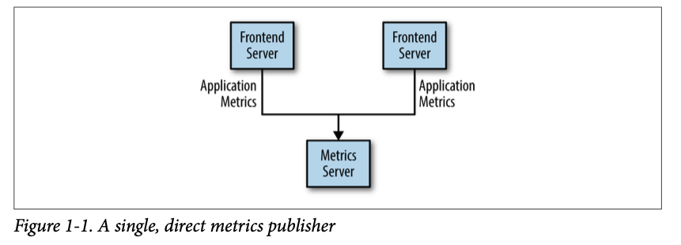

This is a simple solution to a simple problem that works when you are getting started with monitoring. Before long, you decide you would like to analyze your metrics over a longer term, and that doesn’t work well in the dashboard. You start a new service that can receive metrics, store them, and analyze them. In order to support this, you modify your application to write metrics to both systems. By now you have three more applications that are generating metrics, and they all make the same connections to these two services.

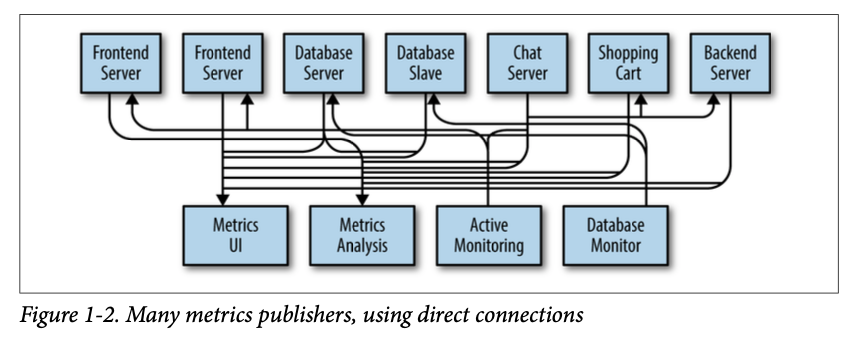

The technical debt built up here is obvious, so you decide to pay some of it back. You set up a single application that receives metrics from all the applications out there, and provide a server to query those metrics for any system that needs them.

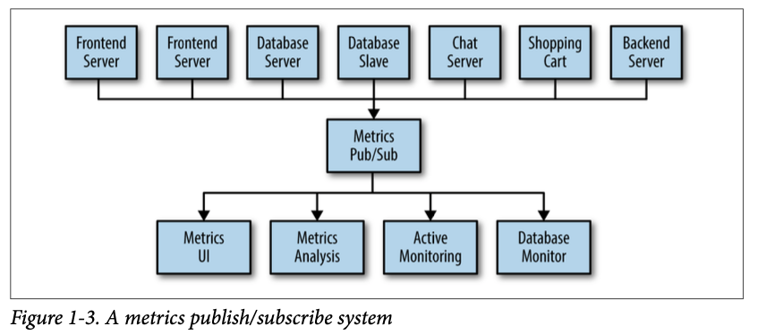

### Individual Queue Systems

At the same time that you have been waging this war with metrics, one of your coworkers has been doing similar work with log messages. Another has been working on tracking user behavior on the frontend website and providing that information to developers who are working on machine learning, as well as creating some reports for management. You have all followed a similar path.

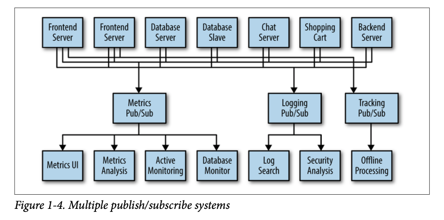

There is a lot of duplication. Your company is maintaining multiple systems for queuing data, all of which have their own individual bugs and limitations.

## Enter Kafka

Apache Kafka is a publish/subscribe messaging system designed to solve this problem. It is often described as a “distributed commit log” or more recently as a “distributing streaming platform.”

### Messages and Batches

The unit of data within Kafka is called a **message**. If you are approaching Kafka from a database background, you can think of this as similar to a row or a record. **A message is simply an array of bytes as far as Kafka is concerned, so the data contained within it does not have a specific format or meaning to Kafka.**

A message can have an optional piece of metadata, which is referred to as a **key**. The key is also a byte array and, as with the message, has no specific meaning to Kafka. Keys are used when messages are to be written to partitions in a more controlled manner. **The simplest such scheme is to generate a consistent hash of the key, and then select the partition number for that message by taking the result of the hash modulo the total number of partitions in the topic.** This assures that messages with the same key are always written to the same partition.

For efficiency, messages are written into Kafka in batches. **A batch is just a collection of messages, all of which are being produced to the same topic and partition.** An individual roundtrip across the network for each message would result in excessive overhead, and collecting messages together into a batch reduces this.

**Batches are also typically compressed, providing more efficient data transfer and storage at the cost of some processing power.**

### Schemas

Talks about Avro.

### Topics and Partitions

Messages in Kafka are categorized into **topics**. **The closest analogies for a topic are a database table or a folder in a filesystem.** Topics are additionally broken down into a number of **partitions**. **Going back to the “commit log” description, a partition is a single log.** Messages are written to it in an append only fashion, and are read in order from beginning to end.

**Note that as a topic typically has multiple partitions, there is no guarantee of message time-ordering across the entire topic, just within a single partition.**

Partitions are also the way that Kafka provides redundancy and scalability. Each partition can be hosted on a different server, which means that a single topic can be scaled horizontally across multiple servers to provide performance far beyond the ability of a single server. Additionally, partitions can be replicated, such that different servers will store a copy of the same partition in case one server fails.

### Producers and Consumers

The consumer subscribes to one or more topics and reads the messages in the order in which they were produced. The consumer keeps track of which messages it has already consumed by keeping track of the offset of messages. **The offset — an integer value that continually increases — is another piece of metadata that Kafka adds to each message as it is produced.**

Consumers work as part of a consumer group, which is one or more consumers that work together to consume a topic. The group assures that each partition is only consumed by one member. In Figure 1-6, there are three consumers in a single group consuming a topic. Two of the consumers are working from one partition each, while the third consumer is working from two partitions. The mapping of a consumer to a partition is often called ownership of the partition by the consumer. In this way, consumers can horizontally scale to consume topics with a large number of messages. **Additionally, if a single consumer fails, the remaining members of the group will rebalance the partitions being consumed to take over for the missing member.**

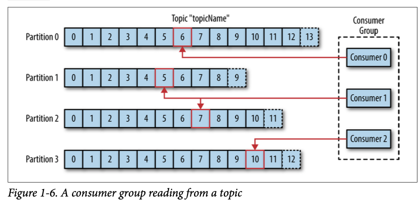

### Brokers and Clusters

Kafka brokers are designed to operate as part of a cluster. Within a cluster of brokers, **one broker will also function as the cluster controller (elected automatically from the live members of the cluster).** The controller is responsible for administrative operations, including assigning partitions to brokers and monitoring for broker failures. A partition is owned by a single broker in the cluster, and that broker is called the leader of the partition. A partition may be assigned to multiple brokers, which will result in the partition being replicated.

A key feature of Apache Kafka is that of retention, which is the durable storage of messages for some period of time. Kafka brokers are configured with a default retention setting for topics, either retaining messages for some period of time (e.g., 7 days) or until the topic reaches a certain size in bytes (e.g., 1 GB). Once these limits are reached, messages are expired and deleted. In this way, the retention configuration defines a minimum amount of data available at any time. Individual topics can also be configured with their own retention settings so that messages are stored for only as long as they are useful.

### Multiple Clusters

As Kafka deployments grow, it is often advantageous to have multiple clusters. There are several reasons why this can be useful: 
* Segregation of types of data 
* Isolation for security requirements 
* Multiple datacenters (disaster recovery)

The Kafka project includes a tool called MirrorMaker, used for replicating data to other clusters. At its core, MirrorMaker is simply a Kafka consumer and producer, linked together with a queue. Messages are consumed from one Kafka cluster and produced for another.

## Why Kafka?

Already covered in Kafka in Action.

### Multiple Producers

### Multiple Consumers

### Disk-Based Retention

Not only can Kafka handle multiple consumers, but durable message retention means that consumers do not always need to work in real time. Messages are committed to disk, and will be stored with configurable retention rules.

### Scalable

### High Performance

## The Data Ecosystem

### Use Cases

#### Activity tracking

#### Messaging

#### Metrics and logging

#### Commit log

Since Kafka is based on the concept of a commit log, database changes can be published to Kafka and applications can easily monitor this stream to receive live updates as they happen. This changelog stream can also be used for replicating database updates to a remote system, or for consolidating changes from multiple applications into a single database view.

#### Stream processing

## Kafka’s Origin

### LinkedIn’s Problem

### The Birth of Kafka

### Open Source

### Commercial Engagement

### The Name

## Getting Started with Kafka

# Chapter 2. Installing Kafka

## Setup of Zookeper and Kafka.Broker Configuration

There are numerous configuration options for Kafka that control all aspects of setup and tuning. **The majority of the options can be left to the default settings though, as they deal with tuning aspects of the Kafka broker that will not be applicable until you have a specific use case that requires adjusting these settings.**

### General Broker

There are several broker configuration parameters that should be reviewed when deploying Kafka for any environment other than a standalone broker on a single server. **These parameters deal with the basic configuration of the broker, and most of them must be changed to run properly in a cluster with other brokers.**

#### broker.id

Every Kafka broker must have an integer identifier, which is set using the ``broker.id`` configuration. By default, this integer is set to 0, but it can be any value. It is essential that the integer must be unique for each broker within a single Kafka cluster.

It is highly recommended to set this value to something intrinsic to the host so that when performing maintenance it is not onerous to map broker ID numbers to hosts. For example, if your hostnames contain a unique number (such as host1.example.com, host2.example.com, etc.), then 1 and 2 would be good choices for the broker.id values respectively.

#### listeners

Older versions of Kafka used a simple ``port`` configuration. This can be still be used as a backup for simple configurations but is a **deprecated config**. The example configuration file starts Kafka with a listener on TCP port 9092.

The new ``listeners`` config is a comma separated list of URIs that we listen on with the listener names.

A listener is defined as ``<protocol>:<hostname>:<port>``. An example of legal listener config: ``PLAINTEXT://localhost:9092,SSL://:9091``. Specifying the hostname as ``0.0.0.0`` will bind to all interfaces. Leaving the hostname empty will bind it to the default interface.

**Don't start Kafka with ports lower than 1024.**

#### zookeeper.connect

The location of the Zookeeper used for storing the broker metadata is set using the ``zookeeper.connect`` configuration parameter. The example configuration uses a Zookeeper running on port 2181 on the local host, which is specified as ``localhost:2181``.

The format for this parameter is a semicolon-separated list of ``hostname:port/path`` strings. 

*Self-Note*. ``path`` part is not interesting at this moment.

#### log.dirs

Kafka persists all messages to disk, and these log segments are stored in the directory specified in the ``log.dir`` configuration. For multiple directories, the config ``log.dirs`` is preferrable.

If this value is not set, it will default back to ``log.dir``. ``log.dirs`` is a comma-separated list of paths on the local system.

#### num.recovery.threads.per.data.dir

Kafka uses a configurable pool of threads for handling log segments. Currently, this thread pool is used: 
* When starting normally, to open each partition’s log segments 
* When starting after a failure, to check and truncate each partition’s log segments 
* When shutting down, to cleanly close log segments

As these threads are only used during startup and shutdown, it is reasonable to set a larger number of threads in order to parallelize operations. Specifically, when recovering from an unclean shutdown, this can mean the difference of several hours when restarting a broker with a large number of partitions!

#### auto.create.topics.enable

The default Kafka configuration specifies that the broker should automatically create a topic under the following circumstances: 
* When a producer starts writing messages to the topic 
* When a consumer starts reading messages from the topic 
* When any client requests metadata for the topic

**Set to false.**

#### auto.leader.rebalance.enable

In order to ensure a Kafka cluster doesn’t become unbalanced by having all topic leadership on one broker, this config can be specified to ensure leadership is balances as much as possible. It enables a background thread that checks the distribution of partitions at regular intervals (this interval in configurable via ``leader.imbal ance.check.interval.seconds``). If leadership imbalance exceeds another config ``leader.imbalance.per.broker.percentage`` then a rebalance of preferred leaders for partitions is started.

#### delete.topic.enable

Disabling topic deletion can be set by setting this flag to false.

### Topic Defaults

**The defaults in the server configuration should be set to baseline values that are appropriate for the majority of the topics in the cluster.**

#### num.partitions

The ``num.partitions`` parameter determines how many partitions a new topic is created with, primarily when automatic topic creation is enabled (which is the default setting). **This parameter defaults to one partition. Keep in mind that the number of partitions for a topic can only be increased, never decreased.**

Many users will have the partition count for a topic be equal to, or a multiple of, the number of brokers in the cluster.

##### How to Choose the Number of Partitions

There are several factors to consider when choosing the number of partitions: 
* What is the throughput you expect to achieve for the topic? For example, do you expect to write 100 KB per second or 1 GB per second? 
* What is the maximum throughput you expect to achieve when consuming from a single partition? A partition will always be consumed completely by a single consumer (as even when not using consumer groups, the consumer must read all messages in the partition). If you know that your slower consumer writes the data to a database and this database never handles more than 50 MB per second from each thread writing to it, then you know you are limited to 50 MB/sec throughput when consuming from a partition. 
* You can go through the same exercise to estimate the maximum throughput per producer for a single partition, but since producers are typically much faster than consumers, it is usually safe to skip this. 
* **If you are sending messages to partitions based on keys, adding partitions later can be very challenging, so calculate throughput based on your expected future usage, not the current usage.** 
* Consider the number of partitions you will place on each broker and available diskspace and network bandwidth per broker. 
* **Avoid overestimating, as each partition uses memory and other resources on the broker and will increase the time for metadata updates and leadership transfers.** 
* Will you be mirroring data? You may need to consider the throughput of your mirroring configuration as well. Large partitions can become a bottleneck in many mirroring configurations. 
* **If you are using cloud services, do you have IOPS limitiations on your VMs or disks?** There may be hard caps on the number of IOPS allowed depending on your cloud service and VM configuration that will cause you to hit quotas. Having too many partitions can have the side-effect of increasing the amount of IOPS due to the parallelism involved.

**If you have some estimate regarding the target throughput of the topic and the expected throughput of the consumers, you can divide the target throughput by the expected consumer throughput and derive the number of partitions this way.** So if I want to be able to write and read 1 GB/sec from a topic, and I know each consumer can only process 50 MB/s, then I know I need at least 20 partitions. This way, I can have 20 consumers reading from the topic and achieve 1 GB/sec.

Starting small and expanding as needed is easier than starting too large.

#### default.replication.factor

**If auto-topic creation is enabled, this configuration sets what the replication factor should be for new topics.**

It is highly recommended to set the replication factor to at least 1 above ``min.insync.replicas`` setting. For more fault resistant settings if you have large enough clusters and enough hardware, setting your replication factor to 2 above the ``min.insync.replicas`` (abbrevated as RF++) can be preferrable. RF++ will allow easier maintenance and prevent outages. **The reasoning behind this recommendation is to allow for one planned outage within the replica set and one unplanned outage to occur simultaneously.** For a typical cluster, this would mean you’d have a minumum of 3 replicas of every partition.

#### log.retention.ms

The most common configuration for how long Kafka will retain messages is by time. The default is specified in the configuration file using the ``log.retention.hours`` parameter, and it is set to 168 hours, or one week. However, there are two other parameters allowed, ``log.retention.minutes`` and ``log.retention.ms``. All three of these control the same goal (the amount of time after which messages may be deleted) but the **recommended parameter to use is ``log.retention.ms``, as the smaller unit size will take precedence if more than one is specified.** This will make sure that the value set for ``log.retention.ms`` is always the one used.

#### log.retention.bytes

Another way to expire messages is based on the total number of bytes of messages retained. This value is set using the ``log.retention.bytes`` parameter, and it is **applied per-partition**. This means that if you have a topic with 8 partitions, and ``log.retention.bytes`` is set to 1 GB, **the amount of data retained for the topic will be 8 GB at most.** Note that all retention is performed for individual partitions, not the topic. This means that **should the number of partitions for a topic be expanded, the retention will also increase if ``log.retention.bytes`` is used.** Setting the value to -1 will allow for infinite retention.

#### log.segment.bytes

The log-retention settings previously mentioned operate on log segments, not individual messages. As messages are produced to the Kafka broker, they are appended to the current log segment for the partition. Once the log segment has reached the size specified by the ``log.segment.bytes`` parameter, which **defaults to 1 GB**, the log segment is closed and a new one is opened. Once a log segment has been closed, it can be considered for expiration. **A smaller log-segment size means that files must be closed and allocated more often, which reduces the overall efficiency of disk writes.**

Adjusting the size of the log segments can be important if topics have a low produce rate. For example, **if a topic receives only 100 megabytes per day of messages, and ``log.segment.bytes`` is set to the default, it will take 10 days to fill one segment. As messages cannot be expired until the log segment is closed, if log.retention.ms is set to 604800000 (1 week), there will actually be up to 17 days of messages retained until the closed log segment expires.** This is because once the log segment is closed with the current 10 days of messages, that log segment must be retained for 7 days before it expires based on the time policy (as the segment cannot be removed until the last message in the segment can be expired).

#### log.segment.ms

Another way to control when log segments are closed is by using the ``log.segment.ms`` parameter, which specifies the amount of time after which a log segment should be closed. As with the ``log.retention.bytes`` and ``log.retention.ms`` parameters, ``log.segment.bytes`` and ``log.segment.ms`` are **not mutually exclusive properties**. Kafka will close a log segment either when the size limit is reached or when the time limit is reached, whichever comes first. **By default, there is no setting for ``log.seg ment.ms``, which results in only closing log segments by size.**

#### min.insync.replicas

When configuring your cluster for data durability, **setting ``min.insync.replicas`` to 2 ensures that at least two replicas are caught up and “in sync” to the producer. This is used in tandem with setting the producer config to ack “all” requests. This will ensure that at least two replicas (leader and one other) acknowledge a write in order for it to be successful.** This can prevent data loss in scenarios where the leader acks a write then suffers a failure and leadership is transferred to a replica that does not have a successful write.

#### message.max.bytes

The Kafka broker limits the maximum size of a message that can be produced, configured by the ``message.max.bytes`` parameter, which defaults to 1000000, or 1 MB. A producer that tries to send a message larger than this will receive an error back from the broker, and the message will not be accepted. As with all byte sizes specified on the broker, **this configuration deals with compressed message size, which means that producers can send messages that are much larger than this value uncompressed**, provided they compress to under the configured ``message.max.bytes`` size.

##### Coordinating Message Size Configurations

**The message size configured on the Kafka broker must be coordinated with the fetch.message.max.bytes configuration on consumer clients. If this value is smaller than message.max.bytes, then consumers that encounter larger messages will fail to fetch those messages, resulting in a situation where the consumer gets stuck and cannot proceed. The same rule applies to the replica.fetch.max.bytes configuration on the brokers when configured in a cluster.**

## Hardware Selection

To low level for now.

## Kafka in the Cloud

Not interested.

## Kafka Clusters

A single Kafka server works well for local development work, or for a proof-of- concept system, but there are significant benefits to having multiple brokers configured as a cluster. 

**The biggest benefit is the ability to scale the load across multiple servers. A close second is using replication to guard against data loss due to single system failures.**

### How Many Brokers?

The appropriate size for a Kafka cluster is determined by several factors. Typically the size of your cluster will be bound on the following key areas: 
* Disk Capacity 
* Replica Capacity per broker 
* CPU Capacity 
* Network Capacity

The first factor to consider is how much disk capacity is required for retaining messages and how much storage is available on a single broker. If the cluster is required to retain 10 TB of data and a single broker can store 2 TB, then the minimum cluster size is five brokers. In addition, using replication will increase the storage requirements by at least 100%, depending on the replication factor.

**Currently, in a well configured environment, it is recommended to not have more than 14,000 partitions per broker and 1 million replicas per cluster.**

## Broker Configuration

There are only two requirements in the broker configuration to allow multiple Kafka brokers to join a single cluster:
* The first is that all brokers must have the same configuration for the ``zookeeper.connect`` parameter. This specifies the Zookeeper ensemble and path where the cluster stores metadata.
* The second requirement is that all brokers in the cluster must have a unique value for the ``broker.id`` parameter. **If two brokers attempt to join the same cluster with the same ``broker.id``, the second broker will log an error and fail to start.**

## OS Tuning

Too low level for now.

## Production Concerns

### Garbage Collector Options

### Datacenter Layout

### Colocating Applications on Zookeeper

**Self-Note**.

Most of this information will soon be irrelevant due to migration off Zookeeper.

# Chapter 3. Kafka Producers: Writing Messages to Kafka

## Producer Overview

**The different requirements will influence the way you use the producer API to write messages to Kafka and the configuration you use.**

While the producer API is very simple, there is a bit more that goes on under the hood of the producer when we send data. Figure 3-1 shows the main steps involved in sending data to Kafka.

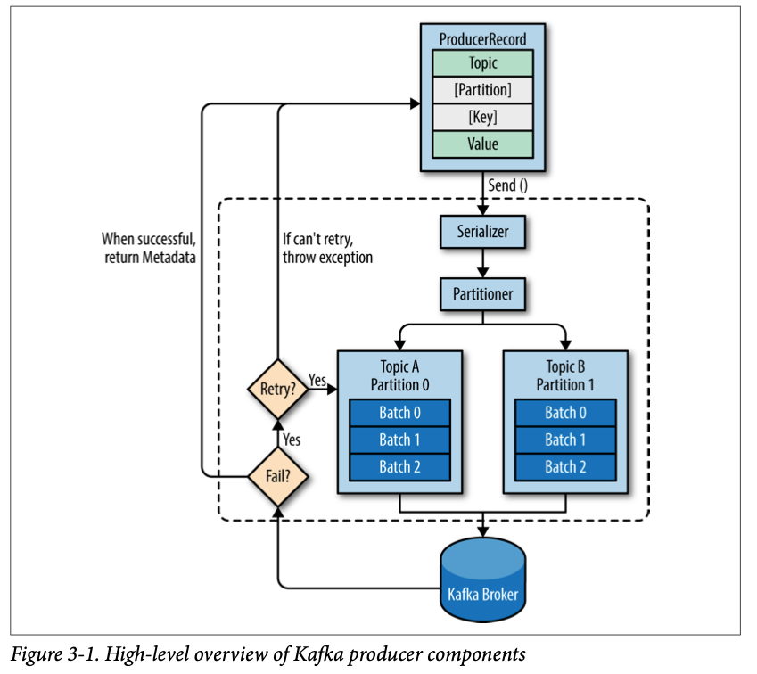

We start producing messages to Kafka by creating a ``ProducerRecord``, which must include the topic we want to send the record to and a value. Optionally, we can also specify a key and/or a partition. Once we send the ``ProducerRecord``, the first thing the producer will do is serialize the key and value objects to ByteArrays so they can be sent over the network.

Next, the data is sent to a partitioner. If we specified a partition in the ``ProducerRecord``, the partitioner doesn’t do anything and simply returns the partition we specified. If we didn’t, the partitioner will choose a partition for us, **usually based on the ``ProducerRecord`` key.** Once a partition is selected, the producer knows which topic and partition the record will go to. It then adds the record to a batch of records that will also be sent to the same topic and partition. **A separate thread is responsible for sending those batches of records to the appropriate Kafka brokers.**

When the broker receives the messages, it sends back a response. **If the messages were successfully written to Kafka, it will return a ``RecordMetadata`` object with the topic, partition, and the offset of the record within the partition. If the broker failed to write the messages, it will return an error.** When the producer receives an error, it may retry sending the message a few more times before giving up and returning an error.

## Constructing a Kafka Producer

A Kafka producer has three mandatory properties.

### bootstrap.servers

List of ``host:port`` pairs of brokers that the producer will use to establish initial connection to the Kafka cluster. This list doesn’t need to include all brokers, since the producer will get more information after the initial connection. **But it is recommended to include at least two.**

### key.serializer

Name of a class that will be used to serialize the keys of the records we will produce to Kafka. Kafka brokers expect byte arrays as keys and values of messages.

**``key.serializer`` should be set to a name of a class that implements the ``org.apache.kafka.common.serialization.Serializer`` interface.** The producer will use this class to serialize the key object to a byte array.

The Kafka client package includes ``ByteArraySerializer``, ``StringSerializer``, and ``IntegerSerializer``.

### value.serializer

Name of a class that will be used to serialize the values of the records we will produce to Kafka. The same way you set ``key.serializer``.

The following code snippet shows how to create a new producer by setting just the mandatory parameters and using defaults for everything else:

```java
Properties kafkaProps = new Properties();
kafkaProps.put("bootstrap.servers", "broker1:9092,broker2:9092");
kafkaProps.put("key.serializer", "org.apache.kafka.common.serialization.StringSerializer");
kafkaProps.put("value.serializer", "org.apache.kafka.common.serialization.StringSerializer");
var producer = new KafkaProducer<String, String>(kafkaProps);
```

Once we instantiate a producer, it is time to start sending messages. **There are three primary methods of sending messages**:
* **Fire-and-forget** - We send a message to the server and don’t really care if it arrives successfully or not. In case of non-retryable errors or timeout, messages will get lost and the application will not get any information or exceptions about this.
* **Synchronous send** - We send a message with ``send()`` method returns a ``Future`` object, and we use ``get()`` to wait on the future and see if the ``send()`` was successful or not.
* **Asynchronous send** - We call the ``send()`` method with a callback function, which gets triggered when it receives a response from the Kafka broker.

**While all the examples in this chapter are single threaded, a producer object can be used by multiple threads to send messages.**

## Sending a Message to Kafka

The simplest way to send a message is as follows:

```java
var record = new ProducerRecord<String, String>("CustomerCountry", "Precision Products", "France");
try {
    producer.send(record);
} catch (Exception e) {
    e.printStackTrace();
}
```

The producer accepts ``ProducerRecord`` objects, so we start by creating one. Here we use one that requires the name of the topic we are sending data to, which is always a string, and the key and value we are sending to Kafka, which in this case are also strings. **The types of the key and value must match our key serializer and value serializer objects.**

We use the producer object ``send()`` method to send the ``ProducerRecord``. **The message will be placed in a buffer and will be sent to the broker in a separate thread.** The ``send()`` method returns a Java ``Future`` object with ``RecordMetadata``, but since we simply ignore the returned value, we have no way of knowing whether the message was sent successfully or not.

While we ignore errors that may occur while sending messages to Kafka brokers or in the brokers themselves, we may still get an exception if the producer encountered errors before sending the message to Kafka. Those can be a ``SerializationException`` when it fails to serialize the message, a ``BufferExhaustedException`` or ``TimeoutException`` if the buffer is full, or an ``InterruptException`` if the sending thread was interrupted.

### Sending a Message Synchronously

Sending a message synchronously is simple but still allows the producer to catch exceptions when Kafka responds to the produce request with an error, or when send retries were exhausted. The main tradeoff involved is performance. **Depending on how busy the Kafka cluster is, brokers can take anywhere from 2ms to few seconds to respond to produce requests.** If you send messages synchronously, the sending thread will spend this time waiting and doing nothing else.

This leads to very poor performance and as a result, **synchronous sends are not used in production applications (but are very common in code examples).** The simplest way to send a message synchronously is as follows:

```java
ProducerRecord<String, String> record = new ProducerRecord<>("CustomerCountry", "Precision Products", "France");
try {
    producer.send(record).get();
} catch (Exception e) {
    e.printStackTrace();
}
```

``KafkaProducer`` has two types of errors:
* Retriable errors are those that can be resolved by sending the message again. For example, a connection error can be resolved because the connection may get reestablished. A “not leader for partition” error can be resolved when a new leader is elected for the partition and the client metadata is refreshed. **KafkaProducer can be configured to retry those errors automatically, so the application code will get retriable exceptions only when the number of retries was exhausted and the error was not resolved.**
* Non-retriable errors. Some errors will not be resolved by retrying. For example, “message size too large.” In those cases, ``KafkaProducer`` will not attempt a retry and will return the exception immediately.

### Sending a Message Asynchronously

Suppose the network roundtrip time between our application and the Kafka cluster is 10ms. If we wait for a reply after sending each message, sending 100 messages will take around 1 second. On the other hand, if we just send all our messages and not wait for any replies, then sending 100 messages will barely take any time at all.

In order to send messages asynchronously and still handle error scenarios, the producer supports adding a callback when sending a record. Here is an example of how we use a callback:

```java
private class DemoProducerCallback implements Callback {
    @Override
    public void onCompletion(RecordMetadata recordMetadata, Exception e) {
        if (e != null) {
            e.printStackTrace();
        }
} }

ProducerRecord<String, String> record = new ProducerRecord<>("CustomerCountry", "Biomedical Materials", "USA");
producer.send(record, new DemoProducerCallback());
```

To use callbacks, you need a class that implements the ``org.apache.kafka.clients.producer.Callback`` interface, which has a single function — ``onCompletion()``.

If Kafka returned an error, ``onCompletion()`` will have a non-null exception. Here we “handle” it by printing, but production code will probably have more robust error handling functions.

**The callbacks execute in the producer’s main thread.** This guarantees that when we send two messages to the same partition one after another, their callbacks will be executed in the same order that we sent them. But it also means that the callback should be reasonably fast, to avoid delaying the producer and preventing other messages from being sent. **If you want to perform a blocking operation in the callback, it is recommended to use another thread and perform the operation concurrently.**

## Configuring Producers

Some of the parameters have a significant impact on memory use, performance, and reliability of the producers. We will review those here.

### client.id

A logical identifier for the client and the application it is used in. This can be any string, and will be used by the brokers to identify messages sent from the client. It is used in logging and metrics, and for quotas.

**Choosing a good client name will make troubleshooting much easier.**

### acks

The acks parameter controls how many partition replicas must receive the record before the producer can consider the write successful. **By default, Kafka will respond that the record was written successfully after the leader received the record (Release 3.0 of Apache Kafka is expected to change this default).** This option has a significant impact on the durability of written messages, and depending on your use-case, the default may not be the best choice.
* **acks=0**, the producer will not wait for a reply from the broker before assuming the message was sent successfully. This means that if something went wrong and the broker did not receive the message, the producer will not know about it and the message will be lost.
* **acks=1**, the producer will receive a success response from the broker the moment the leader replica received the message. If the message can’t be written to the leader (e.g., if the leader crashed and a new leader was not elected yet), the producer will receive an error response and can retry sending the message, avoiding potential loss of data. The message can still get lost if the leader crashes and a replica without this message gets elected as the new leader (via **unclean leader election**). In this case, throughput depends on whether we send messages synchronously or asynchronously. If our client code waits for a reply from the server (by calling the get() method of the Future object returned when sending a message) it will obviously increase latency significantly (at least by a network roundtrip). If the client uses callbacks, latency will be hidden, but throughput will be limited by the number of in-flight messages (i.e., how many messages the producer will send before receiving replies from the server).
* **acks=all**, the producer will receive a success response from the broker once all in-sync replicas received the message. This is the safest mode since you can make sure more than one broker has the message and that the message will survive even in the case of crash.

You will see that with lower and less reliable acks configuration, the producer will be able to send records faster. **This means that you trade off reliability for producer latency.** However, **end to end latency** is measured from the time a record was produced until it is available for consumers to read and **is identical for all three options.** The reason is that, in order to maintain consistency, Kafka will not allow consumers to read records until they were written to all in-sync replicas. Therefore, if you care about end-to-end latency, rather than just the producer latency, there is no trade-off to make: **You will get the same end-to-end latency if you choose the most reliable option.**

**Self-Note**. Therefore, if you want to impact end-to-end latency, you'd have to reduce in-sync replicas count.

### Message Delivery Time

The producer has multiple configuration parameters that interact to control one of the behaviors that are of most interest to developers: **How long will it take until a call to ``send()`` will succeed or fail.** This is the time we are willing to spend until Kafka responds successfully, or until we are willing to give up and admit defeat.

Since **Apache Kafka 2.1**, we divide the time spent sending a ``ProduceRecord`` into two time intervals that are handled separately: 
* Time until an async call to ``send()`` returns - during this interval the thread that called ``send()`` will be blocked. 
* From the time an async call to ``send()`` returned successfully until the callback is triggered (with success or failure). This is also from the point a ``ProduceRecord`` was placed in a batch for sending, until Kafka responds with success, non-retriable failure, or we run out of time allocated for sending.

The flow of data within the producer and how the different configuration parameters affect each other can be summarized in a diagram:

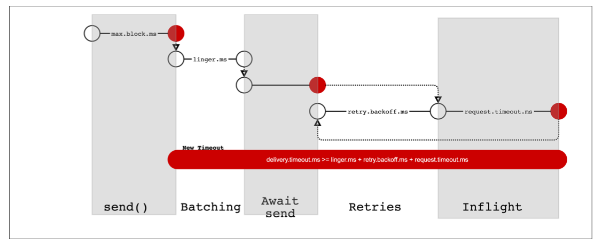

#### max.block.ms

This parameter controls how long the producer will block when calling ``send()`` and when explicitly requesting metadata via ``partitionsFor()``. Those methods block when the producer’s send buffer is full or when metadata is not available. **When ``max.block.ms`` is reached, a timeout exception is thrown.**

#### delivery.timout.ms

This configuration will limit the amount of time spent from the point a record is ready for sending (``send()`` returned successfully and the record is placed in a batch) until either the broker responds or we give up, including time spent on retries. As you can see in Figure 3-2, this time should be greater than ``linger.ms`` and ``request.time out``. If you try to create a producer with inconsistent timeout configuration, you will get an exception. Messages can be successfully sent much faster than ``delivery.timeout.ms`` and typically will. **This configuration is an upper bound.**

If the producer exceeds ``delivery.timeout.ms`` while retrying, **the callback will be called with the exception that corresponds to the error that the broker returned before retrying.** 
If ``delivery.timeout.ms`` is exceeded while the record batch was still waiting to be sent, **the callback will be called with a timeout exception.**

**You can configure the delivery timeout to the maximum time you’ll want to wait for a message to be sent - typically few minutes, and then leave the default number of retries (virtually infinite). With this configuration, the producer will keep retrying for as long as it has time to keep trying (or until it succeeds). This is a much more reasonable way to think about retries. Our normal process for tuning retries is: “In case of a broker crash, it typically takes leader election 30 seconds to complete, so lets keep retrying for 120s just to be on the safe side.” Instead of converting this mental dialog to number of retries and time between retries, you just configure deliver.timeout.ms to 120s.**

#### request.timeout.ms

This parameter control how long the producer will wait for a reply from the server when sending data. **Note that this is the time spent waiting on each produce request before giving up - it does not include retries, time spent before sending, etc.** If the timeout is reached without reply, the producer will either retry sending or complete the callback with a TimeoutException.

#### retries and retry.backoff.ms

When the producer receives an error message from the server, the error could be transient (e.g., a lack of leader for a partition). In this case, the value of the retries parameter will control how many times the producer will retry sending the message before giving up and notifying the client of an issue. **By default, the producer will wait 100ms between retries, but you can control this using the ``retry.backoff.ms parameter``.**

**We recommend against using these parameters in current version of Kafka.** **Instead**, test how long it takes to recover from a crashed broker (i.e., how long until all partitions get new leaders) and **set ``delivery.timeout.ms``** such that the total amount of time spent retrying will be longer than the time it takes the Kafka cluster to recover from the crash — otherwise, the producer will give up too soon.

In general, because the producer handles retries for you, there is no point in handling retries within your own application logic. **You will want to focus your efforts on handling nonretriable errors or cases where retry attempts were exhausted.**

#### linger.ms

``linger.ms`` controls the amount of time to wait for additional messages before sending the current batch. **KafkaProducer sends a batch of messages either when the current batch is full or when the ``linger.ms`` limit is reached. By default, the producer will send messages as soon as there is a sender thread available to send them, even if there’s just one message in the batch.** By setting ``linger.ms`` higher than 0, we instruct the producer to wait a few milliseconds to add additional messages to the batch before sending it to the brokers. This increases latency a little and significantly increases throughput - the overhead per message is much lower and compression, if enabled, is much better.

### buffer.memory

This sets the amount of memory the producer will use to buffer messages waiting to be sent to brokers. If messages are sent by the application faster than they can be delivered to the server, the producer may run out of space and additional ``send()`` calls will block for ``max.block.ms`` and wait for space to free up, before throwing an exception.

### compression.type

By default, messages are sent uncompressed. This parameter can be set to ``snappy``, ``gzip``, ``lz4`` or ``zstd``, in which case the corresponding compression algorithms will be used to compress the data before sending it to the brokers.

### batch.size

When multiple records are sent to the same partition, the producer will batch them together. **This parameter controls the amount of memory in bytes (not messages!) that will be used for each batch.** When the batch is full, all the messages in the batch will be sent. **However, this does not mean that the producer will wait for the batch to become full.** The producer will send half-full batches and even batches with just a single message in them. **Therefore, setting the batch size too large will not cause delays in sending messages; it will just use more memory for the batches.** Setting the batch size too small will add some overhead because the producer will need to send messages more frequently.

### max.in.flight.requests.per.connection

This controls how many messages the producer will send to the server without receiving responses. Setting this high can increase memory usage while improving throughput, but setting it too high can reduce throughput as batching becomes less efficient.

**Experiments show that in a single-DC environment, the throughput is maximized with only 2 in-flight requests, however the default value is 5 and shows similar performance.**

**Ordering Guarantees**

Setting the retries parameter to nonzero and the ``max.in.flight.requests.per.connection`` to more than one means that it is possible that the broker will fail to write the first batch of messages, succeed to write the second (which was already in-flight), and then retry the first batch and succeed, thereby reversing the order. Since we want at least two in-flight requests for performance reasons and a high number of retries for reliability reasons, **the best solution is to ``set enable.idempotence=true`` - this guarantees message ordering with up to 5 in-flight requests and also guarantees that retries will not introduce duplicates.**

### max.request.size

This setting controls the size of a produce request sent by the producer. It caps both the size of the largest message that can be sent and the number of messages that the producer can send in one request. **For example, with a default maximum request size of 1 MB, the largest message you can send is 1 MB or the producer can batch 1,024 messages of size 1 KB each into one request. In addition, the broker has its own limit on the size of the largest message it will accept (``message.max.bytes``). It is usually a good idea to have these configurations match, so the producer will not attempt to send messages of a size that will be rejected by the broker.**

### receive.buffer.bytes and send.buffer.bytes

These are the sizes of the TCP send and receive buffers used by the sockets when writing and reading data. If these are set to -1, the OS defaults will be used. **It is a good idea to increase those when producers or consumers communicate with brokers in a different datacenter because those network links typically have higher latency and lower bandwidth.**

### enable.idempotence

Starting in version 0.11, Kafka supports exactly once semantics. Exactly once is a fairly large topic and we’ll dedicate an entire chapter to it, but **idempotent producer is a simple and highly beneficial part of it.**

Suppose that you configure your producer to maximize reliability - ``acks=all`` and decently large ``delivery.timeout.ms`` to allow sufficient retries. All to make sure each message will be written to Kafka at least once. In some cases, this means that messages will be written to Kafka more than once. For example, imagine that a broker received a record from the producer, wrote it to local disk and the record was successfully replicated to other brokers, but then first broker crashed before sending a response back to the producer. The producer will wait until it reaches request.time out.ms and then retry. The retry will go to the new leader, that already has a copy of this record, since the previous write was replicated successfully. You now have a duplicate record.

If you wish to avoid this, you can set ``enable.idempotence=true``. When idempotent producer is enabled, the producer will attach a sequence number to each record it sends. If the broker receives records with the same sequence number within a 5 message window, it will reject the second copy and the producer will receive the harmless ``DuplicateSequenceException``.

**Enabling idempotence requires ``max.in.flight.requests.per.connection`` to be less than or equal to 5, retries to be greater than 0 (either directly or via ``delivery.timeout.ms``) and ``acks=all``. If incompatible values are set, a ``ConfigException`` will be thrown.**

## Serializers

### Custom Serializers

We recommend using existing serializers and deserializers such as JSON, Apache Avro, Thrift, or Protobuf.

### Serializing Using Apache Avro

Avro data is described in a language-independent schema. The schema is usually described in JSON and the serialization is usually to binary files, although serializing to JSON is also supported. **Avro assumes that the schema is present when reading and writing files, usually by embedding the schema in the files themselves.**

**One of the most interesting features of Avro, and what makes it a good fit for use in a messaging system like Kafka, is that when the application that is writing messages switches to a new schema, the applications reading the data can continue processing messages without requiring any change or update.**

However, there are two caveats to this scenario:
* The schema used for writing the data and the schema expected by the reading application must be compatible. The Avro documentation includes compatibility rules. 
* The deserializer will need access to the schema that was used when writing the data, even when it is different than the schema expected by the application that accesses the data. In Avro files, the writing schema is included in the file itself, but there is a better way to handle this for Kafka messages. We will look at that next.

### Using Avro Records with Kafka

Unlike Avro files, where storing the entire schema in the data file is associated with a fairly reasonable overhead, **storing the entire schema in each record will usually more than double the record size.** However, Avro still requires the entire schema to be present when reading the record, so we need to locate the schema elsewhere. To achieve this, we follow a common architecture pattern and use a **Schema Registry**. The Schema Registry is not part of Apache Kafka but there are several open source options to choose from. We’ll use the Confluent Schema Registry for this example.

The idea is to store all the schemas used to write data to Kafka in the registry. Then we simply store the identifier for the schema in the record we produce to Kafka. The consumers can then use the identifier to pull the record out of the schema registry and deserialize the data. The key is that all this work—storing the schema in the registry and pulling it up when required—is done in the serializers and deserializers.

```java
Properties props = new Properties();
props.put("bootstrap.servers", "localhost:9092");
props.put("key.serializer", "io.confluent.kafka.serializers.KafkaAvroSerializer");
props.put("value.serializer", "io.confluent.kafka.serializers.KafkaAvroSerializer");
props.put("schema.registry.url", schemaUrl);

String topic = "customerContacts";

Producer<String, Customer> producer = new KafkaProducer<>(props);
    
// We keep producing new events until someone ctrl-c
while (true) {
    Customer customer = CustomerGenerator.getNext();
    System.out.println("Generated customer " + customer.toString());
    ProducerRecord<String, Customer> record = new ProducerRecord<>(topic, customer.getName(), customer);
    producer.send(record);
}
```

## Partitions

In previous examples, the ``ProducerRecord`` objects we created included a topic name, key, and value. Kafka messages are key-value pairs and while it is possible to create a ``ProducerRecord`` with just a topic and a value, with the key set to null by default, most applications produce records with keys. Keys serve two goals: 
* they are additional information that gets stored with the message, 
* they are also used to decide which one of the topic partitions the message will be written to.

**All messages with the same key will go to the same partition.**

To create a key-value record, you simply create a ProducerRecord as follows:

```java
ProducerRecord<String, String> record = new ProducerRecord<>("CustomerCountry", "Laboratory Equipment", "USA");
```

When creating messages with a null key, you can simply leave the key out:

```java
ProducerRecord<String, String> record = new ProducerRecord<>("CustomerCountry", "USA");
```

When the key is null and the default partitioner is used, **the record will be sent to one of the available partitions of the topic at random. A round-robin algorithm will be used to balance the messages among the partitions. Starting in Apache Kafka 2.4 producer, the round-robin algorithm used in the default partitioner when handling null keys is sticky. This means that it will fill a batch of messages sent to a single partition before switching to a different random partition.** This allows sending the same number of messages to Kafka in fewer requests - leading to lower latency and reduced CPU utilization on the broker.

If a key exists and the default partitioner is used, Kafka will hash the key (using its own hash algorithm, so hash values will not change when Java is upgraded), and use the result to map the message to a specific partition. Since it is important that a key is always mapped to the same partition, **we use all the partitions in the topic to calculate the mapping—not just the available partitions. This means that if a specific partition is unavailable when you write data to it, you might get an error.**

In addition to the default partitioner, Apache Kafka clients also provide ``RoundRobinPartitioner`` and ``UniformStickyPartitioner``. These provide random partition assignment and sticky random partition assignment even when messages have keys. **These are useful when keys are important for the consuming application (for example, there are ETL applications that use the key from Kafka records as primary key when loading data from Kafka to a relational database), but the workload may be skewed, so a single key may have disproportional large workload.** Using the ``UniformStickyPartitioner`` will result in an even distribution of workload across all partitions.

When the default partitioner is used, the mapping of keys to partitions is consistent only as long as the number of partitions in a topic does not change. So as long as the number of partitions is constant, you can be sure that, for example, records regarding user 045189 will always get written to partition 34.

However, the moment you add new partitions to the topic, this is no longer guaranteed—the old records will stay in partition 34 while new records will get written to a different partition. **When partitioning keys is important, the easiest solution is to create topics with sufficient partitions and never add partitions.**

### Implementing a custom partitioning strategy

Here is an example of a custom partitioner:

```java
import org.apache.kafka.clients.producer.Partitioner;
import org.apache.kafka.common.Cluster;
import org.apache.kafka.common.PartitionInfo;
import org.apache.kafka.common.record.InvalidRecordException;
import org.apache.kafka.common.utils.Utils;
    
public class BananaPartitioner implements Partitioner {
    
    public void configure(Map<String, ?> configs) {}
    
    public int partition(String topic, Object key, byte[] keyBytes,
                         Object value, byte[] valueBytes,
                         Cluster cluster) {
        
    	List<PartitionInfo> partitions = cluster.partitionsForTopic(topic);
        int numPartitions = partitions.size();
        
        if ((keyBytes == null) || (!(key instanceOf String))) {
            throw new InvalidRecordException("We expect all messages to have customer name as key");
		}
        if (((String) key).equals("Banana")) {
            return numPartitions - 1; // Banana will always go to last partition
		}
        // Other records will get hashed to the rest of the partitions
        return (Math.abs(Utils.murmur2(keyBytes)) % (numPartitions - 1));
    }
    public void close() {}
}
```

## Headers

Records can, in addition to key and value, also include headers. Record headers give you the ability to add some metadata about the Kafka record, without adding any extra information to the key/value pair of the record itself. **Headers are often used for lineage, to indicate the source of the data in the record and for routing or tracing messages based on header information without having to parse the message itself (perhaps the message is encrypted and the router doesn’t have permissions to access the data).**

Headers are implemented as an ordered collection of key/value pairs. **The keys are always a ``String``, and the values can be any serialized object - just like the message value.**

```java
ProducerRecord<String, String> record = new ProducerRecord<>("CustomerCountry", "Precision Products", "France");
record.headers().add("privacy-level", "YOLO".getBytes(StandardCharsets.UTF_8));
```

## Interceptors

Kafka’s ``ProducerInterceptor`` interceptor includes two key methods:
* ``ProducerRecord<K, V> onSend(ProducerRecord<K, V> record)`` - this method will be called before the produced record is sent to Kafka, indeed before it is even serialized. When overriding this method, you can capture information about the sent record and even modify it. Just be sure to return a valid ``ProducerRecord`` from this method. The record that this method returns will be serialized and sent to Kafka. 
* ``void onAcknowledgement(RecordMetadata metadata, Exception exception)`` - this method will be called if and when Kafka responds with an acknowledgement for a send. The method does not allow modifying the response from Kafka, but you can capture information about the response.

**Common use-cases for producer interceptors include capturing monitoring and tracing information, enhancing the message with standard headers - especially for lineage tracking purposes and redacting sensitive information.**

**It is tempting to use a producer interceptor to encrypt messages before they are sent to Kafka. However, if you configured compression (highly recommended!), messages will be compressed after they are intercepted. If the interceptor encrypts the messages, the compression step will attempt to compress encrypted messages. Encrypted messages do not compress well, if at all, which makes the compression futile.**

To use the interceptor above with ``kafka-console-producer`` - an example application that ships with Apache Kafka, follow 3 simple steps: 
* Add jar to classpath: ``export CLASSPATH=$CLASSPATH:~./target/ CountProducerInterceptor-1.0-SNAPSHOT.jar`` 
* Create a config file that includes: ``interceptor.classes=com.shapira.examples.interceptors.CountProducerInterceptor counting.interceptor.window.size.ms=10000`` 
* Run the application as you normally would, but make sure to include the configuration that you created in the previous step: ``bin/kafka-console-producer.sh --broker-list localhost:9092 --topic interceptor-test -- producer.config producer.config``

## Quotas and Throttling

Kafka brokers have the ability to limit the rate in which messages are produced and consumed. This is done via the quota mechanism. Kafka has three quota types: 
* produce;
* consume;
* request. 

Produce and Consume quotas limit the rate at which clients can send and receive data, measured in bytes per second. Request quota limit the percentage of time client requests can spend on the request handler and network handler threads.Quotas can be applied to all clients by setting default quotas, specific client-ids, specific users (as identified by their KafkaPrincipal) or both. User-specific quotas are only meaningful in clusters where security is configured and clients authenticate.

Quotas can be applied to all clients by setting default quotas, specific client-ids, specific users (as identified by their KafkaPrincipal) or both. **User-specific quotas are only meaningful in clusters where security is configured and clients authenticate.**

The default produce and consume quotas that are applied to all clients are part of the Kafka broker configuration file. For example, to limit each producer to send no more than 2 megabytes per second on average, add the following configuration to the broker configuration file: ``quota.producer.default=2M``.


**While not recommended**, you can also configure specific quotas for certain clients that override the default quotas in the broker configuration file. To allow clientA to producer 4 megabytes a second and clientB 10 megabytes a second, you can use the following: ``quota.producer.override="clientA:4M,clientB:10M"``

Quotas that are specified in Kafka’s configuration file are static, and you can only modify them by changing the configuration and then restarting all the brokers. Since new clients can arrive at any time, this is very inconvenient. **Therefore the usual method of applying quotas to specific clients is through dynamic configuration that can be set using ``kafka-config.sh`` or the ``AdminClient`` API.**

```shell
#Limiting clientC (identified by client-id) to produce only 1024 bytes per second
bin/kafka-configs  --bootstrap-server localhost:9092 --alter --add-config 'producer_byte_rate=1024' --entity-name clientC --entity-type clients

#Limiting user1 (identified by authenticated principal) to produce only 1024 bytes per second and consume only 2048 bytes per second.
bin/kafka-configs  --bootstrap-server localhost:9092 --alter --add-config 'producer_byte_rate=1024,consumer_byte_rate=2048' --entity-name user1 --entity-type users

#Limiting all users to consume only 2048 bytes per second, except users with more specific override. This is the way to dynamically modify the default quota.
bin/kafka-configs  --bootstrap-server localhost:9092 --alter --add-config 'consumer_byte_rate=2048' --entity-type users
```

When a client reaches its quota, the broker will start throttling the client’s requests, to prevent it from exceeding the quota. This means that the broker will delay responses to client requests, in most clients this will automatically reduce the request rate (since the number of in-flight requests is limited), and bring the client traffic down to a level allowed by the quota. To protect the broker from misbehaved clients sending additional requests while being throttled, the broker will also mute the communication channel with the client for the period of time needed to achieve compliance with the quota.

# Chapter 4. Kafka Consumers: Reading Data from Kafka

## Kafka Consumer Concepts

In order to understand how to read data from Kafka, you first need to understand its **consumers and consumer groups.** The following sections cover those concepts.

### Consumers and Consumer Groups

Kafka consumers are typically part of a **consumer group**. When multiple consumers are subscribed to a topic and belong to the same consumer group, each consumer in the group will receive messages from a different subset of the partitions in the topic.

Let’s take topic T1 with four partitions. Now suppose we created a new consumer, C1, which is the only consumer in group G1, and use it to subscribe to topic T1. Consumer C1 will get all messages from all four T1 partitions.

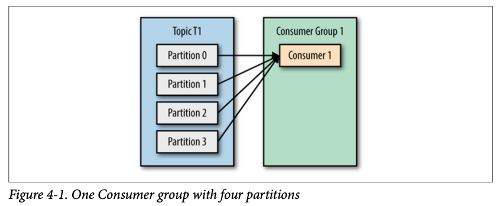

If we add another consumer, C2, to group G1, each consumer will only get messages from two partitions. Perhaps messages from partition 0 and 2 go to C1 and messages from partitions 1 and 3 go to consumer C2.

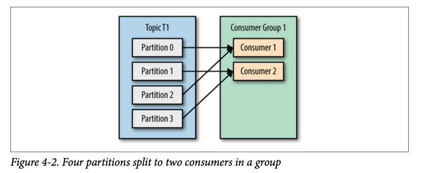

If G1 has four consumers, then each will read messages from a single partition.

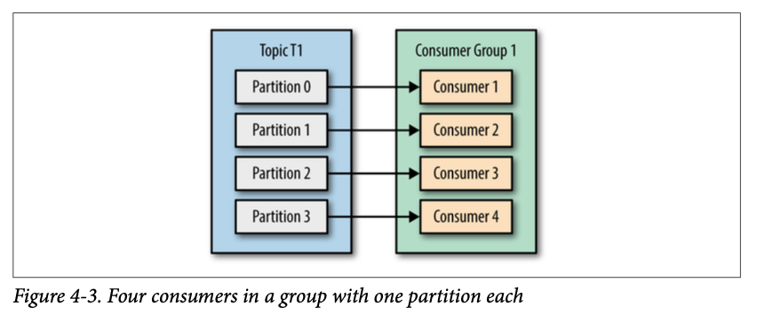

If we add more consumers to a single group with a single topic than we have partitions, some of the consumers will be idle and get no messages at all.

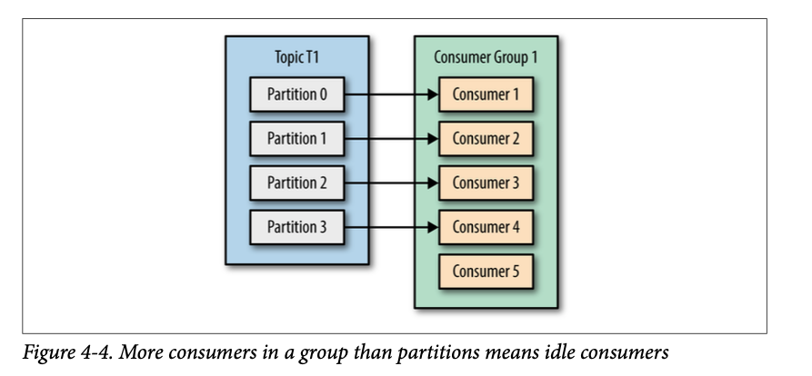

This is a good reason to create topics with a large number of partitions — it allows adding more consumers when the load increases. **Keep in mind that there is no point in adding more consumers than you have partitions in a topic — some of the consumers will just be idle.**

In addition to adding consumers in order to scale a single application, it is very common to have multiple applications that need to read data from the same topic. **To make sure an application gets all the messages in a topic, ensure the application has its own consumer group.**

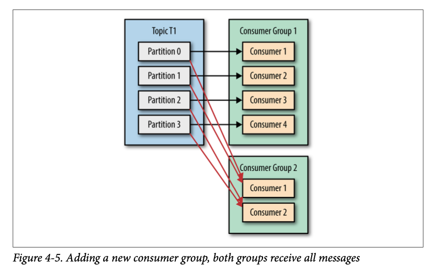

### Consumer Groups and Partition Rebalance

As we saw in the previous section, consumers in a consumer group share ownership of the partitions in the topics they subscribe to. When we add a new consumer to the group, it starts consuming messages from partitions previously consumed by another consumer. The same thing happens when a consumer shuts down or crashes; it leaves the group, and the partitions it used to consume will be consumed by one of the remaining consumers.

**Moving partition ownership from one consumer to another is called a rebalance.** In normal course of events they can be fairly undesirable.

There are two types of rebalances, depending on the partition assignment strategy that the consumer group uses:
* Eager Rebalances;
* Cooperative Rebalances.

**Eager Rebalances**

During an eager rebalance all consumers stop consuming, give up their ownership of all partitions, rejoin the consumer group and get a brand-new partition assignment. This is essentially a short window of unavailability of the entire consumer group. The length of the window depends on the size of the consumer group as well as on several configuration parameters.

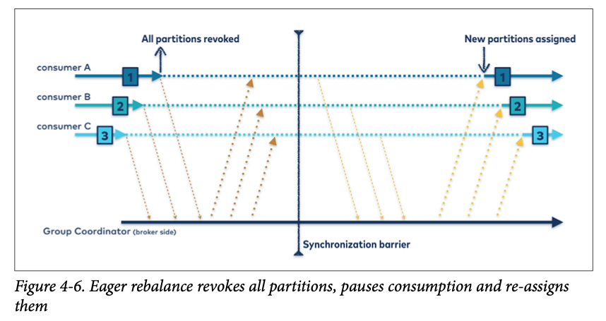

**Cooperative Rebalances**

Cooperative rebalances (also called “incremental rebalances”) typically involve reassigning only a small subset of the partitions from one consumer to another, and allowing consumers to continue processing records from all the partitions that are not reassigned. This is achieved by rebalancing in two or more phases - initially the consumer group leader informs all the consumers that they will lose ownership of a subset of their partitions, the consumers stop consuming from these partitions and give up their ownership in them. At the second phase, the consumer group leader assigns these now orphaned partitions to their new owners. This incremental approach may take a few iterations until a stable partition assignment is achieved, but it avoids the complete “stop the world” unavailability that occurs with the eager approach. This is especially important in large consumer groups where rebalances can take significant amount of time.

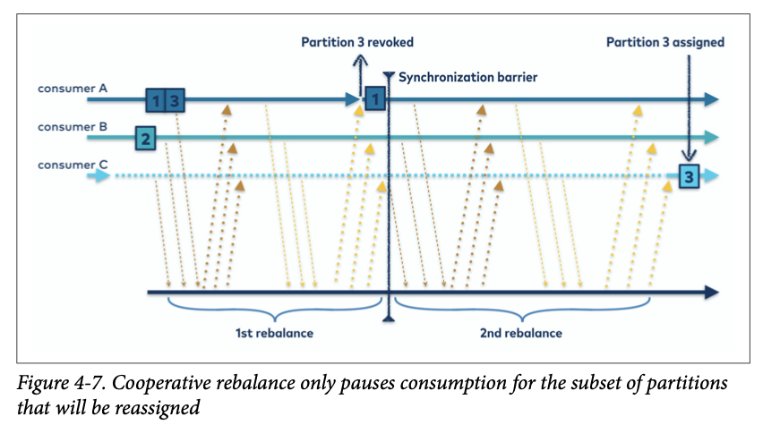

The way consumers maintain membership in a consumer group and ownership of the partitions assigned to them is by sending **heartbeats** to a Kafka broker designated as the group coordinator (this broker can be different for different consumer groups). The heartbeats are sent by a background thread of the consumer.

When closing a consumer cleanly, the consumer will notify the group coordinator that it is leaving, and the group coordinator will trigger a rebalance immediately, reducing the gap in processing. Differently from crashed consumer where coordinator has to wait for hearbeat timeout.

### Static Group Membership

By default, the identity of a consumer as a member of its consumer group is transient. When consumers leave a consumer group, the partitions that were assigned to the consumer are revoked, and when it re-joins, it is assigned a new member ID and new set of partitions through the rebalance protocol.

Unless you configure a consumer with a unique ``group.instance.id``, which makes the consumer a static member of the group. When a consumer first joins a consumer group as a static member of the group, it is assigned a set of partitions according to the partition assignment strategy the group is using, as normal. However, when this consumer shuts down, it does not automatically leave the group - it remains a member of the group until its session times out. When the consumer re- joins the group, it is recognized with its static identity and is re-assigned the same partitions it previously held.

**If two consumers join the same group with the same ``group.instance.id``, the second consumer will get an error saying that a consumer with this ID already exists.**

It is important to remember that the partitions owned by each consumer will not get reassigned when a consumer is restarted. For a certain duration, no consumer will consume messages from these partitions and when the consumer finally starts back up, it will lag behind the latest messages in these partitions. **You should be confident that the consumer that owns this partitions will be able to catch up with the lag after the restart.**

**It is important to note that static members of consumer groups do not leave the group proactively when they shut down, and detecting when they are “really gone” depends on ``session.timeout.ms configuration``**. You’ll want to set it high enough to avoid triggering rebalances on a simple application restart, but low enough to allow automatic re-assignment of their partitions when there is more significant downtime, in order to avoid large gaps in processing these partitions.

## Creating a Kafka Consumer

To start we just need to use the three mandatory properties: ``bootstrap.servers``, ``key.deserializer``, and ``value.deserializer``.

There is a fourth property, which is not strictly mandatory, but for now we will pretend it is. The property is ``group.id`` and it specifies the consumer group the ``KafkaConsumer`` instance belongs to. **While it is possible to create consumers that do not belong to any consumer group**, this is uncommon, so for most of the chapter we will assume the consumer is part of a group.

```java
Properties props = new Properties();
props.put("bootstrap.servers", "broker1:9092,broker2:9092");
props.put("group.id", "CountryCounter");
props.put("key.deserializer", "org.apache.kafka.common.serialization.StringDeserializer");
props.put("value.deserializer", "org.apache.kafka.common.serialization.StringDeserializer");
KafkaConsumer<String, String> consumer = new KafkaConsumer<String, String>(props);
```

## Subscribing to Topics

Once we create a consumer, the next step is to subscribe to one or more topics.

```java
consumer.subscribe(Collections.singletonList("customerCountries"));
```

**It is also possible to call ``subscribe`` with a regular expression.** The expression can match multiple topic names, and if someone creates a new topic with a name that matches, a rebalance will happen almost immediately and the consumers will start consuming from the new topic.

## The Poll Loop

At the heart of the consumer API is a simple loop for polling the server for more data. The main body of a consumer will look as follows:

```java
Duration timeout = Duration.ofMillis(100);
while (true) {
    ConsumerRecords<String, String> records = consumer.poll(timeout);
    for (ConsumerRecord<String, String> record : records) {
        System.out.printf("topic = %s, partition = %d, offset = %d, customer = %s, country = %s\n", 
            record.topic(), record.partition(), record.offset(), record.key(), record.value());
        Integer updatedCount = 1;
        if (custCountryMap.containsKey(record.value())) {
            updatedCount = custCountryMap.get(record.value()) + 1;
        }
        custCountryMap.put(record.value(), updatedCount);
        JSONObject json = new JSONObject(custCountryMap);
        System.out.println(json.toString());
    }
}
```

The ``poll`` loop does a lot more than just get data. The first time you call ``poll()`` with a new consumer, it is responsible for finding the ``GroupCoordinator``, joining the consumer group, and receiving a partition assignment. If a rebalance is triggered, it will be handled inside the ``poll`` loop as well, including related callbacks.

Keep in mind that if ``poll()`` is not invoked for longer than ``max.poll.interval.ms``, the consumer will be considered dead and evicted from the consumer group, so **avoid doing anything that can block for unpredictable intervals inside the poll loop.**

**Thread Safety**

You can’t have multiple consumers that belong to the same group in one thread and you can’t have multiple threads safely use the same consumer. **One consumer per thread is the rule.** To run multiple consumers in the same group in one application, you will need to run each in its own thread. It is useful to wrap the consumer logic in its own object and then use Java’s ``ExecutorService`` to start multiple threads each with its own consumer. The Confluent blog has a [tutorial](https://www.confluent.io/blog/tutorial-getting-started-with-the-new-apache-kafka-0-9-consumer-client/) that shows how to do just that.

Another approach can be to have one consumer populate a queue of events and have multiple worker threads perform work from this queue. You can see an example of this pattern in this [blog post](https://www.confluent.io/blog/kafka-consumer-multi-threaded-messaging/).

## Configuring Consumers

Most of the parameters have reasonable defaults and do not require modification, but some have implications on the performance and availability of the consumers. Let’s take a look at some of the more important properties.

### fetch.min.bytes

This property allows a consumer to specify the minimum amount of data that it wants to receive from the broker when fetching records, **by default one byte. If a broker receives a request for records from a consumer but the new records amount to fewer bytes than ``fetch.min.bytes``, the broker will wait until more messages are available before sending the records back to the consumer.** This reduces the load on both the consumer and the broker as they have to handle fewer back-and-forth messages in cases where the topics don’t have much new activity (or for lower activity hours of the day). You will want to set this parameter higher than the default if the consumer is using too much CPU when there isn’t much data available, or reduce load on the brokers when you have large number of consumers.

### fetch.max.wait.ms

By setting ``fetch.min.bytes``, you tell Kafka to wait until it has enough data to send before responding to the consumer. **``fetch.max.wait.ms`` lets you control how long to wait. By default, Kafka will wait up to 500 ms.** This results in up to 500 ms of extra latency in case there is not enough data flowing to the Kafka topic to satisfy the minimum amount of data to return. If you want to limit the potential latency (usually due to SLAs controlling the maximum latency of the application), you can set fetch.max.wait.ms to a lower value. **If you set ``fetch.max.wait.ms`` to 100 ms and ``fetch.min.bytes`` to 1 MB, Kafka will receive a fetch request from the consumer and will respond with data either when it has 1 MB of data to return or after 100 ms, whichever happens first.**

### fetch.max.bytes

This property lets you specify the maximum bytes that Kafka will return whenever the consumer polls a broker (50MB by default).

### max.poll.records

This property controls the maximum number of records that a single call to poll() will return.

### max.partition.fetch.bytes

This property controls the maximum number of bytes the server will return per partition (1 MB by default). When ``KafkaConsumer.poll()`` returns ``ConsumerRecords``, the record object will use at most ``max.partition.fetch.bytes`` per partition assigned to the consumer.

**We highly recommend using fetch.max.bytes instead, unless you have special reasons to try and process similar amounts of data from each partition.**

### session.timeout.ms and heartbeat.interval.ms

The amount of time a consumer can be out of contact with the brokers while still considered alive **defaults to 10 seconds.** If more than ``session.timeout.ms`` passes without the consumer sending a heartbeat to the group coordinator, it is considered dead and the group coordinator will trigger a rebalance of the consumer group to allocate partitions from the dead consumer to the other consumers in the group. This property is closely related to ``heartbeat.interval.ms``.

``heartbeat.interval.ms`` controls how frequently the KafkaConsumer will send a heartbeat to the group coordinator, whereas ``session.timeout.ms`` controls how long a consumer can go without sending a heartbeat. Therefore, those two properties are typically modified together — ``heartbeat.interval.ms`` must be lower than ``session.timeout.ms``, and **is usually set to one-third of the timeout value.** So if ``session.timeout.ms`` is 3 seconds, ``heartbeat.interval.ms`` should be 1 second.

### max.poll.interval.ms

**This property lets you set the length of time during which the consumer can go without polling before it is considered dead.** As mentioned earlier, heartbeats and session timeouts are the main mechanism by which Kafka detects dead consumers and takes their partitions away. However, we also mentioned that heartbeats are sent by a background thread. **There is a possibility that the main thread consuming from Kafka is deadlocked, but the background thread is still sending heartbeats.** This means that records from partitions owned by this consumer are not being processed. The easiest way to know whether the consumer is still processing records is to check whether it is asking for more records. However, the intervals between requests for more records are difficult to predict and depend on the amount of available data, the type of processing done by the consumer and sometimes on the latency of additional services. Therefore, the interval between calls to ``poll()`` are used as a failsafe or backstop. It has to be an interval large enough that will very rarely be reached by a healthy consumer, but low enough to avoid significant impact from a hanging consumer. **The default value is 5 minutes.**

### default.api.timeout.ms

This is the timeout that will apply to (almost) all API calls made by the consumer **when you don’t specify an explicit timeout while calling the API.** The default is 1 minute.

### request.timeout.ms

This is the maximum amount of time the consumer will wait for a response from the broker. If the broker does not respond within this time, the client will assume the broker will not respond at all, **close the connection and attempt to reconnect. This configuration defaults to 30s and it is recommended not to lower it.**

### auto.offset.reset

This property controls the behavior of the consumer when it starts reading a partition for which it doesn’t have a committed offset or if the committed offset it has is invalid (usually because the consumer was down for so long that the record with that offset was already aged out of the broker). **The default is “latest”**.  The alternative is “earliest”.

### enable.auto.commit

This parameter controls whether the consumer will commit offsets automatically, and **defaults to true.** Set it to false if you prefer to control when offsets are committed.

### partition.assignment.strategy

A ``PartitionAssignor`` is a class that, given consumers and topics they subscribed to, decides which partitions will be assigned to which consumer.

By default, Kafka has the following assignment strategies:
* **Range**. Assigns to each consumer a consecutive subset of partitions from each topic it subscribes to. So if consumers C1 and C2 are subscribed to two topics, T1 and T2, and each of the topics has three partitions, then C1 will be assigned partitions 0 and 1 from topics T1 and T2, while C2 will be assigned partition 2 from those topics. Because each topic has an uneven number of partitions and the assignment is done for each topic independently, the first consumer ends up with more partitions than the second.
* **RoundRobin**. Takes all the partitions from all subscribed topics and assigns them to consumers sequentially, one by one. If C1 and C2 described previously used RoundRobin assignment, C1 would have partitions 0 and 2 from topic T1 and partition 1 from topic T2. C2 would have partition 1 from topic T1 and partitions 0 and 2 from topic T2. Or doing it in steps - firstly partition 0 of T1 is assigned to C1, then partition 1 of T1 assigned to C2, then P2T1 to C1, P0T2C2, P1T2C1, P2T2C2.
* **Sticky**. The sticky assignor has two goals, the first is to have an assignment that is as balanced as possible, and the second is that in case of a rebalance, it will leave as many assignments as possible in place, minimizing the overhead associated with moving partition assignments from one broker to another.
* **Cooperative Sticky**. **This assignment strategy is only feasible if the Kafka cluster that the consumer group is consuming from has inter-broker protocol version 2.4 or above**, which enables incremental cooperative rebalances and not just the older greedy stop-the-world rebalances. This assignment strategy is identical to that of the Sticky Assignor but supports cooperative rebalances in which consumers can continue consuming from the partitions that are not reassigned.

### client.id

This can be any string, and will be used by the brokers to identify messages sent from the client. It is used in logging and metrics, and for quotas.

### client.rack

By default consumers will fetch messages from the leader replica of each partition. However, when the cluster spans multiple datacenters or multiple cloud availability zones, there are advantages both in performance and in cost to fetching messages from a replica that is located in the same zone as the consumer. To enable fetching from closest replica, you need to set client.rack configuration and identify the zone in which the client is located. Then you can configure the brokers to replace the default replica.selector.class with org.apache.kafka.common.replica.RackA wareReplicaSelector.

### group.instance.id

This can be any string and is used to provide a consumer with static group membership.

### receive.buffer.bytes and send.buffer.bytes

These are the sizes of the TCP send and receive buffers used by the sockets when writing and reading data. If these are set to -1, the OS defaults will be used. **It can be a good idea to increase those when producers or consumers communicate with brokers in a different datacenter, because those network links typically have higher latency and lower bandwidth.**

### offsets.retention.minutes

**This is a broker configuration**, but it is important to be aware of it due to its impact on consumer behavior. As long as a consumer group has active members (i.e members that are actively maintaining membership in the group by sending heartbeats), the last offset committed by the group for each partition will be retained by Kafka, so it can be retrieved in case of reassignment or restart. **However, once a group becomes empty, Kafka will only retain its committed offsets to the duration set by this configuration - 7 days by default. Once the offsets are deleted, if the group becomes active again it will behave like a brand new consumer group - with no memory of anything it consumed in the past.**

## Commits and Offsets

We call the action of updating the current position in the partition a **commit.**

As long as all your consumers are up, running, and churning away, this will have no impact. However, if a consumer crashes or a new consumer joins the consumer group, this will trigger a rebalance. After a rebalance, each consumer may be assigned a new set of partitions than the one it processed before. In order to know where to pick up the work, the consumer will read the latest committed offset of each partition and continue from there.

If the committed offset is smaller than the offset of the last message the client processed, the messages between the last processed offset and the committed offset will be **processed twice.**

If the committed offset is larger than the offset of the last message the client actually processed, all messages between the last processed offset and the committed offset will be **missed** by the consumer group.

### Automatic Commit

The easiest way to commit offsets is to allow the consumer to do it for you. If you configure ``enable.auto.commit=true``, then every five seconds the consumer will commit the largest offset your client received from ``poll()``. **The five-second interval is the default and is controlled by setting ``auto.commit.interval.ms``.** Just like everything else in the consumer, the automatic commits are driven by the poll loop. Whenever you poll, the consumer checks if it is time to commit, and if it is, it will commit the offsets it returned in the last poll.

**Automatic commits are convenient, but they don’t give developers enough control to avoid duplicate messages.**

### Commit Current Offset

By setting ``enable.auto.commit=false``, offsets will only be committed when the application explicitly chooses to do so. The simplest and most reliable of the commit APIs is ``commitSync()``. This API will commit the latest offset returned by ``poll()`` and return once the offset is committed, throwing an exception if commit fails for some reason.

It is important to remember that ``commitSync()`` will commit the latest offset returned by ``poll()``, so make sure you call ``commitSync()`` after you are done processing all the records in the collection.

Here is how we would use ``commitSync`` to commit offsets after we finished processing the latest batch of messages:

```java
Duration timeout = Duration.ofMillis(100);
while (true) {
ConsumerRecords<String, String> records = consumer.poll(timeout);
    for (ConsumerRecord<String, String> record : records) {
        System.out.printf("topic = %s, partition = %d, offset = %d, customer = %s, country = %s\n",
            record.topic(), record.partition(), record.offset(), record.key(), record.value());
    } try {
        consumer.commitSync();
    } catch (CommitFailedException e) {
        log.error("commit failed", e)
    }
}
```

### Asynchronous Commit

One drawback of manual commit is that the application is blocked until the broker responds to the commit request. This will limit the throughput of the application. Throughput can be improved by committing less frequently, **but then we are increasing the number of potential duplicates that a rebalance will create.**

Another option is the asynchronous commit API. Instead of waiting for the broker to respond to a commit, **we just send the request and continue on**:

```java
Duration timeout = Duration.ofMillis(100);
while (true) {
    ConsumerRecords<String, String> records = consumer.poll(timeout);
    for (ConsumerRecord<String, String> record : records) {
        System.out.printf("topic = %s, partition = %s, offset = %d, customer = %s, country = %s\n",
            record.topic(), record.partition(), record.offset(), record.key(), record.value());
    }
    consumer.commitAsync();
}
```

**The drawback is that while commitSync() will retry the commit until it either succeeds or encounters a nonretriable failure, commitAsync() will not retry.**

The reason it does not retry is that by the time commitAsync() receives a response from the server, there may have been a later commit that was already successful.

It is common to use the callback to log commit errors or to count them in a metric, but if you want to use the callback for retries, **you need to be aware of the problem with commit order**:

```java
Duration timeout = Duration.ofMillis(100);

while (true) {
    ConsumerRecords<String, String> records = consumer.poll(timeout);
    for (ConsumerRecord<String, String> record : records) {
        System.out.printf("topic = %s, partition = %s, offset = %d, customer = %s, country = %s\n",
        record.topic(), record.partition(), record.offset(), record.key(), record.value());
    }
    consumer.commitAsync(new OffsetCommitCallback() {
        public void onComplete(Map<TopicPartition, OffsetAndMetadata> offsets, Exception e) {
            if (e != null)
                log.error("Commit failed for offsets {}", offsets, e);
        } 
    });
}
```

**Retrying Async Commits**

A simple pattern to get commit order right for asynchronous retries is to use a monotonically increasing sequence number. Increase the sequence number every time you commit and add the sequence number at the time of the commit to the commitAsync callback. When you’re getting ready to send a retry, check if the commit sequence number the callback got is equal to the instance variable; if it is, there was no newer commit and it is safe to retry. If the instance sequence number is higher, don’t retry because a newer commit was already sent.

### Combining Synchronous and Asynchronous Commits

Normally, occasional failures to commit without retrying are not a huge problem because if the problem is temporary, the following commit will be successful. **But if we know that this is the last commit before we close the consumer, or before a rebalance, we want to make extra sure that the commit succeeds.**

Therefore, a common pattern is to combine ``commitAsync()`` with ``commitSync()`` just before shutdown. Here is how it works (we will discuss how to commit just before rebalance when we get to the section about rebalance listeners):

```java
Duration timeout = Duration.ofMillis(100);
try {
    while (true) {
        ConsumerRecords<String, String> records = consumer.poll(timeout);
        for (ConsumerRecord<String, String> record : records) {
            System.out.printf("topic = %s, partition = %s, offset = %d, customer = %s, country = %s\n",
                record.topic(), record.partition(), record.offset(), record.key(), record.value());
        }
        consumer.commitAsync();
    }
} catch (Exception e) {
    log.error("Unexpected error", e);
} finally {
    try {
        consumer.commitSync();
    } finally {
        consumer.close();
    } 
}
```

While everything is fine, we use ``commitAsync``. It is faster, and if one commit fails, the next commit will serve as a retry. But if we are closing, there is no “next commit.” We call ``commitSync()``, because it will retry until it succeeds or suffers unrecoverable failure.

### Commit Specified Offset

Committing the latest offset only allows you to commit as often as you finish processing batches. But what if you want to commit more frequently than that? What if ``poll()`` returns a huge batch and you want to commit offsets in the middle of the batch to avoid having to process all those rows again if a rebalance occurs? You can’t just call ``commitSync()`` or ``commitAsync()`` — this will commit the last offset returned, which you didn’t get to process yet.

Fortunately, the consumer API allows you to call ``commitSync()`` and ``commitAsync()`` and pass a map of partitions and offsets that you wish to commit. If you are in the middle of processing a batch of records, and the last message you got from partition 3 in topic “customers” has offset 5000, you can call ``commitSync()`` to commit offset 5001 for partition 3 in topic “customers.” Since your consumer may be consuming more than a single partition, you will need to track offsets on all of them, which adds complexity to your code.

Here is what a commit of specific offsets looks like:

```java
private Map<TopicPartition, OffsetAndMetadata> currentOffsets = new HashMap<>();
private int count = 0;
...

Duration timeout = Duration.ofMillis(100);

while (true) {
    ConsumerRecords<String, String> records = consumer.poll(timeout);
    for (ConsumerRecord<String, String> record : records) {
        System.out.printf("topic = %s, partition = %s, offset = %d, customer = %s, country = %s\n",
        record.topic(), record.partition(), record.offset(), record.key(), record.value());
        //1
        currentOffsets.put(new TopicPartition(record.topic(), record.partition()), new OffsetAndMetadata(record.offset() + 1, "no metadata"));
        //2
        if (count % 1000 == 0) {
		//3    
        	consumer.commitAsync(currentOffsets, null);
	}
        count++; 
    }
}
```

1) After reading each record, we update the offsets map with the offset of the next message we expect to process. The committed offset should always be the offset of the next message that your application will read. This is where we’ll start reading next time we start.
2) Here, we decide to commit current offsets every 1,000 records. In your application, you can commit based on time or perhaps content of the records.
3) I chose to call ``commitAsync()``, but ``commitSync()`` is also completely valid here. Of course, when committing specific offsets you still need to perform all the error handling we’ve seen in previous sections.

## Rebalance Listeners

As we mentioned in the previous section about committing offsets, a consumer will want to do some cleanup work before exiting and also before partition rebalancing.

If you know your consumer is about to lose ownership of a partition, you will want to commit offsets of the last event you’ve processed. Perhaps you also need to close file handles, database connections, and such.

The consumer API allows you to run your own code when partitions are added or removed from the consumer. You do this by passing a ```ConsumerRebalanceListener``` when calling the ``subscribe()`` method we discussed previously. ``ConsumerRebalanceListener`` has two methods you can implement:
* ``public void onPartitionsAssigned(Collection<TopicPartition> partitions)``. Called after partitions have been reassigned to the consumer, but before the consumer starts consuming messages. This is where you prepare or load any state that you want to use with the partition, seek to the correct offsets if needed or similar.
* ``public void onPartitionsRevoked(Collection<TopicPartition> partitions)``. Called when the consumer has to give up partitions that it previously owned - either as a result of a rebalance or when the consumer is being closed. In the common case, when an eager rebalancing algorithm is used, this method is invoked before the rebalancing starts and after the consumer stopped consuming messages. If a cooperative rebalacing algorithm is used, this method is invoked at the end of the rebalance, **with just the subset of partitions that the consumer has to give up. This is where you want to commit offsets, so whoever gets this partition next will know where to start.**
* ``public void onPartitionsLost(Collection<TopicPartition> partitions)``. Only called when cooperative rebalancing algorithm is used, and only in exceptional cases where the partitions were assigned to other consumers without first being revoked by the rebalance algorithm (in normal cases, ``onPartitionsRevoked()`` will be called). This is where you clean-up any state or resources that are used with these partitions. Note that this has to be done carefully - the new owner of the partitions may have already saved its own state and you’ll need to avoid conflicts. **Note that if you don’t implement this method, ``onPartitionsRevoked()`` will be called instead.**

**If you use a cooperative rebalancing algorithm note that:**
* ``onPartitionsAssigned()`` will be invoked on every rebalance, as a way of notifying the consumer that a rebalance happened. However, if there are no new partitions assigned to the consumer, it will be called with an empty collection. 
* ``onPartitionsRevoked()`` will be invoked in normal rebalancing conditions, but only if the consumer gave up the ownership of partitions. It will not be called with an empty collection. 
* ``onPartitionsLost()`` will be invoked in exceptional rebalancing conditions and the partitions in the collection will already have new owners by the time the method is invoked.

**If you implemented all three methods, you are guaranteed that during a normal rebalance onPartitionsAssigned() will be called by the new owner of the partitions that are reassigned only after the previous owner completed onPartitionsRevoked() and gave up its ownership.**

This example will show how to use ``onPartitionsRevoked()`` to commit offsets before losing ownership of a partition.

```java
private Map<TopicPartition, OffsetAndMetadata> currentOffsets = new HashMap<>();
Duration timeout = Duration.ofMillis(100);

private class HandleRebalance implements ConsumerRebalanceListener {

	//In this example we don’t need to do anything when we get a new partition; we’ll just start consuming messages.
	public void onPartitionsAssigned(Collection<TopicPartition> partitions) {
	}

	//However, when we are about to lose a partition due to rebalancing, we need to commit offsets. 
	//Note that we are committing the latest offsets we’ve processed, not the latest offsets in the batch we are still processing. 
	//This is because a partition could get revoked while we are still in the middle of a batch. 
	//We are committing offsets for all partitions, not just the partitions we are about to lose — because the offsets are for events that were already  processed, there is no harm in that.
	//And we are using commitSync() to make sure the offsets are committed before the rebalance proceeds.
	public void onPartitionsRevoked(Collection<TopicPartition> partitions) {
		System.out.println("Lost partitions in rebalance. " + "Committing current offsets:" + currentOffsets);
		consumer.commitSync(currentOffsets);
	}
}

try {
	//Pass the ConsumerRebalanceListener to the sub scribe() method so it will get invoked by the consumer.
	consumer.subscribe(topics, new HandleRebalance());

	while (true) {
		ConsumerRecords<String, String> records = consumer.poll(timeout);
		for (ConsumerRecord<String, String> record : records) {
			System.out.printf("topic = %s, partition = %s, offset = %d, customer = %s, country = %s\n", record.topic(), record.partition(), record.offset(), record.key(), record.value());
			currentOffsets.put(new TopicPartition(record.topic(), record.partition()), new OffsetAndMetadata(record.offset() + 1, null));
		}
		consumer.commitAsync(currentOffsets, null);
	}
} catch(WakeupException e) {
	// ignore, we're closing
} catch(Exception e) {
	log.error("Unexpected error", e);
} finally {
	try {
		consumer.commitSync(currentOffsets);
	} finally {
		consumer.close();
		System.out.println("Closed consumer and we are done");
	}
}
```

## Consuming Records with Specific Offsets

If you want to start reading all messages from the beginning of the partition, or you want to skip all the way to the end of the partition and start consuming only new messages, there are APIs specifically for that: ``seekToBeginning(Collection<Topic Partition> tp)`` and ``seekToEnd(Collection<TopicPartition> tp)``.

Think about this common scenario: Your application is reading events from Kafka (perhaps a clickstream of users in a website), processes the data (perhaps remove records that indicate clicks from automated programs rather than users), and then stores the results in a database, NoSQL store, or Hadoop. Suppose that we really don’t want to lose any data, nor do we want to store the same results in the database twice.

In these cases, the consumer loop may look a bit like this:

```java
Duration timeout = Duration.ofMillis(100);
while (true) {
    ConsumerRecords<String, String> records = consumer.poll(timeout);
    for (ConsumerRecord<String, String> record : records) {
        currentOffsets.put(new TopicPartition(record.topic(), record.partition()), record.offset());
        processRecord(record);
        storeRecordInDB(record);
        consumer.commitAsync(currentOffsets);
} 
```

In this example, we are very paranoid, so we commit offsets after processing each record. **However, there is still a chance that our application will crash after the record was stored in the database but before we committed offsets, causing the record to be processed again and the database to contain duplicates.**

This could be avoided if there was a way to store both the record and the offset in one atomic action. Either both the record and the offset are committed, or neither of them are committed.

But what if we wrote both the record and the offset to the database, in one transaction? Then we’ll know that either we are done with the record and the offset is committed or we are not and the record will be reprocessed.

Now the only problem is if the offset is stored in a database and not in Kafka, how will our consumer know where to start reading when it is assigned a partition? This is exactly what seek() can be used for. When the consumer starts or when new partitions are assigned, it can look up the offset in the database and seek() to that location.

Here is a skeleton example of how this may work. We use ``ConsumerRebalanceLister`` and ``seek()`` to make sure we start processing at the offsets stored in the database:

```java
Duration timeout = Duration.ofMillis(100);
public class SaveOffsetsOnRebalance implements ConsumerRebalanceListener {
    public void onPartitionsRevoked(Collection<TopicPartition> partitions) {
        commitDBTransaction(); //1
    }
    public void onPartitionsAssigned(Collection<TopicPartition> partitions) {
        for(TopicPartition partition: partitions)
            consumer.seek(partition, getOffsetFromDB(partition)); //2
    } 
}
consumer.subscribe(topics, new SaveOffsetOnRebalance(consumer));
while (true) {
    ConsumerRecords<String, String> records = consumer.poll(timeout);
    for (ConsumerRecord<String, String> record : records) {
        processRecord(record);
        storeRecordInDB(record);
        storeOffsetInDB(record.topic(), record.partition(), record.offset()); //3
    }
    commitDBTransaction();
}
```

1) We use an imaginary method here to commit the transaction in the database. The idea here is that the database records and offsets will be inserted to the database as we process the records, and we just need to commit the transactions when we are about to lose the partition to make sure this information is persisted.
2) We also have an imaginary method to fetch the offsets from the database, and then we ``seek()`` to those records when we get ownership of new partitions. Since this method will always get called on any partitions that we own, before we start fetching from it, placing ``seek()`` in this method guarantees that we’ll start reading from the correct location.
3) Another imaginary method: this time we update a table storing the offsets in our database. Here we assume that updating records is fast, so we do an update on every record, but commits are slow, so we only commit at the end of the batch. However, this can be optimized in different ways.

**There are many different ways to implement exactly-once semantics by storing offsets and data in an external store, but all of them will need to use the ConsumerRebalance Listener and seek() to make sure offsets are stored in time and that the consumer starts reading messages from the correct location.**

## But How Do We Exit?

When you decide to exit the poll loop, you will need another thread to call ``consumer.wakeup()``. If you are running the consumer loop in the main thread, this can be done from ``ShutdownHook``. **Note that ``consumer.wakeup()`` is the only consumer method that is safe to call from a different thread.** Calling wakeup will cause ``poll()`` to exit with ``WakeupException``, or if ``consumer.wakeup()`` was called while the thread was not waiting on poll, the exception will be thrown on the next iteration when ``poll()`` is called. The ``WakeupException`` doesn’t need to be handled, but before exiting the thread, you must call ``consumer.close()``. Closing the consumer will commit offsets if needed and will send the group coordinator a message that the consumer is leaving the group. The consumer coordinator will trigger rebalancing immediately and you won’t need to wait for the session to time out before partitions from the consumer you are closing will be assigned to another consumer in the group.

Here is what the exit code will look like if the consumer is running in the main application thread.

```java
Runtime.getRuntime().addShutdownHook(new Thread() {
    public void run() {
        System.out.println("Starting exit...");
        consumer.wakeup();
        try {
            mainThread.join();
        } catch (InterruptedException e) {
            e.printStackTrace();
        }
} });

...
Duration timeout = Duration.ofMillis(100);
try {
    // looping until ctrl-c, the shutdown hook will cleanup on exit
    while (true) {
        ConsumerRecords<String, String> records = movingAvg.consumer.poll(timeout);
        System.out.println(System.currentTimeMillis() + "--  waiting for data...");
        for (ConsumerRecord<String, String> record : records) {
            System.out.printf("offset = %d, key = %s, value = %s\n", record.offset(), record.key(), record.value());
        }
        for (TopicPartition tp: consumer.assignment()) {
            System.out.println("Committing offset at position:" + consumer.position(tp));
        }
        movingAvg.consumer.commitSync();
    }
} catch (WakeupException e) {
    // ignore for shutdown
} finally {
    consumer.close();
    System.out.println("Closed consumer and we are done");
}
```

## Deserializers

We will now look at how to create custom deserializers for your own objects and how to use Avro and its deserializers.

It should be obvious that the serializer used to produce events to Kafka must match the deserializer that will be used when consuming events.

### Custom deserializers

```java
 public class Customer {
    private int customerID;
    private String customerName;
    
    public Customer(int ID, String name) {
        this.customerID = ID;
        this.customerName = name;
    }

    public int getID() {
	return customerID;
    }
    
    public String getName() {
 	return customerName;
    }
}
```

The custom deserializer will look as follows:

```java
import org.apache.kafka.common.errors.SerializationException;
import java.nio.ByteBuffer;
import java.util.Map;

public class CustomerDeserializer implements Deserializer<Customer> {
    
    @Override
    public void configure(Map configs, boolean isKey) {
        // nothing to configure
    }
    
    @Override
    public Customer deserialize(String topic, byte[] data) {
        int id;
        int nameSize;
        String name;
        try {
            if (data == null) return null;
            if (data.length < 16) {
                throw new SerializationException("Size of data received by deserializer is shorter than expected");
	    }
            ByteBuffer buffer = ByteBuffer.wrap(data);
            id = buffer.getInt();
            nameSize = buffer.getInt();
            byte[] nameBytes = new byte[nameSize];
            buffer.get(nameBytes);
            name = new String(nameBytes, "UTF-8");
            return new Customer(id, name);
        } catch (Exception e) {
            throw new SerializationException("Error when deserializing byte[] to Customer " + e);
        }
    }
    
    @Override
    public void close() {
        // nothing to close
    } 
}
```

The consumer code that uses this serializer will look similar to this example:

```java
Duration timeout = Duration.ofMillis(100);
Properties props = new Properties();
props.put("bootstrap.servers", "broker1:9092,broker2:9092");
props.put("group.id", "CountryCounter");
props.put("key.deserializer", "org.apache.kafka.common.serialization.StringDeserializer");
props.put("value.deserializer", CustomerDeserializer.class.getName());

KafkaConsumer<String, Customer> consumer = new KafkaConsumer<>(props);
consumer.subscribe(Collections.singletonList("customerCountries"));

while (true) {
    ConsumerRecords<String, Customer> records = consumer.poll(timeout);
    for (ConsumerRecord<String, Customer> record : records) {
        System.out.println("current customer Id: " + record.value().getID() + " and current customer name: " +  record.value().getName());
    }
    consumer.commitSync();
}
```

**Again, it is important to note that implementing a custom serializer and deserializer is not recommended.** It tightly couples producers and consumers and is fragile and error-prone. A better solution would be to use a standard message format such as JSON, Thrift, Protobuf, or Avro.

### Using Avro deserialization with Kafka consumer

Let’s assume we are using the implementation of the Customer class in Avro that was shown in Chapter 3. In order to consume those objects from Kafka, you want to implement a consuming application similar to this:

```java
Duration timeout = Duration.ofMillis(100);
Properties props = new Properties();
props.put("bootstrap.servers", "broker1:9092,broker2:9092");
props.put("group.id", "CountryCounter");
props.put("key.deserializer", "org.apache.kafka.common.serialization.StringDeserializer");
props.put("value.deserializer", "io.confluent.kafka.serializers.KafkaAvroDeserializer");
props.put("specific.avro.reader","true");
props.put("schema.registry.url", schemaUrl);
String topic = "customerContacts"
KafkaConsumer<String, Customer> consumer = new KafkaConsumer<>(props);
consumer.subscribe(Collections.singletonList(topic));

System.out.println("Reading topic:" + topic);
while (true) {
    ConsumerRecords<String, Customer> records = consumer.poll(timeout);
    for (ConsumerRecord<String, Customer> record: records) {
        System.out.println("Current customer name is: " + record.value().getName());
    }
    consumer.commitSync();
}
```

## Standalone Consumer: Why and How to Use a Consumer Without a Group

So far, we have discussed consumer groups, which are where partitions are assigned automatically to consumers and are rebalanced automatically when consumers are added or removed from the group. Typically, this behavior is just what you want, but in some cases you want something much simpler. Sometimes you know you have a single consumer that always needs to read data from all the partitions in a topic, or from a specific partition in a topic. In this case, there is no reason for groups or rebalances.

When you know exactly which partitions the consumer should read, you don’t subscribe to a topic—instead, you assign yourself a few partitions. **A consumer can either subscribe to topics (and be part of a consumer group), or assign itself partitions, but not both at the same time.**

Here is an example of how a consumer can assign itself all partitions of a specific topic and consume from them:

```java
Duration timeout = Duration.ofMillis(100);
List<PartitionInfo> partitionInfos = null;
//We start by asking the cluster for the partitions available in the topic. If you only plan on consuming a specific partition, you can skip this part.
partitionInfos = consumer.partitionsFor("topic");


if (partitionInfos != null) {
    for (PartitionInfo partition : partitionInfos)
        partitions.add(new TopicPartition(partition.topic(), partition.partition()));
    //Once we know which partitions we want, we call assign() with the list.
    consumer.assign(partitions);
    while (true) {
        ConsumerRecords<String, String> records = consumer.poll(timeout);
        for (ConsumerRecord<String, String> record: records) {
            System.out.printf("topic = %s, partition = %s, offset = %d, customer = %s, country = %s\n",
                record.topic(), record.partition(), record.offset(), record.key(), record.value());
        }
        consumer.commitSync();
    }
}
```

Other than the lack of rebalances and the need to manually find the partitions, everything else is business as usual. **Keep in mind that if someone adds new partitions to the topic, the consumer will not be notified. You will need to handle this by checking ``consumer.partitionsFor()`` periodically** or simply by bouncing the application whenever partitions are added.

# Chapter 5. Managing Apache Kafka Programmatically

## AdminClient Overview

### Asynchronous and Eventually Consistent API

**Perhaps the most important thing to understand about Kafka’s ``AdminClient`` is that it is asynchronous.** Each method returns immediately after delivering a request to the cluster Controller, and each method returns one or more ``Future`` objects.

Kafka’s ``AdminClient`` wraps the ``Future`` objects into ``Result`` objects, which provide methods to wait for the operation to complete and helper methods for common follow-up operations. For example, ``KafkaAdminClient.createTopics`` returns ``CreateTopicsResult`` object which lets you wait until all topics are created, lets you check each topic status individually and also lets you retrieve the configuration of a specific topic after it was created.

It is possible that every broker is aware of the new state, so, for example, **a ``listTopics`` request may end up handled by a broker that is not up to date and will not contain a topic that was very recently created**. This property is also called **eventual consistency** - eventually every broker will know about every topic, but we can’t guarantee exactly when this will happen.

### Options

Every method in ``AdminClient`` takes as an argument an ``Options`` object that is specific to that method. For example, ``listTopics`` method takes ``ListTopicsOptions`` object as an argument and ``describeCluster`` takes ``DescribeClusterOptions`` as an argument. Those objects contain different settings for how the request will be handled by the broker. **The one setting that all ``AdminClient`` methods have is ``timeoutMs`` - this controls how long the client will wait for a response from the cluster before throwing a ``TimeoutException``.**

### Flat Hierarchy

**All the admin operations that are supported by the Apache Kafka protocol are implemented in ``KafkaAdminClient`` directly.** There is no object hierarchy or namespaces. This is a bit controversial as the interface can be quite large and perhaps a bit overwhelming, but the main benefit is that if you want to know how to programmatically perform any admin operation on Kafka, you have exactly one JavaDoc to search and your IDE’s autocomplete will be quite handy.

### Additional Notes

**All the operations that modify the cluster state - create, delete and alter, are handled by the Controller. Operations that read the cluster state - list and describe, can be handled by any broker and are directed to the least loaded broker (based on what the client knows).** This shouldn’t impact you as a user of the API, but it can be good to know - in case you are seeing unexpected behavior, you notice that some operations succeed while others fail, or if you are trying to figure out why an operation is taking too long.

## AdminClient Lifecycle: Creating, Configuring and Closing

In order to use Kafka’s AdminClient, the first thing you have to do is construct an instance of the AdminClient class.

```java
Properties props = new Properties();
props.put(AdminClientConfig.BOOTSTRAP_SERVERS_CONFIG, "localhost:9092");
AdminClient admin = AdminClient.create(props);
// TODO: Do something useful with AdminClient
admin.close(Duration.ofSeconds(30));
```

The only mandatory configuration is the URI for your cluster - a comma separated list of brokers to connect to.

If you start an ``AdminClient``, eventually you want to close it. **It is important to remember that when you call close, there could still be some ``AdminClient`` operations in progress.** Therefore close method accepts a timeout parameter. Once you call ``close``, you can’t call any other methods and send any more requests, but the client will wait for responses until the timeout expires. After the timeout expires, the client will abort all on-going operations with timeout exception and release all resources. **Calling ``close`` without a timeout implies that you’ll wait as long as it takes for all on-going operations to complete.**

### client.dns.lookup

By default, Kafka validates, resolves and creates connections based on the hostname provided in bootstrap server configuration (and later in the names returned by the brokers as specified in ``advertised.listeners`` configuration). This simple model works most of the time, but fails to cover two important use-cases - use of DNS aliases, especially in bootstrap configuration, and use of a single DNS that maps to multiple IP addresses. These sound similar, but are slightly different.

#### Use of DNS alias

Suppose you have multiple brokers, with the following naming convention: ``broker1.hostname.com``, ``broker2.hostname.com``, etc. Rather than specifying all of them in bootstrap servers configuration, which can easily become challenging to maintain, you may want to create a single DNS alias that will map to all of them. You’ll use ``all-brokers.hostname.com`` for bootstrapping, since you don’t actually care which broker gets the initial connection from clients. This is all very convenient, except if you use SASL to authenticate. If you use SASL, the client will try to authenticate ``all-brokers.hostname.com``, but the server principal will be ``broker2.host name.com``, if the names don’t match, SASL will refuse to authenticate (the broker certificate could be a man-in-the-middle attack), and the connection will fail.

**In this scenario, you’ll want to use ``client.dns.lookup=resolve_canonical_boot strap_servers_only``. With this configuration, the client will “expend” the DNS alias, and the result will be the same as if you included all the broker names the DNS alias connects to as brokers in the original bootstrap list.**

#### DNS name with multiple IP addresses

With modern network architectures, it is common to put all the brokers behind a proxy or a load balancer. This is especially common if you use Kubernetes, where load-balancers are necessary to allow connections from outside the Kubernetes cluster. In these cases, you don’t want the load balancers to become a single point of failure. It is therefore very common to make ``broker1.hostname.com`` point at a list of IPs, all of which resolve to load balancers, and all of them route traffic to the same broker. These IPs are also likely to change over time. By default, ``KafkaClient`` will just try to connect to the first IP that the hostname resolves. This means that if that IP becomes unavailable, the client will fail to connect, even though the broker is fully available. **It is therefore highly recommended to use ``client.dns.lookup=use_all_dns_ips`` to make sure the client doesn’t miss out on the benefits of a highly-available load balancing layer.**

### request.timeout.ms

This configuration limits the time that your application can spend waiting for AdminClient to respond. This includes the time spent on retrying if the client receives a retriable error.

**The default value is 120 seconds**, which is quite long - but some AdminClient operations, especially consumer group management commands, can take a while to respond. **Each AdminClient method accepts an ``Options`` object, which can contain a timeout value that applies specifically to that call.**

## Essential Topic Management

The most common use case for Kafka’s AdminClient is topic management. This includes listing topics, describing them, creating topics and deleting them.

Lets start by listing all topics in the cluster:

```java
ListTopicsResult topics = admin.listTopics();
topics.names().get().forEach(System.out::println);
```

Note that ``admin.listTopics()`` returns ``ListTopicsResult`` object which is a thin wrapper over a collection of ``Futures``. ``topics.name()`` returns a future set of name. When we call ``get()`` on this future, the executing thread will wait until the server responds with a set of topic names, or we get a timeout exception. Once we get the list, we iterate over it to print all the topic names.

Now lets try something a bit more ambitious: Check if a topic exists, and create it if it doesn’t. **One way to check if a specific topic exists is to get a list of all topics and check if the topic you need is in the list. But on a large cluster, this can be inefficient.**

In addition, sometimes you want to check for more than just whether the topic exists - you want to make sure the topic has the right number of partitions and replicas.

```java
DescribeTopicsResult demoTopic = admin.describeTopics(TOPIC_LIST);                          //1
try {
    topicDescription = demoTopic.values().get(TOPIC_NAME).get();                            //2
    System.out.println("Description of demo topic:" + topicDescription);
    if (topicDescription.partitions().size() != NUM_PARTITIONS) {                           //3
    	System.out.println("Topic has wrong number of partitions. Exiting.");
    	System.exit(-1);
    }
} catch (ExecutionException e) {                                                            //4
    // exit early for almost all exceptions
    if (! (e.getCause() instanceof UnknownTopicOrPartitionException)) {
        e.printStackTrace();
        throw e; 
    }
    // if we are here, topic doesn't exist
    System.out.println("Topic " + TOPIC_NAME + " does not exist. Going to create it now");
    // Note that number of partitions and replicas are optional. If there are
    // not specified, the defaults configured on the Kafka brokers will be used
    CreateTopicsResult newTopic = admin.createTopics(Collections.singletonList(new NewTopic(TOPIC_NAME, NUM_PARTITIONS, REP_FACTOR))); //5
    // Check that the topic was created correctly:
    if (newTopic.numPartitions(TOPIC_NAME).get() != NUM_PARTITIONS) {                      //6
        System.out.println("Topic has wrong number of partitions.");
        System.exit(-1);
    }
}
```

1) To check that the topic exists with the correct configuration, we call ``describeTopics()`` with a list of topic names that we want to validate. This returns ``DescribeTopicResult`` object, which wraps a map of topic names to future descriptions.
2) We’ve already seen that if we wait for the future to complete, using ``get()``, we can get the result we wanted, in this case a ``TopicDescription``. But there is also a possibility that the server can’t complete the request correctly - if the topic does not exist, the server can’t respond with its description. In this case the server will send back and error, and the future will complete by throwing an ``ExecutionException``. The actual error sent by the server will be the cause of the exception. Since we want to handle the case where the topic doesn’t exist, we handle these exceptions.
3) If the topic does exist, the future completes by returning a ``TopicDescription``, which contains a list of all the partitions of the topic and for each partition which broker is the leader, a list of replicas and a list of in-sync replicas. Note that this does not include the configuration of the topic.
4) Note that all ``AdminClient`` result objects throw ``ExecutionException`` when Kafka responds with an error. This is because ``AdminClient`` results are wrapped ``Future`` objects and those wrap exceptions. You always need to examine the cause of ``ExecutionException`` to get the error that Kafka returned.
5) If the topic does not exist, we create a new topic. When creating a topic, you can specify just the name and use default values for all the details. You can also specify the number of partitions, number of replicas and configuration.
6) Finally, you want to wait for topic creation to return, and perhaps validate the result. In this example, we are checking the number of partitions. Since we specified the number of partitions when we created the topic, we are fairly certain it is correct. Checking the result is more common if you relied on broker defaults when creating the topic. Note that since we are again calling ``get()`` to check the results of ``CreateTopic``, this method could throw an exception. ``TopicExistsException`` is common in this scenario and you’ll want to handle it (perhaps by describing the topic to check for correct configuration).

Now that we have a topic, lets delete it:

```java
admin.deleteTopics(TOPIC_LIST).all().get();
// Check that it is gone. Note that due to the async nature of deletes,
// it is possible that at this point the topic still exists
try {
    topicDescription = demoTopic.values().get(TOPIC_NAME).get();
    System.out.println("Topic " + TOPIC_NAME + " is still around");
} catch (ExecutionException e) {
    System.out.println("Topic " + TOPIC_NAME + " is gone");
}
```

At this point the code should be quite familiar. We call the method ``deleteTopics`` with a list of topic names to delete, and we use ``get()`` to wait for this to complete.

All the examples so far have used the blocking ``get()`` call on the future returned by the different ``AdminClient`` methods. **Most of the time, this is all you need - admin operations are rare and usually waiting until the operation succeeds or times out is acceptable.**

There is one exception - if you are writing a server that is expected to process large number of admin requests. In this case, you don’t want to block the server threads while waiting for Kafka to respond. You want to continue accepting requests from your users, sending them to Kafka and when Kafka responds, send the response to the client. In these scenarios, the versatility of ``KafkaFuture`` becomes quite useful. Here’s a simple example.

```java
vertx.createHttpServer().requestHandler(request -> {
    String topic = request.getParam("topic");
    String timeout = request.getParam("timeout");
    int timeoutMs = NumberUtils.toInt(timeout, 1000);
    DescribeTopicsResult demoTopic = admin.describeTopics(Collections.singletonList(topic), new DescribeTopicsOptions().timeoutMs(timeoutMs));
    //Instead of using the blocking get() call, we instead construct a function that will be called when the Future completes
    demoTopic.values().get(topic).whenComplete(new KafkaFuture.BiConsumer<TopicDescription, Throwable>() {
        @Override
        public void accept(final TopicDescription topicDescription, final Throwable throwable) {
            //If the future completes with an exception, we send the error to the HTTP client
        	if (throwable != null) {
              request.response().end("Error trying to describe topic " + topic + " due to " + throwable.getMessage());
            //If the future completes successfully, we respond to the client with the topic description.
        	} else {
                request.response().end(topicDescription.toString());
            } 
        }
    });
}).listen(8080);
```

## Configuration management

Configuration management is done by describing and updating collections of ``ConfigResource``. Config resources can be brokers, broker loggers and topics. **Checking and modifying broker and broker logging configuration is typically done via tools like ``kafka-config.sh`` or other Kafka management tools, but checking and updating topic configuration from the applications that use them is quite common.**

For example, many applications rely on compacted topics for their correct operation. It makes sense that periodically those applications will check that the topic is indeed compacted and take action to correct the topic configuration if this is not the case.

Here’s an example of how this is done:

```java
ConfigResource configResource = new ConfigResource(ConfigResource.Type.TOPIC, TOPIC_NAME);                          //1
DescribeConfigsResult configsResult = admin.describeConfigs(Collections.singleton(configResource));
Config configs = configsResult.all().get().get(configResource);
// print non-default configs
configs.entries().stream().filter(entry -> !entry.isDefault()).forEach(System.out::println);                        //2
// Check if topic is compacted
ConfigEntry compaction = new ConfigEntry(TopicConfig.CLEANUP_POLICY_CONFIG, TopicConfig.CLEANUP_POLICY_COMPACT);
if (! configs.entries().contains(compaction)) {
    // if topic is not compacted, compact it
    Collection<AlterConfigOp> configOp = new ArrayList<AlterConfigOp>();
    configOp.add(new AlterConfigOp(compaction, AlterConfigOp.OpType.SET));                                          //3
    Map<ConfigResource, Collection<AlterConfigOp>> alterConf = new HashMap<>();
    alterConf.put(configResource, configOp);
    admin.incrementalAlterConfigs(alterConf).all().get();
} else {
    System.out.println("Topic " + TOPIC_NAME + " is compacted topic");
}
```

1) As mentioned above, there are several types of ConfigResource, here we are checking the configuration for a specific topic. You can specify multiple different resources from different types in the same request.
2) The result of ``describeConfigs`` is a map from each ``ConfigResource`` to a collection of configurations. Each configuration entry has ``isDefault()`` method that lets us know which configs were modified. **A topic configuration is considered non-default if a user configured the topic to have a non-default value, or if a broker level configuration was modified and the topic that was created inherited this non-default value from the broker.**
3) There are four types of operations that modify configuration in Kafka: ``SET``, which sets the configuration value, ``DELETE`` which removes the value and resets to default, ``APPEND`` and ``SUBSTRACT`` - those apply only to configurations with List type and allows adding and removing values from the list without having to send the entire list to Kafka every time.

## Consumer group management

In this section, we’ll look at how you can use the AdminClient to programmatically explore and modify consumer groups and the offsets that were committed by those groups.

### Exploring Consumer Groups

If you want to explore and modify consumer groups, the first step would be to list them:

```java
admin.listConsumerGroups().valid().get().forEach(System.out::println);
```

Note that by using ``valid()`` method, the collection that ``get()`` will return will only contain the consumer groups that the cluster returned without errors, if any. Any errors will be completely ignored, rather than thrown as exceptions. 

The ``errors()`` method can be used to get all the exceptions. If you use ``all()`` as we did in other examples, only the first error the cluster returned will be thrown as an exception. **Likely causes of such errors are authorization, where you don’t have permission to view the group, or cases when the coordinator for some of the consumer groups is not available.**

If we want more information about some of the groups, we can describe them:

```java
ConsumerGroupDescription groupDescription = admin
            .describeConsumerGroups(CONSUMER_GRP_LIST)
            .describedGroups().get(CONSUMER_GROUP).get();

System.out.println("Description of group " + CONSUMER_GROUP + ":" + groupDescription);
```

The description contains a wealth of information about the group. This includes the group members, their identifiers and hosts, the partitions assigned to them, the algorithm used for the assignment and the host of the group coordinator.

One of the most important pieces of information about a consumer group is missing from this description - inevitably, we’ll want to know what was the last offset committed by the group for each partition that it is consuming, and how much it is lagging behind the latest messages in the log.

We’ll take a look at how Kafka’s ``AdminClient`` allows us to retrieve this information.

```java
Map<TopicPartition, OffsetAndMetadata> offsets = admin
        .listConsumerGroupOffsets(CONSUMER_GROUP)
        .partitionsToOffsetAndMetadata().get();
    
Map<TopicPartition, OffsetSpec> requestLatestOffsets = new HashMap<>();
for(TopicPartition tp: offsets.keySet()) {
    requestLatestOffsets.put(tp, OffsetSpec.latest());
}

Map<TopicPartition, ListOffsetsResult.ListOffsetsResultInfo> latestOffsets = admin.listOffsets(requestLatestOffsets).all().get();
for (Map.Entry<TopicPartition, OffsetAndMetadata> e: offsets.entrySet()) {
    String topic = e.getKey().topic();
    int partition =  e.getKey().partition();
    long committedOffset = e.getValue().offset();
    long latestOffset = latestOffsets.get(e.getKey()).offset();
    System.out.println("Consumer group " + CONSUMER_GROUP + " has committed offset " + committedOffset
    + " to topic " + topic + " partition " + partition + ". The latest offset in the partition is "
    +  latestOffset + " so consumer group is " + (latestOffset - committedOffset) + " records behind");
}
```

### Modifying consumer groups

Until now, we just explored available information. AdminClient also has methods for modifying consumer groups - deleting groups, removing members, deleting committed offsets and modifying offsets. **These are commonly used by SREs who use them to build ad-hoc tooling to recover from an emergency.**

From all those, modifying offsets is the most useful. Deleting offsets might seem like a simple way to get a consumer to “start from scratch”, but this really depends on the configuration of the consumer - if the consumer starts and no offsets are found, will it start from the beginning? Or jump to the latest message? **Unless we have the code for the consumer, we can’t know. Explicitly modifying the committed offsets to the earliest available offsets will force the consumer to start processing from the beginning of the topic, and essentially cause the consumer to “reset”.**

**This is very useful for stateless consumers, but keep in mind that if the consumer application maintains state (and most stream processing applications maintain state), resetting the offsets and causing the consumer group to start processing from the beginning of the topic can have strange impact on the stored state.**

**Also keep in mind that consumer groups don’t receive updates when offsets change in the offset topic. They only read offsets when a consumer is assigned a new partition or on startup.** To prevent you from making changes to offsets that the consumers will not know about (and will therefore override), Kafka will prevent you from modifying offsets while the consumer group is active.

With all these warnings in mind, lets look at an example:

```java
Map<TopicPartition, ListOffsetsResult.ListOffsetsResultInfo> earliestOffsets = admin.listOffsets(requestEarliestOffsets).all().get();
Map<TopicPartition, OffsetAndMetadata> resetOffsets = new HashMap<>();
for (Map.Entry<TopicPartition, ListOffsetsResult.ListOffsetsResultInfo> e: earliestOffsets.entrySet()) {
    resetOffsets.put(e.getKey(),new OffsetAndMetadata(e.getValue().offset()));                          //1
}
try {
	admin.alterConsumerGroupOffsets(CONSUMER_GROUP, resetOffsets).all().get();                          //2
} catch (ExecutionException e) {
	System.out.println("Failed to update the offsets committed by group " + CONSUMER_GROUP + " with error " + e.getMessage());
	if (e.getCause() instanceof UnknownMemberIdException) {
		System.out.println("Check if consumer group is still active.");                                 //3
    }
}
```

1) ``alterConsumerGroupOffsets`` takes as an argument a map with ``OffsetAndMeta`` data values. But ``listOffsets`` returns ``ListOffsetsResultInfo``, we need to massage the results of the first method a bit, so we can use them as an argument.
2) We are waiting on the future to complete so we can see if it completed successfully.
3) One of the most common reasons that ``alterConsumerGroupOffsets`` will fail is when we didn’t stop the consumer group first. If the group is still active, our attempt to modify the offsets will appear to the consumer coordinator as if a client that is not a member in the group is committing an offset for that group. In this case, we’ll get ``UnknownMemberIdException``.

## Cluster Metadata

**It is rare that an application has to explicitly discover anything at all about the cluster to which it connected.**

```java
DescribeClusterResult cluster = admin.describeCluster();

System.out.println("Connected to cluster " + cluster.clusterId().get());
System.out.println("The brokers in the cluster are:");
cluster.nodes().get().forEach(node -> System.out.println("    * " + node));
System.out.println("The controller is: " + cluster.controller().get());
```

## Advanced Admin Operations

**In this subsection, we’ll discuss few methods that are rarely used, and can be risky to use... but are incredibly useful when needed.**

### Adding partitions to a topic

Usually the number of partitions in a topic is set when a topic is created. And since each partition can have very high throughput, bumping against the capacity limits of a topic is rare. In addition, if messages in the topic have keys, then consumers can assume that all messages with the same key will always go to the same partition and will be processed in the same order by the same consumer.

**Adding partitions to a topic is rarely needed and can be risky - you’ll need to check that the operation will not break any application that consumes from the topic.**

You can add partitions to a collection of topics using createPartitions method. Note that if you try to expand multiple topics at once, it is possible that some of the topics will be successfully expanded while others will fail.

```java
Map<String, NewPartitions> newPartitions = new HashMap<>();
// When expanding topics, you need to specify the total number of partitions the topic will have after the partitions are added and not the number of new partitions.
newPartitions.put(TOPIC_NAME, NewPartitions.increaseTo(NUM_PARTITIONS+2));
admin.createPartitions(newPartitions).all().get();
```

### Deleting records from a topic

Current privacy laws mandate specific retention policies for data. Unfortunately, while Kafka has retention policies for topics, they were not implemented in a way that guarantees legal compliance. **A topic with retention policy of 30 days can have older data if all the data fits into a single segment in each partition.**

``deleteRecords`` method will delete all the records with offsets older than those specified when calling the method. Remember that ``listOffsets`` method can be used to get offsets for records that were written on or immediately after a specific time. Together, these methods can be used to delete records older than any specific point in time.

```java
Map<TopicPartition, ListOffsetsResult.ListOffsetsResultInfo> olderOffsets = admin.listOffsets(requestOlderOffsets).all().get();
Map<TopicPartition, RecordsToDelete> recordsToDelete = new HashMap<>();
for (Map.Entry<TopicPartition, ListOffsetsResult.ListOffsetsResultInfo> e : olderOffsets.entrySet()) {
	recordsToDelete.put(e.getKey(), RecordsToDelete.beforeOffset(e.getValue().offset()));
}
admin.deleteRecords(recordsToDelete).all().get();
```

### Leader Election

This method allows you to trigger two different types of leader election:

* **Preferred leader election**: Each partition has a replica that is designated as the “preferred leader”. It is preferred because if all partitions use their preferred leader replica as leader, the number of leaders on each broker should be balanced. By default, Kafka will check every 5 minutes if the preferred leader replica is indeed the leader, and if it isn’t but it is eligible to become the leader, it will elect the preferred leader replica as leader. If this option is turned off, or if you want this to happen faster, ``electLeader()`` method can trigger this process. 
* **Unclean leader election**: If the leader replica of a partition becomes unavailable, and the other replicas are not eligible to become leaders (usually because they are missing data), the partition will be without leader and therefore unavailable. One way to resolve this is to trigger “unclean” leader election - which means electing a replica that is otherwise ineligible to become a leader as the leader anyway. This will cause data loss - all the events that were written to the old leader and were not replicated to the new leader will be lost. ``electLeader()`` method can also be used to trigger unclean leader elections.

**The method is asynchronous, which means that even after it returns successfully, it takes a while until all brokers become aware of the new state and calls to ``describeTopics()`` can return inconsistent results.** If you trigger leader election for multiple partitions, it is possible that the operation will be successful for some partitions and will fail for others.

```java
Set<TopicPartition> electableTopics = new HashSet<>();
electableTopics.add(new TopicPartition(TOPIC_NAME, 0));
try {
    admin.electLeaders(ElectionType.PREFERRED, electableTopics).all().get();                        //1
} catch (ExecutionException e){
	if(e.getCause()instanceof ElectionNotNeededException){
		System.out.println("All leaders are preferred already");                                    //2
	}
}
```

1) We are electing the preferred leader on a single partition of a specific topic. We can specify any number of partitions and topics. If you call the command with null instead of a collection of partitions, it will trigger the election type you chose for all partitions.
2) If the cluster is in a healthy state, the command will do nothing - preferred leader election and unclean leader election only have effect when a replica other than the preferred leader is the current leader.

### Reassigning Replicas

``alterPartitionReassignments`` gives you fine-grain control over the placement of every single replica for a partition. **Keep in mind that when you reassign replicas from one broker to another, it may involve copying large amounts of data from one broker to another.** Be mindful of the available network bandwidth and throttle replication using quotas if needed: quotas are broker configuration, so you can describe them and update them with ``AdminClient``.

For this example, assume that we have a single broker with id 0. Our topic has several partitions, all with one replica on this broker. After adding a new broker, we want to use it to store some of the replicas of the topic. So we are going to assign each partition in the topic in a slightly different way:

```java
Map<TopicPartition, Optional<NewPartitionReassignment>> reassignment = new HashMap<>();
//1
reassignment.put(new TopicPartition(TOPIC_NAME, 0), Optional.of(new NewPartitionReassignment(Arrays.asList(0,1))));
//2
reassignment.put(new TopicPartition(TOPIC_NAME, 1), Optional.of(new NewPartitionReassignment(Arrays.asList(0))));
//3
reassignment.put(new TopicPartition(TOPIC_NAME, 2), Optional.of(new NewPartitionReassignment(Arrays.asList(1,0))));
//4
reassignment.put(new TopicPartition(TOPIC_NAME, 3), Optional.empty()); 
try {
	admin.alterPartitionReassignments(reassignment).all().get();
} catch (ExecutionException e) {
	if (e.getCause() instanceof NoReassignmentInProgressException) {
		System.out.println("Cancelling a reassignment that didn't exist.");
	} 
}
//5
System.out.println("currently reassigning: " + admin.listPartitionReassignments().reassignments().get());
demoTopic = admin.describeTopics(TOPIC_LIST);
topicDescription = demoTopic.values().get(TOPIC_NAME).get();
//6
System.out.println("Description of demo topic:" + topicDescription);
```

1) We’ve added another replica to partition 0, placed the new replica on the new broker, but left the leader on the existing broker
2) We didn’t add any replicas to partition 1, simply moved the one existing replica to the new broker. Since I have only one replica, it is also the leader.
3) We’ve added another replica to partition 2 and made it the preferred leader. The next preferred leader election will switch leadership to the new replica on the new broker. The existing replica will then become a follower.
4) There is no on-going reassignment for partition 3, but if there was, this would have cancelled it and returned the state to what it was before the reassignment operation started.
5) We can list the on-going reassignments
6) We can also try to print the new state, but remember that it can take a while until it shows consistent results

## Testing

Apache Kafka provides a test class ``MockAdminClient``, which you can initialize with any number of brokers and use to test that your applications behave correctly without having to run an actual Kafka cluster and really perform the admin operations on it. Some of the methods have very comprehensive mocking - you can create topics with ``MockAdminClient`` and a subsequent call to ``listTopics()`` will list the topics you “created”.

In order to demonstrate how to test using MockAdminClient, lets start by implement‐ ing a class that is instantiated with an admin client and uses it to create topics:

```java
import java.util.List;
import java.util.Map;

public class TopicCreator {

	private final AdminClient admin;

	public TopicCreator(AdminClient admin) {
		this.admin = admin;
	}

	// Example of a method that will create a topic if its name start with "test"
	public void maybeCreateTopic(String topicName) throws ExecutionException, InterruptedException {
		if (topicName.toLowerCase().startsWith("test")) {
			Collection<NewTopic> topics = List.of(new NewTopic(topicName, 1, (short) 1));
			admin.createTopics(topics);
			// alter configs just to demonstrate a point
			ConfigResource configResource = new ConfigResource(ConfigResource.Type.TOPIC, topicName);
			ConfigEntry compaction = new ConfigEntry(TopicConfig.CLEANUP_POLICY_CONFIG, TopicConfig.CLEANUP_POLICY_COMPACT);
			Collection<AlterConfigOp> configOp = List.of(new AlterConfigOp(compaction, AlterConfigOp.OpType.SET));
			Map<ConfigResource, Collection<AlterConfigOp>> alterConf = Map.of(configResource, configOp);
			admin.incrementalAlterConfigs(alterConf).all().get();
		}
	}
}
```

We’ll start testing by instantiating our mock client:

```java
@Before
public void setUp() {
    Node broker = new Node(0,"localhost",9092);
    this.admin = spy(new MockAdminClient(Collections.singletonList(broker), broker));
    // without this, the tests will throw
    // `java.lang.UnsupportedOperationException: Not implemented yet`
    AlterConfigsResult emptyResult = mock(AlterConfigsResult.class);
    doReturn(KafkaFuture.completedFuture(null)).when(emptyResult).all();
    doReturn(emptyResult).when(admin).incrementalAlterConfigs(any());
}
```

Now that we have a properly fake AdminClient, we can use it to test whether maybe ``maybeCreateTopic()`` method works properly:

```java
@Test
public void testCreateTestTopic() throws ExecutionException, InterruptedException {
    TopicCreator tc = new TopicCreator(admin);
    tc.maybeCreateTopic("test.is.a.test.topic");
    verify(admin, times(1)).createTopics(any());
}

@Test
public void testNotTopic() throws ExecutionException, InterruptedException {
    TopicCreator tc = new TopicCreator(admin);
    tc.maybeCreateTopic("not.a.test");
    verify(admin, never()).createTopics(any());
}
```

# Chapter 6. Kafka Internals

## Cluster Membership

Every broker has a unique identifier that is either set in the broker configuration file or automatically generated.

If you try to start another broker with the same ID, you will get an error.

Even though the node representing the broker is gone when the broker is stopped, the broker ID still exists in other data structures. This way, if you completely lose a broker and start a brand new broker with the ID of the old one, it will immediately join the cluster in place of the missing broker with the same partitions and topics assigned to it.

## The Controller

**The controller is one of the Kafka brokers that, in addition to the usual broker functionality, is responsible for electing partition leaders. The first broker that starts in the cluster becomes the controller.**

When other brokers start, they also try to become controller, but receive a “node already exists” exception, which causes them to “realize” that it already exists.

When the controller broker is stopped or loses connectivity to Zookeeper, other brokers in the cluster will be notified through the Zookeeper watch that the controller is gone and will attempt to create the controller node in Zookeeper themselves.

The first node to create the new controller in Zookeeper is the new controller, while the other nodes will receive a “node already exists” exception and re-create the watch on the new controller node.

Each time a controller is elected, it receives a new, higher controller epoch number through a Zookeeper conditional increment operation. The brokers know the current controller epoch and if they receive a message from a controller with an older number, they know to ignore it.

When the controller first comes up, it has to read the latest replica state map from Zookeeper, before it can start managing the cluster metadata and performing leader elections.

When the controller notices that a broker left the cluster (by watching the relevant Zookeeper path or because it received a ``ControlledShutdownRequest`` from the broker), it knows that all the partitions that had a leader on that broker will need a new leader. It goes over all the partitions that need a new leader and determines who the new leader should be (simply the next replica in the replica list of that partition). Then it persists the new state to Zookeeper (again, using pipelined async requests to reduce latency) and then sends a LeaderAndISR request to all the brokers that contain replicas for those partitions. The request contains information on the new leader and followers for the partitions.

## KRaft - Kafka’s new Raft based controller

In the new architecture, the controller nodes are a Raft quorum which manages the log of metadata events. This log contains information about each change to the cluster metadata. Everything that is currently stored in ZooKeeper, such as topics, partitions, ISRs, configurations, and so on, will be stored in this log.

Using the Raft algorithm, the controller nodes will elect a leader from amongst themselves, without relying on any external system. The leader of the metadata log is called the active controller. The active controller handles all RPCs made from the brokers. The follower controllers replicate the data which is written to the active controller, and serve as hot standbys if the active controller should fail. Because the controllers will now all track the latest state, controller failover will not require a lengthy reloading period where we transfer all the state to the new controller.

## Replication

Replication is at the heart of Kafka’s architecture.

As we’ve already discussed, **data in Kafka is organized by topics. Each topic is partitioned, and each partition can have multiple replicas.**

There are two types of replicas:
* **Leader replica**. Each partition has a single replica designated as the leader. All produce requests go through the leader, in order to guarantee consistency. Clients can consume from either the lead replica or its followers.
* **Follower replica**. All replicas for a partition that are not leaders are called followers. Followers don’t serve client requests; their only job is to replicate messages from the leader and stay up-to-date with the most recent messages the leader has. In the event that a leader replica for a partition crashes, one of the follower replicas will be promoted to become the new leader for the partition.

**Another task the leader is responsible for is knowing which of the follower replicas is up-to-date with the leader.** Followers attempt to stay up-to-date by replicating all the messages from the leader as the messages arrive, but they can fail to stay in sync.

A replica will request message 1, then message 2, and then message 3, and it will not request message 4 before it gets all the previous messages. This means that the leader can know that a replica got all messages up to message 3 when the replica requests message 4. By looking at the last offset requested by each replica, the leader can tell how far behind each replica is.

**If a replica fails to keep up with the leader, it can no longer become the new leader in the event of failure —after all, it does not contain all the messages.**

The amount of time a follower can be inactive or behind before it is considered out of sync is controlled by the ``replica.lag.time.max.ms`` configuration parameter.

In addition to the current leader, each partition has a **preferred leader** — the replica that was the leader when the topic was originally created. 

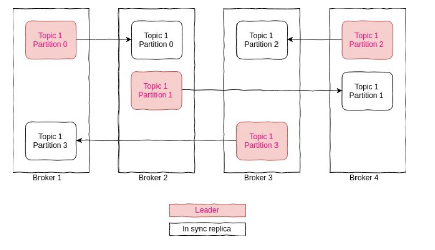

As seen in the diagram above, all leaders replicas are distributed across brokers and replicas for the same exist on another broker. In Kafka, all read and write happens through a leader. So it’s important that leaders are spread evenly across brokers.

So far we understood that during the topic creation time leader election algorithm of Kafka will take care of distributing the partition leader evenly. Now since affinity is assigned for a leader partition during creation time, but over the period of time because of certain events like broker shutdown or crashes or brokers are not able to register heartbeat, leadership gets changed and one of the followers replicas will become the leader. For example in the above diagram if broker 4 is dead then broker 3 will become the leader for partition 2 of the topic. In that case leadership is skewed. As we can see distribution of leaders is not even.

The best way to identify the current preferred leader is by looking at the list of replicas for a partition. The first replica in the list is always the preferred leader.

## Request Processing

Most of what a Kafka broker does is process requests sent to the partition leaders from clients, partition replicas, and the controller.

All requests have a standard header that includes: 
* Request type (also called API key) 
* Request version (so the brokers can handle clients of different versions and respond accordingly) 
* Correlation ID: a number that uniquely identifies the request and also appears in the response and in the error logs (the ID is used for troubleshooting) 
* Client ID: used to identify the application that sent the request

For each port the broker listens on, the broker runs an **acceptor** thread that creates a connection and hands it over to a **processor** thread for handling. The number of processor threads (also called **network threads**) is configurable. **The network threads are responsible for taking requests from client connections, placing them in a request queue, and picking up responses from a response queue and sending them back to clients.**

Once requests are placed on the request queue, IO threads (also called request handler threads) are responsible for picking them up and processing them. The most common types of client requests are:
* **Produce requests**. Sent by producers and contain messages the clients write to Kafka brokers. 
* **Fetch requests**. Sent by consumers and follower replicas when they read messages from Kafka brokers. 
* **Admin requests**. Sent by Admin clients when performing metadata operations such as creating and deleting topics.

How do the clients know where to send the requests? Kafka clients use another request type called a metadata request, which includes a list of topics the client is interested in. The server response specifies which partitions exist in the topics, the replicas for each partition, and which replica is the leader. **Metadata requests can be sent to any broker because all brokers have a metadata cache that contains this information.**

Clients typically cache this information and use it to direct produce and fetch requests to the correct broker for each partition. They also need to occasionally refresh this information (refresh intervals are controlled by the ``meta data.max.age.ms`` configuration parameter). In addition, if a client receives the “Not a Leader” error to one of its requests, it will refresh its metadata before trying to send the request again.

### Produce Requests

When the broker that contains the lead replica for a partition receives a produce request for this partition, it will start by running a few validations: 
* Does the user sending the data have write privileges on the topic? 
* Is the number of acks specified in the request valid (only 0, 1, and “all” are allowed)? 
* If acks is set to all, are there enough in-sync replicas for safely writing the message? (Brokers can be configured to refuse new messages if the number of in-sync replicas falls below a configurable number

Then it will write the new messages to local disk. On Linux, the messages are written to the filesystem cache and there is no guarantee about when they will be written to disk. **Kafka does not wait for the data to get persisted to disk — it relies on replication for message durability.**

Once the message is written to the leader of the partition, the broker examines the acks configuration—if acks is set to 0 or 1, the broker will respond immediately; if acks is set to all, the request will be stored in a buffer called **purgatory** until the leader observes that the follower replicas replicated the message.

### Fetch Requests

Brokers process fetch requests in a way that is very similar to the way produce requests are handled. The client sends a request, asking the broker to send messages from a list of topics, partitions, and offsets—something like “Please send me messages starting at offset 53 in partition 0 of topic Test and messages starting at offset 64 in partition 3 of topic Test.” Clients also specify a limit to how much data the broker can return for each partition. The limit is important because clients need to allocate memory that will hold the response sent back from the broker. **Without this limit, brokers could send back replies large enough to cause clients to run out of memory.**

If the offset exists, the broker will read messages from the partition, up to the limit set by the client in the request, and send the messages to the client. Kafka famously uses a zero-copy method to send the messages to the clients—this means that Kafka sends messages from the file (or more likely, the Linux filesystem cache) directly to the network channel without any intermediate buffers.

Consumers can attempt to create a cached session which stores the list of partitions they are consuming from and its metadata. Once a session is created, consumers no longer need to specify all the partitions in each request and can use incremental fetch requests instead. Brokers will only include metadata in the response if there were any changes. The session cache has limited space, and Kafka prioritizes follower replicas and consumers with large set of partitions, so in some cases a session will not be created or will be evicted. In both these cases the broker will return an appropriate error to the client, and the consumer will transparently resort to full fetch requests with include all the partition metadata.

### Other Requests

We just discussed the most common types of requests used by Kafka clients: **Metadata**, **Produce**, and **Fetch**. The Kafka protocol currently handles 61 different request types, and more will be added. Consumers alone use 15 request types to form groups, coordinate consumption and to allow developers to manage the consumer groups.

The protocol is ever-evolving — as we add more client capabilities, we need to grow the protocol to match. For example, in the past, Kafka Consumers used Apache Zookeeper to keep track of the offsets they receive from Kafka. So when a consumer is started, it can check Zookeeper for the last offset that was read from its partitions and know where to start processing. For various reasons, we decided to stop using Zookeeper for this, and instead store those offsets in a special Kafka topic.

## Physical Storage

**The basic storage unit of Kafka is a partition replica. Partitions cannot be split between multiple brokers and not even between multiple disks on the same broker. So the size of a partition is limited by the space available on a single mount point.**

When configuring Kafka, the administrator defines a list of directories in which the partitions will be stored — this is the ``log.dirs`` parameter.

### Tiered Storage

The motivation is fairly straight forward - Kafka is currently used to store large amounts of data, either due to high throughput or long retention periods. This introduces the following concerns: 
* You are limited in how much data you can store in a partition. As a result, maximum retention and partition counts aren’t driven by product requirements, but also by the limits on physical disk sizes.
* Decision on disk and cluster size is driven by storage requirements. Clusters often end up larger than they would if latency and throughput were the main considerations, which drives up costs. 
* The time it takes to move partitions from one broker to another, for example when expanding or shrinking the cluster, is driven by the size of the partitions. Large partitions make the cluster less elastic. These days architectures are designed toward maximum elasticity, taking advantage of flexible cloud deployment options.

In the tiered storage approach, Kafka cluster is configured with two tiers of storage - local and remote. The local tier is the same as the current Kafka that uses the local disks on the Kafka brokers to store the log segments. The new remote tier uses systems, such as HDFS or S3 to store the completed log segments. Two separate retention periods are defined corresponding to each of the tiers. With remote tier enabled, the retention period for the local tier can be significantly reduced from days to few hours. The retention period for remote tier can be much longer, days, or even months.

### Partition Allocation

When you create a topic, Kafka first decides how to allocate the partitions between brokers. Suppose you have 6 brokers and you decide to create a topic with 10 partitions and a replication factor of 3. Kafka now has 30 partition replicas to allocate to 6 brokers. When doing the allocations, the goals are: 
* To spread replicas evenly among brokers—in our example, to make sure we allocate 5 replicas per broker. 
* To make sure that for each partition, each replica is on a different broker. If partition 0 has the leader on broker 2, we can place the followers on brokers 3 and 4, but not on 2 and not both on 3. 
* If the brokers have rack information (available in Kafka release 0.10.0 and higher), then assign the replicas for each partition to different racks if possible. This ensures that an event that causes downtime for an entire rack does not cause complete unavailability for partitions.

When rack awareness is taken into account, instead of picking brokers in numerical order, we prepare a rack-alternating broker list. Suppose that we know that brokers 0, 1, and 2 are on the same rack, and brokers 3, 4, and 5 are on a separate rack. Instead of picking brokers in the order of 0 to 5, we order them as 0, 3, 1, 4, 2, 5 — each broker is followed by a broker from a different rack. In this case, if the leader for partition 0 is on broker 4, the first replica will be on broker 2, which is on a completely different rack. This is great, because if the first rack goes offline, we know that we still have a surviving replica and therefore the partition is still available. This will be true for all our replicas, so we have guaranteed availability in the case of rack failure.

### File Management

Retention is an important concept in Kafka — Kafka does not keep data forever, nor does it wait for all consumers to read a message before deleting it.

Because finding the messages that need purging in a large file and then deleting a portion of the file is both time-consuming and error-prone, **we instead split each partition into segments. By default, each segment contains either 1 GB of data or a week of data, whichever is smaller.** As a Kafka broker is writing to a partition, if the segment limit is reached, we close the file and start a new one.

**The segment we are currently writing to is called an active segment. The active segment is never deleted, so if you set log retention to only store a day of data but each segment contains five days of data, you will really keep data for five days because we can’t delete the data before the segment is closed.**

### File Format

Each segment is stored in a single data file. Inside the file, we store Kafka messages and their offsets. The format of the data on the disk is identical to the format of the messages that we send from the producer to the broker and later from the broker to the consumers.

Kafka producers always send messages in batches.

Message batch headers include:
* a magic number indicating the current version of the message format
* The offset of the first message in the batch and difference from the offset of the last message - those are preserved even if the batch is later compacted and some messages are removed. The offset of the first message is set to 0 when the producer creates and sends the batch. The broker that first persists this batch (the partition leader) replaces this with the real offset. 
* The timestamps of the first message and the highest timestamp in the batch in the batch. The timestamps can be set by the broker if the timestamp type is set to append time rather than create time. 
* Size of the batch, in bytes 
* The epoch of the leader who received the batch (this is used when truncating messages after leader election) 
* Checksum for validating that the batch is not corrupted 
* 16 bits indicating different attributes - compression type, timestamp type (timestamp can be set at the client or at the broker), whether the batch is part of a transaction or whether it is a control batch. 
* Producer ID, producer epoch and the first sequence in the batch - these are all used for exactly-once guarantees 
* And of course the set of messages that are part of the batch

The records themselves also have system headers. Each record includes: 
* Size of the record in bytes 
* Attributes - currently there are no record level attributes, so this isn’t used 
* The difference between the offset of the current record and the first offset in the batch 
* The difference in milliseconds between the timestamp of this record and the first timestamp in the batch 
* And the user payload - key, value and headers

**Note that there is very little overhead to each record and most of the system information is at the batch level.**

If you wish to see all this for yourself, Kafka brokers ship with the DumpLogSegment tool, which allows you to look at a partition segment in the filesystem and examine its contents. You can run the tool using: 
```shell
bin/kafka-run-class.sh kafka.tools.DumpLogSegments
```

### Indexes
