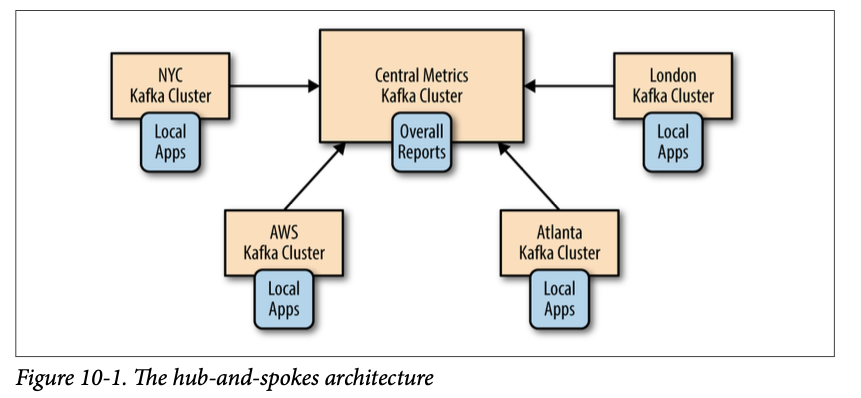
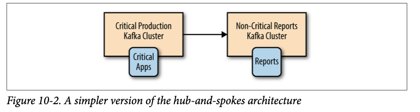
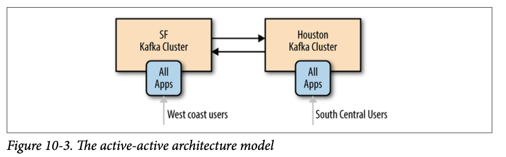
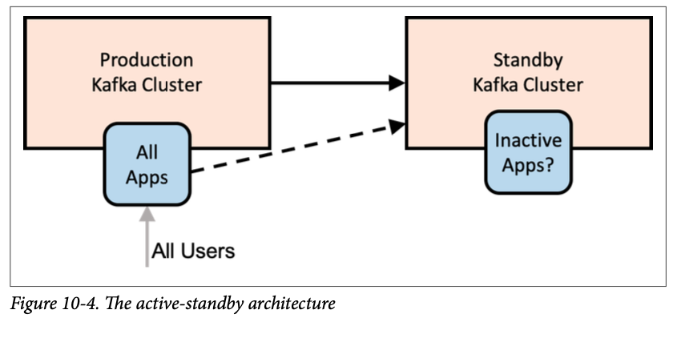
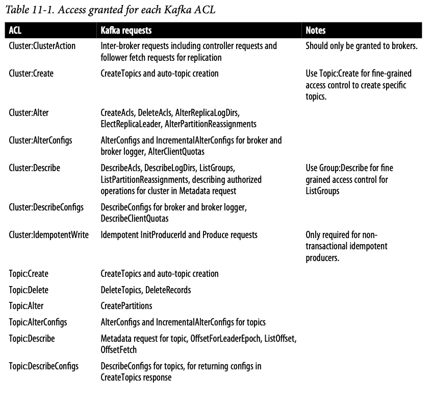
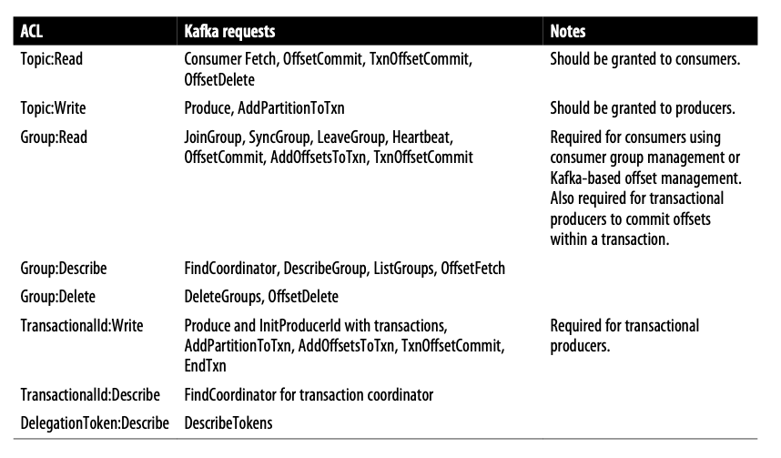

# Chapter 1. Meet Kafka

## Publish/Subscribe Messaging

Publish/subscribe messaging is a pattern that is characterized by the sender (publisher) of a piece of data (message) not specifically directing it to a receiver.

### How It Starts

Many use cases for publish/subscribe start out the same way: with a simple message queue or interprocess communication channel. For example, you create an application that needs to send monitoring information somewhere, so you write in a direct connection from your application to an app that displays your metrics on a dashboard, and push metrics over that connection.


This is a simple solution to a simple problem that works when you are getting started with monitoring. Before long, you decide you would like to analyze your metrics over a longer term, and that doesn’t work well in the dashboard. You start a new service that can receive metrics, store them, and analyze them. In order to support this, you modify your application to write metrics to both systems. By now you have three more applications that are generating metrics, and they all make the same connections to these two services.


The technical debt built up here is obvious, so you decide to pay some of it back. You set up a single application that receives metrics from all the applications out there, and provide a server to query those metrics for any system that needs them.


### Individual Queue Systems

At the same time that you have been waging this war with metrics, one of your coworkers has been doing similar work with log messages. Another has been working on tracking user behavior on the frontend website and providing that information to developers who are working on machine learning, as well as creating some reports for management. You have all followed a similar path.


There is a lot of duplication. Your company is maintaining multiple systems for queuing data, all of which have their own individual bugs and limitations.

## Enter Kafka

Apache Kafka is a publish/subscribe messaging system designed to solve this problem. It is often described as a “distributed commit log” or more recently as a “distributing streaming platform.”

### Messages and Batches

The unit of data within Kafka is called a **message**. If you are approaching Kafka from a database background, you can think of this as similar to a row or a record. **A message is simply an array of bytes as far as Kafka is concerned, so the data contained within it does not have a specific format or meaning to Kafka.**

A message can have an optional piece of metadata, which is referred to as a **key**. The key is also a byte array and, as with the message, has no specific meaning to Kafka. Keys are used when messages are to be written to partitions in a more controlled manner. **The simplest such scheme is to generate a consistent hash of the key, and then select the partition number for that message by taking the result of the hash modulo the total number of partitions in the topic.** This assures that messages with the same key are always written to the same partition.

For efficiency, messages are written into Kafka in batches. **A batch is just a collection of messages, all of which are being produced to the same topic and partition.** An individual roundtrip across the network for each message would result in excessive overhead, and collecting messages together into a batch reduces this.

**Batches are also typically compressed, providing more efficient data transfer and storage at the cost of some processing power.**

### Schemas

Talks about Avro.

### Topics and Partitions

Messages in Kafka are categorized into **topics**. **The closest analogies for a topic are a database table or a folder in a filesystem.** Topics are additionally broken down into a number of **partitions**. **Going back to the “commit log” description, a partition is a single log.** Messages are written to it in an append only fashion, and are read in order from beginning to end.

**Note that as a topic typically has multiple partitions, there is no guarantee of message time-ordering across the entire topic, just within a single partition.**

Partitions are also the way that Kafka provides redundancy and scalability. Each partition can be hosted on a different server, which means that a single topic can be scaled horizontally across multiple servers to provide performance far beyond the ability of a single server. Additionally, partitions can be replicated, such that different servers will store a copy of the same partition in case one server fails.

### Producers and Consumers

The consumer subscribes to one or more topics and reads the messages in the order in which they were produced. The consumer keeps track of which messages it has already consumed by keeping track of the offset of messages. **The offset — an integer value that continually increases — is another piece of metadata that Kafka adds to each message as it is produced.**

Consumers work as part of a consumer group, which is one or more consumers that work together to consume a topic. The group assures that each partition is only consumed by one member. In Figure 1-6, there are three consumers in a single group consuming a topic. Two of the consumers are working from one partition each, while the third consumer is working from two partitions. The mapping of a consumer to a partition is often called ownership of the partition by the consumer. In this way, consumers can horizontally scale to consume topics with a large number of messages. **Additionally, if a single consumer fails, the remaining members of the group will rebalance the partitions being consumed to take over for the missing member.**


### Brokers and Clusters

Kafka brokers are designed to operate as part of a cluster. Within a cluster of brokers, **one broker will also function as the cluster controller (elected automatically from the live members of the cluster).** The controller is responsible for administrative operations, including assigning partitions to brokers and monitoring for broker failures. A partition is owned by a single broker in the cluster, and that broker is called the leader of the partition. A partition may be assigned to multiple brokers, which will result in the partition being replicated.

A key feature of Apache Kafka is that of retention, which is the durable storage of messages for some period of time. Kafka brokers are configured with a default retention setting for topics, either retaining messages for some period of time (e.g., 7 days) or until the topic reaches a certain size in bytes (e.g., 1 GB). Once these limits are reached, messages are expired and deleted. In this way, the retention configuration defines a minimum amount of data available at any time. Individual topics can also be configured with their own retention settings so that messages are stored for only as long as they are useful.

### Multiple Clusters

As Kafka deployments grow, it is often advantageous to have multiple clusters. There are several reasons why this can be useful: 
* Segregation of types of data 
* Isolation for security requirements 
* Multiple datacenters (disaster recovery)

The Kafka project includes a tool called MirrorMaker, used for replicating data to other clusters. At its core, MirrorMaker is simply a Kafka consumer and producer, linked together with a queue. Messages are consumed from one Kafka cluster and produced for another.

## Why Kafka?

Already covered in Kafka in Action.

### Multiple Producers

### Multiple Consumers

### Disk-Based Retention

Not only can Kafka handle multiple consumers, but durable message retention means that consumers do not always need to work in real time. Messages are committed to disk, and will be stored with configurable retention rules.

### Scalable

### High Performance

## The Data Ecosystem

### Use Cases

#### Activity tracking

#### Messaging

#### Metrics and logging

#### Commit log

Since Kafka is based on the concept of a commit log, database changes can be published to Kafka and applications can easily monitor this stream to receive live updates as they happen. This changelog stream can also be used for replicating database updates to a remote system, or for consolidating changes from multiple applications into a single database view.

#### Stream processing

## Kafka’s Origin

### LinkedIn’s Problem

### The Birth of Kafka

### Open Source

### Commercial Engagement

### The Name

## Getting Started with Kafka

# Chapter 2. Installing Kafka

## Setup of Zookeper and Kafka.Broker Configuration

There are numerous configuration options for Kafka that control all aspects of setup and tuning. **The majority of the options can be left to the default settings though, as they deal with tuning aspects of the Kafka broker that will not be applicable until you have a specific use case that requires adjusting these settings.**

### General Broker

There are several broker configuration parameters that should be reviewed when deploying Kafka for any environment other than a standalone broker on a single server. **These parameters deal with the basic configuration of the broker, and most of them must be changed to run properly in a cluster with other brokers.**

#### broker.id

Every Kafka broker must have an integer identifier, which is set using the ``broker.id`` configuration. By default, this integer is set to 0, but it can be any value. It is essential that the integer must be unique for each broker within a single Kafka cluster.

It is highly recommended to set this value to something intrinsic to the host so that when performing maintenance it is not onerous to map broker ID numbers to hosts. For example, if your hostnames contain a unique number (such as host1.example.com, host2.example.com, etc.), then 1 and 2 would be good choices for the broker.id values respectively.

#### listeners

Older versions of Kafka used a simple ``port`` configuration. This can be still be used as a backup for simple configurations but is a **deprecated config**. The example configuration file starts Kafka with a listener on TCP port 9092.

The new ``listeners`` config is a comma separated list of URIs that we listen on with the listener names.

A listener is defined as ``<protocol>:<hostname>:<port>``. An example of legal listener config: ``PLAINTEXT://localhost:9092,SSL://:9091``. Specifying the hostname as ``0.0.0.0`` will bind to all interfaces. Leaving the hostname empty will bind it to the default interface.

**Don't start Kafka with ports lower than 1024.**

#### zookeeper.connect

The location of the Zookeeper used for storing the broker metadata is set using the ``zookeeper.connect`` configuration parameter. The example configuration uses a Zookeeper running on port 2181 on the local host, which is specified as ``localhost:2181``.

The format for this parameter is a semicolon-separated list of ``hostname:port/path`` strings. 

*Self-Note*. ``path`` part is not interesting at this moment.

#### log.dirs

Kafka persists all messages to disk, and these log segments are stored in the directory specified in the ``log.dir`` configuration. For multiple directories, the config ``log.dirs`` is preferrable.

If this value is not set, it will default back to ``log.dir``. ``log.dirs`` is a comma-separated list of paths on the local system.

#### num.recovery.threads.per.data.dir

Kafka uses a configurable pool of threads for handling log segments. Currently, this thread pool is used: 
* When starting normally, to open each partition’s log segments 
* When starting after a failure, to check and truncate each partition’s log segments 
* When shutting down, to cleanly close log segments

As these threads are only used during startup and shutdown, it is reasonable to set a larger number of threads in order to parallelize operations. Specifically, when recovering from an unclean shutdown, this can mean the difference of several hours when restarting a broker with a large number of partitions!

#### auto.create.topics.enable

The default Kafka configuration specifies that the broker should automatically create a topic under the following circumstances: 
* When a producer starts writing messages to the topic 
* When a consumer starts reading messages from the topic 
* When any client requests metadata for the topic

**Set to false.**

#### auto.leader.rebalance.enable

In order to ensure a Kafka cluster doesn’t become unbalanced by having all topic leadership on one broker, this config can be specified to ensure leadership is balances as much as possible. It enables a background thread that checks the distribution of partitions at regular intervals (this interval in configurable via ``leader.imbal ance.check.interval.seconds``). If leadership imbalance exceeds another config ``leader.imbalance.per.broker.percentage`` then a rebalance of preferred leaders for partitions is started.

#### delete.topic.enable

Disabling topic deletion can be set by setting this flag to false.

### Topic Defaults

**The defaults in the server configuration should be set to baseline values that are appropriate for the majority of the topics in the cluster.**

#### num.partitions

The ``num.partitions`` parameter determines how many partitions a new topic is created with, primarily when automatic topic creation is enabled (which is the default setting). **This parameter defaults to one partition. Keep in mind that the number of partitions for a topic can only be increased, never decreased.**

Many users will have the partition count for a topic be equal to, or a multiple of, the number of brokers in the cluster.

##### How to Choose the Number of Partitions

There are several factors to consider when choosing the number of partitions: 
* What is the throughput you expect to achieve for the topic? For example, do you expect to write 100 KB per second or 1 GB per second? 
* What is the maximum throughput you expect to achieve when consuming from a single partition? A partition will always be consumed completely by a single consumer (as even when not using consumer groups, the consumer must read all messages in the partition). If you know that your slower consumer writes the data to a database and this database never handles more than 50 MB per second from each thread writing to it, then you know you are limited to 50 MB/sec throughput when consuming from a partition. 
* You can go through the same exercise to estimate the maximum throughput per producer for a single partition, but since producers are typically much faster than consumers, it is usually safe to skip this. 
* **If you are sending messages to partitions based on keys, adding partitions later can be very challenging, so calculate throughput based on your expected future usage, not the current usage.** 
* Consider the number of partitions you will place on each broker and available diskspace and network bandwidth per broker. 
* **Avoid overestimating, as each partition uses memory and other resources on the broker and will increase the time for metadata updates and leadership transfers.** 
* Will you be mirroring data? You may need to consider the throughput of your mirroring configuration as well. Large partitions can become a bottleneck in many mirroring configurations. 
* **If you are using cloud services, do you have IOPS limitiations on your VMs or disks?** There may be hard caps on the number of IOPS allowed depending on your cloud service and VM configuration that will cause you to hit quotas. Having too many partitions can have the side-effect of increasing the amount of IOPS due to the parallelism involved.

**If you have some estimate regarding the target throughput of the topic and the expected throughput of the consumers, you can divide the target throughput by the expected consumer throughput and derive the number of partitions this way.** So if I want to be able to write and read 1 GB/sec from a topic, and I know each consumer can only process 50 MB/s, then I know I need at least 20 partitions. This way, I can have 20 consumers reading from the topic and achieve 1 GB/sec.

Starting small and expanding as needed is easier than starting too large.

#### default.replication.factor

**If auto-topic creation is enabled, this configuration sets what the replication factor should be for new topics.**

It is highly recommended to set the replication factor to at least 1 above ``min.insync.replicas`` setting. For more fault resistant settings if you have large enough clusters and enough hardware, setting your replication factor to 2 above the ``min.insync.replicas`` (abbrevated as RF++) can be preferrable. RF++ will allow easier maintenance and prevent outages. **The reasoning behind this recommendation is to allow for one planned outage within the replica set and one unplanned outage to occur simultaneously.** For a typical cluster, this would mean you’d have a minumum of 3 replicas of every partition.

#### log.retention.ms

The most common configuration for how long Kafka will retain messages is by time. The default is specified in the configuration file using the ``log.retention.hours`` parameter, and it is set to 168 hours, or one week. However, there are two other parameters allowed, ``log.retention.minutes`` and ``log.retention.ms``. All three of these control the same goal (the amount of time after which messages may be deleted) but the **recommended parameter to use is ``log.retention.ms``, as the smaller unit size will take precedence if more than one is specified.** This will make sure that the value set for ``log.retention.ms`` is always the one used.

#### log.retention.bytes

Another way to expire messages is based on the total number of bytes of messages retained. This value is set using the ``log.retention.bytes`` parameter, and it is **applied per-partition**. This means that if you have a topic with 8 partitions, and ``log.retention.bytes`` is set to 1 GB, **the amount of data retained for the topic will be 8 GB at most.** Note that all retention is performed for individual partitions, not the topic. This means that **should the number of partitions for a topic be expanded, the retention will also increase if ``log.retention.bytes`` is used.** Setting the value to -1 will allow for infinite retention.

#### log.segment.bytes

The log-retention settings previously mentioned operate on log segments, not individual messages. As messages are produced to the Kafka broker, they are appended to the current log segment for the partition. Once the log segment has reached the size specified by the ``log.segment.bytes`` parameter, which **defaults to 1 GB**, the log segment is closed and a new one is opened. Once a log segment has been closed, it can be considered for expiration. **A smaller log-segment size means that files must be closed and allocated more often, which reduces the overall efficiency of disk writes.**

Adjusting the size of the log segments can be important if topics have a low produce rate. For example, **if a topic receives only 100 megabytes per day of messages, and ``log.segment.bytes`` is set to the default, it will take 10 days to fill one segment. As messages cannot be expired until the log segment is closed, if log.retention.ms is set to 604800000 (1 week), there will actually be up to 17 days of messages retained until the closed log segment expires.** This is because once the log segment is closed with the current 10 days of messages, that log segment must be retained for 7 days before it expires based on the time policy (as the segment cannot be removed until the last message in the segment can be expired).

#### log.segment.ms

Another way to control when log segments are closed is by using the ``log.segment.ms`` parameter, which specifies the amount of time after which a log segment should be closed. As with the ``log.retention.bytes`` and ``log.retention.ms`` parameters, ``log.segment.bytes`` and ``log.segment.ms`` are **not mutually exclusive properties**. Kafka will close a log segment either when the size limit is reached or when the time limit is reached, whichever comes first. **By default, there is no setting for ``log.seg ment.ms``, which results in only closing log segments by size.**

#### min.insync.replicas

When configuring your cluster for data durability, **setting ``min.insync.replicas`` to 2 ensures that at least two replicas are caught up and “in sync” to the producer. This is used in tandem with setting the producer config to ack “all” requests. This will ensure that at least two replicas (leader and one other) acknowledge a write in order for it to be successful.** This can prevent data loss in scenarios where the leader acks a write then suffers a failure and leadership is transferred to a replica that does not have a successful write.

#### message.max.bytes

The Kafka broker limits the maximum size of a message that can be produced, configured by the ``message.max.bytes`` parameter, which defaults to 1000000, or 1 MB. A producer that tries to send a message larger than this will receive an error back from the broker, and the message will not be accepted. As with all byte sizes specified on the broker, **this configuration deals with compressed message size, which means that producers can send messages that are much larger than this value uncompressed**, provided they compress to under the configured ``message.max.bytes`` size.

##### Coordinating Message Size Configurations

**The message size configured on the Kafka broker must be coordinated with the fetch.message.max.bytes configuration on consumer clients. If this value is smaller than message.max.bytes, then consumers that encounter larger messages will fail to fetch those messages, resulting in a situation where the consumer gets stuck and cannot proceed. The same rule applies to the replica.fetch.max.bytes configuration on the brokers when configured in a cluster.**

## Hardware Selection

To low level for now.

## Kafka in the Cloud

Not interested.

## Kafka Clusters

A single Kafka server works well for local development work, or for a proof-of- concept system, but there are significant benefits to having multiple brokers configured as a cluster. 

**The biggest benefit is the ability to scale the load across multiple servers. A close second is using replication to guard against data loss due to single system failures.**

### How Many Brokers?

The appropriate size for a Kafka cluster is determined by several factors. Typically the size of your cluster will be bound on the following key areas: 
* Disk Capacity 
* Replica Capacity per broker 
* CPU Capacity 
* Network Capacity

The first factor to consider is how much disk capacity is required for retaining messages and how much storage is available on a single broker. If the cluster is required to retain 10 TB of data and a single broker can store 2 TB, then the minimum cluster size is five brokers. In addition, using replication will increase the storage requirements by at least 100%, depending on the replication factor.

**Currently, in a well configured environment, it is recommended to not have more than 14,000 partitions per broker and 1 million replicas per cluster.**

## Broker Configuration

There are only two requirements in the broker configuration to allow multiple Kafka brokers to join a single cluster:
* The first is that all brokers must have the same configuration for the ``zookeeper.connect`` parameter. This specifies the Zookeeper ensemble and path where the cluster stores metadata.
* The second requirement is that all brokers in the cluster must have a unique value for the ``broker.id`` parameter. **If two brokers attempt to join the same cluster with the same ``broker.id``, the second broker will log an error and fail to start.**

## OS Tuning

Too low level for now.

## Production Concerns

### Garbage Collector Options

### Datacenter Layout

### Colocating Applications on Zookeeper

**Self-Note**.

Most of this information will soon be irrelevant due to migration off Zookeeper.

# Chapter 3. Kafka Producers: Writing Messages to Kafka

## Producer Overview

**The different requirements will influence the way you use the producer API to write messages to Kafka and the configuration you use.**

While the producer API is very simple, there is a bit more that goes on under the hood of the producer when we send data. Figure 3-1 shows the main steps involved in sending data to Kafka.


We start producing messages to Kafka by creating a ``ProducerRecord``, which must include the topic we want to send the record to and a value. Optionally, we can also specify a key and/or a partition. Once we send the ``ProducerRecord``, the first thing the producer will do is serialize the key and value objects to ByteArrays so they can be sent over the network.

Next, the data is sent to a partitioner. If we specified a partition in the ``ProducerRecord``, the partitioner doesn’t do anything and simply returns the partition we specified. If we didn’t, the partitioner will choose a partition for us, **usually based on the ``ProducerRecord`` key.** Once a partition is selected, the producer knows which topic and partition the record will go to. It then adds the record to a batch of records that will also be sent to the same topic and partition. **A separate thread is responsible for sending those batches of records to the appropriate Kafka brokers.**

When the broker receives the messages, it sends back a response. **If the messages were successfully written to Kafka, it will return a ``RecordMetadata`` object with the topic, partition, and the offset of the record within the partition. If the broker failed to write the messages, it will return an error.** When the producer receives an error, it may retry sending the message a few more times before giving up and returning an error.

## Constructing a Kafka Producer

A Kafka producer has three mandatory properties.

### bootstrap.servers

List of ``host:port`` pairs of brokers that the producer will use to establish initial connection to the Kafka cluster. This list doesn’t need to include all brokers, since the producer will get more information after the initial connection. **But it is recommended to include at least two.**

### key.serializer

Name of a class that will be used to serialize the keys of the records we will produce to Kafka. Kafka brokers expect byte arrays as keys and values of messages.

**``key.serializer`` should be set to a name of a class that implements the ``org.apache.kafka.common.serialization.Serializer`` interface.** The producer will use this class to serialize the key object to a byte array.

The Kafka client package includes ``ByteArraySerializer``, ``StringSerializer``, and ``IntegerSerializer``.

### value.serializer

Name of a class that will be used to serialize the values of the records we will produce to Kafka. The same way you set ``key.serializer``.

The following code snippet shows how to create a new producer by setting just the mandatory parameters and using defaults for everything else:

```java
Properties kafkaProps = new Properties();
kafkaProps.put("bootstrap.servers", "broker1:9092,broker2:9092");
kafkaProps.put("key.serializer", "org.apache.kafka.common.serialization.StringSerializer");
kafkaProps.put("value.serializer", "org.apache.kafka.common.serialization.StringSerializer");
var producer = new KafkaProducer<String, String>(kafkaProps);
```

Once we instantiate a producer, it is time to start sending messages. **There are three primary methods of sending messages**:
* **Fire-and-forget** - We send a message to the server and don’t really care if it arrives successfully or not. In case of non-retryable errors or timeout, messages will get lost and the application will not get any information or exceptions about this.
* **Synchronous send** - We send a message with ``send()`` method returns a ``Future`` object, and we use ``get()`` to wait on the future and see if the ``send()`` was successful or not.
* **Asynchronous send** - We call the ``send()`` method with a callback function, which gets triggered when it receives a response from the Kafka broker.

**While all the examples in this chapter are single threaded, a producer object can be used by multiple threads to send messages.**

## Sending a Message to Kafka

The simplest way to send a message is as follows:

```java
var record = new ProducerRecord<String, String>("CustomerCountry", "Precision Products", "France");
try {
    producer.send(record);
} catch (Exception e) {
    e.printStackTrace();
}
```

The producer accepts ``ProducerRecord`` objects, so we start by creating one. Here we use one that requires the name of the topic we are sending data to, which is always a string, and the key and value we are sending to Kafka, which in this case are also strings. **The types of the key and value must match our key serializer and value serializer objects.**

We use the producer object ``send()`` method to send the ``ProducerRecord``. **The message will be placed in a buffer and will be sent to the broker in a separate thread.** The ``send()`` method returns a Java ``Future`` object with ``RecordMetadata``, but since we simply ignore the returned value, we have no way of knowing whether the message was sent successfully or not.

While we ignore errors that may occur while sending messages to Kafka brokers or in the brokers themselves, we may still get an exception if the producer encountered errors before sending the message to Kafka. Those can be a ``SerializationException`` when it fails to serialize the message, a ``BufferExhaustedException`` or ``TimeoutException`` if the buffer is full, or an ``InterruptException`` if the sending thread was interrupted.

### Sending a Message Synchronously

Sending a message synchronously is simple but still allows the producer to catch exceptions when Kafka responds to the produce request with an error, or when send retries were exhausted. The main tradeoff involved is performance. **Depending on how busy the Kafka cluster is, brokers can take anywhere from 2ms to few seconds to respond to produce requests.** If you send messages synchronously, the sending thread will spend this time waiting and doing nothing else.

This leads to very poor performance and as a result, **synchronous sends are not used in production applications (but are very common in code examples).** The simplest way to send a message synchronously is as follows:

```java
ProducerRecord<String, String> record = new ProducerRecord<>("CustomerCountry", "Precision Products", "France");
try {
    producer.send(record).get();
} catch (Exception e) {
    e.printStackTrace();
}
```

``KafkaProducer`` has two types of errors:
* Retriable errors are those that can be resolved by sending the message again. For example, a connection error can be resolved because the connection may get reestablished. A “not leader for partition” error can be resolved when a new leader is elected for the partition and the client metadata is refreshed. **KafkaProducer can be configured to retry those errors automatically, so the application code will get retriable exceptions only when the number of retries was exhausted and the error was not resolved.**
* Non-retriable errors. Some errors will not be resolved by retrying. For example, “message size too large.” In those cases, ``KafkaProducer`` will not attempt a retry and will return the exception immediately.

### Sending a Message Asynchronously

Suppose the network roundtrip time between our application and the Kafka cluster is 10ms. If we wait for a reply after sending each message, sending 100 messages will take around 1 second. On the other hand, if we just send all our messages and not wait for any replies, then sending 100 messages will barely take any time at all.

In order to send messages asynchronously and still handle error scenarios, the producer supports adding a callback when sending a record. Here is an example of how we use a callback:

```java
private class DemoProducerCallback implements Callback {
    @Override
    public void onCompletion(RecordMetadata recordMetadata, Exception e) {
        if (e != null) {
            e.printStackTrace();
        }
} }

ProducerRecord<String, String> record = new ProducerRecord<>("CustomerCountry", "Biomedical Materials", "USA");
producer.send(record, new DemoProducerCallback());
```

To use callbacks, you need a class that implements the ``org.apache.kafka.clients.producer.Callback`` interface, which has a single function — ``onCompletion()``.

If Kafka returned an error, ``onCompletion()`` will have a non-null exception. Here we “handle” it by printing, but production code will probably have more robust error handling functions.

**The callbacks execute in the producer’s main thread.** This guarantees that when we send two messages to the same partition one after another, their callbacks will be executed in the same order that we sent them. But it also means that the callback should be reasonably fast, to avoid delaying the producer and preventing other messages from being sent. **If you want to perform a blocking operation in the callback, it is recommended to use another thread and perform the operation concurrently.**

## Configuring Producers

Some of the parameters have a significant impact on memory use, performance, and reliability of the producers. We will review those here.

### client.id

A logical identifier for the client and the application it is used in. This can be any string, and will be used by the brokers to identify messages sent from the client. It is used in logging and metrics, and for quotas.

**Choosing a good client name will make troubleshooting much easier.**

### acks

The acks parameter controls how many partition replicas must receive the record before the producer can consider the write successful. **By default, Kafka will respond that the record was written successfully after the leader received the record (Release 3.0 of Apache Kafka is expected to change this default).** This option has a significant impact on the durability of written messages, and depending on your use-case, the default may not be the best choice.
* **acks=0**, the producer will not wait for a reply from the broker before assuming the message was sent successfully. This means that if something went wrong and the broker did not receive the message, the producer will not know about it and the message will be lost.
* **acks=1**, the producer will receive a success response from the broker the moment the leader replica received the message. If the message can’t be written to the leader (e.g., if the leader crashed and a new leader was not elected yet), the producer will receive an error response and can retry sending the message, avoiding potential loss of data. The message can still get lost if the leader crashes and a replica without this message gets elected as the new leader (via **unclean leader election**). In this case, throughput depends on whether we send messages synchronously or asynchronously. If our client code waits for a reply from the server (by calling the get() method of the Future object returned when sending a message) it will obviously increase latency significantly (at least by a network roundtrip). If the client uses callbacks, latency will be hidden, but throughput will be limited by the number of in-flight messages (i.e., how many messages the producer will send before receiving replies from the server).
* **acks=all**, the producer will receive a success response from the broker once all in-sync replicas received the message. This is the safest mode since you can make sure more than one broker has the message and that the message will survive even in the case of crash.

You will see that with lower and less reliable acks configuration, the producer will be able to send records faster. **This means that you trade off reliability for producer latency.** However, **end to end latency** is measured from the time a record was produced until it is available for consumers to read and **is identical for all three options.** The reason is that, in order to maintain consistency, Kafka will not allow consumers to read records until they were written to all in-sync replicas. Therefore, if you care about end-to-end latency, rather than just the producer latency, there is no trade-off to make: **You will get the same end-to-end latency if you choose the most reliable option.**

**Self-Note**. Therefore, if you want to impact end-to-end latency, you'd have to reduce in-sync replicas count.

### Message Delivery Time

The producer has multiple configuration parameters that interact to control one of the behaviors that are of most interest to developers: **How long will it take until a call to ``send()`` will succeed or fail.** This is the time we are willing to spend until Kafka responds successfully, or until we are willing to give up and admit defeat.

Since **Apache Kafka 2.1**, we divide the time spent sending a ``ProduceRecord`` into two time intervals that are handled separately: 
* Time until an async call to ``send()`` returns - during this interval the thread that called ``send()`` will be blocked. 
* From the time an async call to ``send()`` returned successfully until the callback is triggered (with success or failure). This is also from the point a ``ProduceRecord`` was placed in a batch for sending, until Kafka responds with success, non-retriable failure, or we run out of time allocated for sending.

The flow of data within the producer and how the different configuration parameters affect each other can be summarized in a diagram:


#### max.block.ms

This parameter controls how long the producer will block when calling ``send()`` and when explicitly requesting metadata via ``partitionsFor()``. Those methods block when the producer’s send buffer is full or when metadata is not available. **When ``max.block.ms`` is reached, a timeout exception is thrown.**

#### delivery.timout.ms

This configuration will limit the amount of time spent from the point a record is ready for sending (``send()`` returned successfully and the record is placed in a batch) until either the broker responds or we give up, including time spent on retries. As you can see in Figure 3-2, this time should be greater than ``linger.ms`` and ``request.time out``. If you try to create a producer with inconsistent timeout configuration, you will get an exception. Messages can be successfully sent much faster than ``delivery.timeout.ms`` and typically will. **This configuration is an upper bound.**

If the producer exceeds ``delivery.timeout.ms`` while retrying, **the callback will be called with the exception that corresponds to the error that the broker returned before retrying.** 
If ``delivery.timeout.ms`` is exceeded while the record batch was still waiting to be sent, **the callback will be called with a timeout exception.**

**You can configure the delivery timeout to the maximum time you’ll want to wait for a message to be sent - typically few minutes, and then leave the default number of retries (virtually infinite). With this configuration, the producer will keep retrying for as long as it has time to keep trying (or until it succeeds). This is a much more reasonable way to think about retries. Our normal process for tuning retries is: “In case of a broker crash, it typically takes leader election 30 seconds to complete, so lets keep retrying for 120s just to be on the safe side.” Instead of converting this mental dialog to number of retries and time between retries, you just configure deliver.timeout.ms to 120s.**

#### request.timeout.ms

This parameter control how long the producer will wait for a reply from the server when sending data. **Note that this is the time spent waiting on each produce request before giving up - it does not include retries, time spent before sending, etc.** If the timeout is reached without reply, the producer will either retry sending or complete the callback with a TimeoutException.

#### retries and retry.backoff.ms

When the producer receives an error message from the server, the error could be transient (e.g., a lack of leader for a partition). In this case, the value of the retries parameter will control how many times the producer will retry sending the message before giving up and notifying the client of an issue. **By default, the producer will wait 100ms between retries, but you can control this using the ``retry.backoff.ms parameter``.**

**We recommend against using these parameters in current version of Kafka.** **Instead**, test how long it takes to recover from a crashed broker (i.e., how long until all partitions get new leaders) and **set ``delivery.timeout.ms``** such that the total amount of time spent retrying will be longer than the time it takes the Kafka cluster to recover from the crash — otherwise, the producer will give up too soon.

In general, because the producer handles retries for you, there is no point in handling retries within your own application logic. **You will want to focus your efforts on handling nonretriable errors or cases where retry attempts were exhausted.**

#### linger.ms

``linger.ms`` controls the amount of time to wait for additional messages before sending the current batch. **KafkaProducer sends a batch of messages either when the current batch is full or when the ``linger.ms`` limit is reached. By default, the producer will send messages as soon as there is a sender thread available to send them, even if there’s just one message in the batch.** By setting ``linger.ms`` higher than 0, we instruct the producer to wait a few milliseconds to add additional messages to the batch before sending it to the brokers. This increases latency a little and significantly increases throughput - the overhead per message is much lower and compression, if enabled, is much better.

### buffer.memory

This sets the amount of memory the producer will use to buffer messages waiting to be sent to brokers. If messages are sent by the application faster than they can be delivered to the server, the producer may run out of space and additional ``send()`` calls will block for ``max.block.ms`` and wait for space to free up, before throwing an exception.

### compression.type

By default, messages are sent uncompressed. This parameter can be set to ``snappy``, ``gzip``, ``lz4`` or ``zstd``, in which case the corresponding compression algorithms will be used to compress the data before sending it to the brokers.

### batch.size

When multiple records are sent to the same partition, the producer will batch them together. **This parameter controls the amount of memory in bytes (not messages!) that will be used for each batch.** When the batch is full, all the messages in the batch will be sent. **However, this does not mean that the producer will wait for the batch to become full.** The producer will send half-full batches and even batches with just a single message in them. **Therefore, setting the batch size too large will not cause delays in sending messages; it will just use more memory for the batches.** Setting the batch size too small will add some overhead because the producer will need to send messages more frequently.

### max.in.flight.requests.per.connection

This controls how many messages the producer will send to the server without receiving responses. Setting this high can increase memory usage while improving throughput, but setting it too high can reduce throughput as batching becomes less efficient.

**Experiments show that in a single-DC environment, the throughput is maximized with only 2 in-flight requests, however the default value is 5 and shows similar performance.**

**Ordering Guarantees**

Setting the retries parameter to nonzero and the ``max.in.flight.requests.per.connection`` to more than one means that it is possible that the broker will fail to write the first batch of messages, succeed to write the second (which was already in-flight), and then retry the first batch and succeed, thereby reversing the order. Since we want at least two in-flight requests for performance reasons and a high number of retries for reliability reasons, **the best solution is to ``set enable.idempotence=true`` - this guarantees message ordering with up to 5 in-flight requests and also guarantees that retries will not introduce duplicates.**

### max.request.size

This setting controls the size of a produce request sent by the producer. It caps both the size of the largest message that can be sent and the number of messages that the producer can send in one request. **For example, with a default maximum request size of 1 MB, the largest message you can send is 1 MB or the producer can batch 1,024 messages of size 1 KB each into one request. In addition, the broker has its own limit on the size of the largest message it will accept (``message.max.bytes``). It is usually a good idea to have these configurations match, so the producer will not attempt to send messages of a size that will be rejected by the broker.**

### receive.buffer.bytes and send.buffer.bytes

These are the sizes of the TCP send and receive buffers used by the sockets when writing and reading data. If these are set to -1, the OS defaults will be used. **It is a good idea to increase those when producers or consumers communicate with brokers in a different datacenter because those network links typically have higher latency and lower bandwidth.**

### enable.idempotence

Starting in version 0.11, Kafka supports exactly once semantics. Exactly once is a fairly large topic and we’ll dedicate an entire chapter to it, but **idempotent producer is a simple and highly beneficial part of it.**

Suppose that you configure your producer to maximize reliability - ``acks=all`` and decently large ``delivery.timeout.ms`` to allow sufficient retries. All to make sure each message will be written to Kafka at least once. In some cases, this means that messages will be written to Kafka more than once. For example, imagine that a broker received a record from the producer, wrote it to local disk and the record was successfully replicated to other brokers, but then first broker crashed before sending a response back to the producer. The producer will wait until it reaches request.time out.ms and then retry. The retry will go to the new leader, that already has a copy of this record, since the previous write was replicated successfully. You now have a duplicate record.

If you wish to avoid this, you can set ``enable.idempotence=true``. When idempotent producer is enabled, the producer will attach a sequence number to each record it sends. If the broker receives records with the same sequence number within a 5 message window, it will reject the second copy and the producer will receive the harmless ``DuplicateSequenceException``.

**Enabling idempotence requires ``max.in.flight.requests.per.connection`` to be less than or equal to 5, retries to be greater than 0 (either directly or via ``delivery.timeout.ms``) and ``acks=all``. If incompatible values are set, a ``ConfigException`` will be thrown.**

## Serializers

### Custom Serializers

We recommend using existing serializers and deserializers such as JSON, Apache Avro, Thrift, or Protobuf.

### Serializing Using Apache Avro

Avro data is described in a language-independent schema. The schema is usually described in JSON and the serialization is usually to binary files, although serializing to JSON is also supported. **Avro assumes that the schema is present when reading and writing files, usually by embedding the schema in the files themselves.**

**One of the most interesting features of Avro, and what makes it a good fit for use in a messaging system like Kafka, is that when the application that is writing messages switches to a new schema, the applications reading the data can continue processing messages without requiring any change or update.**

However, there are two caveats to this scenario:
* The schema used for writing the data and the schema expected by the reading application must be compatible. The Avro documentation includes compatibility rules. 
* The deserializer will need access to the schema that was used when writing the data, even when it is different than the schema expected by the application that accesses the data. In Avro files, the writing schema is included in the file itself, but there is a better way to handle this for Kafka messages. We will look at that next.

### Using Avro Records with Kafka

Unlike Avro files, where storing the entire schema in the data file is associated with a fairly reasonable overhead, **storing the entire schema in each record will usually more than double the record size.** However, Avro still requires the entire schema to be present when reading the record, so we need to locate the schema elsewhere. To achieve this, we follow a common architecture pattern and use a **Schema Registry**. The Schema Registry is not part of Apache Kafka but there are several open source options to choose from. We’ll use the Confluent Schema Registry for this example.

The idea is to store all the schemas used to write data to Kafka in the registry. Then we simply store the identifier for the schema in the record we produce to Kafka. The consumers can then use the identifier to pull the record out of the schema registry and deserialize the data. The key is that all this work—storing the schema in the registry and pulling it up when required—is done in the serializers and deserializers.

```java
Properties props = new Properties();
props.put("bootstrap.servers", "localhost:9092");
props.put("key.serializer", "io.confluent.kafka.serializers.KafkaAvroSerializer");
props.put("value.serializer", "io.confluent.kafka.serializers.KafkaAvroSerializer");
props.put("schema.registry.url", schemaUrl);

String topic = "customerContacts";

Producer<String, Customer> producer = new KafkaProducer<>(props);
    
// We keep producing new events until someone ctrl-c
while (true) {
    Customer customer = CustomerGenerator.getNext();
    System.out.println("Generated customer " + customer.toString());
    ProducerRecord<String, Customer> record = new ProducerRecord<>(topic, customer.getName(), customer);
    producer.send(record);
}
```

## Partitions

In previous examples, the ``ProducerRecord`` objects we created included a topic name, key, and value. Kafka messages are key-value pairs and while it is possible to create a ``ProducerRecord`` with just a topic and a value, with the key set to null by default, most applications produce records with keys. Keys serve two goals: 
* they are additional information that gets stored with the message, 
* they are also used to decide which one of the topic partitions the message will be written to.

**All messages with the same key will go to the same partition.**

To create a key-value record, you simply create a ProducerRecord as follows:

```java
ProducerRecord<String, String> record = new ProducerRecord<>("CustomerCountry", "Laboratory Equipment", "USA");
```

When creating messages with a null key, you can simply leave the key out:

```java
ProducerRecord<String, String> record = new ProducerRecord<>("CustomerCountry", "USA");
```

When the key is null and the default partitioner is used, **the record will be sent to one of the available partitions of the topic at random. A round-robin algorithm will be used to balance the messages among the partitions. Starting in Apache Kafka 2.4 producer, the round-robin algorithm used in the default partitioner when handling null keys is sticky. This means that it will fill a batch of messages sent to a single partition before switching to a different random partition.** This allows sending the same number of messages to Kafka in fewer requests - leading to lower latency and reduced CPU utilization on the broker.

If a key exists and the default partitioner is used, Kafka will hash the key (using its own hash algorithm, so hash values will not change when Java is upgraded), and use the result to map the message to a specific partition. Since it is important that a key is always mapped to the same partition, **we use all the partitions in the topic to calculate the mapping—not just the available partitions. This means that if a specific partition is unavailable when you write data to it, you might get an error.**

In addition to the default partitioner, Apache Kafka clients also provide ``RoundRobinPartitioner`` and ``UniformStickyPartitioner``. These provide random partition assignment and sticky random partition assignment even when messages have keys. **These are useful when keys are important for the consuming application (for example, there are ETL applications that use the key from Kafka records as primary key when loading data from Kafka to a relational database), but the workload may be skewed, so a single key may have disproportional large workload.** Using the ``UniformStickyPartitioner`` will result in an even distribution of workload across all partitions.

When the default partitioner is used, the mapping of keys to partitions is consistent only as long as the number of partitions in a topic does not change. So as long as the number of partitions is constant, you can be sure that, for example, records regarding user 045189 will always get written to partition 34.

However, the moment you add new partitions to the topic, this is no longer guaranteed—the old records will stay in partition 34 while new records will get written to a different partition. **When partitioning keys is important, the easiest solution is to create topics with sufficient partitions and never add partitions.**

### Implementing a custom partitioning strategy

Here is an example of a custom partitioner:

```java
import org.apache.kafka.clients.producer.Partitioner;
import org.apache.kafka.common.Cluster;
import org.apache.kafka.common.PartitionInfo;
import org.apache.kafka.common.record.InvalidRecordException;
import org.apache.kafka.common.utils.Utils;
    
public class BananaPartitioner implements Partitioner {
    
    public void configure(Map<String, ?> configs) {}
    
    public int partition(String topic, Object key, byte[] keyBytes,
                         Object value, byte[] valueBytes,
                         Cluster cluster) {
        
    	List<PartitionInfo> partitions = cluster.partitionsForTopic(topic);
        int numPartitions = partitions.size();
        
        if ((keyBytes == null) || (!(key instanceOf String))) {
            throw new InvalidRecordException("We expect all messages to have customer name as key");
		}
        if (((String) key).equals("Banana")) {
            return numPartitions - 1; // Banana will always go to last partition
		}
        // Other records will get hashed to the rest of the partitions
        return (Math.abs(Utils.murmur2(keyBytes)) % (numPartitions - 1));
    }
    public void close() {}
}
```

## Headers

Records can, in addition to key and value, also include headers. Record headers give you the ability to add some metadata about the Kafka record, without adding any extra information to the key/value pair of the record itself. **Headers are often used for lineage, to indicate the source of the data in the record and for routing or tracing messages based on header information without having to parse the message itself (perhaps the message is encrypted and the router doesn’t have permissions to access the data).**

Headers are implemented as an ordered collection of key/value pairs. **The keys are always a ``String``, and the values can be any serialized object - just like the message value.**

```java
ProducerRecord<String, String> record = new ProducerRecord<>("CustomerCountry", "Precision Products", "France");
record.headers().add("privacy-level", "YOLO".getBytes(StandardCharsets.UTF_8));
```

## Interceptors

Kafka’s ``ProducerInterceptor`` interceptor includes two key methods:
* ``ProducerRecord<K, V> onSend(ProducerRecord<K, V> record)`` - this method will be called before the produced record is sent to Kafka, indeed before it is even serialized. When overriding this method, you can capture information about the sent record and even modify it. Just be sure to return a valid ``ProducerRecord`` from this method. The record that this method returns will be serialized and sent to Kafka. 
* ``void onAcknowledgement(RecordMetadata metadata, Exception exception)`` - this method will be called if and when Kafka responds with an acknowledgement for a send. The method does not allow modifying the response from Kafka, but you can capture information about the response.

**Common use-cases for producer interceptors include capturing monitoring and tracing information, enhancing the message with standard headers - especially for lineage tracking purposes and redacting sensitive information.**

**It is tempting to use a producer interceptor to encrypt messages before they are sent to Kafka. However, if you configured compression (highly recommended!), messages will be compressed after they are intercepted. If the interceptor encrypts the messages, the compression step will attempt to compress encrypted messages. Encrypted messages do not compress well, if at all, which makes the compression futile.**

To use the interceptor above with ``kafka-console-producer`` - an example application that ships with Apache Kafka, follow 3 simple steps: 
* Add jar to classpath: ``export CLASSPATH=$CLASSPATH:~./target/ CountProducerInterceptor-1.0-SNAPSHOT.jar`` 
* Create a config file that includes: ``interceptor.classes=com.shapira.examples.interceptors.CountProducerInterceptor counting.interceptor.window.size.ms=10000`` 
* Run the application as you normally would, but make sure to include the configuration that you created in the previous step: ``bin/kafka-console-producer.sh --broker-list localhost:9092 --topic interceptor-test -- producer.config producer.config``

## Quotas and Throttling

Kafka brokers have the ability to limit the rate in which messages are produced and consumed. This is done via the quota mechanism. Kafka has three quota types: 
* produce;
* consume;
* request. 

Produce and Consume quotas limit the rate at which clients can send and receive data, measured in bytes per second. Request quota limit the percentage of time client requests can spend on the request handler and network handler threads.Quotas can be applied to all clients by setting default quotas, specific client-ids, specific users (as identified by their KafkaPrincipal) or both. User-specific quotas are only meaningful in clusters where security is configured and clients authenticate.

Quotas can be applied to all clients by setting default quotas, specific client-ids, specific users (as identified by their KafkaPrincipal) or both. **User-specific quotas are only meaningful in clusters where security is configured and clients authenticate.**

The default produce and consume quotas that are applied to all clients are part of the Kafka broker configuration file. For example, to limit each producer to send no more than 2 megabytes per second on average, add the following configuration to the broker configuration file: ``quota.producer.default=2M``.


**While not recommended**, you can also configure specific quotas for certain clients that override the default quotas in the broker configuration file. To allow clientA to producer 4 megabytes a second and clientB 10 megabytes a second, you can use the following: ``quota.producer.override="clientA:4M,clientB:10M"``

Quotas that are specified in Kafka’s configuration file are static, and you can only modify them by changing the configuration and then restarting all the brokers. Since new clients can arrive at any time, this is very inconvenient. **Therefore the usual method of applying quotas to specific clients is through dynamic configuration that can be set using ``kafka-config.sh`` or the ``AdminClient`` API.**

```shell
#Limiting clientC (identified by client-id) to produce only 1024 bytes per second
bin/kafka-configs  --bootstrap-server localhost:9092 --alter --add-config 'producer_byte_rate=1024' --entity-name clientC --entity-type clients

#Limiting user1 (identified by authenticated principal) to produce only 1024 bytes per second and consume only 2048 bytes per second.
bin/kafka-configs  --bootstrap-server localhost:9092 --alter --add-config 'producer_byte_rate=1024,consumer_byte_rate=2048' --entity-name user1 --entity-type users

#Limiting all users to consume only 2048 bytes per second, except users with more specific override. This is the way to dynamically modify the default quota.
bin/kafka-configs  --bootstrap-server localhost:9092 --alter --add-config 'consumer_byte_rate=2048' --entity-type users
```

When a client reaches its quota, the broker will start throttling the client’s requests, to prevent it from exceeding the quota. This means that the broker will delay responses to client requests, in most clients this will automatically reduce the request rate (since the number of in-flight requests is limited), and bring the client traffic down to a level allowed by the quota. To protect the broker from misbehaved clients sending additional requests while being throttled, the broker will also mute the communication channel with the client for the period of time needed to achieve compliance with the quota.

# Chapter 4. Kafka Consumers: Reading Data from Kafka

## Kafka Consumer Concepts

In order to understand how to read data from Kafka, you first need to understand its **consumers and consumer groups.** The following sections cover those concepts.

### Consumers and Consumer Groups

Kafka consumers are typically part of a **consumer group**. When multiple consumers are subscribed to a topic and belong to the same consumer group, each consumer in the group will receive messages from a different subset of the partitions in the topic.

Let’s take topic T1 with four partitions. Now suppose we created a new consumer, C1, which is the only consumer in group G1, and use it to subscribe to topic T1. Consumer C1 will get all messages from all four T1 partitions.


If we add another consumer, C2, to group G1, each consumer will only get messages from two partitions. Perhaps messages from partition 0 and 2 go to C1 and messages from partitions 1 and 3 go to consumer C2.


If G1 has four consumers, then each will read messages from a single partition.


If we add more consumers to a single group with a single topic than we have partitions, some of the consumers will be idle and get no messages at all.


This is a good reason to create topics with a large number of partitions — it allows adding more consumers when the load increases. **Keep in mind that there is no point in adding more consumers than you have partitions in a topic — some of the consumers will just be idle.**

In addition to adding consumers in order to scale a single application, it is very common to have multiple applications that need to read data from the same topic. **To make sure an application gets all the messages in a topic, ensure the application has its own consumer group.**


### Consumer Groups and Partition Rebalance

As we saw in the previous section, consumers in a consumer group share ownership of the partitions in the topics they subscribe to. When we add a new consumer to the group, it starts consuming messages from partitions previously consumed by another consumer. The same thing happens when a consumer shuts down or crashes; it leaves the group, and the partitions it used to consume will be consumed by one of the remaining consumers.

**Moving partition ownership from one consumer to another is called a rebalance.** In normal course of events they can be fairly undesirable.

There are two types of rebalances, depending on the partition assignment strategy that the consumer group uses:
* Eager Rebalances;
* Cooperative Rebalances.

**Eager Rebalances**

During an eager rebalance all consumers stop consuming, give up their ownership of all partitions, rejoin the consumer group and get a brand-new partition assignment. This is essentially a short window of unavailability of the entire consumer group. The length of the window depends on the size of the consumer group as well as on several configuration parameters.


**Cooperative Rebalances**

Cooperative rebalances (also called “incremental rebalances”) typically involve reassigning only a small subset of the partitions from one consumer to another, and allowing consumers to continue processing records from all the partitions that are not reassigned. This is achieved by rebalancing in two or more phases - initially the consumer group leader informs all the consumers that they will lose ownership of a subset of their partitions, the consumers stop consuming from these partitions and give up their ownership in them. At the second phase, the consumer group leader assigns these now orphaned partitions to their new owners. This incremental approach may take a few iterations until a stable partition assignment is achieved, but it avoids the complete “stop the world” unavailability that occurs with the eager approach. This is especially important in large consumer groups where rebalances can take significant amount of time.


The way consumers maintain membership in a consumer group and ownership of the partitions assigned to them is by sending **heartbeats** to a Kafka broker designated as the group coordinator (this broker can be different for different consumer groups). The heartbeats are sent by a background thread of the consumer.

When closing a consumer cleanly, the consumer will notify the group coordinator that it is leaving, and the group coordinator will trigger a rebalance immediately, reducing the gap in processing. Differently from crashed consumer where coordinator has to wait for hearbeat timeout.

### Static Group Membership

By default, the identity of a consumer as a member of its consumer group is transient. When consumers leave a consumer group, the partitions that were assigned to the consumer are revoked, and when it re-joins, it is assigned a new member ID and new set of partitions through the rebalance protocol.

Unless you configure a consumer with a unique ``group.instance.id``, which makes the consumer a static member of the group. When a consumer first joins a consumer group as a static member of the group, it is assigned a set of partitions according to the partition assignment strategy the group is using, as normal. However, when this consumer shuts down, it does not automatically leave the group - it remains a member of the group until its session times out. When the consumer re- joins the group, it is recognized with its static identity and is re-assigned the same partitions it previously held.

**If two consumers join the same group with the same ``group.instance.id``, the second consumer will get an error saying that a consumer with this ID already exists.**

It is important to remember that the partitions owned by each consumer will not get reassigned when a consumer is restarted. For a certain duration, no consumer will consume messages from these partitions and when the consumer finally starts back up, it will lag behind the latest messages in these partitions. **You should be confident that the consumer that owns this partitions will be able to catch up with the lag after the restart.**

**It is important to note that static members of consumer groups do not leave the group proactively when they shut down, and detecting when they are “really gone” depends on ``session.timeout.ms configuration``**. You’ll want to set it high enough to avoid triggering rebalances on a simple application restart, but low enough to allow automatic re-assignment of their partitions when there is more significant downtime, in order to avoid large gaps in processing these partitions.

## Creating a Kafka Consumer

To start we just need to use the three mandatory properties: ``bootstrap.servers``, ``key.deserializer``, and ``value.deserializer``.

There is a fourth property, which is not strictly mandatory, but for now we will pretend it is. The property is ``group.id`` and it specifies the consumer group the ``KafkaConsumer`` instance belongs to. **While it is possible to create consumers that do not belong to any consumer group**, this is uncommon, so for most of the chapter we will assume the consumer is part of a group.

```java
Properties props = new Properties();
props.put("bootstrap.servers", "broker1:9092,broker2:9092");
props.put("group.id", "CountryCounter");
props.put("key.deserializer", "org.apache.kafka.common.serialization.StringDeserializer");
props.put("value.deserializer", "org.apache.kafka.common.serialization.StringDeserializer");
KafkaConsumer<String, String> consumer = new KafkaConsumer<String, String>(props);
```

## Subscribing to Topics

Once we create a consumer, the next step is to subscribe to one or more topics.

```java
consumer.subscribe(Collections.singletonList("customerCountries"));
```

**It is also possible to call ``subscribe`` with a regular expression.** The expression can match multiple topic names, and if someone creates a new topic with a name that matches, a rebalance will happen almost immediately and the consumers will start consuming from the new topic.

## The Poll Loop

At the heart of the consumer API is a simple loop for polling the server for more data. The main body of a consumer will look as follows:

```java
Duration timeout = Duration.ofMillis(100);
while (true) {
    ConsumerRecords<String, String> records = consumer.poll(timeout);
    for (ConsumerRecord<String, String> record : records) {
        System.out.printf("topic = %s, partition = %d, offset = %d, customer = %s, country = %s\n", 
            record.topic(), record.partition(), record.offset(), record.key(), record.value());
        Integer updatedCount = 1;
        if (custCountryMap.containsKey(record.value())) {
            updatedCount = custCountryMap.get(record.value()) + 1;
        }
        custCountryMap.put(record.value(), updatedCount);
        JSONObject json = new JSONObject(custCountryMap);
        System.out.println(json.toString());
    }
}
```

The ``poll`` loop does a lot more than just get data. The first time you call ``poll()`` with a new consumer, it is responsible for finding the ``GroupCoordinator``, joining the consumer group, and receiving a partition assignment. If a rebalance is triggered, it will be handled inside the ``poll`` loop as well, including related callbacks.

Keep in mind that if ``poll()`` is not invoked for longer than ``max.poll.interval.ms``, the consumer will be considered dead and evicted from the consumer group, so **avoid doing anything that can block for unpredictable intervals inside the poll loop.**

**Thread Safety**

You can’t have multiple consumers that belong to the same group in one thread and you can’t have multiple threads safely use the same consumer. **One consumer per thread is the rule.** To run multiple consumers in the same group in one application, you will need to run each in its own thread. It is useful to wrap the consumer logic in its own object and then use Java’s ``ExecutorService`` to start multiple threads each with its own consumer. The Confluent blog has a [tutorial](https://www.confluent.io/blog/tutorial-getting-started-with-the-new-apache-kafka-0-9-consumer-client/) that shows how to do just that.

Another approach can be to have one consumer populate a queue of events and have multiple worker threads perform work from this queue. You can see an example of this pattern in this [blog post](https://www.confluent.io/blog/kafka-consumer-multi-threaded-messaging/).

## Configuring Consumers

Most of the parameters have reasonable defaults and do not require modification, but some have implications on the performance and availability of the consumers. Let’s take a look at some of the more important properties.

### fetch.min.bytes

This property allows a consumer to specify the minimum amount of data that it wants to receive from the broker when fetching records, **by default one byte. If a broker receives a request for records from a consumer but the new records amount to fewer bytes than ``fetch.min.bytes``, the broker will wait until more messages are available before sending the records back to the consumer.** This reduces the load on both the consumer and the broker as they have to handle fewer back-and-forth messages in cases where the topics don’t have much new activity (or for lower activity hours of the day). You will want to set this parameter higher than the default if the consumer is using too much CPU when there isn’t much data available, or reduce load on the brokers when you have large number of consumers.

### fetch.max.wait.ms

By setting ``fetch.min.bytes``, you tell Kafka to wait until it has enough data to send before responding to the consumer. **``fetch.max.wait.ms`` lets you control how long to wait. By default, Kafka will wait up to 500 ms.** This results in up to 500 ms of extra latency in case there is not enough data flowing to the Kafka topic to satisfy the minimum amount of data to return. If you want to limit the potential latency (usually due to SLAs controlling the maximum latency of the application), you can set fetch.max.wait.ms to a lower value. **If you set ``fetch.max.wait.ms`` to 100 ms and ``fetch.min.bytes`` to 1 MB, Kafka will receive a fetch request from the consumer and will respond with data either when it has 1 MB of data to return or after 100 ms, whichever happens first.**

### fetch.max.bytes

This property lets you specify the maximum bytes that Kafka will return whenever the consumer polls a broker (50MB by default).

### max.poll.records

This property controls the maximum number of records that a single call to poll() will return.

### max.partition.fetch.bytes

This property controls the maximum number of bytes the server will return per partition (1 MB by default). When ``KafkaConsumer.poll()`` returns ``ConsumerRecords``, the record object will use at most ``max.partition.fetch.bytes`` per partition assigned to the consumer.

**We highly recommend using fetch.max.bytes instead, unless you have special reasons to try and process similar amounts of data from each partition.**

### session.timeout.ms and heartbeat.interval.ms

The amount of time a consumer can be out of contact with the brokers while still considered alive **defaults to 10 seconds.** If more than ``session.timeout.ms`` passes without the consumer sending a heartbeat to the group coordinator, it is considered dead and the group coordinator will trigger a rebalance of the consumer group to allocate partitions from the dead consumer to the other consumers in the group. This property is closely related to ``heartbeat.interval.ms``.

``heartbeat.interval.ms`` controls how frequently the KafkaConsumer will send a heartbeat to the group coordinator, whereas ``session.timeout.ms`` controls how long a consumer can go without sending a heartbeat. Therefore, those two properties are typically modified together — ``heartbeat.interval.ms`` must be lower than ``session.timeout.ms``, and **is usually set to one-third of the timeout value.** So if ``session.timeout.ms`` is 3 seconds, ``heartbeat.interval.ms`` should be 1 second.

### max.poll.interval.ms

**This property lets you set the length of time during which the consumer can go without polling before it is considered dead.** As mentioned earlier, heartbeats and session timeouts are the main mechanism by which Kafka detects dead consumers and takes their partitions away. However, we also mentioned that heartbeats are sent by a background thread. **There is a possibility that the main thread consuming from Kafka is deadlocked, but the background thread is still sending heartbeats.** This means that records from partitions owned by this consumer are not being processed. The easiest way to know whether the consumer is still processing records is to check whether it is asking for more records. However, the intervals between requests for more records are difficult to predict and depend on the amount of available data, the type of processing done by the consumer and sometimes on the latency of additional services. Therefore, the interval between calls to ``poll()`` are used as a failsafe or backstop. It has to be an interval large enough that will very rarely be reached by a healthy consumer, but low enough to avoid significant impact from a hanging consumer. **The default value is 5 minutes.**

### default.api.timeout.ms

This is the timeout that will apply to (almost) all API calls made by the consumer **when you don’t specify an explicit timeout while calling the API.** The default is 1 minute.

### request.timeout.ms

This is the maximum amount of time the consumer will wait for a response from the broker. If the broker does not respond within this time, the client will assume the broker will not respond at all, **close the connection and attempt to reconnect. This configuration defaults to 30s and it is recommended not to lower it.**

### auto.offset.reset

This property controls the behavior of the consumer when it starts reading a partition for which it doesn’t have a committed offset or if the committed offset it has is invalid (usually because the consumer was down for so long that the record with that offset was already aged out of the broker). **The default is “latest”**.  The alternative is “earliest”.

### enable.auto.commit

This parameter controls whether the consumer will commit offsets automatically, and **defaults to true.** Set it to false if you prefer to control when offsets are committed.

### partition.assignment.strategy

A ``PartitionAssignor`` is a class that, given consumers and topics they subscribed to, decides which partitions will be assigned to which consumer.

By default, Kafka has the following assignment strategies:
* **Range**. Assigns to each consumer a consecutive subset of partitions from each topic it subscribes to. So if consumers C1 and C2 are subscribed to two topics, T1 and T2, and each of the topics has three partitions, then C1 will be assigned partitions 0 and 1 from topics T1 and T2, while C2 will be assigned partition 2 from those topics. Because each topic has an uneven number of partitions and the assignment is done for each topic independently, the first consumer ends up with more partitions than the second.
* **RoundRobin**. Takes all the partitions from all subscribed topics and assigns them to consumers sequentially, one by one. If C1 and C2 described previously used RoundRobin assignment, C1 would have partitions 0 and 2 from topic T1 and partition 1 from topic T2. C2 would have partition 1 from topic T1 and partitions 0 and 2 from topic T2. Or doing it in steps - firstly partition 0 of T1 is assigned to C1, then partition 1 of T1 assigned to C2, then P2T1 to C1, P0T2C2, P1T2C1, P2T2C2.
* **Sticky**. The sticky assignor has two goals, the first is to have an assignment that is as balanced as possible, and the second is that in case of a rebalance, it will leave as many assignments as possible in place, minimizing the overhead associated with moving partition assignments from one broker to another.
* **Cooperative Sticky**. **This assignment strategy is only feasible if the Kafka cluster that the consumer group is consuming from has inter-broker protocol version 2.4 or above**, which enables incremental cooperative rebalances and not just the older greedy stop-the-world rebalances. This assignment strategy is identical to that of the Sticky Assignor but supports cooperative rebalances in which consumers can continue consuming from the partitions that are not reassigned.

### client.id

This can be any string, and will be used by the brokers to identify messages sent from the client. It is used in logging and metrics, and for quotas.

### client.rack

By default consumers will fetch messages from the leader replica of each partition. However, when the cluster spans multiple datacenters or multiple cloud availability zones, there are advantages both in performance and in cost to fetching messages from a replica that is located in the same zone as the consumer. To enable fetching from closest replica, you need to set client.rack configuration and identify the zone in which the client is located. Then you can configure the brokers to replace the default replica.selector.class with org.apache.kafka.common.replica.RackA wareReplicaSelector.

### group.instance.id

This can be any string and is used to provide a consumer with static group membership.

### receive.buffer.bytes and send.buffer.bytes

These are the sizes of the TCP send and receive buffers used by the sockets when writing and reading data. If these are set to -1, the OS defaults will be used. **It can be a good idea to increase those when producers or consumers communicate with brokers in a different datacenter, because those network links typically have higher latency and lower bandwidth.**

### offsets.retention.minutes

**This is a broker configuration**, but it is important to be aware of it due to its impact on consumer behavior. As long as a consumer group has active members (i.e members that are actively maintaining membership in the group by sending heartbeats), the last offset committed by the group for each partition will be retained by Kafka, so it can be retrieved in case of reassignment or restart. **However, once a group becomes empty, Kafka will only retain its committed offsets to the duration set by this configuration - 7 days by default. Once the offsets are deleted, if the group becomes active again it will behave like a brand new consumer group - with no memory of anything it consumed in the past.**

## Commits and Offsets

We call the action of updating the current position in the partition a **commit.**

As long as all your consumers are up, running, and churning away, this will have no impact. However, if a consumer crashes or a new consumer joins the consumer group, this will trigger a rebalance. After a rebalance, each consumer may be assigned a new set of partitions than the one it processed before. In order to know where to pick up the work, the consumer will read the latest committed offset of each partition and continue from there.

If the committed offset is smaller than the offset of the last message the client processed, the messages between the last processed offset and the committed offset will be **processed twice.**

If the committed offset is larger than the offset of the last message the client actually processed, all messages between the last processed offset and the committed offset will be **missed** by the consumer group.

### Automatic Commit

The easiest way to commit offsets is to allow the consumer to do it for you. If you configure ``enable.auto.commit=true``, then every five seconds the consumer will commit the largest offset your client received from ``poll()``. **The five-second interval is the default and is controlled by setting ``auto.commit.interval.ms``.** Just like everything else in the consumer, the automatic commits are driven by the poll loop. Whenever you poll, the consumer checks if it is time to commit, and if it is, it will commit the offsets it returned in the last poll.

**Automatic commits are convenient, but they don’t give developers enough control to avoid duplicate messages.**

### Commit Current Offset

By setting ``enable.auto.commit=false``, offsets will only be committed when the application explicitly chooses to do so. The simplest and most reliable of the commit APIs is ``commitSync()``. This API will commit the latest offset returned by ``poll()`` and return once the offset is committed, throwing an exception if commit fails for some reason.

It is important to remember that ``commitSync()`` will commit the latest offset returned by ``poll()``, so make sure you call ``commitSync()`` after you are done processing all the records in the collection.

Here is how we would use ``commitSync`` to commit offsets after we finished processing the latest batch of messages:

```java
Duration timeout = Duration.ofMillis(100);
while (true) {
ConsumerRecords<String, String> records = consumer.poll(timeout);
    for (ConsumerRecord<String, String> record : records) {
        System.out.printf("topic = %s, partition = %d, offset = %d, customer = %s, country = %s\n",
            record.topic(), record.partition(), record.offset(), record.key(), record.value());
    } try {
        consumer.commitSync();
    } catch (CommitFailedException e) {
        log.error("commit failed", e)
    }
}
```

### Asynchronous Commit

One drawback of manual commit is that the application is blocked until the broker responds to the commit request. This will limit the throughput of the application. Throughput can be improved by committing less frequently, **but then we are increasing the number of potential duplicates that a rebalance will create.**

Another option is the asynchronous commit API. Instead of waiting for the broker to respond to a commit, **we just send the request and continue on**:

```java
Duration timeout = Duration.ofMillis(100);
while (true) {
    ConsumerRecords<String, String> records = consumer.poll(timeout);
    for (ConsumerRecord<String, String> record : records) {
        System.out.printf("topic = %s, partition = %s, offset = %d, customer = %s, country = %s\n",
            record.topic(), record.partition(), record.offset(), record.key(), record.value());
    }
    consumer.commitAsync();
}
```

**The drawback is that while commitSync() will retry the commit until it either succeeds or encounters a nonretriable failure, commitAsync() will not retry.**

The reason it does not retry is that by the time commitAsync() receives a response from the server, there may have been a later commit that was already successful.

It is common to use the callback to log commit errors or to count them in a metric, but if you want to use the callback for retries, **you need to be aware of the problem with commit order**:

```java
Duration timeout = Duration.ofMillis(100);

while (true) {
    ConsumerRecords<String, String> records = consumer.poll(timeout);
    for (ConsumerRecord<String, String> record : records) {
        System.out.printf("topic = %s, partition = %s, offset = %d, customer = %s, country = %s\n",
        record.topic(), record.partition(), record.offset(), record.key(), record.value());
    }
    consumer.commitAsync(new OffsetCommitCallback() {
        public void onComplete(Map<TopicPartition, OffsetAndMetadata> offsets, Exception e) {
            if (e != null)
                log.error("Commit failed for offsets {}", offsets, e);
        } 
    });
}
```

**Retrying Async Commits**

A simple pattern to get commit order right for asynchronous retries is to use a monotonically increasing sequence number. Increase the sequence number every time you commit and add the sequence number at the time of the commit to the commitAsync callback. When you’re getting ready to send a retry, check if the commit sequence number the callback got is equal to the instance variable; if it is, there was no newer commit and it is safe to retry. If the instance sequence number is higher, don’t retry because a newer commit was already sent.

### Combining Synchronous and Asynchronous Commits

Normally, occasional failures to commit without retrying are not a huge problem because if the problem is temporary, the following commit will be successful. **But if we know that this is the last commit before we close the consumer, or before a rebalance, we want to make extra sure that the commit succeeds.**

Therefore, a common pattern is to combine ``commitAsync()`` with ``commitSync()`` just before shutdown. Here is how it works (we will discuss how to commit just before rebalance when we get to the section about rebalance listeners):

```java
Duration timeout = Duration.ofMillis(100);
try {
    while (true) {
        ConsumerRecords<String, String> records = consumer.poll(timeout);
        for (ConsumerRecord<String, String> record : records) {
            System.out.printf("topic = %s, partition = %s, offset = %d, customer = %s, country = %s\n",
                record.topic(), record.partition(), record.offset(), record.key(), record.value());
        }
        consumer.commitAsync();
    }
} catch (Exception e) {
    log.error("Unexpected error", e);
} finally {
    try {
        consumer.commitSync();
    } finally {
        consumer.close();
    } 
}
```

While everything is fine, we use ``commitAsync``. It is faster, and if one commit fails, the next commit will serve as a retry. But if we are closing, there is no “next commit.” We call ``commitSync()``, because it will retry until it succeeds or suffers unrecoverable failure.

### Commit Specified Offset

Committing the latest offset only allows you to commit as often as you finish processing batches. But what if you want to commit more frequently than that? What if ``poll()`` returns a huge batch and you want to commit offsets in the middle of the batch to avoid having to process all those rows again if a rebalance occurs? You can’t just call ``commitSync()`` or ``commitAsync()`` — this will commit the last offset returned, which you didn’t get to process yet.

Fortunately, the consumer API allows you to call ``commitSync()`` and ``commitAsync()`` and pass a map of partitions and offsets that you wish to commit. If you are in the middle of processing a batch of records, and the last message you got from partition 3 in topic “customers” has offset 5000, you can call ``commitSync()`` to commit offset 5001 for partition 3 in topic “customers.” Since your consumer may be consuming more than a single partition, you will need to track offsets on all of them, which adds complexity to your code.

Here is what a commit of specific offsets looks like:

```java
private Map<TopicPartition, OffsetAndMetadata> currentOffsets = new HashMap<>();
private int count = 0;
...

Duration timeout = Duration.ofMillis(100);

while (true) {
    ConsumerRecords<String, String> records = consumer.poll(timeout);
    for (ConsumerRecord<String, String> record : records) {
        System.out.printf("topic = %s, partition = %s, offset = %d, customer = %s, country = %s\n",
        record.topic(), record.partition(), record.offset(), record.key(), record.value());
        //1
        currentOffsets.put(new TopicPartition(record.topic(), record.partition()), new OffsetAndMetadata(record.offset() + 1, "no metadata"));
        //2
        if (count % 1000 == 0) {
		//3    
        	consumer.commitAsync(currentOffsets, null);
	}
        count++; 
    }
}
```

1) After reading each record, we update the offsets map with the offset of the next message we expect to process. The committed offset should always be the offset of the next message that your application will read. This is where we’ll start reading next time we start.
2) Here, we decide to commit current offsets every 1,000 records. In your application, you can commit based on time or perhaps content of the records.
3) I chose to call ``commitAsync()``, but ``commitSync()`` is also completely valid here. Of course, when committing specific offsets you still need to perform all the error handling we’ve seen in previous sections.

## Rebalance Listeners

As we mentioned in the previous section about committing offsets, a consumer will want to do some cleanup work before exiting and also before partition rebalancing.

If you know your consumer is about to lose ownership of a partition, you will want to commit offsets of the last event you’ve processed. Perhaps you also need to close file handles, database connections, and such.

The consumer API allows you to run your own code when partitions are added or removed from the consumer. You do this by passing a ```ConsumerRebalanceListener``` when calling the ``subscribe()`` method we discussed previously. ``ConsumerRebalanceListener`` has two methods you can implement:
* ``public void onPartitionsAssigned(Collection<TopicPartition> partitions)``. Called after partitions have been reassigned to the consumer, but before the consumer starts consuming messages. This is where you prepare or load any state that you want to use with the partition, seek to the correct offsets if needed or similar.
* ``public void onPartitionsRevoked(Collection<TopicPartition> partitions)``. Called when the consumer has to give up partitions that it previously owned - either as a result of a rebalance or when the consumer is being closed. In the common case, when an eager rebalancing algorithm is used, this method is invoked before the rebalancing starts and after the consumer stopped consuming messages. If a cooperative rebalacing algorithm is used, this method is invoked at the end of the rebalance, **with just the subset of partitions that the consumer has to give up. This is where you want to commit offsets, so whoever gets this partition next will know where to start.**
* ``public void onPartitionsLost(Collection<TopicPartition> partitions)``. Only called when cooperative rebalancing algorithm is used, and only in exceptional cases where the partitions were assigned to other consumers without first being revoked by the rebalance algorithm (in normal cases, ``onPartitionsRevoked()`` will be called). This is where you clean-up any state or resources that are used with these partitions. Note that this has to be done carefully - the new owner of the partitions may have already saved its own state and you’ll need to avoid conflicts. **Note that if you don’t implement this method, ``onPartitionsRevoked()`` will be called instead.**

**If you use a cooperative rebalancing algorithm note that:**
* ``onPartitionsAssigned()`` will be invoked on every rebalance, as a way of notifying the consumer that a rebalance happened. However, if there are no new partitions assigned to the consumer, it will be called with an empty collection. 
* ``onPartitionsRevoked()`` will be invoked in normal rebalancing conditions, but only if the consumer gave up the ownership of partitions. It will not be called with an empty collection. 
* ``onPartitionsLost()`` will be invoked in exceptional rebalancing conditions and the partitions in the collection will already have new owners by the time the method is invoked.

**If you implemented all three methods, you are guaranteed that during a normal rebalance onPartitionsAssigned() will be called by the new owner of the partitions that are reassigned only after the previous owner completed onPartitionsRevoked() and gave up its ownership.**

This example will show how to use ``onPartitionsRevoked()`` to commit offsets before losing ownership of a partition.

```java
private Map<TopicPartition, OffsetAndMetadata> currentOffsets = new HashMap<>();
Duration timeout = Duration.ofMillis(100);

private class HandleRebalance implements ConsumerRebalanceListener {

	//In this example we don’t need to do anything when we get a new partition; we’ll just start consuming messages.
	public void onPartitionsAssigned(Collection<TopicPartition> partitions) {
	}

	//However, when we are about to lose a partition due to rebalancing, we need to commit offsets. 
	//Note that we are committing the latest offsets we’ve processed, not the latest offsets in the batch we are still processing. 
	//This is because a partition could get revoked while we are still in the middle of a batch. 
	//We are committing offsets for all partitions, not just the partitions we are about to lose — because the offsets are for events that were already  processed, there is no harm in that.
	//And we are using commitSync() to make sure the offsets are committed before the rebalance proceeds.
	public void onPartitionsRevoked(Collection<TopicPartition> partitions) {
		System.out.println("Lost partitions in rebalance. " + "Committing current offsets:" + currentOffsets);
		consumer.commitSync(currentOffsets);
	}
}

try {
	//Pass the ConsumerRebalanceListener to the sub scribe() method so it will get invoked by the consumer.
	consumer.subscribe(topics, new HandleRebalance());

	while (true) {
		ConsumerRecords<String, String> records = consumer.poll(timeout);
		for (ConsumerRecord<String, String> record : records) {
			System.out.printf("topic = %s, partition = %s, offset = %d, customer = %s, country = %s\n", record.topic(), record.partition(), record.offset(), record.key(), record.value());
			currentOffsets.put(new TopicPartition(record.topic(), record.partition()), new OffsetAndMetadata(record.offset() + 1, null));
		}
		consumer.commitAsync(currentOffsets, null);
	}
} catch(WakeupException e) {
	// ignore, we're closing
} catch(Exception e) {
	log.error("Unexpected error", e);
} finally {
	try {
		consumer.commitSync(currentOffsets);
	} finally {
		consumer.close();
		System.out.println("Closed consumer and we are done");
	}
}
```

## Consuming Records with Specific Offsets

If you want to start reading all messages from the beginning of the partition, or you want to skip all the way to the end of the partition and start consuming only new messages, there are APIs specifically for that: ``seekToBeginning(Collection<Topic Partition> tp)`` and ``seekToEnd(Collection<TopicPartition> tp)``.

Think about this common scenario: Your application is reading events from Kafka (perhaps a clickstream of users in a website), processes the data (perhaps remove records that indicate clicks from automated programs rather than users), and then stores the results in a database, NoSQL store, or Hadoop. Suppose that we really don’t want to lose any data, nor do we want to store the same results in the database twice.

In these cases, the consumer loop may look a bit like this:

```java
Duration timeout = Duration.ofMillis(100);
while (true) {
    ConsumerRecords<String, String> records = consumer.poll(timeout);
    for (ConsumerRecord<String, String> record : records) {
        currentOffsets.put(new TopicPartition(record.topic(), record.partition()), record.offset());
        processRecord(record);
        storeRecordInDB(record);
        consumer.commitAsync(currentOffsets);
} 
```

In this example, we are very paranoid, so we commit offsets after processing each record. **However, there is still a chance that our application will crash after the record was stored in the database but before we committed offsets, causing the record to be processed again and the database to contain duplicates.**

This could be avoided if there was a way to store both the record and the offset in one atomic action. Either both the record and the offset are committed, or neither of them are committed.

But what if we wrote both the record and the offset to the database, in one transaction? Then we’ll know that either we are done with the record and the offset is committed or we are not and the record will be reprocessed.

Now the only problem is if the offset is stored in a database and not in Kafka, how will our consumer know where to start reading when it is assigned a partition? This is exactly what seek() can be used for. When the consumer starts or when new partitions are assigned, it can look up the offset in the database and seek() to that location.

Here is a skeleton example of how this may work. We use ``ConsumerRebalanceLister`` and ``seek()`` to make sure we start processing at the offsets stored in the database:

```java
Duration timeout = Duration.ofMillis(100);
public class SaveOffsetsOnRebalance implements ConsumerRebalanceListener {
    public void onPartitionsRevoked(Collection<TopicPartition> partitions) {
        commitDBTransaction(); //1
    }
    public void onPartitionsAssigned(Collection<TopicPartition> partitions) {
        for(TopicPartition partition: partitions)
            consumer.seek(partition, getOffsetFromDB(partition)); //2
    } 
}
consumer.subscribe(topics, new SaveOffsetOnRebalance(consumer));
while (true) {
    ConsumerRecords<String, String> records = consumer.poll(timeout);
    for (ConsumerRecord<String, String> record : records) {
        processRecord(record);
        storeRecordInDB(record);
        storeOffsetInDB(record.topic(), record.partition(), record.offset()); //3
    }
    commitDBTransaction();
}
```

1) We use an imaginary method here to commit the transaction in the database. The idea here is that the database records and offsets will be inserted to the database as we process the records, and we just need to commit the transactions when we are about to lose the partition to make sure this information is persisted.
2) We also have an imaginary method to fetch the offsets from the database, and then we ``seek()`` to those records when we get ownership of new partitions. Since this method will always get called on any partitions that we own, before we start fetching from it, placing ``seek()`` in this method guarantees that we’ll start reading from the correct location.
3) Another imaginary method: this time we update a table storing the offsets in our database. Here we assume that updating records is fast, so we do an update on every record, but commits are slow, so we only commit at the end of the batch. However, this can be optimized in different ways.

**There are many different ways to implement exactly-once semantics by storing offsets and data in an external store, but all of them will need to use the ConsumerRebalance Listener and seek() to make sure offsets are stored in time and that the consumer starts reading messages from the correct location.**

## But How Do We Exit?

When you decide to exit the poll loop, you will need another thread to call ``consumer.wakeup()``. If you are running the consumer loop in the main thread, this can be done from ``ShutdownHook``. **Note that ``consumer.wakeup()`` is the only consumer method that is safe to call from a different thread.** Calling wakeup will cause ``poll()`` to exit with ``WakeupException``, or if ``consumer.wakeup()`` was called while the thread was not waiting on poll, the exception will be thrown on the next iteration when ``poll()`` is called. The ``WakeupException`` doesn’t need to be handled, but before exiting the thread, you must call ``consumer.close()``. Closing the consumer will commit offsets if needed and will send the group coordinator a message that the consumer is leaving the group. The consumer coordinator will trigger rebalancing immediately and you won’t need to wait for the session to time out before partitions from the consumer you are closing will be assigned to another consumer in the group.

Here is what the exit code will look like if the consumer is running in the main application thread.

```java
Runtime.getRuntime().addShutdownHook(new Thread() {
    public void run() {
        System.out.println("Starting exit...");
        consumer.wakeup();
        try {
            mainThread.join();
        } catch (InterruptedException e) {
            e.printStackTrace();
        }
} });

...
Duration timeout = Duration.ofMillis(100);
try {
    // looping until ctrl-c, the shutdown hook will cleanup on exit
    while (true) {
        ConsumerRecords<String, String> records = movingAvg.consumer.poll(timeout);
        System.out.println(System.currentTimeMillis() + "--  waiting for data...");
        for (ConsumerRecord<String, String> record : records) {
            System.out.printf("offset = %d, key = %s, value = %s\n", record.offset(), record.key(), record.value());
        }
        for (TopicPartition tp: consumer.assignment()) {
            System.out.println("Committing offset at position:" + consumer.position(tp));
        }
        movingAvg.consumer.commitSync();
    }
} catch (WakeupException e) {
    // ignore for shutdown
} finally {
    consumer.close();
    System.out.println("Closed consumer and we are done");
}
```

## Deserializers

We will now look at how to create custom deserializers for your own objects and how to use Avro and its deserializers.

It should be obvious that the serializer used to produce events to Kafka must match the deserializer that will be used when consuming events.

### Custom deserializers

```java
 public class Customer {
    private int customerID;
    private String customerName;
    
    public Customer(int ID, String name) {
        this.customerID = ID;
        this.customerName = name;
    }

    public int getID() {
	return customerID;
    }
    
    public String getName() {
 	return customerName;
    }
}
```

The custom deserializer will look as follows:

```java
import org.apache.kafka.common.errors.SerializationException;
import java.nio.ByteBuffer;
import java.util.Map;

public class CustomerDeserializer implements Deserializer<Customer> {
    
    @Override
    public void configure(Map configs, boolean isKey) {
        // nothing to configure
    }
    
    @Override
    public Customer deserialize(String topic, byte[] data) {
        int id;
        int nameSize;
        String name;
        try {
            if (data == null) return null;
            if (data.length < 16) {
                throw new SerializationException("Size of data received by deserializer is shorter than expected");
	    }
            ByteBuffer buffer = ByteBuffer.wrap(data);
            id = buffer.getInt();
            nameSize = buffer.getInt();
            byte[] nameBytes = new byte[nameSize];
            buffer.get(nameBytes);
            name = new String(nameBytes, "UTF-8");
            return new Customer(id, name);
        } catch (Exception e) {
            throw new SerializationException("Error when deserializing byte[] to Customer " + e);
        }
    }
    
    @Override
    public void close() {
        // nothing to close
    } 
}
```

The consumer code that uses this serializer will look similar to this example:

```java
Duration timeout = Duration.ofMillis(100);
Properties props = new Properties();
props.put("bootstrap.servers", "broker1:9092,broker2:9092");
props.put("group.id", "CountryCounter");
props.put("key.deserializer", "org.apache.kafka.common.serialization.StringDeserializer");
props.put("value.deserializer", CustomerDeserializer.class.getName());

KafkaConsumer<String, Customer> consumer = new KafkaConsumer<>(props);
consumer.subscribe(Collections.singletonList("customerCountries"));

while (true) {
    ConsumerRecords<String, Customer> records = consumer.poll(timeout);
    for (ConsumerRecord<String, Customer> record : records) {
        System.out.println("current customer Id: " + record.value().getID() + " and current customer name: " +  record.value().getName());
    }
    consumer.commitSync();
}
```

**Again, it is important to note that implementing a custom serializer and deserializer is not recommended.** It tightly couples producers and consumers and is fragile and error-prone. A better solution would be to use a standard message format such as JSON, Thrift, Protobuf, or Avro.

### Using Avro deserialization with Kafka consumer

Let’s assume we are using the implementation of the Customer class in Avro that was shown in Chapter 3. In order to consume those objects from Kafka, you want to implement a consuming application similar to this:

```java
Duration timeout = Duration.ofMillis(100);
Properties props = new Properties();
props.put("bootstrap.servers", "broker1:9092,broker2:9092");
props.put("group.id", "CountryCounter");
props.put("key.deserializer", "org.apache.kafka.common.serialization.StringDeserializer");
props.put("value.deserializer", "io.confluent.kafka.serializers.KafkaAvroDeserializer");
props.put("specific.avro.reader","true");
props.put("schema.registry.url", schemaUrl);
String topic = "customerContacts"
KafkaConsumer<String, Customer> consumer = new KafkaConsumer<>(props);
consumer.subscribe(Collections.singletonList(topic));

System.out.println("Reading topic:" + topic);
while (true) {
    ConsumerRecords<String, Customer> records = consumer.poll(timeout);
    for (ConsumerRecord<String, Customer> record: records) {
        System.out.println("Current customer name is: " + record.value().getName());
    }
    consumer.commitSync();
}
```

## Standalone Consumer: Why and How to Use a Consumer Without a Group

So far, we have discussed consumer groups, which are where partitions are assigned automatically to consumers and are rebalanced automatically when consumers are added or removed from the group. Typically, this behavior is just what you want, but in some cases you want something much simpler. Sometimes you know you have a single consumer that always needs to read data from all the partitions in a topic, or from a specific partition in a topic. In this case, there is no reason for groups or rebalances.

When you know exactly which partitions the consumer should read, you don’t subscribe to a topic—instead, you assign yourself a few partitions. **A consumer can either subscribe to topics (and be part of a consumer group), or assign itself partitions, but not both at the same time.**

Here is an example of how a consumer can assign itself all partitions of a specific topic and consume from them:

```java
Duration timeout = Duration.ofMillis(100);
List<PartitionInfo> partitionInfos = null;
//We start by asking the cluster for the partitions available in the topic. If you only plan on consuming a specific partition, you can skip this part.
partitionInfos = consumer.partitionsFor("topic");


if (partitionInfos != null) {
    for (PartitionInfo partition : partitionInfos)
        partitions.add(new TopicPartition(partition.topic(), partition.partition()));
    //Once we know which partitions we want, we call assign() with the list.
    consumer.assign(partitions);
    while (true) {
        ConsumerRecords<String, String> records = consumer.poll(timeout);
        for (ConsumerRecord<String, String> record: records) {
            System.out.printf("topic = %s, partition = %s, offset = %d, customer = %s, country = %s\n",
                record.topic(), record.partition(), record.offset(), record.key(), record.value());
        }
        consumer.commitSync();
    }
}
```

Other than the lack of rebalances and the need to manually find the partitions, everything else is business as usual. **Keep in mind that if someone adds new partitions to the topic, the consumer will not be notified. You will need to handle this by checking ``consumer.partitionsFor()`` periodically** or simply by bouncing the application whenever partitions are added.

# Chapter 5. Managing Apache Kafka Programmatically

## AdminClient Overview

### Asynchronous and Eventually Consistent API

**Perhaps the most important thing to understand about Kafka’s ``AdminClient`` is that it is asynchronous.** Each method returns immediately after delivering a request to the cluster Controller, and each method returns one or more ``Future`` objects.

Kafka’s ``AdminClient`` wraps the ``Future`` objects into ``Result`` objects, which provide methods to wait for the operation to complete and helper methods for common follow-up operations. For example, ``KafkaAdminClient.createTopics`` returns ``CreateTopicsResult`` object which lets you wait until all topics are created, lets you check each topic status individually and also lets you retrieve the configuration of a specific topic after it was created.

It is possible that every broker is aware of the new state, so, for example, **a ``listTopics`` request may end up handled by a broker that is not up to date and will not contain a topic that was very recently created**. This property is also called **eventual consistency** - eventually every broker will know about every topic, but we can’t guarantee exactly when this will happen.

### Options

Every method in ``AdminClient`` takes as an argument an ``Options`` object that is specific to that method. For example, ``listTopics`` method takes ``ListTopicsOptions`` object as an argument and ``describeCluster`` takes ``DescribeClusterOptions`` as an argument. Those objects contain different settings for how the request will be handled by the broker. **The one setting that all ``AdminClient`` methods have is ``timeoutMs`` - this controls how long the client will wait for a response from the cluster before throwing a ``TimeoutException``.**

### Flat Hierarchy

**All the admin operations that are supported by the Apache Kafka protocol are implemented in ``KafkaAdminClient`` directly.** There is no object hierarchy or namespaces. This is a bit controversial as the interface can be quite large and perhaps a bit overwhelming, but the main benefit is that if you want to know how to programmatically perform any admin operation on Kafka, you have exactly one JavaDoc to search and your IDE’s autocomplete will be quite handy.

### Additional Notes

**All the operations that modify the cluster state - create, delete and alter, are handled by the Controller. Operations that read the cluster state - list and describe, can be handled by any broker and are directed to the least loaded broker (based on what the client knows).** This shouldn’t impact you as a user of the API, but it can be good to know - in case you are seeing unexpected behavior, you notice that some operations succeed while others fail, or if you are trying to figure out why an operation is taking too long.

## AdminClient Lifecycle: Creating, Configuring and Closing

In order to use Kafka’s AdminClient, the first thing you have to do is construct an instance of the AdminClient class.

```java
Properties props = new Properties();
props.put(AdminClientConfig.BOOTSTRAP_SERVERS_CONFIG, "localhost:9092");
AdminClient admin = AdminClient.create(props);
// TODO: Do something useful with AdminClient
admin.close(Duration.ofSeconds(30));
```

The only mandatory configuration is the URI for your cluster - a comma separated list of brokers to connect to.

If you start an ``AdminClient``, eventually you want to close it. **It is important to remember that when you call close, there could still be some ``AdminClient`` operations in progress.** Therefore close method accepts a timeout parameter. Once you call ``close``, you can’t call any other methods and send any more requests, but the client will wait for responses until the timeout expires. After the timeout expires, the client will abort all on-going operations with timeout exception and release all resources. **Calling ``close`` without a timeout implies that you’ll wait as long as it takes for all on-going operations to complete.**

### client.dns.lookup

By default, Kafka validates, resolves and creates connections based on the hostname provided in bootstrap server configuration (and later in the names returned by the brokers as specified in ``advertised.listeners`` configuration). This simple model works most of the time, but fails to cover two important use-cases - use of DNS aliases, especially in bootstrap configuration, and use of a single DNS that maps to multiple IP addresses. These sound similar, but are slightly different.

#### Use of DNS alias

Suppose you have multiple brokers, with the following naming convention: ``broker1.hostname.com``, ``broker2.hostname.com``, etc. Rather than specifying all of them in bootstrap servers configuration, which can easily become challenging to maintain, you may want to create a single DNS alias that will map to all of them. You’ll use ``all-brokers.hostname.com`` for bootstrapping, since you don’t actually care which broker gets the initial connection from clients. This is all very convenient, except if you use SASL to authenticate. If you use SASL, the client will try to authenticate ``all-brokers.hostname.com``, but the server principal will be ``broker2.host name.com``, if the names don’t match, SASL will refuse to authenticate (the broker certificate could be a man-in-the-middle attack), and the connection will fail.

**In this scenario, you’ll want to use ``client.dns.lookup=resolve_canonical_boot strap_servers_only``. With this configuration, the client will “expend” the DNS alias, and the result will be the same as if you included all the broker names the DNS alias connects to as brokers in the original bootstrap list.**

#### DNS name with multiple IP addresses

With modern network architectures, it is common to put all the brokers behind a proxy or a load balancer. This is especially common if you use Kubernetes, where load-balancers are necessary to allow connections from outside the Kubernetes cluster. In these cases, you don’t want the load balancers to become a single point of failure. It is therefore very common to make ``broker1.hostname.com`` point at a list of IPs, all of which resolve to load balancers, and all of them route traffic to the same broker. These IPs are also likely to change over time. By default, ``KafkaClient`` will just try to connect to the first IP that the hostname resolves. This means that if that IP becomes unavailable, the client will fail to connect, even though the broker is fully available. **It is therefore highly recommended to use ``client.dns.lookup=use_all_dns_ips`` to make sure the client doesn’t miss out on the benefits of a highly-available load balancing layer.**

### request.timeout.ms

This configuration limits the time that your application can spend waiting for AdminClient to respond. This includes the time spent on retrying if the client receives a retriable error.

**The default value is 120 seconds**, which is quite long - but some AdminClient operations, especially consumer group management commands, can take a while to respond. **Each AdminClient method accepts an ``Options`` object, which can contain a timeout value that applies specifically to that call.**

## Essential Topic Management

The most common use case for Kafka’s AdminClient is topic management. This includes listing topics, describing them, creating topics and deleting them.

Lets start by listing all topics in the cluster:

```java
ListTopicsResult topics = admin.listTopics();
topics.names().get().forEach(System.out::println);
```

Note that ``admin.listTopics()`` returns ``ListTopicsResult`` object which is a thin wrapper over a collection of ``Futures``. ``topics.name()`` returns a future set of name. When we call ``get()`` on this future, the executing thread will wait until the server responds with a set of topic names, or we get a timeout exception. Once we get the list, we iterate over it to print all the topic names.

Now lets try something a bit more ambitious: Check if a topic exists, and create it if it doesn’t. **One way to check if a specific topic exists is to get a list of all topics and check if the topic you need is in the list. But on a large cluster, this can be inefficient.**

In addition, sometimes you want to check for more than just whether the topic exists - you want to make sure the topic has the right number of partitions and replicas.

```java
DescribeTopicsResult demoTopic = admin.describeTopics(TOPIC_LIST);                          //1
try {
    topicDescription = demoTopic.values().get(TOPIC_NAME).get();                            //2
    System.out.println("Description of demo topic:" + topicDescription);
    if (topicDescription.partitions().size() != NUM_PARTITIONS) {                           //3
    	System.out.println("Topic has wrong number of partitions. Exiting.");
    	System.exit(-1);
    }
} catch (ExecutionException e) {                                                            //4
    // exit early for almost all exceptions
    if (! (e.getCause() instanceof UnknownTopicOrPartitionException)) {
        e.printStackTrace();
        throw e; 
    }
    // if we are here, topic doesn't exist
    System.out.println("Topic " + TOPIC_NAME + " does not exist. Going to create it now");
    // Note that number of partitions and replicas are optional. If there are
    // not specified, the defaults configured on the Kafka brokers will be used
    CreateTopicsResult newTopic = admin.createTopics(Collections.singletonList(new NewTopic(TOPIC_NAME, NUM_PARTITIONS, REP_FACTOR))); //5
    // Check that the topic was created correctly:
    if (newTopic.numPartitions(TOPIC_NAME).get() != NUM_PARTITIONS) {                      //6
        System.out.println("Topic has wrong number of partitions.");
        System.exit(-1);
    }
}
```

1) To check that the topic exists with the correct configuration, we call ``describeTopics()`` with a list of topic names that we want to validate. This returns ``DescribeTopicResult`` object, which wraps a map of topic names to future descriptions.
2) We’ve already seen that if we wait for the future to complete, using ``get()``, we can get the result we wanted, in this case a ``TopicDescription``. But there is also a possibility that the server can’t complete the request correctly - if the topic does not exist, the server can’t respond with its description. In this case the server will send back and error, and the future will complete by throwing an ``ExecutionException``. The actual error sent by the server will be the cause of the exception. Since we want to handle the case where the topic doesn’t exist, we handle these exceptions.
3) If the topic does exist, the future completes by returning a ``TopicDescription``, which contains a list of all the partitions of the topic and for each partition which broker is the leader, a list of replicas and a list of in-sync replicas. Note that this does not include the configuration of the topic.
4) Note that all ``AdminClient`` result objects throw ``ExecutionException`` when Kafka responds with an error. This is because ``AdminClient`` results are wrapped ``Future`` objects and those wrap exceptions. You always need to examine the cause of ``ExecutionException`` to get the error that Kafka returned.
5) If the topic does not exist, we create a new topic. When creating a topic, you can specify just the name and use default values for all the details. You can also specify the number of partitions, number of replicas and configuration.
6) Finally, you want to wait for topic creation to return, and perhaps validate the result. In this example, we are checking the number of partitions. Since we specified the number of partitions when we created the topic, we are fairly certain it is correct. Checking the result is more common if you relied on broker defaults when creating the topic. Note that since we are again calling ``get()`` to check the results of ``CreateTopic``, this method could throw an exception. ``TopicExistsException`` is common in this scenario and you’ll want to handle it (perhaps by describing the topic to check for correct configuration).

Now that we have a topic, lets delete it:

```java
admin.deleteTopics(TOPIC_LIST).all().get();
// Check that it is gone. Note that due to the async nature of deletes,
// it is possible that at this point the topic still exists
try {
    topicDescription = demoTopic.values().get(TOPIC_NAME).get();
    System.out.println("Topic " + TOPIC_NAME + " is still around");
} catch (ExecutionException e) {
    System.out.println("Topic " + TOPIC_NAME + " is gone");
}
```

At this point the code should be quite familiar. We call the method ``deleteTopics`` with a list of topic names to delete, and we use ``get()`` to wait for this to complete.

All the examples so far have used the blocking ``get()`` call on the future returned by the different ``AdminClient`` methods. **Most of the time, this is all you need - admin operations are rare and usually waiting until the operation succeeds or times out is acceptable.**

There is one exception - if you are writing a server that is expected to process large number of admin requests. In this case, you don’t want to block the server threads while waiting for Kafka to respond. You want to continue accepting requests from your users, sending them to Kafka and when Kafka responds, send the response to the client. In these scenarios, the versatility of ``KafkaFuture`` becomes quite useful. Here’s a simple example.

```java
vertx.createHttpServer().requestHandler(request -> {
    String topic = request.getParam("topic");
    String timeout = request.getParam("timeout");
    int timeoutMs = NumberUtils.toInt(timeout, 1000);
    DescribeTopicsResult demoTopic = admin.describeTopics(Collections.singletonList(topic), new DescribeTopicsOptions().timeoutMs(timeoutMs));
    //Instead of using the blocking get() call, we instead construct a function that will be called when the Future completes
    demoTopic.values().get(topic).whenComplete(new KafkaFuture.BiConsumer<TopicDescription, Throwable>() {
        @Override
        public void accept(final TopicDescription topicDescription, final Throwable throwable) {
            //If the future completes with an exception, we send the error to the HTTP client
        	if (throwable != null) {
              request.response().end("Error trying to describe topic " + topic + " due to " + throwable.getMessage());
            //If the future completes successfully, we respond to the client with the topic description.
        	} else {
                request.response().end(topicDescription.toString());
            } 
        }
    });
}).listen(8080);
```

## Configuration management

Configuration management is done by describing and updating collections of ``ConfigResource``. Config resources can be brokers, broker loggers and topics. **Checking and modifying broker and broker logging configuration is typically done via tools like ``kafka-config.sh`` or other Kafka management tools, but checking and updating topic configuration from the applications that use them is quite common.**

For example, many applications rely on compacted topics for their correct operation. It makes sense that periodically those applications will check that the topic is indeed compacted and take action to correct the topic configuration if this is not the case.

Here’s an example of how this is done:

```java
ConfigResource configResource = new ConfigResource(ConfigResource.Type.TOPIC, TOPIC_NAME);                          //1
DescribeConfigsResult configsResult = admin.describeConfigs(Collections.singleton(configResource));
Config configs = configsResult.all().get().get(configResource);
// print non-default configs
configs.entries().stream().filter(entry -> !entry.isDefault()).forEach(System.out::println);                        //2
// Check if topic is compacted
ConfigEntry compaction = new ConfigEntry(TopicConfig.CLEANUP_POLICY_CONFIG, TopicConfig.CLEANUP_POLICY_COMPACT);
if (! configs.entries().contains(compaction)) {
    // if topic is not compacted, compact it
    Collection<AlterConfigOp> configOp = new ArrayList<AlterConfigOp>();
    configOp.add(new AlterConfigOp(compaction, AlterConfigOp.OpType.SET));                                          //3
    Map<ConfigResource, Collection<AlterConfigOp>> alterConf = new HashMap<>();
    alterConf.put(configResource, configOp);
    admin.incrementalAlterConfigs(alterConf).all().get();
} else {
    System.out.println("Topic " + TOPIC_NAME + " is compacted topic");
}
```

1) As mentioned above, there are several types of ConfigResource, here we are checking the configuration for a specific topic. You can specify multiple different resources from different types in the same request.
2) The result of ``describeConfigs`` is a map from each ``ConfigResource`` to a collection of configurations. Each configuration entry has ``isDefault()`` method that lets us know which configs were modified. **A topic configuration is considered non-default if a user configured the topic to have a non-default value, or if a broker level configuration was modified and the topic that was created inherited this non-default value from the broker.**
3) There are four types of operations that modify configuration in Kafka: ``SET``, which sets the configuration value, ``DELETE`` which removes the value and resets to default, ``APPEND`` and ``SUBSTRACT`` - those apply only to configurations with List type and allows adding and removing values from the list without having to send the entire list to Kafka every time.

## Consumer group management

In this section, we’ll look at how you can use the AdminClient to programmatically explore and modify consumer groups and the offsets that were committed by those groups.

### Exploring Consumer Groups

If you want to explore and modify consumer groups, the first step would be to list them:

```java
admin.listConsumerGroups().valid().get().forEach(System.out::println);
```

Note that by using ``valid()`` method, the collection that ``get()`` will return will only contain the consumer groups that the cluster returned without errors, if any. Any errors will be completely ignored, rather than thrown as exceptions. 

The ``errors()`` method can be used to get all the exceptions. If you use ``all()`` as we did in other examples, only the first error the cluster returned will be thrown as an exception. **Likely causes of such errors are authorization, where you don’t have permission to view the group, or cases when the coordinator for some of the consumer groups is not available.**

If we want more information about some of the groups, we can describe them:

```java
ConsumerGroupDescription groupDescription = admin
            .describeConsumerGroups(CONSUMER_GRP_LIST)
            .describedGroups().get(CONSUMER_GROUP).get();

System.out.println("Description of group " + CONSUMER_GROUP + ":" + groupDescription);
```

The description contains a wealth of information about the group. This includes the group members, their identifiers and hosts, the partitions assigned to them, the algorithm used for the assignment and the host of the group coordinator.

One of the most important pieces of information about a consumer group is missing from this description - inevitably, we’ll want to know what was the last offset committed by the group for each partition that it is consuming, and how much it is lagging behind the latest messages in the log.

We’ll take a look at how Kafka’s ``AdminClient`` allows us to retrieve this information.

```java
Map<TopicPartition, OffsetAndMetadata> offsets = admin
        .listConsumerGroupOffsets(CONSUMER_GROUP)
        .partitionsToOffsetAndMetadata().get();
    
Map<TopicPartition, OffsetSpec> requestLatestOffsets = new HashMap<>();
for(TopicPartition tp: offsets.keySet()) {
    requestLatestOffsets.put(tp, OffsetSpec.latest());
}

Map<TopicPartition, ListOffsetsResult.ListOffsetsResultInfo> latestOffsets = admin.listOffsets(requestLatestOffsets).all().get();
for (Map.Entry<TopicPartition, OffsetAndMetadata> e: offsets.entrySet()) {
    String topic = e.getKey().topic();
    int partition =  e.getKey().partition();
    long committedOffset = e.getValue().offset();
    long latestOffset = latestOffsets.get(e.getKey()).offset();
    System.out.println("Consumer group " + CONSUMER_GROUP + " has committed offset " + committedOffset
    + " to topic " + topic + " partition " + partition + ". The latest offset in the partition is "
    +  latestOffset + " so consumer group is " + (latestOffset - committedOffset) + " records behind");
}
```

### Modifying consumer groups

Until now, we just explored available information. AdminClient also has methods for modifying consumer groups - deleting groups, removing members, deleting committed offsets and modifying offsets. **These are commonly used by SREs who use them to build ad-hoc tooling to recover from an emergency.**

From all those, modifying offsets is the most useful. Deleting offsets might seem like a simple way to get a consumer to “start from scratch”, but this really depends on the configuration of the consumer - if the consumer starts and no offsets are found, will it start from the beginning? Or jump to the latest message? **Unless we have the code for the consumer, we can’t know. Explicitly modifying the committed offsets to the earliest available offsets will force the consumer to start processing from the beginning of the topic, and essentially cause the consumer to “reset”.**

**This is very useful for stateless consumers, but keep in mind that if the consumer application maintains state (and most stream processing applications maintain state), resetting the offsets and causing the consumer group to start processing from the beginning of the topic can have strange impact on the stored state.**

**Also keep in mind that consumer groups don’t receive updates when offsets change in the offset topic. They only read offsets when a consumer is assigned a new partition or on startup.** To prevent you from making changes to offsets that the consumers will not know about (and will therefore override), Kafka will prevent you from modifying offsets while the consumer group is active.

With all these warnings in mind, lets look at an example:

```java
Map<TopicPartition, ListOffsetsResult.ListOffsetsResultInfo> earliestOffsets = admin.listOffsets(requestEarliestOffsets).all().get();
Map<TopicPartition, OffsetAndMetadata> resetOffsets = new HashMap<>();
for (Map.Entry<TopicPartition, ListOffsetsResult.ListOffsetsResultInfo> e: earliestOffsets.entrySet()) {
    resetOffsets.put(e.getKey(),new OffsetAndMetadata(e.getValue().offset()));                          //1
}
try {
	admin.alterConsumerGroupOffsets(CONSUMER_GROUP, resetOffsets).all().get();                          //2
} catch (ExecutionException e) {
	System.out.println("Failed to update the offsets committed by group " + CONSUMER_GROUP + " with error " + e.getMessage());
	if (e.getCause() instanceof UnknownMemberIdException) {
		System.out.println("Check if consumer group is still active.");                                 //3
    }
}
```

1) ``alterConsumerGroupOffsets`` takes as an argument a map with ``OffsetAndMeta`` data values. But ``listOffsets`` returns ``ListOffsetsResultInfo``, we need to massage the results of the first method a bit, so we can use them as an argument.
2) We are waiting on the future to complete so we can see if it completed successfully.
3) One of the most common reasons that ``alterConsumerGroupOffsets`` will fail is when we didn’t stop the consumer group first. If the group is still active, our attempt to modify the offsets will appear to the consumer coordinator as if a client that is not a member in the group is committing an offset for that group. In this case, we’ll get ``UnknownMemberIdException``.

## Cluster Metadata

**It is rare that an application has to explicitly discover anything at all about the cluster to which it connected.**

```java
DescribeClusterResult cluster = admin.describeCluster();

System.out.println("Connected to cluster " + cluster.clusterId().get());
System.out.println("The brokers in the cluster are:");
cluster.nodes().get().forEach(node -> System.out.println("    * " + node));
System.out.println("The controller is: " + cluster.controller().get());
```

## Advanced Admin Operations

**In this subsection, we’ll discuss few methods that are rarely used, and can be risky to use... but are incredibly useful when needed.**

### Adding partitions to a topic

Usually the number of partitions in a topic is set when a topic is created. And since each partition can have very high throughput, bumping against the capacity limits of a topic is rare. In addition, if messages in the topic have keys, then consumers can assume that all messages with the same key will always go to the same partition and will be processed in the same order by the same consumer.

**Adding partitions to a topic is rarely needed and can be risky - you’ll need to check that the operation will not break any application that consumes from the topic.**

You can add partitions to a collection of topics using createPartitions method. Note that if you try to expand multiple topics at once, it is possible that some of the topics will be successfully expanded while others will fail.

```java
Map<String, NewPartitions> newPartitions = new HashMap<>();
// When expanding topics, you need to specify the total number of partitions the topic will have after the partitions are added and not the number of new partitions.
newPartitions.put(TOPIC_NAME, NewPartitions.increaseTo(NUM_PARTITIONS+2));
admin.createPartitions(newPartitions).all().get();
```

### Deleting records from a topic

Current privacy laws mandate specific retention policies for data. Unfortunately, while Kafka has retention policies for topics, they were not implemented in a way that guarantees legal compliance. **A topic with retention policy of 30 days can have older data if all the data fits into a single segment in each partition.**

``deleteRecords`` method will delete all the records with offsets older than those specified when calling the method. Remember that ``listOffsets`` method can be used to get offsets for records that were written on or immediately after a specific time. Together, these methods can be used to delete records older than any specific point in time.

```java
Map<TopicPartition, ListOffsetsResult.ListOffsetsResultInfo> olderOffsets = admin.listOffsets(requestOlderOffsets).all().get();
Map<TopicPartition, RecordsToDelete> recordsToDelete = new HashMap<>();
for (Map.Entry<TopicPartition, ListOffsetsResult.ListOffsetsResultInfo> e : olderOffsets.entrySet()) {
	recordsToDelete.put(e.getKey(), RecordsToDelete.beforeOffset(e.getValue().offset()));
}
admin.deleteRecords(recordsToDelete).all().get();
```

### Leader Election

This method allows you to trigger two different types of leader election:

* **Preferred leader election**: Each partition has a replica that is designated as the “preferred leader”. It is preferred because if all partitions use their preferred leader replica as leader, the number of leaders on each broker should be balanced. By default, Kafka will check every 5 minutes if the preferred leader replica is indeed the leader, and if it isn’t but it is eligible to become the leader, it will elect the preferred leader replica as leader. If this option is turned off, or if you want this to happen faster, ``electLeader()`` method can trigger this process. 
* **Unclean leader election**: If the leader replica of a partition becomes unavailable, and the other replicas are not eligible to become leaders (usually because they are missing data), the partition will be without leader and therefore unavailable. One way to resolve this is to trigger “unclean” leader election - which means electing a replica that is otherwise ineligible to become a leader as the leader anyway. This will cause data loss - all the events that were written to the old leader and were not replicated to the new leader will be lost. ``electLeader()`` method can also be used to trigger unclean leader elections.

**The method is asynchronous, which means that even after it returns successfully, it takes a while until all brokers become aware of the new state and calls to ``describeTopics()`` can return inconsistent results.** If you trigger leader election for multiple partitions, it is possible that the operation will be successful for some partitions and will fail for others.

```java
Set<TopicPartition> electableTopics = new HashSet<>();
electableTopics.add(new TopicPartition(TOPIC_NAME, 0));
try {
    admin.electLeaders(ElectionType.PREFERRED, electableTopics).all().get();                        //1
} catch (ExecutionException e){
	if(e.getCause()instanceof ElectionNotNeededException){
		System.out.println("All leaders are preferred already");                                    //2
	}
}
```

1) We are electing the preferred leader on a single partition of a specific topic. We can specify any number of partitions and topics. If you call the command with null instead of a collection of partitions, it will trigger the election type you chose for all partitions.
2) If the cluster is in a healthy state, the command will do nothing - preferred leader election and unclean leader election only have effect when a replica other than the preferred leader is the current leader.

### Reassigning Replicas

``alterPartitionReassignments`` gives you fine-grain control over the placement of every single replica for a partition. **Keep in mind that when you reassign replicas from one broker to another, it may involve copying large amounts of data from one broker to another.** Be mindful of the available network bandwidth and throttle replication using quotas if needed: quotas are broker configuration, so you can describe them and update them with ``AdminClient``.

For this example, assume that we have a single broker with id 0. Our topic has several partitions, all with one replica on this broker. After adding a new broker, we want to use it to store some of the replicas of the topic. So we are going to assign each partition in the topic in a slightly different way:

```java
Map<TopicPartition, Optional<NewPartitionReassignment>> reassignment = new HashMap<>();
//1
reassignment.put(new TopicPartition(TOPIC_NAME, 0), Optional.of(new NewPartitionReassignment(Arrays.asList(0,1))));
//2
reassignment.put(new TopicPartition(TOPIC_NAME, 1), Optional.of(new NewPartitionReassignment(Arrays.asList(0))));
//3
reassignment.put(new TopicPartition(TOPIC_NAME, 2), Optional.of(new NewPartitionReassignment(Arrays.asList(1,0))));
//4
reassignment.put(new TopicPartition(TOPIC_NAME, 3), Optional.empty()); 
try {
	admin.alterPartitionReassignments(reassignment).all().get();
} catch (ExecutionException e) {
	if (e.getCause() instanceof NoReassignmentInProgressException) {
		System.out.println("Cancelling a reassignment that didn't exist.");
	} 
}
//5
System.out.println("currently reassigning: " + admin.listPartitionReassignments().reassignments().get());
demoTopic = admin.describeTopics(TOPIC_LIST);
topicDescription = demoTopic.values().get(TOPIC_NAME).get();
//6
System.out.println("Description of demo topic:" + topicDescription);
```

1) We’ve added another replica to partition 0, placed the new replica on the new broker, but left the leader on the existing broker
2) We didn’t add any replicas to partition 1, simply moved the one existing replica to the new broker. Since I have only one replica, it is also the leader.
3) We’ve added another replica to partition 2 and made it the preferred leader. The next preferred leader election will switch leadership to the new replica on the new broker. The existing replica will then become a follower.
4) There is no on-going reassignment for partition 3, but if there was, this would have cancelled it and returned the state to what it was before the reassignment operation started.
5) We can list the on-going reassignments
6) We can also try to print the new state, but remember that it can take a while until it shows consistent results

## Testing

Apache Kafka provides a test class ``MockAdminClient``, which you can initialize with any number of brokers and use to test that your applications behave correctly without having to run an actual Kafka cluster and really perform the admin operations on it. Some of the methods have very comprehensive mocking - you can create topics with ``MockAdminClient`` and a subsequent call to ``listTopics()`` will list the topics you “created”.

In order to demonstrate how to test using MockAdminClient, lets start by implement‐ ing a class that is instantiated with an admin client and uses it to create topics:

```java
import java.util.List;
import java.util.Map;

public class TopicCreator {

	private final AdminClient admin;

	public TopicCreator(AdminClient admin) {
		this.admin = admin;
	}

	// Example of a method that will create a topic if its name start with "test"
	public void maybeCreateTopic(String topicName) throws ExecutionException, InterruptedException {
		if (topicName.toLowerCase().startsWith("test")) {
			Collection<NewTopic> topics = List.of(new NewTopic(topicName, 1, (short) 1));
			admin.createTopics(topics);
			// alter configs just to demonstrate a point
			ConfigResource configResource = new ConfigResource(ConfigResource.Type.TOPIC, topicName);
			ConfigEntry compaction = new ConfigEntry(TopicConfig.CLEANUP_POLICY_CONFIG, TopicConfig.CLEANUP_POLICY_COMPACT);
			Collection<AlterConfigOp> configOp = List.of(new AlterConfigOp(compaction, AlterConfigOp.OpType.SET));
			Map<ConfigResource, Collection<AlterConfigOp>> alterConf = Map.of(configResource, configOp);
			admin.incrementalAlterConfigs(alterConf).all().get();
		}
	}
}
```

We’ll start testing by instantiating our mock client:

```java
@Before
public void setUp() {
    Node broker = new Node(0,"localhost",9092);
    this.admin = spy(new MockAdminClient(Collections.singletonList(broker), broker));
    // without this, the tests will throw
    // `java.lang.UnsupportedOperationException: Not implemented yet`
    AlterConfigsResult emptyResult = mock(AlterConfigsResult.class);
    doReturn(KafkaFuture.completedFuture(null)).when(emptyResult).all();
    doReturn(emptyResult).when(admin).incrementalAlterConfigs(any());
}
```

Now that we have a properly fake AdminClient, we can use it to test whether maybe ``maybeCreateTopic()`` method works properly:

```java
@Test
public void testCreateTestTopic() throws ExecutionException, InterruptedException {
    TopicCreator tc = new TopicCreator(admin);
    tc.maybeCreateTopic("test.is.a.test.topic");
    verify(admin, times(1)).createTopics(any());
}

@Test
public void testNotTopic() throws ExecutionException, InterruptedException {
    TopicCreator tc = new TopicCreator(admin);
    tc.maybeCreateTopic("not.a.test");
    verify(admin, never()).createTopics(any());
}
```

# Chapter 6. Kafka Internals

## Cluster Membership

Every broker has a unique identifier that is either set in the broker configuration file or automatically generated.

If you try to start another broker with the same ID, you will get an error.

Even though the node representing the broker is gone when the broker is stopped, the broker ID still exists in other data structures. This way, if you completely lose a broker and start a brand new broker with the ID of the old one, it will immediately join the cluster in place of the missing broker with the same partitions and topics assigned to it.

## The Controller

**The controller is one of the Kafka brokers that, in addition to the usual broker functionality, is responsible for electing partition leaders. The first broker that starts in the cluster becomes the controller.**

When other brokers start, they also try to become controller, but receive a “node already exists” exception, which causes them to “realize” that it already exists.

When the controller broker is stopped or loses connectivity to Zookeeper, other brokers in the cluster will be notified through the Zookeeper watch that the controller is gone and will attempt to create the controller node in Zookeeper themselves.

The first node to create the new controller in Zookeeper is the new controller, while the other nodes will receive a “node already exists” exception and re-create the watch on the new controller node.

Each time a controller is elected, it receives a new, higher controller epoch number through a Zookeeper conditional increment operation. The brokers know the current controller epoch and if they receive a message from a controller with an older number, they know to ignore it.

When the controller first comes up, it has to read the latest replica state map from Zookeeper, before it can start managing the cluster metadata and performing leader elections.

When the controller notices that a broker left the cluster (by watching the relevant Zookeeper path or because it received a ``ControlledShutdownRequest`` from the broker), it knows that all the partitions that had a leader on that broker will need a new leader. It goes over all the partitions that need a new leader and determines who the new leader should be (simply the next replica in the replica list of that partition). Then it persists the new state to Zookeeper (again, using pipelined async requests to reduce latency) and then sends a LeaderAndISR request to all the brokers that contain replicas for those partitions. The request contains information on the new leader and followers for the partitions.

## KRaft - Kafka’s new Raft based controller

In the new architecture, the controller nodes are a Raft quorum which manages the log of metadata events. This log contains information about each change to the cluster metadata. Everything that is currently stored in ZooKeeper, such as topics, partitions, ISRs, configurations, and so on, will be stored in this log.

Using the Raft algorithm, the controller nodes will elect a leader from amongst themselves, without relying on any external system. The leader of the metadata log is called the active controller. The active controller handles all RPCs made from the brokers. The follower controllers replicate the data which is written to the active controller, and serve as hot standbys if the active controller should fail. Because the controllers will now all track the latest state, controller failover will not require a lengthy reloading period where we transfer all the state to the new controller.

## Replication

Replication is at the heart of Kafka’s architecture.

As we’ve already discussed, **data in Kafka is organized by topics. Each topic is partitioned, and each partition can have multiple replicas.**

There are two types of replicas:
* **Leader replica**. Each partition has a single replica designated as the leader. All produce requests go through the leader, in order to guarantee consistency. Clients can consume from either the lead replica or its followers.
* **Follower replica**. All replicas for a partition that are not leaders are called followers. Followers don’t serve client requests; their only job is to replicate messages from the leader and stay up-to-date with the most recent messages the leader has. In the event that a leader replica for a partition crashes, one of the follower replicas will be promoted to become the new leader for the partition.

**Another task the leader is responsible for is knowing which of the follower replicas is up-to-date with the leader.** Followers attempt to stay up-to-date by replicating all the messages from the leader as the messages arrive, but they can fail to stay in sync.

A replica will request message 1, then message 2, and then message 3, and it will not request message 4 before it gets all the previous messages. This means that the leader can know that a replica got all messages up to message 3 when the replica requests message 4. By looking at the last offset requested by each replica, the leader can tell how far behind each replica is.

**If a replica fails to keep up with the leader, it can no longer become the new leader in the event of failure —after all, it does not contain all the messages.**

The amount of time a follower can be inactive or behind before it is considered out of sync is controlled by the ``replica.lag.time.max.ms`` configuration parameter.

In addition to the current leader, each partition has a **preferred leader** — the replica that was the leader when the topic was originally created. 


As seen in the diagram above, all leaders replicas are distributed across brokers and replicas for the same exist on another broker. In Kafka, all read and write happens through a leader. So it’s important that leaders are spread evenly across brokers.

So far we understood that during the topic creation time leader election algorithm of Kafka will take care of distributing the partition leader evenly. Now since affinity is assigned for a leader partition during creation time, but over the period of time because of certain events like broker shutdown or crashes or brokers are not able to register heartbeat, leadership gets changed and one of the followers replicas will become the leader. For example in the above diagram if broker 4 is dead then broker 3 will become the leader for partition 2 of the topic. In that case leadership is skewed. As we can see distribution of leaders is not even.

The best way to identify the current preferred leader is by looking at the list of replicas for a partition. The first replica in the list is always the preferred leader.

## Request Processing

Most of what a Kafka broker does is process requests sent to the partition leaders from clients, partition replicas, and the controller.

All requests have a standard header that includes: 
* Request type (also called API key) 
* Request version (so the brokers can handle clients of different versions and respond accordingly) 
* Correlation ID: a number that uniquely identifies the request and also appears in the response and in the error logs (the ID is used for troubleshooting) 
* Client ID: used to identify the application that sent the request

For each port the broker listens on, the broker runs an **acceptor** thread that creates a connection and hands it over to a **processor** thread for handling. The number of processor threads (also called **network threads**) is configurable. **The network threads are responsible for taking requests from client connections, placing them in a request queue, and picking up responses from a response queue and sending them back to clients.**

Once requests are placed on the request queue, IO threads (also called request handler threads) are responsible for picking them up and processing them. The most common types of client requests are:
* **Produce requests**. Sent by producers and contain messages the clients write to Kafka brokers. 
* **Fetch requests**. Sent by consumers and follower replicas when they read messages from Kafka brokers. 
* **Admin requests**. Sent by Admin clients when performing metadata operations such as creating and deleting topics.

How do the clients know where to send the requests? Kafka clients use another request type called a metadata request, which includes a list of topics the client is interested in. The server response specifies which partitions exist in the topics, the replicas for each partition, and which replica is the leader. **Metadata requests can be sent to any broker because all brokers have a metadata cache that contains this information.**

Clients typically cache this information and use it to direct produce and fetch requests to the correct broker for each partition. They also need to occasionally refresh this information (refresh intervals are controlled by the ``meta data.max.age.ms`` configuration parameter). In addition, if a client receives the “Not a Leader” error to one of its requests, it will refresh its metadata before trying to send the request again.

### Produce Requests

When the broker that contains the lead replica for a partition receives a produce request for this partition, it will start by running a few validations: 
* Does the user sending the data have write privileges on the topic? 
* Is the number of acks specified in the request valid (only 0, 1, and “all” are allowed)? 
* If acks is set to all, are there enough in-sync replicas for safely writing the message? (Brokers can be configured to refuse new messages if the number of in-sync replicas falls below a configurable number

Then it will write the new messages to local disk. On Linux, the messages are written to the filesystem cache and there is no guarantee about when they will be written to disk. **Kafka does not wait for the data to get persisted to disk — it relies on replication for message durability.**

Once the message is written to the leader of the partition, the broker examines the acks configuration—if acks is set to 0 or 1, the broker will respond immediately; if acks is set to all, the request will be stored in a buffer called **purgatory** until the leader observes that the follower replicas replicated the message.

### Fetch Requests

Brokers process fetch requests in a way that is very similar to the way produce requests are handled. The client sends a request, asking the broker to send messages from a list of topics, partitions, and offsets—something like “Please send me messages starting at offset 53 in partition 0 of topic Test and messages starting at offset 64 in partition 3 of topic Test.” Clients also specify a limit to how much data the broker can return for each partition. The limit is important because clients need to allocate memory that will hold the response sent back from the broker. **Without this limit, brokers could send back replies large enough to cause clients to run out of memory.**

If the offset exists, the broker will read messages from the partition, up to the limit set by the client in the request, and send the messages to the client. Kafka famously uses a zero-copy method to send the messages to the clients—this means that Kafka sends messages from the file (or more likely, the Linux filesystem cache) directly to the network channel without any intermediate buffers.

Consumers can attempt to create a cached session which stores the list of partitions they are consuming from and its metadata. Once a session is created, consumers no longer need to specify all the partitions in each request and can use incremental fetch requests instead. Brokers will only include metadata in the response if there were any changes. The session cache has limited space, and Kafka prioritizes follower replicas and consumers with large set of partitions, so in some cases a session will not be created or will be evicted. In both these cases the broker will return an appropriate error to the client, and the consumer will transparently resort to full fetch requests with include all the partition metadata.

### Other Requests

We just discussed the most common types of requests used by Kafka clients: **Metadata**, **Produce**, and **Fetch**. The Kafka protocol currently handles 61 different request types, and more will be added. Consumers alone use 15 request types to form groups, coordinate consumption and to allow developers to manage the consumer groups.

The protocol is ever-evolving — as we add more client capabilities, we need to grow the protocol to match. For example, in the past, Kafka Consumers used Apache Zookeeper to keep track of the offsets they receive from Kafka. So when a consumer is started, it can check Zookeeper for the last offset that was read from its partitions and know where to start processing. For various reasons, we decided to stop using Zookeeper for this, and instead store those offsets in a special Kafka topic.

## Physical Storage

**The basic storage unit of Kafka is a partition replica. Partitions cannot be split between multiple brokers and not even between multiple disks on the same broker. So the size of a partition is limited by the space available on a single mount point.**

When configuring Kafka, the administrator defines a list of directories in which the partitions will be stored — this is the ``log.dirs`` parameter.

### Tiered Storage

The motivation is fairly straight forward - Kafka is currently used to store large amounts of data, either due to high throughput or long retention periods. This introduces the following concerns: 
* You are limited in how much data you can store in a partition. As a result, maximum retention and partition counts aren’t driven by product requirements, but also by the limits on physical disk sizes.
* Decision on disk and cluster size is driven by storage requirements. Clusters often end up larger than they would if latency and throughput were the main considerations, which drives up costs. 
* The time it takes to move partitions from one broker to another, for example when expanding or shrinking the cluster, is driven by the size of the partitions. Large partitions make the cluster less elastic. These days architectures are designed toward maximum elasticity, taking advantage of flexible cloud deployment options.

In the tiered storage approach, Kafka cluster is configured with two tiers of storage - local and remote. The local tier is the same as the current Kafka that uses the local disks on the Kafka brokers to store the log segments. The new remote tier uses systems, such as HDFS or S3 to store the completed log segments. Two separate retention periods are defined corresponding to each of the tiers. With remote tier enabled, the retention period for the local tier can be significantly reduced from days to few hours. The retention period for remote tier can be much longer, days, or even months.

### Partition Allocation

When you create a topic, Kafka first decides how to allocate the partitions between brokers. Suppose you have 6 brokers and you decide to create a topic with 10 partitions and a replication factor of 3. Kafka now has 30 partition replicas to allocate to 6 brokers. When doing the allocations, the goals are: 
* To spread replicas evenly among brokers—in our example, to make sure we allocate 5 replicas per broker. 
* To make sure that for each partition, each replica is on a different broker. If partition 0 has the leader on broker 2, we can place the followers on brokers 3 and 4, but not on 2 and not both on 3. 
* If the brokers have rack information (available in Kafka release 0.10.0 and higher), then assign the replicas for each partition to different racks if possible. This ensures that an event that causes downtime for an entire rack does not cause complete unavailability for partitions.

When rack awareness is taken into account, instead of picking brokers in numerical order, we prepare a rack-alternating broker list. Suppose that we know that brokers 0, 1, and 2 are on the same rack, and brokers 3, 4, and 5 are on a separate rack. Instead of picking brokers in the order of 0 to 5, we order them as 0, 3, 1, 4, 2, 5 — each broker is followed by a broker from a different rack. In this case, if the leader for partition 0 is on broker 4, the first replica will be on broker 2, which is on a completely different rack. This is great, because if the first rack goes offline, we know that we still have a surviving replica and therefore the partition is still available. This will be true for all our replicas, so we have guaranteed availability in the case of rack failure.

### File Management

Retention is an important concept in Kafka — Kafka does not keep data forever, nor does it wait for all consumers to read a message before deleting it.

Because finding the messages that need purging in a large file and then deleting a portion of the file is both time-consuming and error-prone, **we instead split each partition into segments. By default, each segment contains either 1 GB of data or a week of data, whichever is smaller.** As a Kafka broker is writing to a partition, if the segment limit is reached, we close the file and start a new one.

**The segment we are currently writing to is called an active segment. The active segment is never deleted, so if you set log retention to only store a day of data but each segment contains five days of data, you will really keep data for five days because we can’t delete the data before the segment is closed.**

### File Format

Each segment is stored in a single data file. Inside the file, we store Kafka messages and their offsets. The format of the data on the disk is identical to the format of the messages that we send from the producer to the broker and later from the broker to the consumers.

Kafka producers always send messages in batches.

Message batch headers include:
* a magic number indicating the current version of the message format
* The offset of the first message in the batch and difference from the offset of the last message - those are preserved even if the batch is later compacted and some messages are removed. The offset of the first message is set to 0 when the producer creates and sends the batch. The broker that first persists this batch (the partition leader) replaces this with the real offset. 
* The timestamps of the first message and the highest timestamp in the batch in the batch. The timestamps can be set by the broker if the timestamp type is set to append time rather than create time. 
* Size of the batch, in bytes 
* The epoch of the leader who received the batch (this is used when truncating messages after leader election) 
* Checksum for validating that the batch is not corrupted 
* 16 bits indicating different attributes - compression type, timestamp type (timestamp can be set at the client or at the broker), whether the batch is part of a transaction or whether it is a control batch. 
* Producer ID, producer epoch and the first sequence in the batch - these are all used for exactly-once guarantees 
* And of course the set of messages that are part of the batch

The records themselves also have system headers. Each record includes: 
* Size of the record in bytes 
* Attributes - currently there are no record level attributes, so this isn’t used 
* The difference between the offset of the current record and the first offset in the batch 
* The difference in milliseconds between the timestamp of this record and the first timestamp in the batch 
* And the user payload - key, value and headers

**Note that there is very little overhead to each record and most of the system information is at the batch level.**

If you wish to see all this for yourself, Kafka brokers ship with the DumpLogSegment tool, which allows you to look at a partition segment in the filesystem and examine its contents. You can run the tool using: 
```shell
bin/kafka-run-class.sh kafka.tools.DumpLogSegments
```

### Indexes

In order to help brokers quickly locate the message for a given offset, Kafka maintains an index for each partition. The index maps offsets to segment files and positions within the file.

Similarly, Kafka has a second index that maps timestamps to message offsets. This index is used when searching for messages by timestamp.

Indexes are also broken into segments, so we can delete old index entries when the messages are purged. Kafka does not attempt to maintain checksums of the index. If the index becomes corrupted, it will get regenerated from the matching log segment simply by rereading the messages and recording the offsets and locations. It is also completely safe (albeit, can cause a lengthy recovery) for an administrator to delete index segments if needed—they will be regenerated automatically.

### Compaction

Normally, Kafka will store messages for a set amount of time and purge messages older than the retention period. However, imagine a case where you use Kafka to store shipping addresses for your customers. In that case, it makes more sense to store the last address for each customer rather than data for just the last week or year.

Kafka supports such use cases by allowing the retention policy on a topic to be ``delete``, which deletes events older than retention time, to ``compact``, which only stores the most recent value for each key in the topic. Obviously, setting the policy to compact only makes sense on topics for which applications produce events that contain both a key and a value. **If the topic contains null keys, compaction will fail.**

Topics can also have ``delete.and.compact`` policy which combines compaction with a retention period. Messages older than the retention period will be removed even if they are the most recent value for a key.

#### How Compaction Works

Each log is viewed as split into two portions
* **Clean** - Messages that have been compacted before. This section contains only one value for each key, which is the latest value at the time of the previous compaction
* **Dirty** - Messages that were written after the last compaction.

If compaction is enabled when Kafka starts (using the awkwardly named ``log.cleaner.enabled`` configuration), each broker will start a compaction manager thread and a number of compaction threads. These are responsible for performing the compaction tasks. Each of these threads chooses the partition with the highest ratio of dirty messages to total partition size and cleans this partition.

#### Deleted Events

If we always keep the latest message for each key, what do we do when we really want to delete all messages for a specific key, such as if a user left our service and we are legally obligated to remove all traces of that user from our system?

In order to delete a key from the system completely, not even saving the last message, the application must produce a message that contains that key and a null value. When the cleaner thread finds such a message, it will first do a normal compaction and retain only the message with the null value. It will keep this special message (known as a **tombstone**) around for a configurable amount of time.

It is important to give consumers enough time to see the tombstone message, because if our consumer was down for a few hours and missed the tombstone message, it will simply not see the key when consuming and therefore not know that it was deleted from Kafka or to delete it from the database.

#### When Are Topics Compacted?

**In the same way that the delete policy never deletes the current active segments, the compact policy never compacts the current segment. Messages are eligble for compaction only on inactive segments.**

By default, Kafka will start compacting when 50% of the topic contains dirty records. The goal is not to compact too often (since compaction can impact the read/write performance on a topic), but also not leave too many dirty records around (since they consume disk space).

In addition, administrators can control the timing of compaction with two configuration parameters:
* min.compaction.lag.ms
* max.compaction.lag.ms

# Chapter 7. Reliable Data Delivery

Reliability is a property of a system—not of a single component—so when we are talking about the reliability guarantees of Apache Kafka, we will need to keep the entire system and its use cases in mind.

## Reliability Guarantees

When we talk about reliability, we usually talk in terms of guarantees, which are the behaviors a system is guaranteed to preserve under different circumstances.

Understanding the guarantees Kafka provides is critical for those seeking to build reliable applications. This understanding allows the developers of the system to figure out how it will behave under different failure conditions. So, what does Apache Kafka guarantee? 
* Kafka provides order guarantee of messages in a partition. If message B was written after message A, using the same producer in the same partition, then Kafka guarantees that the offset of message B will be higher than message A, and that consumers will read message B after message A. 
* Produced messages are considered “committed” when they were written to the partition on all its in-sync replicas (but not necessarily flushed to disk). Producers can choose to receive acknowledgments of sent messages when the message was fully committed, when it was written to the leader, or when it was sent over the network. 
* Messages that are committed will not be lost as long as at least one replica remains alive. 
* Consumers can only read messages that are committed.

There are trade-offs involved in building a reliable system. 

**The trade-offs usually involve how important it is to reliably and consistently store messages versus other important considerations such as availability, high throughput, low latency, and hardware costs.**

## Replication

Kafka’s replication mechanism, with its multiple replicas per partition, is at the core of all of Kafka’s reliability guarantees. Having a message written in multiple replicas is how Kafka provides durability of messages in the event of a crash.

Each Kafka topic is broken down into partitions, which are the basic data building blocks. A partition is stored on a single disk. Kafka guarantees order of events within a partition and a partition can be either online (available) or offline (unavailable). Each partition can have multiple replicas, one of which is a designated leader. All events are produced to and consumed from the leader replica. Other replicas just need to stay in sync with the leader and replicate all the recent events on time. If the leader becomes unavailable, one of the in-sync replicas becomes the new leader.

A replica is considered in-sync if it is the leader for a partition, or if it is a follower that: 
* Has an active session with Zookeeper—meaning, it sent a heartbeat to Zookeeper in the last 6 seconds (configurable). 
* Fetched messages from the leader in the last 10 seconds (configurable). 
* Fetched the most recent messages from the leader in the last 10 seconds. That is, it isn’t enough that the follower is still getting messages from the leader; it must have almost no lag.

**If a replica loses connection to Zookeeper, stops fetching new messages, or falls behind and can’t catch up within 10 seconds, the replica is considered out-of-sync.**

## Broker Configuration

There are three configuration parameters in the broker that change Kafka’s behavior regarding reliable message storage. It can be applied at the broker level (applies to all topics), or at the topic level (applies to a specific topic).

### Replication Factor

The topic-level configuration is ``replication.factor``. At the broker level, we control the ``default.replication.factor`` for automatically created topics.

So a higher replication factor leads to higher availability, higher reliability, and fewer disasters. On the flip side, for a replication factor of N, we will need at least N brokers and we will store N copies of the data, meaning we will need N times as much disk space. **We are basically trading availability for hardware.**

So how do we determine the right number of replicas for a topic? There are few key considerations:
* Availability - The more replicas we have, the higher availability we can expect.
* Durability - Each replica is a copy of all the data in a partition. With more copies, especially on different storage devices, the probability of losing all of them is reduced.
* Throughput - With each additional replica, we multiply the inter-broker traffic.
* End to End Latency - Each produced record has to be replicated to all in-sync replicas before it is available for consumers.
* Cost - This is the most common reason for using replication factor lower than 3 for non-critical data.

Placement of replicas is also very important. To protect against rack-level misfortune, we recommend placing brokers in multiple racks and using the broker.rack broker configuration parameter to configure the rack name for each broker. If rack names are configured, Kafka will make sure replicas for a partition are spread across multiple racks in order to guarantee even higher availability.

### Unclean Leader Election

This configuration is only available at the broker (and in practice, cluster-wide) level. The parameter name is ``unclean.leader.election.enable`` and by default it is set to false.

**This is the safest option since it provides the best guarantees against data loss.**

### Minimum In-Sync Replicas

Both the topic and the broker-level configuration are called ``min.insync.replicas``.

When we want to be sure that committed data is written to more than one replica, we need to set the minimum number of in-sync replicas to a higher value. If a topic has three replicas and we set min.insync.replicas to 2, then producers can only write to a partition in the topic if at least two out of the three replicas are in-sync.

When all three replicas are in-sync, everything proceeds normally. This is also true if one of the replicas becomes unavailable. **However, if two out of three replicas are not available, the brokers will no longer accept produce requests. Instead, producers that attempt to send data will receive ``NotEnoughReplicasException``.** Consumers can continue reading existing data. In effect, with this configuation, **a single in-sync replica becomes read-only.**

### Keeping Replicas In Sync

As mentioned earlier, out of sync replicas decrease the overall reliability, so it is important to avoid these as much as possible. We also explained that a replica can become out of sync in one of two ways:
* It loses connectivity to Zookeeper 
* It fails to keep up with the leader and builds up a replication lag. 
 
Kafka has two broker configurations that control the sensitivity of the cluster to these two conditions:
* ``zookeeper.session.timeout.ms`` is the time interval during which a Kafka broker can stop sending heartbeats to Zookeeper without Zookeeper considering the broker dead and removing it from the cluster.
* ``replica.lag.time.max.ms`` - if a replica did not fetch from the leader or did not catch up to the latest messages on the leader for longer given value, it will become out of sync.

#### Persisting to disk

We’ve mentioned a few times that Kafka will acknowledge messages that were not persisted to disk, depending just on the number of replicas that received the message.

The idea behind this is that having 3 machines in separate Availability Zones each with a copy of the data is safer than writing the messages to disk on the leader.

The configuration parameters:
* ``flush.messages``, allows us to control the maximum number of messages not synced to disk. 
* ``flush.ms`` allows us to control the frequency of syncing to disk.

## Using Producers in a Reliable System

Even if we configure the brokers in the most reliable configuration possible, the system as a whole can still accidentally lose data if we don’t configure the producers to be reliable as well. Here are two example scenarios to demonstrate this:

* We configured the brokers with three replicas, and unclean leader election is disabled. So we should never lose a single message that was committed to the Kafka cluster. However, we configured the producer to send messages with acks=1. We send a message from the producer and it was written to the leader, but not yet to the in-sync replicas. The leader sent back a response to the producer saying “Message was written successfully” and immediately crashes before the data was replicated to the other replicas. The other replicas are still considered in-sync (remember that it takes a while before we declare a replica out of sync) and one of them will become the leader. **Since the message was not written to the replicas, it will be lost.** But the producing application thinks it was written successfully.
* We configured the brokers with three replicas, and unclean leader election is disabled. We learned from our mistakes and started producing messages with acks=all. Suppose that we are attempting to write a message to Kafka, but the leader for the partition we are writing to just crashed and a new one is still getting elected. **Kafka will respond with “Leader not Available.” At this point, if the producer doesn’t handle the error correctly and doesn’t retry until the write is successful, the message may be lost.**

As the examples show, there are two important things that everyone who writes applications that produce to Kafka must pay attention to: 
* Use the correct acks configuration to match reliability requirements 
* Handle errors correctly both in configuration and in code

### Send Acknowledgments

Producers can choose between three different acknowledgment modes: 
* ``acks=0`` means that a message is considered to be written successfully to Kafka if the producer managed to send it over the network.
* ``acks=1`` means that the leader will send either an acknowledgment or an error the moment it got the message and wrote it to the partition data file (but not necessarily synced to disk).
* ``acks=all`` means that the leader will wait until all in-sync replicas got the message before sending back an acknowledgment or an error.

### Configuring Producer Retries

There are two parts to handling errors in the producer: the errors that the producers handle automatically for us and the errors that we, as developers using the producer library, must handle.

The producer can handle **retriable** errors. When the producer sends messages to a broker, the broker can return either a success or an error code. Those error codes belong to two categories — **errors that can be resolved after retrying and errors that won’t be resolved.** For example, if the broker returns the error code ``LEADER_NOT_AVAILABLE``, the producer can try sending the message again — maybe a new broker was elected and the second attempt will succeed. This means that ``LEADER_NOT_AVAILABLE`` is a retriable error. On the other hand, if a broker returns an ``INVALID_CONFIG`` exception, trying the same message again will not change the configuration. This is an example of a nonretriable error.

**The best approach to retries, as recommended in Chapter 3, is to leave the number of retries at its current default (MAX_INT, or effectively infinite) and use ``delivery.timout.ms`` to configure the maximum amount of time we are willing to wait until giving up on sending a message.**

**Retrying to send a failed message includes a risk that both messages were successfully written to the broker, leading to duplicates.** Retries and careful error handling can guarantee that each message will be stored at **least once**, but not **exactly once**. Using ``enable.idempotence=true`` will cause the producer to include additional information in its records, which brokers will use to reject duplicate messages caused by retries.

### Additional Error Handling

As developers, we must still be able to handle other types of errors. These include: 
* **Nonretriable** broker errors such as errors regarding message size, authorization errors, etc. 
* **Errors that occur before the message was sent to the broker** — for example, serialization errors 
* **Errors that occur when the producer exhausted all retry attempts** or when the available memory used by the producer is filled to the limit due to using all of it to store messages while retrying
* **Timeouts**

## Using Consumers in a Reliable System

The only thing consumers are left to do is make sure they keep track of which messages they’ve read and which messages they haven’t.

When a consumer stops, another consumer needs to know where to pick up the work — what was the last offset that the previous consumer processed before it stopped? **The “other” consumer can even be the original one after a restart.**

The main way consumers can lose messages is when committing offsets for events they’ve read but didn’t completely process yet.

### Important Consumer Configuration Properties for Reliable Processing

There are four consumer configuration properties that are important to understand in order to configure our consumer for a desired reliability behavior.

#### group.id

The basic idea is that if two consumers have the same group ID and subscribe to the same topic, each will be assigned a subset of the partitions in the topic and will therefore only read a subset of the messages individually (but all the messages will be read by the group as a whole). If we need a consumer to see, on its own, every single message in the topics it is subscribed to—it will need a unique group.id.

#### auto.offset.reset

There are only two options here. If we choose earliest, the consumer will start from the beginning of the partition whenever it doesn’t have a valid offset. This can lead to the consumer processing a lot of messages twice, but it guarantees to minimize data loss. If we choose latest, the consumer will start at the end of the partition.

#### enable.auto.commit

The main drawbacks of automatic offset commits is that we have no control over the number of duplicate records the application may process because it was stopped after processing some records but before the automated commit kicked in.

When the application has more complex processing, such as passing records to another thread to process in the background, there is no choice but to **use manual offset** commit since the automatic commit may commit offsets for records the consumer has read but perhaps did not process yet.

#### auto.commit.interval.ms

If we choose to commit offsets automatically, this configuration lets us configure how frequently they will be committed. The default is every five seconds.

### Explicitly Committing Offsets in Consumers

If we decide we need more control and choose to commit offsets manually, we need to be concerned about correctness and performance implications.

#### Always commit offsets after events were processed

#### Commit frequency is a trade-off between performance and number of duplicates in the event of a crash

#### Commit the right offsets at the right time

**A common pitfall when committing in the middle of the poll loop is accidentally committing the last offset read when polling and not the last offset processed. Remember that it is critical to always commit offsets for messages after they were processed.**

#### Rebalances

When designing an application, we need to remember that consumer rebalances will happen and we need to handle them properly.

#### Consumers may need to retry

In some cases, after calling poll and processing records, some records are not fully processed and will need to be processed later. For example, we may try to write records from Kafka to a database, but find that the database is not available at that moment and we need to retry later.

One option, when we encounter a retriable error, is to commit the last record we processed successfully. We’ll then store the records that still need to be processed in a buffer (so the next poll won’t override them), use the ``consumer.pause()`` method to ensure that additional polls won’t return data, and keep trying to process the records.

A second option is, when encountering a retriable error, to write it to a separate topic and continue. A separate consumer group can be used to handle retries from the retry topic, or one consumer can subscribe to both the main topic and to the retry topic, but pause the retry topic between retries. This pattern is similar to the dead- letter-queue system used in many messaging systems.

#### Consumers may need to maintain state

In some applications, we need to maintain state across multiple calls to poll.

For example, if we want to calculate moving average, we’ll want to update the average after every time we poll Kafka for new events. If our process is restarted, we will need to not just start consuming from the last offset, but we’ll also need to recover the matching moving average. One way to do this is to write the latest accumulated value to a “results” topic at the same time the application is committing the offset.

This means that when a thread is starting up, it can pick up the latest accumulated value when it starts and pick up right where it left off.

## Validating System Reliability

We recommend doing some validation first and suggest three layers of validation: validate the configuration, validate the application, and monitor the application in production.

### Validating Configuration

It is easy to test the broker and client configuration in isolation from the application logic, and it is recommended to do so for two reasons: 
* It helps to test if the configuration we’ve chosen can meet our requirements. 
* It is good exercise to reason through the expected behavior of the system.

Kafka includes two important tools to help with this validation. The ``org.apache.kafka.tools`` package includes ``VerifiableProducer`` and ``VerifiableConsumer`` classes. These can run as command-line tools, or be embedded in an automated testing framework.

The idea is that the verifiable producer produces a sequence of messages containing numbers from 1 to a value we choose. We can configure the verifiable producer the same way we configure our own producer, setting the right number of acks, retries, ``delivery.timeout.ms`` and rate at which the messages will be produced. When we run it, it will print success or error for each message sent to the broker, based on the acks received. The verifiable consumer performs the complementary check. It consumes events (usually those produced by the verifiable producer) and prints out the events it consumed in order. It also prints information regarding commits and rebalances.

It is important to consider which tests we want to run. For example:
* Leader election: what happens if we kill the leader? How long does it take the producer and consumer to start working as usual again? 
* Controller election: how long does it take the system to resume after a restart of the controller? 
* Rolling restart: can we restart the brokers one by one without losing any messages? 
* Unclean leader election test: what happens when we kill all the replicas for a partition one by one (to make sure each goes out of sync) and then start a broker that was out of sync? What needs to happen in order to resume operations? Is this acceptable?

### Validating Applications

Once we are sure the broker and client configuration meet our requirements, it is time to test whether the application provides the guarantees we need. This will check things like custom error-handling code, offset commits, and rebalance listeners and similar places where the application logic interacts with Kafka’s client libraries.

We recommend integration tests for the application as part of any development process and we recommend running tests under a variety of failure conditions: 
* Clients lose connectivity to one of the brokers 
* High latency between client and broker 
* Disk full 
* Hanging disk (also called “brown out”) 
* Leader election 
* Rolling restart of brokers 
* Rolling restart of consumers
* Rolling restart of producers

There are many tools that can be used to introduce network and disk faults, many are excellent so we will not attempt to make specific recommendations. **Apache Kafka itself includes the Trogdor test framework for fault injection.** For each scenario, we will have expected behavior, which is what we planned on seeing when we developed the application. Then we run the test to see what actually happens. For example, when planning for a rolling restart of consumers, we planned for a short pause as consumers rebalance and then continue consumption with no more than 1,000 duplicate values. Our test will show whether the way the application commits offsets and handles rebalances actually works this way.

## Monitoring Reliability in Production

Kafka’s Java clients include JMX metrics that allow monitoring client-side status and events.

For the producers, **the two metrics most important for reliability are error-rate and retry-rate per record (aggregated).** Keep an eye on those, **since error or retry rates going up can indicate an issue with the system.** **Also monitor the producer logs for errors that occur while sending events that are logged at WARN level, and say something along the lines of “Got error produce response with correlation id 5689 on topic-partition [topic-1,3], retrying (two attempts left). Error: ...”.** When we see events with 0 attempts left, the producer is running out of retries. In Chapter 3 we discussed how to configure ``delivery.timeout.ms`` and retries to improve the error handling in the producer and avoid running out of retries prematurely. Of course, it is always better to solve the problem that caused the errors in the first place. **ERROR level log messages on the producer are likely to indicate that sending the message failed completely either due to non-retriable error, a retriable error that ran out of retries, or a timeout.** When applicable, the exact error from the broker will be logged as well.

**On the consumer side, the most important metric is consumer lag.** This metric indicates how far the consumer is from the latest message committed to the partition on the broker. Ideally, the lag would always be zero and the consumer will always read the latest message. In practice, because calling ``poll()`` returns multiple messages and then the consumer spends time processing them before fetching more messages, the lag will always fluctuate a bit. What is important is to make sure consumers do eventually catch up rather than fall farther and farther behind.

In order to make sure all produced messages are consumed within a reasonable amount of time, we will need the application producing the code to record the number of events produced (usually as events per second). The consumers need to record the number of events consumed per unit or time and the lag from the time events were produced to the time they were consumed, using the event timestamp. Then we will need a system to reconcile the events per second numbers from both the producer and the consumer (to make sure no messages were lost on the way) and to make sure the interval between produce time and consume time is reasonable.

In addition to monitoring clients and the end to end flow of data, Kafka brokers include metrics that indicate the rate of error responses sent from the brokers to clients. We recommend collecting:
* ``kafka.server:type=BrokerTopicMetrics,name=FailedProduceRequestsPerSec`` 
* ``kafka.server:type=BrokerTopicMetrics,name=FailedFetchRequestsPerSec``. 
 
At times, some level of error responses is expected - for example, if we shut down a broker for maintenance and new leaders are elected on another broker, it is expected that producers will receive ``NOT_LEADER_FOR_PARTITION`` error, which will cause them to request updated metadata before continuing to produce events as usual. **Unexplained increases in failed requests should always be investigated.**

# Chapter 8. Exactly Once Semantics

In simple systems where messages produced and then consumed by various applications, duplicates are an annoyance that is fairly easy to handle. Most real world applications contain unique identifiers that consuming applications can use to deduplicate the messages.

Things become more complicated when we look at stream processing applications that aggregate events. When inspecting an application that consumes events, computes an average and produces the results, it is often impossible for those who check the results to detect that the average is incorrect because an event was processed twice while computing the average.

Exactly-once semantics in Kafka is a combination of two key features:
* **idempotent producers**, which helps avoid duplicates caused by producer retries; 
* **transactional semantics**, which guarantees exactly once processing in stream processing applications.

## Idempotent Producer

### How Does Idempotent Producer Work?

When we enable idempotent producer, each message will include a unique identified - producer ID (pid) and a sequence number. Those, together with the target topic and partition, uniquely identify each message. Brokers use these unique identifiers to track the last 5 messages produced to every partition on the broker. **In order to limit the number of previous sequence numbers that have to be tracked for each partition, we also require that the producers will use ``max.inflight.requests=5`` or lower (the default is 5).**

When a broker receives a message that it already accepted before, it will reject the duplicate with an appropriate error. This error is logged by the producer and is reflected in its metrics, but does not cause any exception and should not cause any alarm.

**On the producer client, it will be added to ``record-error-rate`` metric.** On the broker, it will be part of the ``ErrorsPerSec`` metric of the ``RequestMetrics`` type, which includes a separate count for each type of error.

What if a broker receives a sequence number that is unexpectedly high? The broker expects message number 2 to be followed by message number 3, what happens if the broker receives message number 27 instead? **In such cases the broker will respond with an “out of order sequence” error**, but if we use an idempotent producer without using transactions, this error can be ignored.

As is always the case with distributed systems, it is interesting to consider the behavior of an idempotent producer under failure conditions. **Consider two cases - producer restart and broker failure.**

#### Producer Restart

When a producer fails, usually a new producer will be created to replace it - whether manually by a human rebooting a machine, or using a more sophisticated framework like Kubernetes that provides automated failure recovery. The key point is that when the producer starts, if idempotent producer is enabled, the producer will initialize and reach out to a Kafka broker to generate a producer ID.

**Each initialization of a producer will result in a completely new ID (assuming that we did not enable transactions).**

**This means that if a producer fails and the producer that replaces it sends a message that was previously sent by the old producer, the broker will not detect the duplicates - the two messages will have different producer IDs and different sequence numbers, and will be considered as two different messages.** Note that the same is true if the old producer froze and then came back to life after its replacement started - the original producer is not a zombie, but rather we have two totally different producers with different IDs.

#### Broker Failure

When a broker fails, the controller elects new leaders for the partitions that had leaders on the failed broker. Say that we have a producer that produced messages to topic A, partition 0, which had its lead replica on broker 5 and a follower replica on broker 3. After broker 5 fails, broker 3 becomes the new leader. The producer will discover that the new leader is broker 3 via the metadata protocol and start producing to it. But how will broker 3 know which sequences were already produced in order to reject duplicates?

**The leader keeps updating its in-memory producer state with the 5 last sequence IDs every time a new message is produced. Follower replicas update their own in-memory buffers every time they replicate new messages from the leader. This means that when a follower becomes a leader, it already has the latest sequence numbers in memory and validation of newly produced messages can continue without any issues or delays.**

But what happens when the old leader comes back? After a restart, the old in- memory producer state will no longer be in memory. To assist in recovery, brokers take a snapshot of the producer state to a file when they shut down or every time a segment is created. When the broker starts, it reads the latest state from a file. The newly restarted broker then keeps updating the producer state as it catches up by replicating from the current leader, and it has the most current sequence IDs in memory when it is ready to become a leader again.

### Limitations of the idempotent producer

Kafka’s idempotent producer only prevents duplicates in case of retries that are caused by the producer’s internal logic. Calling ``producer.send()`` twice with the same message, will create a duplicate and the idempotent producer won’t prevent it. This is because the producer has no way of knowing that the two records that were sent are in fact the same record.

**It is always a good idea to use the built-in retry mechanism of the producer rather than catching producer exceptions and retrying from the application itself**; idempotent producer makes this pattern even more appealing - it is the easiest way to avoid duplicates when retrying.

It is also rather common to have applications which have multiple instances or even one instance with multiple producers. **If two of these producers attempt to send identical messages, the idempotent producer will not detect the duplication.** This scenario is fairly common in applications that get data from a source — a directory with files for instance — and produces it to Kafka. If the application happened to have two instances reading the same file and producing records to Kafka, we will get multiple copies of the records in that file.

**Idempotent producer will only prevent duplicates caused by the retry mechanism of the producer itself, whether the retry is caused by producer, network or broker errors. But nothing else.**

### How do I use Kafka idempotent producer?

This is the easy part. Add ``enable.idempotence=true`` to the producer configuration.

## Transactions

As we mentioned at the introduction to this chapter, **transactions were added to Kafka to guarantee correctness of applications that were developed using Kafka Streams.** In order for a stream processing application to generate correct results, it is mandatory that each input record will be processed exactly one time and its processing result will be reflected exactly one time - even in case of failure.

Transactions in Apache Kafka allow stream processing applications to generate accurate results.

**It is important to keep in mind that transactions in Kafka were developed specifically for stream processing applications.**

And therefore they were built to work with the “consume, process, produce” pattern that forms the basis of streams processing applications. Use of transactions can guarantee exactly once semantics in this context - the processing of each input record will be considered complete after the application’s internal state has been updated and the results were successfully produced to output topics.

Kafka Streams uses transactions to implement its exactly-once guarantees. Other stream processing frameworks such as Spark Streaming or Flink use different mechanisms to provide their users with exactly-once semantics.

### Use-Cases

Transactions are useful for any stream processing application where accuracy is important, and especially where stream processing includes aggregation and/or joins.

If the stream processing application only performs single record transformation and filtering, there is no internal state to update, and even if duplicates were introduced in the process, it is fairly straightforward to filter them out of the output stream. When the stream processing application aggregates several records into one, it is much more difficult to check whether a result record is wrong because some input records were counted more than once; it is impossible to correct the result without re-processing the input.

### What problems do Transactions solve?

Consider a simple stream processing application: It reads events from a source topic, maybe processes them and writes results to another topic. We want to be sure that for each message we process, the results are written exactly once. What can possibly go wrong?

#### Re-processing caused by application crashes

After consuming a message from the source cluster and processing it, the application has to do two things: produce the result to the output topic, and commit the offset of the message that we consumed. Suppose that these two separate actions happen in this order. What happens if the application crashes after the output was produced but before the offset of the input was committed?

#### Re-processing caused by zombie applications

What happens if our application just consumed a batch of records from Kafka and then froze or lost connectivity to Kafka before doing anything else with this batch of records?

Just like in the previous scenario, after several heartbeats are missed, the application will be assumed dead and its partitions re-assigned to another consumer in the consumer group. That consumer will re-read that batch of records, process it, produce the results to an output topic and continue on.

Meanwhile, the first instance of the application — the one that froze — may resume its activity - process the batch of records it recently consumed, and produce the results to the output topic. It can do all that before it polls Kafka for records or sends a heartbeat and discovers that it is supposed to be dead and another instance now owns those partitions.

### How Do Transactions Guarantee Exactly Once?

Take our simple stream processing application. It reads data from one topic, processes it, and writes the result to another topic. Exactly once processing means that consuming, processing and producing is done atomically. Either the offset of the original message is committed and the result is successfully produced or neither of these things happen.

To support this behavior, Kafka transactions introduce the idea of **atomic multi-partition writes**. The idea is that committing offsets and producing results both involve writing messages to partitions. However, the results are written to an output topic and offsets are written to the _consumer_offsets topic. If we can open a transaction, write both messages, and commit if both were written successfully - or abort in order to retry if they were not — we will get the exactly-once semantics that we are after.

In order to use transactions and perform atomic multi-partition writes, we use a **transactional producer**. A transactional producer is simply a Kafka Producer that is configured with ``transactional.id`` and has been initialized using ``initTransactions()``. When using ``transactional.id``, the producer ID will be set to the transactional ID. The key difference is that when using idempotent producer, the ``producer.id``, is generated automatically by Kafka for each producer when the producer first connects to Kafka and does not persist between restarts of the producer. **On the other hand, ``transactional.id`` is part of the producer configuration and is expected to persist between restarts.** In fact, the main role of ``transactional.id`` is to identify the same producer across restarts.

Transactions are a producer feature for the most part - we create a transactional producer, begin transaction, write records to multiple partitions, produce offsets in order to mark records as already processed, and commit or abort the transaction. We do all this from the producer. However, this isn’t quite enough - **records written transactionally, even ones that are part of transactions that were eventually aborted, are written to partitions just like any other records.**

Consumers need to be configured with the right isolation guarantees, otherwise we won’t have the exactly once guarantees we expected.

We control the consumption of messages that were written transactionally by setting the ``isolation.level`` configuration. If set to ``read_committed``, calling ``consumer.poll()`` after subscribing to a set of topics will return messages that were either part of a successfully-committed transaction or that were written non-transactionally; it will not return messages that were part of an aborted transaction or a transaction that is still open.

**The default ``isolation.level`` value, ``read_uncommitted`` will return all records, including those that belong to open or aborted transactions.**

In order to guarantee that messages will be read in order, ``read_committed`` mode will not return messages that were produced after the point when the first still-open transaction began (known as the Last Stable Offset, or LSO). Those messages will be withheld until that transaction is committed or aborted by the producer, or until they reach ``transaction.timeout.ms`` (default 15 minutes) and are aborted by the broker. Holding a transaction open for a long duration will introduce higher end-to-end latency by delaying consumers.

### What problems aren’t solved by Transactions?

**As explained earlier, transactions were added to Kafka to provide multi-partition atomic writes (but not reads) and to fence zombie producers in stream processing applications.** As a result, they provide exactly-once guarantees when used within chains of consume-process-produce stream processing tasks. In other contexts, transactions will either straight-out not work or will require additional effort in order to achieve the guarantees we want.

Here are a few scenarios in which Kafka transactions won’t help achieve exactly once guarantees:

#### Side effects while stream processing

Let’s say that the record processing step in our stream processing app includes sending email to users. Enabling exactly-once semantics in our app will not guarantee that the email will only be sent once.

Using sequence numbers to deduplicate records or using markers to abort or to cancel a transaction works within Kafka, but it will not un-send an email.

#### Reading from a Kafka topic and writing to a database.

There is no mechanism that allows writing results to an external DB and committing offsets to Kafka within a single transaction.

**Microservices often need to update the database and publish a message to Kafka within a single atomic transaction - so either both will happen or neither will.** As we’ve just explained in the last two examples, Kafka transactions will not do this. **A common solution to this common problem is known as the Outbox Pattern.** The microservice only publishes the message to a Kafka topic (the “outbox”) and a separate message relay service reads the event from Kafka and updates the database. Because, as we’ve just seen, Kafka won’t guarantee exactly-once update to the database, it is important to make sure the update is idempotent.

#### Reading data from a database, writing to Kafka and from there to another database

It is very tempting to believe that we can build an app that will read data from a database, identify database transactions, write the records to Kafka and from there write records to another database, still maintaining the original transactions from the source database.

Unfortunately, Kafka transactions don’t have necessary functionality to support these kinds of end-to-end guarantees.

#### Copying data from one Kafka cluster to another

This one is more subtle - it is possible to support exactly-once guarantees when copying data from one Kafka cluster to another.

If an app produces several records and offsets transactionally and then MirrorMaker 2.0 copies them to another Kafka cluster, the transactional properties and guarantees will be lost during the copy process. For the same reason they are lost when copying data from Kafka to a relational database - the consumer reading data from Kafka can’t know or guarantee that it is getting all the events in a transaction.

Publish-subscribe pattern

Here’s a slightly more subtle case. We’ve discussed exactly-once in the context of the consume-process-produce pattern, but the publish-subscribe pattern is a very common use-case. Using transactions in a publish-subscribe use-cases provides some guarantees - Consumers configured with READ_COMMITTED mode will not see records that were published as part of a transaction that was aborted. But those guarantees fall short of exactly-once. Consumers may process a message more than once, depending on their own offset commit logic.

### How Do I Use Transactions?

The most common, and most recommended way to use transactions, is to enable exactly-once guarantees in Kafka Streams. This way, we will not use transactions directly at all, but rather Kafka Streams will use them for us behind the scenes to provide us with the guarantees we need. **Transactions were designed with this use-case in mind, so using them via Kafka Streams is the easiest and is most likely to work as expected.**

To enable exactly once guarantees for a Kafka Streams application, we simply set ``processing.guarantee`` configuration to either ``exactly_once`` or ``exactly_once_beta``.

But what if we want exactly-once guarantees without using Kafka Streams? In this case we will use transactional APIs directly. Here’s a snippet showing how this will work. There is a full example in Apache Kafka github, which includes a demo driver and a simple exactly-once processor that runs in separate threads.

```java
Properties producerProps = new Properties();
producerProps.put(ProducerConfig.BOOTSTRAP_SERVERS_CONFIG, "localhost:9092");
producerProps.put(ProducerConfig.CLIENT_ID_CONFIG, "DemoProducer");
//1
producerProps.put(ProducerConfig.TRANSACTIONAL_ID_CONFIG, transactionalId);

producer = new KafkaProducer<>(producerProps);

Properties consumerProps = new Properties();
consumerProps.put(ConsumerConfig.BOOTSTRAP_SERVERS_CONFIG, "localhost:9092");
consumerProps.put(ConsumerConfig.GROUP_ID_CONFIG, groupId);
//2
props.put(ConsumerConfig.ENABLE_AUTO_COMMIT_CONFIG, "false");
//3
consumerProps.put(ConsumerConfig.ISOLATION_LEVEL_CONFIG, "read_committed");

consumer = new KafkaConsumer<>(consumerProps);
//4
producer.initTransactions();
//5
consumer.subscribe(Collections.singleton(inputTopic));

while (true) {
	try {
		ConsumerRecords<Integer, String> records = consumer.poll(Duration.ofMillis(200));
		if (records.count() > 0) {
			//6
			producer.beginTransaction();
			for (ConsumerRecord<Integer, String> record : records) {
				//7
				ProducerRecord<Integer, String> customizedRecord = transform(record);
				producer.send(customizedRecord);
			}
			Map<TopicPartition, OffsetAndMetadata> offsets = consumerOffsets();
			//8
			producer.sendOffsetsToTransaction(offsets, consumer.groupMetadata());
			//9
			producer.commitTransaction();
		}
	//10
	} catch (ProducerFencedException e) {
		throw new KafkaException("The transactional.id %s has been claimed by another process".formatted(transactionalId));
	} catch (KafkaException e) {
		//11
		producer.abortTransaction();
		resetToLastCommittedPositions(consumer);
	}
}
```

1. Configuring a producer with ``transactional.id`` makes it a transactional producer - capable of producing atomic multi-partition writes. The transactional ID must be unique and long-lived. Essentially it defines an instance of the application.
2. Consumers that are part of the transactions don’t commit their own offsets - the producer writes offsets as part of the transaction. So offset commit should be disabled.
3. In this example the consumer reads from an input topic. We will assume that the records in the input topic were also written by a transactional producer (just for fun - there is no such requirement for the input). In order to read transactions cleanly (i.e. ignore in-flight and aborted transactions), we will set the consumer isolation level to READ_COMMITTED. **Note that the consumer will still read non-transactional writes, in addition to reading committed transactions.**
4. The first thing a transactional producer must do is initialize. This registers the transactional ID, bumps up the epoch to guarantee that other producers with the same ID will be considered zombies, and aborts older in-flight transactions from the same transactional ID.
5. Here we are using the subscribe consumer API, which means that partitions assigned to this instance of the application can change at any point as a result of rebalance.
6. We consumed records, and now we want to process them and produce results. This method guarantees that everything that is produced from the time it was called, until the transaction is either committed or aborted, is part of a single atomic transaction.
7. This is where we process the records - all our business logic goes here.
8. As we explained earlier in the chapter, it is important to commit the offsets as part of the transaction. This guarantees that if we fail to produce results, we won’t commit the offsets for records that were not in-fact processed. This method commits offsets as part of the transaction. Note that it is important not to commit offsets in any other way - disable offset auto-commit and don’t call any of the consumer commit APIs. **Committing offsets in any other method does not provide transactional guarantees.**
9. We produced everything we needed, we committed offsets as part of the transaction, and it is time to commit the transaction and seal the deal. Once this method returns successfully, the entire transaction has made it through and we can continue to read and process the next batch of events.
10. If we got this exception - it means we are the zombie. Somehow our application froze or disconnected and there is a newer instance of the app with our transactional ID running. Most likely the transaction we started has already been aborted and someone else is processing those records. Nothing to do but die gracefully.
11. If we got an error while writing a transaction, we can abort the transaction, set the consumer position back, and try again.

### Transactional IDs and Fencing

Choosing transactional ID for producers is important and a bit more challenging than it seems. Assigning transactional ID incorrectly can lead to either application errors or loss of exactly once guarantees. **The key requirements are that the transactional ID will be consistent for the same instance of the application between restarts, and is different for different instances of the application** - otherwise the brokers will not be able to fence off zombie instances.

Let’s say that we have topic T1 with 2 partitions, t-0 and t-1. Each consumed by a separate consumer in the same group, each consumer passes records to a matching transactional producer one with transactional ID “Producer A” and the other with transactional ID “Producer B”, and they are writing output to topic T1 partitions 0 and 1 respectively.

If the application instance with consumer A and producer A becomes a zombie, consumer B will start processing records from both partitions. If we require that the same transactional ID will always write to partition 0, the application will need to instantiate a new producer, with transactional ID A in order to safely write to partition 0. This is wasteful. Instead, we include the consumer group information in the transactions - transactions from producer B will show that they are from a newer generation of the consumer group, and therefore they will go through, transactions from the now zombie producer A will show an old generation of the consumer group and they will be fenced.

## How Transactions Work

We can use transactions by calling the APIs without understanding how they work. But having some mental model of what is going on under the hood will help us troubleshoot applications that do not behave as expected.

The basic algorithm for transactions in Kafka was inspired by Chandy-Lamport snapshots, in which “marker” control messages are sent into communication channels, and consistent state is determined based on the arrival of the marker. Kafka transactions use marker messages to indicate that transactions committed or aborted across multiple partitions - when the producer decides to commit a transaction, it sends “commit” marker messages to all partitions involved in a transaction. But, what happens if the producer crashes after only writing commit messages to a subset of the partitions? Kafka transactions solve this by using two phase commit and a transaction log. At a high level, the algorithm will:

1. Log the existence of an on-going transaction, including the partitions involved; 
2. Log the intent to commit or abort - once this is logged, we are doomed to commit or abort eventually; 
3. Write all the transaction markers to all the partitions;
4. Log the completion of the transaction.

In order to implement this basic algorithm, Kafka needed a transaction log. We use an internal topic called ``__transaction_state``.

Let’s see how this algorithm works in practice by going through the inner working of the transactional API calls we’ve used in the code snippet above.

Before we begin the first transaction, producers need to register themselves as transactional by calling ``initTransaction()``. This request is sent to a broker that will be the transaction coordinator for this transactional producer. Each broker is the transactional coordinator for a subset of the producers, just like each broker is the consumer group coordinator for a subset of the consumers. The transaction coordinator for each transactional ID is the leader of the partition of the transaction log the transactional ID is mapped to.

The ``initTransaction()`` API registers a new transactional ID with the coordinator, or increments the epoch of an existing transactional ID in order to fence off previous producers that may have become zombies. **When the epoch is incremented, pending transactions will be aborted.**

The next step, for the producer, is to call ``beginTransaction()``. This API call isn’t part of the protocol - it simply tells the producer that there is now a transaction in progress. **The transaction coordinator on the broker side is still unaware that the transaction began.** However, once the producer starts sending records, each time the producer detects that it is sending records to a new partition, it will also send ``AddPartitionsToTxnRequest`` to the broker, informing it that there is a transaction in progress for this producer, and that additional partitions are part of the transaction. This information will be recorded in the transaction log.

When we are done producing results and are ready to commit, we start by committing offsets for the records we’ve processed in this transaction - this is the last step of the transaction itself. Calling ``sendOffsetsToTransaction()`` will send a request to the transaction coordinator that includes the offsets and also the consumer group ID. **The transaction coordinator will use the consumer group ID to find the group coordinator and commit the offsets as a consumer group normally would.**

Now it is time to commit — or abort. Calling commitTransaction() or abortTransac tion() will send an EndTransactionRequest to the transaction coordinator. The transaction coordinator will log the commit or abort intention to the transaction log. Once this step is successful, it is the transaction coordinator’s responsibility to complete the commit (or abort) process. It writes a commit marker to all the partitions involved in the transaction, and then it writes to the transaction log that the commit completed successfully. **Note that if the transaction coordinator shuts down or crashes, after logging the intention to commit and before completing the process, a new transaction coordinator will be elected and it will pick up the intent to commit from the transaction log and will complete the process.**

If a transaction is not committed or aborted within transaction.timeout.ms, the transaction coordinator will abort it automatically.

## Performance of Transactions

Transactions add moderate overhead to the producer. The request to register transactional ID occurs once in the producer lifecycle. Additional calls to register partitions as part of a transaction happen at most one per partition, and then each transaction sends commit request which causes an extra commit marker to be written on each partition. The transactional initialization and transaction commit requests are synchronous, no data will be sent until they complete successfully, fail or time out, which farther increases the overhead.

**Note that the overhead of transactions on the producer is independent of the number of messages in a transaction. So larger number of messages per transaction will both reduce the relative overhead and reduce the number of synchronous stops - resulting in higher throughput overall.**

On the consumer side, there is some overhead involved in reading commit markers. But the **key impact that transactions have on consumer performance is introduced by the fact that consumers in READ_COMMITTED mode will not return records that are part of an open transaction.** Long intervals between transaction commits mean that the consumer will need to wait longer before returning messages and as a result end-to-end latency will increase.

# Chapter 9. Building Data Pipelines

When people discuss building data pipelines using Apache Kafka, they are usually referring to a couple of use cases. The first is building a data pipeline where Apache Kafka is one of the two end points. For example, getting data from Kafka to S3 or getting data from MongoDB into Kafka. The second use case involves building a pipeline between two different systems but using Kafka as an intermediary. An example of this is getting data from Twitter to Elasticsearch by sending the data first from Twitter to Kafka and then from Kafka to Elasticsearch.

When we added Kafka Connect to Apache Kafka in version 0.9, it was after we saw Kafka used in both use cases at LinkedIn and other large organizations. We noticed that there were specific challenges in integrating Kafka into data pipelines that every organization had to solve, and decided to add APIs to Kafka that solve some of those challenges rather than force every organization to figure them out from scratch.

## Considerations When Building Data Pipelines

While we can’t get into all the details on building data pipelines here, we would like to highlight some of the most important things to take into account when designing software architectures with the intent of integrating multiple systems.

### Timeliness

Some systems expect their data to arrive in large bulks once a day; others expect the data to arrive a few milliseconds after it is generated. Most data pipelines fit somewhere in between these two extremes. **Good data integration systems can support different timeliness requirements for different pipelines and also make the migration between different timetables easier as business requirements can change.**

A useful way to look at Kafka in this context is that it acts as a giant buffer that decouples the time-sensitivity requirements between producers and consumers. Producers can write events in real-time while consumers process batches of events, or vice versa. This also makes it trivial to apply back-pressure—Kafka itself applies back-pressure on producers (by delaying acks when needed) since consumption rate is driven entirely by the consumers.

### Reliability

We discussed Kafka’s availability and reliability guarantees in depth in Chapter 7. As we discussed, Kafka can provide at-least-once on its own, and exactly-once when combined with an external data store that has a transactional model or unique keys. Since many of the end points are data stores that provide the right semantics for exactly-once delivery, a Kafka-based pipeline can often be implemented as exactly-once. It is worth highlighting that Kafka’s Connect APIs make it easier for connectors to build an end-to-end exactly-once pipeline by providing APIs for integrating with the external systems when handling offsets.

### High and Varying Throughput

The data pipelines we are building should be able to scale to very high throughputs as is often required in modern data systems. Even more importantly, they should be able to adapt if throughput suddenly increases.

With Kafka acting as a buffer between producers and consumers, we no longer need to couple consumer throughput to the producer throughput. We no longer need to implement a complex back-pressure mechanism because if producer throughput exceeds that of the consumer, data will accumulate in Kafka until the consumer can catch up.

Kafka also supports several types of compression, allowing users and admins to control the use of network and storage resources as the throughput requirements increase.

### Data Formats

Kafka itself and the Connect APIs are completely agnostic when it comes to data formats.

Many sources and sinks have a schema; we can read the schema from the source with the data, store it, and use it to validate compatibility or even update the schema in the sink database. A classic example is a data pipeline from MySQL to Hive. If someone added a column in MySQL, a great pipeline will make sure the column gets added to Hive too as we are loading new data into it.

### Transformations

Transformations are more controversial than other requirements. There are generally two schools of building data pipelines: 
* ETL;
* ELT.

#### ETL (Extract-Transform-Load)

Means the data pipeline is responsible for making modifications to the data as it passes through. It has the perceived benefit of saving time and storage because you don’t need to store the data, modify it, and store it again. Depending on the transformations, this benefit is sometimes real but sometimes shifts the burden of computation and storage to the data pipeline itself, which may or may not be desirable. **The main drawback of this approach is that the transformations that happen to the data in the pipeline tie the hands of those who wish to process the data farther down the pipe. If the person who built the pipeline between MongoDB and MySQL decided to filter certain events or remove fields from records, all the users and applications who access the data in MySQL will only have access to partial data.**

#### ELT (Extract-Load-Transform)

Means the data pipeline does only minimal transformation (mostly around data type conversion), with the goal of making sure the data that arrives at the target is as similar as possible to the source data.

**These are also called high-fidelity pipelines or data-lake architecture.**

In these systems, the target system collects “raw data” and all required processing is done at the target system. The benefit here is that the system provides maximum flexibility to users of the target system, since they have access to all the data. These systems also tend to be easier to troubleshoot since all data processing is limited to one system rather than split between the pipeline and additional applications. **The drawback is that the transformations take CPU and storage resources at the target system.**

**Kafka Connect includes Single Message Transformation feature, which transforms records while they are being copied from source to Kafka or from Kafka to target.** This includes routing messages to different topics, filtering messages, changing data types, redacting specific fields and more. More **complex transformations that involve joins and aggregations are typically done using Kafka Streams**, and we will explore those in details in a separate chapter.

### Security

Security is always a concern. In terms of data pipelines, the main security concerns are:
* Can we make sure the data going through the pipe is encrypted? This is mainly a concern for data pipelines that cross datacenter boundaries. 
* Who is allowed to make modifications to the pipelines? 
* If the data pipeline needs to read or write from access-controlled locations, can it authenticate properly?

Kafka allows encrypting data on the wire, as it is piped from sources to Kafka and from Kafka to sinks. It also supports authentication (via SASL) and authorization—so you can be sure that if a topic contains sensitive information, it can’t be piped into less secured systems by someone unauthorized. Kafka also provides an audit log to track access—unauthorized and authorized.

The goal of Kafka Connect is to move data between Kafka and other data systems. In order to do that, connectors need to be able to connect to, and authenticate with, those external data systems. This means that the configuration of connectors will need to include credentials for authenticating with external data systems.

These days it is not recommended to store credentials in configuration files, since this means that the configuration files have to be handled with extra care and restricted access. A common solution is to use external secret management system such as Hashicorp Vault. Kafka Connect includes support for external secret configuration.

### Failure Handling

It is important to plan for failure handling in advance:
* Can we prevent faulty records from ever making it into the pipeline? 
* Can we recover from records that cannot be parsed? 
* Can bad records get fixed (perhaps by a human) and reprocessed? 
* What if the bad event looks exactly like a normal event and you only discover the problem a few days later?

### Coupling and Agility

One of the most important goals of data pipelines is to decouple the data sources and data targets. There are multiple ways accidental coupling can happen:

#### Ad-hoc pipelines

Some companies end up building a custom pipeline for each pair of applications they want to connect. For example, they use Logstash to dump logs to Elasticsearch, Flume to dump logs to HDFS. This tightly couples the data pipeline to the specific end points and creates a mess of integration points.

#### Loss of metadata

If the data pipeline doesn’t preserve schema metadata and does not allow for schema evolution, you end up tightly coupling the software producing the data at the source and the software that uses it at the destination. Without schema information, both software products need to include information on how to parse the data and interpret it.

#### Extreme processing

The more agile way is to preserve as much of the raw data as possible and allow downstream apps to make their own decisions regarding data processing and aggregation.

## When to Use Kafka Connect Versus Producer and Consumer

**Use Kafka clients when you can modify the code of the application that you want to connect an application to and when you want to either push data into Kafka or pull data from Kafka.**

**You will use Connect to connect Kafka to datastores that you did not write and whose code you cannot or will not modify. Connect will be used to pull data from the external datastore into Kafka or push data from Kafka to an external store.**

## Kafka Connect

Kafka Connect is a part of Apache Kafka and provides a scalable and reliable way to move data between Kafka and other datastores. It provides APIs and a runtime to develop and ``run connector plugins`` — libraries that Kafka Connect executes and which are responsible for moving the data.

**Kafka Connect runs as a cluster of worker processes.**

You install the connector plugins on the workers and then use a REST API to configure and manage ``connectors``, which run with a specific configuration. Connectors start additional tasks to move large amounts of data in parallel and use the available resources on the worker nodes more efficiently.

**Source connector** tasks just need to read data from the source system and provide Connect data objects to the worker processes.

**Sink connector** tasks get connector data objects from the workers and are responsible for writing them to the target data system.

Kafka Connect uses **convertors** to support storing those data objects in Kafka in different formats—JSON format support is part of Apache Kafka, and the Confluent Schema Registry provides Avro converters.

### Running Connect

Kafka Connect ships with Apache Kafka, so there is no need to install it separately.

For production use, especially if you are planning to use Connect to move large amounts of data or run many connectors, you should run Connect on separate servers. **In this case, install Apache Kafka on all the machines, and simply start the brokers on some servers and start Connect on other servers.**

Starting a Connect worker is very similar to starting a broker—you call the start script with a properties file:

```shell
bin/connect-distributed.sh config/connect-distributed.properties
```

There are a few key configurations for Connect workers.

**bootstrap.servers**

A list of Kafka brokers that Connect will work with. Connectors will pipe their data either to or from those brokers.
 
**group.id** 

All workers with the same group ID are part of the same Connect cluster.
 
**plugin.path** 
 
Kafka Connect uses a pluggable architecture where connectors, converters, transformations and secret providers can be downloaded and added to the platform. In order to do this, Kafka Connect has to be able to find and load those plugins. One way to do this is to add the connectors and all their dependencies to the Kafka Connect classpath, but this can get complicated if you want to use a Connector which brings a dependency that conflict with one of Kafka’s dependencies. Kafka Connect provides an alternative in the form of plugin.path.

We can configure one or more directories as locations where connectors and their dependencies can be found. For example, we can configure ``plugin.path = /opt/connectors, /home/gwenshap/connectors``. Inside this director, we will typically create a subdirectory for each connector, so in the above example, we’ll create ``/opt/connectors/jdbc`` and ``/opt/connectors/elastic``. Inside each subdirectory we’ll place the connector jar itself, and all its dependencies. If the connector ships as an uberJar and has no dependencies, it can be placed directly in plugin.path and doesn’t require a subdirectory. But note that placing dependencies in the top level path will not work.

**key.converter and value.converter**

Connect can handle multiple data formats stored in Kafka. The two configurations set the converter for the key and value part of the message that will be stored in Kafka.

**The default is JSON format using the JSONConverter included in Apache Kafka.**

Some converters include converter-specific configuration parameters. For example, JSON messages can include a schema or be schema-less. To support either, you can set ``key.converter.schemas.enable=true`` or ``false``, respectively.

The same configuration can be used for the value converter by setting ``value.converter.schemas.enable`` to ``true`` or ``false``. Avro messages also contain a schema, but you need to configure the location of the Schema Registry using ``key.converter.schema.registry.url`` and ``value.converter.schema.registry.url``.

**rest.host.name and rest.port**

Connectors are typically configured and monitored through the REST API of Kafka Connect. You can configure the specific port for the REST API.

Once the workers are up and you have a cluster, make sure it is up and running by checking the REST API:

```shell
$ curl http://localhost:8083/
{"version":"3.0.0-SNAPSHOT","commit":"fae0784ce32a448a","kafka_cluster_id":"pfkYIGZQSXm8Ryl-vACQHdg"}
```

We can also check which connector plugins are available:

```shell
$ curl http://localhost:8083/connector-plugins
 
[ 
  {
      "class": "org.apache.kafka.connect.file.FileStreamSourceConnector",
      "type": "sink",
      "version": "3.0.0-SNAPSHOT"
  }, 
  {
    "class": "org.apache.kafka.connect.file.FileStreamSourceConnector",
    "type": "source",
    "version": "3.0.0-SNAPSHOT"
  },
  {
    "class": "org.apache.kafka.connect.mirror.MirrorCheckpointConnector",
    "type": "source",
    "version": "1"
  },
  {
    "class": "org.apache.kafka.connect.mirror.MirrorHeartbeatConnector",
    "type": "source",
    "version": "1"
  },
  {
    "class": "org.apache.kafka.connect.mirror.MirrorSourceConnector",
    "type": "source",
    "version": "1"
  }
]
```

#### Standalone Mode

In this mode, all the connectors and tasks run on the one standalone worker. It is usually easier to use Connect in standalone mode for development and trouble‐ shooting as well as in cases where connectors and tasks need to run on a specific machine (e.g., syslog connector listens on a port, so you need to know which machines it is running on).

### Connector Example: File Source and File Sink

This example will use the file connectors and JSON converter that are part of Apache Kafka. To follow along, make sure you have Zookeeper and Kafka up and running.

To start, let’s run a distributed Connect worker. In a real production environment, you’ll want at least two or three of these running to provide high availability. In this example, I’ll only start one:

```shell
bin/connect-distributed.sh config/connect-distributed.properties &
```

Now it’s time to start a file source. As an example, we will configure it to read the Kafka configuration file—basically piping Kafka’s configuration into a Kafka topic:

```shell
echo '{"name":"load-kafka-config", "config":{"connector.class": "FileStreamSource","file":"config/server.properties","topic": "kafka-config-topic"}}' | \ 
curl -X POST -d @- http://localhost:8083/connectors -H "Content-Type: application/json"


{
  "name": "load-kafka-config",
  "config": {
    "connector.class": "FileStreamSource",
    "file": "config/server.properties",
    "topic": "kafka-config-topic",
    "name": "load-kafka-config"
  }, 
  "tasks": [
    {
      "connector": "load-kafka-config",
      "task": 0
    } 
  ],
  "type": "source"
}
```

To create a connector, we wrote a JSON that includes a connector name, load-kafka- config, and a connector configuration map, which includes the connector class, the file we want to load, and the topic we want to load the file into.

Let’s use the Kafka Console consumer to check that we have loaded the configuration into a topic:

```shell
$ bin/kafka-console-consumer.sh --bootstrap-server=localhost:9092 --topic kafka-config-topic --from-beginning
```

If all went well, you should see something along the lines of:

```shell
{"schema":{"type":"string","optional":false},"payload":"# Licensed to the Apache Software Foundation (ASF) under one or more"}

<more stuff here>

{"schema":{"type":"string","optional":false},"pay-load":"############################# Server Basics #############################"}
{"schema":{"type":"string","optional":false},"payload":""}
{"schema":{"type":"string","optional":false},"payload":"# The id of the broker. This must be set to a unique integer for each broker."}
{"schema":{"type":"string","optional":false},"payload":"broker.id=0"}
{"schema":{"type":"string","optional":false},"payload":""}
<more stuff here>
```

This is literally the contents of the ``config/server.properties`` file, as it was converted to JSON line by line and placed in kafka-config-topic by our connector. Note that by default, the JSON converter places a schema in each record. In this specific case, the schema is very simple—there is only a single column, named payload of type string, and it contains a single line from the file for each record.

Now let’s use the file sink converter to dump the contents of that topic into a file. The resulting file should be completely identical to the original server.properties file, as the JSON converter will convert the JSON records back into simple text lines:

```shell
echo '{"name":"dump-kafka-config", "config": {"connector.class":"FileStreamSink","file":"copy-of-server-properties","topics":"kafka-config-topic"}}' | 
curl -X POST -d @- http://local-host:8083/connectors --header "content-Type:application/json"

{"name":"dump-kafka-config","config": {"connector.class":"FileStreamSink","file":"copy-of-server-properties","topics":"kafka-config-topic","name":"dump-kafka-config"},"tasks": []}
```

Note the changes from the source configuration: the class we are using is now ``FileStreamSink`` rather than ``FileStreamSource``. We still have a file property, but now it refers to the destination file rather than the source of the records, and instead of specifying a *topic*, you specify *topics*. **Note the plurality — you can write multiple topics into one file with the sink, while the source only allows writing into one topic.**

If all went well, you should have a file named copy-of-server-properties, which is com‐ pletely identical to the config/server.properties we used to populate kafka-config- topic.

To delete a connector, you can run:

```shell
curl -X DELETE http://localhost:8083/connectors/dump-kafka-config
```

If you look at the Connect worker log after deleting a connector, you may see other connectors restarting some of their tasks. They are restarting in order to rebalance the remaining tasks between the workers and ensure equivalent workloads after a connector was removed.

### Connector Example: MySQL to Elasticsearch

Now that we have a simple example working, let’s do something more useful. Let’s take a MySQL table, stream it to a Kafka topic and from there load it to Elasticsearch and index its content.

Make sure you have the connectors. There are a few options: 
1. Download and install using Confluent Hub client.
2. Download from Confluent Hub website (or from any other website where the connector you are interested in is hosted). 
3. Build from source code.

Now we need to load these connectors. Create a directory, such as ``/opt/connectors`` and update ``config/connect-distributed.properties`` to include ``plugin.path=/opt/connectors``.

Then take the jars that were created under the target directory where you built each connector and copy each one, plus their dependencies, to appropriate subdirectories of ``plugin.path``.

```shell
mkdir /opt/connectors/jdbc
mkdir /opt/connectors/elastic
cp .../kafka-connect-jdbc/target/kafka-connect-jdbc-10.3.x-SNAPSHOT.jar /opt/connectors/jdbc
cp ../kafka-connect-elasticsearch/target/kafka-connect-elasticsearch-11.1.0-SNAPSHOT.jar /opt/connectors/elastic
cp ../kafka-connect-elasticsearch/target/kafka-connect-elasticsearch-11.1.0-SNAPSHOT-package/share/java/kafka-connect-elasticsearch/* /opt/connectors/elastic
```

In addition, since we need to connect not just to any database but specifically to MySQL, you’ll need to download and install a MySQL JDBC driver. **The driver doesn’t ship with the connector for license reasons.** You can download the driver from MySQL website and then place the jar in ``/opt/connectors/elastic``.

Restart the Kafka Connect workers and check that the new connector plugins are listed:

```shell
bin/connect-distributed.sh config/connect-distributed.properties & curl http://localhost:8083/connector-plugins
    [
      {
        "class": "io.confluent.connect.elasticsearch.ElasticsearchSinkConnector",
        "type": "sink",
        "version": "11.1.0-SNAPSHOT"
      }, {
        "class": "io.confluent.connect.jdbc.JdbcSinkConnector",
        "type": "sink",
        "version": "10.3.x-SNAPSHOT"
      }, {
        "class": "io.confluent.connect.jdbc.JdbcSourceConnector",
        "type": "source",
        "version": "10.3.x-SNAPSHOT"
      }
    ]
```

We can see that we now have additional connector plugins available in our Connect cluster.

The next step is to create a table in MySQL that we can stream into Kafka using our JDBC connector:

```shell
mysql.server restart
mysql --user=root
mysql> create database test;
Query OK, 1 row affected (0.00 sec)
mysql> use test;
Database changed
mysql> create table login (username varchar(30), login_time datetime);
Query OK, 0 rows affected (0.02 sec)
mysql> insert into login values ('gwenshap', now());
Query OK, 1 row affected (0.01 sec)
mysql> insert into login values ('tpalino', now());
Query OK, 1 row affected (0.00 sec)
```

As you can see, we created a database, a table, and inserted a few rows as an example.

The next step is to configure our JDBC source connector. We can find out which configuration options are available by looking at the documentation, but we can also use the REST API to find the available configuration options:

```shell
curl -X PUT -d '{"connector.class":"JdbcSource"}' localhost:8083/
connector-plugins/JdbcSourceConnector/config/validate/ --header "content-Type:application/json"
    {
      "configs": [
        {
            "definition": {
                "default_value": "",
                "dependents": [],
                "display_name": "Timestamp Column Name",
                "documentation": "The name of the timestamp column to use
                to detect new or modified rows. This column may not be
                nullable.",
                "group": "Mode",
                "importance": "MEDIUM",
                "name": "timestamp.column.name",
                "order": 3,
                "required": false,
                "type": "STRING",
                "width": "MEDIUM"
            },
            <more stuff>
```

We basically asked the REST API to validate configuration for a connector and sent it a configuration with just the class name (this is the bare minimum configuration necessary). As a response, we got the JSON definition of all available configurations.

With this information in mind, it’s time to create and configure our JDBC connector:

```shell
echo '{"name":"mysql-login-connector", "config":{"connector.class":"JdbcSource-Connector",  
"connection.url":"jdbc:mysql://127.0.0.1:3306/test?user=root","mode":"timestamp","table.whitelist":"login", 
"validate.non.null":false,"timestamp.column.name":"login_time","topic.pre-fix":"mysql."}}' | 
curl -X POST -d @- http://localhost:8083/connectors --header "content-Type:application/json"

{
      "name": "mysql-login-connector",
      "config": {
        "connector.class": "JdbcSourceConnector",
        "connection.url": "jdbc:mysql://127.0.0.1:3306/test?user=root",
        "mode": "timestamp",
        "table.whitelist": "login",
        "validate.non.null": "false",
        "timestamp.column.name": "login_time",
        "topic.prefix": "mysql.",
        "name": "mysql-login-connector"
      },
"tasks": [] 
}
```

Let’s make sure it worked by reading data from the mysql.login topic:

```shell
bin/kafka-console-consumer.sh --bootstrap-server=localhost:9092 --topic mysql.login --from-beginning
```

If you get errors saying the topic doesn’t exist or you see no data, check the Connect worker logs for errors such as:

```shell
[2016-10-16 19:39:40,482] ERROR Error while starting connector mysql-login-
    connector (org.apache.kafka.connect.runtime.WorkerConnector:108)
    org.apache.kafka.connect.errors.ConnectException: java.sql.SQLException: Access
    denied for user 'root;'@'localhost' (using password: NO)
      at io.confluent.connect.jdbc.JdbcSourceConnector.start(JdbcSourceConnector.java:78)
```

Other issues can involve the existence of the driver in the classpath or permissions to read the table.

If you are planning on streaming data from a relational database to Kafka, **we highly recommend using a Debezium change capture connector if one exists for your database.** In addition, the Debizium documentation is one of the best we’ve seen - in addition to documenting the connectors themselves, it covers useful design patterns and use-cases related to change data capture, especially in the context of microservices.

Getting MySQL data to Kafka is useful in itself, but let’s make things more fun by writing the data to Elasticsearch.

First, we start Elasticsearch and verify it is up by accessing its local port:

```shell
elasticsearch & curl http://localhost:9200/
    {
      "name" : "Chens-MBP",
      "cluster_name" : "elasticsearch_gwenshap",
      "cluster_uuid" : "X69zu3_sQNGb7zbMh7NDVw",
      "version" : {
         "number" : "7.5.2",
        "build_flavor" : "default",
        "build_type" : "tar",
        "build_hash" : "8bec50e1e0ad29dad5653712cf3bb580cd1afcdf",
        "build_date" : "2020-01-15T12:11:52.313576Z",
        "build_snapshot" : false,
        "lucene_version" : "8.3.0",
        "minimum_wire_compatibility_version" : "6.8.0",
        "minimum_index_compatibility_version" : "6.0.0-beta1"
      },
      "tagline" : "You Know, for Search"
    }
```

Now let’s start the connector:

```shell
echo '{"name":"elastic-login-connector", "config":{"connector.class":"ElasticsearchSinkConnector","connection.url":"http://localhost:9200","type.name":"mysql-data","topics":"mysql.login","key.ignore":true}}' | 
curl -X POST -d @- http://localhost:8083/connectors --header "content-Type:application/json"

{
      "name": "elastic-login-connector",
      "config": {
        "connector.class": "ElasticsearchSinkConnector",
        "connection.url": "http://localhost:9200",
        "type.name": "mysql-data",
        "topics": "mysql.login",
        "key.ignore": "true",
        "name": "elastic-login-connector"
      },
      "tasks": [ {
        "connector": "elastic-login-connector",
        "task": 0 
        }
      ] 
}
```

There are few configurations we need to explain here. 

The ``connection.url`` is simply the URL of the local Elasticsearch server we configured earlier. **Each topic in Kafka will become, by default, a separate Elasticsearch index, with the same name as the topic.**

Within the topic, we need to define a type for the data we are writing. We assume all the events in a topic will be of the same type, so we just hardcode ``type.name=mysql-data``. The only topic we are writing to Elasticsearch is ``mysql.login``.

When we defined the table in MySQL we didn’t give it a primary key. As a result, the events in Kafka have null keys. Because the events in Kafka lack keys, we need to tell the Elasticsearch connector to use the topic name, partition ID, and offset as the key for each event. This is done by setting ``key.ignore`` configuration to ``true``.

Let’s check that the index with ``mysql.login`` data was created:

```shell
curl 'localhost:9200/_cat/indices?v'

health status index       uuid                     pri rep docs.count docs.deleted store.size pri.store.size 
yellow open   mysql.login wkeyk9-bQea6NJmAFjv4hw   1   1   2          0            3.9kb      3.9kb
```

**If the index isn’t there, look for errors in the Connect worker log. Missing configura‐ tions or libraries are common causes for errors.**

If all is well, we can search the index for our records:

```shell
curl -s -X "GET" "http://localhost:9200/mysql.login/_search?pretty=true"
{
  "took" : 40,
  "timed_out" : false,
  "_shards" : {
    "total" : 1,
    "successful" : 1,
    "skipped" : 0,
    "failed" : 0
  },
  "hits" : {
    "total" : {
      "value" : 2,
      "relation" : "eq"
    },
    "max_score" : 1.0,
    "hits" : [
      {
        "_index" : "mysql.login",
        "_type" : "_doc",
        "_id" : "mysql.login+0+0",
        "_score" : 1.0,
        "_source" : {
          "username" : "gwenshap",
          "login_time" : 1621699811000
        }
      }, {
        "_index" : "mysql.login",
        "_type" : "_doc",
        "_id" : "mysql.login+0+1",
        "_score" : 1.0,
        "_source" : {
          "username" : "tpalino",
          "login_time" : 1621699816000
        } 
      }
    ] 
  }
}
```

If you add new records to the table in MySQL, they will automatically appear in the ``mysql.login`` topic in Kafka and in the corresponding Elasticsearch index.

## Single Message Transformations

Copying records from MySQL to Kafka and from there to Elastic is rather useful on its own, but ETL pipelines typically involve a transformation step.

**Single message transformations can be done within Kafka Connect** transforming messages while they are being copied, often without writing any code. **More complex transformation, which typically involve joins or aggregation, are typically done with the stateful Kafka Streams framework.**

Apache Kafka includes the following single message transformations 
* Cast - Change data type of a field. 
* MaskField - Replace the contents of a field with null. This is useful for removing sensitive or PII data.
* Filter - Drop or include all messages that match a specific condition. Built in conditions include matching on topic name, particular header or whether the message is a tomb stone (that is, has a null value). 
* Flatten - Transform a nested data structure to a flat one. This is done by concatenating all the names of all fields in the path to a specific value. 
* HeaderFrom - Move or copy fields from the message into the header 
* InsertHeader - Add a static string header to each message. 
* InsertField - Add a new field to a message, either using values from its metadata such as offset, or with a static value. 
* RegexRouter - Change the destination topic using a regular expression and a replacement string. 
* ReplaceField - Remove or rename a field in the message. 
* TimestampConverter - Modify the time format of a field, for example from Unix Epoch to a String. 
* TimestampRouter - Modify the topic based on the message timestamp. This is mostly useful in sink connectors when we want to copy messages to specific table partitions based on their timestamp and the topic field is used to find an equivalent dataset in the destination system.

To learn more about Kafka Connect SMTs, you can read detailed examples of many transformations in Twelve Days of SMT blog series.

As an example, lets say that we want to add a record header to each record produced by the MySQL connector we created previously. The header will indicate that the record was created by this MySQL connector, which is useful in case auditors want to examine the lineage of these records.

To do this, we’ll replace the previous MySQL Connector configuration with the following:

```shell
echo '{
      "name": "mysql-login-connector",
      "config": {
        "connector.class": "JdbcSourceConnector",
        "connection.url": "jdbc:mysql://127.0.0.1:3306/test?user=root",
        "mode": "timestamp",
        "table.whitelist": "login",
        "validate.non.null": "false",
        "timestamp.column.name": "login_time",
        "topic.prefix": "mysql.",
        "name": "mysql-login-connector",
        "transforms": "InsertHeader",
        "transforms.InsertHeader.type": "org.apache.kafka.connect.transforms.InsertHeader",
        "transforms.InsertHeader.header": "MessageSource",
        "transforms.InsertHeader.value.literal": "mysql-login-connector"
      }}' | 
curl -X POST -d @- http://localhost:8083/connectors --header "content-Type:application/json"
```

Now, if you insert few more records into the MySQL table that we created in the previous example, you’ll be able to see that the new messages in ``mysql.login`` topic have headers.

```shell
bin/kafka-console-consumer.sh --bootstrap-server=localhost:9092 --topic mysql.login --from-beginning --property print.headers=true
 
NO_HEADERS 
{
  "schema": {
      "type":"struct",
      "fields": [
            {"type":"string","optional":true,"field":"username"}, 
            {"type":"int64","optional":true,"name":"org.apache.kafka.connect.data.Timestamp","version":1,"field":"login_time"}
        ],
        "optional":false,
        "name":"login"
  },
  "payload": {"username":"tpalino","login_time":1621699816000}
}
    
MessageSource:mysql-login-connector 
{
  "schema": {
      "type":"struct",
      "fields": [
        {"type":"string","optional":true,"field":"username"}, 
        {"type":"int64","optional":true,"name":"org.apache.kafka.connect.data.Timestamp","version":1,"field":"login_time"}
      ],
      "optional":false,
      "name":"login"
    },
    "payload":{"username":"rajini","login_time":1621803287000}
} 
```

As you can see, the old records show NO_HEADERS but the new records show MessageSource:mysql-login-connector.

## A Deeper Look at Connect

To understand how Connect works, you need to understand three basic concepts and how they interact.

As we explained earlier and demonstrated with examples, to use Connect you need to run a cluster of workers and start/stop connectors. An additional detail we did not dive into before is the handling of data by convertors — these are the components that convert MySQL rows to JSON records, which the connector wrote into Kafka.

### Connectors and tasks

Connector plugins implement the connector API, which includes two parts:
* Connectors
* Tasks

#### Connectors

The connector is responsible for three important things: 
* Determining how many tasks will run for the connector 
* Deciding how to split the data-copying work between the tasks 
* Getting configurations for the tasks from the workers and passing it along

For example, the JDBC source connector will connect to the database, discover the existing tables to copy, and based on that decide how many tasks are needed — choosing the lower of ``tasks.max`` configuration and the number of tables. Once it decides how many tasks will run, it will generate a configuration for each task—using both the connector configuration (e.g., ``connection.url``) and a list of tables it assigns for each task to copy. The ``taskConfigs()`` method returns a list of maps (i.e., a configuration for each task we want to run).

The workers are then responsible for starting the tasks and giving each one its own unique configuration so that it will copy a unique subset of tables from the database. Note that when you start the connector via the REST API, it may start on any node and subsequently the tasks it starts may also execute on any node.

#### Tasks

Tasks are responsible for actually getting the data in and out of Kafka. All tasks are initialized by receiving a context from the worker. Source context includes an object that allows the source task to store the offsets of source records (e.g., in the file connector, the offsets are positions in the file; in the JDBC source connector, the offsets can be primary key IDs in a table).

Context for the sink connector includes methods that allow the connector to control the records it receives from Kafka—this is used for things like applying back-pressure, and retrying and storing offsets externally for exactly-once delivery.

After tasks are initialized, they are started with a ``Properties`` object that contains the configuration the ``Connector`` created for the task. Once tasks are started, source tasks poll an external system and return lists of records that the worker sends to Kafka brokers. Sink tasks receive records from Kafka through the worker and are responsible for writing the records to an external system.

### Workers

Kafka Connect’s worker processes are the “container” processes that execute the connectors and tasks. They are responsible for handling the HTTP requests that define connectors and their configuration, as well as for storing the connector configuration, starting the connectors and their tasks, and passing the appropriate configurations along.

**If a worker process is stopped or crashes, other workers in a Connect cluster will recognize that (using the heartbeats in Kafka’s consumer protocol) and reassign the connectors and tasks that ran on that worker to the remaining workers.**

If a new worker joins a Connect cluster, other workers will notice that and assign connectors or tasks to it to make sure load is balanced among all workers fairly. Workers are also responsible for automatically committing offsets for both source and sink connectors and for handling retries when tasks throw errors.

**The best way to understand workers is to realize that connectors and tasks are responsible for the “moving data” part of data integration, while the workers are responsible for the REST API, configuration management, reliability, high availability, scaling, and load balancing.**

This separation of concerns is the main benefit of using Connect APIs versus the classic consumer/producer APIs. **Experienced developers know that writing code that reads data from Kafka and inserts it into a database takes maybe a day or two, but if you need to handle configuration, errors, REST APIs, monitoring, deployment, scaling up and down, and handling failures, it can take a few months to get everything right.**

If you implement data copying with a connector, your connector plugs into workers that handle a bunch of complicated operational issues that you don’t need to worry about.

### Converters and Connect’s data model

The last piece of the Connect API puzzle is the connector data model and the converters. Kafka’s Connect APIs includes a data API, which includes both data objects and a schema that describes that data. For example, the JDBC source reads a column from a database and constructs a ``Connect Schema`` object based on the data types of the columns returned by the database.

For each column, we store the column name and the value in that column. Every source connector does something similar — read an event from the source system and generate a pair of ``Schema`` and ``Value``.

Sink connectors do the opposite — get a Schema and ``Value`` pair and use the ``Schema`` to parse the values and insert them into the target system.

Though source connectors know how to generate objects based on the Data API, there is still a question of how Connect workers store these objects in Kafka. This is where the converters come in. When users configure the worker (or the connector), they choose which converter they want to use to store data in Kafka.

At the moment the available choices are Avro, JSON, or strings. The JSON converter can be configured to either include a schema in the result record or not include one—so we can support both structured and semistructured data.

The opposite process happens for sink connectors. When the Connect worker reads a record from Kafka, it uses the configured converter to convert the record from the format in Kafka (i.e., Avro, JSON, or string) to the Connect Data API record and then passes it to the sink connector, which inserts it into the destination system.

### Offset management

Offset management is one of the convenient services the workers perform for the connectors (in addition to deployment and configuration management via the REST API).

For source connectors, this means that the records the connector returns to the Connect workers include a logical partition and a logical offset. Those are not Kafka partitions and Kafka offsets, but rather partitions and offsets as needed in the source system. **For example, in the file source, a partition can be a file and an offset can be a line number or character number in the file. In a JDBC source, a partition can be a database table and the offset can be an ID of a record in the table.**

**One of the most important design decisions involved in writing a source connector is deciding on a good way to partition the data in the source system and to track offsets—this will impact the level of parallelism the connector can achieve and whether it can deliver at-least-once or exactly-once semantics.**

When the source connector returns a list of records, which includes the source partition and offset for each record, the worker sends the records to Kafka brokers. If the brokers successfully acknowledge the records, the worker then stores the offsets of the records it sent to Kafka.

Sink connectors have an opposite but similar workflow: they read Kafka records, which already have a topic, partition, and offset identifiers. Then they call the connector put() method that should store those records in the destination system. If the connector reports success, they commit the offsets they’ve given to the connector back to Kafka, using the usual consumer commit methods.

## Alternatives to Kafka Connect

Not interested.

# Chapter 10. Cross-Cluster Data Mirroring

In other use cases, the different clusters are interdependent and the administrators need to continuously copy data between the clusters. In most databases, continuously copying data between database servers is called **replication**. Since we’ve used “replication” to describe movement of data between Kafka nodes that are part of the same cluster, we’ll call copying of data between Kafka clusters **mirroring**.

Apache Kafka’s built-in cross-cluster replicator is called MirrorMaker.

## Use Cases of Cross-Cluster Mirroring

### Regional and central clusters

There are many cases when this is a requirement, but the classic example is a company that modifies prices based on supply and demand. This company can have a datacenter in each city in which it has a presence, collects information about local supply and demand, and adjusts prices accordingly. All this information will then be mirrored to a central cluster where business analysts can run company-wide reports on its revenue.

### High availability (HA) and disaster recovery (DR)

The applications run on just one Kafka cluster and don’t need data from other locations, but you are concerned about the possibility of the entire cluster becoming unavailable for some reason.

### Regulatory compliance

Companies operating in different countries may need to use different configurations and policies to conform to legal and regulatory requirements in each country. For instance, some data sets may be stored in separate clusters with strict access control, with subsets of data replicated to other clusters with wider access.

### Cloud migrations

Many companies these days run their business in both an on-premise datacenter and a cloud provider. Often, applications run on multiple regions of the cloud provider, for redundancy, and sometimes multiple cloud providers are used. In these cases, there is often at least one Kafka cluster in each on-premise datacenter and each cloud region. Those Kafka clusters are used by applications in each datacenter and region to transfer data efficiently between the datacenters.

For example, if a new application is deployed in the cloud but requires some data that is updated by applications running in the on-premise datacenter and stored in an on-premise database, you can use Kafka Connect to capture database changes to the local Kafka cluster and then mirror these changes to the cloud Kafka cluster where the new application can use them.

### Aggregation of data from edge clusters

Several industries including retail, telecommunications, transportation and healthcare generate data from small devices with limited connectivity. An aggregate cluster with high availability can be used to support analytics and other use cases for data from a large number of edge clusters.

## Multicluster Architectures

### Some Realities of Cross-Datacenter Communication

The following is a list of some things to consider when it comes to cross-datacenter communication:
* High latencies - Latency of communication between two Kafka clusters increases as the distance and the number of network hops between the two clusters increase.
* Limited bandwidth - Wide area networks (WANs) typically have far lower available bandwidth than what you’ll see inside a single datacenter, and the available bandwidth can vary minute to minute.
* Higher costs - Regardless of whether you are running Kafka on-premise or in the cloud, there are higher costs to communicate between clusters.

Apache Kafka’s brokers and clients were designed, developed, tested and tuned, all within a single datacenter. **We assumed low latency and high bandwidth between brokers and clients.**

If we need any kind of replication between clusters and we ruled out inter-broker communication and producer-broker communication, then we must allow for **broker-consumer communication**.

**Indeed, this is the safest form of cross-cluster communication** because in the event of network partition that prevents a consumer from reading data, the records remain safe inside the Kafka brokers until communications resume and consumers can read them.

### Hub-and-Spokes Architecture

This architecture is intended for the case where there are multiple local Kafka clusters and one central Kafka cluster.



There is also a simpler variation of this architecture with just two clusters—a leader and a follower.



This architecture is used when data is produced in multiple datacenters and some consumers need access to the entire data set.

The main benefit of this architecture is that data is always produced to the local datacenter and that events from each datacenter are only mirrored once—to the central datacenter.

Applications that process data from a single datacenter can be located at that datacenter. Applications that need to process data from multiple datacenters will be located at the central datacenter where all the events are mirrored.

**This architecture is simple to deploy, configure, and monitor.**

**The main drawbacks of this architecture are the direct results of its benefits and simplicity. Processors in one regional datacenter can’t access data in another.**

Suppose that we are a large bank and have branches in multiple cities. Let’s say that we decide to store user profiles and their account history in a Kafka cluster in each city. We replicate all this information to a central cluster that is used to run the bank’s business analytics. When users connect to the bank website or visit their local branch, they are routed to send events to their local cluster and read events from the same local cluster. However, suppose that a user visits a branch in a different city. Because the user information doesn’t exist in the city he is visiting, the branch will be forced to interact with a remote cluster (not recommended) or have no way to access the user’s information (really embarrassing).

### Active-Active Architecture



The main benefits of this architecture are the ability to serve users from a nearby datacenter, which typically has performance benefits, without sacrificing functionality due to limited availability of data.

A secondary benefit is redundancy and resilience. Since every datacenter has all the functionality, if one datacenter is unavailable you can direct users to a remaining datacenter.

**The main drawback of this architecture is the challenge in avoiding conflicts when data is read and updated asynchronously in multiple locations.**

This includes technical challenges in mirroring events—for example, how do we make sure the same event isn’t mirrored back and forth endlessly?

**But more important, maintaining data consistency between the two datacenters will be difficult.** Here are few examples of the difficulties you will encounter:

* If a user sends an event to one datacenter and reads events from another datacenter, it is possible that the event they wrote hasn’t arrived the second datacenter yet. To the user, it will look like he just added a book to his wish list, clicked on the wish list, but the book isn’t there. For this reason, when this architecture is used, the developers usually **find a way to “stick” each user to a specific datacenter and make sure they use the same cluster most of the time** (unless they connect from a remote location or the datacenter becomes unavailable).
* An event from one datacenter says user ordered book A and an event from more or less the same time at a second datacenter says that the same user ordered book B. After mirroring, both datacenters have both events and thus we can say that each datacenter has two conflicting events. Applications on both datacenters need to know how to deal with this situation. Do we pick one event as the “correct” one? If so, we need consistent rules on how to pick one so applications on both datacenters will arrive at the same conclusion. Do we decide that both are true and simply send the user two books and have another department deal with returns? Amazon used to resolve conflicts that way, but organizations dealing with stock trades, for example, can’t.

**It is important to keep in mind that if you use this architecture, you will have conflicts and will need to deal with them.**

**If you find ways to handle the challenges of asynchronous reads and writes to the same data set from multiple locations, then this architecture is highly recommended.**

**It is the most scalable, resilient, flexible, and cost-effective option we are aware of.**

Part of the challenge of active-active mirroring, especially with more than two datacenters, is that you will need mirroring tasks for each pair of datacenters and each direction.

In addition, you will want to avoid loops in which the same event is mirrored back- and-forth endlessly. You can do this by giving each “logical topic” a separate topic for each datacenter and making sure to avoid replicating topics that originated in remote datacenters. For example, logical topic users will be topic SF.users in one datacenter and NYC.users in another datacenter. The mirroring processes will mirror topic SF.users from SF to NYC and topic NYC.users from NYC to SF.

**Header information may also be used to avoid endless mirroring loops and to allow processing events from different datacenters separately.**

### Active-Standby Architecture

In some cases, the only requirement for multiple clusters is to support some kind of disaster scenario.

This is often a legal requirement rather than something that the business is actually planning on doing—but you still need to be ready.



The benefits of this setup are simplicity in setup and the fact that it can be used in pretty much any use case. You simply install a second cluster and set up a mirroring process that streams all the events from one cluster to another. No need to worry about access to data, handling conflicts, and other architectural complexities.

The disadvantages are waste of a good cluster and the fact that failover between Kafka clusters is, in fact, much harder than it looks. **The bottom line is that it is currently not possible to perform cluster failover in Kafka without either losing data or having duplicate events.** Often both. You can minimize them, but never fully eliminate them.

It should be obvious that a cluster that does nothing except wait around for a disaster is a waste of resources.

Let’s take a look at what is involved in a failover.

#### Disaster recovery planning

When planning for disaster recovery, it is important to consider two key metrics:
* **Recovery time objective (RTO)** defines the maximum amount of time before all services must resume after a disaster.
* **Recovery point objective (RPO)** defines the maximum amount of time for which data may be lost as a result of a disaster.

#### Data loss and inconsistencies in unplanned failover

Because Kafka’s various mirroring solutions are all asynchronous, the DR cluster will not have the latest messages from the primary cluster. You should always monitor how far behind the DR cluster is and never let it fall too far behind. But in a busy system you should expect the DR cluster to be a few hundred or even a few thousand messages behind the primary. If your Kafka cluster handles 1 million messages a second and the lag between the primary and the DR cluster is 5 milliseconds, your DR cluster will be 5,000 messages behind the primary in the best-case scenario.

**So, prepare for unplanned failover to include some data loss.**

In planned failover, you can stop the primary cluster and wait for the mirroring process to mirror the remaining messages before failing over applications to the DR cluster, thus avoiding this data loss.

When unplanned failover occurs and you lose a few thousand messages, note that mirroring solutions currently don’t support transactions, which means that if some events in multiple topics are related to each other (e.g., sales and line-items), you can have some events arrive to the DR site in time for the failover and others that don’t.

#### Start offset for applications after failover

**One of the challenging tasks in failing over to another cluster is making sure applications know where to start consuming data.**

There are several common approaches. Some are simple but can cause additional data loss or duplicate processing; others are more involved but minimize additional data loss and reprocessing.

**Auto offset reset**

Apache Kafka consumers have a configuration for how to behave when they don’t have a previously committed offset—they either start reading from the beginning of the partition or from the end of the partition. If you are not somehow mirroring these offsets as part of the DR plan, you need to choose one of these options. **Either start reading from the beginning of available data and handle large amounts of duplicates or skip to the end and miss an unknown (and hopefully small) number of events.**

**Replicate offsets topic**

If you are using Kafka consumers from version 0.9.0 and above, the consumers will commit their offsets to a special topic: ``__consumer_offsets``. **If you mirror this topic to your DR cluster, when consumers start consuming from the DR cluster they will be able to pick up their old offsets and continue from where they left off.** It is simple, but there is a long list of caveats involved.

First, there is no guarantee that offsets in the primary cluster will match those in the secondary cluster. Suppose you only store data in the primary cluster for three days and you start mirroring a topic a week after it was created. In this case, the first offset available in the primary cluster may be offset 57000000 (older events were from the first 4 days and were removed already), but the first offset in the DR cluster will be 0. So, a consumer that tries to read offset 57000003 (because that’s its next event to read) from the DR cluster will fail to do this.

Second, even if you started mirroring immediately when the topic was first created and both the primary and the DR topics start with 0, producer retries can cause offsets to diverge.

Third, even if the offsets were perfectly preserved, because of the lag between primary and DR clusters and because mirroring solutions currently don’t support transactions, an offset committed by a Kafka consumer may arrive ahead or behind the record with this offset. A consumer that fails over may find committed offsets without matching records. Or it may find that the latest committed offset in the DR site is older than the latest committed offset in the primary site.

In these cases, you need to accept some duplicates if the latest committed offset in the DR site is older than the one committed on the primary or if the offsets in the records in the DR site are ahead of the primary due to retries. You will also need to figure out how to handle cases where the latest committed offset in the DR site doesn’t have a matching record—do you start processing from the beginning of the topic, or skip to the end?

**As you can see, this approach has its limitations. Still, this option lets you failover to another DR with a reduced number of duplicated or missing events compared to other approaches, while still being simple to implement.**

**Time-based failover**

From version 0.10.0 onwards, each message includes a timestamp indicating the time the message was sent to Kafka. From 0.10.1.0 onwards, brokers include an index and an API for looking up offsets by the timestamp. So, if you failover to the DR cluster and you know that your trouble started at 4:05 A.M., you can tell consumers to start processing data from 4:03 A.M. There will be some duplicates from those two minutes, but it is probably better than other alternatives and the behavior is much easier to explain to everyone in the company—“We failed back to 4:03 A.M.” sounds better than “We failed back to what may or may not be the latest committed offsets.” So, this is often a good compromise. The only question is: how do we tell consumers to start processing data from 4:03 A.M.?

One option is to bake it right into your app. Have a user-configurable option to specify the start time for the app. If this is configured, the app can use the new APIs to fetch offset by time, seek to that time, and start consuming from the right point, committing offsets as usual.

This option is great if you wrote all your applications this way in advance. But what if you didn’t? Apache Kafka provides a tool kafka-consumer-groups to reset offsets based on a range of options including timestamp-based reset which was added in 0.11.0. The consumer group should be stopped while running this type of tool and started immediately after. For example, the following command resets consumer offsets for all topics belonging to a particular group to a specific time:

```shell
 bin/kafka-consumer-groups.sh --bootstrap-server localhost:9092 --reset-offsets --all-topics --group my-group --to-datetime 2021-03-31T04:03:00.000 --execute
```

**This option is recommended in deployments which need to guarantee a level of certainty in their failover.**

**Offset translation**

When discussing mirroring the offsets topic, one of the biggest challenges is the fact that offsets in primary and DR clusters can diverge. In the past, some organizations chose to use an external data store, such as Apache Cassandra, to store mapping of offsets from one cluster to another. Whenever an event is produced to the DR cluster, both offsets are sent to the external data-store by the mirroring tool when offsets diverge. These days, mirroring solutions including MirrorMaker use a Kafka topic for storing offset translation metadata. Offsets are stored whenever the difference between the two offsets change. For example, if offset 495 on primary mapped to offset 500 on the DR cluster, we’ll record (495,500) in the external store or offset translation topic. If the difference changes later due to duplicates and offset 596 is mapped to 600, then we’ll record the new mapping (596,600).

#### After the failover

Let’s say that failover was successful. Everything is working just fine on the DR cluster. Now we need to do something with the primary cluster. Perhaps turn it into a DR.

It is tempting to simply modify the mirroring processes to reverse their direction and simply start mirroring from the new primary to the old one. However, this leads to two important questions: 
* How do we know where to start mirroring?
* In addition, for reasons we discussed above, it is likely that your original primary will have events that the DR cluster does not.

**For this reason, for scenarios where consistency and ordering guarantees are critical, the simplest solution is to first scrape the original cluster—delete all the data and committed offsets and then start mirroring from the new primary back to what is now the new DR cluster.**

#### A few words on cluster discovery

One of the important points to consider when planning a standby cluster is that in the event of failover, your applications will need to know how to start communicating with the failover cluster. If you hardcoded the hostnames of your primary cluster brokers in the producer and consumer properties, this will be challenging.

Most organizations keep it simple and create a DNS name that usually points to the primary brokers. In case of an emergency, the DNS name can be pointed to the standby cluster.

### Stretch Clusters

**Stretch clusters are intended to protect the Kafka cluster from failure during a datacenter outage. This is achieved by installing a single Kafka cluster across multiple datacenters.**

The advantages of this architecture are in the synchronous replication—some types of business simply require that their DR site is always 100% synchronized with the primary site.

This architecture is limited in the type of disasters it protects against. It only protects from datacenter failures, not any kind of application or Kafka failures.

This architecture is feasible if you can install Kafka (and Zookeeper) in at least three datacenters with high bandwidth and low latency between them. This can be done if your company owns three buildings on the same street, or—more commonly—by using three availability zones inside one region of your cloud provider.

**The reason three datacenters are important is because Zookeeper requires an uneven number of nodes in a cluster and will remain available if a majority of the nodes are available.**

**2.5 DC architecture**

A popular model for stretch clusters is a 2.5 DC (datacenter) architecture with both Kafka and Zookeeper running in two datacenters and a third “0.5” datacenter with one Zookeeper node to provide quorum if a datacenter fails.

## Apache Kafka’s MirrorMaker

MirrorMaker 2.0 is the next generation multicluster mirroring solution for Apache Kafka that is based on the Kafka Connect framework and it overcomes many of the shortcomings of its predecessor.

MirrorMaker uses a source connector to consume data from another Kafka cluster rather than from a database.

MirrorMaker allocates partitions to tasks evenly without using Kafka’s consumer group-management protocol to avoid latency spikes due to rebalances when new topics or partitions are added.

Events from each partition in the source cluster are mirrored to the same partition in the target cluster, preserving semantic partitioning and maintaining ordering of events for each partition.

**In addition to data replication, MirrorMaker also supports migration of consumer offsets, topic configuration and topic ACLs, making it a complete mirroring solution for multicluster deployments.**

### How to Configure

MirrorMaker is highly configurable. In addition to the cluster settings to define the topology, Kafka Connect and connector settings, every configuration property of the underlying producer, consumers and admin client used by MirrorMaker can be customized.

The following command starts MirrorMaker with the configuration options specified in the properties file.

```shell
bin/connect-mirror-maker.sh etc/kafka/connect-mirror-maker.properties
```

Let’s look at some of the MirrorMaker’s configuration options.

#### Replication flow

The following example shows the configuration options for setting up an active-standby replication flow between two datacenters in New York and London.

```properties
clusters = NYC, LON                                  # Define aliases for the clusters used in replication flows.
NYC.bootstrap.servers = kafka.nyc.example.com:9092   # Configure bootstrap for each cluster, using the cluster alias as prefix.
LON.bootstrap.servers = kafka.lon.example.com:9092
NYC->LON.enabled = true                              # Enable replication flow between a pair of clusters using the prefix source->target. All configuration options for this flow use the same prefix.
NYC->LON.topics = .*                                 # Configure the topics to be mirrored for this replication flow.
```

#### Mirror topics

As shown in the example, for each replication flow, a regular expression may be specified for the topic names that will be mirrored.

MirrorMaker periodically checks for new topics in the source cluster and starts mirroring these topics automatically if they match the configured patterns.

If more partitions are added to the source topic, the same number of partitions are automatically added to the target topic, ensuring that events in the source topic appear in the same partitions in the same order in the target topic.

#### Consumer offset migration

MirrorMaker contains a utility class RemoteClusterUtils to enable consumers to seek to the last checkpointed offset in a DR cluster with offset translation when failing over from a primary cluster. Support for periodic migration of consumer offsets was added in 2.7.0 to automatically commit translated offsets to the target __consumer_offsets topic so that consumers switching to a DR cluster can restart from where they left off in the primary cluster with **no data loss and minimal duplicate processing**.

#### Topic configuration and ACL migration

In addition to mirroring data records, MirrorMaker may be configured to mirror topic configuration and access control lists (ACL) of the topics to retain the same behavior for the mirrored topic. The default configuration enables this migration with reasonable periodic refresh intervals that may be sufficient in most cases.

Only LITERAL topic ACLs that match topics being mirrored are migrated, so if you are using PREFIXED or wildcard ACLs or alternative authorization mechanisms, you will need to configure those on the target cluster explicitly.

ACLs for Topic:Write are not migrated.

#### Connector tasks

The configuration option tasks.max limits the maximum number of tasks that the connector associated with MirrorMaker may use.

**The default is 1, but a minimum of 2 is recommended. When replicating a lot of topic partitions, higher values should be used if possible to increase parallelism.**

#### Configuration prefixes

MirrorMaker supports customization of configuration options for all its components including connectors, producers, consumers and admin clients.

Kafka Connect and connector configs can be specified without any prefix. But since MirrorMaker configuration can include configuration for multiple clusters, prefixes can be used to specify cluster-specific configs or configs for a particular replication flow. As we saw in the example earlier, clusters are identified using aliases which are used as configuration prefix for options related to that cluster. Prefixes can be used to build a hierarchical configuration, with the more specific prefixed configuration having higher precedence that less specific or non-prefixed configuration. MirrorMaker uses the following prefixes:
* ``{cluster}.{connector_config}`` 
* ``{cluster}.admin.{admin_config}``
* ``{source_cluster}.consumer.{consumer_config}`` 
* ``{target_cluster}.producer.{producer_config}`` 
* ``{source_cluster}->{target_cluster}.{replication_flow_config}``

### Multicluster replication topology

We have seen an example configuration for a simple active-standby replication flow for MirrorMaker. Now let’s look at extending the configuration to support other common architectural patterns.

Active-active topology between New York and London can be configured by enabling replication flow in both directions. In this case, even though all topics from NYC are mirrored to LON and vice versa, MirrorMaker ensures that the same event isn’t constantly mirrored back and forth between the pair of clusters since remote topics use cluster alias as prefix.

**It is good practice to use the same configuration file that contains the full replication topology for different MirrorMaker processes since it avoids conflicts when configs are shared using the internal configs topic in the target datacenter.**

MirrorMaker processes can be started in the target datacenter using the shared configuration file by specifying the target cluster when starting the MirrorMaker process using ``--clusters`` option.

```properties
clusters = NYC, LON
NYC.bootstrap.servers = kafka.nyc.example.com:9092
LON.bootstrap.servers = kafka.lon.example.com:9092
NYC->LON.enabled = true                             # Enable replication from New York to London.
NYC->LON.topics = .*                                # Specify topics that are replicated from New York to London.
LON->NYC.enabled = true                             # Enable replication from London to New York.
LON->NYC.topics = .*                                # Specify topics that are replicated from London to New York.
```

More replication flows with additional source or target clusters can also be added to the topology. For example, we can extend the configuration to support fan-out from NYC to SF and LON by adding a new replication flow for SF.

```properties
clusters = NYC, LON, SF
SF.bootstrap.servers = kafka.sf.example.com:9092
NYC->SF.enabled = true
NYC->SF.topics = .*
```

### Securing MirrorMaker

MirrorMaker must be configured to use a secure broker listener in both source and target clusters and client-side security options for each cluster must be configured for MirrorMaker to enable it to establish authenticated connections. SSL should be used to encrypt all cross-datacenter traffic. For example, the following configuration may be used to configure credentials for MirrorMaker:

```properties
# Security protocol should match that of the broker listener corresponding to the bootstrap servers specified for the cluster. SSL or SASL_SSL is recommended.
NYC.security.protocol=SASL_SSL
NYC.sasl.mechanism=PLAIN
# Credentials for MirrorMaker are specified here using JAAS configuration since SASL is used. For SSL, keystores should be specified if mutual client authentication is enabled.
NYC.sasl.jaas.config=org.apache.kafka.common.security.plain.PlainLoginModule required username="MirrorMaker" password="MirrorMaker-password";
```

The principal associated with MirrorMaker must also be granted appropriate permissions on the source and target clusters if authorization is enabled on the clusters. ACLs must be granted for the MirrorMaker process for:
* Topic:Read on source cluster to consume from source topics, Topic:Create and Topic:Write on target cluster to create and produce to target topics.
* Topic:DescribeConfigs on source cluster to obtain source topic configuration, Topic:AlterConfigs on target cluster to update target topic configuration. 
* Topic:Alter on target cluster to add partitions if new source partitions are detected. 
* Group:Describe on source cluster obtain source consumer group metadata including offsets, Group:Read on target cluster to commit offsets for those groups in target cluster. 
* Cluster:Describe on source cluster to obtain source topic ACLs, Clus ter:Alter on target cluster to update target topic ACLs. 
* Topic:Create and Topic:Write permissions for internal MirrorMaker topics in the source and target clusters.

## Deploying MirrorMaker in Production

In the previous example, we started MirrorMaker in dedicated mode on the command line. You can start any number of these processes to form a dedicated MirrorMaker cluster that is scalable and fault-tolerant. The processes mirroring to the same cluster will find each other and balance load between them automatically.

Usually when running MirrorMaker in a production environment, you will want to run MirrorMaker as a service, running in the background with ``nohup`` and redirecting its console output to a log file. The tool also has ``-daemon`` as a command-line option that should do that for you.

Most companies that use MirrorMaker have their own startup scripts that also include the configuration parameters they use. Production deployment systems like Ansible, Puppet, Chef, and Salt are often used to automate deployment and manage the many configuration options. MirrorMaker may also be run inside a Docker container.

**MirrorMaker is completely stateless and doesn’t require any disk storage (all the data and state is stored in Kafka itself).**

**For production use, we recommend running MirrorMaker in distributed mode either as a dedicated MirrorMaker cluster or in a shared distributed Connect cluster.**

**If at all possible, run MirrorMaker at the target datacenter.** So, if you are sending data from NYC to SF, MirrorMaker should run in SF and consume data across the US from NYC. The reason for this is that long-distance networks can be a bit less reliable than those inside a datacenter.

**Remote consuming is safer than remote producing.**

When do you have to consume locally and produce remotely? The answer is when you need to encrypt the data while it is transferred between the datacenters but you don’t need to encrypt the data inside the datacenter.

**Consumers take a significant performance hit when connecting to Kafka with SSL encryption—much more so than producers.**

If your cross datacenter traffic requires encryption, but local traffic does not, then you may be better off placing MirrorMaker at the source datacenter, having it consume unencrypted data locally, and then producing it to the remote datacenter through an SSL encrypted connection. **This way, the producer connects to Kafka with SSL but not the consumer, which doesn’t impact performance as much.**

**Note that newer versions of Java have significantly increased SSL performance, so producing locally and consuming remotely may be a viable option even with encryption.**

When deploying MirrorMaker in production, it is important to remember to monitor it as follows:
* Kafka Connect monitoring. Kafka Connect provides a wide range of metrics to monitor different aspects like connector metrics to monitor connector status, source connector metrics to monitor throughput and worker metrics to monitor rebalance delays. Connect also provides a REST API to view and manage connectors.
* MirrorMaker metrics monitoring. In addition to metrics from Connect, MirrorMaker adds metrics to monitor mirroring throughput and replication latency.
* Lag monitoring. **You will definitely want to know if the target cluster is falling behind the source.** There are two ways to track this lag, and neither is perfect:
    * Check the latest offset committed by MirrorMaker to the source Kafka cluster. You can use the kafka-consumer-groups tool to check for each partition MirrorMaker is reading— the offset of the last event in the partition, the last offset MirrorMaker committed, and the lag between them. This indicator is not 100% accurate because MirrorMaker doesn’t commit offsets all the time. It commits offsets every minute by default so you will see the lag grow for a minute and then suddenly drop.
    * Check the latest offset read by MirrorMaker (even if it isn’t committed). The consumers embedded in MirrorMaker publish key metrics in JMX. One of them is the consumer maximum lag (over all the partitions it is consuming). This lag is also not 100% accurate because it is updated based on what the consumer read but doesn’t take into account whether the producer managed to send those messages to the destination Kafka cluster and whether they were acknowledged successfully
  **Note that if MirrorMaker skips or drops messages, neither method will detect an issue because they just track the latest offset. Confluent Control Center is a commercial tool that monitors message counts and checksums and closes this monitoring gap.**
* Producer and Consumer metrics monitoring. The Kafka Connect framework used by MirrorMaker contains a producer and a consumer. Both have many available metrics and we recommend collecting and tracking them.
* Canary. If you monitor everything else, a canary isn’t strictly necessary, but we like to add it in for multiple layers of monitoring. It provides a process that, every minute, sends an event to a special topic in the source cluster and tries to read the event from the destination cluster. It also alerts you if the event takes more than an acceptable amount of time to arrive. This can mean MirrorMaker is lagging or that it isn’t around at all.

## Tuning MirrorMaker

If you can’t tolerate any lag, you have to size MirrorMaker with enough capacity to keep up with your top throughput. If you can tolerate some lag, you can size MirrorMaker to be 75-80% utilized 95-99% of the time. Then, expect some lag to develop when you are at peak throughput.

Kafka ships with the ``kafka-performance-producer`` tool. Use it to generate load on a source cluster and then connect MirrorMaker and start mirroring this load. Test MirrorMaker with 1, 2, 4, 8, 16, 24, and 32 tasks. Watch where performance tapers off and set ``tasks.max`` just below this point. If you are consuming or producing compressed events (**recommended, since bandwidth is the main bottleneck for cross-datacenter mirroring**), MirrorMaker will have to decompress and recompress the events. This uses a lot of CPU, so keep an eye on CPU utilization as you increase the number of tasks.

**In addition, you may want to separate sensitive topics—those that absolutely require low latency and where the mirror must be as close to the source as possible—to a separate MirrorMaker cluster.**

If you are running MirrorMaker across datacenters, tuning the TCP stack can help to increase the effective bandwidth:
* Increase TCP buffer size (net.core.rmem_default, net.core.rmem_max, net.core.wmem_default, net.core.wmem_max, net.core.optmem_max)
* Enable automatic window scaling (sysctl –w net.ipv4.tcp_window_scaling=1 or add net.ipv4.tcp_window_scaling=1 to /etc/sysctl.conf) 
* Reduce the TCP slow start time (set/proc/sys/net/ipv4/ tcp_slow_start_after_idle to 0)

Note that tuning the Linux network is a large and complex topic.

In addition, you may want to tune the underlying producers and consumers of MirrorMaker.

If you need to tune the producer, the following configuration settings can be useful:
* ``linger.ms`` and ``batch.size``
* ``max.in.flight.requests.per.connection``

The following consumer configurations can increase throughput for the consumer:
* ``fetch.max.bytes``
* ``fetch.min.bytes`` and ``fetch.max.wait.ms``

## Other Cross-Cluster Mirroring Solutions

### Uber uReplicator

### LinkedIn Brooklin

### Confluent Cross-Datacenter Mirroring Solutions

# Chapter 11. Securing Kafka

## Locking Down Kafka

Kafka uses a range of security procedures to establish and maintain confidentiality, integrity and availability of data: 
1. Authentication establishes your identity and determines who you are. 
2. Authorization determines what you are allowed to do. 
3. Encryption protects your data from eavesdropping and tampering. 
4. Auditing tracks what you have done or have attempted to do. 
5. Quotas control how much resources you can utilize.

To understand how to lock down a Kafka deployment, let’s first look at how data flows through a Kafka cluster.

1. Alice produces a customer order record to a partition of the topic named custom erOrders. The record is sent to leader of the partition.
2. Leader broker writes the record to its local log file.
3. A follower broker fetches the message from the leader and writes to its local replica log file.
4. Leader broker updates partition state in ZooKeeper to update in-sync replicas if required.
5. Bob consumes customer order records from the topic customerOrders. Bob receives the record produced by Alice.
6. An internal application processes all messages arriving on customerOrders to produce real-time metrics on popular products.

A secure deployment must guarantee:
* Client authenticity. When Alice establishes a client connection to the broker, the broker should authenticate the client to ensure that the message is really coming from Alice.
* Server authenticity. Before sending a message to the leader broker, Alice’s client should verify that the connection is to the real broker.
* Data privacy. All connections where the message flows as well as all disks where messages are stored should be encrypted or physically secured to prevent eavesdroppers from reading the data and to ensure that data cannot be stolen.
* Data integrity. Message digests should be included for data transmitted over insecure networks to detect tampering.
* Access control. Before writing the message to the log, the leader broker should verify that Alice is authorized to write to customerOrders. Before returning messages to Bob’s consumer, broker should verify that Bob is authorized to read from the topic. If Bob’s consumer uses group management, broker should also verify that Bob has access to the consumer group.
* Auditability. An audit trail that shows all operations that were performed by brokers, Alice, Bob and other clients should be logged.
* Availability. Brokers should apply quotas and limits to avoid some users hogging all the available bandwidth or overwhelming the broker with denial-of-service attacks.

## Security Protocols

Kafka brokers are configured with listeners on one or more endpoints and accept client connections on these listeners. Each listener can be configured with its own security settings.

Kafka supports four security protocols using two standard technologies, SSL and SASL.
* Transport Layer Security (TLS), commonly referred to by the name of its predecessor, Secure Sockets Layer (SSL) supports encryption as well as client and server authentication.
* Simple Authentication and Security Layer (SASL) is a framework for providing authentication using different mechanisms in connection-oriented protocols.

Each Kafka security protocol combines a transport layer (PLAINTEXT or SSL) with an optional authentication layer (SSL or SASL):
* PLAINTEXT: PLAINTEXT transport layer with no authentication. Is suitable only for use within private networks for processing data that is not sensitive since no authentication or encryption is used. 
* SSL: SSL transport layer with optional SSL client authentication. Is suitable for use in insecure networks since client and server authentication as well as encryption are supported. 
* SASL_PLAINTEXT: PLAINTEXT transport layer with SASL client authentication. Some SASL mechanisms also support server authentication. Does not support encryption and hence is suitable only for use within private networks.
* SASL_SSL: SSL transport layer with SASL authentication. Is suitable for use in insecure networks since client and server authentication as well as encryption are supported.

The listener used for inter-broker communication can be selected by configuring ``inter.broker.listener.name`` or ``security.inter.broker.protocol``. Both server-side and client-side configuration options must be provided in the broker configuration for the security protocol used for inter-broker communication. This is because brokers need to establish client connections for that listener.

The following example configures SSL for the inter-broker and internal listeners and SASL_SSL for the external listener.

```properties
listeners=EXTERNAL://:9092,INTERNAL://10.0.0.2:9093,INTERBROKER://10.0.0.2:9094
advertised.listeners=EXTERNAL://broker1.example.com:9092,INTERNAL://broker1.local:9093,INTERBROKER://broker1.local:9094
listener.security.protocol.map=EXTERNAL:SASL_SSL,INTERNAL:SSL,INTERBROKER:SSL
inter.broker.listener.name=INTERBROKER
```

## Authentication

Kafka uses an instance of ``KafkaPrincipal`` to represent client identity and uses this principal to grant access to resources and to allocate quotas for connections with that client identity.

The ``KafkaPrincipal`` for each connection is established during authentication based on the authentication protocol.

The principal ``User:ANONYMOUS`` is used for unauthenticated connections. This includes clients on PLAINTEXT listeners as well as unauthenticated clients on SSL listeners.

### SSL

When Kafka is configured with SSL or SASL_SSL as the security protocol for a listener, TLS is used as the secure transport layer for connections on that listener.

**SSL performance. Depending on the traffic pattern, the overhead may be up to 20-30%.**

####  Configuring TLS

When TLS is enabled for a broker listener using SSL or SASL_SSL, brokers should be configured with a key store containing the broker’s private key and certificate and clients should be configured with a trust store containing the broker certificate or the certificate of the certificate authority (CA) that signed the broker certificate.

Broker certificates should contain the broker host name as a Subject Alternative Name (SAN) extension or as the Common Name (CN) to enable clients to verify server host name.

Brokers can be configured to authenticate clients connecting over listeners using SSL as the security protocol by setting the broker configuration option ``ssl.cli ent.auth=required``.

If SSL is used for inter-broker communication, brokers trust stores should include the CA of the broker certificates as well as the CA of client certificates.

**Example how to generate self-signed certificates can be found in the book.**

#### Security Considerations

**Kafka enables only the newer protocols TLSv1.2 and TLSv1.3 by default since older protocols like TLSv1.1 have known vulnerabilities.**

**Host name verification is enabled by default to prevent man-in-the-middle attacks.**

Since key stores containing private keys are stored on the file system by default, it is vital to limit access to key store files using file system permissions.

### SASL

Kafka protocol supports authentication using SASL and has built-in support for several commonly used SASL mechanisms. SASL can be combined with TLS as the transport layer to provide a secure channel with authentication and encryption.

SASL authentication is performed through a sequence of server-challenges and client- responses where the SASL mechanism defines the sequence and wire format of challenges and responses. Kafka brokers support the following SASL mechanisms out-of- the box with customizable callbacks to integrate with existing security infrastructure.
* GSSAPI: Kerberos authentication is supported using SASL/GSSAPI and can be used to integrate with Kerberos servers like Active Directory or OpenLDAP. 
* PLAIN: User name/password authentication that is typically used with a custom server-side callback to verify passwords from an external password store. 
* SCRAM-SHA-256 and SCRAM-SHA-512: User name/password authentication available out-of-the-box with Kafka without the need for additional password stores. 
* OAUTHBEARER: Authentication using OAuth bearer tokens that is typically used with custom callbacks to acquire and validate tokens granted by standard OAuth servers.

**Kafka uses Java Authentication and Authorization Service (JAAS) for configuration of SASL.**

SASL mechanisms supported by Kafka can be customized to integrate with third party authentication servers using callback handlers.

#### SASL/GSSAPI

Kerberos is a widely-used network authentication protocol that uses strong cryptography to support secure mutual authentication over an insecure network.

#### SASL/SCRAM

#### SASL/OAUTHBEARER

## Re-authentication

Some security mechanisms like Kerberos and OAuth use credentials with a limited lifetime. Kafka uses a background login thread to acquire new credentials before the old ones expire, but the new credentials are used only to authenticate new connections by default.

Existing connections that were authenticated with old credentials continue to process requests until disconnection occurs due to request timeout, idle timeout or network errors. Long-lived connections may continue to process requests long after the credentials used to authenticate the connections expire.

Kafka brokers support re-authentication for connections authenticated using SASL using the configuration option ``connections.max.reauth.ms``. When this option is set to a positive integer, Kafka brokers determine session lifetime for SASL connections and inform clients of this lifetime during SASL handshake. Session lifetime is the lower of the remaining lifetime of the credential and ``connections.max.reauth.ms``.

Any connection that doesn’t re- authenticate within this interval is terminated by the broker.

## Security updates without downtime

## Encryption

Kafka listeners using SSL and SASL_SSL security protocols use TLS as the transport layer, providing secure encrypted channels that protect data transmitted over an insecure network.

Additional measures must be taken to protect data at rest to ensure that sensitive data cannot be retrieved even by users with physical access to the disk that stores Kafka logs. **To avoid security breaches even if the disk is stolen, physical storage can be encrypted using whole disk encryption or volume encryption.**

To comply with regulatory requirements, especially in Cloud deployments, it is necessary to guarantee that confidential data cannot be accessed by platform administrators or Cloud providers by any means.

### End-to-End Encryption

Serializers and deserializers can be integrated with an encryption library to perform encryption of the message during serialization and decryption during deserialization. Message encryption is typically performed using symmetric encryption algorithms like AES. A shared encryption key stored in a Key Management System (KMS) enables producers to encrypt the message and consumers to decrypt the message.

Brokers do not require access to the encryption key and never see the unencrypted contents of the message, making this approach safe to use in Cloud environments.

A digital signature may also be included in message headers to verify message integrity.

**Compression of encrypted messages**

It is better to disable compression in Kafka since it adds overhead without providing any additional benefit.

## Authorization

Kafka brokers manage access control using a customizable authorizer.

Broker authenticates the client and associates a KafkaPrincipal that represents the client identity with the connection.

When a request is processed, the broker verifies that the principal associated with the connection is authorized to perform that request. For example, when Alice’s producer attempts to write a new customer order record to the topic customerOrders, the broker verifies that User:Alice is authorized to write to that topic.

Kafka has a built-in authorizer ``AclAuthorizer`` that can be enabled by configuring the authorizer class name as follows:

```properties
authorizer.class.name=kafka.security.authorizer.AclAuthorizer
```

### AclAuthorizer

AclAuthorizer supports fine-grained access control for Kafka resources using access control lists (ACLs). ACLs are stored in ZooKeeper and cached in-memory by every broker to enable high performance lookup for authorizing requests. ACLs are loaded into the cache when the broker starts up and the cache is kept up-to-date using notifications based on a ZooKeeper watcher. Every Kafka request is authorized by verifying that the ``KafkaPrincipal`` associated with the connection has permissions to perform the requested operation on the requested resources.

Each ACL binding consists of: 
* **Resource type**: Cluster|Topic|Group|TransactionalId|DelegationToken 
* **Pattern type**: Literal|Prefixed 
* **Resource name**: Name of resource or prefix or the wildcard *. 
* **Operation**: Describe|Create|Delete|Alter|Read|Write|DescribeConfigs|AlterConfigs 
* **Permission type**: Allow|Deny, Deny has higher precedence. 
* **Principal**: Kafka principal represented as <principalType>:<principalName>. e.g. User:Bob or Group:Sales. ACLs may use User:* to grant access to all users. 
* **Host**: Source IP address of client connection or * if all hosts are authorized.

For example, an ACL may specify: ``User:Alice has Allow permission for Write to Prefixed Topic:customer from 192.168.0.1``

``AclAuthorizer`` authorizes an action if there are no Deny ACLs that match the action and there is at least one Allow ACL that matches the action. Describe permission is implicitly granted if Read, Write, Alter or Delete permission is granted. Describe Configs permission is implicitly granted if ``AlterConfigs`` permission is granted.

**Brokers must be granted Cluster:ClusterAction access in order to authorize controller requests and replica fetch requests.**

**Producers require Topic:Write for producing to a topic. For idempotent produce without transactions, producers must also be granted Cluster:IdempotentWrite. Transactional producers require TransactionalId:Write access to the transaction id and Group:Read for consumer groups to commit offsets.**

**Consumers require Topic:Read to consume from a topic and Group:Read for the consumer group if using group management or offset management.**

**Administrative operations require appropriate Create, Delete, Describe, Alter, DescribeConfigs or AlterConfigs access as shown in the table below.**





```shell
$ bin/kafka-acls.sh --bootstrap-server localhost:9092 \ 
--command-config admin.props --add --topic customerOrders \ 
--producer --allow-principal User:Alice
```

By default, the ACLs command grants literal ACLs. User:Alice is granted access to write to the topic ``customerOrders``.

```shell
bin/kafka-acls.sh --bootstrap-server localhost:9092 \ 
--command-config admin.props --add --resource-pattern-type PREFIXED \ 
--topic customer --operation Read --allow-principal User:Bob
```

The prefixed ACL grants permission for Bob to read all topics starting with ``customer``.

``AclAuthorizer`` has two configuration options to grant broad access to resources or principals in order to simplify management of ACLs, especially when adding authorization to existing clusters for the first time.

```shell
super.users=User:Carol;User:Admin
allow.everyone.if.no.acl.found=true
```

Super users are granted access for all operations on all resources without any restrictions and cannot be denied access using Deny ACLs. If Carol’s credentials are compromised, Carol must be removed from ``super.users`` and **brokers must be restarted to apply the changes**.

If ``allow.everyone.if.no.acl.found`` is enabled, all users are granted access to resources without any ACLs.

**This option may be useful when enabling authorization for the first time in a cluster or during development, but is not suitable for production use since access may be granted unintentionally to new resources.**

### Customizing Authorization

Authorization can be customized in Kafka to implement additional restrictions or add new types of access control like role-based access control.

The following custom authorizer restricts usage of some requests to the internal listener alone. For simplicity, the requests and listener name are hard-coded here.

```java
public class CustomAuthorizer extends AclAuthorizer { 
	
	private static final Set<Short> internalOps = Utils.mkSet(CREATE_ACLS.id, DELETE_ACLS.id);
	private static final String internalListener = "INTERNAL";

	@Override
    public List<AuthorizationResult> authorize( AuthorizableRequestContext context, List<Action> actions) {
		//Authorizers are given the request context with metadata that includes listener names, security protocol, 
        // request types etc. enabling custom authorizers to add or remove restrictions based on the context.
		if (!context.listenerName().equals(internalListener) && internalOps.contains((short) context.requestType())) 
			return Collections.nCopies(actions.size(), DENIED); 
		else 
        //We reuse functionality from the built-in Kafka authorizer using the public API.
            return super.authorize(context, actions); }
}
```

## Security Considerations

Since AclAuthorizer stores ACLs in ZooKeeper, access to ZooKeeper should be restricted. Deployments without a secure ZooKeeper can implement custom authorizers to store ACLs in a secure external database.

**In large organizations with a large number of users, managing ACLs for individual resources may become very cumbersome. Reserving different resource prefixes for different departments enable the use of prefixed ACLs that minimize the number of ACLs required.** This can be combined with group or role based ACLs as shown in the example earlier to further simplify access control in large deployments.

## Auditing

Kafka brokers can be configured to generate comprehensive log4j logs for auditing and debugging. Logging level as well as the appenders used for logging and their configuration options can be specified in ``log4j.properties``.

The logger instance ``kafka.authorizer.logger`` used for authorization logging and ``kafka.request.logger`` used for request logging can be configured independently to customize log level and retention for audit logging.

## Securing ZooKeeper

ZooKeeper stores Kafka metadata that is critical for maintaining availability of Kafka clusters and hence it is vital to secure ZooKeeper in addition to securing Kafka.

### SASL

### SSL

### Authorization

## Securing the Platform

# Chapter 12. Administering Kafka

This chapter will describe the only basic tools that are available as part of the Apache Kafka open source project.

**Authorizing Admin Operations**

While Apache Kafka implements authentication and authorization to control topic operations, default configurations do not restrict the use of these tools. This means that **these CLI tools can be used without any authentication required**, which will allow operations such as topic changes to be executed with no security check or audit. Always ensure access to this tooling on your deployments is restricted to administrators only to prevent unauthorized changes.

## Topic Operations

The ``kafka-topics.sh`` tool provides easy access to most topic operations. It allows you to create, modify, delete, and list information about topics in the cluster.

To use the ``kafka-topics.sh`` command, you are required to provide the cluster connection string and port through the ``--bootstrap-server`` option.

### Creating a New Topic

When creating a new topic through the ``--create`` command, there are several required arguments to create a new topic in a cluster. These arguments must be provided when using this command even though some of them have may have broker-level defaults configured already.

Additional arguments and configuration overrides are possible at this time as well using the ``--config`` option, but will not covered until later in the chapter. Here is a list of the three required arguments:
* ``--topic`` The name of the topic that you wish to create.
* ``--replication-factor`` The number of replicas of the topic to maintain within the cluster.
* ``--partitions`` The number of partitions to create for the topic.

**Good Topic Naming Practices** 

**It is not recommended to use periods in topic names.** Internal metrics inside of Kafka convert period characters to underscore characters (e.g. “topic.1” becomes “topic_1” in metrics calculations), which can result in conflicts in topic names.
**Another recommendation is to avoid using a double underscore to start your topic name.**

Creating a new topic is simple. Run kafka-topics.sh as follows:

```shell
$ kafka-topics.sh --boostrap-server <connection-string>:<port> --create --topic <string>
--replication-factor <integer> --partitions <integer>
```

For example, create a topic named “my-topic” with eight partitions that have two rep‐ licas each:

```shell
$ kafka-topics.sh --bootstrap-server localhost:9092 --create --topic my-topic --replication-factor 2 --partitions 8
Created topic "my-topic".
```

### Listing All Topics in a Cluster

The ``--list`` command can list all topics in a cluster.

Here’s an example of the ``--list`` option listing all topics in the cluster:

```shell
$ kafka-topics.sh --bootstrap-server localhost:9092 --list 
__consumer_offsets
my-topic
other-topic
```

### Describing Topic Details

It is also possible to get detailed information on one or more topics in the cluster. The output includes the partition count, topic configuration overrides, and a listing of each partition with its replica assignments.

For example, describing our recently created “my-topic” in the cluster:

```shell
$ kafka-topics.sh --boostrap-server localhost:9092 --describe --topic my-topic
```

The ``--describe`` command also has several useful options for filtering the output.

For these commands we generally do not specify the --topic argument because the intention is to find all topics or partitions in a cluster that match the criteria.

Here is a list of useful pairings to use:
* ``--topics-with-overrides`` This will describe only the topics that have configurations that differ from the cluster defaults.
* ``--exclude-internal`` The previously mentioned command will remove all topics from the list that begin with the double underscore naming convention.

The following commands are used to help find topic partitions that may have problems.
* ``--under-replicated-partitions`` This shows all partitions for where one or more of the replicas are not in-sync with the leader.
* ``--at-min-isr-partitions`` This shows all partitions where the number of replicas, including the leader, exactly match the setting for minimum in-sync-replicas (ISR). **These topics are still available for produce or consume, but all redundancy has been lost and are at danger of becoming unavailable.**
* ``--under-min-isr-partitions`` This will show all partitions where the number of in-sync-replicas is below the configured minumum for successful produce actions. These partitions are effectively in a Read-Only mode and cannot be produced to.
* ``--unavailable-partitions`` This will show all topic partitions without a leader. **This is a serious situation.**

### Adding Partitions

Following is an example of increasing the number of partitions for a topic named “my-topic” to 16 using the --alter command, followed by a verfication that it worked:

```shell
$ kafka-topics.sh --bootstrap-server localhost:9092 --alter --topic my-topic --partitions 16
```

```shell
$ kafka-topics.sh --bootstrap-server localhost:9092 --describe --topic my-topic
```

### Reducing Partitions

**It is not possible to reduce the number of partitions for a topic.** Should you need to reduce the number of partitions it is recommended to delete the topic and recreate it or (if deletion is not possible) create a new version of the existing topic and move all produce traffic to the new topic (e.g. “my-topic-v2”).

### Deleting a Topic

Even a topic with no messages uses cluster resources such as disk space, open filehandles, and memory. The controller also has junk metadata that it must retain knowledge of which can hinder performance at large scale.

In order to perform this action, the brokers in the cluster must have been configured with the delete.topic.enable option set to true.

Topic deletion is an asynchronous operation. This means that the running this command will mark a topic for deletion, but the deletion may not happen immediately depending on the amount of data and cleanup needed.

**It is highly recommended that operators not delete more than one or two topics at a time.**

An example of deleting the topic named “my-topic” using the --delete argument:

```shell
$ kafka-topics.sh --bootstrap-server localhost:9092 --delete --topic my-topic
```

**You will notice there is no visible feedback that the topic deletion was completed successfully or not. You may verify deletion was successful by running the ``--list`` or ``--describe`` options to see that the topic is no longer in the cluster.**

## Consumer Groups
