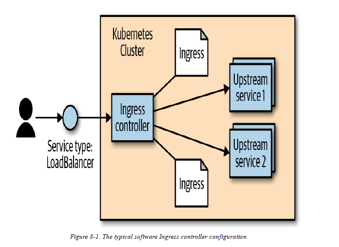

# Table of Content

- [Chapter 1. Introduction](#chapter-1-introduction)
  * [Scaling Development Teams with Microservices](#scaling-development-teams-with-microservices)
- [Chapter 2. Creating and Running Containers](#chapter-2-creating-and-running-containers)
  * [Container Images](#container-images)
  * [Building Application Images with Docker](#building-application-images-with-docker)
    + [Dockerfiles](#dockerfiles)
  * [Storing Images in a Remote Registry](#storing-images-in-a-remote-registry)
  * [The Docker Container Runtime](#the-docker-container-runtime)
    + [Running Containers with Docker](#running-containers-with-docker)
    + [Limiting Resource Usage](#limiting-resource-usage)
      - [LIMITING MEMORY RESOURCES](#limiting-memory-resources)
      - [LIMITING CPU RESOURCES](#limiting-cpu-resources)
  * [Cleanup](#cleanup)
- [Chapter 3. Deploying a Kubernetes Cluster](#chapter-3-deploying-a-kubernetes-cluster)
    + [Checking Cluster Status](#checking-cluster-status)
    + [Listing Kubernetes Worker Nodes](#listing-kubernetes-worker-nodes)
- [Chapter 4. Common kubectl Commands](#chapter-4-common-kubectl-commands)
  * [Namespaces](#namespaces)
  * [Contexts](#contexts)
  * [Viewing Kubernetes API Objects](#viewing-kubernetes-api-objects)
  * [Creating, Updating, and Destroying Kubernetes Objects](#creating-updating-and-destroying-kubernetes-objects)
  * [Labeling and Annotating Objects](#labeling-and-annotating-objects)
  * [Debugging Commands](#debugging-commands)
- [Chapter 5. Pods](#chapter-5-pods)
    + [Creating a Pod](#creating-a-pod)
  * [Running Pods](#running-pods)
    + [Pod Details](#pod-details)
    + [Deleting a Pod](#deleting-a-pod)
  * [Accessing Your Pod](#accessing-your-pod)
    + [Using Port Forwarding](#using-port-forwarding)
    + [Getting More Info with Logs](#getting-more-info-with-logs)
    + [Running Commands in Your Container with exec](#running-commands-in-your-container-with-exec)
    + [Copying Files to and from Containers](#copying-files-to-and-from-containers)
  * [Health Checks](#health-checks)
    + [Liveness Probe](#liveness-probe)
    + [Restart Policy](#restart-policy)
    + [Readiness Probe](#readiness-probe)
    + [Types of Health Checks](#types-of-health-checks)
  * [Resource Management](#resource-management)
    + [Resource Requests: Minimum Required Resources](#resource-requests-minimum-required-resources)
    + [Capping Resource Usage with Limits](#capping-resource-usage-with-limits)
  * [Persisting Data with Volumes](#persisting-data-with-volumes)
    + [Using Volumes with Pods](#using-volumes-with-pods)
    + [Different Ways of Using Volumes with Pods](#different-ways-of-using-volumes-with-pods)
  * [Putting It All Together](#putting-it-all-together)
- [Chapter 6. Labels and Annotations](#chapter-6-labels-and-annotations)
  * [Labels](#labels)
    + [Applying Labels](#applying-labels)
    + [Modifying Labels](#modifying-labels)
    + [Label Selectors](#label-selectors)
    + [Label Selectors in API Objects](#label-selectors-in-api-objects)
    + [Labels in the Kubernetes Architecture](#labels-in-the-kubernetes-architecture)
  * [Annotations](#annotations)
    + [Defining Annotations](#defining-annotations)
- [Chapter 7. Service Discovery](#chapter-7-service-discovery)
  * [What Is Service Discovery?](#what-is-service-discovery)
  * [The Service Object](#the-service-object)
    + [Service DNS](#service-dns)
    + [Readiness Checks](#readiness-checks)
  * [Cloud Integration](#cloud-integration)
  * [Advanced Details](#advanced-details)
    + [Endpoints](#endpoints)
    + [Manual Service Discovery](#manual-service-discovery)
    + [kube-proxy and Cluster IPs](#kubeproxy-and-cluster-ips)
- [Chapter 8. HTTP Load Balancing with Ingress](#chapter-8-http-load-balancing-with-ingress)
  * [Ingress Spec Versus Ingress Controllers](#ingress-spec-versus-ingress-controllers)
  * [Installing Contour](#installing-contour)
    + [Configuring DNS](#configuring-dns)
    + [Configuring a Local hosts File](#configuring-a-local-hosts-file)
  * [Using Ingress](#using-ingress)
    + [Simplest Usage](#simplest-usage)
    + [Using Hostnames](#using-hostnames)
    + [Using Paths](#using-paths)
  * [Advanced Ingress Topics and Gotchas](#advanced-ingress-topics-and-gotchas)
    + [Running Multiple Ingress Controllers](#running-multiple-ingress-controllers)
    + [Multiple Ingress Objects](#multiple-ingress-objects)
    + [Ingress and Namespaces](#ingress-and-namespaces)
    + [Path Rewriting](#path-rewriting)
- [Chapter 9. ReplicaSets](#chapter-9-replicasets)
  * [Reconciliation Loops](#reconciliation-loops)
  * [Relating Pods and ReplicaSets](#relating-pods-and-replicasets)
    + [Adopting Existing Containers](#adopting-existing-containers)
    + [Quarantining Containers](#quarantining-containers)
  * [ReplicaSet Spec](#replicaset-spec)
  * [Creating a ReplicaSet](#creating-a-replicaset)
  * [Inspecting a ReplicaSet](#inspecting-a-replicaset)
    + [Finding a ReplicaSet from a Pod](#finding-a-replicaset-from-a-pod)
    + [Finding a Set of Pods for a ReplicaSet](#finding-a-set-of-pods-for-a-replicaset)
  * [Scaling ReplicaSets](#scaling-replicasets)
    + [Imperative Scaling with kubectl scale](#imperative-scaling-with-kubectl-scale)
    + [Declaratively Scaling with kubectl apply](#declaratively-scaling-with-kubectl-apply)
    + [Autoscaling a ReplicaSet](#autoscaling-a-replicaset)
  * [Deleting ReplicaSets](#deleting-replicasets)
- [Chapter 10. Deployments](#chapter-10-deployments)
  * [Your First Deployment](#your-first-deployment)
    + [Deployment Internals](#deployment-internals)
  * [Managing Deployments](#managing-deployments)
  * [Updating Deployments](#updating-deployments)
    + [Rollout History](#rollout-history)
  * [Deployment Strategies](#deployment-strategies)
    + [Recreate Strategy](#recreate-strategy)
    + [RollingUpdate Strategy](#rollingupdate-strategy)
      - [CONFIGURING A ROLLING UPDATE](#configuring-a-rolling-update)
      - [Slowing Rollouts to Ensure Service Health](#slowing-rollouts-to-ensure-service-health)
  * [Deleting a Deployment](#deleting-a-deployment)
- [Chapter 11. DaemonSets](#chapter-11-daemonsets)
  * [DaemonSet Scheduler](#daemonset-scheduler)
  * [Creating DaemonSets](#creating-daemonsets)
  * [Limiting DaemonSets to Specific Nodes](#limiting-daemonsets-to-specific-nodes)
    + [Adding Labels to Nodes](#adding-labels-to-nodes)
    + [Node Selectors](#node-selectors)
  * [Updating a DaemonSet](#updating-a-daemonset)
    + [Rolling Update of a DaemonSet](#rolling-update-of-a-daemonset)
  * [Deleting a DaemonSet](#deleting-a-daemonset)
- [Chapter 12. Jobs](#chapter-12-jobs)
  * [Job Patterns](#job-patterns)
    + [One Shot](#one-shot)
    + [POD FAILURE](#pod-failure)
    + [Parallelism](#parallelism)
  * [CronJobs](#cronjobs)
- [Chapter 13. ConfigMaps and Secrets](#chapter-13-configmaps-and-secrets)
  * [ConfigMaps](#configmaps)
    + [Creating ConfigMaps](#creating-configmaps)
    + [Using a ConfigMap](#using-a-configmap)
  * [Secrets](#secrets)
    + [Creating Secrets](#creating-secrets)
    + [Consuming Secrets](#consuming-secrets)
      - [SECRETS VOLUMES](#secrets-volumes)
  * [Naming Constraints](#naming-constraints)
  * [Managing ConfigMaps and Secrets](#managing-configmaps-and-secrets)
    + [Listing](#listing)
    + [Creating](#creating)
- [Chapter 14. Role-Based Access Control for Kubernetes](#chapter-14-rolebased-access-control-for-kubernetes)
- [Chapter 15. Integrating Storage Solutions and Kubernetes](#chapter-15-integrating-storage-solutions-and-kubernetes)
  * [Importing External Services](#importing-external-services)
    + [Services Without Selectors](#services-without-selectors)
  * [Running Reliable Singletons](#running-reliable-singletons)
    + [Running a MySQL Singleton](#running-a-mysql-singleton)
    + [Dynamic Volume Provisioning](#dynamic-volume-provisioning)
  * [Kubernetes-Native Storage with StatefulSets](#kubernetesnative-storage-with-statefulsets)
    + [Properties of StatefulSets](#properties-of-statefulsets)
    + [Manually Replicated MongoDB with StatefulSets](#manually-replicated-mongodb-with-statefulsets)
    + [Automating MongoDB Cluster Creation](#automating-mongodb-cluster-creation)
    + [Persistent Volumes and StatefulSets](#persistent-volumes-and-statefulsets)
    + [One Final Thing: Readiness Probes](#one-final-thing-readiness-probes)
- [Chapter 16. Extending Kubernetes](#chapter-16-extending-kubernetes)
- [Chapter 17. Deploying Real-World Applications](#chapter-17-deploying-realworld-applications)
- [Chapter 18. Organizing Your Application](#chapter-18-organizing-your-application)

# Chapter 1. Introduction

## Scaling Development Teams with Microservices

Kubernetes provides numerous abstractions and APIs that make it easier to build these decoupled microservice architectures:
* **Pods**, or groups of containers, can group together container images developed by different teams into a single deployable unit.
* Kubernetes **services** provide load balancing, naming, and discovery to isolate one microservice from another.
* **Namespaces** provide isolation and access control, so that each microservice can control the degree to which other services interact with it.
* **Ingress** objects provide an easy-to-use frontend that can combine multiple microservices into a single externalized API surface area.

# Chapter 2. Creating and Running Containers

Container images bundle a program and its dependencies into a single artifact under a root filesystem. The most popular container image format is the Docker image format, which has been standardized by the Open Container Initiative to the OCI image format.

## Container Images

Container images are constructed with a series of filesystem layers, where each layer inherits and modifies the layers that came before it.
```
.
└── container A: a base operating system only, such as Debian
    └── container B: build upon #A, by adding Ruby v2.1.10
    └── container C: build upon #A, by adding Golang v1.6
```

Containers fall into two main categories:
* System containers
* Application containers

System containers seek to mimic virtual machines and often run a full boot process. They often include a set of system services typically found in a VM, such as ssh, cron, and syslog. **Over time, they have come to be seen as poor practice and application containers have gained favor.**

Application containers differ from system containers in that they commonly run a single program.

## Building Application Images with Docker

### Dockerfiles

To package this up as a Docker image we need to create two additional files: **.dockerignore (Example 2-3) and the Dockerfile (Example 2-4).** The Dockerfile is a recipe for how to build the container image, while **.dockerignore defines the set of files that should be ignored when copying files into the image.**

Example 2-3. .dockerignore
```
node_modules
```

Example 2-4. Dockerfile

```
# Start from a Node.js 10 (LTS) image 
FROM node:10
# Specify the directory inside the image in which all commands will run 
WORKDIR /usr/src/app
# Copy package files and install dependencies 
COPY package*.json ./
RUN npm install
# Copy all of the app files into the image 
COPY . .
# The default command to run when starting the container 
CMD [ "npm", "start" ]
```

## Storing Images in a Remote Registry

The standard within the Docker community is to store Docker images in a remote registry. To push an image, you need to authenticate to the registry. You can generally do this with the ``docker login`` though there are some differences for certain registries. 

## The Docker Container Runtime

### Running Containers with Docker

To deploy a container from the gcr.io/kuar-demo/kuard-amd64:blue image, run the following command:
```
$ docker run -d --name kuard \
  --publish 8080:8080 \
    gcr.io/kuar-demo/kuard-amd64:blue
```

### Limiting Resource Usage

#### LIMITING MEMORY RESOURCES

One of the key benefits to running applications within a container is the ability to restrict resource utilization. To limit kuard to 200 MB of memory and 1 GB of ``swap space``, use the ``--memory`` and ``--memory-swap`` flags with the docker run command.

**Swap memory**

Linux divides its physical RAM (random access memory) into chucks of memory called pages. Swapping is the process whereby a page of memory is copied to the preconfigured space on the hard disk, called swap space, to free up that page of memory. The combined sizes of the physical memory and the swap space is the amount of virtual memory available.

```
$ docker run -d --name kuard \
  --publish 8080:8080 \
  --memory 200m \
  --memory-swap 1G \
  gcr.io/kuar-demo/kuard-amd64:blue
```

#### LIMITING CPU RESOURCES

Another critical resource on a machine is the CPU. Restrict CPU utilization using the --cpu-shares flag with the docker run command:
```
$ docker run -d --name kuard \
  --publish 8080:8080 \
  --memory 200m \
  --memory-swap 1G \
  --cpu-shares 1024 \
  gcr.io/kuar-demo/kuard-amd64:blue
```

## Cleanup

Once you are done building an image, you can delete it with the docker rmi command:
```
docker rmi <tag-name>
```
or
```
docker rmi <image-id>
```

Images can either be deleted via their tag name (e.g., gcr.io/kuar-demo/kuard-amd64:blue) or via their image ID.

# Chapter 3. Deploying a Kubernetes Cluster

### Checking Cluster Status

```
$ kubectl get componentstatuses
```
The output should look like this:
```
NAME                 STATUS    MESSAGE              ERROR
scheduler            Healthy   ok
controller-manager   Healthy   ok
etcd-0               Healthy   {"health": "true"}
```

### Listing Kubernetes Worker Nodes

List out all of the nodes in your cluster:
```
$ kubectl get nodes
NAME         STATUS         AGE       VERSION
kubernetes   Ready,master   45d       v1.12.1
node-1       Ready          45d       v1.12.1
node-2       Ready          45d       v1.12.1
node-3       Ready          45d       v1.12.1
```

# Chapter 4. Common kubectl Commands

## Namespaces

Kubernetes uses namespaces to organize objects in the cluster. You can think of each namespace as a folder that holds a set of objects. **By default, the kubectl commandline tool interacts with the default namespace.**
If you want to use a different namespace, you can pass ``kubectl`` the ``--namespace`` flag. For example, ``kubectl --namespace=mystuff`` references objects in the mystuff namespace. 
If you want to interact with all namespaces - for example, to list all Pods in your cluster you can pass the ``--all-namespaces`` flag.

## Contexts

If you want to change the default namespace more permanently, you can use a context. This gets recorded in a kubectl configuration file, usually located at ``$HOME/.kube/config``. For example, you can create a context with a different default namespace for your kubectl commands using:
```
$ kubectl config set-context my-context --namespace=mystuff
```

This creates a new context, but it doesn’t actually start using it yet. To use this newly created context, you can run:
```
$ kubectl config use-context my-context
```

## Viewing Kubernetes API Objects

``kubectl get <resource-name>`` get a list of all resources in the current namespace.
``kubectl get <resource-name> <obj-name>`` get a specific resource.

``-o wide`` flag gives more details on a longer line.
``-o json`` or ``-o yaml`` flag gives view of complete object.

``kubectl get pods my-pod -o jsonpath --template={.status.podIP}`` uses JSONPath to extract specific fields.

If you are interested in more detailed information about a particular object, use the describe command:
```
$ kubectl describe <resource-name> <obj-name>
```

## Creating, Updating, and Destroying Kubernetes Objects

Let’s assume that you have a simple object stored in obj.yaml. You can use kubectl to create this object in Kubernetes by running:
```
$ kubectl apply -f obj.yaml
```
Similarly, after you make changes to the object, **you can use the apply command again to update the object**:
```
$ kubectl apply -f obj.yaml
```

If you want to see what the ``apply`` command will do without actually making the changes, you can use the **``--dry-run`` flag to print the objects to the terminal without actually sending them to the server.**

When you want to delete an object, you can simply run:
```
$ kubectl delete -f obj.yaml
```

## Labeling and Annotating Objects

Labels and annotations are tags for your objects. To add the color=red label to a Pod named bar, you can run:
```
$ kubectl label pods bar color=red
```

If you want to remove a label, you can use the ``<label-name>-`` syntax:
```
$ kubectl label pods bar color-
```

## Debugging Commands

You can use the following to see the **logs** for a running container:
```
$ kubectl logs <pod-name>
```

If you have multiple containers in your Pod, you can choose the container to view using the ``-c`` flag. 

By default, kubectl logs lists the current logs and exits. If you instead want to continuously stream the logs back to the terminal without exiting, you can add the ``-f (follow)`` command-line flag.

You can also use the **exec** command to execute a command in a running container:
```
$ kubectl exec -it <pod-name> -- bash
```
This will provide you with an interactive shell inside the running container so that you can perform more debugging.

If you don’t have bash or some other terminal available within your container, you can always **attach** to the running process:
```
$ kubectl attach -it <pod-name>
```

**Difference**

``attach`` can attach to the main process run by the container (no choice), which is not always bash. As opposed to ``exec``, which allows you to execute any process within the container (often: bash).

You can also **copy** files to and from a container using the cp command:
```
$ kubectl cp <pod-name>:</path/to/remote/file> </path/to/local/file>
```

If you want to access your Pod via the network, you can use the ``port-forward`` command to forward network traffic from the local machine to the Pod. For example, the following command:
```
$ kubectl port-forward <pod-name> 8080:80
```

opens up a connection that forwards traffic from the local machine on port 8080 to the remote container on port 80.

you can use the ``top`` command to see the list of resources in use by either nodes or Pods. This command:
```
$ kubectl top nodes
$ kubectl top pods
```

**Help** command:
```
$ kubectl help
$ kubectl help <command-name>
```

# Chapter 5. Pods

**Sidecars** - containers that co-exists with "main" containers in pods. For example, web application in pod could be a "main" container, while Git synchronizer might be a sidecar.

### Creating a Pod

```
$ kubectl run kuard --generator=run-pod/v1 --image=gcr.io/kuar-demo/kuard-amd64:blue
```

You can see the status of this Pod by running:
```
$ kubectl get pods
```

```
$ kubectl delete pods/kuard
```

## Running Pods

Use the kubectl apply command to launch a single instance of kuard:
```
$ kubectl apply -f kuard-pod.yaml
```

### Pod Details

To find out more information about a Pod:
```
$ kubectl describe pods kuard
```

### Deleting a Pod

When it is time to delete a Pod, you can delete it either by name:
```
$ kubectl delete pods/kuard
```
or using the same file that you used to create it:
```
$ kubectl delete -f kuard-pod.yaml
```

## Accessing Your Pod

### Using Port Forwarding

To access Pod, you can use the port-forwarding support built into the Kubernetes API and command-line tools. When you run:
```
$ kubectl port-forward kuard 8080:8080
```
a secure tunnel is created from your local machine, through the Kubernetes master, to the instance of the Pod running on one of the worker nodes. As long as the port-forward command is still running, you can access the Pod (in this case the kuard web interface) at http://localhost:8080.

### Getting More Info with Logs

The kubectl logs command downloads the current logs from the running instance:
```
$ kubectl logs kuard
```

Adding the ``-f`` flag will cause you to continuously stream logs.

The kubectl logs command always tries to get logs from the **currently running container.** Adding the ``--previous`` flag will get logs **from a previous instance of the container.** This is useful, for example, if your containers are continuously restarting due to a problem at container startup.

### Running Commands in Your Container with exec

Get an interactive shell.

```
$ kubectl exec kuard -it bash
```

### Copying Files to and from Containers

Suppose you had a file called /captures/capture3.txt inside a container in your Pod. You could securely copy that file to your local machine by running:
```
$ kubectl cp <pod-name>:/captures/capture3.txt ./capture3.txt
```
Other times you may need to copy files from your local machine into a container. Let’s say you want to copy $HOME/config.txt to a remote container. In this case, you can run:
```
$ kubectl cp $HOME/config.txt <pod-name>:/config.txt
```
Generally speaking, copying files into a container is an anti-pattern.

## Health Checks

### Liveness Probe

Liveness health checks run application-specific logic (e.g., loading a web page) to verify that the application is not just still running, but is functioning properly. Since these liveness health checks are application-specific, you have to define them in your Pod manifest.

**Liveness probes are defined per container, which means each container inside a Pod is health-checked separately.**

```
apiVersion: v1
kind: Pod
metadata:
  name: kuard
spec:
  containers:
  - image: gcr.io/kuar-demo/kuard-amd64:blue
    name: kuard
    livenessProbe:
      httpGet:
        path: /healthy
        port: 8080
      initialDelaySeconds: 5
      timeoutSeconds: 1
      periodSeconds: 10
      failureThreshold: 3
    ports:
    - containerPort: 8080
      name: http
      protocol: TCP
```


The preceding Pod manifest uses an httpGet probe to perform an HTTP GET request against the /healthy endpoint on port 8080 of the kuard container. The probe sets an initialDelaySeconds of 5, and thus will not be called until 5 seconds after all the containers in the Pod are created. The probe must respond within the 1-second timeout, and the **HTTP status code must be equal to or greater than 200 and less than 400 to be considered successful.** Kubernetes will call the probe every 10 seconds. If more than three consecutive probes fail, the container will fail and restart.

### Restart Policy

A PodSpec has a restartPolicy field with possible values Always, OnFailure, and Never. The default value is Always. restartPolicy applies to all Containers in the Pod.

### Readiness Probe

Liveness determines if an application is running properly. Containers that fail liveness checks are restarted. Readiness describes when a container is ready to serve user requests. **Containers that fail readiness checks are removed from service load balancers.**

### Types of Health Checks

Kubernetes also supports tcpSocket health checks that open a TCP socket; if the connection is successful, the probe succeeds. This style of probe is useful for non-HTTP applications; for example, databases or other non–HTTP-based APIs.

## Resource Management

Kubernetes allows users to specify two different resource metrics:
* **Requests** - specify the minimum amount of a resource required to run the application. 
* **Limits** - specify the maximum amount of a resource that an application can consume.

### Resource Requests: Minimum Required Resources

**The most commonly requested resources are CPU and memory**, but Kubernetes has support for other resource types as well, such as GPUs and more.

```
apiVersion: v1
kind: Pod
metadata:
  name: kuard
spec:
  containers:
  - image: gcr.io/kuar-demo/kuard-amd64:blue
    name: kuard
    resources:
      requests:
        cpu: "500m"
        memory: "128Mi"
    ports:
    - containerPort: 8080
      name: http
      protocol: TCP
```

**Resources are requested per container, not per Pod. The total resources requested by the Pod is the sum of all resources requested by all containers in the Pod.**

### Capping Resource Usage with Limits

In addition to setting the resources required by a Pod, which establishes the minimum resources available to the Pod, you can also set a maximum on a Pod’s resource usage via resource limits.

```
apiVersion: v1
kind: Pod
  metadata:
    name: kuard
spec:
  containers:
  - image: gcr.io/kuar-demo/kuard-amd64:blue
    name: kuard
    resources:
      requests:
        cpu: "500m"
        memory: "128Mi"
      limits:
        cpu: "1000m"
        memory: "256Mi"
    ports:
    - containerPort: 8080
      name: http
      protocol: TCP

```

## Persisting Data with Volumes

### Using Volumes with Pods

To add a volume to a Pod manifest, there are two new stanzas to add to our configuration. The first is a new ``spec.volumes`` section. This array defines all of the volumes that may be accessed by containers in the Pod manifest. It’s important to note that not all containers are required to mount all volumes defined in the Pod. The second addition is the ``volumeMounts`` array in the container definition. This array defines the volumes that are mounted into a particular container, and the path where each volume should be mounted. **Note that two different containers in a Pod can mount the same volume at different mount paths.**

```
apiVersion: v1
kind: Pod
metadata:
  name: kuard
spec:
  volumes:
  - name: "kuard-data"
    hostPath:
      path: "/var/lib/kuard"
  containers:
  - image: gcr.io/kuar-demo/kuard-amd64:blue
    name: kuard
    volumeMounts:
    - mountPath: "/data"
      name: "kuard-data"
    ports:
    - containerPort: 8080
      name: http
      protocol: TCP
```

### Different Ways of Using Volumes with Pods

* **Communication/Synchronization**. In the first example of a Pod, we saw how two containers used a shared volume to serve a site while keeping it synchronized to a remote Git location.
* **Cache**. An application may use a volume that is valuable for performance, but not required for correct operation of the application. For example, perhaps the application keeps prerendered thumbnails of larger images. Of course, they can be reconstructed from the original images, but that makes serving the thumbnails more expensive.
* **Persistent Data**. Kubernetes supports a wide variety of remote network storage volumes, including widely supported protocols like NFS and iSCSI as well as cloud provider network storage like Amazon’s Elastic Block Store, Azure’s Files and Disk Storage, as well as Google’s Persistent Disk.

## Putting It All Together

```
apiVersion: v1
kind: Pod
metadata:
name: kuard
spec:
  volumes:
  - name: "kuard-data"
    nfs:
      server: my.nfs.server.local
      path: "/exports"
  containers:
  - image: gcr.io/kuar-demo/kuard-amd64:blue
    name: kuard
    ports:
    - containerPort: 8080
      name: http
      protocol: TCP
    resources:
      requests:
        cpu: "500m"
        memory: "128Mi"
      limits:
        cpu: "1000m"
        memory: "256Mi"
    volumeMounts:
    - mountPath: "/data"
      name: "kuard-data"
    livenessProbe:
      httpGet:
        path: /healthy
        port: 8080
      initialDelaySeconds: 5
      timeoutSeconds: 1
      periodSeconds: 10
      failureThreshold: 3
    readinessProbe:
      httpGet:
        path: /ready
        port: 8080
    initialDelaySeconds: 30
    timeoutSeconds: 1
    periodSeconds: 10
    failureThreshold: 3
```

# Chapter 6. Labels and Annotations

**Labels** are key/value pairs that can be attached to Kubernetes objects such as Pods and ReplicaSets. They can be arbitrary, and are useful for attaching identifying information to Kubernetes objects. Labels provide the foundation for grouping objects.

**Annotations**, on the other hand, provide a storage mechanism that resembles labels: annotations are key/value pairs designed to hold nonidentifying information that can be leveraged by tools and libraries.

## Labels

Label keys can be broken down into two parts: an optional prefix and a name, separated by a slash. The prefix, if specified, must be a DNS subdomain with a 253-character limit. **The key name is required and must be shorter than 63 characters. Names must also start and end with an alphanumeric character and permit the use of dashes (-), underscores (\_), and dots (.) between characters.**

**Label values are strings with a maximum length of 63 characters.** The contents of the label values follow the same rules as for label keys.

### Applying Labels

We’ll take two apps (called alpaca and bandicoot) and have two environments for each. We will also have two different versions.


First, create the alpaca-prod deployment and set the ver, app, and env labels:
```
$ kubectl run alpaca-prod \
--image=gcr.io/kuar-demo/kuard-amd64:blue \
--replicas=2 \
--labels="ver=1,app=alpaca,env=prod"
```

Next, create the alpaca-test deployment and set the ver, app, and env labels with the appropriate values:

```
$ kubectl run alpaca-test \
--image=gcr.io/kuar-demo/kuard-amd64:green \
--replicas=1 \
--labels="ver=2,app=alpaca,env=test"
```
Finally, create two deployments for bandicoot. Here we name the environments prod and staging:
```
$ kubectl run bandicoot-prod \
--image=gcr.io/kuar-demo/kuard-amd64:green \
--replicas=2 \
--labels="ver=2,app=bandicoot,env=prod"

$ kubectl run bandicoot-staging \
--image=gcr.io/kuar-demo/kuard-amd64:green \
--replicas=1 \
--labels="ver=2,app=bandicoot,env=staging"
```

At this point you should have four deployments—alpaca-prod, alpaca-test, bandicoot-prod, and bandicoot-staging:

### Modifying Labels

Labels can also be applied (or updated) on objects after they are created:
```
$ kubectl label deployments alpaca-test "canary=true"
```

You can also use the -L option to kubectl get to show a label value as a column:
```
$ kubectl get deployments -L canary
```

You can remove a label by applying a dash suffix:
```
$ kubectl label deployments alpaca-test "canary-"
```

### Label Selectors

Label selectors are used to filter Kubernetes objects based on a set of labels.

```
$ kubectl get pods --show-labels

NAME ... LABELS
alpaca-prod-3408831585-4nzfb ... app=alpaca,env=prod,ver=1,...
alpaca-prod-3408831585-kga0a ... app=alpaca,env=prod,ver=1,...
alpaca-test-1004512375-3r1m5 ... app=alpaca,env=test,ver=2,...
bandicoot-prod-373860099-0t1gp ... app=bandicoot,env=prod,ver=2,...
bandicoot-prod-373860099-k2wcf ... app=bandicoot,env=prod,ver=2,...
bandicoot-staging-1839769971-3ndv ... app=bandicoot,env=staging,ver=2,...
```

You may see a new label that we haven’t seen yet: ``pod-template-hash``. This label is applied by the deployment so it can keep track of which Pods were generated from which template versions.

If we only wanted to list Pods that had the ver label set to 2, we could use the ``--selector`` flag:
```
$ kubectl get pods --selector="ver=2"
```

If we specify two selectors separated by a comma, only the objects that satisfy both will be returned. This is a logical AND operation:
```
$ kubectl get pods --selector="app=bandicoot,ver=2"
```

We can also ask if a label is one of a set of values. Here we ask for all Pods where the app label is set to alpaca or bandicoot (which will be all six Pods):
```
$ kubectl get pods --selector="app in (alpaca,bandicoot)"
```

Finally, we can ask if a label is set at all. Here we are asking for all of the deployments with the canary label set to anything:
```
$ kubectl get deployments --selector="canary"
```

For example, asking if a key, in this case canary, is not set can look like:
```
$ kubectl get deployments --selector='!canary'
```
Similarly, you can combine positive and negative selectors together as follows:
```
$ kubectl get pods -l 'ver=2,!canary'
```

| Operator  | Description |
| ------------- | ------------- |
| key=value | key is set to value |
| key!=value | key is not set to value |
| key in (value1, value2) | key is one of value1 or value2 |
| key notin (value1, value2) | key is not one of value1 or value2 |
| key | key is set |
| !key | key is not set |

### Label Selectors in API Objects

When a Kubernetes object refers to a set of other Kubernetes objects, a label selector is used.

There are two forms.

Older form of specifying selectors (used in ReplicationControllers and services) only supports the = operator. This is a simple set of key/value pairs that must all match a target object to be selected. The selector app=alpaca,ver=1 would be represented like this:
```
selector:
  app: alpaca
  ver: 1
```

Newer form of specifying a selector of ``app=alpaca,ver in (1, 2)`` would be converted to this:
```
selector:
  matchLabels:
    app: alpaca
  matchExpressions:
  - {key: ver, operator: In, values: [1, 2]}
```

### Labels in the Kubernetes Architecture

In addition to enabling users to organize their infrastructure, labels play a critical role in linking various related Kubernetes objects. In many cases objects need to relate to one another, and these relationships are defined by labels and label selectors.

## Annotations

**Annotations provide a place to store additional metadata for Kubernetes objects with the sole purpose of assisting tools and libraries.**

While labels are used to identify and group objects, annotations are used to provide extra information about where an object came from, how to use it, or policy around that object.

There is overlap, and it is a matter of taste as to when to use an annotation or a label. When in doubt, add information to an object as an annotation and promote it to a label if you find yourself wanting to use it in a selector.

Annotations are used to:
* Keep track of a "reason" for the latest update to an object.
* Communicate a specialized scheduling policy to a specialized scheduler.
* Extend data about the last tool to update the resource and how it was updated (used for detecting changes by other tools and doing a smart merge).
* Attach build, release, or image information that isn’t appropriate for labels (may include a Git hash, timestamp, PR number, etc.).
* Enable the Deployment object to keep track of ReplicaSets that it is managing for rollouts.
* Provide extra data to enhance the visual quality or usability of a UI. For example, objects could include a link to an icon (or a base64-encoded version of an icon).
* Prototype alpha functionality in Kubernetes (instead of creating a first-class API field, the parameters for that functionality are encoded in an annotation).

Annotations are used in various places in Kubernetes, with the primary use case being rolling deployments. During rolling deployments, annotations are used to track rollout status and provide the necessary information required to roll back a deployment to a previous state.

### Defining Annotations

Annotation keys use the same format as label keys. However, because they are often used to communicate information between tools, the "namespace" part of the key is more important. Example keys include ``deployment.kubernetes.io/revision`` or ``kubernetes.io/changecause``.

Annotations are defined in the common metadata section in every Kubernetes object:
```
...
metadata:
  annotations:
    example.com/icon-url: "https://example.com/icon.png"
...
```

# Chapter 7. Service Discovery

While the dynamic nature of Kubernetes makes it easy to run a lot of things, it creates problems when it comes to **finding** those things.

## What Is Service Discovery?

Service-discovery tools help solve the problem of finding which processes are listening at which addresses for which services.

The Domain Name System (DNS) is the traditional system of service discovery on the internet. It is a great system for the internet but falls short in the dynamic world of Kubernetes. 

Unfortunately, many systems (for example, Java, by default) look up a name in DNS directly and never re-resolve. This can lead to clients caching stale mappings and talking to the wrong IP. Even with short TTLs and well-behaved clients, there is a natural delay between when a name resolution changes and when the client notices.

## The Service Object

Let’s create some deployments and services so we can see how they work:
```
$ kubectl run alpaca-prod \
--image=gcr.io/kuar-demo/kuard-amd64:blue \
--replicas=3 \
--port=8080 \
--labels="ver=1,app=alpaca,env=prod"
$ kubectl expose deployment alpaca-prod
$ kubectl run bandicoot-prod \
--image=gcr.io/kuar-demo/kuard-amd64:green \
--replicas=2 \
--port=8080 \
--labels="ver=2,app=bandicoot,env=prod"
$ kubectl expose deployment bandicoot-prod
```
```
$ kubectl get services -o wide
NAME CLUSTER-IP ... PORT(S) ... SELECTOR
alpaca-prod 10.115.245.13 ... 8080/TCP ... app=alpaca,env=prod,ver=1
bandicoot-prod 10.115.242.3 ... 8080/TCP ...
app=bandicoot,env=prod,ver=2
kubernetes 10.115.240.1 ... 443/TCP ... <none>
```

The kubernetes service is automatically created for you so that you can find and talk to the Kubernetes API from within the app.

Service is assigned a new type of **virtual IP** called a **cluster IP**.

To interact with services, we are going to port forward to one of the alpaca Pods. Start and leave this command running in a terminal window. You can see the port forward working by accessing the alpaca Pod at http://localhost:48858:
```
$ ALPACA_POD=$(kubectl get pods -l app=alpaca \
-o jsonpath='{.items[0].metadata.name}')
$ kubectl port-forward $ALPACA_POD 48858:8080
```

### Service DNS

Kubernetes DNS service provides DNS names for cluster IPs.

### Readiness Checks

Often, when an application first starts up it isn’t ready to handle requests. There is usually some amount of initialization that can take anywhere from under a second to several minutes. One nice thing the Service object does is track which of your Pods are ready via a readiness check.

## Cloud Integration

If you have support from the cloud that you are running on (and your cluster is configured to take advantage of it), you can use the **LoadBalancer type.** This builds on the NodePort type by additionally configuring the cloud to create a new load balancer and direct it at nodes in your cluster.

If you do a kubectl get services right away you’ll see that the EXTERNALIP column for alpaca-prod now says <pending>. Wait a bit and you should see a public address assigned by your cloud.
```
$ kubectl describe service alpaca-prod
Name: alpaca-prod
Namespace: default
Labels: app=alpaca
env=prod
ver=1
Selector: app=alpaca,env=prod,ver=1
Type: LoadBalancer
IP: 10.115.245.13
LoadBalancer Ingress: 104.196.248.204
Port: <unset> 8080/TCP
NodePort: <unset> 32711/TCP
Endpoints:
10.112.1.66:8080,10.112.2.104:8080,10.112.2.105:8080
Session Affinity: None
Events:
FirstSeen ... Reason Message
--------- ... ------ -------
3m ... Type NodePort -> LoadBalancer
3m ... CreatingLoadBalancer Creating load balancer
2m ... CreatedLoadBalancer Created load balancer
```

Here we see that we have an address of 104.196.248.204 now assigned to the alpaca-prod service. Open up your browser and try!

## Advanced Details

### Endpoints

Some applications (and the system itself) want to be able to use services without using a cluster IP. This is done with another type of object called an Endpoints object. For every Service object, Kubernetes creates a buddy Endpoints object that contains the IP addresses for that service:
```
$ kubectl describe endpoints alpaca-prod
Name: alpaca-prod
Namespace: default
Labels: app=alpaca
env=prod
ver=1
Subsets:
Addresses: 10.112.1.54,10.112.2.84,10.112.2.85
NotReadyAddresses: <none>
Ports:
Name Port Protocol
---- ---- --------
<unset> 8080 TCP
```

In a terminal window, start the following command and leave it running:
```
$ kubectl get endpoints alpaca-prod --watch
```
It will output the current state of the endpoint and then "hang":
```
NAME ENDPOINTS AGE
alpaca-prod 10.112.1.54:8080,10.112.2.84:8080,10.112.2.85:8080 1m
```
Now open up another terminal window and delete and recreate the deployment backing alpaca-prod:
```
$ kubectl delete deployment alpaca-prod
$ kubectl run alpaca-prod \
--image=gcr.io/kuar-demo/kuard-amd64:blue \
--replicas=3 \
--port=8080 \
--labels="ver=1,app=alpaca,env=prod"
```

Your output will look something like this:
```
NAME ENDPOINTS AGE
alpaca-prod 10.112.1.54:8080,10.112.2.84:8080,10.112.2.85:8080 1m
alpaca-prod 10.112.1.54:8080,10.112.2.84:8080 1m
alpaca-prod <none> 1m
alpaca-prod 10.112.2.90:8080 1m
alpaca-prod 10.112.1.57:8080,10.112.2.90:8080 1m
alpaca-prod 10.112.0.28:8080,10.112.1.57:8080,10.112.2.90:8080 1m
```

### Manual Service Discovery

With kubectl (and via the API) we can easily see what IPs are assigned to each Pod in our example deployments:
```
$ kubectl get pods -o wide --show-labels
NAME ... IP ... LABELS
alpaca-prod-12334-87f8h ... 10.112.1.54 ... app=alpaca,env=prod,ver=1
alpaca-prod-12334-jssmh ... 10.112.2.84 ... app=alpaca,env=prod,ver=1
alpaca-prod-12334-tjp56 ... 10.112.2.85 ... app=alpaca,env=prod,ver=1
bandicoot-prod-5678-sbxzl ... 10.112.1.55 ...
app=bandicoot,env=prod,ver=2
bandicoot-prod-5678-x0dh8 ... 10.112.2.86 ...
app=bandicoot,env=prod,ver=2
```
This is great, but what if you have a ton of Pods? You’ll probably want to filter this based on the labels applied as part of the deployment. Let’s do that for just the alpaca app:
```
$ kubectl get pods -o wide --selector=app=alpaca,env=prod
NAME ... IP ...
alpaca-prod-3408831585-bpzdz ... 10.112.1.54 ...
alpaca-prod-3408831585-kncwt ... 10.112.2.84 ...
alpaca-prod-3408831585-l9fsq ... 10.112.2.85 ...
```
At this point you have the basics of service discovery!

### kube-proxy and Cluster IPs

**kube-proxy** watches for new services in the cluster via the API server. It then programs a set of iptables rules in the kernel of that host to rewrite the destinations of packets so they are directed at one of the endpoints for that service. If the set of endpoints for a service changes (due to Pods coming and going or due to a failed readiness check), the set of iptables rules is rewritten.

# Chapter 8. HTTP Load Balancing with Ingress

A critical part of any application is getting network traffic to and from that application.

When solving a similar problem in non-Kubernetes situations, users often turn to the idea of "virtual hosting". This is a mechanism to host many HTTP sites on a single IP address. Typically, the user uses a load balancer or reverse proxy to accept incoming connections on HTTP (80) and HTTPS (443) ports. That program then parses the HTTP connection and, based on the Host header and the URL path that is requested, proxies the HTTP call to some other program. In this way, that load balancer or reverse proxy plays "traffic cop" for decoding and directing incoming connections to the right "upstream" server.

Kubernetes calls its HTTP-based load-balancing system Ingress. Ingress is a Kubernetes-native way to implement the “virtual hosting” pattern we just discussed.

The typical software base implementation looks something like what is depicted in Figure 8-1.



## Ingress Spec Versus Ingress Controllers

Ingress is split into a common resource specification and a controller implementation. **There is no "standard" Ingress controller that is built into Kubernetes, so the user must install one of many optional implementations.**

There are multiple reasons that Ingress ended up like this. First of all, there is no one single HTTP load balancer that can universally be used. In addition to many software load balancers (both open source and proprietary), there are also load-balancing capabilities provided by cloud providers (e.g., ELB on AWS), and hardware-based load balancers.

## Installing Contour

While there are many available Ingress controllers, for the examples here we use an Ingress controller called Contour.
You can install Contour with a simple one-line invocation:
```
$ kubectl apply -f https://j.hept.io/contour-deployment-rbac
```
Note that this requires execution by a user who has cluster-admin permissions.

This one line works for most configurations. It creates a namespace called *heptio-contour*. Inside of that namespace it creates a deployment (with two replicas) and an external-facing service of ``type: LoadBalancer``.

Because it is a global install, you need to ensure that you have wide admin permissions on the cluster you are installing into. After you install it, you can fetch the external address of Contour via:
```
$ kubectl get -n heptio-contour service contour -o wide
NAME CLUSTER-IP EXTERNAL-IP PORT(S) ...
contour 10.106.53.14 a477...amazonaws.com 80:30274/TCP ...
```
Look at the EXTERNAL-IP column. This can be either an IP address (for GCP and Azure) or a hostname (for AWS).

If you are using minikube, you probably won’t have anything listed for EXTERNALIP. To fix this, you need to open a separate terminal window and run minikube tunnel.

### Configuring DNS

To make Ingress work well, you need to configure DNS entries to the external address for your load balancer. You can map multiple hostnames to a single external endpoint and the Ingress controller will play traffic cop and direct incoming requests to the appropriate upstream service based on that hostname.
For this chapter, we assume that you have a domain called example.com. You need to configure two DNS entries: ``alpaca.example.com`` and ``bandicoot.example.com``.

### Configuring a Local hosts File

If you don’t have a domain or if you are using a local solution such as minikube, you can set up a local configuration by editing your ``/etc/hosts`` file to add an IP address. You need admin/root privileges on your workstation. The location of the file may differ on your platform, and making it take effect may require extra steps. For example, on Windows the file is usually at ``C:\Windows\System32\drivers\etc\hosts``, and for recent versions of macOS you need to run ``sudo killall -HUP mDNSResponder`` after changing the file.
Edit the file to add a line like the following:
```
<ip-address> alpaca.example.com bandicoot.example.com
```
For ``<ip-address>``, fill in the external IP address for Contour. If all you have is a hostname (like from AWS), you can get an IP address (that may change in the future) by executing host -t a ``<address>``.

Don’t forget to undo these changes when you are done!

## Using Ingress

Now that we have an Ingress controller configured, let’s put it through its paces. First we’ll create a few upstream (also sometimes referred to as “backend”) services to play with by executing the following commands:
```
$ kubectl run be-default \
--image=gcr.io/kuar-demo/kuard-amd64:blue \
--replicas=3 \
--port=8080
$ kubectl expose deployment be-default
$ kubectl run alpaca \
--image=gcr.io/kuar-demo/kuard-amd64:green \
--replicas=3 \
--port=8080
$ kubectl expose deployment alpaca
$ kubectl run bandicoot \
--image=gcr.io/kuar-demo/kuard-amd64:purple \
--replicas=3 \
--port=8080
$ kubectl expose deployment bandicoot
$ kubectl get services -o wide
NAME CLUSTER-IP ... PORT(S) ... SELECTOR
alpaca-prod 10.115.245.13 ... 8080/TCP ... run=alpaca
bandicoot-prod 10.115.242.3 ... 8080/TCP ... run=bandicoot
be-default 10.115.246.6 ... 8080/TCP ... run=be-default
kubernetes 10.115.240.1 ... 443/TCP ... <none>
```

### Simplest Usage

The simplest way to use Ingress is to have it just blindly pass everything that it sees through to an upstream service.

simple-ingress.yaml
```
apiVersion: extensions/v1beta1
kind: Ingress
metadata:
  name: simple-ingress
spec:
  backend:
    serviceName: alpaca
    servicePort: 8080
```
Create this Ingress with kubectl apply:
```
$ kubectl apply -f simple-ingress.yaml
ingress.extensions/simple-ingress created
```
You can verify that it was set up correctly using ``kubectl get`` and ``kubectl describe``:
```
$ kubectl get ingress
NAME HOSTS ADDRESS PORTS AGE
simple-ingress * 80 13m
$ kubectl describe ingress simple-ingress
Name: simple-ingress
Namespace: default
Address:
Default backend: be-default:8080
(172.17.0.6:8080,172.17.0.7:8080,172.17.0.8:8080)
Rules:
Host Path Backends
---- ---- --------
* * be-default:8080
(172.17.0.6:8080,172.17.0.7:8080,172.17.0.8:8080)
Annotations:
...
Events: <none>
```

This sets things up so that **any** HTTP request that hits the Ingress controller is forwarded on to the alpaca service.

### Using Hostnames

The most common example of this is to have the Ingress system look at the HTTP host header (which is set to the DNS domain in the original URL) and direct traffic based on that header. Let’s add another Ingress object for directing traffic to the alpaca service for any traffic directed to ``alpaca.example.com``.

host-ingress.yaml
```
apiVersion: extensions/v1beta1
kind: Ingress
metadata:
  name: host-ingress
spec:
  rules:
  - host: alpaca.example.com
    http:
      paths:
      - backend:
          serviceName: alpaca
          servicePort: 8080
```
Create this Ingress with kubectl apply:
```
$ kubectl apply -f host-ingress.yaml
ingress.extensions/host-ingress created
```
We can verify that things are set up correctly as follows:
```
$ kubectl get ingress
NAME HOSTS ADDRESS PORTS AGE
host-ingress alpaca.example.com 80 54s
simple-ingress * 80 13m
$ kubectl describe ingress host-ingress
Name: host-ingress
Namespace: default
Address:
Default backend: default-http-backend:80 (<none>)
Rules:
Host Path Backends
---- ---- --------
alpaca.example.com
/ alpaca:8080 (<none>)
Annotations:
...
Events: <none>
```

There are a couple of things that are a bit confusing here. First, there is a reference to the default-http-backend. This is a convention that only some Ingress controllers use to handle requests that aren’t handled in any other way. These controllers send those requests to a service called default-http-backend in the kube-system namespace.

Next, there are no endpoints listed for the alpaca backend service. This is a bug in kubectl that is fixed in Kubernetes v1.14.

Regardless, you should now be able to address the alpaca service via http://alpaca.example.com.

### Using Paths

The next interesting scenario is to direct traffic based on not just the hostname, but also the path in the HTTP request. In this example we direct everything coming into http://bandicoot.example.com to the bandicoot service, but we also send http://bandicoot.example.com/a to the alpaca service.

path-ingress.yaml
```
apiVersion: extensions/v1beta1
kind: Ingress
metadata:
  name: path-ingress
spec:
  rules:
  - host: bandicoot.example.com
    http:
      paths:
      - path: "/"
        backend:
          serviceName: bandicoot
          servicePort: 8080
      - path: "/a/"
        backend:
          serviceName: alpaca
          servicePort: 8080
```


When there are multiple paths on the same host listed in the Ingress system, the longest prefix matches. So, in this example, traffic starting with /a/ is forwarded to the alpaca service, while all other traffic (starting with /) is directed to the bandicoot service.

## Advanced Ingress Topics and Gotchas

There are some other fancy features that are supported by Ingress. Many of the extended features are exposed via annotations on the Ingress object.

### Running Multiple Ingress Controllers

Oftentimes, you may want to run multiple Ingress controllers on a single cluster. In that case, you specify which Ingress object is meant for which Ingress controller using the kubernetes.io/ingress.class annotation. The value should be a string that specifies which Ingress controller should look at this object. The Ingress controllers themselves, then, should be configured with that same string and should only respect those Ingress objects with the correct annotation.
If the kubernetes.io/ingress.class annotation is missing, behavior is undefined. It is likely that multiple controllers will fight to satisfy the Ingress and write the status field of the Ingress objects.

### Multiple Ingress Objects

If you specify multiple Ingress objects, the Ingress controllers should read them all and try to merge them into a coherent configuration. However, if you specify duplicate and conflicting configurations, the behavior is undefined. It is likely that different Ingress controllers will behave differently. Even a single implementation may do different things depending on nonobvious factors.

### Ingress and Namespaces

Ingress interacts with namespaces in some nonobvious ways. First, due to an abundance of security caution, **an Ingress object can only refer to an upstream service in the same namespace.**

### Path Rewriting

Some Ingress controller implementations support, optionally, doing path rewriting. This can be used to modify the path in the HTTP request as it gets proxied. Path rewriting isn’t a silver bullet, though, and can often lead to bugs.

# Chapter 9. ReplicaSets

A ReplicaSet acts as a cluster-wide Pod manager, ensuring that the right types and number of Pods are running all times.

## Reconciliation Loops

The reconciliation loop is constantly running, observing the current state of the world and taking action to try to make the observed state match the desired state.

## Relating Pods and ReplicaSets

ReplicaSets use label queries to identify the set of Pods they should be managing.

### Adopting Existing Containers

You can create a ReplicaSet that will “adopt” the existing Pod, and scale out additional copies of those containers.

### Quarantining Containers

Oftentimes, when a server misbehaves, Pod-level health checks will automatically restart that Pod. But if your health checks are incomplete, a Pod can be misbehaving but still be part of the replicated set. In these situations, while it would work to simply kill the Pod, that would leave your developers with only logs to debug the problem. Instead, you can modify the set of labels on the sick Pod. Doing so will disassociate it from the ReplicaSet (and service) so that you can debug the Pod.

## ReplicaSet Spec

kuard-rs.yaml
```
apiVersion: extensions/v1beta1
kind: ReplicaSet
metadata:
  name: kuard
spec:
  replicas: 1
  selector:
    matchLabels:
      app: kuard
      version: "2"
  template:
    metadata:
      labels:
        app: kuard
        version: "2"
    spec:
      containers:
      - name: kuard
        image: "gcr.io/kuar-demo/kuard-amd64:green"
```

YAML explained:
* **metadata.name** - all ReplicaSets must have a unique name
* **spec.replicas** - describes the number of Pods (replicas) that should be running cluster-wide at any given time
* **spec.selector** - selector is a label query over pods that should match the replica count. Label keys and values that must match in order to be controlled by this replica set. It must match the pod template's labels.
* **spec.template** - contains information about Pods

## Creating a ReplicaSet

Use the kubectl apply command to submit the kuard ReplicaSet to the Kubernetes API:
```
$ kubectl apply -f kuard-rs.yaml
replicaset "kuard" created
```

## Inspecting a ReplicaSet
```
$ kubectl describe rs kuard
Name: kuard
Namespace: default
Image(s): kuard:1.9.15
Selector: app=kuard,version=2
Labels: app=kuard,version=2
Replicas: 1 current / 1 desired
Pods Status: 1 Running / 0 Waiting / 0 Succeeded / 0 Failed
No volumes.
```

### Finding a ReplicaSet from a Pod

Sometimes you may wonder if a Pod is being managed by a ReplicaSet, and if it is, which ReplicaSet.

To enable this kind of discovery, the ReplicaSet controller adds an annotation to every Pod that it creates. The key for the annotation is ``kubernetes.io/created-by``. If you run the following, look for the ``kubernetes.io/created-by`` entry in the annotations section:
```
$ kubectl get pods <pod-name> -o yaml
```

### Finding a Set of Pods for a ReplicaSet

You can also determine the set of Pods managed by a ReplicaSet. First, you can get the set of labels using the kubectl describe command. In the previous example, the label selector was ``app=kuard,version=2``. To find the Pods that match this selector, use the ``--selector`` flag or the shorthand ``-l``:
```
$ kubectl get pods -l app=kuard,version=2
```

## Scaling ReplicaSets

### Imperative Scaling with kubectl scale

The easiest way to achieve this is using the scale command in kubectl. For example, to scale up to four replicas you could run:
```
$ kubectl scale replicasets kuard --replicas=4
```

### Declaratively Scaling with kubectl apply

To scale the kuard ReplicaSet, edit the kuard-rs.yaml configuration file and set the replicas count to 3:
```
...
spec:
  replicas: 3
...
```

``kubectl`` apply command to submit the updated kuard ReplicaSet to the API server:
```
$ kubectl apply -f kuard-rs.yaml
replicaset "kuard" configured
```

### Autoscaling a ReplicaSet

While there will be times when you want to have explicit control over the number of replicas in a ReplicaSet, often you simply want to have "enough" replicas. The definition varies depending on the needs of the containers in the ReplicaSet. **For example, with a web server like NGINX, you may want to scale due to CPU usage. For an in-memory cache, you may want to scale with memory consumption. In some cases you may want to scale in response to custom application metrics.** Kubernetes can handle all of these scenarios via **Horizontal Pod Autoscaling (HPA)**.

HPA requires the presence of the **heapster Pod** on your cluster. heapster keeps track of metrics and provides an API for consuming metrics that HPA uses when making scaling decisions. **Most installations of Kubernetes include heapster by default.** You can validate its presence by listing the Pods in the kube-system namespace:
```
$ kubectl get pods --namespace=kube-system
```
You should see a Pod named heapster somewhere in that list. If you do not see it, autoscaling will not work correctly.

**!!heapster is deprecated!!**

More on autoscalling https://kubernetes.io/docs/tasks/run-application/horizontal-pod-autoscale/

## Deleting ReplicaSets

By default, this also deletes the Pods that are managed by the ReplicaSet:
```
$ kubectl delete rs kuard
replicaset "kuard" deleted
```

If you don’t want to delete the Pods that are being managed by the ReplicaSet, you can set the ``--cascade`` flag to false to ensure only the ReplicaSet object is deleted and not the Pods:
```
$ kubectl delete rs kuard --cascade=false
```

# Chapter 10. Deployments

The Deployment object exists to manage the release of new versions. Deployment waits for a userconfigurable amount of time between upgrading individual Pods. It also uses health checks to ensure that the new version of the application is operating correctly, and stops the deployment if too many failures occur.

Using deployments you can simply and reliably roll out new software versions without downtime or errors. The actual mechanics of the software rollout performed by a deployment is controlled by a deployment controller that runs in the Kubernetes cluster itself.

## Your First Deployment

kuard application:
```
apiVersion: extensions/v1beta1
kind: Deployment
metadata:
  name: kuard
spec:
  selector:
    matchLabels:
      run: kuard
  replicas: 1
  template:
    metadata:
      labels:
        run: kuard
    spec:
      containers:
      - name: kuard
        image: gcr.io/kuar-demo/kuard-amd64:blue
```

Save this YAML file as kuard-deployment.yaml, then you can create it using:
```
$ kubectl create -f kuard-deployment.yaml
```

### Deployment Internals

Just as we learned that ReplicaSets manage Pods, deployments manage ReplicaSets. As with all relationships in Kubernetes, this relationship is defined by labels and a label selector.

You can see the label selector by looking at the Deployment object:
```
$ kubectl get deployments kuard -o jsonpath --template {.spec.selector.matchLabels}
map[run:kuard]
```

From this you can see that the deployment is managing a ReplicaSet with the label ``run=kuard``. We can use this in a label selector query across ReplicaSets to find that specific ReplicaSet:
```
$ kubectl get replicasets --selector=run=kuard
NAME DESIRED CURRENT READY AGE
kuard-1128242161 1 1 1 13m
```

Now let’s see the relationship between a deployment and a ReplicaSet in action. We can resize the deployment using the imperative scale command:
```
$ kubectl scale deployments kuard --replicas=2
deployment.extensions/kuard scaled
```

Now if we list that ReplicaSet again, we should see:
```
$ kubectl get replicasets --selector=run=kuard
NAME DESIRED CURRENT READY AGE
kuard-1128242161 2 2 2 13m
```

Scaling the deployment has also scaled the ReplicaSet it controls. Now let’s try the opposite, scaling the ReplicaSet:
```
$ kubectl scale replicasets kuard-1128242161 --replicas=1
replicaset "kuard-1128242161" scaled
```

Now get that ReplicaSet again:
```
$ kubectl get replicasets --selector=run=kuard
NAME DESIRED CURRENT READY AGE
kuard-1128242161 2 2 2 13m
```

That’s odd. Despite our scaling the ReplicaSet to one replica, it still has two replicas as its desired state. What’s going on? Remember, Kubernetes is an online, self-healing system. **The top-level Deployment object is managing this ReplicaSet. When you adjust the number of replicas to one, it no longer matches the desired state of the deployment, which has replicas set to 2.**

## Managing Deployments

```
$ kubectl describe deployments kuard
Name: kuard
Namespace: default
CreationTimestamp: Tue, 16 Apr 2019 21:43:25 -0700
Labels: run=kuard
Annotations: deployment.kubernetes.io/revision: 1
Selector: run=kuard
Replicas: 2 desired | 2 updated | 2 total | 2 available | 0
...
StrategyType: RollingUpdate
MinReadySeconds: 0
RollingUpdateStrategy: 1 max unavailable, 1 max surge
Pod Template:
Labels: run=kuard
Containers:
kuard:
Image: gcr.io/kuar-demo/kuard-amd64:blue
Port: <none>
Host Port: <none>
Environment: <none>
Mounts: <none>
Volumes: <none>
Conditions:
Type Status Reason
---- ------ ------
Available True MinimumReplicasAvailable
OldReplicaSets: <none>
NewReplicaSet: kuard-6d69d9fc5c (2/2 replicas created)
Events:
Type Reason Age From
Message
---- ------ ---- ---- --
-----
Normal ScalingReplicaSet 4m6s deployment-con...
...
Normal ScalingReplicaSet 113s (x2 over 3m20s) deployment-con...
...
```

In the output of describe there is a great deal of important information. Two of the most important pieces of information in the output are ``OldReplicaSets`` and ``NewReplicaSet``. These fields point to the ReplicaSet objects this deployment is currently managing. **If a deployment is in the middle of a rollout, both fields will be set to a value. If a rollout is complete, OldReplicaSets will be set to \<none\>**.

## Updating Deployments

Edit your YAML file to increase the number of replicas:
```
...
spec:
  replicas: 3
...
```

Once you have saved and committed this change, you can update the deployment using the kubectl apply command:
```
$ kubectl apply -f kuard-deployment.yaml
```

This will update the desired state of the deployment, causing it to increase the size of the ReplicaSet it manages, and eventually create a new Pod managed by the deployment:
```
$ kubectl get deployments kuard
NAME DESIRED CURRENT UP-TO-DATE AVAILABLE AGE
kuard 3 3 3 3 4m
```

After you update the deployment it will trigger a rollout, which you can then monitor via the ``kubectl rollout`` command:
```
$ kubectl rollout status deployments kuard
deployment kuard successfully rolled out
```

Both the old and new ReplicaSets are kept around in case you want to roll back:
```
$ kubectl get replicasets -o wide
NAME DESIRED CURRENT READY ... IMAGE(S)
...
kuard-1128242161 0 0 0 ... gcr.io/kuar-demo/
...
kuard-1128635377 3 3 3 ... gcr.io/kuar-demo/
...
```

If you are in the middle of a rollout and you want to temporarily pause it for some reason (e.g., if you start seeing weird behavior in your system and you want to investigate), you can use the pause command:
```
$ kubectl rollout pause deployments kuard
deployment "kuard" paused
```

If, after investigation, you believe the rollout can safely proceed, you can use the resume command to start up where you left off:
```
$ kubectl rollout resume deployments kuard
deployment "kuard" resumed
```

### Rollout History

Kubernetes deployments maintain a history of rollouts, which can be useful both for understanding the previous state of the deployment and to roll back to a specific version. You can see the deployment history by running:
```
$ kubectl rollout history deployment kuard
deployment.extensions/kuard
REVISION CHANGE-CAUSE
1 <none>
2 Update to green kuard
```

If you are interested in more details about a particular revision, you can add the ``--revision`` flag to view details about that specific revision:
```
$ kubectl rollout history deployment kuard --revision=2
deployment.extensions/kuard with revision #2
Pod Template:
Labels: pod-template-hash=54b74ddcd4
run=kuard
Annotations: kubernetes.io/change-cause: Update to green kuard
Containers:
kuard:
Image: gcr.io/kuar-demo/kuard-amd64:green
Port: <none>
Host Port: <none>
Environment: <none>
Mounts: <none>
Volumes: <none>
```

Let’s say there is an issue with the latest release and you want to roll back while you investigate. You can simply undo the last rollout:
```
$ kubectl rollout undo deployments kuard
deployment "kuard" rolled back
```

The ``undo`` command works regardless of the stage of the rollout. You can undo both partially completed and fully completed rollouts.

**An alternative (and perhaps preferred) way to undo a rollout is to revert your YAML file and kubectl apply the previous version. In this way, your "change tracked configuration" more closely tracks what is really running in your cluster.**

Let’s look at our deployment history again:
```
$ kubectl rollout history deployment kuard
deployment.extensions/kuard
REVISION CHANGE-CAUSE
1 <none>
3 Update to blue kuard
4 Update to green kuard
```
Revision 2 is missing! It turns out that when you roll back to a previous revision, the deployment simply reuses the template and renumbers it so that it is the latest revision. What was revision 2 before is now reordered into revision 4.

Additionally, you can roll back to a specific revision in the history using the ``--to-revision`` flag:
```
$ kubectl rollout undo deployments kuard --to-revision=3
deployment "kuard" rolled back
$ kubectl rollout history deployment kuard
deployment.extensions/kuard
REVISION CHANGE-CAUSE
1 <none>
4 Update to green kuard
5 Update to blue kuard
```

Again, the undo took revision 3, applied it, and renumbered it as revision 5.

## Deployment Strategies

Kubernetes deployment supports two different rollout strategies:
* Recreate
* RollingUpdate

### Recreate Strategy

The Recreate strategy is the simpler of the two rollout strategies. It simply updates the ReplicaSet it manages to use the new image and terminates all of the Pods associated with the deployment.

### RollingUpdate Strategy

While it is slower than Recreate, it is also significantly more sophisticated and robust.

#### CONFIGURING A ROLLING UPDATE

There are two parameters you can use to tune the rolling update behavior: 
* maxUnavailable - sets the maximum number of Pods that can be unavailable during a rolling update. It can either be set to an absolute number (e.g., 3, meaning a maximum of three Pods can be unavailable) or to a percentage (e.g., 20%, meaning a maximum of 20% of the desired number of replicas can be unavailable).
* maxSurge - helps tune how quickly a rolling update proceeds. For example, if you set maxUnavailable to 50%, then the rolling update will immediately scale the old ReplicaSet down to 50% of its original size. If you have four replicas, it will scale it down to two replicas.

#### Slowing Rollouts to Ensure Service Health

Sometimes, however, simply noticing that a Pod has become ready doesn’t give you sufficient confidence that the Pod actually is behaving correctly. In most real-world scenarios, you want to wait a period of time to have high confidence that the new version is operating correctly before you move on to updating the next Pod. For deployments, this time to wait is defined by the minReadySeconds parameter:
```
...
spec:
  minReadySeconds: 60
...
```

Setting minReadySeconds to 60 indicates that the deployment must wait for 60 seconds after seeing a Pod become healthy before moving on to updating the next Pod. 

In addition to waiting a period of time for a Pod to become healthy, you also want to set a timeout that limits how long the system will wait. The correct behavior in such a situation is to time out the rollout. This in turn marks the rollout as failed. To set the timeout period, the deployment parameter progressDeadlineSeconds is used:
```
...
spec:
  progressDeadlineSeconds: 600
...
```

This example sets the progress deadline to 10 minutes. If any particular stage in the rollout fails to progress in 10 minutes, then the deployment is marked as failed, and all attempts to move the deployment forward are halted.

**It is important to note that this timeout is given in terms of deployment progress, not the overall length of a deployment.**

## Deleting a Deployment

```
$ kubectl delete deployments kuard
```

Or using the declarative YAML file we created earlier:
```
$ kubectl delete -f kuard-deployment.yaml
```

# Chapter 11. DaemonSets

A DaemonSet ensures a copy of a Pod is running across a set of nodes in a Kubernetes cluster. **DaemonSets are used to deploy system daemons such as log collectors and monitoring agents, which typically must run on every node.** DaemonSets share similar functionality with ReplicaSets.

ReplicaSets should be used when your application is completely decoupled from the node and you can run multiple copies on a given node without special consideration. **DaemonSets should be used when a single copy of your application must run on all or a subset of the nodes in the cluster.**

## DaemonSet Scheduler

By default a DaemonSet will create a copy of a Pod on every node unless a node selector is used, which will limit eligible nodes to those with a matching set of labels.

## Creating DaemonSets

DaemonSets are created by submitting a DaemonSet configuration to the Kubernetes API server. The DaemonSet in Example 11-1 will create a fluentd logging agent on every node in the target cluster.

Example 11-1. fluentd.yaml
```
apiVersion: extensions/v1beta1
kind: DaemonSet
metadata:
  name: fluentd
  labels:
    app: fluentd
spec:
  template:
    metadata:
      labels:
        app: fluentd
  spec:
    containers:
    - name: fluentd
      image: fluent/fluentd:v0.14.10
      resources:
        limits:
          memory: 200Mi
        requests:
          cpu: 100m
          memory: 200Mi
      volumeMounts:
      - name: varlog
        mountPath: /var/log
      - name: varlibdockercontainers
        mountPath: /var/lib/docker/containers
        readOnly: true
      terminationGracePeriodSeconds: 30
      volumes:
      - name: varlog
        hostPath:
          path: /var/log
      - name: varlibdockercontainers
        hostPath:
          path: /var/lib/docker/containers
```

**DaemonSets require a unique name across all DaemonSets in a given Kubernetes namespace.**

```
$ kubectl apply -f fluentd.yaml
daemonset "fluentd" created
```
```
$ kubectl describe daemonset fluentd
Name: fluentd
Image(s): fluent/fluentd:v0.14.10
Selector: app=fluentd
Node-Selector: <none>
Labels: app=fluentd
Desired Number of Nodes Scheduled: 3
Current Number of Nodes Scheduled: 3
Number of Nodes Misscheduled: 0
Pods Status: 3 Running / 0 Waiting / 0 Succeeded / 0 Failed
```
```
$ kubectl get pods -o wide
NAME AGE NODE
fluentd-1q6c6 13m k0-default-pool-35609c18-z7tb
fluentd-mwi7h 13m k0-default-pool-35609c18-ydae
fluentd-zr6l7 13m k0-default-pool-35609c18-pol3
```

With the fluentd DaemonSet in place, adding a new node to the cluster will result in a fluentd Pod being deployed to that node automatically.

## Limiting DaemonSets to Specific Nodes

### Adding Labels to Nodes

The first step in limiting DaemonSets to specific nodes is to add the desired set of labels to a subset of nodes.

The following command adds the ssd=true label to a single node:
```
$ kubectl label nodes k0-default-pool-35609c18-z7tb ssd=true
node "k0-default-pool-35609c18-z7tb" labeled
```

```
$ kubectl get nodes --selector ssd=true
NAME STATUS AGE
k0-default-pool-35609c18-z7tb Ready 1d
```

### Node Selectors

Example 11-2 limits NGINX to running only on nodes with the ssd=true label set.
Example 11-2. nginx-fast-storage.yaml
```
apiVersion: extensions/v1beta1
kind: "DaemonSet"
metadata:
  labels:
    app: nginx
    ssd: "true"
name: nginx-fast-storage
spec:
  template:
    metadata:
      labels:
        app: nginx
        ssd: "true"
  spec:
    nodeSelector:
      ssd: "true"
    containers:
    - name: nginx
      image: nginx:1.10.0
```

Let’s see what happens when we submit the nginx-fast-storage DaemonSet to the Kubernetes API:
```
$ kubectl apply -f nginx-fast-storage.yaml
daemonset "nginx-fast-storage" created
```

Since there is only one node with the ``ssd=true`` label, the nginx-fast-storage Pod will only run on that node:
```
$ kubectl get pods -o wide
NAME STATUS NODE
nginx-fast-storage-7b90t Running k0-default-pool-35609c18-z7tb
```
Adding the ``ssd=true`` label to additional nodes will cause the nginx-faststorage Pod to be deployed on those nodes.

## Updating a DaemonSet

### Rolling Update of a DaemonSet

DaemonSets can be rolled out using the same RollingUpdate strategy that deployments use. You can configure the update strategy using the ``spec.updateStrategy.type`` field, which should have the value RollingUpdate. When a DaemonSet has an update strategy of RollingUpdate, any change to the spec.template field (or subfields) in the DaemonSet will initiate a rolling update.

There are two parameters that control the rolling update of a DaemonSet:

* **spec.minReadySeconds**, which determines how long a Pod must be "ready" before the rolling update proceeds to upgrade subsequent Pods. You will likely want to set spec.minReadySeconds to a reasonably long value, for example 30–60 seconds, to ensure that your Pod is truly healthy before the rollout proceeds.
* **spec.updateStrategy.rollingUpdate.maxUnavailable**, which indicates how many Pods may be simultaneously updated by the rolling update. Setting it to 1 is a safe, general-purpose strategy.

``kubectl rollout status daemonSets my-daemon-set`` will show the current rollout status of a DaemonSet named my-daemon-set.

## Deleting a DaemonSet

```
$ kubectl delete -f fluentd.yaml
```

# Chapter 12. Jobs

Jobs are short-lived, one-off tasks. A job creates Pods that run until successful termination (i.e., exit with 0).

## Job Patterns

Jobs are designed to manage batch-like workloads where work items are processed by one or more Pods. By default, each job runs a single Pod once until successful termination. This job pattern is defined by two primary attributes of a job, namely the number of job completions and the number of Pods to run in parallel. In the case of the “run once until completion” pattern, the ``completions`` and ``parallelism`` parameters are set to 1.

| Type  | Use case | Behavior | completions | parallelism |
| ------------- | ------------- | -------- | ----------- | ----------- | 
| One shot  | Database migrations | A single Pod running once until successful termination | 1 | 1 |
| Parallel fixed completions | Multiple Pods processing a set of work in parallel  | One or more Pods running one or more times until reaching a fixed completion count | 1+ | 1+ |
| Work queue: parallel jobs | Multiple Pods processing from a centralized work queue | One or more Pods running once until successful termination | 1 | 2+ |

### One Shot

One-shot jobs provide a way to run a single Pod once until successful termination.

There are multiple ways to create a one-shot job in Kubernetes. The easiest is to use the kubectl command-line tool:
```
$ kubectl run -i oneshot \
--image=gcr.io/kuar-demo/kuard-amd64:blue \
--restart=OnFailure \
-- --keygen-enable \
   --keygen-exit-on-complete \
   --keygen-num-to-gen 10
```

* The ``-i`` option to kubectl indicates that this is an interactive command. kubectl will wait until the job is running and then show the log output from the first (and in this case only) Pod in the job.
* ``--restart=OnFailure`` is the option that tells kubectl to create a Job object.
* All of the options after -- are command-line arguments to the container image. These instruct our test server (kuard) to generate 10 4,096-bit SSH keys and then exit.

After the job has completed, the Job object and related Pod are still around. **Note that this job won’t show up in ``kubectl get``
jobs unless you pass the ``-a`` flag.**

Example 12-1. job-oneshot.yaml
```
apiVersion: batch/v1
kind: Job
metadata:
  name: oneshot
spec:
  template:
    spec:
      containers:
      - name: kuard
        image: gcr.io/kuar-demo/kuard-amd64:blue
        imagePullPolicy: Always
        args:
        - "--keygen-enable"
        - "--keygen-exit-on-complete"
        - "--keygen-num-to-gen=10"
      restartPolicy: OnFailure
```

Submit the job using the kubectl apply command:
```
$ kubectl apply -f job-oneshot.yaml
job "oneshot" created
```

You can view the results of the job by looking at the logs of the Pod that was created:
```
$ kubectl logs oneshot-4kfdt
```

Congratulations, your job has run successfully!

### POD FAILURE

job-oneshot-failure1.yaml
```
...
spec:
  template:
    spec:
      containers:
      ...
        args:
        - "--keygen-enable"
        - "--keygen-exit-on-complete"
        - "--keygen-exit-code=1"
        - "--keygen-num-to-gen=3"
```

Now launch this with kubectl apply -f job-oneshot-failure1.yaml. Let it run for a bit and then look at the Pod status:
```
$ kubectl get pod -a -l job-name=oneshot
NAME READY STATUS RESTARTS AGE
oneshot-3ddk0 0/1 CrashLoopBackOff 4 3m
```

Here we see that the same Pod has restarted four times.

Modify the config file again and change the ``restartPolicy`` from ``OnFailure`` to ``Never``. Launch this with ``kubectl apply -f jobs-oneshotfailure2.yaml``.

If we let this run for a bit and then look at related Pods we’ll find something interesting:
```
$ kubectl get pod -l job-name=oneshot -a
NAME READY STATUS RESTARTS AGE
oneshot-0wm49 0/1 Error 0 1m
oneshot-6h9s2 0/1 Error 0 39s
oneshot-hkzw0 1/1 Running 0 6s
oneshot-k5swz 0/1 Error 0 28s
oneshot-m1rdw 0/1 Error 0 19s
oneshot-x157b 0/1 Error 0 57s
```

If you aren’t careful, this’ll create a lot of "junk" in your cluster. For this reason, we suggest you use ``restartPolicy: OnFailure`` so failed Pods are rerun in place.

### Parallelism

Our goal is to generate 100 keys by having 10 runs of kuard with each run generating 10 keys. But we don’t want to swamp our cluster, so we’ll limit ourselves to only five Pods at a time. This translates to setting completions to 10 and parallelism to 5. The config is shown in Example 12-3.

Example 12-3. job-parallel.yaml
```
apiVersion: batch/v1
kind: Job
metadata:
  name: parallel
  labels:
    chapter: jobs
spec:
  parallelism: 5
  completions: 10
  template:
    metadata:
      labels:
        chapter: jobs
  spec:
    containers:
    - name: kuard
      image: gcr.io/kuar-demo/kuard-amd64:blue
      imagePullPolicy: Always
      args:
      - "--keygen-enable"
      - "--keygen-exit-on-complete"
      - "--keygen-num-to-gen=10"
    restartPolicy: OnFailure
```

Start it up:
```
$ kubectl apply -f job-parallel.yaml
job "parallel" created
```

## CronJobs

Sometimes you want to schedule a job to be run at a certain interval. To achieve this you can declare a CronJob in Kubernetes, which is responsible for creating a new Job object at a particular interval. The declaration of a CronJob looks like:
```
apiVersion: batch/v1beta1
kind: CronJob
metadata:
  name: example-cron
spec:
# Run every fifth hour
  schedule: "0 */5 * * *"
  jobTemplate:
    spec:
      template:
        spec:
          containers:
          - name: batch-job
            image: my-batch-image
          restartPolicy: OnFailure
```

Note the ``spec.schedule`` field, which contains the interval for the CronJob in standard cron format. You can save this file as cron-job.yaml, and create the CronJob with ``kubectl create -f cron-job.yaml``.

# Chapter 13. ConfigMaps and Secrets

## ConfigMaps

ConfigMap is as a Kubernetes object that defines a small filesystem. Or is as a set of variables that can be used when defining the environment or command line for your containers.

### Creating ConfigMaps

First, suppose we have a file on disk (called my-config.txt) that we want to make available to the Pod in question, as shown in Example 13-1.

Example 13-1. my-config.txt
```
\# This is a sample config file that I might use to configure an application
parameter1 = value1
parameter2 = value2
```

Next, let’s create a ConfigMap with that file. We’ll also add a couple of simple key/value pairs here. These are referred to as literal values on the command line:
```
$ kubectl create configmap my-config \
--from-file=my-config.txt \
--from-literal=extra-param=extra-value \
--from-literal=another-param=another-value
```

The equivalent YAML for the ConfigMap object we just created is:
```
$ kubectl get configmaps my-config -o yaml
apiVersion: v1
data:
  another-param: another-value
  extra-param: extra-value
  my-config.txt: |
    # This is a sample config file that I might use to configure an application
    parameter1 = value1
    parameter2 = value2
kind: ConfigMap
metadata:
  creationTimestamp: ...
  name: my-config
  namespace: default
  resourceVersion: "13556"
  selfLink: /api/v1/namespaces/default/configmaps/my-config
  uid: 3641c553-f7de-11e6-98c9-06135271a273
```

### Using a ConfigMap

There are three main ways to use a ConfigMap:
* Filesystem. 
* Environment variable.
* Command-line argument.

Environment variables are specified with a special ``valueFrom`` member. Command-line arguments build on environment variables.

kuard-config.yaml
```
apiVersion: v1
kind: Pod
metadata:
  name: kuard-config
spec:
  containers:
  - name: test-container
    image: gcr.io/kuar-demo/kuard-amd64:blue
    imagePullPolicy: Always
    command:
    - "/kuard"
    - "$(EXTRA_PARAM)"
    env:
    - name: ANOTHER_PARAM
      valueFrom:
        configMapKeyRef:
          name: my-config
          key: another-param
    - name: EXTRA_PARAM
      valueFrom:
        configMapKeyRef:
          name: my-config
          key: extra-param
    volumeMounts:
    - name: config-volume
      mountPath: /config
  volumes:
  - name: config-volume
    configMap:
      name: my-config
  restartPolicy: Never
```

## Secrets

Secrets enable container images to be created without bundling sensitive data. This allows containers to remain portable across environments.

**By default, Kubernetes secrets are stored in plain text in the etcd storage for the cluster.** Depending on your requirements, this may not be sufficient security for you. In particular, anyone who has cluster administration rights in your cluster will be able to read all of the secrets in the cluster. In recent versions of Kubernetes, support has been added for encrypting the secrets with a user-supplied key, generally integrated into a cloud key store.

### Creating Secrets

With the kuard.crt and kuard.key files stored locally, we are ready to create a secret. Create a secret named kuard-tls using the create secret command:
```
$ kubectl create secret generic kuard-tls \
--from-file=kuard.crt \
--from-file=kuard.key
```

The kuard-tls secret has been created with two data elements. Run the following command to get details:
```
$ kubectl describe secrets kuard-tls
Name: kuard-tls
Namespace: default
Labels: <none>
Annotations: <none>
Type: Opaque
Data
====
kuard.crt: 1050 bytes
kuard.key: 1679 bytes
```

### Consuming Secrets

#### SECRETS VOLUMES

Secret data can be exposed to Pods using the secrets volume type.

Each data element of a secret is stored in a separate file under the target mount point specified in the volume mount. The kuard-tls secret contains two data elements: ``kuard.crt`` and ``kuard.key``. Mounting the kuard-tls secrets volume to /tls results in the following files:
```
/tls/kuard.crt
/tls/kuard.key
```

kuard-secret.yaml
```
apiVersion: v1
kind: Pod
metadata:
  name: kuard-tls
spec:
  containers:
  - name: kuard-tls
    image: gcr.io/kuar-demo/kuard-amd64:blue
    imagePullPolicy: Always
    volumeMounts:
    - name: tls-certs
      mountPath: "/tls"
      readOnly: true
  volumes:
  - name: tls-certs
    secret:
      secretName: kuard-tls
```

Create the kuard-tls Pod using kubectl and observe the log output from the running Pod:
```
$ kubectl apply -f kuard-secret.yaml
```

## Naming Constraints

They may begin with a dot followed by a letter or number. Following characters include dots, dashes, and underscores. Dots cannot be repeated and dots and underscores or dashes cannot be adjacent to each other.

| Valid key name  | Invalid key name |
| ------------- | ------------- |
| .auth_token | Token..properties |
| Key.pem | auth file.json |
| config_file | \_password.txt |

## Managing ConfigMaps and Secrets

### Listing

You can use the kubectl get secrets command to list all secrets in the current namespace:
```
$ kubectl get secrets
NAME TYPE DATA AGE
default-token-f5jq2 kubernetes.io/service-account-token 3 1h
kuard-tls Opaque 2 20m
```

Similarly, you can list all of the ConfigMaps in a namespace:
```
$ kubectl get configmaps
NAME DATA AGE
my-config 3 1m
```

``kubectl describe`` can be used to get more details on a single object:
```
$ kubectl describe configmap my-config
Name: my-config
Namespace: default
Labels: <none>
Annotations: <none>
Data
====
another-param: 13 bytes
extra-param: 11 bytes
my-config.txt: 116 bytes
```

Finally, you can see the raw data (including values in secrets!) with something like ``kubectl get configmap my-config -o yaml`` or ``kubectl get secret kuard-tls -o yaml``.

### Creating

The easiest way to create a secret or a ConfigMap is via kubectl create secret generic or kubectl create configmap. Variations:
* ``--from-file=<filename>``
* ``--from-file=<key>=<filename>``
* ``--from-file=<directory>``
* ``--from-literal=<key>=<value>``

# Chapter 14. Role-Based Access Control for Kubernetes

TODO

# Chapter 15. Integrating Storage Solutions and Kubernetes

## Importing External Services

In many cases, you have an existing machine running in your network that has some sort of database running on it. In this situation you may not want to immediately move that database into containers and Kubernetes.

Regardless of the reasons for staying put, this legacy server and service are not going to move into Kubernetes—but it’s still worthwhile to represent this server in Kubernetes.
Additionally, this enables you to configure all your applications so that it looks like the database that is running on a machine somewhere is actually a Kubernetes service. This means that it is trivial to replace it with a database that is a Kubernetes service.

For example, in production, you may rely on your legacy database that is running on a machine, but for continuous testing you may deploy a test database as a transient container. Since it is created and destroyed for each test run, data persistence isn’t important in the continuous testing case. Representing both databases as Kubernetes services enables you to maintain identical configurations in both testing and production.

Imagine that we have test and production namespaces defined. The test service is imported using an object like:
```
kind: Service
metadata:
  name: my-database
  # note 'test' namespace here
  namespace: test
  ...
```
```
kind: Service
metadata:
  name: my-database
  # note 'prod' namespace here
  namespace: prod
  ...
```

When you deploy a Pod into the test namespace and it looks up the service named my-database, it will receive a pointer to ``mydatabase.test.svc.cluster.internal``, which in turn points to the test database. In contrast, when a Pod deployed in the prod namespace looks up the same name (my-database) it will receive a pointer to ``mydatabase.prod.svc.cluster.internal``, which is the production database. Thus, the same service name, in two different namespaces, resolves to two different services.

### Services Without Selectors

When we first introduced services, we talked at length about label queries and how they were used to identify the dynamic set of Pods that were the backends for a particular service. **With external services, however, there is no such label query.** Instead, you generally have a DNS name that points to the specific server running the database. For our example, let’s assume that this server is named ``database.company.com``. To import this external database service into Kubernetes, we start by creating a service without a Pod selector that references the DNS name of the database server (Example 15-1).

Example 15-1. dns-service.yaml
```
kind: Service
apiVersion: v1
metadata:
  name: external-database
spec:
  type: ExternalName
  externalName: database.company.com
```

When a typical Kubernetes service is created, an IP address is also created and the Kubernetes DNS service is populated with an A record that points to that IP address. When you create a service of type ExternalName, the Kubernetes DNS service is instead populated with a CNAME record that points to the external name you specified (database.company.com in this case). When an application in the cluster does a DNS lookup for the hostname ``external-database.svc.default.cluster``, the DNS protocol aliases that name to ``database.company.com``. This then resolves to the IP address of your external database server. In this way, all containers in Kubernetes believe that they are talking to a service that is backed with other containers, when in fact they are being redirected to the external database.


Sometimes, however, you don’t have a DNS address for an external database service, just an IP address.

In such cases, it is still possible to import this service as a Kubernetes service, but the operation is a little different. First, you create a Service without a label selector, but also without the ExternalName type we used before (Example 15-2).

Example 15-2. external-ip-service.yaml
```
kind: Service
apiVersion: v1
metadata:
  name: external-ip-database
```

At this point, Kubernetes will allocate a virtual IP address for this service and populate an A record for it. However, because there is no selector for the service, there will be no endpoints populated for the load balancer to redirect traffic to.

Given that this is an external service, the user is responsible for populating the endpoints manually with an Endpoints resource (Example 15-3).

Example 15-3. external-ip-endpoints.yaml
```
kind: Endpoints
apiVersion: v1
metadata:
  name: external-ip-database
subsets:
  - addresses:
    - ip: 192.168.0.1
    ports:
    - port: 3306
```

If you have more than one IP address for redundancy, you can repeat them in the addresses array.

**External services in Kubernetes have one significant restriction: they do not perform any health checking.**

## Running Reliable Singletons

The challenge of running storage solutions in Kubernetes is often that primitives like ReplicaSet expect that every container is identical and replaceable, but for most storage solutions this isn’t the case. One option to address this is to use Kubernetes primitives, but not attempt to replicate the storage. Instead, simply run a single Pod that runs the database or other storage solution.

In reality, if you structure the system properly the only thing you are sacrificing is potential downtime for upgrades or in case of machine failure. While for large-scale or mission-critical systems this may not be acceptable, for many smaller-scale applications this kind of limited downtime is a reasonable trade-off for the reduced complexity.

### Running a MySQL Singleton

In this section, we’ll describe how to run a reliable singleton instance of the MySQL database as a Pod in Kubernetes, and how to expose that singleton to other applications in the cluster.

To do this, we are going to create three basic objects: 
* A **persistent volume** to manage the lifespan of the on-disk storage independently from the lifespan of the running MySQL application.
* A **MySQL Pod** that will run the MySQL application.
* A **service** that will expose this Pod to other containers in the cluster.

To begin, we’ll create a persistent volume for our MySQL database to use. This example uses NFS for maximum portability, but Kubernetes supports many different persistent volume drive types.

PersistentVolume object.
Example 15-4. nfs-volume.yaml
```
apiVersion: v1
kind: PersistentVolume
metadata:
  name: database
  labels:
    volume: my-volume
spec:
  accessModes:
  - ReadWriteMany
  capacity:
    storage: 1Gi
  nfs:
    server: 192.168.0.1
    path: "/exports"
```

This defines an NFS PersistentVolume object with 1 GB of storage space. We can create this persistent volume as usual with:
```
$ kubectl apply -f nfs-volume.yaml
```

Now that we have a persistent volume created, we need to claim that persistent volume for our Pod. We do this with a PersistentVolumeClaim object (Example 15-5).

Example 15-5. nfs-volume-claim.yaml
```
kind: PersistentVolumeClaim
apiVersion: v1
metadata:
  name: database
spec:
  accessModes:
  - ReadWriteMany
  resources:
    requests:
      storage: 1Gi
  selector:
    matchLabels:
      volume: my-volume
```

**The selector field uses labels to find the matching volume we defined previously.**

Now that we’ve claimed our volume, we can use a ReplicaSet to construct our singleton Pod. It might seem odd that we are using a ReplicaSet to manage a single Pod, but it is necessary for reliability.

mysql-replicaset.yaml
```
apiVersion: extensions/v1
kind: ReplicaSet
metadata:
  name: mysql
  # labels so that we can bind a Service to this Pod
  labels:
    app: mysql
spec:
  replicas: 1
  selector:
    matchLabels:
      app: mysql
  template:
    metadata:
      labels:
        app: mysql
    spec:
      containers:
      - name: database
        image: mysql
        resources:
          requests:
            cpu: 1
            memory: 2Gi
        env:
        # Environment variables are not a best practice for security,
        # but we're using them here for brevity in the example.
        # See Chapter 11 for better options.
        - name: MYSQL_ROOT_PASSWORD
          value: some-password-here
        livenessProbe:
          tcpSocket:
            port: 3306
        ports:
        - containerPort: 3306
        volumeMounts:
        - name: database
        # /var/lib/mysql is where MySQL stores its databases
          mountPath: "/var/lib/mysql"
      volumes:
      - name: database
        persistentVolumeClaim:
          claimName: database
```

Once we create the ReplicaSet it will, in turn, create a Pod running MySQL using the persistent disk we originally created. The final step is to expose this as a Kubernetes service (Example 15-7).

Example 15-7. mysql-service.yaml
```
apiVersion: v1
kind: Service
metadata:
  name: mysql
spec:
  ports:
  - port: 3306
    protocol: TCP
  selector:
    app: mysql
```
Now we have a reliable singleton MySQL instance running in our cluster and exposed as a service named mysql, which we can access at the full domain name ``mysql.svc.default.cluster``.

### Dynamic Volume Provisioning

Many clusters also include dynamic volume provisioning. With dynamic volume provisioning, the cluster operator creates one or more **StorageClass** objects.

Example 15-8. storageclass.yaml
```
apiVersion: storage.k8s.io/v1
kind: StorageClass
metadata:
  name: default
  annotations:
    storageclass.beta.kubernetes.io/is-default-class: "true"
  labels:
    kubernetes.io/cluster-service: "true"
provisioner: kubernetes.io/azure-disk
```

Once a storage class has been created for a cluster, you can refer to this storage class in your persistent volume claim, rather than referring to any specific persistent volume.

Example 15-9. dynamic-volume-claim.yaml
```
kind: PersistentVolumeClaim
apiVersion: v1
metadata:
  name: my-claim
  annotations:
    volume.beta.kubernetes.io/storage-class: default
spec:
  accessModes:
  - ReadWriteOnce
  resources:
    requests:
      storage: 10Gi
```

The volume.beta.kubernetes.io/storage-class annotation is what links this claim back up to the storage class we created.

## Kubernetes-Native Storage with StatefulSets

### Properties of StatefulSets

StatefulSets are replicated groups of Pods, similar to ReplicaSets. But unlike a ReplicaSet, they have certain unique properties:
* Each replica gets a persistent hostname with a unique index (e.g., database-0, database-1, etc.).
* Each replica is created in order from lowest to highest index, and creation will block until the Pod at the previous index is healthy and available. This also applies to scaling up.
* When a StatefulSet is deleted, each of the managed replica Pods is also deleted in order from highest to lowest. This also applies to scaling down the number of replicas.

### Manually Replicated MongoDB with StatefulSets

To start, we’ll create a replicated set of three MongoDB Pods using a StatefulSet object (Example 15-10).

Example 15-10. mongo-simple.yaml
```
apiVersion: apps/v1
kind: StatefulSet
metadata:
  name: mongo
spec:
  serviceName: "mongo"
  replicas: 3
  template:
    metadata:
      labels:
        app: mongo
    spec:
      containers:
      - name: mongodb
        image: mongo:3.4.1
        command:
        - mongod
        - --replSet
        - rs0
        ports:
        - containerPort: 27017
          name: peer
```

Create the StatefulSet:
```
$ kubectl apply -f mongo-simple.yaml
```

Once created, the differences between a ReplicaSet and a StatefulSet become apparent. Run kubectl get pods and you will likely see:
```
NAME READY STATUS RESTARTS AGE
mongo-0 1/1 Running 0 1m
mongo-1 0/1 ContainerCreating 0 10s
```

Each replicated Pod has a numeric index (0, 1, …), instead of the random suffix that is added by the ReplicaSet controller. The second is that the Pods are being slowly created in order, not all at once as they would be with a ReplicaSet.

Once the StatefulSet is created, we also need to create a "headless" service to manage the DNS entries for the StatefulSet. In Kubernetes a service is called **"headless" if it doesn’t have a cluster virtual IP address.** Since with StatefulSets each Pod has a unique identity, it doesn’t really make sense to have a load-balancing IP address for the replicated service.

Example 15-11. mongo-service.yaml
```
apiVersion: v1
kind: Service
metadata:
  name: mongo
spec:
  ports:
  - port: 27017
    name: peer
  clusterIP: None
  selector:
    app: mongo
```

Once you create that service, there are usually four DNS entries that are populated. As usual, ``mongo.default.svc.cluster.local`` is created, but unlike with a standard service, doing a **DNS lookup on this hostname provides all the addresses in the StatefulSet.** In addition, entries are created for ``mongo-0.mongo.default.svc.cluster.local`` as well as ``mongo-1.mongo`` and ``mongo-2.mongo``. Each of these resolves to the specific IP address of the replica index in the StatefulSet.

You can see these DNS entries in action by running the following commands in one of the Mongo replicas:
```
$ kubectl run -it --rm --image busybox busybox ping mongo-1.mongo
```

We’ll choose mongo-0.mongo to be our initial primary. Run the mongo tool in that Pod:
```
$ kubectl exec -it mongo-0 mongo
> rs.initiate( {
_id: "rs0",
members:[ { _id: 0, host: "mongo-0.mongo:27017" } ]
});
OK
```

This command tells mongodb to initiate the ReplicaSet rs0 with mongo-0.mongo as the primary replica.

Once you have initiated the Mongo ReplicaSet, you can add the remaining replicas by running the following commands in the mongo tool on the mongo-0.mongo Pod:
```
> rs.add("mongo-1.mongo:27017");
> rs.add("mongo-2.mongo:27017");
```

As you can see, we are using the replica-specific DNS names to add them as replicas in our Mongo cluster.

### Automating MongoDB Cluster Creation

To automate the deployment of our StatefulSet-based MongoDB cluster, we’re going to add an additional container to our Pods to perform the initialization.

To configure this Pod without having to build a new Docker image, we’re going to use a ConfigMap to add a script into the existing MongoDB image. Here’s the container we’re adding:
```
...
- name: init-mongo
  image: mongo:3.4.1
  command:
  - bash
  - /config/init.sh
  volumeMounts:
  - name: config
    mountPath: /config
volumes:
- name: config
  configMap:
    name: "mongo-init"
```

Note that it is mounting a ConfigMap volume whose name is mongo-init. This ConfigMap holds a script that performs our initialization. First, the script determines whether it is running on mongo-0 or not. If it is on mongo-0, it creates the ReplicaSet using the same command we ran imperatively previously. If it is on a different Mongo replica, it waits until the ReplicaSet exists, and then it registers itself as a member of that ReplicaSet.

Putting it all together:
```
apiVersion: apps/v1
kind: StatefulSet
metadata:
  name: mongo
spec:
  serviceName: "mongo"
  replicas: 3
  template:
    metadata:
      labels:
        app: mongo
    spec:
      containers:
      - name: mongodb
        image: mongo:3.4.1
        command:
        - mongod
        - --replSet
        - rs0
        ports:
        - containerPort: 27017
          name: web
        # This container initializes the mongodb server, then sleeps.
      - name: init-mongo
        image: mongo:3.4.1
        command:
        - bash
        - /config/init.sh
        volumeMounts:
        - name: config
          mountPath: /config
      volumes:
      - name: config
        configMap:
          name: "mongo-init"
```
Given all of these files, you can create a Mongo cluster with:
```
$ kubectl apply -f mongo-config-map.yaml
$ kubectl apply -f mongo-service.yaml
$ kubectl apply -f mongo.yaml
```

### Persistent Volumes and StatefulSets

For persistent storage, you need to mount a persistent volume into the /data/db directory. In the Pod template, you need to update it to mount a persistent volume claim to that directory:
```
...
volumeMounts:
- name: database
  mountPath: /data/db
```

StatefulSet replicates more than one Pod you cannot simply reference a persistent volume claim. Instead, you need to add a **persistent volume claim template**. You can think of the claim template as being identical to the Pod template, but instead of creating Pods, it creates volume claims. You need to add the following onto the bottom of your StatefulSet definition:
```
volumeClaimTemplates:
- metadata:
    name: database
    annotations:
      volume.alpha.kubernetes.io/storage-class: anything
  spec:
    accessModes: [ "ReadWriteOnce" ]
    resources:
      requests:
        storage: 100Gi
```

When you add a volume claim template to a StatefulSet definition, **each time the StatefulSet controller creates a Pod that is part of the StatefulSet it will create a persistent volume claim** based on this template as part of that Pod.

### One Final Thing: Readiness Probes

For the liveness checks, we can use the mongo tool itself by adding the following to the Pod template in the StatefulSet object:
```
...
livenessProbe:
  exec:
    command:
    - /usr/bin/mongo
    - --eval
    - db.serverStatus()
  initialDelaySeconds: 10
  timeoutSeconds: 10
...
```
# Chapter 16. Extending Kubernetes
TODO
# Chapter 17. Deploying Real-World Applications
TODO
# Chapter 18. Organizing Your Application
TODO
