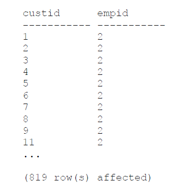
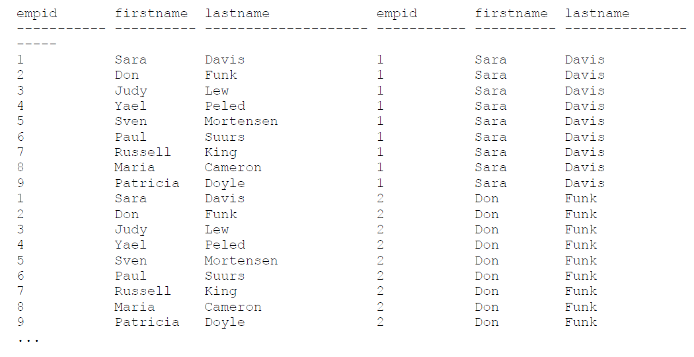
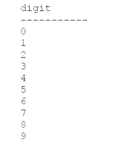

# Chapter 1. Background to T-SQL querying and programming

# Chapter 2. Single-table queries

# Chapter 3. Joins

A JOIN table operator operates on two input tables. The three fundamental types of joins:
* cross joins; 
* inner joins; 
* outer joins. 

These three types of joins differ in how they apply their logical query processing phases; each type applies a different set of phases:
* Cross join applies only one phase — Cartesian Product;
* Inner join applies two phases — Cartesian Product and Filter;
* Outer join applies three phases — Cartesian Product, Filter, and Add Outer Rows.

## Cross joins

The cross join is the simplest type of join. It implements only one logical query processing phase - a Cartesian Product. This phase operates on the two tables provided as inputs and produces a Cartesian product of the two. That is, each row from one input is matched with all rows from the other. **So if you have m rows in one table and n rows in the other, you get m×n rows in the result.**

### ISO/ANSI SQL-92 syntax

The following query applies a cross join between the Customers and Employees tables:
```
SELECT C.custid, E.empid
FROM Sales.Customers AS C
CROSS JOIN HR.Employees AS E;
```

Because there are 91 rows in the Customers table and 9 rows in the Employees table, this query produces a result set with 819 rows, as shown here in abbreviated form:



### ISO/ANSI SQL-89 syntax

```
SELECT C.custid, E.empid
FROM Sales.Customers AS C, HR.Employees AS E;
```

I recommend using the SQL-92 syntax for reasons that will become clear after I explain inner and outer joins.

### Self cross joins

You can join multiple instances of the same table. This capability is known as a self join and is supported with all fundamental join types (cross joins, inner joins, and outer joins).

```
SELECT
E1.empid, E1.firstname, E1.lastname,
E2.empid, E2.firstname, E2.lastname
FROM HR.Employees AS E1
CROSS JOIN HR.Employees AS E2;
```



This query produces all possible combinations of pairs of employees. Because the Employees table has 9 rows, this query returns 81 rows.

### Producing tables of numbers

One situation in which cross joins can be handy is when they are used to produce a result set with a sequence of integers (1, 2, 3, and so on). Such a sequence of numbers is an extremely powerful tool that I use for many purposes. By using cross joins, you can produce the sequence of integers in a very efficient manner.

You can start by creating a table called Digits with a column called digit, and populate the table with 10 rows with the digits 0 through 9. Run the following code:
```
DROP TABLE IF EXISTS dbo.Digits;

CREATE TABLE dbo.Digits(digit INT NOT NULL PRIMARY KEY);

INSERT INTO dbo.Digits(digit)
VALUES (0),(1),(2),(3),(4),(5),(6),(7),(8),(9);

SELECT digit FROM dbo.Digits;
```

This code generates the following output:



Suppose you need to write a query that produces a sequence of integers in the range 1 through 1,000. You apply cross joins between three instances of the Digits table, each representing a different power of 10 (1, 10, 100). By multiplying three instances of the same table, each instance with 10 rows, you get a result set with 1,000 rows. Here’s the complete query:
```
SELECT D3.digit * 100 + D2.digit * 10 + D1.digit + 1 AS n
FROM dbo.Digits AS D1
CROSS JOIN dbo.Digits AS D2
CROSS JOIN dbo.Digits AS D3
ORDER BY n;
```


## Inner joins


# Chapter 4. Subqueries

# Chapter 5. Table expressions

# Chapter 6. Set operators

# Chapter 7. Beyond the fundamentals of querying

# Chapter 8. Data modification

# Chapter 9. Temporal tables

# Chapter 10. Transactions and concurrency

# Chapter 11. Programmable objects
