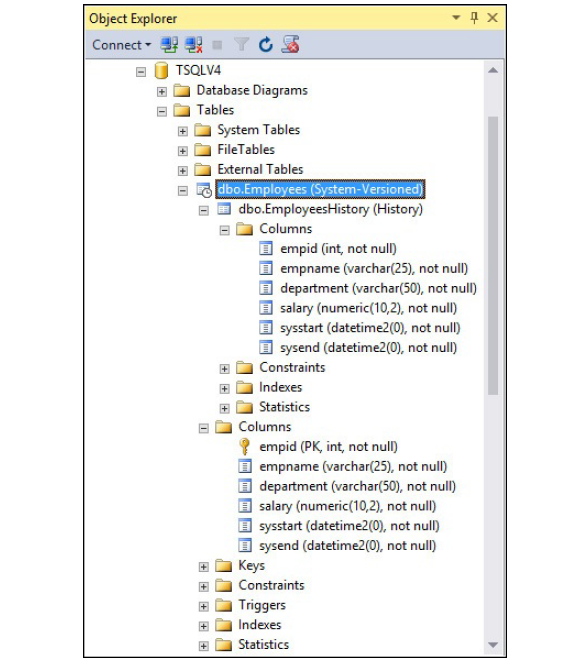
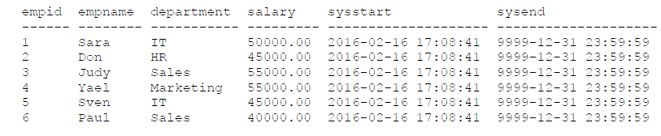
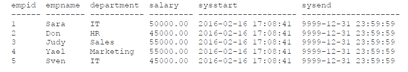
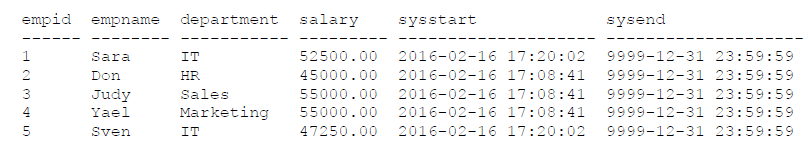
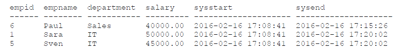
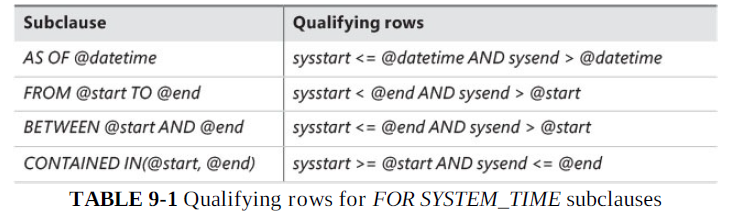
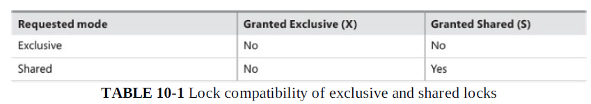

# Chapter 1. Background to T-SQL querying and programming

# Chapter 2. Single-table queries

# Chapter 3. Joins

A JOIN table operator operates on two input tables. The three fundamental types of joins:
* cross joins; 
* inner joins; 
* outer joins. 

These three types of joins differ in how they apply their logical query processing phases; each type applies a different set of phases:
* Cross join applies only one phase — Cartesian Product;
* Inner join applies two phases — Cartesian Product and Filter;
* Outer join applies three phases — Cartesian Product, Filter, and Add Outer Rows.

## Cross joins

The cross join is the simplest type of join. It implements only one logical query processing phase - a Cartesian Product. This phase operates on the two tables provided as inputs and produces a Cartesian product of the two. That is, each row from one input is matched with all rows from the other. **So if you have m rows in one table and n rows in the other, you get m×n rows in the result.**

### ISO/ANSI SQL-92 syntax

The following query applies a cross join between the Customers and Employees tables:
```
SELECT C.custid, E.empid
FROM Sales.Customers AS C
CROSS JOIN HR.Employees AS E;
```

Because there are 91 rows in the Customers table and 9 rows in the Employees table, this query produces a result set with 819 rows, as shown here in abbreviated form:


### ISO/ANSI SQL-89 syntax

```
SELECT C.custid, E.empid
FROM Sales.Customers AS C, HR.Employees AS E;
```

I recommend using the SQL-92 syntax for reasons that will become clear after I explain inner and outer joins.

### Self cross joins

You can join multiple instances of the same table. This capability is known as a self join and is supported with all fundamental join types (cross joins, inner joins, and outer joins).

```
SELECT
E1.empid, E1.firstname, E1.lastname,
E2.empid, E2.firstname, E2.lastname
FROM HR.Employees AS E1
CROSS JOIN HR.Employees AS E2;
```


This query produces all possible combinations of pairs of employees. Because the Employees table has 9 rows, this query returns 81 rows.

### Producing tables of numbers

One situation in which cross joins can be handy is when they are used to produce a result set with a sequence of integers (1, 2, 3, and so on). Such a sequence of numbers is an extremely powerful tool that I use for many purposes. By using cross joins, you can produce the sequence of integers in a very efficient manner.

You can start by creating a table called Digits with a column called digit, and populate the table with 10 rows with the digits 0 through 9. Run the following code:
```
DROP TABLE IF EXISTS dbo.Digits;

CREATE TABLE dbo.Digits(digit INT NOT NULL PRIMARY KEY);

INSERT INTO dbo.Digits(digit)
VALUES (0),(1),(2),(3),(4),(5),(6),(7),(8),(9);

SELECT digit FROM dbo.Digits;
```

This code generates the following output:


Suppose you need to write a query that produces a sequence of integers in the range 1 through 1,000. You apply cross joins between three instances of the Digits table, each representing a different power of 10 (1, 10, 100). By multiplying three instances of the same table, each instance with 10 rows, you get a result set with 1,000 rows. Here’s the complete query:
```
SELECT D3.digit * 100 + D2.digit * 10 + D1.digit + 1 AS n
FROM dbo.Digits AS D1
CROSS JOIN dbo.Digits AS D2
CROSS JOIN dbo.Digits AS D3
ORDER BY n;
```


## Inner joins

An inner join applies two logical query processing phases—it applies a Cartesian product between the two input tables like in a cross join, and then it filters rows based on a predicate you specify.

### ISO/ANSI SQL-92 syntax

Using the SQL-92 syntax, you specify the INNER JOIN keywords between the table names. **The INNER keyword is optional, because an inner join is the default.** So you can specify the JOIN keyword alone. **You specify the predicate that is used to filter rows in a designated clause called ON.** This predicate is also known as the join condition.

```
SELECT E.empid, E.firstname, E.lastname, O.orderid
FROM HR.Employees AS E
INNER JOIN Sales.Orders AS O
ON E.empid = O.empid;
```


Formal way to think of it is based on relational algebra. First, the join performs a Cartesian product between the two tables (9 employee rows × 830 order rows = 7,470 rows). Then, the join filters rows based on the predicate E.empid = O.empid, eventually returning 830 rows. As mentioned earlier, that’s just the logical way that the join is processed; in practice, physical processing of the query by the database engine can be different.

### ISO/ANSI SQL-89 syntax

```
SELECT E.empid, E.firstname, E.lastname, O.orderid
FROM HR.Employees AS E, Sales.Orders AS O
WHERE E.empid = O.empid;
```

**SQL-92 is safer.**

### Inner join safety

In the book, this section explains why it's better to use SQL-92.

### Composite joins

A composite join is simply a join where you need to match multiple attributes from each side. You usually need such a join when a primary key–foreign key relationship is based on more than one attribute. For example, suppose you have a foreign key defined on dbo.Table2, columns col1, col2, referencing dbo.Table1, columns col1, col2, and you need to write a query that joins the two based on this relationship. The FROM clause of the query would look like this:
```
FROM dbo.Table1 AS T1
INNER JOIN dbo.Table2 AS T2
ON T1.col1 = T2.col1
AND T1.col2 = T2.col2
```

### Non-equi joins

When a join condition involves only an equality operator, the join is said to be an **equi join**. When a join condition involves any operator besides equality, the join is said to be a **non-equi join**. As an example of a non-equi join, the following query joins two instances of the Employees table to produce unique pairs of employees:
```
SELECT
E1.empid, E1.firstname, E1.lastname,
E2.empid, E2.firstname, E2.lastname
FROM HR.Employees AS E1
INNER JOIN HR.Employees AS E2
ON E1.empid < E2.empid;
```

Notice the predicate specified in the ON clause. The purpose of the query is to produce unique pairs of employees. Had a cross join been used, the result would have included self pairs (for example, 1 with 1) and also mirrored pairs (for example, 1 with 2 and also 2 with 1). Using an inner join with a join condition that says the key on the left side must be smaller than the key on the right side eliminates the two inapplicable cases. Self pairs are eliminated because both sides are equal. With mirrored pairs, only one of the two cases qualifies because, of the two cases, only one will have a left key that is smaller than the right key. In this example, of the 81 possible pairs of employees a cross join would have returned, this query returns the 36 unique pairs shown here:


If it’s still not clear to you what this query does, try to process it one step at a time with a smaller set of employees. For example, suppose the Employees table contained only employees 1, 2, and 3. First, produce the Cartesian product of two instances of the table:


Next, filter the rows based on the predicate E1.empid < E2.empid, and you are left with only three rows:


### Multi-join queries

A join table operator operates only on two tables, but a single query can have multiple joins. In general, when more than one table operator appears in the FROM clause, the table operators are logically processed from left to right. That is, the result table of the first table operator is treated as the left input to the second table operator; the result of the second table operator is treated as the left input to the third table operator; and so on. **So if there are multiple joins in the FROM clause, the first join operates on two base tables, but all other joins get the result of the preceding join as their left input.** With cross joins and inner joins, the database engine can (and often does) internally rearrange join ordering for optimization purposes because it won’t have an impact on the correctness of the result of the query.

## Outer joins

### Fundamentals of outer joins

Outer joins were introduced in SQL-92 and, unlike inner joins and cross joins, have only one standard syntax—the one in which the JOIN keyword is specified between the table names and the join condition is specified in the ON clause. **Outer joins apply the two logical processing phases that inner joins apply (Cartesian Product and the ON filter), plus a third phase called Adding Outer Rows that is unique to this type of join.**

In an outer join, you mark a table as a “preserved” table by using the keywords LEFT OUTER JOIN, RIGHT OUTER JOIN, or FULL OUTER JOIN between the table names. The OUTER keyword is optional. The **LEFT keyword means that the rows of the left table** (the one to the left of the JOIN keyword) **are preserved**; the **RIGHT keyword means that the rows in the right table are preserved; and the FULL keyword means that the rows in both the left and right tables are preserved.** The third logical query processing phase of an outer join identifies the rows from the preserved table that did not find matches in the other table based on the ON predicate. This phase adds those rows to the result table produced by the first two phases of the join, and it uses NULLs as placeholders for the attributes from the nonpreserved side of the join in those outer rows.

A good way to understand outer joins is through an example. The following query joins the Customers and Orders tables, based on a match between the customer ’s customer ID and the order ’s customer ID, to return customers and their orders. The join type is a left outer join; therefore, the query also returns customers who did not place any orders:
```
SELECT C.custid, C.companyname, O.orderid
FROM Sales.Customers AS C
LEFT OUTER JOIN Sales.Orders AS O
ON C.custid = O.custid;
```

This query returns the following output, shown here in abbreviated form:


Two customers in the Customers table did not place any orders. Their IDs are 22 and 57. Observe that in the output of the query, both customers are returned with NULLs in the attributes from the Orders table. Logically, the rows for these two customers were discarded by the second phase of the join (the filter based on the ON predicate), but the third phase added those as outer rows.

A common question about outer joins that is the source of a lot of confusion is whether to specify a predicate in the ON or WHERE clause of a query. You can see that with respect to rows from the preserved side of an outer join, the **filter based on the ON predicate is not final.** In other words, the ON predicate does not determine whether a row will show up in the output, only whether it will be matched with rows from the other side. So when you need to express a predicate that is not final—meaning a predicate that determines which rows to match from the nonpreserved side — specify the predicate in the ON clause. **When you need a filter to be applied after outer rows are produced, and you want the filter to be final, specify the predicate in the WHERE clause.** **The WHERE clause is processed after the FROM clause — specifically, after all table operators have been processed and (in the case of outer joins) after all outer rows have been produced.** Also, the WHERE clause is final with respect to rows that it filters out, unlike the ON clause. To recap, in the ON clause you specify nonfinal, or matching, predicates. In the WHERE clause you specify final, or filtering, predicates.

Suppose you need to return only customers who did not place any orders or, more technically speaking, you need to return only outer rows. You can use the previous query as your basis, adding a WHERE clause that filters only outer rows. Remember that outer rows are identified by the NULLs in the attributes from the nonpreserved side of the join. So you can filter only the rows in which one of the attributes on the nonpreserved side of the join is NULL, like this:
```
SELECT C.custid, C.companyname
FROM Sales.Customers AS C
LEFT OUTER JOIN Sales.Orders AS O
ON C.custid = O.custid
WHERE O.orderid IS NULL;
```

### Beyond the fundamentals of outer joins

#### Including missing values

You can use outer joins to identify and include missing values when querying data. For example, suppose you need to query all orders from the Orders table in the TSQLV4 database. You need to ensure that you get at least one row in the output for each date in the range January 1, 2014 through December 31, 2016. You don’t want to do anything special with dates within the range that have orders, but you do want the output to include the dates with no orders, with NULLs as placeholders in the attributes of the order.

To produce a sequence of dates in a given range, I usually use an auxiliary table of numbers. I create a table called dbo.Nums with a column called n, and populate it with a sequence of integers (1, 2, 3, and so on). I find that an auxiliary table of numbers is an extremely powerful general-purpose tool I end up using to solve many problems.

As the first step in the solution, you need to produce a sequence of all dates in the requested range. You can achieve this by querying the Nums table and filtering as many numbers as the number of days in the requested date range. You can use the DATEDIFF function to calculate that number. By adding n – 1 days to the starting point of the date range (January 1, 2014), you get the actual date in the sequence. Here’s the solution query:
```
SELECT DATEADD(day, n-1, CAST('20140101' AS DATE)) AS orderdate
FROM dbo.Nums
WHERE n <= DATEDIFF(day, '20140101', '20161231') + 1
ORDER BY orderdate;
```

This query returns a sequence of all dates in the range January 1, 2014 through December 31, 2016, as shown here in abbreviated form:


The next step is to extend the previous query, adding a left outer join between Nums and the Orders tables. The join condition compares the order date produced from the Nums table and the orderdate from the Orders table by using the expression DATEADD(day, Nums.n – 1, CAST(‘20140101’ AS DATE)) like this:
```
SELECT DATEADD(day, Nums.n - 1, CAST('20140101' AS DATE)) AS orderdate,
O.orderid, O.custid, O.empid
FROM dbo.Nums
LEFT OUTER JOIN Sales.Orders AS O
ON DATEADD(day, Nums.n - 1, CAST('20140101' AS DATE)) = O.orderdate
WHERE Nums.n <= DATEDIFF(day, '20140101', '20161231') + 1
ORDER BY orderdate;
```


#### Filtering attributes from the nonpreserved side of an outer join

**When you need to review code involving outer joins to look for logical bugs, one of the things you should examine is the WHERE clause. If the predicate in the WHERE clause refers to an attribute from the nonpreserved side of the join using an expression in the form \<attribute\> \<operator\> \<value\>, it’s usually an indication of a bug**. This is because attributes from the nonpreserved side of the join are NULLs in outer rows, and an expression in the form NULL <operator> <value> yields UNKNOWN (unless it’s the IS NULL operator explicitly looking for NULLs).
  
Consider the following query:
```
SELECT C.custid, C.companyname, O.orderid, O.orderdate
FROM Sales.Customers AS C
LEFT OUTER JOIN Sales.Orders AS O
ON C.custid = O.custid
WHERE O.orderdate >= '20160101';
```

The query performs a left outer join between the Customers and Orders tables. Prior to applying the WHERE filter, the join operator returns inner rows for customers who placed orders and outer rows for customers who didn’t place orders, with NULLs in the order attributes. The predicate O.orderdate >= ‘20160101’ in the WHERE clause evaluates to UNKNOWN for all outer rows, because those have a NULL in the O.orderdate attribute. All outer rows are eliminated by the WHERE filter.

#### Using outer joins in a multi-join query

**Table operators are logically evaluated from left to right. Rearranging the order in which outer joins are processed might result in different output, so you cannot rearrange them at will.** 

Some interesting bugs have to do with the logical order in which outer joins are processed. For example, a common bug could be considered a variation of the bug in the previous section. Suppose you write a multi-join query with an outer join between two tables, followed by an inner join with a third table. If the predicate in the inner join’s ON clause compares an attribute from the nonpreserved side of the outer join and an attribute from the third table, all outer rows are discarded. Remember that outer rows have NULLs in the attributes from the nonpreserved side of the join, and comparing a NULL with anything yields UNKNOWN. UNKNOWN is filtered out by the ON filter. In other words, such a predicate nullifies the outer join, effectively turning it into an inner join. For example, consider the following query:
```
SELECT C.custid, O.orderid, OD.productid, OD.qty
FROM Sales.Customers AS C
LEFT OUTER JOIN Sales.Orders AS O
ON C.custid = O.custid
INNER JOIN Sales.OrderDetails AS OD
ON O.orderid = OD.orderid;
```

The first join is an outer join returning customers and their orders and also customers who did not place any orders. The outer rows representing customers with no orders have NULLs in the order attributes. The second join matches order lines from the OrderDetails table with rows from the result of the first join, based on the predicate O.orderid = OD.orderid; however, in the rows representing customers with no orders, the O.orderid attribute is NULL. Therefore, the predicate evaluates to UNKNOWN, and those rows are discarded. The output shown here in abbreviated form doesn’t contain the customers 22 and 57, the two customers who did not place orders.

There are several ways to get around the problem if you want to return customers with no orders in the output. One option is to use a left outer join in the second join as well:
```
SELECT C.custid, O.orderid, OD.productid, OD.qty
FROM Sales.Customers AS C
LEFT OUTER JOIN Sales.Orders AS O
ON C.custid = O.custid
LEFT OUTER JOIN Sales.OrderDetails AS OD
ON O.orderid = OD.orderid;
```

This way, the outer rows produced by the first join aren’t filtered out, as you can see in the output shown here in abbreviated form:


This solution is usually not a good one because it preserves all rows from Orders. What if there were rows in Orders that didn’t have matches in OrderDetails, and you wanted those rows to be discarded. What you want is an inner join between Orders and OrderDetails.

A second option is to use an inner join between Orders and OrderDetails, and then join the result with the Customers table using a right outer join:
```
SELECT C.custid, O.orderid, OD.productid, OD.qty
FROM Sales.Orders AS O
INNER JOIN Sales.OrderDetails AS OD
ON O.orderid = OD.orderid
RIGHT OUTER JOIN Sales.Customers AS C
ON O.custid = C.custid;
```

A third option is to use parentheses to turn the inner join between Orders and OrderDetails into an independent unit. This way, you can apply a left outer join between the Customers table and that unit. The query would look like this:
```
SELECT C.custid, O.orderid, OD.productid, OD.qty
FROM Sales.Customers AS C
LEFT OUTER JOIN (Sales.Orders AS O INNER JOIN Sales.OrderDetails AS OD ON O.orderid = OD.orderid)
ON C.custid = O.custid;
```

# Chapter 4. Subqueries

# Chapter 5. Table expressions

# Chapter 6. Set operators

# Chapter 7. Beyond the fundamentals of querying

# Chapter 8. Data modification

# Chapter 9. Temporal tables

When you modify data in tables, normally you lose any trace of the premodified state of the rows. You can access only the current state. What if you need to be able to access historical states of the data? Perhaps you need these states for auditing, point-in-time analysis, comparing current states with older states, restoring an older state of rows because of accidental deletion or updating, and so on.
 
Starting with Microsoft SQL Server 2016, you can use a built-in feature called system-versioned temporal tables. A system-versioned temporal table has two columns representing the validity period of the row, plus a linked history table with a mirrored schema holding older states of modified rows. When you need to modify data, you interact with the current table, issuing normal datamodification statements. SQL Server automatically updates the period columns and moves older versions of rows to the history table. When you need to query data, if you want the current state, you simply query the current table as usual. If you need access to older states, you still query the current table, but you add a clause indicating that you want to see an older state or period of time. SQL Server queries the current and history tables behind the scenes as needed.
The SQL standard supports three types of temporal tables: 
* **System-versioned temporal tables** rely on the system transaction time to define the validity period of a row.
* **Application-time period tables** rely on the application’s definition of the validity period of a row. This means you can define a validity period that will become effective in the future.
* **Bitemporal** combines the two types just mentioned (transaction and valid time).

**SQL Server 2016 supports only system-versioned temporal tables.** 

## Creating tables

When you create a system-versioned temporal table, you need to make sure the table definition has all the following elements:
* A primary key
* Two columns defined as DATETIME2 with any precision, which are non-nullable and represent the start and end of the row’s validity period in the UTC time zone A start column that should be marked with the option GENERATED ALWAYS AS ROW START
* An end column that should be marked with the option GENERATED ALWAYS AS ROW END
* A designation of the period columns with the option PERIOD FOR SYSTEM_TIME (<startcol>, <endcol>)
* The table option SYSTEM_VERSIONING, which should be set to ON
* A linked history table (which SQL Server can create for you) to hold the past states of modified rows

Run the following code to create a system-versioned temporal table called Employees and a linked history table called EmployeesHistory:
```
USE TSQLV4;
-- Create Employees table
CREATE TABLE dbo.Employees(
empid INT NOT NULL CONSTRAINT PK_Employees PRIMARY KEY NONCLUSTERED,
empname VARCHAR(25) NOT NULL,
department VARCHAR(50) NOT NULL,
salary NUMERIC(10, 2) NOT NULL,
sysstart DATETIME2(0) GENERATED ALWAYS AS ROW START HIDDEN NOT NULL,
sysend DATETIME2(0) GENERATED ALWAYS AS ROW END HIDDEN NOT NULL,
PERIOD FOR SYSTEM_TIME (sysstart, sysend),
INDEX ix_Employees CLUSTERED(empid, sysstart, sysend)) WITH (SYSTEM_VERSIONING = ON (HISTORY_TABLE = dbo.EmployeesHistory ));
```

SQL Server creates the history table with a mirrored schema of the current table, but with the following differences:
* No primary key
* A clustered index on (<endcol>, <startcol>), with page compression if possible
* Period columns that are not marked with any special options, like GENERATED ALWAYS AS ROW START/END or HIDDEN
* No designation of the period columns with the option PERIOD FOR SYSTEM_TIME
* The history table is not marked with the option SYSTEM_VERSIONING

If you browse the object tree in Object Explorer in SQL Server Management Studio (SSMS), you’ll find the Employees table marked as (System-Versioned) and below it the linked EmployeesHistory table marked as (History).



You can also turn an existing nontemporal table that already has data into a temporal one. For example, suppose you have a table called Employees in your database and you want to turn it into a temporal table. You first alter the table, adding the period columns and designating them as such using the following code:
```
ALTER TABLE dbo.Employees ADD sysstart DATETIME2(0) GENERATED ALWAYS AS ROW START HIDDEN NOT NULL CONSTRAINT DFT_Employees_sysstart DEFAULT('19000101'),
sysend DATETIME2(0) GENERATED ALWAYS AS ROW END HIDDEN NOT NULL CONSTRAINT DFT_Employees_sysend DEFAULT('99991231 23:59:59'),
PERIOD FOR SYSTEM_TIME (sysstart, sysend);
```

Notice the defaults that set the validity period for the existing rows. You decide what you want the start time of the validity period to be, as long as it’s not in the future. The end has to be the maximum supported value in the type.

You then alter the table to enable system versioning and to link it to a history table using the following code (again, don’t actually run this code in our case):
```
ALTER TABLE dbo.Employees SET ( SYSTEM_VERSIONING = ON ( HISTORY_TABLE = dbo.EmployeesHistory ) );
```

Remember that if you marked the period columns as hidden, when you query the table with ``SELECT *`` SQL Server won’t return them. Try this with our Employees table by running the following code:
```
SELECT * FROM dbo.Employees;
```

You get the following output:
```
empid empname department salary
------ -------- ----------- ---------
```

If you do want to return the period columns, mention them explicitly in the SELECT list, like so:
```
SELECT empid, empname, department, salary, sysstart, sysend FROM dbo.Employees;
```

```
empid empname department salary sysstart sysend
------ -------- ----------- --------- -------------------- --------------------
```

## Modifying data

Modifying temporal tables is similar to modifying regular tables. You modify only the current table with INSERT, UPDATE, DELETE, and MERGE statements. (There’s no support for TRUNCATE in SQL Server 2016 temporal tables.) Behind the scenes, SQL Server updates the period columns and moves rows to the history table as needed. Remember that the period columns reflect the validity period of the row in the UTC time zone.

In the following examples, I’ll demonstrate modifications against the Employees table and mention the point in time in the UTC time zone at which I apply them. Run the following code to add a few rows to the Employees table (the time was 2016-02-16 17:08:41 when I ran it):
```
INSERT INTO dbo.Employees(empid, empname, department, salary)
VALUES
(1, 'Sara', 'IT' , 50000.00),
(2, 'Don' , 'HR' , 45000.00),
(3, 'Judy', 'Sales' , 55000.00),
(4, 'Yael', 'Marketing', 55000.00),
(5, 'Sven', 'IT' , 45000.00),
(6, 'Paul', 'Sales' , 40000.00);
```

Query the data in both the current and history tables to see what SQL Server did behind the scenes:
```
SELECT empid, empname, department, salary, sysstart, sysend FROM dbo.Employees;
```

```
SELECT empid, empname, department, salary, sysstart, sysend FROM dbo.EmployeesHistory;
```

The current table has the six new rows, with the sysstart column reflecting the modification time and sysend holding the maximum possible value in the type with the chosen precision:



The validity period indicates that the rows are considered valid since the time they were inserted and with no end limit.
The history table is empty at this point:
```
empid empname department salary sysstart sysend
------ -------- ----------- --------- -------------------- --------------------
```

Run the following code to delete the row where the employee ID is 6 (the time was 2016-02-16 17:15:26 when I ran it):
```
DELETE FROM dbo.Employees WHERE empid = 6;
```

SQL Server moves the deleted row to the history table, setting its sysend value to the deletion time. Following is the content of the current table at this point:


Following is the content of the history table:
```
empid empname department salary sysstart sysend
------ -------- ----------- --------- -------------------- --------------------
6 Paul Sales 40000.00 2016-02-16 17:08:41 2016-02-16 17:15:26
```

An update of a row is treated as a delete plus an insert. SQL Server moves the old version of the row to the history table with the transaction time as the period end time, and it keeps the current version of the row in the current table with the transaction time as the period start time and the maximum value in the type as the period end time.
For example, run the following update to increase the salary of all IT employees by 5 percent (the time was 2016-02-16 17:20:02 when I ran it):
```
UPDATE dbo.Employees
SET salary *= 1.05
WHERE department = 'IT';
```

Following is the content of the current table after the update:


Following is the content of the history table:


## Querying data

Querying data in temporal tables is simple and elegant. If you want to query the current state of the data, you simply query the current table as you would query a normal table. If you want to query a past state of the data, you still query the current table, but you add a clause called FOR SYSTEM_TIME and a subclause that indicates the validity point or period of time you’re interested in.

Before examining the specifics of querying temporal tables, run the following code to recreate the Employees and EmployeesHistory tables and to populate them with the same sample data as in my environment, including the values in the period columns:
```
USE TSQLV4;
-- Drop tables if exist
IF OBJECT_ID(N'dbo.Employees', N'U') IS NOT NULL
BEGIN
  IF OBJECTPROPERTY(OBJECT_ID(N'dbo.Employees', N'U'), N'TableTemporalType') = 2 ALTER TABLE dbo.Employees SET ( SYSTEM_VERSIONING = OFF );
  DROP TABLE IF EXISTS dbo.EmployeesHistory, dbo.Employees;
END;
GO

-- Create and populate Employees table
CREATE TABLE dbo.Employees
(
empid INT NOT NULL CONSTRAINT PK_Employees PRIMARY KEY NONCLUSTERED,
empname VARCHAR(25) NOT NULL,
department VARCHAR(50) NOT NULL,
salary NUMERIC(10, 2) NOT NULL,
sysstart DATETIME2(0) NOT NULL,
sysend DATETIME2(0) NOT NULL,
INDEX ix_Employees CLUSTERED(empid, sysstart, sysend)
);

INSERT INTO dbo.Employees(empid, empname, department, salary, sysstart, sysend)
VALUES
(1 , 'Sara', 'IT' , 52500.00, '2016-02-16 17:20:02', '9999-12-31 23:59:59'),
(2 , 'Don' , 'HR' , 45000.00, '2016-02-16 17:08:41', '9999-12-31 23:59:59'),
(3 , 'Judy', 'IT' , 55000.00, '2016-02-16 17:28:10', '9999-12-31 23:59:59'),
(4 , 'Yael', 'Marketing', 55000.00, '2016-02-16 17:08:41', '9999-12-31 23:59:59'),
(5 , 'Sven', 'Sales' , 47250.00, '2016-02-16 17:28:10', '9999-12-31 23:59:59');

-- Create and populate EmployeesHistory table
CREATE TABLE dbo.EmployeesHistory
(
empid INT NOT NULL,
empname VARCHAR(25) NOT NULL,
department VARCHAR(50) NOT NULL,
salary NUMERIC(10, 2) NOT NULL,
sysstart DATETIME2(0) NOT NULL,
sysend DATETIME2(0) NOT NULL,
INDEX ix_EmployeesHistory CLUSTERED(sysend, sysstart) WITH (DATA_COMPRESSION = PAGE)
);

INSERT INTO dbo.EmployeesHistory(empid, empname, department, salary, sysstart,
sysend) VALUES
(6 , 'Paul', 'Sales' , 40000.00, '2016-02-16 17:08:41', '2016-02-16 17:15:26'),
(1 , 'Sara', 'IT' , 50000.00, '2016-02-16 17:08:41', '2016-02-16 17:20:02'),
(5 , 'Sven', 'IT' , 45000.00, '2016-02-16 17:08:41', '2016-02-16 17:20:02'),
(3 , 'Judy', 'Sales' , 55000.00, '2016-02-16 17:08:41', '2016-02-16 17:28:10'),
(5 , 'Sven', 'IT' , 47250.00, '2016-02-16 17:20:02', '2016-02-16 17:28:10');

-- Enable system versioning
ALTER TABLE dbo.Employees ADD PERIOD FOR SYSTEM_TIME (sysstart, sysend);
ALTER TABLE dbo.Employees ALTER COLUMN sysstart ADD HIDDEN;
ALTER TABLE dbo.Employees ALTER COLUMN sysend ADD HIDDEN;
ALTER TABLE dbo.Employees SET ( SYSTEM_VERSIONING = ON ( HISTORY_TABLE = dbo.EmployeesHistory ) );
```

As mentioned, if you want to query the current state of the rows, simply query the current table:

```
SELECT *
FROM dbo.Employees;
```

This query generates the following output:
```
empid empname department salary
------ -------- ----------- ---------
1 Sara IT 52500.00
2 Don HR 45000.00
3 Judy IT 55000.00
4 Yael Marketing 55000.00
5 Sven Sales 47250.00
```

Remember that because the period columns are defined as hidden, a SELECT * query doesn’t return them. Here I use SELECT * for illustration purposes, but **I remind you that the best practice is to be explicit about the column list in production code.**

If you want to see a past state of the data, correct to a certain point or period of time, you query the current table followed by the FOR SYSTEM_TIME clause, plus a subclause that indicates more specifics. SQL Server will retrieve the data from both the current and history tables as needed.

```
SELECT *
FROM dbo.Employees FOR SYSTEM_TIME AS OF '2016-02-16 17:00:00';
```
You’ll get an empty result because the first insert you issued against the table happened at 2016-02-16 17:08:41.

Query the table again, this time as of 2016-02-16 17:10:00:
```
SELECT *
FROM dbo.Employees FOR SYSTEM_TIME AS OF '2016-02-16 17:10:00';
```

You get the following output:
```
empid empname department salary
------ -------- ----------- ---------
2 Don HR 45000.00
4 Yael Marketing 55000.00
6 Paul Sales 40000.00
1 Sara IT 50000.00
5 Sven IT 45000.00
3 Judy Sales 55000.00
```

You can also query multiple instances of the same table, comparing different states of the data at different points in time. For example, the following query returns the percentage of increase of salary of employees who had a salary increase between two different points in time:
```
SELECT T2.empid, T2.empname,
CAST( (T2.salary / T1.salary - 1.0) * 100.0 AS NUMERIC(10, 2) ) AS pct
FROM dbo.Employees FOR SYSTEM_TIME AS OF '2016-02-16 17:10:00' AS T1
INNER JOIN dbo.Employees FOR SYSTEM_TIME AS OF '2016-02-16 17:25:00' AS T2
ON T1.empid = T2.empid
AND T2.salary > T1.salary;
```

```
empid empname pct
------ -------- -----
1 Sara 5.00
5 Sven 5.00
```

There are several ways to define time frame:
* The subclause FROM @start TO @end returns the rows that satisfy the predicate **sysstart < @end AND sysend > @start**. Example:
```
SELECT empid, empname, department, salary, sysstart, sysend
FROM dbo.Employees
FOR SYSTEM_TIME FROM '2016-02-16 17:15:26' TO '2016-02-16 17:20:02';
```
* If you need the input @end value to be inclusive, use the BETWEEN subclause instead of the FROM subclause. The syntax of the BETWEEN subclause is **BETWEEN @start AND @end**, and it returns the rows that satisfy the predicate sysstart <= @end AND sysend > @start. Example:
```
SELECT empid, empname, department, salary, sysstart, sysend
FROM dbo.Employees
FOR SYSTEM_TIME BETWEEN '2016-02-16 17:15:26' AND '2016-02-16 17:20:02';
```
* The subclause FOR SYSTEM_TIME CONTAINED IN(@start, @end) returns the rows that satisfy the predicate **sysstart >= @start AND sysend <= @end**. Example:
```
SELECT empid, empname, department, salary, sysstart, sysend
FROM dbo.Employees
FOR SYSTEM_TIME CONTAINED IN('2016-02-16 17:00:00', '2016-02-16 18:00:00');
```
To summarize:



T-SQL also supports the ALL subclause, which simply returns all rows from both tables. The following query demonstrates the use of this subclause:
```
SELECT empid, empname, department, salary, sysstart, sysend
FROM dbo.Employees FOR SYSTEM_TIME ALL;
```

## Conclusion

SQL Server ’s support for system-versioned temporal tables is very powerful. In the past, many systems implemented their own customized solutions to address the same need. With built-in support, the solutions are much simpler and more efficient.

# Chapter 10. Transactions and concurrency

## Transactions

A transaction is a unit of work that might include multiple activities that query and modify data and that can also change the data definition.

You can define transaction boundaries either explicitly or implicitly. You define the beginning of a transaction explicitly with a BEGIN TRAN (or BEGIN TRANSACTION) statement. You define the end of a transaction explicitly with a COMMIT TRAN statement if you want to commit it and with a ROLLBACK TRAN (or ROLLBACK TRANSACTION) statement if you want to undo its changes. Here’s an example of marking the boundaries of a transaction with two INSERT statements:
```
BEGIN TRAN;
  INSERT INTO dbo.T1(keycol, col1, col2) VALUES(4, 101, 'C');
  INSERT INTO dbo.T2(keycol, col1, col2) VALUES(4, 201, 'X');
COMMIT TRAN;
```

If you do not mark the boundaries of a transaction explicitly, by default, SQL Server treats each individual statement as a transaction; in other words, **by default, SQL Server automatically commits the transaction at the end of each statement.**

Transactions have four properties—atomicity, consistency, isolation, and durability—abbreviated with the acronym ACID:
* **Atomicity**. A transaction is an atomic unit of work. Either all changes in the transaction take place or none do. Some errors, such as primary-key violations and lock-expiration timeouts are not considered severe enough to justify an automatic rollback of the transaction.
* **Consistency**. The term consistency refers to the state of the data that the relational database management system (RDBMS) gives you access to as concurrent transactions modify and query it. Consistency also refers to the fact that the database must adhere to all integrity rules that have been defined within it by constraints (such as primary keys, unique constraints, and foreign keys).
* **Isolation**. Isolation ensures that transactions access only consistent data. You control what consistency means to your transactions through a mechanism called isolation levels. With disk-based tables, SQL Server supports two different models to handle isolation: one based purely on locking, and another based on a combination of locking and row versioning.
* **Durability**. Data changes are always written to the database’s transaction log on disk before they are written to the data portion of the database on disk. After the commit instruction is recorded in the transaction log on disk, the transaction is considered durable even if the change hasn’t yet made it to the data portion on disk. When the system starts, either normally or after a system failure, SQL Server inspects the transaction log of each database and runs a recovery process with two phases: redo and undo.

## Locks and blocking

By default, a **SQL Server box product uses a pure locking model to enforce the isolation property of transactions. Azure SQL Database uses the row-versioning model by default. If you’re testing the code in this chapter on Azure SQL Database.**

### Locks

Locks are control resources obtained by a transaction to guard data resources, preventing conflicting or incompatible access by other transactions.

#### Lock modes and compatibility

As you start learning about transactions and concurrency, you should first familiarize yourself with two main **lock modes: exclusive and shared.**

When you try to **modify data, your transaction requests an exclusive lock on the data resource, regardless of your isolation level.** If granted, the exclusive lock is held until the end of the transaction. Exclusive locks means that if one transaction modifies rows, until the transaction is completed, another transaction cannot modify the same rows. However, whether another transaction can read the same rows or not depends on its isolation level.

As for reading data, the defaults are different for a SQL Server box product and Azure SQL Database. In SQL Server, the **default isolation level is called READ COMMITTED.** In this isolation, when you try to read data, by default your transaction requests a shared lock on the data resource and releases the lock as soon as the read statement is done with that resource. This lock mode is called “shared” because multiple transactions can hold shared locks on the same data resource simultaneously.

In Azure SQL Database, the default isolation level is called **READ COMMITTED SNAPSHOT.** Instead of relying only on locking, this isolation level relies on a combination of locking and row versioning. Under this isolation level, readers do not require shared locks, and therefore they never wait; they rely on the row-versioning technology to provide the expected isolation. In practical terms, this means that under the READ COMMITTED isolation level, if a transaction modifies rows, until the transaction completes, another transaction can’t read the same rows. This approach to concurrency control is known as the pessimistic concurrency approach. Under the READ COMMITTED SNAPSHOT isolation level, if a transaction modifies rows, another transaction trying to read the data will get the last committed state of the rows that was available when the statement started. This approach to concurrency control is known as the optimistic concurrency approach.

The columns represent granted lock modes, and the rows represent requested lock modes.



A “No” in the intersection means that the locks are incompatible and the requested mode is denied; the requester must wait. A “Yes” in the intersection means that the locks are compatible and the requested mode is accepted.

The following summarizes lock interaction between transactions in simple terms: data that was modified by one transaction can neither be modified nor read by another transaction until the first transaction finishes. And while data is being read by one transaction, it cannot be modified by another.

#### Lockable resource types

SQL Server can lock different types of resources. Those include rows (RID in a heap, key in an index) pages, objects (for example, tables), databases, and others. Rows reside within pages, and pages are the physical data blocks that contain table or index data.

To obtain a lock on a certain resource type, your transaction must first obtain intent locks of the same mode on higher levels of granularity. For example, to get an exclusive lock on a row, your transaction must first acquire intent exclusive locks on the table and the page where the row resides. Similarly, to get a shared lock on a certain level of granularity, your transaction first needs to acquire intent shared locks on higher levels of granularity. The purpose of intent locks is to efficiently detect incompatible lock requests on higher levels of granularity and prevent the granting of those. For example, if one transaction holds a lock on a row and another asks for an incompatible lock mode on the whole page or table where that row resides, it’s easy for SQL Server to identify the conflict because of the intent locks that the first transaction acquired on the page and table.

SQL Server determines dynamically which resource types to lock. **When SQL Server estimates that a transaction will interact with a small number of rows, it tends to use row locks. With larger numbers of rows, SQL Server tends to use page locks.**

#### Troubleshooting blocking

When one transaction holds a lock on a data resource and another transaction requests an incompatible lock on the same resource, the request is blocked and the requester enters a wait state. By default, the blocked request keeps waiting until the blocker releases the interfering lock. You can define a lock expiration time-out in your session if you want to restrict the amount of time that a blocked request waits before it times out.
Example demonstrates a blocking situation and how to troubleshoot it. I’m assuming that you’re running under the isolation level READ COMMITTED. Open three separate query windows in SQL Server Management Studio. (For this example, I’ll refer to them as Connection 1, Connection 2, and Connection 3.) Make sure that in all of them you are connected to the sample database TSQLV4:
```
USE TSQLV4;
```

Run the following code in Connection 1 to update a row in the Production.Products table, adding 1.00 to the current unit price of 19.00 for product 2:
```
BEGIN TRAN;
  UPDATE Production.Products SET unitprice += 1.00 WHERE productid = 2;
```
To update the row, your session had to acquire an exclusive lock, and if the update was successful, SQL Server granted your session the lock. Recall that exclusive locks are kept until the end of the transaction, and because the transaction remains open, the lock is still held. Run the following code in Connection 2 to try to query the same row:
```
SELECT productid, unitprice FROM Production.Products WHERE productid = 2;
```
Your session needs a shared lock to read the data, but because the row is exclusively locked by the other session, and a shared lock is incompatible with an exclusive lock, your session is blocked and has to wait.

**Note for myself:**
The remaining part of the section is walkthrough of how one would troubleshoot such a situation at DB level.

### Isolation levels

Isolation levels determine the level of consistency you get when you interact with data. In the default isolation level in a box product, **a reader uses shared locks on the target resources and a writer uses exclusive locks.** You **cannot control the way writers behave in terms of the locks they acquire and the duration of the locks, but you can control the way readers behave.** Also, as a result of controlling the behavior of readers, you can have an implicit influence on the behavior of writers. You do so by **setting the isolation level, either at the session level with a session option or at the query level with a table hint.**

SQL Server supports four isolation levels that are based on the pure locking model: 
* SERIALIZABLE;
* REPEATABLE READ;
* READ COMMITTED (the default in a SQL Server box product);
* READ UNCOMMITTED.

You can set the isolation level of the whole session by using the following command:
```
SET TRANSACTION ISOLATION LEVEL <isolation name>;
```

You can use a table hint to set the isolation level of a query:
```
SELECT ... FROM <table> WITH (<isolationname>);
```

With the first four isolation levels, the higher the isolation level, the stricter the locks are that readers request and the longer their duration is; therefore, the higher the isolation level is, the higher the consistency is and the lower the concurrency is.

#### The READ UNCOMMITTED isolation level

READ UNCOMMITTED is the lowest available isolation level. In this isolation level, **a reader doesn’t ask for a shared lock.** A reader that doesn’t ask for a shared lock can never be in conflict with a writer that is holding an exclusive lock. This means that the reader can read uncommitted changes (also known as dirty reads). It also means the reader won’t interfere with a writer that asks for an exclusive lock. In other words, **a writer can change data while a reader that is running under the READ UNCOMMITTED isolation level reads data.**

To see how an uncommitted read (dirty read) works, open two query windows. (I’ll refer to them as Connection 1 and Connection 2.) Make sure that in all connections your database context is that of the sample database TSQLV4. To avoid confusion, make sure that this is the only activity in the instance.
Run the following code in Connection 1 to open a transaction, update the unit price of product 2 by adding 1.00 to its current price (19.00), and then query the product’s row:
```
BEGIN TRAN;
  UPDATE Production.Products SET unitprice += 1.00 WHERE productid = 2;
  SELECT productid, unitprice FROM Production.Products WHERE productid = 2;
```

Note that the transaction remains open, meaning that the product’s row is locked exclusively by Connection 1. The code in Connection 1 returns the following output showing the product’s new price:
```
productid   unitprice
----------- ---------------------
2           20.00
```

In Connection 2, run the following code to set the isolation level to READ UNCOMMITTED and query the row for product 2:
```
SET TRANSACTION ISOLATION LEVEL READ UNCOMMITTED;
SELECT productid, unitprice FROM Production.Products WHERE productid = 2;
```

Because the query did not request a shared lock, it was not in conflict with the other transaction. This query returned the state of the row after the change, even though the change was not committed:
```
productid   unitprice
----------- ---------------------
2           20.00
```

Keep in mind that Connection 1 might apply further changes to the row later in the transaction or even roll back at some point. For example, run the following code in Connection 1 to roll back the transaction: ```ROLLBACK TRAN;```
This rollback undoes the update of product 2, changing its price back to 19.00. The value 20.00 that the reader got was never committed. **That’s an example of a dirty read.**

#### The READ COMMITTED isolation level

If you want to prevent readers from reading uncommitted changes, you need to use a stronger isolation level. The lowest isolation level that prevents dirty reads is READ COMMITTED, which is also the default isolation level in SQL Server (the box product). As the name indicates, **this isolation level allows readers to read only committed changes.** It prevents uncommitted reads by requiring a reader to obtain a shared lock. This means that **if a writer is holding an exclusive lock, the reader ’s shared lock request will be in conflict with the writer, and it has to wait.** As soon as the writer commits the transaction, the reader can get its shared lock, but what it reads are necessarily only committed changes.

Run the following code in Connection 1 to open a transaction, update the price of product 2, and query the row to show the new price:
```
BEGIN TRAN;
  UPDATE Production.Products SET unitprice += 1.00 WHERE productid = 2;
  SELECT productid, unitprice FROM Production.Products WHERE productid = 2;
```

This code returns the following output:
```
productid   unitprice
----------- ---------------------
2           20.00
```

Run the following code in Connection 2 to set the session’s isolation level to READ COMMITTED and query the row for product 2:
```
SET TRANSACTION ISOLATION LEVEL READ COMMITTED;
SELECT productid, unitprice FROM Production.Products WHERE productid = 2;
```

The SELECT statement is currently blocked because it needs a shared lock to be able to read the row, and this shared lock request is in conflict with the exclusive lock held by the writer in Connection 1. Next, run the following code in Connection 1 to commit the transaction: ```COMMIT TRAN;```. Now go to Connection 2 and notice that you get the following output:
```
productid   unitprice
----------- ---------------------
2           20.00
```

In terms of the duration of locks, **in the READ COMMITTED isolation level, a reader holds the shared lock only until it’s done with the resource. It doesn’t keep the lock until the end of the transaction; in fact, it doesn’t even keep the lock until the end of the statement. This means that in between two reads of the same data resource in the same transaction, no lock is held on the resource.** Therefore, another transaction can modify the resource in between those two reads, and the reader might get different values in each read. This phenomenon is called **nonrepeatable reads** or inconsistent analysis. For many applications, this phenomenon is acceptable, but for some it isn’t.

#### The REPEATABLE READ isolation level

If you want to ensure that no one can change values in between reads that take place in the same transaction, you need to move up in the isolation levels to REPEATABLE READ. In this isolation level, **not only does a reader need a shared lock to be able to read, but it also holds the lock until the end of the transaction. This means that as soon as the reader acquires a shared lock on a data resource to read it, no one can obtain an exclusive lock to modify that resource until the reader ends the transaction.** This way, you’re guaranteed to get repeatable reads, or consistent analysis.
The following example demonstrates getting repeatable reads:
```
SET TRANSACTION ISOLATION LEVEL REPEATABLE READ;
BEGIN TRAN;
  SELECT productid, unitprice FROM Production.Products WHERE productid = 2;
```
This code returns the following output showing the current price of product 2:
```
productid   unitprice
----------- ---------------------
2           19.00
```

Connection 1 still holds a shared lock on the row for product 2 because in REPEATABLE READ, shared locks are held until the end of the transaction. Run the following code from Connection 2 to try to modify the row for product 2:
```
UPDATE Production.Products SET unitprice += 1.00 WHERE productid = 2;
```
Notice that the attempt is blocked because the modifier ’s request for an exclusive lock is in conflict with the reader ’s granted shared lock. If the reader was running under the READ UNCOMMITTED or READ COMMITTED isolation level, it wouldn’t hold the shared lock at this point, and the attempt to modify the row would be successful.
Back in Connection 1, run the following code to read the row for product 2 a second time and commit the transaction:
```
  SELECT productid, unitprice FROM Production.Products WHERE productid = 2;
COMMIT TRAN;
```
This code returns the following output:
```
productid   unitprice
----------- ---------------------
2           19.00
```
Notice that the second read got the same unit price for product 2 as the first read. Now that the reader ’s transaction has been committed and the shared lock is released, the modifier in Connection 2 can obtain the exclusive lock it was waiting for and update the row.

Another phenomenon prevented by REPEATABLE READ but not by lower isolation levels is called a **lost update**. A lost update happens when two transactions read a value, make calculations based on what they read, and then update the value. Because in isolation levels lower than REPEATABLE READ no lock is held on the resource after the read, both transactions can update the value, and whichever transaction updates the value last “wins,” overwriting the other transaction’s update. In REPEATABLE READ, both sides keep their shared locks after the first read, so neither can acquire an exclusive lock later in order to update. The situation results in a deadlock, and the update conflict is prevented.

#### The SERIALIZABLE isolation level


# Chapter 11. Programmable objects
