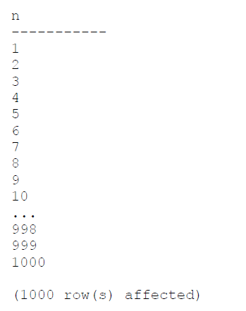

# Chapter 1. Background to T-SQL querying and programming

# Chapter 2. Single-table queries

# Chapter 3. Joins

A JOIN table operator operates on two input tables. The three fundamental types of joins:
* cross joins; 
* inner joins; 
* outer joins. 

These three types of joins differ in how they apply their logical query processing phases; each type applies a different set of phases:
* Cross join applies only one phase — Cartesian Product;
* Inner join applies two phases — Cartesian Product and Filter;
* Outer join applies three phases — Cartesian Product, Filter, and Add Outer Rows.

## Cross joins

The cross join is the simplest type of join. It implements only one logical query processing phase - a Cartesian Product. This phase operates on the two tables provided as inputs and produces a Cartesian product of the two. That is, each row from one input is matched with all rows from the other. **So if you have m rows in one table and n rows in the other, you get m×n rows in the result.**

### ISO/ANSI SQL-92 syntax

The following query applies a cross join between the Customers and Employees tables:
```
SELECT C.custid, E.empid
FROM Sales.Customers AS C
CROSS JOIN HR.Employees AS E;
```

Because there are 91 rows in the Customers table and 9 rows in the Employees table, this query produces a result set with 819 rows, as shown here in abbreviated form:


### ISO/ANSI SQL-89 syntax

```
SELECT C.custid, E.empid
FROM Sales.Customers AS C, HR.Employees AS E;
```

I recommend using the SQL-92 syntax for reasons that will become clear after I explain inner and outer joins.

### Self cross joins

You can join multiple instances of the same table. This capability is known as a self join and is supported with all fundamental join types (cross joins, inner joins, and outer joins).

```
SELECT
E1.empid, E1.firstname, E1.lastname,
E2.empid, E2.firstname, E2.lastname
FROM HR.Employees AS E1
CROSS JOIN HR.Employees AS E2;
```


This query produces all possible combinations of pairs of employees. Because the Employees table has 9 rows, this query returns 81 rows.

### Producing tables of numbers

One situation in which cross joins can be handy is when they are used to produce a result set with a sequence of integers (1, 2, 3, and so on). Such a sequence of numbers is an extremely powerful tool that I use for many purposes. By using cross joins, you can produce the sequence of integers in a very efficient manner.

You can start by creating a table called Digits with a column called digit, and populate the table with 10 rows with the digits 0 through 9. Run the following code:
```
DROP TABLE IF EXISTS dbo.Digits;

CREATE TABLE dbo.Digits(digit INT NOT NULL PRIMARY KEY);

INSERT INTO dbo.Digits(digit)
VALUES (0),(1),(2),(3),(4),(5),(6),(7),(8),(9);

SELECT digit FROM dbo.Digits;
```

This code generates the following output:


Suppose you need to write a query that produces a sequence of integers in the range 1 through 1,000. You apply cross joins between three instances of the Digits table, each representing a different power of 10 (1, 10, 100). By multiplying three instances of the same table, each instance with 10 rows, you get a result set with 1,000 rows. Here’s the complete query:
```
SELECT D3.digit * 100 + D2.digit * 10 + D1.digit + 1 AS n
FROM dbo.Digits AS D1
CROSS JOIN dbo.Digits AS D2
CROSS JOIN dbo.Digits AS D3
ORDER BY n;
```



## Inner joins

An inner join applies two logical query processing phases—it applies a Cartesian product between the two input tables like in a cross join, and then it filters rows based on a predicate you specify.

### ISO/ANSI SQL-92 syntax

Using the SQL-92 syntax, you specify the INNER JOIN keywords between the table names. **The INNER keyword is optional, because an inner join is the default.** So you can specify the JOIN keyword alone. **You specify the predicate that is used to filter rows in a designated clause called ON.** This predicate is also known as the join condition.

```
SELECT E.empid, E.firstname, E.lastname, O.orderid
FROM HR.Employees AS E
INNER JOIN Sales.Orders AS O
ON E.empid = O.empid;
```


Formal way to think of it is based on relational algebra. First, the join performs a Cartesian product between the two tables (9 employee rows × 830 order rows = 7,470 rows). Then, the join filters rows based on the predicate E.empid = O.empid, eventually returning 830 rows. As mentioned earlier, that’s just the logical way that the join is processed; in practice, physical processing of the query by the database engine can be different.

### ISO/ANSI SQL-89 syntax

```
SELECT E.empid, E.firstname, E.lastname, O.orderid
FROM HR.Employees AS E, Sales.Orders AS O
WHERE E.empid = O.empid;
```

**SQL-92 is safer.**

### Inner join safety

In the book, this section explains why it's better to use SQL-92.

### Composite joins

A composite join is simply a join where you need to match multiple attributes from each side. You usually need such a join when a primary key–foreign key relationship is based on more than one attribute. For example, suppose you have a foreign key defined on dbo.Table2, columns col1, col2, referencing dbo.Table1, columns col1, col2, and you need to write a query that joins the two based on this relationship. The FROM clause of the query would look like this:
```
FROM dbo.Table1 AS T1
INNER JOIN dbo.Table2 AS T2
ON T1.col1 = T2.col1
AND T1.col2 = T2.col2
```

### Non-equi joins

When a join condition involves only an equality operator, the join is said to be an **equi join**. When a join condition involves any operator besides equality, the join is said to be a **non-equi join**. As an example of a non-equi join, the following query joins two instances of the Employees table to produce unique pairs of employees:
```
SELECT
E1.empid, E1.firstname, E1.lastname,
E2.empid, E2.firstname, E2.lastname
FROM HR.Employees AS E1
INNER JOIN HR.Employees AS E2
ON E1.empid < E2.empid;
```

Notice the predicate specified in the ON clause. The purpose of the query is to produce unique pairs of employees. Had a cross join been used, the result would have included self pairs (for example, 1 with 1) and also mirrored pairs (for example, 1 with 2 and also 2 with 1). Using an inner join with a join condition that says the key on the left side must be smaller than the key on the right side eliminates the two inapplicable cases. Self pairs are eliminated because both sides are equal. With mirrored pairs, only one of the two cases qualifies because, of the two cases, only one will have a left key that is smaller than the right key. In this example, of the 81 possible pairs of employees a cross join would have returned, this query returns the 36 unique pairs shown here:


If it’s still not clear to you what this query does, try to process it one step at a time with a smaller set of employees. For example, suppose the Employees table contained only employees 1, 2, and 3. First, produce the Cartesian product of two instances of the table:


Next, filter the rows based on the predicate E1.empid < E2.empid, and you are left with only three rows:


### Multi-join queries

A join table operator operates only on two tables, but a single query can have multiple joins. In general, when more than one table operator appears in the FROM clause, the table operators are logically processed from left to right. That is, the result table of the first table operator is treated as the left input to the second table operator; the result of the second table operator is treated as the left input to the third table operator; and so on. **So if there are multiple joins in the FROM clause, the first join operates on two base tables, but all other joins get the result of the preceding join as their left input.** With cross joins and inner joins, the database engine can (and often does) internally rearrange join ordering for optimization purposes because it won’t have an impact on the correctness of the result of the query.

## Outer joins

### Fundamentals of outer joins

Outer joins were introduced in SQL-92 and, unlike inner joins and cross joins, have only one standard syntax—the one in which the JOIN keyword is specified between the table names and the join condition is specified in the ON clause. **Outer joins apply the two logical processing phases that inner joins apply (Cartesian Product and the ON filter), plus a third phase called Adding Outer Rows that is unique to this type of join.**

In an outer join, you mark a table as a “preserved” table by using the keywords LEFT OUTER JOIN, RIGHT OUTER JOIN, or FULL OUTER JOIN between the table names. The OUTER keyword is optional. The **LEFT keyword means that the rows of the left table** (the one to the left of the JOIN keyword) **are preserved**; the **RIGHT keyword means that the rows in the right table are preserved; and the FULL keyword means that the rows in both the left and right tables are preserved.** The third logical query processing phase of an outer join identifies the rows from the preserved table that did not find matches in the other table based on the ON predicate. This phase adds those rows to the result table produced by the first two phases of the join, and it uses NULLs as placeholders for the attributes from the nonpreserved side of the join in those outer rows.

A good way to understand outer joins is through an example. The following query joins the Customers and Orders tables, based on a match between the customer ’s customer ID and the order ’s customer ID, to return customers and their orders. The join type is a left outer join; therefore, the query also returns customers who did not place any orders:
```
SELECT C.custid, C.companyname, O.orderid
FROM Sales.Customers AS C
LEFT OUTER JOIN Sales.Orders AS O
ON C.custid = O.custid;
```

This query returns the following output, shown here in abbreviated form:


Two customers in the Customers table did not place any orders. Their IDs are 22 and 57. Observe that in the output of the query, both customers are returned with NULLs in the attributes from the Orders table. Logically, the rows for these two customers were discarded by the second phase of the join (the filter based on the ON predicate), but the third phase added those as outer rows.

A common question about outer joins that is the source of a lot of confusion is whether to specify a predicate in the ON or WHERE clause of a query. You can see that with respect to rows from the preserved side of an outer join, the **filter based on the ON predicate is not final.** In other words, the ON predicate does not determine whether a row will show up in the output, only whether it will be matched with rows from the other side. So when you need to express a predicate that is not final—meaning a predicate that determines which rows to match from the nonpreserved side — specify the predicate in the ON clause. **When you need a filter to be applied after outer rows are produced, and you want the filter to be final, specify the predicate in the WHERE clause.** **The WHERE clause is processed after the FROM clause — specifically, after all table operators have been processed and (in the case of outer joins) after all outer rows have been produced.** Also, the WHERE clause is final with respect to rows that it filters out, unlike the ON clause. To recap, in the ON clause you specify nonfinal, or matching, predicates. In the WHERE clause you specify final, or filtering, predicates.

Suppose you need to return only customers who did not place any orders or, more technically speaking, you need to return only outer rows. You can use the previous query as your basis, adding a WHERE clause that filters only outer rows. Remember that outer rows are identified by the NULLs in the attributes from the nonpreserved side of the join. So you can filter only the rows in which one of the attributes on the nonpreserved side of the join is NULL, like this:
```
SELECT C.custid, C.companyname
FROM Sales.Customers AS C
LEFT OUTER JOIN Sales.Orders AS O
ON C.custid = O.custid
WHERE O.orderid IS NULL;
```

### Beyond the fundamentals of outer joins

#### Including missing values

You can use outer joins to identify and include missing values when querying data. For example, suppose you need to query all orders from the Orders table in the TSQLV4 database. You need to ensure that you get at least one row in the output for each date in the range January 1, 2014 through December 31, 2016. You don’t want to do anything special with dates within the range that have orders, but you do want the output to include the dates with no orders, with NULLs as placeholders in the attributes of the order.

To produce a sequence of dates in a given range, I usually use an auxiliary table of numbers. I create a table called dbo.Nums with a column called n, and populate it with a sequence of integers (1, 2, 3, and so on). I find that an auxiliary table of numbers is an extremely powerful general-purpose tool I end up using to solve many problems.

As the first step in the solution, you need to produce a sequence of all dates in the requested range. You can achieve this by querying the Nums table and filtering as many numbers as the number of days in the requested date range. You can use the DATEDIFF function to calculate that number. By adding n – 1 days to the starting point of the date range (January 1, 2014), you get the actual date in the sequence. Here’s the solution query:
```
SELECT DATEADD(day, n-1, CAST('20140101' AS DATE)) AS orderdate
FROM dbo.Nums
WHERE n <= DATEDIFF(day, '20140101', '20161231') + 1
ORDER BY orderdate;
```

This query returns a sequence of all dates in the range January 1, 2014 through December 31, 2016, as shown here in abbreviated form:


The next step is to extend the previous query, adding a left outer join between Nums and the Orders tables. The join condition compares the order date produced from the Nums table and the orderdate from the Orders table by using the expression DATEADD(day, Nums.n – 1, CAST(‘20140101’ AS DATE)) like this:
```
SELECT DATEADD(day, Nums.n - 1, CAST('20140101' AS DATE)) AS orderdate,
O.orderid, O.custid, O.empid
FROM dbo.Nums
LEFT OUTER JOIN Sales.Orders AS O
ON DATEADD(day, Nums.n - 1, CAST('20140101' AS DATE)) = O.orderdate
WHERE Nums.n <= DATEDIFF(day, '20140101', '20161231') + 1
ORDER BY orderdate;
```


#### Filtering attributes from the nonpreserved side of an outer join

**When you need to review code involving outer joins to look for logical bugs, one of the things you should examine is the WHERE clause. If the predicate in the WHERE clause refers to an attribute from the nonpreserved side of the join using an expression in the form \<attribute\> \<operator\> \<value\>, it’s usually an indication of a bug**. This is because attributes from the nonpreserved side of the join are NULLs in outer rows, and an expression in the form NULL <operator> <value> yields UNKNOWN (unless it’s the IS NULL operator explicitly looking for NULLs).
  
Consider the following query:
```
SELECT C.custid, C.companyname, O.orderid, O.orderdate
FROM Sales.Customers AS C
LEFT OUTER JOIN Sales.Orders AS O
ON C.custid = O.custid
WHERE O.orderdate >= '20160101';
```

The query performs a left outer join between the Customers and Orders tables. Prior to applying the WHERE filter, the join operator returns inner rows for customers who placed orders and outer rows for customers who didn’t place orders, with NULLs in the order attributes. The predicate O.orderdate >= ‘20160101’ in the WHERE clause evaluates to UNKNOWN for all outer rows, because those have a NULL in the O.orderdate attribute. All outer rows are eliminated by the WHERE filter.

#### Using outer joins in a multi-join query

**Table operators are logically evaluated from left to right. Rearranging the order in which outer joins are processed might result in different output, so you cannot rearrange them at will.** 

Some interesting bugs have to do with the logical order in which outer joins are processed. For example, a common bug could be considered a variation of the bug in the previous section. Suppose you write a multi-join query with an outer join between two tables, followed by an inner join with a third table. If the predicate in the inner join’s ON clause compares an attribute from the nonpreserved side of the outer join and an attribute from the third table, all outer rows are discarded. Remember that outer rows have NULLs in the attributes from the nonpreserved side of the join, and comparing a NULL with anything yields UNKNOWN. UNKNOWN is filtered out by the ON filter. In other words, such a predicate nullifies the outer join, effectively turning it into an inner join. For example, consider the following query:
```
SELECT C.custid, O.orderid, OD.productid, OD.qty
FROM Sales.Customers AS C
LEFT OUTER JOIN Sales.Orders AS O
ON C.custid = O.custid
INNER JOIN Sales.OrderDetails AS OD
ON O.orderid = OD.orderid;
```

The first join is an outer join returning customers and their orders and also customers who did not place any orders. The outer rows representing customers with no orders have NULLs in the order attributes. The second join matches order lines from the OrderDetails table with rows from the result of the first join, based on the predicate O.orderid = OD.orderid; however, in the rows representing customers with no orders, the O.orderid attribute is NULL. Therefore, the predicate evaluates to UNKNOWN, and those rows are discarded. The output shown here in abbreviated form doesn’t contain the customers 22 and 57, the two customers who did not place orders.

There are several ways to get around the problem if you want to return customers with no orders in the output. One option is to use a left outer join in the second join as well:
```
SELECT C.custid, O.orderid, OD.productid, OD.qty
FROM Sales.Customers AS C
LEFT OUTER JOIN Sales.Orders AS O
ON C.custid = O.custid
LEFT OUTER JOIN Sales.OrderDetails AS OD
ON O.orderid = OD.orderid;
```

This way, the outer rows produced by the first join aren’t filtered out, as you can see in the output shown here in abbreviated form:


This solution is usually not a good one because it preserves all rows from Orders. What if there were rows in Orders that didn’t have matches in OrderDetails, and you wanted those rows to be discarded. What you want is an inner join between Orders and OrderDetails.

A second option is to use an inner join between Orders and OrderDetails, and then join the result with the Customers table using a right outer join:
```
SELECT C.custid, O.orderid, OD.productid, OD.qty
FROM Sales.Orders AS O
INNER JOIN Sales.OrderDetails AS OD
ON O.orderid = OD.orderid
RIGHT OUTER JOIN Sales.Customers AS C
ON O.custid = C.custid;
```

A third option is to use parentheses to turn the inner join between Orders and OrderDetails into an independent unit. This way, you can apply a left outer join between the Customers table and that unit. The query would look like this:
```
SELECT C.custid, O.orderid, OD.productid, OD.qty
FROM Sales.Customers AS C
LEFT OUTER JOIN (Sales.Orders AS O INNER JOIN Sales.OrderDetails AS OD ON O.orderid = OD.orderid)
ON C.custid = O.custid;
```

# Chapter 4. Subqueries

# Chapter 5. Table expressions

# Chapter 6. Set operators

# Chapter 7. Beyond the fundamentals of querying

# Chapter 8. Data modification

# Chapter 9. Temporal tables

# Chapter 10. Transactions and concurrency

# Chapter 11. Programmable objects
