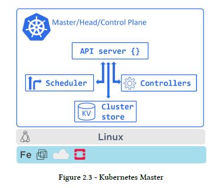
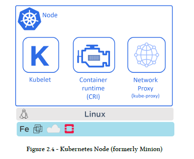
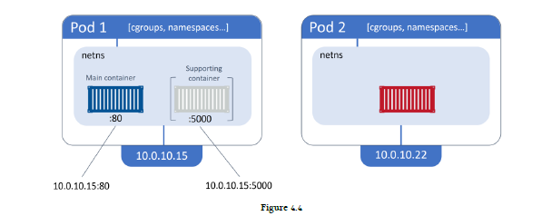

# 2: Kubernetes principles of operation

## Masters (control plane)



* **API server** - All communication, between all components, must go through the API server. It exposes a RESTful API that you POST YAML configuration files to over HTTPS.
* **Cluster store** - The only stateful part of the control plane, and it persistently stores the entire configuration and state of the cluster. The cluster store is currently based on **etcd**, a popular distributed database. **On the topic of availability, etcd prefers consistency over availability.**
* **Controller manager** - Implements all of the background control loops that monitor the cluster and respond to events. Some of the control loops include; the node controller, the endpoints controller, and the replicaset controller. Each control loop is also extremely specialized and only interested in its own little corner of the Kubernetes cluster.
* **Scheduler** - Watches the API server for new work tasks and assigns them to appropriate healthy nodes. Behind the scenes, it implements complex logic that filters out nodes incapable of running the task, and then ranks the nodes that are capable.

## Nodes



* **Kubelet** - It’s the main Kubernetes agent, and it runs on every node in the cluster. When you join a new node to a cluster, the process installs kubelet onto the node. One of the main jobs of the kubelet is to watch the API server for new work assignments.
* **Container runtime** - The Kubelet needs a **container runtime** to perform container-related tasks – things like pulling images and starting and stopping containers.
* **Kube-proxy** - Runs on every node in the cluster and is responsible for local cluster networking. For example, it makes sure each node gets its own unique IP address, and implements local IPTABLES or IPVS rules to handle routing and load-balancing of traffic on the Pod network.

## Kubernetes DNS

Every Kubernetes cluster has an internal DNS service that is vital to operations. The cluster’s DNS service has a static IP address that is **hard-coded into every Pod on the cluster**, meaning all containers and Pods know how to find it. Every new service is automatically registered with the cluster’s DNS.

## Pods

Term **Pod** comes from a *pod of whales*. As the Docker logo is a whale, it makes sense that we call a group of containers a Pod. **Kubernetes Pod is a construct for running one or more containers.** If you’re running multiple containers in a Pod, **they all share the same Pod environment.** This includes things like the IPC namespace, shared memory, volumes, network stack and more.

**Pod is only considered ready for service when all of its containers are up and running.**

# 4: Working with Pods

Pod is a **paused container**. 

## Pods and shared networking

If a Pod has s single container, that container has full access to the IP, port range and routing table. If it’s a multi-container Pod, all containers in the Pod will share the IP, port range and routing table.



For example, 10.0.10.15:80 will get you to the main container. Container-to-container communication works via the Pod’s localhost adapter and port number. For example, the main container can reach the supporting container via localhost:5000.

## Pods and cgroups

Control Groups (cgroups) are a Linux kernel technology that prevents individual containers from consuming all of the available CPU, RAM and IOPS on a node. Two containers in the same Pod to have their own set of cgroup limits. You could set a cgroup limit on the file sync container so that it has access to less resources than the web service container.

## Pod manifest files

```
apiVersion: v1
kind: Pod
metadata:
  name: hello-pod
  labels:
    zone: prod
    version: v1
spec:
  containers:
  - name: hello-ctr
    image: nigelpoulton/k8sbook:latest
    ports:
    - containerPort: 8080
```

Let’s step through what the YAML file is describing:
* **apiVersion** - tells you two things – the **API group** and the **API version**. The usual format for apiVersion ``<api-group>/<version>``. However, Pods are defined in a special API group called the **core group** which omits the api-group part. For example, StorageClass objects are defined in v1 of the storage.k8s.io API group and are described in YAML files as ``storage.k8s.io/v1``.
* **kind** - tells Kubernetes the type of object is being deployed.
* **metadata** - section where you attach a name and labels. As the .metadata section does not specify a Namespace, the Pod will be deployed to the ``default`` Namespace.
* **spec** - section where you define the containers that will run in the Pod.

## Deploying Pods from a manifest file

``kubectl`` command to POST the manifest to the API server:
```
$ kubectl apply -f pod.yml
pod/hello-pod created
```

``kubectl get pods`` command to check the status.

You can add the ``--watch`` flag to the ``kubectl get pods`` command so that you can monitor it and see when the status changes to Running.

## Introspecting running Pods

``kubectl get`` command offers a couple flags that give you more information:
* ``-o wide`` flag gives a couple more columns but is still a single line of output.
* ``-o yaml`` returns a full copy of the Pod manifest from the cluster store. The output is broadly divided into two parts - desired state (``.spec``) and current obesrved state (``.status``).

Example:
```
$ kubectl get pods hello-pod -o yaml
```

## kubectl describe

``kubectl describe`` provides a nicely formatted multiline overview of an object. Example:
```
$ kubectl describe pods hello-pod
```

If you're running multiple containers in Pod, you can see the ordering and names of containers in a Pod with the ``kubectl describe pods <pod>`` command.

## kubectl exec: running commands in Pods

``kubectl exec`` command allows to log into Pod or execute commands in it.

Get a shell to the running Container:
```
kubectl exec -it shell-demo -- /bin/bash
```

The ``-it`` flags make the exec session interactive and connects STDIN and STDOUT on your terminal to STDIN and STDOUT inside the first container in the Pod.

Other examples:
```
kubectl exec shell-demo ps aux
kubectl exec shell-demo ls /
```

If you are running multi-container Pods, you need to pass ``kubectl exec command the --container`` flag and give it the name of the container that you want to create the exec session with. If you do not specify this flag, the command will execute against the first container in the Pod.

## kubectl logs

``kubectl logs`` command. If you don’t use ``--container`` to specify a container by name, it will execute against the first container
in the Pod.

# 5: Kubernetes Deployments


