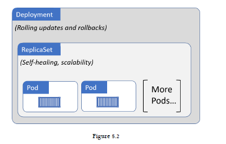
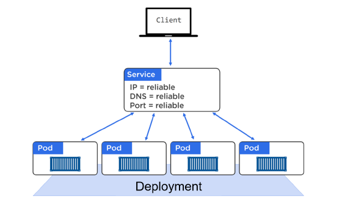
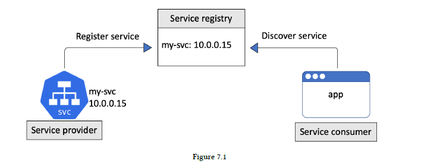
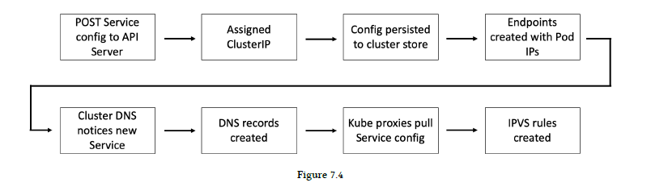
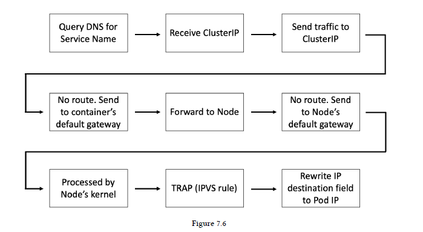
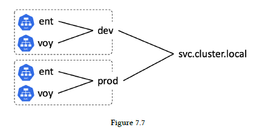
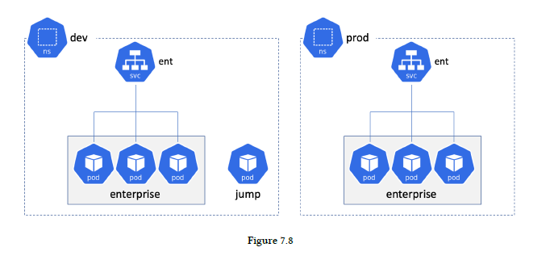
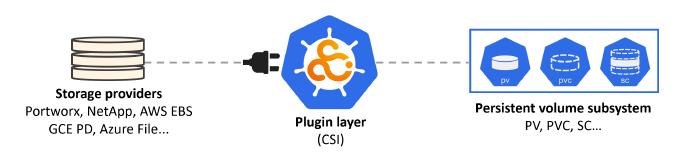
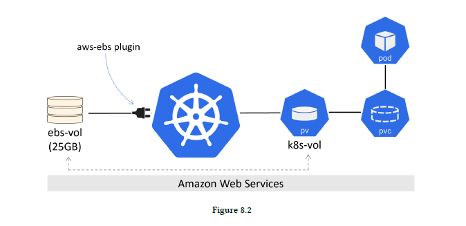
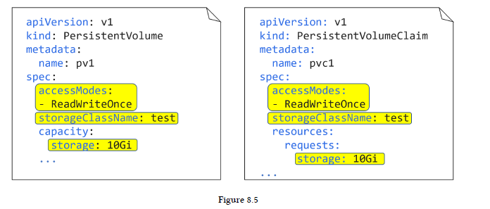

# 2: Kubernetes principles of operation

## Masters (control plane)


* **API server** - All communication, between all components, must go through the API server. It exposes a RESTful API that you POST YAML configuration files to over HTTPS.
* **Cluster store** - The only stateful part of the control plane, and it persistently stores the entire configuration and state of the cluster. The cluster store is currently based on **etcd**, a popular distributed database. **On the topic of availability, etcd prefers consistency over availability.**
* **Controller manager** - Implements all of the background control loops that monitor the cluster and respond to events. Some of the control loops include; the node controller, the endpoints controller, and the replicaset controller. Each control loop is also extremely specialized and only interested in its own little corner of the Kubernetes cluster.
* **Scheduler** - Watches the API server for new work tasks and assigns them to appropriate healthy nodes. Behind the scenes, it implements complex logic that filters out nodes incapable of running the task, and then ranks the nodes that are capable.

## Nodes


* **Kubelet** - It’s the main Kubernetes agent, and it runs on every node in the cluster. When you join a new node to a cluster, the process installs kubelet onto the node. One of the main jobs of the kubelet is to watch the API server for new work assignments.
* **Container runtime** - The Kubelet needs a **container runtime** to perform container-related tasks – things like pulling images and starting and stopping containers.
* **Kube-proxy** - Runs on every node in the cluster and is responsible for local cluster networking. For example, it makes sure each node gets its own unique IP address, and implements local IPTABLES or IPVS rules to handle routing and load-balancing of traffic on the Pod network.

## Kubernetes DNS

Every Kubernetes cluster has an internal DNS service that is vital to operations. The cluster’s DNS service has a static IP address that is **hard-coded into every Pod on the cluster**, meaning all containers and Pods know how to find it. Every new service is automatically registered with the cluster’s DNS.

## Pods

Term **Pod** comes from a *pod of whales*. As the Docker logo is a whale, it makes sense that we call a group of containers a Pod. **Kubernetes Pod is a construct for running one or more containers.** If you’re running multiple containers in a Pod, **they all share the same Pod environment.** This includes things like the IPC namespace, shared memory, volumes, network stack and more.

**Pod is only considered ready for service when all of its containers are up and running.**

# 4: Working with Pods

Pod is a **paused container**. 

## Pods and shared networking

If a Pod has s single container, that container has full access to the IP, port range and routing table. If it’s a multi-container Pod, all containers in the Pod will share the IP, port range and routing table.


For example, 10.0.10.15:80 will get you to the main container. Container-to-container communication works via the Pod’s localhost adapter and port number. For example, the main container can reach the supporting container via localhost:5000.

## Pods and cgroups

Control Groups (cgroups) are a Linux kernel technology that prevents individual containers from consuming all of the available CPU, RAM and IOPS on a node. Two containers in the same Pod to have their own set of cgroup limits. You could set a cgroup limit on the file sync container so that it has access to less resources than the web service container.

## Pod manifest files

```
apiVersion: v1
kind: Pod
metadata:
  name: hello-pod
  labels:
    zone: prod
    version: v1
spec:
  containers:
  - name: hello-ctr
    image: nigelpoulton/k8sbook:latest
    ports:
    - containerPort: 8080
```

Let’s step through what the YAML file is describing:
* **apiVersion** - tells you two things – the **API group** and the **API version**. The usual format for apiVersion ``<api-group>/<version>``. However, Pods are defined in a special API group called the **core group** which omits the api-group part. For example, StorageClass objects are defined in v1 of the storage.k8s.io API group and are described in YAML files as ``storage.k8s.io/v1``.
* **kind** - tells Kubernetes the type of object is being deployed.
* **metadata** - section where you attach a name and labels. As the .metadata section does not specify a Namespace, the Pod will be deployed to the ``default`` Namespace.
* **spec** - section where you define the containers that will run in the Pod.

## Deploying Pods from a manifest file

``kubectl`` command to POST the manifest to the API server:
```
$ kubectl apply -f pod.yml
pod/hello-pod created
```

``kubectl get pods`` command to check the status.

You can add the ``--watch`` flag to the ``kubectl get pods`` command so that you can monitor it and see when the status changes to Running.

## Introspecting running Pods

``kubectl get`` command offers a couple flags that give you more information:
* ``-o wide`` flag gives a couple more columns but is still a single line of output.
* ``-o yaml`` returns a full copy of the Pod manifest from the cluster store. The output is broadly divided into two parts - desired state (``.spec``) and current obesrved state (``.status``).

Example:
```
$ kubectl get pods hello-pod -o yaml
```

## kubectl describe

``kubectl describe`` provides a nicely formatted multiline overview of an object. Example:
```
$ kubectl describe pods hello-pod
```

If you're running multiple containers in Pod, you can see the ordering and names of containers in a Pod with the ``kubectl describe pods <pod>`` command.

## kubectl exec: running commands in Pods

``kubectl exec`` command allows to log into Pod or execute commands in it.

Get a shell to the running Container:
```
kubectl exec -it shell-demo -- /bin/bash
```

The ``-it`` flags make the exec session interactive and connects STDIN and STDOUT on your terminal to STDIN and STDOUT inside the first container in the Pod.

Other examples:
```
kubectl exec shell-demo ps aux
kubectl exec shell-demo ls /
```

If you are running multi-container Pods, you need to pass ``kubectl exec command the --container`` flag and give it the name of the container that you want to create the exec session with. If you do not specify this flag, the command will execute against the first container in the Pod.

## kubectl logs

``kubectl logs`` command. If you don’t use ``--container`` to specify a container by name, it will execute against the first container
in the Pod.

# 5: Kubernetes Deployments

## Deployment theory

It’s important to know that a single Deployment object can only manage a single Pod template. Deployment can manage multiple
replicas of the same Pod. Deployments are fully-fledged objects in the Kubernetes API. Deployments leverage another object called a ReplicaSet.

ReplicaSet provides ***self-healing*** and ***scaling***.
Deployments provide ***rolling-updates***.



## Rolling updates with Deployments

As well as self-healing and scaling, Deployments give us zero-downtime rolling-updates. When you rollout update, Kubernetes creates a new ReplicaSet for the Pods with the new image. You now have two ReplicaSets – the original one for the Pods with the old version of the image, and a new one for the Pods with the updated version. Each time Kubernetes increases the number of Pods in the new ReplicaSet (with the new version of the image) it decreases the number of Pods in the old ReplicaSet (with the old version of the image).

## Rollbacks

Older ReplicaSets are wound down and no longer manage any Pods. However, they still exist with their full configuration.

## How to create a Deployment

```
apiVersion: apps/v1 #Older versions of k8s use apps/v1beta1
kind: Deployment
metadata:
  name: hello-deploy
spec:
  replicas: 10
  selector:
    matchLabels:
      app: hello-world
  minReadySeconds: 10
  strategy:
    type: RollingUpdate
    rollingUpdate:
      maxUnavailable: 1
      maxSurge: 1
  template:
     metadata:
       labels:
         app: hello-world
     spec:
       containers:
         - name: hello-pod
           image: nigelpoulton/k8sbook:latest
           ports:
           - containerPort: 8080
```

* **.kind** field tells Kubernetes you’re defining a Deployment object.
* **.metadata** section is where we give the Deployment a name and labels.
* **.spec** Anything directly below ``.spec`` relates to the Pod. Anything nested below ``.spec.template`` relates to the Pod template that the Deployment will manage.
* **spec.selector** is a list of labels that Pods must have in order for the Deployment to manage them.
* **spec.minReadySeconds** tells Kubernetes to wait 10 seconds between each Pod being updated. This is useful for throttling the rate at which updates occur.
* **spec.strategy** tells Kubernetes you want this Deployment to: Update using the RollingUpdate strategy; Never have more than one Pod below desired state (maxUnavailable: 1); Never have more than one Pod above desired state (maxSurge: 1).
  * **maxSurge** means you will never have more than 11 Pods during the update process.
  * **maxUnavailable** means you’ll never have less than 9.

## Inspecting Deployments

Use ``kubectl get`` and ``kubectl describe``. Example:
```
$ kubectl get deploy hello-deploy
```

## Accessing the app

Service object provide a stable DNS name and IP address for a set of Pods. Service:
```
apiVersion: v1
kind: Service
metadata:
  name: hello-svc
  labels:
    app: hello-world
spec:
  type: NodePort
  ports:
  - port: 8080
    nodePort: 30001
    protocol: TCP
  selector:
    app: hello-world
```

Now that the Service is deployed, you can access the app from either of the following:
* From inside the cluster using the DNS name hello-svc on port 8080
* From outside the cluster by hitting any of the cluster nodes on port 30001

## Performing a rolling update

Create a new Deployment file:
```
apiVersion: apps/v1 #Older versions of k8s use apps/v1beta1
kind: Deployment
metadata:
  name: hello-deploy
spec:
  replicas: 10
  selector:
    matchLabels:
      app: hello-world
  minReadySeconds: 10
  strategy:
    type: RollingUpdate
    rollingUpdate:
      maxUnavailable: 1
      maxSurge: 1
  template:
     metadata:
       labels:
         app: hello-world
     spec:
       containers:
         - name: hello-pod
           image: nigelpoulton/k8sbook:edge # This line changed
           ports:
           - containerPort: 8080
```

Initiate the update by re-POSTing the updated YAML file to the API server.
```
$ kubectl apply -f deploy.yml --record
deployment.apps/hello-deploy configured
```

``--record`` flag so that Kubernetes would maintain a documented revision history of the Deployment.


``kubectl rollout status`` monitor the progress of the update:
```
$ kubectl rollout status deployment hello-deploy
Waiting for rollout to finish: 4 out of 10 new replicas...
Waiting for rollout to finish: 4 out of 10 new replicas...
Waiting for rollout to finish: 5 out of 10 new replicas...
```

Check the deployment history by:
```
kubectl rollout history deployment hello-deploy

deployment.apps/hello-deploy
REVISION CHANGE-CAUSE
1 <none>
2 kubectl apply --filename-deploy.yml --record=true
```

**This is only there because you used the --record flag as part of the command to invoke the update.**

Updating a Deployment creates a new ReplicaSet, and that any previous ReplicaSets are not deleted. You can verify this with a ``kubectl get rs``.

## How to perform a rollback

```
$ kubectl rollout undo deployment hello-deploy --to-revision=1
deployment.apps "hello-deploy" rolled back
```

Rollbacks follow the same rules set out in the rolling update sections of the Deployment manifest – minReadySeconds: 10, maxUnavailable: 1, and maxSurge: 1.

# 6: Kubernetes Services

## Setting the scene

Service gets its own **stable IP address**, its own **stable DNS name**, and its own **stable port**. 

## Theory



## Labels and loose coupling

Services are loosely coupled with Pods via **labels** and **label selectors.**

For a Service to match a set of Pods, and therefore send traffic to them, the **Pods must possess every label in the Services label selector.** However, the Pod can have additional labels that are not listed in the Service’s label selector.

Service example:
```
apiVersion: v1
kind: Service
metadata:
  name: hello-svc
spec:
  ports:
  - port: 8080
  selector:
    app: hello-world # Label selector. Service is looking for Pods with the label `app=hello-world`
```

Deployment example:
```
apiVersion: apps/v1
kind: Deployment
metadata:
  name: hello-deploy
spec:
  replicas: 10
  selector:
    matchLabels:
      app: hello-world
  template:
    metadata:
      labels:
        app: hello-world # Pod labels. The label matches the Service's label selector
  spec:
    containers:
    - name: hello-ctr
      image: nigelpoulton/k8sbook:latest
      ports:
      - containerPort: 8080
```

## Services and Endpoint objects

As Pods come-and-go (scaling up and down, failures, rolling updates etc.), the Service dynamically updates its list of healthy matching Pods. It does this through a combination of the label selector and a construct called an **Endpoints object**.

**Each Service that is created, automatically gets an associated Endpoints object.** All this Endpoints object is, is a dynamic list of all of the healthy Pods on the cluster that match the Service’s label selector.

Kubernetes is constantly evaluating the Service’s label selector against the current list of healthy Pods on the cluster. Any new Pods that match the selector get added to the Endpoints object, and any Pods that disappear get removed. This means the Endpoints object is always up to date. Then, **when a Service is sending traffic to Pods, it queries its Endpoints object for the latest list of healthy matching Pods.**

When sending traffic to Pods, via a Service, an application will normally query the cluster’s internal DNS for the IP address of a Service. It then sends the traffic to this stable IP address and the Service sends it on to a Pod. However, a Kubernetes-native application (that’s a fancy way of saying an application that understands Kubernetes and can query the Kubernetes API) can query the Endpoints API directly, bypassing the DNS lookup and use of the Service’s IP.

## Accessing Services from inside the cluster

Kubernetes supports several types of Service. The default type is **ClusterIP**. A ClusterIP Service has a **stable IP address and port that is only accessible from inside the cluster.**

## Accessing Services from outside the cluster

Kubernetes has another type of Service called a **NodePort Service.** This builds on top of ClusterIP and enables access from outside of the cluster.

The following example represents a NodePort Service:
* Name: magic-sandbox
* ClusterIP: 172.12.5.17
* port: 8080
* NodePort: 30050

It can be accessed from outside of the cluster by sending a request to the IP address of any cluster node on port 30050.

## Service discovery

Kubernetes implements Service discovery in a couple of ways:
* DNS (preferred)
* Environment variables (definitely not preferred)

Kubernetes DNS is setup by:
* Control plane Pods running a DNS service
* A Service object called ``kube-dns`` that sits in front of the Pods
* Kubelets program every container with the knowledge of the DNS (via /etc/resolv.conf)

## Hands-on with Services

### The imperative way

deploy.yml:
```
apiVersion: apps/v1
kind: Deployment
metadata:
  name: web-deploy
spec:
  replicas: 10
  selector:
    matchLabels:
      app: hello-world
  template:
    metadata:
      labels:
        app: hello-world
    spec:
      containers:
      - name: hello-ctr
        image: nigelpoulton/k8sbook:latest
        ports:
        - containerPort: 8080
```

```
$ kubectl apply -f deploy.yml
deployment.apps/hello-deploy created
```

The command to imperatively create a Kubernetes Service is ``kubectl expose``:
```
$ kubectl expose deployment web-deploy \
--name=hello-svc \
--target-port=8080 \
--type=NodePort
service/hello-svc exposed
```

Once the Service is created, inspect it with the ``kubectl describe svc hello-svc`` command:
```
$ kubectl describe svc hello-svc
Name: hello-svc
Namespace: default
Labels: <none>
Annotations: <none>
Selector: app=hello-world
Type: NodePort
IP: 192.168.201.116
Port: <unset> 8080/TCP
TargetPort: 8080/TCP
NodePort: <unset> 30175/TCP
Endpoints: 192.168.128.13:8080,192.168.128.249:8080, + more...
Session Affinity: None
External Traffic Policy: Cluster
Events: <none>
```

Some values expained:
* Selector is the list of labels that Pods must have in order for the Service to send traffic to them
* IP is the permanent internal ClusterIP (VIP) of the Service
* Port is the port that the Service listens on inside the cluster
* TargetPort is the port that the application is listening on
* NodePort is the cluster-wide port that can be used to access it from outside the cluster
* Endpoints is the dynamic list of healthy Pod IPs currently match the Service’s label selector.

You can access exposed Service via node IP address and NodePort.

### The declarative way

A Service manifest file:
```
apiVersion: v1
kind: Service
metadata:
  name: hello-svc
spec:
  type: NodePort
  ports:
  - port: 8080
    nodePort: 30001
    targetPort: 8080
    protocol: TCP
  selector:
    app: hello-world
```

## Common Service types

Common ServiceTypes:
* **ClusterIP** - default option and gives the Service a stable IP address internally within the cluster. It will not make the Service available outside of the cluster.
* **NodePort** - builds on top of ClusterIP and adds a cluster-wide TCP or UDP port. It makes the Service available outside of the cluster on a stable port.
* **LoadBalancer** - builds on top of NodePort and integrates with cloud-based load-balancers.
* **ExternalName** - direct traffic to services that exist outside of the Kubernetes cluster.

## Endpoints objects

Every Service gets its own Endpoints object with the **same name as the Service.**
```
$ kubectl get ep hello-svc
NAME ENDPOINTS AGE
hello-svc 100.96.1.10:8080, 100.96.1.11:8080 + 8 more... 1m
```

# 7: Service discovery

There are two major components to service discovery:
* Service registration
* Service discovery

## Service registration



Kubernetes provides a well-known internal DNS service that we usually call the "cluster DNS". The term *well known* means that it operates at an address known to every Pod and container in the cluster. It’s implemented in the ``kube-system`` Namespace as a set of Pods managed by a Deployment called ``coredns``. These Pods are fronted by a Service called ``kube-dns``.

Every Kubernetes Service is automatically registered with the cluster DNS when it’s created. The registration process:
* POST a new Service manifest to the API Server
* The request is authenticated, authorized, and subjected to admission policies
* The Service is allocated a virtual IP address called a ClusterIP
* An Endpoints object (or Endpoint slices) is created to hold a list of Pods the Service will load-balance traffic to
* The Pod network is configured to handle traffic sent to the ClusterIP (more on this later)
* The Service’s name and IP are registered with the cluster DNS

## Summarising service registration



Every node is running a kube-proxy that sees the new Service and Endpoints objects and creates IPVS rules on every node so that traffic to the Service’s ClusterIP is redirected to one of the Pods that match its label selector.

## Service discovery

Let’s assume there are two microservices applications on a single Kubernetes cluster – enterprise and voyager. The Pods for the enterprise app sit behind a Kubernetes Service called ent and the Pods for the voyager app sit behind another Kubernetes Service called voy. Both are registered with DNS as follows:
* ent: 192.168.201.240
* voy: 192.168.200.217

## Converting names to IP addresses using the cluster DNS

Kubernetes automatically configures every container so that it can find and use the cluster DNS to convert Service names to IPs. It does this by populating every container’s ``/etc/resolv.conf`` file with the IP address of cluster DNS Service as well as any search domains that should be appended to unqualified names.

Note: An “unqualified name” is a short name such as ent. Appending a search domain converts an unqualified name into a fully qualified domain name (FQDN) such as ent.default.svc.cluster.local.

The following snippet shows a container that is configured to send DNS queries to the cluster DNS at 192.168.200.10. It also lists the search domains to append to unqualified names. 
```
$ cat /etc/resolv.conf
search svc.cluster.local cluster.local default.svc.cluster.local
nameserver 192.168.200.10
options ndots:5
```

The following snippet shows that nameserver in /etc/resolv.conf matches the IP address of the cluster DNS (the kube-dns Service).
```
$ kubectl get svc -n kube-system -l k8s-app=kube-dns
NAME TYPE CLUSTER-IP PORT(S) AGE
kube-dns ClusterIP 192.168.200.10 53/UDP,53/TCP,9153/TCP 3h53m
```

If Pods in the enterprise app need to connect to Pods in the voyager app, they send a request to the cluster DNS asking it to resolve the name voy to an IP address. The cluster DNS will return the value of the ClusterIP (192.168.200.217).

## Summarising service discovery



* An instance of the "enterprise" microservice sends a query to the cluster DNS (defined in the ``/etc/resolv.conf`` file of every container) asking it to resolve the name of the "voy" Service to an IP address. 
* The cluster DNS replies with the ClusterIP (virtual IP) 
* The instance of the "enterprise" microservice sends requests to this ClusterIP.
* However, there are no routes to the service network that the ClusterIP is on. This means the requests are sent to the container’s default gateway and eventually sent to the Node the container is running on. 
* The Node has no route to the service network so it sends the traffic to its own default gateway. 
* En-route, the request is processed by the Node’s kernel. A trap is triggered and the request is redirected to the IP address of a Pod that matches the Services label selector.

## Service discovery and Namespaces

Two things are important if you want to understand how service discovery works within and across Namespaces:
* Every cluster has an address space
* Namespaces partition the cluster address space

Every cluster has an address space based on a DNS domain that we usually call the cluster domain. By default, it’s called **cluster.local**, and Service objects are placed within that address space. For example, a Service called ent will have a **fully qualified domain name (FQDN) of ent.default.svc.cluster.local.**

The format of the FQDN is **\<object-name\>.\<namespace\>.svc.cluster.local.**

For example, creating a couple of Namespaces called prod and dev will give you two address spaces that you can place Services and other objects in:
* dev: <object-name>.dev.svc.cluster.local
* prod: <object-name>.prod.svc.cluster.local
  
**Object names must be unique within Namespaces but not across Namespaces.** This means that you cannot have two Service objects called “ent” in the same Namespace, but you can if they are in different Namespaces.



To connect to objects in a remote Namespace requires FQDNs such as ent.dev.svc.cluster.local and voy.dev.svc.cluster.local.

## Service discovery example



```
apiVersion: v1
kind: Namespace
metadata:
  name: dev
---
apiVersion: v1
kind: Namespace
metadata:
  name: prod
---
apiVersion: apps/v1
kind: Deployment
metadata:
  name: enterprise
  labels:
    app: enterprise
  namespace: dev
spec:
  selector:
    matchLabels:
      app: enterprise
  replicas: 2
  strategy:
    type: RollingUpdate
  template:
    metadata:
      labels:
        app: enterprise
    spec:
      terminationGracePeriodSeconds: 1
      containers:
      - image: nigelpoulton/k8sbook:text-dev
        name: enterprise-ctr
        ports:
        - containerPort: 8080
---
apiVersion: apps/v1
kind: Deployment
metadata:
  name: enterprise
  labels:
    app: enterprise
  namespace: prod
spec:
  selector:
    matchLabels:
      app: enterprise
  replicas: 2
  strategy:
    type: RollingUpdate
  template:
    metadata:
      labels:
        app: enterprise
      spec:
        terminationGracePeriodSeconds: 1
        containers:
        - image: nigelpoulton/k8sbook:text-prod
          name: enterprise-ctr
          ports:
          - containerPort: 8080
---
apiVersion: v1
kind: Service
metadata:
  name: ent
  namespace: dev
spec:
  selector:
    app: enterprise
  ports:
  - port: 8080
  type: ClusterIP
---
apiVersion: v1
kind: Service
metadata:
  name: ent
  namespace: prod
spec:
  selector:
    app: enterprise
  ports:
  - port: 8080
  type: ClusterIP
---
apiVersion: v1
kind: Pod
metadata:
  name: jump
  namespace: dev
spec:
  terminationGracePeriodSeconds: 5
  containers:
  - name: jump
    image: ubuntu
    tty: true
    stdin: true
```

Deploy the configuration to your cluster.
```
$ kubectl apply -f dns-namespaces.yml
```

Check the configuration was correctly applied:
```
$ kubectl get all -n dev
$ kubectl get all -n prod
```

The next steps will:
* Log on to the main container of jump Pod in the dev Namespace
* Check the container’s /etc/resolv.conf file
* Connect to the ent app in the dev Namespace using the Service’s shortname
* Connect to the ent app in the prod Namespace using the Service’s FQDN

```
$ kubectl exec -it jump bash -n dev
root@jump:/#

$ cat /etc/resolv.conf
search dev.svc.cluster.local svc.cluster.local cluster.local default.svc.cluster.local
nameserver 192.168.200.10
options ndots:5

$ apt-get update && apt-get install curl -y

$ curl ent:8080
Hello from the DEV Namespace!
Hostname: enterprise-7d49557d8d-k4jjz

$ curl ent.prod.svc.cluster.local:8080
Hello from the PROD Namespace!
Hostname: enterprise-5464d8c4f9-v7xsk

```

# 8: Kubernetes storage

## The big picture

**Volume** - when storage is exposed to Kubernetes.





This is a set of API objects that allow applications to consume storage. At a high-level, Persistent Volumes (PV) are how you map external storage onto the cluster, and Persistent Volume Claims (PVC) are like tickets that authorize applications (Pods) to use a PV.

## The Container Storage Interface (CSI)

CSI is an open-source project that defines a standards-based interface so that storage can be leveraged in a uniform way across multiple container orchestrators. Storage vendor should be able to write a single CSI plugin that works across multiple orchestrators like Kubernetes and Docker Swarm.

## The Kubernetes persistent volume subsystem

The three main resources in the persistent volume subsystem are:
* Persistent Volumes (PV) - how you represent storage in Kubernetes.
* Persistent Volume Claims (PVC) - tickets that grant a Pod access to a PV.
* Storage Classes (SC) - make it all dynamic.

Assume you have a Kubernetes cluster and an external storage system. The storage vendor provides a CSI plugin so that you can leverage its storage assets inside of your Kubernetes cluster. You provision 3 x 10GB volumes on the storage system and create 3 Kubernetes PV objects to make them available on your cluster. Each PV references one of the volumes on the storage array via the CSI plugin. At this point, the three volumes are visible and available for use on the Kubernetes cluster.

Now assume you’re about to deploy an application that requires 10GB of storage. That’s great, you already have three 10GB PVs. In order for the app to use one of them, it needs a PVC. Once the app has the PVC, it can mount the respective PV into its Pod as a volume.

Example.

The example assumes 10GB SSD volume called “uber-disk” has been pre-created in the same Google Cloud Region or Zone as the cluster. The Kubernetes steps will be:
* Create the PV
* Create the PVC
* Define the volume into a PodSpec
* Mount it into a container

PV:
```
apiVersion: v1
kind: PersistentVolume
metadata:
  name: pv1
spec:
  accessModes:
  - ReadWriteOnce
  storageClassName: test
  capacity:
    storage: 10Gi
  persistentVolumeReclaimPolicy: Retain
  gcePersistentDisk:
    pdName: uber-disk
```

The operation will fail if you have not pre-created “uber-disk” on the back-end storage system.
```
$ kubectl apply -f gke-pv.yml
persistentvolume/pv1 created
```
Check the PV exists.
```
$ kubectl get pv pv1
NAME CAPACITY MODES RECLAIM POLICY STATUS STORAGECLASS ...
pv1 10Gi RWO Retain Available test
```

``.spec.accessModes`` defines how the PV can be mounted. Three options exist:
* ReadWriteOnce (RWO) - defines a PV that can only be mounted/bound as R/W by a single PVC. Attempts from multiple PVCs to bind (claim) it will fail.
* ReadWriteMany (RWM) - ReadWriteMany defines a PV that can be bound as R/W by multiple PVCs. This mode is usually only supported by file and object storage such as NFS. Block storage usually only supports RWO.
* ReadOnlyMany (ROM) - ReadOnlyMany defines a PV that can be bound by multiple PVCs as R/O.

**PV can only be opened in one mode – it is not possible for a single PV to have a PVC bound to it in ROM mode and another PVC bound to it in RWM mode.**

``spec.persistentVolumeReclaimPolicy`` tells Kubernetes what to do with a PV when its PVC has been released. Two policies currently exist:
* Delete
* Retain

*Delete* is the most dangerous, and is the **default for PVs that are created dynamically via storage classes.**

*Retain* will keep the associated PV object on the cluster as well as any data stored on the associated external asset. However, it will prevent another PVC from using the PV in future. If you want to re-use a retained PV, you need to perform the following three steps:

1. Manually delete the PV on Kubernetes
2. Re-format the associated storage asset on the external storage system to wipe any data
3. Recreate the PV

``.spec.capacity`` tells Kubernetes how big the PV should be. This value can be less than the actual physical storage asset but **cannot be more.**

```
gcePersistentDisk:
  pdName: uber-disk
```

Links the PV to the name of the pre-created device on the back-end. You can also specify vendor-specific attributes using the ``.parameters`` section of a PV YAML.

PVC:
```
apiVersion: v1
kind: PersistentVolumeClaim
metadata:
  name: pvc1
spec:
  accessModes:
  - ReadWriteOnce
  storageClassName: test
  resources:
    requests:
      storage: 10Gi
```

The most important thing to note about a PVC object is that the values in the **``.spec`` section must match with the PV you are binding it with. In this example, *access modes*, *storage class*, and *capacity* must match with the PV.**

Note: It’s possible for a PV to have more capacity than a PVC. For example, a 10GB PVC can be bound to a 15GB PV (obviously this will waste 5GB of the PV). However, a 15GB PVC cannot be bound to a 10GB PV.



Deploy the PVC with the following command:
```
$ kubectl apply -f gke-pvc.yml
persistentvolumeclaim/pvc1 created
```

Pod:
```
apiVersion: v1
kind: Pod
  metadata:
    name: volpod
spec:
  volumes:
  - name: data
    persistentVolumeClaim:
      claimName: pvc1
    containers:
    - name: ubuntu-ctr
      image: ubuntu:latest
      command:
      - /bin/bash
      - "-c"
      - "sleep 60m"
      volumeMounts:
      - mountPath: /data
        name: data
```

You can see that the first reference to storage is .spec.volumes. This defines a volume called “data” that leverages the previously created PVC called “pvc1”.

## Storage Classes and Dynamic Provisioning

Storage classes allow to define different classes, or tiers, of storage. For example, you might define a *fast class*, a *slow class*, and an *encrypted class*.

You can use the ``sc`` shortname to refer to StorageClass objects when using kubectl.

### A StorageClass YAML

The following is a simple example of a StorageClass YAML file. It defines a class of storage called “fast”, that is based on AWS solid state drives (io1) in the Ireland Region (eu-west-1a).

```
kind: StorageClass
apiVersion: storage.k8s.io/v1
metadata:
  name: fast
provisioner: kubernetes.io/aws-ebs
parameters:
  type: io1
  zones: eu-west-1a
  iopsPerGB: "10"
```

StorageClass objects are immutable – this means you cannot modify them once deployed.

### Implementing StorageClasses


The basic workflow for deploying and using a StorageClass on your cluster is as follows:
* Create your Kubernetes cluster with a storage back-end
* Ensure the plugin for the storage back-end is available
* Create a StorageClass object
* Create a PVC object that references the StorageClass by name
* Deploy a Pod that uses volume based on the PVC

**Notice that the workflow does not include creating a PV. This is because storage classes create PVs dynamically.**

```
apiVersion: storage.k8s.io/v1
kind: StorageClass
metadata:
  name: fast # Referenced by the PVC
provisioner: kubernetes.io.gce-pd
parameters:
  type: pd-ssd
---
apiVersion: v1
kind: PersistentVolumeClaim
metadata:
  name: mypvc # Referenced by the PodSpec
  namespace: mynamespace
spec:
  accessModes:
  - ReadWriteOnce
  resources:
    requests:
      storage: 50Gi
  storageClassName: fast # Matches name of the SC
---
apiVersion: v1
kind: Pod
metadata:
  name: mypod
spec:
  volumes:
  - name: data
    persistentVolumeClaim:
      claimName: mypvc # Matches PVC name
  containers: ...
```

StorageClasses make it so that you don’t have to create PVs manually. You create the StorageClass object and use a plugin to tie it to a particular type of storage on a particular storage back-end. Once deployed, the StorageClass watches the API server for new PVC objects that reference its name. When matching PVCs appear, the StorageClass dynamically creates the required volume on the back-end storage system as well as the PV on Kubernetes.

## Demo

### Create a StorageClass

We’ll use the following YAML to create a StorageClass called “slow” based on Google GCE standard persistent disks. It uses an annotation to attempt to set this as the default storage class on the cluster.

google-sc.yml:
```
kind: StorageClass
apiVersion: storage.k8s.io/v1
metadata:
  name: slow
  annotations:
    storageclass.kubernetes.io/is-default-class: "true"
provisioner: kubernetes.io/gce-pd
parameters:
  type: pd-standard
reclaimPolicy: Retain
```

Deploy the SC with the following command:
```
$ kubectl apply -f google-sc.yml
storageclass.storage.k8s.io/slow created
```

You can check and inspect it with ``kubectl get sc slow`` and ``kubectl describe sc slow``. For example:
```
$ kubectl get sc slow
NAME PROVISIONER AGE
slow (default) kubernetes.io/gce-pd 32s
```

### Create a PVC

google-pvc.yml:
```
apiVersion: v1
kind: PersistentVolumeClaim
metadata:
  name: pv-ticket
spec:
  accessModes:
  - ReadWriteOnce
  storageClassName: slow
  resources:
    requests:
      storage: 25Gi
```

```
$ kubectl apply -f google-pvc.yml
persistentvolumeclaim/pv-ticket created
```

```
$ kubectl get pvc pv-ticket
NAME STATUS VOLUME CAPACITY ACCESS MODES STORAGECLASS
pv-ticket Bound pvc-881a23... 25Gi RWO slow
```

Notice that the PVC is already bound to the pvc-881a23... volume – you didn’t have to manually create a PV.

Use the following command to verify the presence of the automatically created PV on the cluster.

```
$ kubectl get pv
NAME CAPACITY Mode STATUS CLAIM STORAGECLASS
pvc-881... 25Gi RWO Bound pv-ticket slow
```

google-pod.yml:

```
apiVersion: v1
kind: Pod
metadata:
  name: class-pod
spec:
  volumes:
  - name: data
    persistentVolumeClaim:
      claimName: pv-ticket
  containers:
  - name: ubuntu-ctr
    image: ubuntu:latest
    command:
    - /bin/bash
    - "-c"
    - "sleep 60m"
    volumeMounts:
    - mountPath: /data
      name: data
```

### Clean-up

```
$ kubectl delete pod class-pod
pod "class-pod" deleted

$ kubectl delete pvc pv-ticket
persistentvolumeclaim "pv-ticket" deleted

$ kubectl delete sc slow
storageclass.storage.k8s.io "slow" deleted
```

# 9: ConfigMaps

## How do ConfigMaps work

At a high-level, a ConfigMap is a place to store configuration data that can be seamlessly injected into containers at runtime. Behind the scenes, ConfigMaps are a map of key/value pairs. Example:
* db-port:13306
* hostname:msb-prd-db1

More complex examples can store entire configuration files like this one:
```
key: conf value:

directive in;
main block;
http {
  server {
    listen 80 default_server;
    server_name *.msb.com;
    root /var/www/msb.com;
    index index.html

    location / {
      root /usr/share/nginx/html;
      index index.html;
    }
  }
}
```

Once data is stored in a ConfigMap, it can be injected into containers at run-time via any of the following methods:
* environment variables
* arguments to the container’s startup command
* files in a volume

## Hands-on with ConfigMaps

### Creating ConfigMaps imperatively

The command to imperatively create a ConfigMap is ``kubectl create configmap``, but you can shorten ``configmap`` to ``cm``. The command accepts two sources of data:
* literal values on the command line (``--from-literal``)
* files referenced on the command line (``--from-file``)

```
$ kubectl create configmap testmap1 \
--from-literal shortname=msb.com \
--from-literal longname=magicsandbox.com
```

The following describe command shows how the two entries are stored in the map:
```
$ kubectl describe cm testmap1
Name: testmap1
Namespace: default
Labels: <none>
Annotations: <none>
```


