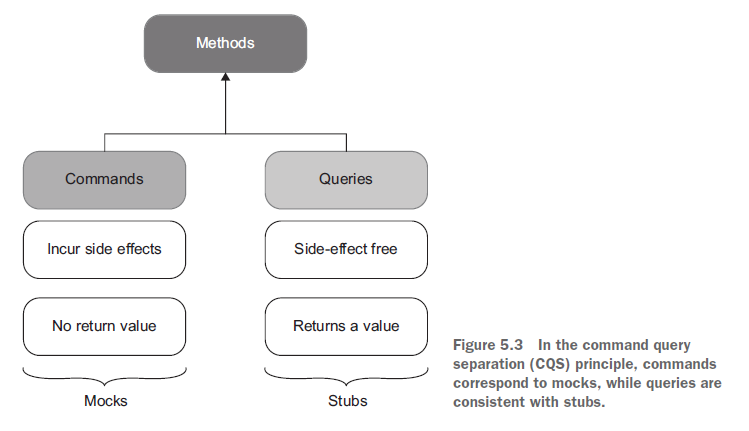
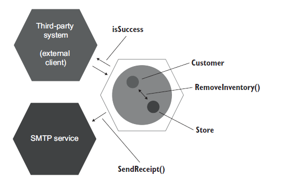

> Most of my unit tests spent a great deal of time setting up expectations and wiring up a complicated web of dependencies—all that, just to check that the three lines of code in my controller were correct. I couldn’t pinpoint what exactly was wrong with the tests, but my sense of proportion sent me unambiguous signals that something was off.

# Part 1

We’ll look at the definition of unit test. **A seemingly minor disagreement over this definition has led to the formation of two schools of unit testing**, which we’ll also dive into.

# Chapter 1. The goal of unit testing

You always have to strive to achieve the best return on the time you invest in unit testing, **minimizing the effort you put into tests and maximizing the benefits they provide.** Achieving both things isn’t an easy task.

## The current state of unit testing

For the past two decades, there’s been a push toward adopting unit testing. The push has been so successful that unit testing is now considered mandatory in most companies. The ratio between the production code and the test code could be anywhere between 1:1 and 1:3 (for each line of production code, there are one to three lines of test code). Sometimes, this ratio goes much higher than that, to a whopping 1:10.

Many projects have automated tests; they may even have a lot of them. But the existence of those tests often doesn’t provide the results the developers hope for. It can still take programmers a lot of effort to make progress in such projects. New features take forever to implement, new bugs constantly appear in the already implemented and accepted functionality, and the unit tests that are supposed to help don’t seem to mitigate this situation at all. They can even make it worse.

The situation in books isn’t any better; most of them focus on the basics of unit testing but don’t go much beyond that.

**Side note**:
What is an enterprise application?
An enterprise application is an application that aims at automating or assisting an organization’s inner processes. It can take many forms, but usually the characteristics of an enterprise software are
* High business logic complexity
* Long project lifespan
* Moderate amounts of data
* Low or moderate performance requirements

## The goal of unit testing

Before taking a deep dive into the topic of unit testing, let’s step back and consider the goal that unit testing helps you to achieve.

What is the goal of unit testing, then? **The goal is to enable sustainable growth of the software project. The term sustainable is key.** It’s quite easy to grow a project, especially when you start from scratch. It’s much harder to sustain this growth over time.


This phenomenon of quickly decreasing development speed is also known as software entropy. Entropy (the amount of disorder in a system) is a mathematical and scientific concept that can also apply to software systems.

In software, entropy manifests in the form of code that tends to deteriorate. Each time you change something in a code base, the amount of disorder in it, or entropy, increases. If left without proper care, such as constant cleaning and refactoring, the system becomes increasingly complex and disorganized. Fixing one bug introduces more bugs, and modifying one part of the software breaks several others. Sustainability and scalability are the keys. Tests allow you to maintain development
speed in the long run.

### What makes a good or bad test?

Although unit testing helps maintain project growth, it’s not enough to just write tests. Badly written tests still result in the same picture.

Bad tests do help to slow down code deterioration at the beginning: the decline in development speed is less prominent compared to the situation with no tests at all. But nothing really changes in the grand scheme of things. It might take longer for such a project to enter the stagnation phase, but stagnation is still inevitable.


Remember, not all tests are created equal. Some of them are valuable and contribute a lot to overall software quality. Others don’t. They raise false alarms, don’t help you catch regression errors, and are slow and difficult to maintain.

The test cost component is determined by the amount of time spent on various activities:
* Refactoring the test when you refactor the underlying code
* Running the test on each code change
* Dealing with false alarms raised by the test
* Spending time reading the test when you’re trying to understand how the underlying code behaves

It’s easy to create tests whose net value is close to zero or even is negative due to high maintenance costs.

**By extension, people often believe that the more tests, the better. This isn’t the case. Code is a liability, not an asset. The more code you introduce, the more you extend the surface area for potential bugs in your software, and the higher the project’s upkeep cost. It’s always better to solve problems with as little code as possible.**

## Using coverage metrics to measure test suite quality

Two most popular coverage metrics:
* code coverage
* branch coverage

**Tt’s detrimental for programmers to aim at a particular coverage number and why you can’t just rely on coverage metrics to determine the quality of your test suite.**

**If a metric shows that there’s too little coverage in your code base — say, only 10% — that’s a good indication that you are not testing enough. But the reverse isn’t true: even 100% coverage isn’t a guarantee that you have a good-quality test suite. A test suite that provides high coverage can still be of poor quality.**

### Understanding the code coverage metric


Let’s see an example to better understand how this works.
```
public static bool IsStringLong(string input)
{
  if (input.Length > 5) //Covered
    return true;        //Not covered
  return false;         //Covered
}
```

```
public void Test()
{
  bool result = IsStringLong("abc");
  Assert.Equal(false, result);
}
```

It’s easy to calculate the code coverage here. The total number of lines in the method is five (curly braces count, too). This gives us 4/5 = 0.8 = 80% code coverage. Now, what if I refactor the method and inline the unnecessary if statement, like this?
```
public static bool IsStringLong(string input)
{
  return input.Length > 5;
}

public void Test()
{
  bool result = IsStringLong("abc");
  Assert.Equal(false, result);
}
```

The code coverage now is 100%. But did I improve the test suite with this refactoring? Of course not.

### Understanding the branch coverage metric

Another coverage metric is called branch coverage. Branch coverage provides more precise results than code coverage because it helps cope with code coverage’s shortcomings. Instead of using the raw number of code lines, this metric focuses on control structures, such as if and switch statements. It shows how many of such control structures are traversed by at least one test in the suite:


Let’s take our previous example again:
```
public static bool IsStringLong(string input)
{
  return input.Length > 5;
}

public void Test()
{
  bool result = IsStringLong("abc");
  Assert.Equal(false, result);
}
```

There are two branches in the IsStringLong method: one for the situation when the length of the string argument is greater than five characters, and the other one when it’s not. The test covers only one of these branches, so the branch coverage metric is 1/2 = 0.5 = 50%.

### Problems with coverage metrics

Although the branch coverage metric yields better results than code coverage, you still can’t rely on either of them to determine the quality of your test suite, for two reasons:
* You can’t guarantee that the test verifies all the possible outcomes of the system under test.
* No coverage metric can take into account code paths in external libraries.

#### YOU CAN’T GUARANTEE THAT THE TEST VERIFIES ALL THE POSSIBLE OUTCOMES

The next listing shows another version of the IsStringLong method. It records the last result into a public WasLastStringLong property:
```
public static bool WasLastStringLong { get; private set; }
public static bool IsStringLong(string input)
{
  bool result = input.Length > 5;
  WasLastStringLong = result;
  return result;
}

public void Test()
{
  bool result = IsStringLong("abc");
  Assert.Equal(false, result);
}
```

The IsStringLong method now has two outcomes: an explicit one, which is encoded by the return value; and an implicit one, which is the new value of the property. And in spite of not verifying the second, implicit outcome, the coverage metrics would still show the same results: 100% for the code coverage and 50% for the branch coverage.

An extreme version of this situation with partially tested outcomes is assertion-free testing, which is when you write tests that don’t have any assertion statements in them whatsoever. Here’s an example of assertion-free testing.

```
public void Test()
{
  bool result1 = IsStringLong("abc");
  bool result2 = IsStringLong("abcdef");
}
```

This test has both code and branch coverage metrics showing 100%. But at the same time, it is completely useless because it doesn’t verify anything.

#### NO COVERAGE METRIC CAN TAKE INTO ACCOUNT CODE PATHS IN EXTERNAL LIBRARIES

The second problem with all coverage metrics is that they don’t take into account code paths that external libraries go through when the system under test calls methods on them. Let’s take the following example:
```
public static int Parse(string input)
{
  return int.Parse(input);
}

public void Test()
{
  int result = Parse("5");
  Assert.Equal(5, result);
}
```

The branch coverage metric shows 100%, and the test verifies all components of the method’s outcome. It has a single such component anyway — the return value. At the same time, this test is nowhere near being exhaustive. It doesn’t take into account the code paths the .NET Framework’s int.Parse method may go through.


### Aiming at a particular coverage number
 
At this point, I hope you can see that relying on coverage metrics to determine the quality of your test suite is not enough. The best way to view a coverage metric is as an indicator, not a goal in and of itself.

Likewise, targeting a specific coverage number creates a perverse incentive that goes against the goal of unit testing. Instead of focusing on testing the things that matter, people start to seek ways to attain this artificial target.

**Let me repeat myself: coverage metrics are a good negative indicator, but a bad positive one. Low coverage numbers — say, below 60% — are a certain sign of trouble. They mean there’s a lot of untested code in your code base. But high numbers don’t mean anything.**

## What makes a successful test suite?

How should you measure your test suite’s quality? The only reliable way is to evaluate each test in the suite individually, one by one. The point is that there’s no automated way to see how good your test suite is. You have to apply your personal judgment.

A successful test suite has the following properties:
* It’s integrated into the development cycle.
* It targets only the most important parts of your code base.
* It provides maximum value with minimum maintenance costs.

### It’s integrated into the development cycle

The only point in having automated tests is if you constantly use them. All tests should be integrated into the development cycle. Ideally, you should execute them on every code change, even the smallest one.

### It targets only the most important parts of your code base

Just as all tests are not created equal, not all parts of your code base are worth the same attention in terms of unit testing. The value the tests provide is not only in how those tests themselves are structured, but also in the code they verify. **It’s important to direct your unit testing efforts to the most critical parts of the system and verify the others only briefly or indirectly. In most applications, the most important part is the part that contains business logic— the domain model.** Testing business logic gives you the best return on your time investment. All other parts can be divided into three categories:
* Infrastructure code
* External services and dependencies, such as the database and third-party systems
* Code that glues everything together

For example, the infrastructure code may contain complex and important algorithms, so it would make sense to cover them with a lot of tests, too. **But in general, most of your attention should be spent on the domain model.**

### It provides maximum value with minimum maintenance costs

The most difficult part of unit testing is achieving maximum value with minimum maintenance costs. It’s not enough to incorporate tests into a build system, and it’s not enough to maintain high test coverage of the domain model. It’s also crucial to keep in the suite only the tests whose value exceeds their upkeep costs by a good margin. This last attribute can be divided in two:
* Recognizing a valuable test (and, by extension, a test of low value)
* Writing a valuable test

## Summary

Code tends to deteriorate. Each time you change something in a code base, the amount of disorder in it, or entropy, increases. Without proper care, such as constant cleaning and refactoring, the system becomes increasingly complex and disorganized. Tests help overturn this tendency. They act as a safety net — a tool that provides insurance against the vast majority of regressions.
* It’s important to write unit tests. It’s equally important to write good unit tests. The end result for projects with bad tests or no tests is the same: either stagnation or a lot of regressions with every new release.
* The goal of unit testing is to enable sustainable growth of the software project. A good unit test suite helps avoid the stagnation phase and maintain the development pace over time. With such a suite, you’re confident that your changes won’t lead to regressions. This, in turn, makes it easier to refactor the code or add new features.
* All tests are not created equal. Each test has a cost and a benefit component, and you need to carefully weigh one against the other. Keep only tests of positive net value in the suite, and get rid of all others. Both the application code and the test code are liabilities, not assets.
* The ability to unit test code is a good litmus test, but it only works in one direction. It’s a good negative indicator (if you can’t unit test the code, it’s of poor quality) but a bad positive one (the ability to unit test the code doesn’t guarantee its quality).
* Likewise, coverage metrics are a good negative indicator but a bad positive one. Low coverage numbers are a certain sign of trouble, but a high coverage number doesn’t automatically mean your test suite is of high quality.
* Branch coverage provides better insight into the completeness of the test suite but still can’t indicate whether the suite is good enough. It doesn’t take into account the presence of assertions, and it can’t account for code paths in thirdparty libraries that your code base uses.
* Imposing a particular coverage number creates a perverse incentive. It’s good to have a high level of coverage in core parts of your system, but it’s bad to make this high level a requirement.
* A successful test suite exhibits the following attributes:
  * It is integrated into the development cycle.
  * It targets only the most important parts of your code base.
  * It provides maximum value with minimum maintenance costs.
* The only way to achieve the goal of unit testing (that is, enabling sustainable project growth) is to
  * Learn how to differentiate between a good and a bad test.
  * Be able to refactor a test to make it more valuable.

# Chapter 2. What is a unit test?

As mentioned in chapter 1, there are a surprising number of nuances in the definition of a unit test. Those nuances are more important than you might think—so much so that the differences in interpreting them have led to two distinct views on how to approach unit testing. 
These views are known as the classical and the London schools of unit testing. The classical school is called “classical” because it’s how everyone originally approached unit testing and test-driven development.

## The definition of “unit test”

There are a lot of definitions of a unit test. Stripped of their non-essential bits, the definitions all have the following three most important attributes. A unit test is an automated test that
* Verifies a small piece of code (also known as a unit),
* Does it quickly,
* And does it in an isolated manner.

The first two attributes here are pretty non-controversial. There might be some dispute as to what exactly constitutes a fast unit test because it’s a highly subjective measure. But overall, it’s not that important. If your test suite’s execution time is good enough for you, it means your tests are quick enough. What people have vastly different opinions about is the third attribute. The isolation issue is the root of the differences between the classical and London schools of unit testing.

**Side note**.
The classical and London schools of unit testing.

Probably the most canonical book on the classical school is the one by Kent Beck: Test-Driven Development: By Example (Addison-Wesley Professional, 2002). 
London style throughout this book. The most prominent proponents of this approach are Steve Freeman and Nat Pryce. I recommend their book, Growing Object-Oriented Software, Guided by Tests (Addison-Wesley Professional, 2009). 

### The isolation issue: The London take

What does it mean to verify a piece of code—a unit—in an isolated manner? The London school describes it as isolating the system under test from its collaborators. It means if a class has a dependency on another class, or several classes, you need to replace all such dependencies with test doubles. This way, you can focus on the class under test exclusively by separating its behavior from any external influence.

Benefits:
* If the test fails, you know for sure which part of the code base is broken;
* Ability to split the object graph. Every class in it may have several immediate dependencies, each of which relies on dependencies of their own, and so on. Trying to test such an interconnected code base is hard without test doubles.

Let’s now look at some examples. Since the classical style probably looks more familiar to most people, I’ll show sample tests written in that style first and then rewrite them using the London approach.

Let’s say that we operate an online store. There’s just one simple use case in our sample application: a customer can purchase a product. When there’s enough inventory in the store, the purchase is deemed to be successful, and the amount of the product in the store is reduced by the purchase’s amount. If there’s not enough product, the purchase is not successful, and nothing happens in the store.

The tests are written in the classical style and use the typical three-phase sequence: arrange, act, and assert.

```
[Fact]
public void Purchase_succeeds_when_enough_inventory()
{
  // Arrange
  var store = new Store();
  store.AddInventory(Product.Shampoo, 10);
  var customer = new Customer();
  
  // Act
  bool success = customer.Purchase(store, Product.Shampoo, 5);

  // Assert
  Assert.True(success);
  Assert.Equal(5, store.GetInventory(Product.Shampoo)); //Reduces the product amount in the store by five
}

[Fact]
public void Purchase_fails_when_not_enough_inventory()
{
  // Arrange
  var store = new Store();
  store.AddInventory(Product.Shampoo, 10);
  var customer = new Customer();
  
  // Act
  bool success = customer.Purchase(store, Product.Shampoo, 15);
  
  // Assert
  Assert.False(success);
  Assert.Equal(10, store.GetInventory(Product.Shampoo)); //The product amount in the store remains unchanged
}

public enum Product 
{
  Shampoo, Book
}
```

During the arrange phase, the tests put together two kinds of objects: the system under test (SUT) and one collaborator. In this case, Customer is the SUT and Store is the collaborator. We need the collaborator for two reasons:
* To get the method under test to compile, because customer.Purchase() requires a Store instance as an argument
* For the assertion phase, since one of the results of customer.Purchase() is a potential decrease in the product amount in the store

This code is an example of the classical style of unit testing: the test doesn’t replace the collaborator (the Store class) but rather uses a production-ready instance of it.

Let’s now modify the example toward the London style. I’ll take the same tests and replace the Store instances with test doubles—specifically, mocks.

```
[Fact]
public void Purchase_succeeds_when_enough_inventory()
{
	// Arrange
	var storeMock = new Mock<IStore>();
	storeMock
	.Setup(x => x.HasEnoughInventory(Product.Shampoo, 5))
	.Returns(true);
	var customer = new Customer();

	// Act
	bool success = customer.Purchase(storeMock.Object, Product.Shampoo, 5);
	
	// Assert
	Assert.True(success);
	storeMock.Verify(x => x.RemoveInventory(Product.Shampoo, 5),Times.Once);

[Fact]
public void Purchase_fails_when_not_enough_inventory()
{
	// Arrange
	var storeMock = new Mock<IStore>();
	storeMock
	.Setup(x => x.HasEnoughInventory(Product.Shampoo, 5))
	.Returns(false);
	var customer = new Customer();
	
	// Act
	bool success = customer.Purchase(storeMock.Object, Product.Shampoo, 5);
	
	// Assert
	Assert.False(success);
	storeMock.Verify(x => x.RemoveInventory(Product.Shampoo, 5),Times.Never);
}
```

Note how different these tests are from those written in the classical style:
* In arrange phase it's not longer a normal class, but mocked one;
* Furthermore, instead of modifying the state of Store by adding a shampoo inventory to it, we directly tell the mock how to respond to calls to HasEnoughInventory().
* The assertion phase has changed too, and that’s where the key difference lies. We still check the output from customer.Purchase as before, but the way we verify that the customer did the right thing to the store is different. Previously, we did that by asserting against the store’s state. Now, we examine the interactions between Customer and Store: the tests check to see if the customer made the correct call on the store.

### The isolation issue: The classical take

As I mentioned earlier, there’s another way to interpret the isolation attribute — the classical way. In the classical approach, it’s not the code that needs to be tested in an isolated manner. **Instead, unit tests themselves should be run in isolation from each other.** That way, you can run the tests in parallel, sequentially, and in any order, whatever fits you best, and they still won’t affect each other’s outcome.

This alternative view of isolation also leads to a different take on what constitutes a unit (a small piece of code). A unit doesn’t necessarily have to be limited to a class. You can just as well unit test a group of classes, as long as none of them is a shared dependency.

A **shared dependency** is a dependency that is shared between tests and provides means for those tests to affect each other’s outcome. A typical example of shared dependencies is a static mutable field. A change to such a field is visible across all unit tests running within the same process. A database is another typical example of a shared dependency.

## The classical and London schools of unit testing

As you can see, the root of the differences between the London and classical schools is the isolation attribute. The London school views it as isolation of the system under test from its collaborators, whereas the classical school views it as isolation of unit tests themselves from each other. This seemingly minor difference has led to a vast disagreement about how to approach unit testing, which, as you already know, produced the two schools of thought. Overall, the disagreement between the schools spans three major topics:
* The isolation requirement
* What constitutes a piece of code under test (a unit)
* Handling dependencies


### How the classical and London schools handle dependencies

Note that despite the ubiquitous use of test doubles, the London school still allows for using some dependencies in tests as-is. The litmus test here is whether a dependency
is mutable. It’s fine not to substitute objects that don’t ever change — immutable objects.
And you saw in the earlier examples that, when I refactored the tests toward the London style, I didn’t replace the Product instances with mocks but rather used the real objects.


Figure 2.4 shows the categorization of dependencies and how both schools of unit testing treat them. A dependency can be either shared or private. A private dependency, in turn, can be either mutable or immutable. In the latter case, it is called a value object. For example, a database is a shared dependency—its internal state is shared across all automated tests (that don’t replace it with a test double). A Store instance is a private dependency that is mutable. And a Product instance (or an instance of a number 5, for that matter) is an example of a private dependency that is immutable—a value object.

## Contrasting the classical and London schools of unit testing

To reiterate, the main difference between the classical and London schools is in how they treat the isolation issue in the definition of a unit test. This, in turn, spills over to the treatment of a unit—the thing that should be put under test—and the approach to handling dependencies.
As I mentioned previously, I prefer the classical school of unit testing. It tends to produce tests of higher quality and thus is better suited for achieving the ultimate goal of unit testing, which is the sustainable growth of your project. **The reason is fragility: tests that use mocks tend to be more brittle than classical tests.**
For now, let’s take the main selling points of the London school and evaluate them one by one:
* **Better granularity**. The tests are fine-grained and check only one class at a time.
* **It’s easier to unit test a larger graph of interconnected classes**. Since all collaborators are replaced by test doubles, you don’t need to worry about them at the time of writing the test.
* **If a test fails, you know for sure which functionality has failed**. Without the class’s collaborators, there could be no suspects other than the class under test itself. Of course, there may still be situations where the system under test uses a value object and it’s the change in this value object that makes the test fail. But these cases aren’t that frequent because all other dependencies are eliminated in tests.

### Unit testing one class at a time

The point about better granularity relates to the discussion about what constitutes a unit in unit testing. The London school considers a class as such a unit.

Tests shouldn’t verify units of code. Rather, they should verify units of behavior: something that is meaningful for the problem domain and, ideally, something that a business person can recognize as useful. The number of classes it takes to implement such a unit of behavior is irrelevant. The unit could span across multiple classes or only one class, or even take up just a tiny method.

**A test should tell a story about the problem your code helps to solve, and this story should be cohesive and meaningful to a non-programmer.** For instance, this is an example of a cohesive story: When I call my dog, he comes right to me. 
Now compare it to the following: When I call my dog, he moves his front left leg first, then the front right leg, his head turns, the tail start wagging.

The second story makes much less sense. What’s the purpose of all those movements? Is the dog coming to me? Or is he running away? You can’t tell. This is what your tests start to look like when you target individual classes (the dog’s legs, head, and tail) instead of the actual behavior (the dog coming to his master).

### Unit testing a large graph of interconnected classes

The use of mocks in place of real collaborators can make it easier to test a class — especially when there’s a complicated dependency graph, where the class under test has dependencies, each of which relies on dependencies of its own, and so on, several layers deep. With test doubles, you can substitute the class’s immediate dependencies and thus break up the graph, which can significantly reduce the amount of preparation you have to do in a unit test. If you follow the classical school, you have to re-create the full object graph (with the exception of shared dependencies) just for the sake of setting up the system under test, which can be a lot of work.
Although this is all true, this line of reasoning focuses on the wrong problem. Instead of finding ways to test a large, complicated graph of interconnected classes, you should focus on not having such a graph of classes in the first place. More often than not, a large class graph is a result of a code design problem.

### Revealing the precise bug location

It’s a valid concern, but I don’t see it as a big problem. If you run your tests regularly (ideally, after each source code change), then you know what caused the bug — it’s what you edited last, so it’s not that difficult to find the issue.

### Other differences between the classical and London schools

The most crucial distinction between the schools is the issue of over-specification: that is, coupling the tests to the SUT’s implementation details. The London style
tends to produce tests that couple to the implementation more often than the classical style. And this is the main objection against the ubiquitous use of mocks and the London style in general.

## Integration tests in the two schools

The London and classical schools also diverge in their definition of an integration test. This disagreement flows naturally from the difference in their views on the isolation issue.
The London school considers any test that uses a real collaborator object an integration test. Most of the tests written in the classical style would be deemed integration tests by the London school proponents. The Shop example is a typical unit test from the classical perspective, but it’s an integration test for a follower of the London school.

Now that I’ve clarified what the first and third attributes mean, I’ll redefine them from the point of view of the classical school. A unit test is a test that
* Verifies a single **unit of behavior**,
* Does it quickly,
* And does it in isolation **from other tests**.

**An integration test, then, is a test that doesn’t meet one of these criteria.** For example, a test that reaches out to a shared dependency — say, a database — can’t run in isolation from other tests. A change in the database’s state introduced by one test would alter the outcome of all other tests that rely on the same database if run in parallel. You’d have to take additional steps to avoid this interference. In particular, you would have to run such tests sequentially, so that each test would wait its turn to work with the shared dependency.
Similarly, an outreach to an out-of-process dependency makes the test slow. A call to a database adds hundreds of milliseconds, potentially up to a second, of additional execution time. Milliseconds might not seem like a big deal at first, but when your test suite grows large enough, every second counts.

### End-to-end tests are a subset of integration tests

In short, an **integration test** is a test that verifies that your code works in integration with shared dependencies, out-of-process dependencies, or code developed by other teams in the organization. There’s also a separate notion of an end-to-end test. End-to-end tests are a subset of integration tests. They, too, check to see how your code works with out-of-process dependencies. The difference between an end-to-end test and an integration test is that end-to-end tests usually include more of such dependencies.
The line is blurred at times, but in general, an **integration test works with only one or two out-of-process dependencies.** On the other hand, an **end-to-end test works with all out-of-process dependencies, or with the vast majority of them.**

Let’s say your application works with three out-of-process dependencies: a database, the file system, and a payment gateway. A typical integration test would include only the database and file system in scope and use a test double to replace the payment gateway. That’s because you have full control over the database and file system, and thus can easily bring them to the required state in tests, whereas you don’t have the same degree of control over the payment gateway. With the payment gateway, you may need to contact the payment processor organization to set up a special test account. You might also need to check that account from time to time to manually clean up all the payment charges left over from the past test executions.
Since end-to-end tests are the most expensive in terms of maintenance, it’s better to run them late in the build process, after all the unit and integration tests have
passed. You may possibly even run them only on the build server, not on individual developers’ machines.


## Summary

* Throughout this chapter, I’ve refined the definition of a unit test:
  * A unit test verifies a single unit of behavior,
  * Does it quickly,
  * And does it in isolation from other tests.
* The isolation issue is disputed the most. The dispute led to the formation of two schools of unit testing: the classical (Detroit) school, and the London (mockist) school. This difference of opinion affects the view of what constitutes a unit and the treatment of the system under test’s (SUT’s) dependencies.
  * The London school states that the units under test should be isolated from each other. A unit under test is a unit of code, usually a class. All of its dependencies, except immutable dependencies, should be replaced with test doubles in tests.
  * The classical school states that the unit tests need to be isolated from each other, not units. Also, a unit under test is a unit of behavior, not a unit of code. Thus, only shared dependencies should be replaced with test doubles. Shared dependencies are dependencies that provide means for tests to affect each other’s execution flow.
* The London school provides the benefits of better granularity, the ease of testing large graphs of interconnected classes, and the ease of finding which functionality contains a bug after a test failure.
* The benefits of the London school look appealing at first. However, they introduce several issues. First, the focus on classes under test is misplaced: tests should verify units of behavior, not units of code. Furthermore, the inability to unit test a piece of code is a strong sign of a problem with the code design. The use of test doubles doesn’t fix this problem, but rather only hides it. And finally, while the ease of determining which functionality contains a bug after a test failure is helpful, it’s not that big a deal because you often know what caused the bug anyway — it’s what you edited last.
* The biggest issue with the London school of unit testing is the problem of overspecification — coupling tests to the SUT’s implementation details.
* An integration test is a test that doesn’t meet at least one of the criteria for a unit test. End-to-end tests are a subset of integration tests; they verify the system from the end user’s point of view. End-to-end tests reach out directly to all or almost all out-of-process dependencies your application works with.
* For a canonical book about the classical style, I recommend Kent Beck’s Test-Driven Development: By Example. For more on the London style, see Growing Object- Oriented Software, Guided by Tests, by Steve Freeman and Nat Pryce. For further reading about working with dependencies, I recommend Dependency Injection: Principles, Practices, Patterns by Steven van Deursen and Mark Seemann.

# Chapter 3. The anatomy of a unit test

## How to structure a unit test

### Using the AAA pattern

The AAA pattern advocates for splitting each test into three parts: arrange, act, and assert. (This pattern is sometimes also called the 3A pattern.) Let’s take a Calculator
class with a single method that calculates a sum of two numbers:
```
public class Calculator
{
    public double Sum(double first, double second)
    {
        return first + second;
    }
}
```

```
public class CalculatorTests
{
    [Fact]
    public void Sum_of_two_numbers()
    {
        // Arrange
        double first = 10;
        double second = 20;
        var calculator = new Calculator();
        
        // Act
        double result = calculator.Sum(first, second);
        
        // Assert
        Assert.Equal(30, result);
    }
}
```

* In the arrange section, you bring the system under test (SUT) and its dependencies to a desired state.
* In the act section, you call methods on the SUT, pass the prepared dependencies, and capture the output value (if any).
* In the assert section, you verify the outcome. The outcome may be represented by the return value, the final state of the SUT and its collaborators, or the methods the SUT called on those collaborators.

**Side Note**.
Given-When-Then pattern

You might have heard of the Given-When-Then pattern, which is similar to AAA. This pattern also advocates for breaking the test down into three parts:
* Given — Corresponds to the arrange section
* When — Corresponds to the act section
* Then — Corresponds to the assert section

### Avoid multiple arrange, act, and assert sections

It’s best to avoid such a test structure.


### Avoid if statements in tests

There are no benefits in branching within a test. You only gain additional maintenance costs: if statements make the tests harder to read and understand.

### How large should each section be?

#### THE ARRANGE SECTION IS THE LARGEST

The arrange section is usually the largest of the three. It can be as large as the act and assert sections combined. But if it becomes significantly larger than that, it’s better to extract the arrangements either into private methods within the same test class or to a separate factory class. Two popular patterns can help you reuse the code in the arrange sections: **Object Mother** and **Test Data Builder**.

#### WATCH OUT FOR ACT SECTIONS THAT ARE LARGER THAN A SINGLE LINE

The act section is normally just a single line of code. If the act consists of two or more lines, it could indicate a problem with the SUT’s public API.

This guideline of keeping the act section down to a single line holds true for the vast majority of code that contains business logic, but less so for utility or infrastructure code. Thus, I won’t say “never do it.” Be sure to examine each such case for a potential breach in encapsulation, though.

### How many assertions should the assert section hold?

Finally, there’s the assert section. You may have heard about the guideline of having one assertion per test. It takes root in the premise discussed in the previous chapter: the premise of targeting the smallest piece of code possible. 
**As you already know, this premise is incorrect.** A unit in unit testing is a unit of behavior, not a unit of code. A single unit of behavior can exhibit multiple outcomes, and it’s fine to evaluate them all in one test.

### What about the teardown phase?

Some people also distinguish a fourth section, teardown, which comes after arrange, act, and assert. For example, you can use this section to remove any files created by the test, close a database connection, and so on. Note that most unit tests don’t need teardown. That’s a realm of integration testing.

### Differentiating the system under test

The SUT plays a significant role in tests. It provides an entry point for the behavior you want to invoke in the application. As we discussed in the previous chapter, this behavior can span across as many as several classes or as little as a single method. But there can be only one entry point: one class that triggers that behavior.

### Dropping the arrange, act, and assert comments from tests

Separating sections with empty lines works great in most unit tests. It allows you to keep a balance between brevity and readability. It doesn’t work as well in large tests, though, where you may want to put additional empty lines inside the arrange section to differentiate between configuration stages.

```
public class CalculatorTests
{
    [Fact]
    public void Sum_of_two_numbers()
    {
        double first = 10;
        double second = 20;
        var sut = new Calculator();
        
        double result = sut.Sum(first, second);
        
        Assert.Equal(30, result);
    }
}
```

## Exploring the xUnit testing framework

C# specific stuff. More in the book.

## Reusing test fixtures between tests

A test fixture is an object the test runs against. This object can be a regular dependency — an argument that is passed to the SUT. It can also be data in the database or a file on the hard disk. Such an object needs to remain in a known, fixed state before each test run, so it produces the same result. Hence the word fixture.

### High coupling between tests is an anti-pattern

A modification of one test should not affect other tests.

### The use of constructors in tests diminishes test readability

### A better way to reuse test fixtures

Introduce private factory methods in the test class, as shown in the following listing.

```
public class CustomerTests
{
	[Fact]
	public void Purchase_succeeds_when_enough_inventory()
	{
		Store store = CreateStoreWithInventory(Product.Shampoo, 10);
		Customer sut = CreateCustomer();
		
		bool success = sut.Purchase(store, Product.Shampoo, 5);
		
		Assert.True(success);
		Assert.Equal(5, store.GetInventory(Product.Shampoo));
	}

	[Fact]
	public void Purchase_fails_when_not_enough_inventory()
	{
		Store store = CreateStoreWithInventory(Product.Shampoo, 10);
		Customer sut = CreateCustomer();
		
		bool success = sut.Purchase(store, Product.Shampoo, 15);
		
		Assert.False(success);
		Assert.Equal(10, store.GetInventory(Product.Shampoo));
	}
	private Store CreateStoreWithInventory(Product product, int quantity)
	{
		Store store = new Store();
		store.AddInventory(product, quantity);
		return store;
	}

	private static Customer CreateCustomer()
	{
		return new Customer();
	}
}
```

There’s one exception to this rule of reusing test fixtures. You can instantiate a fixture in the constructor if it’s used by all or almost all tests. **This is often the case for integration tests that work with a database. All such tests require a database connection, which you can initialize once and then reuse everywhere.** But even then, it would make more sense to introduce a base class and initialize the database connection in that class’s constructor, not in individual test classes.

## Naming a unit test

One of the most prominent, and probably least helpful, is the following convention:
```
[MethodUnderTest]_[Scenario]_[ExpectedResult]
```

where:
* MethodUnderTest is the name of the method you are testing.
* Scenario is the condition under which you test the method.
* ExpectedResult is what you expect the method under test to do in the current scenario.

It’s unhelpful specifically because it encourages you to focus on implementation details instead of the behavior.
Simple phrases in plain English do a much better job: they are more expressive and don’t box you in a rigid naming structure. With simple phrases, you can describe the system behavior in a way that’s meaningful to a customer or a domain expert.

How could the test’s name (Sum_of_two_numbers) be rewritten using the ``[MethodUnder-Test]_[Scenario]_[ExpectedResult]`` convention? Probably something like this:
```
public void Sum_TwoNumbers_ReturnsSum()
```

Here are the two versions again:
```
public void Sum_of_two_numbers()
public void Sum_TwoNumbers_ReturnsSum()
```
The initial name written in plain English is much simpler to read. It is a down-to-earth description of the behavior under test.

**My personal comment**. However, plain english names do not help with method locality. It is hard to find all possible test cases for a particular method. As a compromise I would suggest ``[MethodUnderTest]_[WhateverYouWant]``.

### Unit test naming guidelines

Adhere to the following guidelines to write expressive, easily readable test names:
* **Don’t follow a rigid naming policy.** You simply can’t fit a high-level description of a complex behavior into the narrow box of such a policy. Allow freedom of expression.
* **Name the test as if you were describing the scenario to a non-programmer who is familiar with the problem domain.** A domain expert or a business analyst is a good example.
* **Separate words with underscores.** Doing so helps improve readability, especially in long names.

### Example: Renaming a test toward the guidelines

``public void IsDeliveryValid_InvalidDate_ReturnsFalse``

How would you rewrite the test’s name in plain English? The following would be a good first try:
```
public void Delivery_with_invalid_date_should_be_considered_invalid()
```

#### Method under test in the test’s name

Don’t include the name of the SUT’s method in the test’s name. Remember, you don’t test code, you test application behavior. Therefore, it doesn’t matter what the name of the method under test is. As I mentioned previously, the SUT is just an entry point: a means to invoke a behavior. You can decide to rename the method under test to, say, IsDeliveryCorrect, and it will have no effect on the SUT’s behavior. On the other hand, if you follow the original naming convention, you’ll have to rename the test. This once again shows that targeting code instead of behavior couples tests to that code’s implementation details, which negatively affects the test suite’s maintainability.

But let’s get back to the example. The new version of the test’s name is a good start, but it can be improved further. What does it mean for a delivery date to be invalid, exactly? So let’s be specific and reflect this knowledge in the test’s name:
```
public void Delivery_with_past_date_should_be_considered_invalid()
```

This is better but still not ideal. It’s too verbose. We can get rid of the word considered without any loss of meaning:
```
public void Delivery_with_past_date_should_be_invalid()
```

The wording *should be* is another common anti-pattern. Earlier in this chapter, I mentioned that a test is a single, atomic fact about a unit of behavior. There’s no place for a wish or a desire when stating a fact. Name the test accordingly—replace should be with is:
```
public void Delivery_with_past_date_is_invalid()
```

And finally, there’s no need to avoid basic English grammar. Articles help the test read flawlessly. Add the article a to the test’s name:
```
public void Delivery_with_a_past_date_is_invalid()
```

## Refactoring to parameterized tests

One test usually is not enough to fully describe a unit of behavior. Such a unit normally consists of multiple components, each of which should be captured with its own test. If the behavior is complex enough, the number of tests describing it can grow dramatically and may become unmanageable. Luckily, most unit testing frameworks provide functionality that allows you to group similar tests using **parameterized tests**.

Using parameterized tests, you can significantly reduce the amount of test code, but this benefit comes at a cost. It’s now hard to figure out what facts the test method represents. And the more parameters there are, the harder it becomes. As a compromise, you can extract the positive test case into its own test.

## Summary

* All unit tests should follow the AAA pattern: **arrange, act, assert**. If a test has multiple arrange, act, or assert sections, that’s a sign that the test verifies multiple units of behavior at once. If this test is meant to be a unit test, split it into several tests — one per each action.
* **More than one line in the act section is a sign of a problem with the SUT’s API.** It requires the client to remember to always perform these actions together, which can potentially lead to inconsistencies. Such inconsistencies are called invariant violations. The act of protecting your code against potential invariant violations is called encapsulation.
* Distinguish the SUT in tests by naming it sut. Differentiate the three test sections either by putting Arrange, Act, and Assert comments before them or by introducing empty lines between these sections.
* Reuse test fixture initialization code by introducing factory methods, not by putting this initialization code to the constructor. Such reuse helps maintain a high degree of decoupling between tests and also provides better readability.
* Don’t use a rigid test naming policy. Name each test as if you were describing the scenario in it to a non-programmer who is familiar with the problem domain. Separate words in the test name by underscores, and don’t include the name of the method under test in the test name.
* Parameterized tests help reduce the amount of code needed for similar tests. The drawback is that the test names become less readable as you make them more generic.
* Assertion libraries help you further improve test readability by restructuring the word order in assertions so that they read like plain English.

# Chapter 4. The four pillars of a good unit test

## Diving into the four pillars of a good unit test

A good unit test has the following four attributes:
* Protection against regressions
* Resistance to refactoring
* Fast feedback
* Maintainability

These four attributes are foundational. You can use them to analyze any automated test, be it unit, integration, or end-to-end.

### The first pillar: Protection against regressions

**A regression** is a software bug. It’s when a feature stops working as intended after some code modification, usually after you roll out new functionality.

To evaluate how well a test scores on the metric of protecting against regressions, you need to take into account the following:
* The amount of code that is executed during the test
* The complexity of that code
* The code’s domain significance

Generally, the larger the amount of code that gets executed, the higher the chance that the test will reveal a regression. Note that it’s not only the amount of code that matters, but also its complexity and domain significance. Code that represents complex business logic is more important than boilerplate code — bugs in business - critical functionality are the most damaging.

**To maximize the metric of protection against regressions, the test needs to aim at exercising as much code as possible.**

### The second pillar: Resistance to refactoring

The second attribute of a good unit test is resistance to refactoring—the degree to which a test can sustain a refactoring of the underlying application code without turning red (failing). This situation is called a false positive. A false positive is a false alarm. It’s a result indicating that the test fails, although in reality, the functionality it covers works as intended.

There are two specific benefits here:
* Tests provide an early warning when you break existing functionality. Thanks to such early warnings, you can fix an issue long before the faulty code is deployed to production, where dealing with it would require a significantly larger amount of effort.
* You become confident that your code changes won’t lead to regressions. Without such confidence, you will be much more hesitant to refactor and much more likely to leave the code base to deteriorate.

False positives interfere with both of these benefits:
* If tests fail with no good reason, they dilute your ability and willingness to react to problems in code. Over time, you get accustomed to such failures and stop paying as much attention. After a while, you start ignoring legitimate failures, too, allowing them to slip into production.
* On the other hand, when false positives are frequent, you slowly lose trust in the test suite. You no longer perceive it as a reliable safety net—the perception is diminished by false alarms. This lack of trust leads to fewer refactorings, because you try to reduce code changes to a minimum in order to avoid regressions.

### What causes false positives?

So, what causes false positives? And how can you avoid them?
The number of false positives a test produces is directly related to the way the test is structured. The more the test is coupled to the implementation details of the system under test (SUT), the more false alarms it generates. The only way to reduce the chance of getting a false positive is to decouple the test from those implementation details.

### Aim at the end result instead of implementation details

As I mentioned earlier, the only way to avoid brittleness in tests and increase their resistance to refactoring is to decouple them from the SUT’s implementation details — keep as much distance as possible between the test and the code’s inner workings and instead aim at verifying the end result.

## The intrinsic connection between the first two attributes

As I mentioned earlier, there’s an intrinsic connection between the first two pillars of a good unit test — protection against regressions and resistance to refactoring. They both contribute to the accuracy of the test suite, though from opposite perspectives. These two attributes also tend to influence the project differently over time: while it’s important to have good protection against regressions very soon after the project’s initiation, the need for resistance to refactoring is not immediate.

### Maximizing test accuracy

Let’s step back for a second and look at the broader picture with regard to test results. When it comes to code correctness and test results, there are four possible outcomes, as shown in figure 4.3. The test can either pass or fail (the rows of the table). And the functionality itself can be either correct or broken (the table’s columns).


In the short term, false positives are not as bad as false negatives. In the beginning of a project, receiving a wrong warning is not that big a deal as opposed to not being warned at all and running the risk of a bug slipping into production. But as the project grows, false positives start to have an increasingly large effect on the test suite.


## The third and fourth pillars: Fast feedback and maintainability

Two remaining pillars of a good unit test:
* Fast feedback
* Maintainability
As you may remember from chapter 2, fast feedback is an essential property of a unit test. The faster the tests, the more of them you can have in the suite and the more often you can run them.

Finally, the fourth pillar of good units tests, the maintainability metric, evaluates maintenance costs. This metric consists of two major components:
* How hard it is to understand the test—This component is related to the size of the test.
* How hard it is to run the test—If the test works with out-of-process dependencies, you have to spend time keeping those dependencies operational: reboot the database server, resolve network connectivity issues, and so on.

## In search of an ideal test

Here are the four attributes of a good unit test once again:
* Protection against regressions
* Resistance to refactoring
* Fast feedback
* Maintainability

### Is it possible to create an ideal test?

Unfortunately, it’s impossible to create an ideal test. You can’t just forgo one of the attributes in order to focus on the others. As I mentioned previously, a test that scores zero in one of the four categories is worthless. Therefore, you have to maximize these attributes in such a way that none of them is diminished too much. Let’s look at some examples of **tests that aim at maximizing two out of three attributes at the expense of the third and, as a result, have a value that’s close to zero.**

### Extreme case #1: End-to-end tests

The first example is end-to-end tests. As you may remember from chapter 2, end-to-end tests look at the system from the end user’s perspective. They normally go through all of the system’s components, including the UI, database, and external applications. Since end-to-end tests exercise a lot of code, they provide the **best protection against regressions**. In fact, of all types of tests, end-to-end tests exercise the most code—both your code and the code you didn’t write but use in the project, such as external libraries, frameworks, and third-party applications.
End-to-end tests are also immune to false positives and thus **have a good resistance to refactoring**. A refactoring, if done correctly, doesn’t change the system’s observable behavior and therefore doesn’t affect the end-to-end tests. That’s another advantage of such tests: they don’t impose any particular implementation. The only thing end-toend tests look at is how a feature behaves from the end user’s point of view. They are as removed from implementation details as tests could possibly be.
However, despite these benefits, **end-to-end tests have a major drawback: they are slow**. Any system that relies solely on such tests would have a hard time getting rapid feedback. And that is a deal-breaker for many development teams. This is why it’s pretty much impossible to cover your code base with only end-to-end tests.

### Extreme case #2: Trivial tests

Another example of maximizing two out of three attributes at the expense of the third is a trivial test. Such tests cover a simple piece of code, something that is unlikely to break because it’s too trivial.

```
public class User
{
	public string Name { get; set; }
}

[Fact]
public void Test()
{
	var sut = new User();
	
	sut.Name = "John Smith";
	
	Assert.Equal("John Smith", sut.Name);
}
```

Unlike end-to-end tests, trivial tests do provide fast feedback—they run very quickly. They also have a fairly low chance of producing a false positive, so they have good resistance to refactoring. Trivial tests are unlikely to reveal any regressions, though, because there’s not much room for a mistake in the underlying code.

### Extreme case #3: Brittle tests

Similarly, it’s pretty easy to write a test that runs fast and has a good chance of catching a regression but does so with a lot of false positives. Such a test is called a brittle test: it can’t withstand a refactoring and will turn red regardless of whether the underlying functionality is broken.

### In search of an ideal test: The results

The first three attributes of a good unit test (protection against regressions, resistance to refactoring, and fast feedback) are mutually exclusive. While it’s quite easy to come up with a test that maximizes two out of these three attributes, you can only do that at the expense of the third.

The fourth attribute, maintainability, is not correlated to the first three, with the exception of end-to-end tests.

**In reality, though, *resistance to refactoring* is non-negotiable.** You should aim at gaining as much of it as you can, provided that your tests remain reasonably quick and you don’t resort to the exclusive use of end-to-end tests. The trade-off, then, comes down to the **choice between how good your tests are at pointing out bugs and how fast they do that: that is, between protection against regressions and fast feedback.**

## Exploring well-known test automation concepts

### Breaking down the Test Pyramid

The Test Pyramid is often represented visually as a pyramid with those three types of tests in it. The width of the pyramid layers refers to the prevalence of a particular type of test in the suite. The wider the layer, the greater the test count. The height of the layer is a measure of how close these tests are to emulating the end user’s behavior.


Tests in higher pyramid layers favor protection against regressions, while lower layers emphasize execution speed.

Notice that neither layer gives up resistance to refactoring. Naturally, end-to-end and integration tests score higher on this metric than unit tests, but only as a side effect of being more detached from the production code. Still, even unit tests should not concede resistance to refactoring.

### Choosing between black-box and white-box testing

There are pros and cons to both of these methods. White-box testing tends to be more thorough. By analyzing the source code, you can uncover a lot of errors that you may miss when relying solely on external specifications. On the other hand, tests resulting from white-box testing are often brittle, as they tend to tightly couple to the specific implementation of the code under test. Such tests produce many false positives and thus fall short on the metric of resistance to refactoring.

**As you may remember you can’t compromise on resistance to refactoring: a test either possesses resistance to refactoring or it doesn’t. Therefore, choose blackbox testing over white-box testing by default.**

## Summary

* A good unit test has four foundational attributes that you can use to analyze any automated test, whether unit, integration, or end-to-end:
  * Protection against regressions
  * Resistance to refactoring
  * Fast feedback
  * Maintainability
* **Protection against regressions** is a measure of how good the test is at indicating the presence of bugs (regressions). The more code the test executes (both your code and the code of libraries and frameworks used in the project), the higher the chance this test will reveal a bug.
* **Resistance to refactoring** is the degree to which a test can sustain application code refactoring without producing a false positive.
* A false positive is a false alarm — a result indicating that the test fails, whereas the functionality it covers works as intended. False positives can have a devastating effect on the test suite:
  * They dilute your ability and willingness to react to problems in code, because you get accustomed to false alarms and stop paying attention to them. 
  * They diminish your perception of tests as a reliable safety net and lead to losing trust in the test suite.
* False positives are a result of tight coupling between tests and the internal implementation details of the system under test. To avoid such coupling, the test must verify the end result the SUT produces, not the steps it took to do that.
* Protection against regressions and resistance to refactoring contribute to test accuracy. A test is accurate insofar as it generates a strong signal (is capable of finding bugs, the sphere of protection against regressions) with as little noise (false positives) as possible (the sphere of resistance to refactoring).
* False positives don’t have as much of a negative effect in the beginning of the project, but they become increasingly important as the project grows: as important as false negatives (unnoticed bugs).
* Fast feedback is a measure of how quickly the test executes.
* Maintainability consists of two components:
  * How hard it is to understand the test. The smaller the test, the more readable it is.
  * How hard it is to run the test. The fewer out-of-process dependencies the test reaches out to, the easier it is to keep them operational.
* A test’s value estimate is the product of scores the test gets in each of the four attributes. If the test gets zero in one of the attributes, its value turns to zero as well.
* It’s impossible to create a test that gets the maximum score in all four attributes, because the first three—protection against regressions, resistance to refactoring, and fast feedback—are mutually exclusive. The test can only maximize two out of the three.
* Resistance to refactoring is non-negotiable because whether a test possess this attribute is mostly a binary choice: the test either has resistance to refactoring or it doesn’t. The trade-off between the attributes comes down to the choice between protection against regressions and fast feedback.
* The Test Pyramid advocates for a certain ratio of unit, integration, and end-toend tests: end-to-end tests should be in the minority, unit tests in the majority, and integration tests somewhere in the middle.
* Different types of tests in the pyramid make different choices between fast feedback and protection against regressions. End-to-end tests favor protection against regressions, while unit tests favor fast feedback.
* Use the black-box testing method when writing tests. Use the white-box method when analyzing the tests.

# Chapter 5. Mocks and test fragility

## Differentiating mocks from stubs

I briefly mentioned that **a mock** is a test double that allows you to examine interactions between the system under test (SUT) and its collaborators. There’s another type of test double: **a stub**. Let’s take a closer look at what a mock is and how it is different from a stub.

### The types of test doubles

The difference between these two types boils down to the following:
* Mocks help to emulate and examine outcoming interactions. These interactions are calls the SUT makes to its dependencies to change their state.
* Stubs help to emulate incoming interactions. These interactions are calls the SUT makes to its dependencies to get input data

Java example:
```
// mock creation
List mockedList = mock(List.class);

// using mock object - it does not throw any "unexpected interaction" exception
mockedList.add("one");
mockedList.clear();

// selective, explicit, highly readable verification
verify(mockedList).add("one");
verify(mockedList).clear();
```

```
// you can mock concrete classes, not only interfaces
LinkedList mockedList = mock(LinkedList.class);

// stubbing appears before the actual execution
when(mockedList.get(0)).thenReturn("first");

// the following prints "first"
System.out.println(mockedList.get(0));

// the following prints "null" because get(999) was not stubbed
System.out.println(mockedList.get(999));
```

C# example:
```
[Fact]
public void Sending_a_greetings_email()
{
	var mock = new Mock<IEmailGateway>(); //Create mock to examine the call from SUT
	var sut = new Controller(mock.Object);

	sut.GreetUser("user@email.com");

	mock.Verify(x => x.SendGreetingsEmail("user@email.com"), Times.Once);
}
```

```
[Fact]
public void Creating_a_report()
{
	var stub = new Mock<IDatabase>();
	stub.Setup(x => x.GetNumberOfUsers()).Returns(10);
	var sut = new Controller(stub.Object);

	Report report = sut.CreateReport();

	Assert.Equal(10, report.NumberOfUsers);
}
```

### Don’t assert interactions with stubs

Mocks help to emulate and examine outcoming interactions between the SUT and its dependencies, while stubs only help to emulate incoming interactions, not examine them. The difference between the two stems from the guideline of **never asserting interactions with stubs.**

As you might remember from chapter 4, the only way to avoid false positives and thus improve resistance to refactoring in tests is to make those tests verify the end result (which, ideally, should be meaningful to a non-programmer), not implementation details. In listing 5.1, the check
```
mock.Verify(x => x.SendGreetingsEmail("user@email.com"))
```

corresponds to an actual outcome, and that outcome is meaningful to a domain expert: sending a greetings email is something business people would want the system to do.

At the same time, the call to GetNumberOfUsers() in listing 5.2 is not an outcome at all. It’s an internal implementation detail regarding how the SUT gathers data necessary for the report creation. Therefore, asserting this call would lead to test fragility: it shouldn’t matter how the SUT generates the end result, as long as that result is correct. The following listing shows an example of such a brittle test.

```
[Fact]
public void Creating_a_report()
{
	var stub = new Mock<IDatabase>();
	stub.Setup(x => x.GetNumberOfUsers()).Returns(10);
	var sut = new Controller(stub.Object);

	Report report = sut.CreateReport();

	Assert.Equal(10, report.NumberOfUsers);
	stub.Verify(x => x.GetNumberOfUsers(), Times.Once);
}
```

### Using mocks and stubs together

Sometimes you need to create a test double that exhibits the properties of both a mock and a stub.

```
[Fact]
public void Purchase_fails_when_not_enough_inventory()
{
	var storeMock = new Mock<IStore>();
	storeMock.Setup(x => x.HasEnoughInventory(Product.Shampoo, 5)).Returns(false);
	var sut = new Customer();
	
	bool success = sut.Purchase(storeMock.Object, Product.Shampoo, 5);
	
	Assert.False(success);
	storeMock.Verify(x => x.RemoveInventory(Product.Shampoo, 5), Times.Never);
}
```

This test uses storeMock for two purposes: it returns a canned answer and verifies a method call made by the SUT. Notice, though, that these are two different methods: the test sets up the answer from HasEnoughInventory() but then verifies the call to RemoveInventory(). Thus, the rule of not asserting interactions with stubs is not violated here.

### How mocks and stubs relate to commands and queries

The notions of mocks and stubs tie to the command query separation (CQS) principle. The CQS principle states that every method should be either a command or a query, but not both:
* Commands are methods that produce side effects and don’t return any value (return void).
* Queries are the opposite of that—they are side-effect free and return a value.



Of course, it’s not always possible to follow the CQS principle. There are always methods for which it makes sense to both incur a side effect and return a value. A classical example is stack.Pop(). This method both removes a top element from the stack and returns it to the caller. Still, it’s a good idea to adhere to the CQS principle whenever you can.

Test doubles that substitute commands become mocks. Similarly, test doubles that substitute queries are stubs:
```
var mock = new Mock<IEmailGateway>();
mock.Verify(x => x.SendGreetingsEmail("user@email.com"));

var stub = new Mock<IDatabase>();
stub.Setup(x => x.GetNumberOfUsers()).Returns(10);
```

## Observable behavior vs. implementation details

Section 5.1 showed what a mock is. The next step on the way to explaining the connection between mocks and test fragility is diving into what causes such fragility.


Test fragility corresponds to the second attribute of a good unit test: resistance to refactoring. The metric of resistance to refactoring is the most important because whether a unit test possesses this metric is mostly a binary choice.

In other words, tests must focus on the whats, not the hows. So, what exactly is an implementation detail, and how is it different from an observable behavior?

### Observable behavior is not the same as a public API

All production code can be categorized along two dimensions:
* Public API vs. private API (where API means application programming interface)
* Observable behavior vs. implementation details

The categories in these dimensions don’t overlap. A method can’t belong to both a public and a private API; it’s either one or the other. Similarly, the code is either an internal implementation detail or part of the system’s observable behavior, but not both.

The distinction between observable behavior and internal implementation details is more nuanced. For a piece of code to be part of the system’s observable behavior, it has to do one of the following things:
* Expose an operation that helps the client achieve one of its goals. An operation is a method that performs a calculation or incurs a side effect or both.
* Expose a state that helps the client achieve one of its goals. State is the current condition of the system.
Any code that does neither of these two things is an implementation detail.

Ideally, the system’s public API surface should coincide with its observable behavior, and all its implementation details should be hidden from the eyes of the clients. Such a system has a well-designed API (figure 5.4).


### Leaking implementation details: An example with an operation

Let’s take a look at examples of code whose implementation details leak to the public API.

```
public class User
{
    public string Name { get; set; }

    public string NormalizeName(string name)
    {
        string result = (name ?? "").Trim();
        if (result.Length > 50)
            return result.Substring(0, 50);
        return result;
    }
}

public class UserController
{
    public void RenameUser(int userId, string newName)
    {
        User user = GetUserFromDatabase(userId);
        string normalizedName = user.NormalizeName(newName);
        user.Name = normalizedName;
        SaveUserToDatabase(user);
    }
}
```

To fix the situation and make the class’s API well-designed, User needs to hide NormalizeName() and call it internally as part of the property’s setter without relying on the client code to do so.

```
public class User
{
    private string _name;
    public string Name
    {
        get => _name;
        set => _name = NormalizeName(value);
    }
    private string NormalizeName(string name)
    {
        string result = (name ?? "").Trim();
        if (result.Length > 50)
            return result.Substring(0, 50);
        return result;
    }
}

public class UserController
{
    public void RenameUser(int userId, string newName)
    {
        User user = GetUserFromDatabase(userId);
        user.Name = newName;
        SaveUserToDatabase(user);
    }
}
```

There’s a good rule of thumb that can help you determine whether a class leaks its implementation details. **If the number of operations the client has to invoke on the class to achieve a single goal is greater than one, then that class is likely leaking implementation details.** Ideally, any individual goal should be achieved with a single operation. In my experience, this rule of thumb holds true for the vast majority of cases where business logic is involved. There could very well be exceptions, though.

### Well-designed API and encapsulation

Maintaining a well-designed API relates to the notion of encapsulation. Exposing implementation details goes hand in hand with invariant violations—the former often leads to the latter. Not only did the original version of User leak its implementation details, but it also didn’t maintain proper encapsulation. It allowed the client to bypass the invariant and assign a new name to a user without normalizing that name first.

Encapsulation is crucial for code base maintainability in the long run. The reason why is complexity. Code complexity is one of the biggest challenges you’ll face in software development. 
Without encapsulation, you have no practical way to cope with ever-increasing code complexity. When the code’s API doesn’t guide you through what is and what isn’t allowed to be done with that code, you have to keep a lot of information in mind to make sure you don’t introduce inconsistencies with new code changes.

## The relationship between mocks and test fragility

In this section, you will learn about hexagonal architecture, the difference between internal and external communications, and (finally!) the relationship between mocks and test fragility.

### Defining hexagonal architecture

A typical application consists of two layers, domain and application services, as shown in figure 5.8. The domain layer resides in the middle of the diagram because it’s the central part of your application. It contains the business logic: the essential functionality your application is built for. The domain layer and its business logic differentiate this application from others and provide a competitive advantage for the organization.


The application services layer sits on top of the domain layer and orchestrates communication between that layer and the external world. For example, if your application is a RESTful API, all requests to this API hit the application services layer first. This layer then coordinates the work between domain classes and out-of-process dependencies.

The combination of the application services layer and the domain layer forms a hexagon, which itself represents your application. It can interact with other applications, which are represented with their own hexagons.


The term hexagonal architecture was introduced by Alistair Cockburn. Its purpose is to emphasize three important guidelines:
* **The separation of concerns between the domain and application services layers** — Business logic is the most important part of the application. Therefore, the domain layer should be accountable only for that business logic and exempted from all other responsibilities.
* **Communications inside your application** — Hexagonal architecture prescribes a one-way flow of dependencies: from the application services layer to the domain layer. Classes inside the domain layer should only depend on each other; they should not depend on classes from the application services layer.
* **Communications between applications** — External applications connect to your application through a common interface maintained by the application services layer. No one has a direct access to the domain layer.

Each layer of your application exhibits observable behavior and contains its own set of implementation details. You might remember from previous chapters how I mentioned that you should be able to trace any test back to a particular business requirement. Each test should tell a story that is meaningful to a domain expert, and if it doesn’t, that’s a strong indication that the test couples to implementation details and therefore is brittle. I hope now you can see why.

Observable behavior flows inward from outer layers to the center. The overarching goal posed by the external client gets translated into subgoals achieved by individual domain classes. For a piece of code to be part of observable behavior, it needs to help the client achieve one of its goals. Tests that verify a code base with a well-designed API also have a connection to business requirements because those tests tie to the observable behavior only.

### Intra-system vs. inter-system communications

There are two types of communications in a typical application: 
* intra-system - communications are communications between classes inside your application
* inter-system - communications are when your application talks to other applications

Intra-system communications are implementation details because the collaborations your domain classes go through in order to perform an operation are not part of their observable behavior. These collaborations don’t have an immediate connection to the client’s goal. Thus, coupling to such collaborations leads to fragile tests.

Inter-system communications are a different matter. Unlike collaborations between classes inside your application, the way your system talks to the external world forms the observable behavior of that system as a whole. It’s part of the contract your application must hold at all times


**The use of mocks is beneficial when verifying the communication pattern between your system and external applications. Conversely, using mocks to verify communications between classes inside your system results in tests that couple to implementation details and therefore fall short of the resistance-to-refactoring metric.**

### Intra-system vs. inter-system communications: An example

To illustrate the difference between intra-system and inter-system communications, I’ll expand on the example with the Customer and Store classes that I used in chapter 2 and earlier in this chapter. Imagine the following business use case:
* A customer tries to purchase a product from a store.
* If the amount of the product in the store is sufficient, then
  * The inventory is removed from the store.
  * An email receipt is sent to the customer.
  * A confirmation is returned.

In the following listing, the CustomerController class is an application service that orchestrates the work between domain classes (Customer, Product, Store) and the external application (EmailGateway, which is a proxy to an SMTP service).

```
public class CustomerController
{
    public bool Purchase(int customerId, int productId, int quantity)
    {
        Customer customer = _customerRepository.GetById(customerId);
        Product product = _productRepository.GetById(productId);
        bool isSuccess = customer.Purchase(_mainStore, product, quantity);
        
        if (isSuccess)
        {
            _emailGateway.SendReceipt(
            customer.Email, product.Name, quantity);
        }
        
        return isSuccess;
    }
}
```

The act of making a purchase is a business use case with both intra-system and inter-system communications. The inter-system communications are those between the CustomerController application service and the two external systems: the thirdparty application (which is also the client initiating the use case) and the email gateway. The intra-system communication is between the Customer and the Store domain classes (figure 5.13).
In this example, the call to the SMTP service is a side effect that is visible to the external world and thus forms the observable behavior of the application as a whole.



It also has a direct connection to the client’s goals. The client of the application is the third-party system. This system’s goal is to make a purchase, and it expects the customer to receive a confirmation email as part of the successful outcome.
**The call to the SMTP service is a legitimate reason to do mocking. It doesn’t lead to test fragility because you want to make sure this type of communication stays in place even after refactoring. The use of mocks helps you do exactly that.**

```
[Fact]
public void Successful_purchase()
{
    var mock = new Mock<IEmailGateway>();
    var sut = new CustomerController(mock.Object);
    
    bool isSuccess = sut.Purchase(customerId: 1, productId: 2, quantity: 5);
    
    Assert.True(isSuccess);
    mock.Verify(x => x.SendReceipt("customer@email.com", "Shampoo", 5), Times.Once);
}
```

Note that the isSuccess flag is also observable by the external client and also needs verification. This flag doesn’t need mocking, though; a simple value comparison is enough.

Let’s now look at a test that mocks the communication between Customer and Store.

```
[Fact]
public void Purchase_succeeds_when_enough_inventory()
{
    var storeMock = new Mock<IStore>();
    storeMock
        .Setup(x => x.HasEnoughInventory(Product.Shampoo, 5))
        .Returns(true);
    var customer = new Customer();
    
    bool success = customer.Purchase(storeMock.Object, Product.Shampoo, 5);
    
    Assert.True(success);
    storeMock.Verify(x => x.RemoveInventory(Product.Shampoo, 5), Times.Once);
}
```

Unlike the communication between CustomerController and the SMTP service, the RemoveInventory() method call from Customer to Store doesn’t cross the application boundary: both the caller and the recipient reside inside the application.

## The classical vs. London schools of unit testing, revisited

The London school encourages the use of mocks for all but immutable dependencies and doesn’t differentiate between intrasystem and inter-system communications. As a result, tests check communications between classes just as much as they check communications between your application and external systems.

### Not all out-of-process dependencies should be mocked out

* **Shared dependency** — A dependency shared by tests (not production code)
* **Out-of-process dependency** — A dependency hosted by a process other than the program’s execution process (for example, a database, a message bus, or an SMTP service)
* **Private dependency** — Any dependency that is not shared

The classical school recommends avoiding shared dependencies because they provide the means for tests to interfere with each other’s execution context and thus prevent those tests from running in parallel. The ability for tests to run in parallel, sequentially, and in any order is called test isolation.

If a shared dependency is not out-of-process, then it’s easy to avoid reusing it in tests by providing a new instance of it on each test run. In cases where the **shared dependency is out-of-process**, testing becomes more complicated. You can’t instantiate a new database or provision a new message bus before each test execution; that
would drastically slow down the test suite. **The usual approach is to replace such dependencies with test doubles—mocks and stubs.**

Not all out-of-process dependencies should be mocked out, though. If an out-ofprocess dependency is only accessible through your application, then communications with such a dependency are not part of your system’s observable behavior.


A good example here is an application database: a database that is used only by your application. No external system has access to this database. Therefore, you can modify the communication pattern between your system and the application database in any way you like, as long as it doesn’t break existing functionality. Because that database is completely hidden from the eyes of the clients, you can even replace it with an entirely different storage mechanism, and no one will notice.

**The use of mocks for out-of-process dependencies that you have a full control over also leads to brittle tests. You don’t want your tests to turn red every time you split a table in the database or modify the type of one of the parameters in a stored procedure. The database and your application must be treated as one system.**

### Using mocks to verify behavior

Mocks are often said to verify behavior. In the vast majority of cases, they don’t. The way each individual class interacts with neighboring classes in order to achieve some goal has nothing to do with observable behavior; it’s an implementation detail.

## Summary

* **Test double** is an overarching term that describes all kinds of non-productionready, fake dependencies in tests. There are five variations of test doubles — dummy, stub, spy, mock, and fake — that can be grouped in just two types: mocks and stubs. Spies are functionally the same as mocks; dummies and fakes serve the same role as stubs.
* Mocks help emulate and examine **outcoming interactions**: calls from the SUT to its dependencies that change the state of those dependencies. Stubs help emulate **incoming interactions**: calls the SUT makes to its dependencies to get input data.
* A mock (the tool) is a class from a mocking library that you can use to create a mock (the test double) or a stub.
* Asserting interactions with stubs leads to **fragile tests**. Such an interaction doesn’t correspond to the end result; it’s an intermediate step on the way to that result, an implementation detail.
* The command query separation (CQS) principle states that every method should be either a command or a query but not both. Test doubles that substitute commands are mocks. Test doubles that substitute queries are stubs.
* All production code can be categorized along two dimensions: public API versus private API, and observable behavior versus implementation details. Code publicity is controlled by access modifiers, such as private, public, and internal keywords. Code is part of observable behavior when it meets one of the following requirements (any other code is an implementation detail):
  * It exposes an operation that helps the client achieve one of its goals. An operation is a method that performs a calculation or incurs a side effect.
  * It exposes a state that helps the client achieve one of its goals. State is the current condition of the system.
* Well-designed code is code whose observable behavior coincides with the public API and whose implementation details are hidden behind the private API. A code **leaks implementation details** when its public API extends beyond the observable behavior.
* **Encapsulation** is the act of protecting your code against invariant violations. Exposing implementation details often entails a breach in encapsulation because clients can use implementation details to bypass the code’s invariants.
* **Hexagonal architecture** is a set of interacting applications represented as hexagons. Each hexagon consists of two layers: domain and application services.
* Hexagonal architecture emphasizes three important aspects:
  * Separation of concerns between the domain and application services layers. The domain layer should be responsible for the business logic, while the application services should orchestrate the work between the domain layer and external applications.
  * A one-way flow of dependencies from the application services layer to the domain layer. Classes inside the domain layer should only depend on each other; they should not depend on classes from the application services layer.
  * External applications connect to your application through a common interface maintained by the application services layer. No one has a direct access to the domain layer.
* Each layer in a hexagon exhibits observable behavior and contains its own set of implementation details.
* There are two types of communications in an application: **intra-system** and **inter-system**. Intra-system communications are communications between classes inside the application. Inter-system communication is when the application talks to external applications.
* Intra-system communications are implementation details. Inter-system communications are part of observable behavior, with the exception of external systems that are accessible only through your application. Interactions with such systems are implementation details too, because the resulting side effects are not observed externally.
* **Using mocks to assert intra-system communications leads to fragile tests**. Mocking is legitimate only when it’s used for inter-system communications — communications that cross the application boundary — and only when the side effects of those communications are visible to the external world.

# Chapter 6. Styles of unit testing


