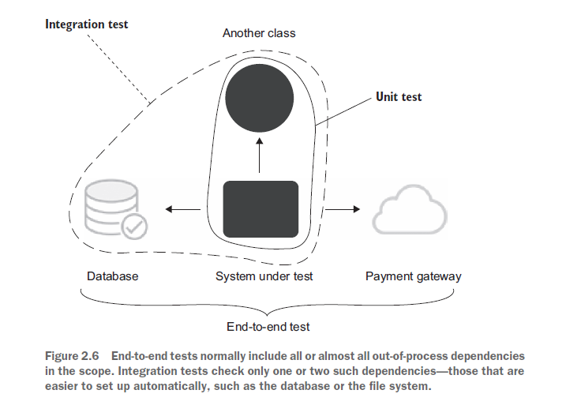

> Most of my unit tests spent a great deal of time setting up expectations and wiring up a complicated web of dependencies—all that, just to check that the three lines of code in my controller were correct. I couldn’t pinpoint what exactly was wrong with the tests, but my sense of proportion sent me unambiguous signals that something was off.

# Part 1

We’ll look at the definition of unit test. **A seemingly minor disagreement over this definition has led to the formation of two schools of unit testing**, which we’ll also dive into.

# Chapter 1. The goal of unit testing

You always have to strive to achieve the best return on the time you invest in unit testing, **minimizing the effort you put into tests and maximizing the benefits they provide.** Achieving both things isn’t an easy task.

## The current state of unit testing

For the past two decades, there’s been a push toward adopting unit testing. The push has been so successful that unit testing is now considered mandatory in most companies. The ratio between the production code and the test code could be anywhere between 1:1 and 1:3 (for each line of production code, there are one to three lines of test code). Sometimes, this ratio goes much higher than that, to a whopping 1:10.

Many projects have automated tests; they may even have a lot of them. But the existence of those tests often doesn’t provide the results the developers hope for. It can still take programmers a lot of effort to make progress in such projects. New features take forever to implement, new bugs constantly appear in the already implemented and accepted functionality, and the unit tests that are supposed to help don’t seem to mitigate this situation at all. They can even make it worse.

The situation in books isn’t any better; most of them focus on the basics of unit testing but don’t go much beyond that.

**Side note**:
What is an enterprise application?
An enterprise application is an application that aims at automating or assisting an organization’s inner processes. It can take many forms, but usually the characteristics of an enterprise software are
* High business logic complexity
* Long project lifespan
* Moderate amounts of data
* Low or moderate performance requirements

## The goal of unit testing

Before taking a deep dive into the topic of unit testing, let’s step back and consider the goal that unit testing helps you to achieve.

What is the goal of unit testing, then? **The goal is to enable sustainable growth of the software project. The term sustainable is key.** It’s quite easy to grow a project, especially when you start from scratch. It’s much harder to sustain this growth over time.


This phenomenon of quickly decreasing development speed is also known as software entropy. Entropy (the amount of disorder in a system) is a mathematical and scientific concept that can also apply to software systems.

In software, entropy manifests in the form of code that tends to deteriorate. Each time you change something in a code base, the amount of disorder in it, or entropy, increases. If left without proper care, such as constant cleaning and refactoring, the system becomes increasingly complex and disorganized. Fixing one bug introduces more bugs, and modifying one part of the software breaks several others. Sustainability and scalability are the keys. Tests allow you to maintain development
speed in the long run.

### What makes a good or bad test?

Although unit testing helps maintain project growth, it’s not enough to just write tests. Badly written tests still result in the same picture.

Bad tests do help to slow down code deterioration at the beginning: the decline in development speed is less prominent compared to the situation with no tests at all. But nothing really changes in the grand scheme of things. It might take longer for such a project to enter the stagnation phase, but stagnation is still inevitable.


Remember, not all tests are created equal. Some of them are valuable and contribute a lot to overall software quality. Others don’t. They raise false alarms, don’t help you catch regression errors, and are slow and difficult to maintain.

The test cost component is determined by the amount of time spent on various activities:
* Refactoring the test when you refactor the underlying code
* Running the test on each code change
* Dealing with false alarms raised by the test
* Spending time reading the test when you’re trying to understand how the underlying code behaves

It’s easy to create tests whose net value is close to zero or even is negative due to high maintenance costs.

**By extension, people often believe that the more tests, the better. This isn’t the case. Code is a liability, not an asset. The more code you introduce, the more you extend the surface area for potential bugs in your software, and the higher the project’s upkeep cost. It’s always better to solve problems with as little code as possible.**

## Using coverage metrics to measure test suite quality

Two most popular coverage metrics:
* code coverage
* branch coverage

**Tt’s detrimental for programmers to aim at a particular coverage number and why you can’t just rely on coverage metrics to determine the quality of your test suite.**

**If a metric shows that there’s too little coverage in your code base — say, only 10% — that’s a good indication that you are not testing enough. But the reverse isn’t true: even 100% coverage isn’t a guarantee that you have a good-quality test suite. A test suite that provides high coverage can still be of poor quality.**

### Understanding the code coverage metric


Let’s see an example to better understand how this works.
```
public static bool IsStringLong(string input)
{
  if (input.Length > 5) //Covered
    return true;        //Not covered
  return false;         //Covered
}
```

```
public void Test()
{
  bool result = IsStringLong("abc");
  Assert.Equal(false, result);
}
```

It’s easy to calculate the code coverage here. The total number of lines in the method is five (curly braces count, too). This gives us 4/5 = 0.8 = 80% code coverage. Now, what if I refactor the method and inline the unnecessary if statement, like this?
```
public static bool IsStringLong(string input)
{
  return input.Length > 5;
}

public void Test()
{
  bool result = IsStringLong("abc");
  Assert.Equal(false, result);
}
```

The code coverage now is 100%. But did I improve the test suite with this refactoring? Of course not.

### Understanding the branch coverage metric

Another coverage metric is called branch coverage. Branch coverage provides more precise results than code coverage because it helps cope with code coverage’s shortcomings. Instead of using the raw number of code lines, this metric focuses on control structures, such as if and switch statements. It shows how many of such control structures are traversed by at least one test in the suite:


Let’s take our previous example again:
```
public static bool IsStringLong(string input)
{
  return input.Length > 5;
}

public void Test()
{
  bool result = IsStringLong("abc");
  Assert.Equal(false, result);
}
```

There are two branches in the IsStringLong method: one for the situation when the length of the string argument is greater than five characters, and the other one when it’s not. The test covers only one of these branches, so the branch coverage metric is 1/2 = 0.5 = 50%.

### Problems with coverage metrics

Although the branch coverage metric yields better results than code coverage, you still can’t rely on either of them to determine the quality of your test suite, for two reasons:
* You can’t guarantee that the test verifies all the possible outcomes of the system under test.
* No coverage metric can take into account code paths in external libraries.

#### YOU CAN’T GUARANTEE THAT THE TEST VERIFIES ALL THE POSSIBLE OUTCOMES

The next listing shows another version of the IsStringLong method. It records the last result into a public WasLastStringLong property:
```
public static bool WasLastStringLong { get; private set; }
public static bool IsStringLong(string input)
{
  bool result = input.Length > 5;
  WasLastStringLong = result;
  return result;
}

public void Test()
{
  bool result = IsStringLong("abc");
  Assert.Equal(false, result);
}
```

The IsStringLong method now has two outcomes: an explicit one, which is encoded by the return value; and an implicit one, which is the new value of the property. And in spite of not verifying the second, implicit outcome, the coverage metrics would still show the same results: 100% for the code coverage and 50% for the branch coverage.

An extreme version of this situation with partially tested outcomes is assertion-free testing, which is when you write tests that don’t have any assertion statements in them whatsoever. Here’s an example of assertion-free testing.

```
public void Test()
{
  bool result1 = IsStringLong("abc");
  bool result2 = IsStringLong("abcdef");
}
```

This test has both code and branch coverage metrics showing 100%. But at the same time, it is completely useless because it doesn’t verify anything.

#### NO COVERAGE METRIC CAN TAKE INTO ACCOUNT CODE PATHS IN EXTERNAL LIBRARIES

The second problem with all coverage metrics is that they don’t take into account code paths that external libraries go through when the system under test calls methods on them. Let’s take the following example:
```
public static int Parse(string input)
{
  return int.Parse(input);
}

public void Test()
{
  int result = Parse("5");
  Assert.Equal(5, result);
}
```

The branch coverage metric shows 100%, and the test verifies all components of the method’s outcome. It has a single such component anyway — the return value. At the same time, this test is nowhere near being exhaustive. It doesn’t take into account the code paths the .NET Framework’s int.Parse method may go through.


### Aiming at a particular coverage number
 
At this point, I hope you can see that relying on coverage metrics to determine the quality of your test suite is not enough. The best way to view a coverage metric is as an indicator, not a goal in and of itself.

Likewise, targeting a specific coverage number creates a perverse incentive that goes against the goal of unit testing. Instead of focusing on testing the things that matter, people start to seek ways to attain this artificial target.

**Let me repeat myself: coverage metrics are a good negative indicator, but a bad positive one. Low coverage numbers — say, below 60% — are a certain sign of trouble. They mean there’s a lot of untested code in your code base. But high numbers don’t mean anything.**

## What makes a successful test suite?

How should you measure your test suite’s quality? The only reliable way is to evaluate each test in the suite individually, one by one. The point is that there’s no automated way to see how good your test suite is. You have to apply your personal judgment.

A successful test suite has the following properties:
* It’s integrated into the development cycle.
* It targets only the most important parts of your code base.
* It provides maximum value with minimum maintenance costs.

### It’s integrated into the development cycle

The only point in having automated tests is if you constantly use them. All tests should be integrated into the development cycle. Ideally, you should execute them on every code change, even the smallest one.

### It targets only the most important parts of your code base

Just as all tests are not created equal, not all parts of your code base are worth the same attention in terms of unit testing. The value the tests provide is not only in how those tests themselves are structured, but also in the code they verify. **It’s important to direct your unit testing efforts to the most critical parts of the system and verify the others only briefly or indirectly. In most applications, the most important part is the part that contains business logic— the domain model.** Testing business logic gives you the best return on your time investment. All other parts can be divided into three categories:
* Infrastructure code
* External services and dependencies, such as the database and third-party systems
* Code that glues everything together

For example, the infrastructure code may contain complex and important algorithms, so it would make sense to cover them with a lot of tests, too. **But in general, most of your attention should be spent on the domain model.**

### It provides maximum value with minimum maintenance costs

The most difficult part of unit testing is achieving maximum value with minimum maintenance costs. It’s not enough to incorporate tests into a build system, and it’s not enough to maintain high test coverage of the domain model. It’s also crucial to keep in the suite only the tests whose value exceeds their upkeep costs by a good margin. This last attribute can be divided in two:
* Recognizing a valuable test (and, by extension, a test of low value)
* Writing a valuable test

## Summary

Code tends to deteriorate. Each time you change something in a code base, the amount of disorder in it, or entropy, increases. Without proper care, such as constant cleaning and refactoring, the system becomes increasingly complex and disorganized. Tests help overturn this tendency. They act as a safety net — a tool that provides insurance against the vast majority of regressions.
* It’s important to write unit tests. It’s equally important to write good unit tests. The end result for projects with bad tests or no tests is the same: either stagnation or a lot of regressions with every new release.
* The goal of unit testing is to enable sustainable growth of the software project. A good unit test suite helps avoid the stagnation phase and maintain the development pace over time. With such a suite, you’re confident that your changes won’t lead to regressions. This, in turn, makes it easier to refactor the code or add new features.
* All tests are not created equal. Each test has a cost and a benefit component, and you need to carefully weigh one against the other. Keep only tests of positive net value in the suite, and get rid of all others. Both the application code and the test code are liabilities, not assets.
* The ability to unit test code is a good litmus test, but it only works in one direction. It’s a good negative indicator (if you can’t unit test the code, it’s of poor quality) but a bad positive one (the ability to unit test the code doesn’t guarantee its quality).
* Likewise, coverage metrics are a good negative indicator but a bad positive one. Low coverage numbers are a certain sign of trouble, but a high coverage number doesn’t automatically mean your test suite is of high quality.
* Branch coverage provides better insight into the completeness of the test suite but still can’t indicate whether the suite is good enough. It doesn’t take into account the presence of assertions, and it can’t account for code paths in thirdparty libraries that your code base uses.
* Imposing a particular coverage number creates a perverse incentive. It’s good to have a high level of coverage in core parts of your system, but it’s bad to make this high level a requirement.
* A successful test suite exhibits the following attributes:
  * It is integrated into the development cycle.
  * It targets only the most important parts of your code base.
  * It provides maximum value with minimum maintenance costs.
* The only way to achieve the goal of unit testing (that is, enabling sustainable project growth) is to
  * Learn how to differentiate between a good and a bad test.
  * Be able to refactor a test to make it more valuable.

# Chapter 2. What is a unit test?

As mentioned in chapter 1, there are a surprising number of nuances in the definition of a unit test. Those nuances are more important than you might think—so much so that the differences in interpreting them have led to two distinct views on how to approach unit testing. 
These views are known as the classical and the London schools of unit testing. The classical school is called “classical” because it’s how everyone originally approached unit testing and test-driven development.

## The definition of “unit test”

There are a lot of definitions of a unit test. Stripped of their non-essential bits, the definitions all have the following three most important attributes. A unit test is an automated test that
* Verifies a small piece of code (also known as a unit),
* Does it quickly,
* And does it in an isolated manner.

The first two attributes here are pretty non-controversial. There might be some dispute as to what exactly constitutes a fast unit test because it’s a highly subjective measure. But overall, it’s not that important. If your test suite’s execution time is good enough for you, it means your tests are quick enough. What people have vastly different opinions about is the third attribute. The isolation issue is the root of the differences between the classical and London schools of unit testing.

**Side note**.
The classical and London schools of unit testing.

Probably the most canonical book on the classical school is the one by Kent Beck: Test-Driven Development: By Example (Addison-Wesley Professional, 2002). 
London style throughout this book. The most prominent proponents of this approach are Steve Freeman and Nat Pryce. I recommend their book, Growing Object-Oriented Software, Guided by Tests (Addison-Wesley Professional, 2009). 

### The isolation issue: The London take

What does it mean to verify a piece of code—a unit—in an isolated manner? The London school describes it as isolating the system under test from its collaborators. It means if a class has a dependency on another class, or several classes, you need to replace all such dependencies with test doubles. This way, you can focus on the class under test exclusively by separating its behavior from any external influence.

Benefits:
* If the test fails, you know for sure which part of the code base is broken;
* Ability to split the object graph. Every class in it may have several immediate dependencies, each of which relies on dependencies of their own, and so on. Trying to test such an interconnected code base is hard without test doubles.

Let’s now look at some examples. Since the classical style probably looks more familiar to most people, I’ll show sample tests written in that style first and then rewrite them using the London approach.

Let’s say that we operate an online store. There’s just one simple use case in our sample application: a customer can purchase a product. When there’s enough inventory in the store, the purchase is deemed to be successful, and the amount of the product in the store is reduced by the purchase’s amount. If there’s not enough product, the purchase is not successful, and nothing happens in the store.

The tests are written in the classical style and use the typical three-phase sequence: arrange, act, and assert.

```
[Fact]
public void Purchase_succeeds_when_enough_inventory()
{
  // Arrange
  var store = new Store();
  store.AddInventory(Product.Shampoo, 10);
  var customer = new Customer();
  
  // Act
  bool success = customer.Purchase(store, Product.Shampoo, 5);

  // Assert
  Assert.True(success);
  Assert.Equal(5, store.GetInventory(Product.Shampoo)); //Reduces the product amount in the store by five
}

[Fact]
public void Purchase_fails_when_not_enough_inventory()
{
  // Arrange
  var store = new Store();
  store.AddInventory(Product.Shampoo, 10);
  var customer = new Customer();
  
  // Act
  bool success = customer.Purchase(store, Product.Shampoo, 15);
  
  // Assert
  Assert.False(success);
  Assert.Equal(10, store.GetInventory(Product.Shampoo)); //The product amount in the store remains unchanged
}

public enum Product 
{
  Shampoo, Book
}
```

During the arrange phase, the tests put together two kinds of objects: the system under test (SUT) and one collaborator. In this case, Customer is the SUT and Store is the collaborator. We need the collaborator for two reasons:
* To get the method under test to compile, because customer.Purchase() requires a Store instance as an argument
* For the assertion phase, since one of the results of customer.Purchase() is a potential decrease in the product amount in the store

This code is an example of the classical style of unit testing: the test doesn’t replace the collaborator (the Store class) but rather uses a production-ready instance of it.

Let’s now modify the example toward the London style. I’ll take the same tests and replace the Store instances with test doubles—specifically, mocks.

```
[Fact]
public void Purchase_succeeds_when_enough_inventory()
{
	// Arrange
	var storeMock = new Mock<IStore>();
	storeMock
	.Setup(x => x.HasEnoughInventory(Product.Shampoo, 5))
	.Returns(true);
	var customer = new Customer();

	// Act
	bool success = customer.Purchase(storeMock.Object, Product.Shampoo, 5);
	
	// Assert
	Assert.True(success);
	storeMock.Verify(x => x.RemoveInventory(Product.Shampoo, 5),Times.Once);

[Fact]
public void Purchase_fails_when_not_enough_inventory()
{
	// Arrange
	var storeMock = new Mock<IStore>();
	storeMock
	.Setup(x => x.HasEnoughInventory(Product.Shampoo, 5))
	.Returns(false);
	var customer = new Customer();
	
	// Act
	bool success = customer.Purchase(storeMock.Object, Product.Shampoo, 5);
	
	// Assert
	Assert.False(success);
	storeMock.Verify(x => x.RemoveInventory(Product.Shampoo, 5),Times.Never);
}
```

Note how different these tests are from those written in the classical style:
* In arrange phase it's not longer a normal class, but mocked one;
* Furthermore, instead of modifying the state of Store by adding a shampoo inventory to it, we directly tell the mock how to respond to calls to HasEnoughInventory().
* The assertion phase has changed too, and that’s where the key difference lies. We still check the output from customer.Purchase as before, but the way we verify that the customer did the right thing to the store is different. Previously, we did that by asserting against the store’s state. Now, we examine the interactions between Customer and Store: the tests check to see if the customer made the correct call on the store.

### The isolation issue: The classical take

As I mentioned earlier, there’s another way to interpret the isolation attribute — the classical way. In the classical approach, it’s not the code that needs to be tested in an isolated manner. **Instead, unit tests themselves should be run in isolation from each other.** That way, you can run the tests in parallel, sequentially, and in any order, whatever fits you best, and they still won’t affect each other’s outcome.

This alternative view of isolation also leads to a different take on what constitutes a unit (a small piece of code). A unit doesn’t necessarily have to be limited to a class. You can just as well unit test a group of classes, as long as none of them is a shared dependency.

A **shared dependency** is a dependency that is shared between tests and provides means for those tests to affect each other’s outcome. A typical example of shared dependencies is a static mutable field. A change to such a field is visible across all unit tests running within the same process. A database is another typical example of a shared dependency.

## The classical and London schools of unit testing

As you can see, the root of the differences between the London and classical schools is the isolation attribute. The London school views it as isolation of the system under test from its collaborators, whereas the classical school views it as isolation of unit tests themselves from each other. This seemingly minor difference has led to a vast disagreement about how to approach unit testing, which, as you already know, produced the two schools of thought. Overall, the disagreement between the schools spans three major topics:
* The isolation requirement
* What constitutes a piece of code under test (a unit)
* Handling dependencies


### How the classical and London schools handle dependencies

Note that despite the ubiquitous use of test doubles, the London school still allows for using some dependencies in tests as-is. The litmus test here is whether a dependency
is mutable. It’s fine not to substitute objects that don’t ever change — immutable objects.
And you saw in the earlier examples that, when I refactored the tests toward the London style, I didn’t replace the Product instances with mocks but rather used the real objects.


Figure 2.4 shows the categorization of dependencies and how both schools of unit testing treat them. A dependency can be either shared or private. A private dependency, in turn, can be either mutable or immutable. In the latter case, it is called a value object. For example, a database is a shared dependency—its internal state is shared across all automated tests (that don’t replace it with a test double). A Store instance is a private dependency that is mutable. And a Product instance (or an instance of a number 5, for that matter) is an example of a private dependency that is immutable—a value object.

## Contrasting the classical and London schools of unit testing

To reiterate, the main difference between the classical and London schools is in how they treat the isolation issue in the definition of a unit test. This, in turn, spills over to the treatment of a unit—the thing that should be put under test—and the approach to handling dependencies.
As I mentioned previously, I prefer the classical school of unit testing. It tends to produce tests of higher quality and thus is better suited for achieving the ultimate goal of unit testing, which is the sustainable growth of your project. **The reason is fragility: tests that use mocks tend to be more brittle than classical tests.**
For now, let’s take the main selling points of the London school and evaluate them one by one:
* **Better granularity**. The tests are fine-grained and check only one class at a time.
* **It’s easier to unit test a larger graph of interconnected classes**. Since all collaborators are replaced by test doubles, you don’t need to worry about them at the time of writing the test.
* **If a test fails, you know for sure which functionality has failed**. Without the class’s collaborators, there could be no suspects other than the class under test itself. Of course, there may still be situations where the system under test uses a value object and it’s the change in this value object that makes the test fail. But these cases aren’t that frequent because all other dependencies are eliminated in tests.

### Unit testing one class at a time

The point about better granularity relates to the discussion about what constitutes a unit in unit testing. The London school considers a class as such a unit.

Tests shouldn’t verify units of code. Rather, they should verify units of behavior: something that is meaningful for the problem domain and, ideally, something that a business person can recognize as useful. The number of classes it takes to implement such a unit of behavior is irrelevant. The unit could span across multiple classes or only one class, or even take up just a tiny method.

**A test should tell a story about the problem your code helps to solve, and this story should be cohesive and meaningful to a non-programmer.** For instance, this is an example of a cohesive story: When I call my dog, he comes right to me. 
Now compare it to the following: When I call my dog, he moves his front left leg first, then the front right leg, his head turns, the tail start wagging.

The second story makes much less sense. What’s the purpose of all those movements? Is the dog coming to me? Or is he running away? You can’t tell. This is what your tests start to look like when you target individual classes (the dog’s legs, head, and tail) instead of the actual behavior (the dog coming to his master).

### Unit testing a large graph of interconnected classes

The use of mocks in place of real collaborators can make it easier to test a class — especially when there’s a complicated dependency graph, where the class under test has dependencies, each of which relies on dependencies of its own, and so on, several layers deep. With test doubles, you can substitute the class’s immediate dependencies and thus break up the graph, which can significantly reduce the amount of preparation you have to do in a unit test. If you follow the classical school, you have to re-create the full object graph (with the exception of shared dependencies) just for the sake of setting up the system under test, which can be a lot of work.
Although this is all true, this line of reasoning focuses on the wrong problem. Instead of finding ways to test a large, complicated graph of interconnected classes, you should focus on not having such a graph of classes in the first place. More often than not, a large class graph is a result of a code design problem.

### Revealing the precise bug location

It’s a valid concern, but I don’t see it as a big problem. If you run your tests regularly (ideally, after each source code change), then you know what caused the bug — it’s what you edited last, so it’s not that difficult to find the issue.

### Other differences between the classical and London schools

The most crucial distinction between the schools is the issue of over-specification: that is, coupling the tests to the SUT’s implementation details. The London style
tends to produce tests that couple to the implementation more often than the classical style. And this is the main objection against the ubiquitous use of mocks and the London style in general.

## Integration tests in the two schools

The London and classical schools also diverge in their definition of an integration test. This disagreement flows naturally from the difference in their views on the isolation issue.
The London school considers any test that uses a real collaborator object an integration test. Most of the tests written in the classical style would be deemed integration tests by the London school proponents. The Shop example is a typical unit test from the classical perspective, but it’s an integration test for a follower of the London school.

Now that I’ve clarified what the first and third attributes mean, I’ll redefine them from the point of view of the classical school. A unit test is a test that
. Verifies a single **unit of behavior**,
. Does it quickly,
. And does it in isolation **from other tests**.

**An integration test, then, is a test that doesn’t meet one of these criteria.** For example, a test that reaches out to a shared dependency — say, a database — can’t run in isolation from other tests. A change in the database’s state introduced by one test would alter the outcome of all other tests that rely on the same database if run in parallel. You’d have to take additional steps to avoid this interference. In particular, you would have to run such tests sequentially, so that each test would wait its turn to work with the shared dependency.
Similarly, an outreach to an out-of-process dependency makes the test slow. A call to a database adds hundreds of milliseconds, potentially up to a second, of additional execution time. Milliseconds might not seem like a big deal at first, but when your test suite grows large enough, every second counts.

### End-to-end tests are a subset of integration tests

In short, an **integration test** is a test that verifies that your code works in integration with shared dependencies, out-of-process dependencies, or code developed by other teams in the organization. There’s also a separate notion of an end-to-end test. End-to-end tests are a subset of integration tests. They, too, check to see how your code works with out-of-process dependencies. The difference between an end-to-end test and an integration test is that end-to-end tests usually include more of such dependencies.
The line is blurred at times, but in general, an **integration test works with only one or two out-of-process dependencies.** On the other hand, an **end-to-end test works with all out-of-process dependencies, or with the vast majority of them.**

Let’s say your application works with three out-of-process dependencies: a database, the file system, and a payment gateway. A typical integration test would include only the database and file system in scope and use a test double to replace the payment gateway. That’s because you have full control over the database and file system, and thus can easily bring them to the required state in tests, whereas you don’t have the same degree of control over the payment gateway. With the payment gateway, you may need to contact the payment processor organization to set up a special test account. You might also need to check that account from time to time to manually clean up all the payment charges left over from the past test executions.
Since end-to-end tests are the most expensive in terms of maintenance, it’s better to run them late in the build process, after all the unit and integration tests have
passed. You may possibly even run them only on the build server, not on individual developers’ machines.



## Summary

* Throughout this chapter, I’ve refined the definition of a unit test:
  – A unit test verifies a single unit of behavior,
  – Does it quickly,
  – And does it in isolation from other tests.
* The isolation issue is disputed the most. The dispute led to the formation of two schools of unit testing: the classical (Detroit) school, and the London (mockist) school. This difference of opinion affects the view of what constitutes a unit and the treatment of the system under test’s (SUT’s) dependencies.
  – The London school states that the units under test should be isolated from each other. A unit under test is a unit of code, usually a class. All of its dependencies, except immutable dependencies, should be replaced with test doubles in tests.
  – The classical school states that the unit tests need to be isolated from each other, not units. Also, a unit under test is a unit of behavior, not a unit of code. Thus, only shared dependencies should be replaced with test doubles. Shared dependencies are dependencies that provide means for tests to affect each other’s execution flow.
* The London school provides the benefits of better granularity, the ease of testing large graphs of interconnected classes, and the ease of finding which functionality contains a bug after a test failure.
* The benefits of the London school look appealing at first. However, they introduce several issues. First, the focus on classes under test is misplaced: tests should verify units of behavior, not units of code. Furthermore, the inability to unit test a piece of code is a strong sign of a problem with the code design. The use of test doubles doesn’t fix this problem, but rather only hides it. And finally, while the ease of determining which functionality contains a bug after a test failure is helpful, it’s not that big a deal because you often know what caused the bug anyway — it’s what you edited last.
* The biggest issue with the London school of unit testing is the problem of overspecification — coupling tests to the SUT’s implementation details.
* An integration test is a test that doesn’t meet at least one of the criteria for a unit test. End-to-end tests are a subset of integration tests; they verify the system from the end user’s point of view. End-to-end tests reach out directly to all or almost all out-of-process dependencies your application works with.
* For a canonical book about the classical style, I recommend Kent Beck’s Test-Driven Development: By Example. For more on the London style, see Growing Object- Oriented Software, Guided by Tests, by Steve Freeman and Nat Pryce. For further reading about working with dependencies, I recommend Dependency Injection: Principles, Practices, Patterns by Steven van Deursen and Mark Seemann.


